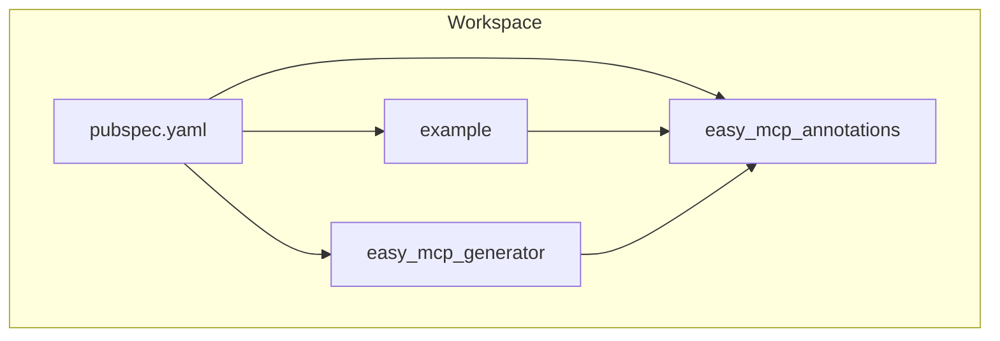
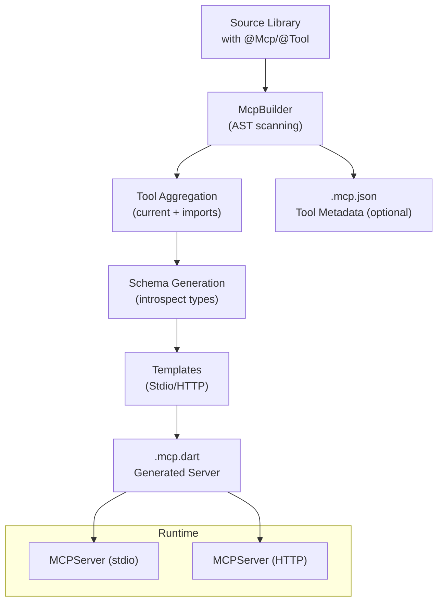
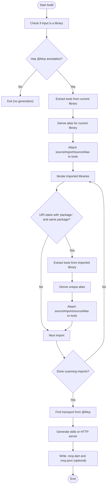
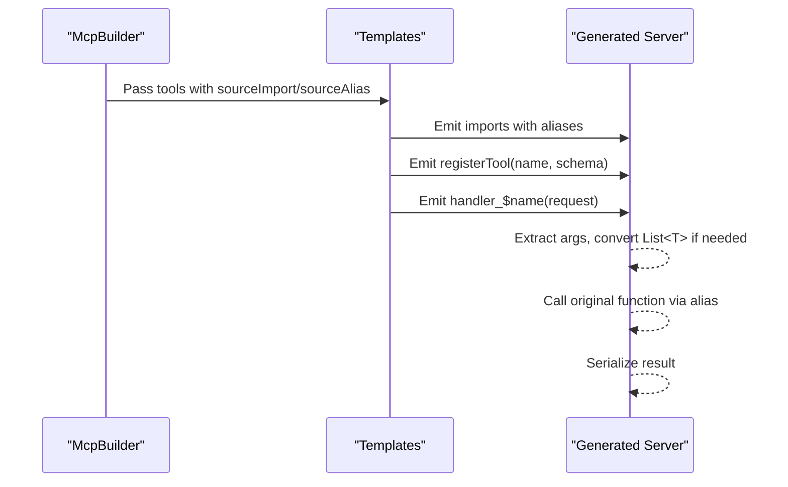
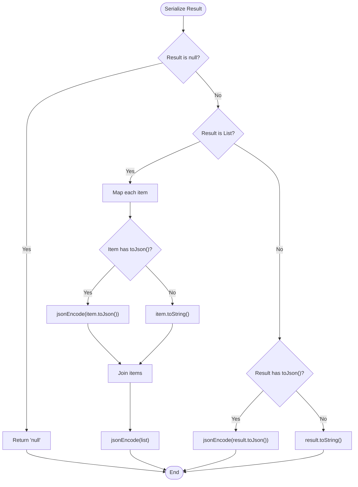
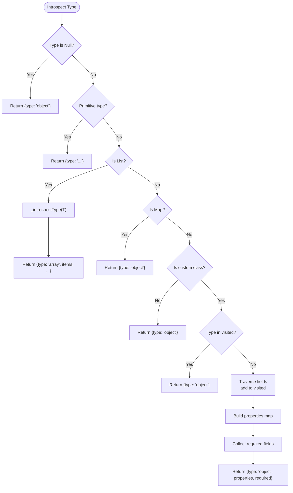
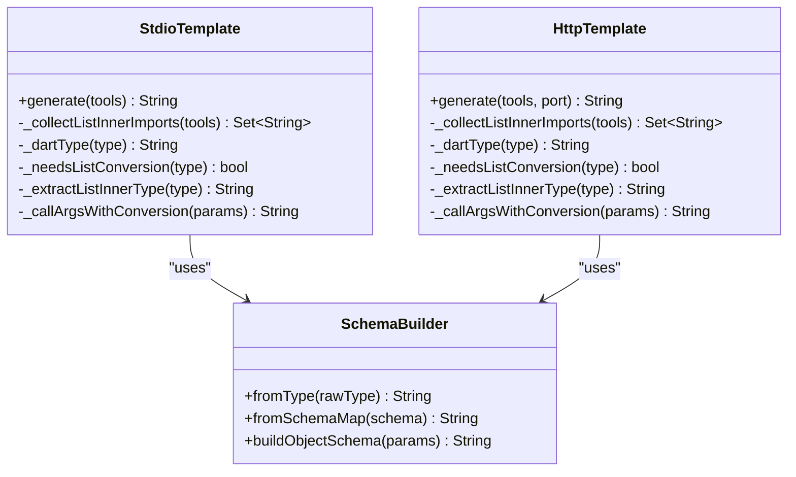
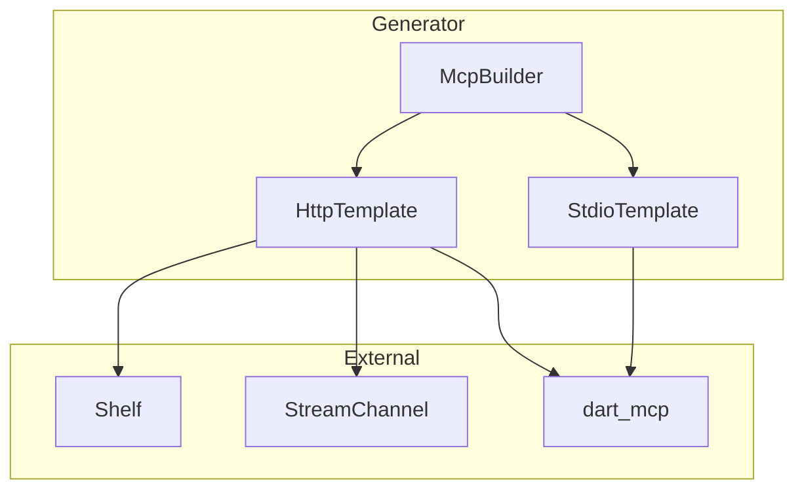
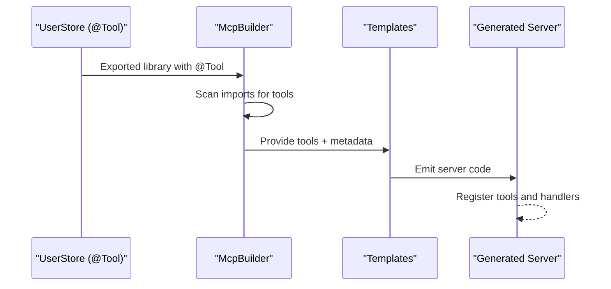
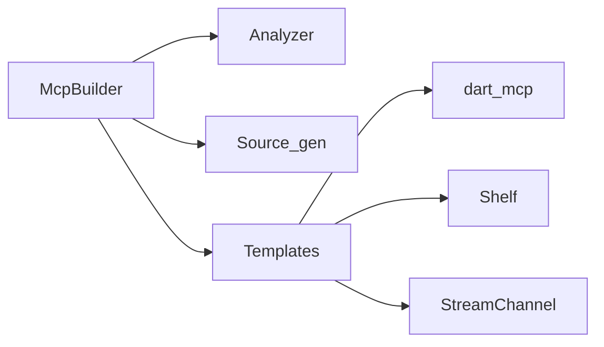

# Advanced Features

<cite>
**Referenced Files in This Document**
- [README.md](file://README.md)
- [pubspec.yaml](file://pubspec.yaml)
- [packages/easy_mcp_annotations/lib/mcp_annotations.dart](file://packages/easy_mcp_annotations/lib/mcp_annotations.dart)
- [packages/easy_mcp_generator/lib/mcp_generator.dart](file://packages/easy_mcp_generator/lib/mcp_generator.dart)
- [packages/easy_mcp_generator/lib/builder/mcp_builder.dart](file://packages/easy_mcp_generator/lib/builder/mcp_builder.dart)
- [packages/easy_mcp_generator/lib/builder/schema_builder.dart](file://packages/easy_mcp_generator/lib/builder/schema_builder.dart)
- [packages/easy_mcp_generator/lib/builder/templates.dart](file://packages/easy_mcp_generator/lib/builder/templates.dart)
- [packages/easy_mcp_generator/test/mcp_builder_test.dart](file://packages/easy_mcp_generator/test/mcp_builder_test.dart)
- [packages/easy_mcp_generator/test/schema_builder_test.dart](file://packages/easy_mcp_generator/test/schema_builder_test.dart)
- [example/bin/example.dart](file://example/bin/example.dart)
- [example/lib/src/user.dart](file://example/lib/src/user.dart)
- [example/lib/src/user_store.dart](file://example/lib/src/user_store.dart)
</cite>

## Table of Contents
1. [Introduction](#introduction)
2. [Project Structure](#project-structure)
3. [Core Components](#core-components)
4. [Architecture Overview](#architecture-overview)
5. [Detailed Component Analysis](#detailed-component-analysis)
6. [Dependency Analysis](#dependency-analysis)
7. [Performance Considerations](#performance-considerations)
8. [Troubleshooting Guide](#troubleshooting-guide)
9. [Conclusion](#conclusion)
10. [Appendices](#appendices)

## Introduction
This document focuses on advanced features of Easy MCP for production-ready implementations. It covers cross-library tool discovery, dependency aggregation, and tool registration across multiple packages; custom type serialization strategies for complex objects; JSON encoding/decoding customization and cycle detection handling; advanced template customization options; plugin system extensions; integration with external frameworks; performance optimization techniques; memory management considerations; scalability patterns; advanced configuration options; environment-specific settings; deployment strategies; debugging complex scenarios; logging integration; monitoring approaches; and extensibility points for custom transports, serialization strategies, and build system integration.

## Project Structure
The workspace is a Dart monorepo managed by Melos with three primary areas:
- Annotations package defining MCP-related annotations
- Generator package implementing AST-based parsing and code generation
- Example package demonstrating usage with annotated tools and stores

**Diagram sources**
- [pubspec.yaml:1-64](file://pubspec.yaml#L1-L64)

**Section sources**
- [pubspec.yaml:1-64](file://pubspec.yaml#L1-L64)
- [README.md:1-120](file://README.md#L1-L120)

## Core Components
- Annotations: Define transport mode and tool metadata for code generation.
- Generator: Processes annotated libraries, scans imports, aggregates tools, generates stdio or HTTP server code, and optionally emits JSON metadata.
- Templates: Produce server scaffolding, tool registration, handler functions, and serialization logic.
- Schema Builder: Converts parameter metadata into typed schema expressions for validation.
- Example: Demonstrates annotated tools and stores, showcasing cross-library imports and tool discovery.

Key responsibilities:
- Cross-library tool discovery: Scans current library and package-local imports to collect tools.
- Dependency aggregation: Derives import aliases and collects per-tool source imports.
- Transport selection: Chooses stdio or HTTP based on annotation.
- Schema generation: Maps Dart types to JSON Schema with cycle detection.
- Serialization: Serializes results using JSON encoding and custom object serialization hooks.

**Section sources**
- [packages/easy_mcp_annotations/lib/mcp_annotations.dart:1-49](file://packages/easy_mcp_annotations/lib/mcp_annotations.dart#L1-L49)
- [packages/easy_mcp_generator/lib/mcp_generator.dart:1-14](file://packages/easy_mcp_generator/lib/mcp_generator.dart#L1-L14)
- [packages/easy_mcp_generator/lib/builder/mcp_builder.dart:1-567](file://packages/easy_mcp_generator/lib/builder/mcp_builder.dart#L1-L567)
- [packages/easy_mcp_generator/lib/builder/schema_builder.dart:1-99](file://packages/easy_mcp_generator/lib/builder/schema_builder.dart#L1-L99)
- [packages/easy_mcp_generator/lib/builder/templates.dart:1-578](file://packages/easy_mcp_generator/lib/builder/templates.dart#L1-L578)
- [example/lib/src/user_store.dart:1-144](file://example/lib/src/user_store.dart#L1-L144)

## Architecture Overview
The generator runs during the build phase, using analyzer to extract annotations and types from the target library and its package-local imports. It produces:
- A server implementation file (.mcp.dart) with tool registrations and handlers
- Optionally a JSON metadata file (.mcp.json) containing tool schemas
- Transport-specific templates for stdio or HTTP

**Diagram sources**
- [packages/easy_mcp_generator/lib/builder/mcp_builder.dart:18-52](file://packages/easy_mcp_generator/lib/builder/mcp_builder.dart#L18-L52)
- [packages/easy_mcp_generator/lib/builder/templates.dart:6-175](file://packages/easy_mcp_generator/lib/builder/templates.dart#L6-L175)
- [packages/easy_mcp_generator/lib/builder/templates.dart:269-486](file://packages/easy_mcp_generator/lib/builder/templates.dart#L269-L486)

## Detailed Component Analysis

### Cross-Library Tool Discovery and Dependency Aggregation
The builder scans the current library and package-local imports to discover tools. It:
- Identifies libraries within the same package by inspecting URIs
- Derives unique import aliases for tools and ensures uniqueness
- Attaches source import and alias metadata to each tool for template rendering
- Skips non-package URIs (e.g., dart: core) and foreign packages

**Diagram sources**
- [packages/easy_mcp_generator/lib/builder/mcp_builder.dart:115-166](file://packages/easy_mcp_generator/lib/builder/mcp_builder.dart#L115-L166)
- [packages/easy_mcp_generator/lib/builder/mcp_builder.dart:134-163](file://packages/easy_mcp_generator/lib/builder/mcp_builder.dart#L134-L163)
- [packages/easy_mcp_generator/lib/builder/mcp_builder.dart:187-199](file://packages/easy_mcp_generator/lib/builder/mcp_builder.dart#L187-L199)

**Section sources**
- [packages/easy_mcp_generator/lib/builder/mcp_builder.dart:112-166](file://packages/easy_mcp_generator/lib/builder/mcp_builder.dart#L112-L166)
- [packages/easy_mcp_generator/lib/builder/mcp_builder.dart:187-199](file://packages/easy_mcp_generator/lib/builder/mcp_builder.dart#L187-L199)

### Tool Registration Across Multiple Packages
During generation, tools are registered with the server using the derived source aliases. The templates:
- Import each source module with an alias
- Register tools with their computed input schemas
- Generate handler functions that extract arguments, convert List parameters with custom inner types, and call the underlying functions

**Diagram sources**
- [packages/easy_mcp_generator/lib/builder/templates.dart:27-43](file://packages/easy_mcp_generator/lib/builder/templates.dart#L27-L43)
- [packages/easy_mcp_generator/lib/builder/templates.dart:45-117](file://packages/easy_mcp_generator/lib/builder/templates.dart#L45-L117)
- [packages/easy_mcp_generator/lib/builder/templates.dart:290-306](file://packages/easy_mcp_generator/lib/builder/templates.dart#L290-L306)
- [packages/easy_mcp_generator/lib/builder/templates.dart:308-380](file://packages/easy_mcp_generator/lib/builder/templates.dart#L308-L380)

**Section sources**
- [packages/easy_mcp_generator/lib/builder/templates.dart:14-152](file://packages/easy_mcp_generator/lib/builder/templates.dart#L14-L152)
- [packages/easy_mcp_generator/lib/builder/templates.dart:451-484](file://packages/easy_mcp_generator/lib/builder/templates.dart#L451-L484)

### Custom Type Serialization Strategies and JSON Encoding/Decoding
The generator supports custom object serialization via a toJson contract:
- Handlers serialize results by checking for a toJson method on objects and lists
- Non-serializable results fall back to toString
- For List parameters with custom inner types, the templates generate conversions using fromJson on the inner type

**Diagram sources**
- [packages/easy_mcp_generator/lib/builder/templates.dart:154-173](file://packages/easy_mcp_generator/lib/builder/templates.dart#L154-L173)
- [packages/easy_mcp_generator/lib/builder/templates.dart:465-484](file://packages/easy_mcp_generator/lib/builder/templates.dart#L465-L484)

**Section sources**
- [packages/easy_mcp_generator/lib/builder/templates.dart:154-173](file://packages/easy_mcp_generator/lib/builder/templates.dart#L154-L173)
- [packages/easy_mcp_generator/lib/builder/templates.dart:465-484](file://packages/easy_mcp_generator/lib/builder/templates.dart#L465-L484)

### Cycle Detection Handling in Complex Objects
The type introspection includes cycle detection to prevent infinite recursion when generating schemas for self-referencing or mutually referencing types:
- A visited set tracks encountered type names during traversal
- If a cycle is detected, the property is emitted as a generic object type
- Required fields are inferred from non-nullable Dart types

**Diagram sources**
- [packages/easy_mcp_generator/lib/builder/mcp_builder.dart:309-411](file://packages/easy_mcp_generator/lib/builder/mcp_builder.dart#L309-L411)

**Section sources**
- [packages/easy_mcp_generator/lib/builder/mcp_builder.dart:309-411](file://packages/easy_mcp_generator/lib/builder/mcp_builder.dart#L309-L411)

### Advanced Template Customization Options
Templates support:
- Per-tool source imports with unique aliases
- Automatic schema generation via SchemaBuilder
- Argument extraction and type casting
- Conditional conversion for List<T> where T is a custom type
- Transport-specific server scaffolding (stdio vs HTTP)
- Bidirectional communication bridge for HTTP transport using StreamChannel

**Diagram sources**
- [packages/easy_mcp_generator/lib/builder/templates.dart:6-266](file://packages/easy_mcp_generator/lib/builder/templates.dart#L6-L266)
- [packages/easy_mcp_generator/lib/builder/templates.dart:269-578](file://packages/easy_mcp_generator/lib/builder/templates.dart#L269-L578)
- [packages/easy_mcp_generator/lib/builder/schema_builder.dart:1-99](file://packages/easy_mcp_generator/lib/builder/schema_builder.dart#L1-L99)

**Section sources**
- [packages/easy_mcp_generator/lib/builder/templates.dart:6-266](file://packages/easy_mcp_generator/lib/builder/templates.dart#L6-L266)
- [packages/easy_mcp_generator/lib/builder/templates.dart:269-578](file://packages/easy_mcp_generator/lib/builder/templates.dart#L269-L578)
- [packages/easy_mcp_generator/lib/builder/schema_builder.dart:1-99](file://packages/easy_mcp_generator/lib/builder/schema_builder.dart#L1-L99)

### Plugin System Extensions and External Framework Integration
- Transport abstraction: The generator supports stdio and HTTP transports, enabling integration with external frameworks by swapping templates or extending the transport layer.
- External framework compatibility: The HTTP template integrates Shelf for routing and StreamChannel for bidirectional communication, allowing embedding in larger HTTP ecosystems.
- Build system integration: The generator is exposed as a builder and integrated into the build_runner lifecycle via the exported library.

**Diagram sources**
- [packages/easy_mcp_generator/lib/mcp_generator.dart:1-14](file://packages/easy_mcp_generator/lib/mcp_generator.dart#L1-L14)
- [packages/easy_mcp_generator/lib/builder/templates.dart:386-486](file://packages/easy_mcp_generator/lib/builder/templates.dart#L386-L486)

**Section sources**
- [packages/easy_mcp_generator/lib/mcp_generator.dart:1-14](file://packages/easy_mcp_generator/lib/mcp_generator.dart#L1-L14)
- [packages/easy_mcp_generator/lib/builder/templates.dart:386-486](file://packages/easy_mcp_generator/lib/builder/templates.dart#L386-L486)

### Example Usage Patterns
The example demonstrates:
- Annotated tools in a store class
- Cross-library imports and tool discovery
- Transport selection via annotation
- Persistent storage and JSON serialization

**Diagram sources**
- [example/lib/src/user_store.dart:55-142](file://example/lib/src/user_store.dart#L55-L142)
- [packages/easy_mcp_generator/lib/builder/mcp_builder.dart:115-166](file://packages/easy_mcp_generator/lib/builder/mcp_builder.dart#L115-L166)
- [packages/easy_mcp_generator/lib/builder/templates.dart:14-152](file://packages/easy_mcp_generator/lib/builder/templates.dart#L14-L152)

**Section sources**
- [example/lib/src/user_store.dart:55-142](file://example/lib/src/user_store.dart#L55-L142)
- [example/bin/example.dart:6-67](file://example/bin/example.dart#L6-L67)

## Dependency Analysis
The generator depends on:
- Analyzer for AST-based parsing
- Source_gen for annotation processing
- dart_mcp for server runtime
- Shelf for HTTP transport
- StreamChannel for bridging HTTP and MCP streams

**Diagram sources**
- [packages/easy_mcp_generator/lib/builder/mcp_builder.dart:1-11](file://packages/easy_mcp_generator/lib/builder/mcp_builder.dart#L1-L11)
- [packages/easy_mcp_generator/lib/builder/templates.dart:386-486](file://packages/easy_mcp_generator/lib/builder/templates.dart#L386-L486)

**Section sources**
- [packages/easy_mcp_generator/lib/builder/mcp_builder.dart:1-11](file://packages/easy_mcp_generator/lib/builder/mcp_builder.dart#L1-L11)
- [packages/easy_mcp_generator/lib/builder/templates.dart:386-486](file://packages/easy_mcp_generator/lib/builder/templates.dart#L386-L486)

## Performance Considerations
- AST scanning cost: The builder traverses libraries and imports; keep the number of annotated tools manageable.
- Schema generation: Type introspection with cycle detection adds overhead; avoid excessively deep or recursive object graphs.
- Serialization: Prefer lightweight serialization (toString fallback) for large payloads; leverage toJson for structured content.
- Memory management: Avoid retaining large caches; the example uses an in-memory cache that can be invalidated as needed.
- Scalability: Use HTTP transport for horizontal scaling and load balancing; stdio is simpler but less scalable.

[No sources needed since this section provides general guidance]

## Troubleshooting Guide
Common issues and resolutions:
- No tools discovered: Ensure the library has an @Mcp annotation and contains @Tool-annotated functions or methods.
- Cross-library imports not included: Verify imports originate from the same package (package: URIs) and are not foreign packages.
- Serialization errors: Implement toJson for custom types; otherwise results fall back to toString.
- HTTP transport problems: Confirm Shelf and StreamChannel are available; ensure the server listens on the expected port.
- JSON metadata missing: Enable the generateJson option in @Mcp to emit .mcp.json.

**Section sources**
- [packages/easy_mcp_generator/lib/builder/mcp_builder.dart:27-33](file://packages/easy_mcp_generator/lib/builder/mcp_builder.dart#L27-L33)
- [packages/easy_mcp_generator/lib/builder/mcp_builder.dart:45-51](file://packages/easy_mcp_generator/lib/builder/mcp_builder.dart#L45-L51)
- [packages/easy_mcp_generator/lib/builder/templates.dart:154-173](file://packages/easy_mcp_generator/lib/builder/templates.dart#L154-L173)
- [packages/easy_mcp_generator/lib/builder/templates.dart:465-484](file://packages/easy_mcp_generator/lib/builder/templates.dart#L465-L484)

## Conclusion
Easy MCP’s advanced features enable robust, production-ready MCP servers with cross-library tool discovery, flexible serialization, and transport abstraction. By leveraging the generator’s AST-based parsing, schema generation, and templating system, teams can scale tool catalogs, integrate with external frameworks, and maintain high performance and reliability.

[No sources needed since this section summarizes without analyzing specific files]

## Appendices

### Advanced Configuration Options
- Transport selection: Choose stdio or HTTP via @Mcp transport parameter.
- JSON metadata generation: Enable generateJson to produce tool schemas.
- Environment-specific settings: Adjust HTTP port in templates or pass environment variables to configure runtime behavior.

**Section sources**
- [packages/easy_mcp_annotations/lib/mcp_annotations.dart:25-30](file://packages/easy_mcp_annotations/lib/mcp_annotations.dart#L25-L30)
- [packages/easy_mcp_generator/lib/builder/mcp_builder.dart:45-51](file://packages/easy_mcp_generator/lib/builder/mcp_builder.dart#L45-L51)
- [packages/easy_mcp_generator/lib/builder/templates.dart:270](file://packages/easy_mcp_generator/lib/builder/templates.dart#L270)

### Deployment Strategies
- Build-time generation: Use build_runner to generate server code and metadata.
- Runtime transport: Deploy stdio servers for simplicity or HTTP servers behind reverse proxies for scalability.
- Monitoring: Integrate logging around handler execution and serialization failures.

**Section sources**
- [README.md:43-53](file://README.md#L43-L53)
- [packages/easy_mcp_generator/lib/builder/templates.dart:398-449](file://packages/easy_mcp_generator/lib/builder/templates.dart#L398-L449)

### Extensibility Points
- Custom transports: Extend templates to support additional transports beyond stdio and HTTP.
- Serialization strategies: Customize serialization logic in templates to support domain-specific encoders.
- Build system integration: Expose the builder via exported library and integrate with CI/CD pipelines.

**Section sources**
- [packages/easy_mcp_generator/lib/mcp_generator.dart:1-14](file://packages/easy_mcp_generator/lib/mcp_generator.dart#L1-L14)
- [packages/easy_mcp_generator/lib/builder/templates.dart:6-266](file://packages/easy_mcp_generator/lib/builder/templates.dart#L6-L266)
- [packages/easy_mcp_generator/lib/builder/templates.dart:269-578](file://packages/easy_mcp_generator/lib/builder/templates.dart#L269-L578)