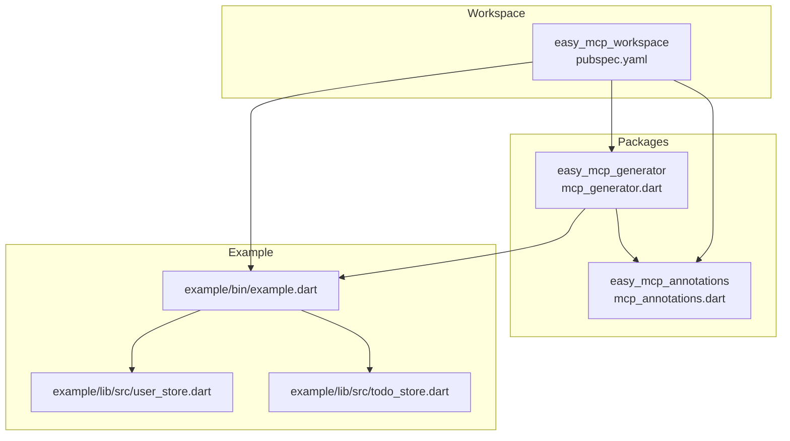
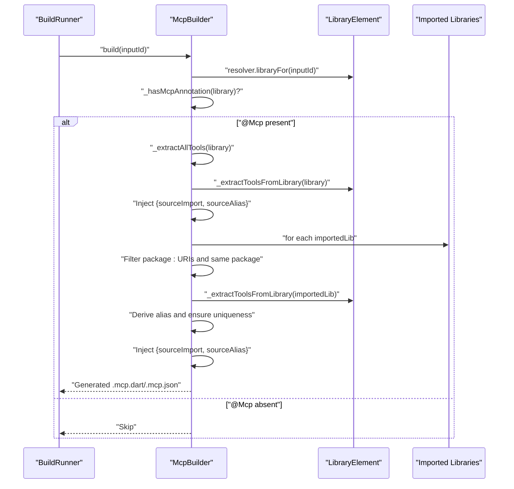
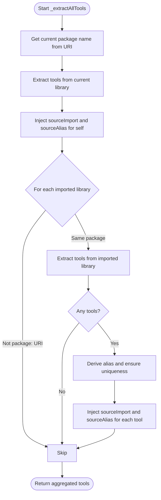
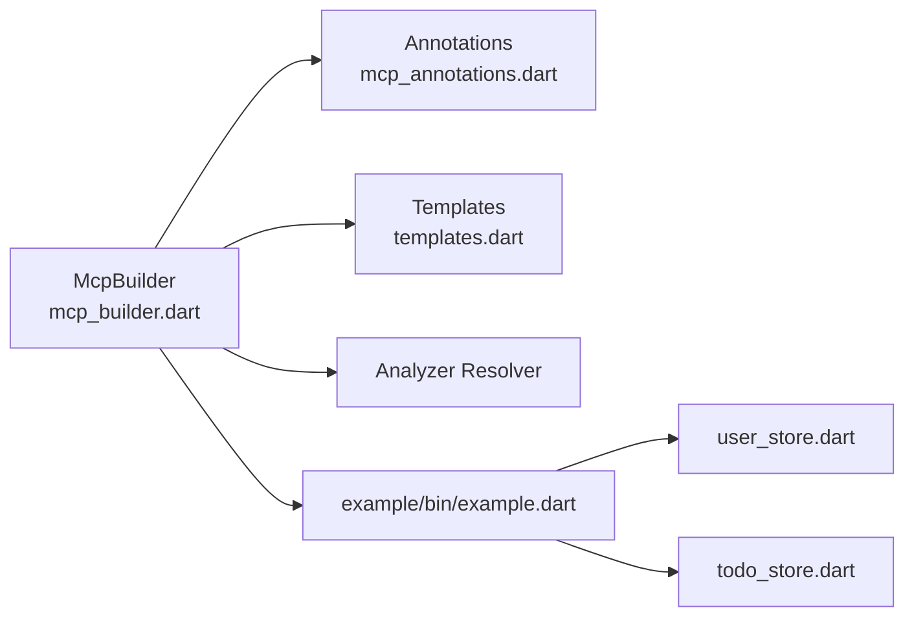

# Cross-Library Tool Discovery

<cite>
**Referenced Files in This Document**
- [README.md](file://README.md)
- [pubspec.yaml](file://pubspec.yaml)
- [mcp_annotations.dart](file://packages/easy_mcp_annotations/lib/mcp_annotations.dart)
- [mcp_builder.dart](file://packages/easy_mcp_generator/lib/builder/mcp_builder.dart)
- [templates.dart](file://packages/easy_mcp_generator/lib/builder/templates.dart)
- [mcp_generator.dart](file://packages/easy_mcp_generator/lib/mcp_generator.dart)
- [todo_store.dart](file://example/lib/src/todo_store.dart)
- [user_store.dart](file://example/lib/src/user_store.dart)
- [example.dart](file://example/bin/example.dart)
</cite>

## Table of Contents
1. [Introduction](#introduction)
2. [Project Structure](#project-structure)
3. [Core Components](#core-components)
4. [Architecture Overview](#architecture-overview)
5. [Detailed Component Analysis](#detailed-component-analysis)
6. [Dependency Analysis](#dependency-analysis)
7. [Performance Considerations](#performance-considerations)
8. [Troubleshooting Guide](#troubleshooting-guide)
9. [Conclusion](#conclusion)
10. [Appendices](#appendices)

## Introduction
This document explains the cross-library tool discovery mechanism used by the Easy MCP framework. It covers how the generator scans the current library and package-local imports to aggregate tools, how it identifies tools annotated with @Tool, how it derives unique aliases for tools from imported libraries, and how it parses package URIs to distinguish local imports from external dependencies. It also documents the sourceImport and sourceAlias metadata injection that tracks tool provenance, provides practical examples for organizing multi-package projects, outlines configuration options for controlling discovery scope, and offers troubleshooting guidance for import resolution and alias conflicts.

## Project Structure
The workspace is a Melos-managed Dart workspace with three main areas:
- packages/easy_mcp_annotations: Defines the @Mcp and @Tool annotations used to mark functions as MCP tools.
- packages/easy_mcp_generator: Contains the build-time generator that discovers tools, aggregates them, and generates server code.
- example: Demonstrates usage by annotating functions in separate libraries and exposing them via a single @Mcp entrypoint.

**Diagram sources**
- [pubspec.yaml:1-64](file://pubspec.yaml#L1-L64)
- [mcp_annotations.dart:1-107](file://packages/easy_mcp_annotations/lib/mcp_annotations.dart#L1-L107)
- [mcp_generator.dart:1-14](file://packages/easy_mcp_generator/lib/mcp_generator.dart#L1-L14)
- [example.dart:1-67](file://example/bin/example.dart#L1-L67)
- [user_store.dart:1-144](file://example/lib/src/user_store.dart#L1-L144)
- [todo_store.dart:1-236](file://example/lib/src/todo_store.dart#L1-L236)

**Section sources**
- [pubspec.yaml:1-64](file://pubspec.yaml#L1-L64)
- [README.md:1-120](file://README.md#L1-L120)

## Core Components
- Annotations: @Mcp and @Tool define transport mode and tool metadata. The generator uses these to decide whether to process a library and how to describe tools.
- Tool discovery: The generator inspects the current library and package-local imports for functions/methods annotated with @Tool.
- Alias derivation: Aliases ensure unique import names for tools originating from different libraries within the same package.
- Provenance metadata: Each discovered tool carries sourceImport (the library URI) and sourceAlias (the derived alias) to support template generation and runtime routing.
- Template generation: Templates consume tool metadata to generate server code with proper imports and handler dispatch using sourceAlias.

Key implementation references:
- Tool discovery and aggregation: [mcp_builder.dart:112-166](file://packages/easy_mcp_generator/lib/builder/mcp_builder.dart#L112-L166)
- Package URI parsing and alias derivation: [mcp_builder.dart:168-199](file://packages/easy_mcp_generator/lib/builder/mcp_builder.dart#L168-L199)
- Provenance injection: [mcp_builder.dart:127-131](file://packages/easy_mcp_generator/lib/builder/mcp_builder.dart#L127-L131), [mcp_builder.dart:158-161](file://packages/easy_mcp_generator/lib/builder/mcp_builder.dart#L158-L161)
- Template consumption of provenance: [templates.dart:14-25](file://packages/easy_mcp_generator/lib/builder/templates.dart#L14-L25), [templates.dart:277-288](file://packages/easy_mcp_generator/lib/builder/templates.dart#L277-L288)

**Section sources**
- [mcp_annotations.dart:39-106](file://packages/easy_mcp_annotations/lib/mcp_annotations.dart#L39-L106)
- [mcp_builder.dart:112-199](file://packages/easy_mcp_generator/lib/builder/mcp_builder.dart#L112-L199)
- [templates.dart:14-25](file://packages/easy_mcp_generator/lib/builder/templates.dart#L14-L25)
- [templates.dart:277-288](file://packages/easy_mcp_generator/lib/builder/templates.dart#L277-L288)

## Architecture Overview
The cross-library tool discovery pipeline operates during build time:
1. The generator checks if the library has an @Mcp annotation.
2. It extracts tools from the current library and injects sourceImport and sourceAlias.
3. It iterates imported libraries, filters package-local imports, and repeats extraction with unique alias derivation.
4. The resulting tool list is passed to templates to generate server code with per-tool imports and handlers.

**Diagram sources**
- [mcp_builder.dart:18-52](file://packages/easy_mcp_generator/lib/builder/mcp_builder.dart#L18-L52)
- [mcp_builder.dart:112-166](file://packages/easy_mcp_generator/lib/builder/mcp_builder.dart#L112-L166)

## Detailed Component Analysis

### Import Scanning Algorithm
The algorithm scans the current library and package-local imports to collect tools:
- Current library: Extract top-level functions and class methods annotated with @Tool; inject sourceImport and sourceAlias derived from the current library URI.
- Imported libraries: Filter URIs starting with package:, extract the package name, and only include imports from the same package. For each included import, derive an alias, ensure uniqueness using a counter, and inject sourceImport and sourceAlias for each tool.

**Diagram sources**
- [mcp_builder.dart:112-166](file://packages/easy_mcp_generator/lib/builder/mcp_builder.dart#L112-L166)
- [mcp_builder.dart:168-199](file://packages/easy_mcp_generator/lib/builder/mcp_builder.dart#L168-L199)

**Section sources**
- [mcp_builder.dart:112-166](file://packages/easy_mcp_generator/lib/builder/mcp_builder.dart#L112-L166)
- [mcp_builder.dart:168-199](file://packages/easy_mcp_generator/lib/builder/mcp_builder.dart#L168-L199)

### Alias Derivation and Uniqueness
Alias derivation:
- The alias is derived from the filename portion of the library URI (e.g., file.dart).
- If multiple libraries resolve to the same alias, a numeric suffix is appended to ensure uniqueness.

Template usage:
- Templates collect unique sourceImport → sourceAlias pairs and generate import statements with as clauses to avoid collisions.

References:
- Alias derivation: [mcp_builder.dart:187-199](file://packages/easy_mcp_generator/lib/builder/mcp_builder.dart#L187-L199)
- Uniqueness enforcement: [mcp_builder.dart:150-156](file://packages/easy_mcp_generator/lib/builder/mcp_builder.dart#L150-L156)
- Template import assembly: [templates.dart:14-25](file://packages/easy_mcp_generator/lib/builder/templates.dart#L14-L25), [templates.dart:277-288](file://packages/easy_mcp_generator/lib/builder/templates.dart#L277-L288)

**Section sources**
- [mcp_builder.dart:150-156](file://packages/easy_mcp_generator/lib/builder/mcp_builder.dart#L150-L156)
- [mcp_builder.dart:187-199](file://packages/easy_mcp_generator/lib/builder/mcp_builder.dart#L187-L199)
- [templates.dart:14-25](file://packages/easy_mcp_generator/lib/builder/templates.dart#L14-L25)
- [templates.dart:277-288](file://packages/easy_mcp_generator/lib/builder/templates.dart#L277-L288)

### Package URI Parsing Logic
The generator supports both package: and asset: URIs:
- For asset: URIs (common for bin/ entries), the package name is the substring before the first slash after asset:.
- For package: URIs, the package name is the substring before the first slash after package:.
- The alias is derived from the last path segment of the URI, with .dart stripped if present.

References:
- Package name extraction: [mcp_builder.dart:168-185](file://packages/easy_mcp_generator/lib/builder/mcp_builder.dart#L168-L185)
- Alias derivation: [mcp_builder.dart:187-199](file://packages/easy_mcp_generator/lib/builder/mcp_builder.dart#L187-L199)

**Section sources**
- [mcp_builder.dart:168-199](file://packages/easy_mcp_generator/lib/builder/mcp_builder.dart#L168-L199)

### Source Metadata Injection (sourceImport and sourceAlias)
Each discovered tool receives:
- sourceImport: The library URI where the tool was found.
- sourceAlias: The derived alias used to disambiguate imports in generated code.

References:
- Injection for current library: [mcp_builder.dart:127-131](file://packages/easy_mcp_generator/lib/builder/mcp_builder.dart#L127-L131)
- Injection for imported libraries: [mcp_builder.dart:158-161](file://packages/easy_mcp_generator/lib/builder/mcp_builder.dart#L158-L161)
- Template consumption: [templates.dart:14-25](file://packages/easy_mcp_generator/lib/builder/templates.dart#L14-L25), [templates.dart:277-288](file://packages/easy_mcp_generator/lib/builder/templates.dart#L277-L288)

**Section sources**
- [mcp_builder.dart:127-131](file://packages/easy_mcp_generator/lib/builder/mcp_builder.dart#L127-L131)
- [mcp_builder.dart:158-161](file://packages/easy_mcp_generator/lib/builder/mcp_builder.dart#L158-L161)
- [templates.dart:14-25](file://packages/easy_mcp_generator/lib/builder/templates.dart#L14-L25)
- [templates.dart:277-288](file://packages/easy_mcp_generator/lib/builder/templates.dart#L277-L288)

### Practical Examples: Multi-Package Organization
Recommended organization patterns:
- Single-package monolith: Place all @Tool functions in one package and import them into a single @Mcp entrypoint. The generator will discover tools from the entrypoint’s imports because they share the same package name.
- Multi-library package: Split related tools across multiple libraries within the same package. The generator will scan imports and aggregate tools, ensuring unique aliases via suffixing.
- Cross-library references: When libraries reference each other (e.g., TodoStore depends on UserStore), annotate functions in both libraries with @Tool. The generator will include both sets of tools under the same package scope.

References:
- Example entrypoint with @Mcp: [example.dart:6](file://example/bin/example.dart#L6)
- Tools in user_store.dart: [user_store.dart:50-142](file://example/lib/src/user_store.dart#L50-L142)
- Tools in todo_store.dart: [todo_store.dart:68-234](file://example/lib/src/todo_store.dart#L68-L234)

**Section sources**
- [example.dart:6](file://example/bin/example.dart#L6)
- [user_store.dart:50-142](file://example/lib/src/user_store.dart#L50-L142)
- [todo_store.dart:68-234](file://example/lib/src/todo_store.dart#L68-L234)

### Configuration Options for Discovery Scope
- @Mcp controls transport and optional JSON metadata generation. The generator only processes libraries that contain @Mcp.
- Discovery scope is limited to package-local imports: only imports whose URIs start with package: and belong to the same package are scanned.
- There are no explicit flags to broaden discovery beyond package-local imports; the current behavior is by design to keep discovery deterministic and scoped.

References:
- @Mcp presence check: [mcp_builder.dart:27-28](file://packages/easy_mcp_generator/lib/builder/mcp_builder.dart#L27-L28)
- Package filter: [mcp_builder.dart:140-144](file://packages/easy_mcp_generator/lib/builder/mcp_builder.dart#L140-L144)

**Section sources**
- [mcp_builder.dart:27-28](file://packages/easy_mcp_generator/lib/builder/mcp_builder.dart#L27-L28)
- [mcp_builder.dart:140-144](file://packages/easy_mcp_generator/lib/builder/mcp_builder.dart#L140-L144)

## Dependency Analysis
The generator depends on:
- easy_mcp_annotations for @Mcp and @Tool definitions.
- Analyzer APIs to inspect libraries and elements.
- Templates to generate stdio and HTTP server code.

**Diagram sources**
- [mcp_builder.dart:1-11](file://packages/easy_mcp_generator/lib/builder/mcp_builder.dart#L1-L11)
- [mcp_annotations.dart:1-107](file://packages/easy_mcp_annotations/lib/mcp_annotations.dart#L1-L107)
- [templates.dart:1-578](file://packages/easy_mcp_generator/lib/builder/templates.dart#L1-L578)
- [example.dart:1-67](file://example/bin/example.dart#L1-L67)

**Section sources**
- [mcp_builder.dart:1-11](file://packages/easy_mcp_generator/lib/builder/mcp_builder.dart#L1-L11)
- [mcp_annotations.dart:1-107](file://packages/easy_mcp_annotations/lib/mcp_annotations.dart#L1-L107)
- [templates.dart:1-578](file://packages/easy_mcp_generator/lib/builder/templates.dart#L1-L578)
- [example.dart:1-67](file://example/bin/example.dart#L1-L67)

## Performance Considerations
- AST traversal: The generator traverses library units and imported libraries; keep the number of annotated functions reasonable to minimize analysis overhead.
- Alias uniqueness tracking: A simple map tracks counts for derived aliases; performance impact is minimal but scales with the number of imported libraries.
- Template generation: Import assembly and handler generation are linear in the number of tools; batching and deduplication reduce code size.

## Troubleshooting Guide
Common issues and resolutions:
- No tools discovered:
  - Ensure the library has an @Mcp annotation so the generator processes it.
  - Verify @Tool annotations are applied to functions or class methods.
  - Confirm tools are reachable from the @Mcp entrypoint via package-local imports.
  References: [mcp_builder.dart:27-28](file://packages/easy_mcp_generator/lib/builder/mcp_builder.dart#L27-L28), [mcp_builder.dart:55-110](file://packages/easy_mcp_generator/lib/builder/mcp_builder.dart#L55-L110)

- Duplicate aliases:
  - When multiple libraries resolve to the same alias, the generator appends a numeric suffix. If you see suffixes in generated imports, adjust filenames or split libraries to avoid collisions.
  - Reference: [mcp_builder.dart:150-156](file://packages/easy_mcp_generator/lib/builder/mcp_builder.dart#L150-L156)

- External dependencies not included:
  - Only imports with package: URIs from the same package are scanned. External dependencies are intentionally excluded.
  - Reference: [mcp_builder.dart:140-144](file://packages/easy_mcp_generator/lib/builder/mcp_builder.dart#L140-L144)

- Import resolution errors in generated code:
  - Ensure the @Mcp entrypoint imports all target libraries and that their package names match the entrypoint’s package.
  - Verify that the generated .mcp.dart includes import statements with as clauses for disambiguation.
  - References: [templates.dart:14-25](file://packages/easy_mcp_generator/lib/builder/templates.dart#L14-L25), [templates.dart:277-288](file://packages/easy_mcp_generator/lib/builder/templates.dart#L277-L288)

**Section sources**
- [mcp_builder.dart:27-28](file://packages/easy_mcp_generator/lib/builder/mcp_builder.dart#L27-L28)
- [mcp_builder.dart:55-110](file://packages/easy_mcp_generator/lib/builder/mcp_builder.dart#L55-L110)
- [mcp_builder.dart:140-144](file://packages/easy_mcp_generator/lib/builder/mcp_builder.dart#L140-L144)
- [mcp_builder.dart:150-156](file://packages/easy_mcp_generator/lib/builder/mcp_builder.dart#L150-L156)
- [templates.dart:14-25](file://packages/easy_mcp_generator/lib/builder/templates.dart#L14-L25)
- [templates.dart:277-288](file://packages/easy_mcp_generator/lib/builder/templates.dart#L277-L288)

## Conclusion
The Easy MCP cross-library tool discovery mechanism reliably aggregates tools from the current library and package-local imports. It uses package URI parsing to limit discovery scope, derives unique aliases to prevent import collisions, and injects sourceImport/sourceAlias metadata to enable accurate template generation. By organizing tools within a single package and importing them into a central @Mcp entrypoint, developers can achieve predictable and maintainable tool discovery.

## Appendices

### Example Project Layout and Tool Placement
- Place @Mcp at the package boundary (entrypoint).
- Place @Tool functions in separate libraries within the same package.
- Import those libraries into the entrypoint so the generator can scan them.

References:
- Entry point: [example.dart:6](file://example/bin/example.dart#L6)
- Tools in user_store.dart: [user_store.dart:50-142](file://example/lib/src/user_store.dart#L50-L142)
- Tools in todo_store.dart: [todo_store.dart:68-234](file://example/lib/src/todo_store.dart#L68-L234)

**Section sources**
- [example.dart:6](file://example/bin/example.dart#L6)
- [user_store.dart:50-142](file://example/lib/src/user_store.dart#L50-L142)
- [todo_store.dart:68-234](file://example/lib/src/todo_store.dart#L68-L234)