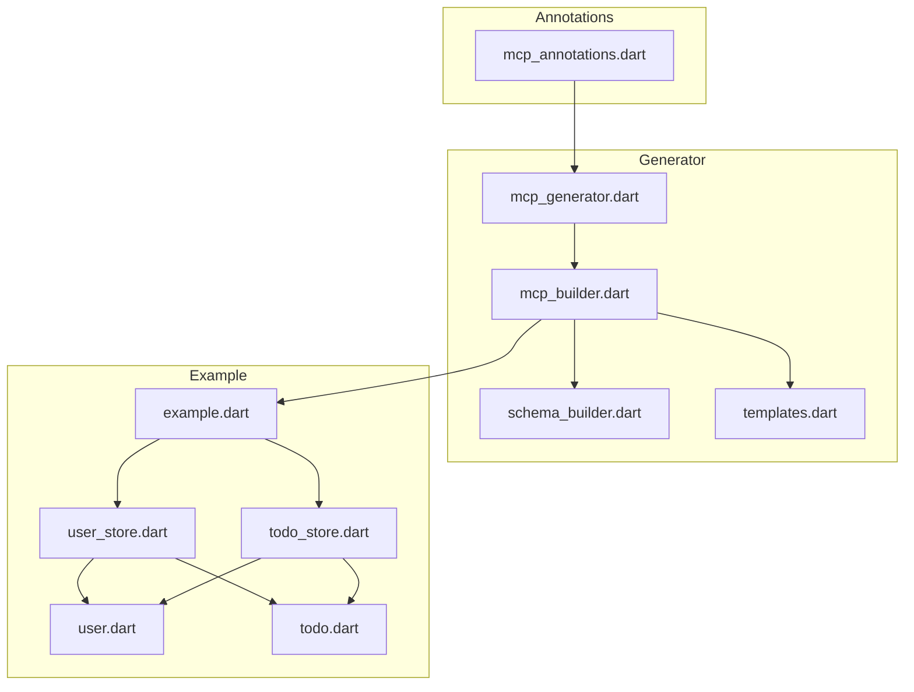
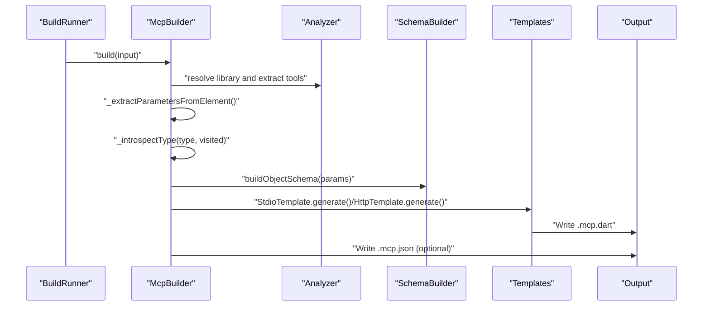
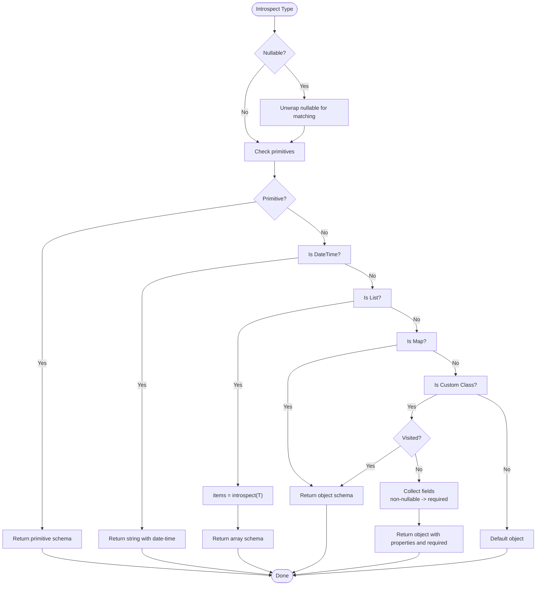
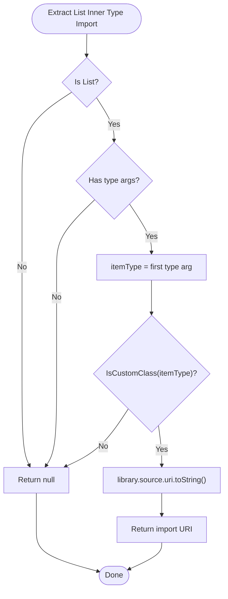
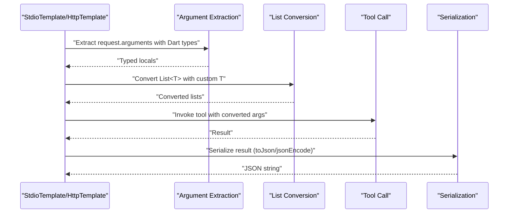
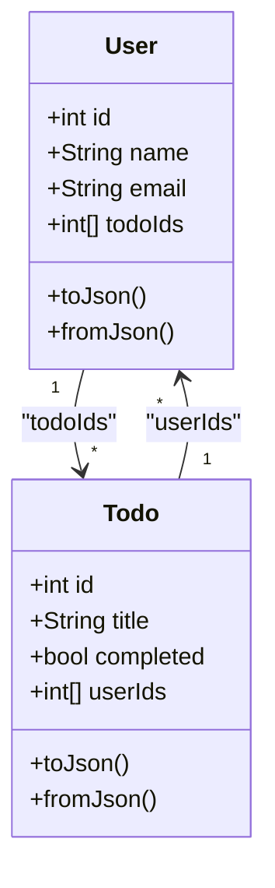
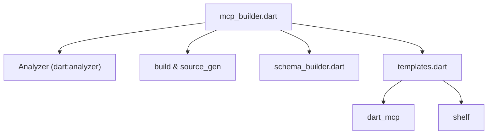

# Custom Type Serialization

<cite>
**Referenced Files in This Document**
- [README.md](file://README.md)
- [pubspec.yaml](file://pubspec.yaml)
- [mcp_annotations.dart](file://packages/easy_mcp_annotations/lib/mcp_annotations.dart)
- [mcp_generator.dart](file://packages/easy_mcp_generator/lib/mcp_generator.dart)
- [mcp_builder.dart](file://packages/easy_mcp_generator/lib/builder/mcp_builder.dart)
- [schema_builder.dart](file://packages/easy_mcp_generator/lib/builder/schema_builder.dart)
- [templates.dart](file://packages/easy_mcp_generator/lib/builder/templates.dart)
- [user.dart](file://example/lib/src/user.dart)
- [todo.dart](file://example/lib/src/todo.dart)
- [user_store.dart](file://example/lib/src/user_store.dart)
- [todo_store.dart](file://example/lib/src/todo_store.dart)
- [example.dart](file://example/bin/example.dart)
</cite>

## Table of Contents
1. [Introduction](#introduction)
2. [Project Structure](#project-structure)
3. [Core Components](#core-components)
4. [Architecture Overview](#architecture-overview)
5. [Detailed Component Analysis](#detailed-component-analysis)
6. [Dependency Analysis](#dependency-analysis)
7. [Performance Considerations](#performance-considerations)
8. [Troubleshooting Guide](#troubleshooting-guide)
9. [Conclusion](#conclusion)
10. [Appendices](#appendices)

## Introduction
This document explains the custom type serialization capabilities of the Easy MCP code generator. It focuses on the advanced type introspection system that handles complex Dart types (generics, custom classes, nested structures), the cycle detection mechanism preventing infinite recursion during schema generation, JSON Schema generation for custom classes (property mapping, required field detection, nullable type handling), import URI extraction for List inner types, and the template-based serialization system that generates proper JSON encoding/decoding code for complex types. It also covers practical examples such as serializing nested objects, handling optional properties, managing bidirectional relationships, and performance optimization strategies.

## Project Structure
The project is organized as a Dart workspace with two packages and an example application:
- easy_mcp_annotations: Defines annotations used to mark functions as MCP tools and configure transports.
- easy_mcp_generator: Build-runner generator that parses annotated code, performs type introspection, generates JSON Schema, and produces server code.
- example: Demonstrates usage with annotated tools and custom classes that serialize to/from JSON.

**Diagram sources**
- [mcp_annotations.dart:1-107](file://packages/easy_mcp_annotations/lib/mcp_annotations.dart#L1-L107)
- [mcp_generator.dart:1-14](file://packages/easy_mcp_generator/lib/mcp_generator.dart#L1-L14)
- [mcp_builder.dart:1-567](file://packages/easy_mcp_generator/lib/builder/mcp_builder.dart#L1-L567)
- [schema_builder.dart:1-99](file://packages/easy_mcp_generator/lib/builder/schema_builder.dart#L1-L99)
- [templates.dart:1-578](file://packages/easy_mcp_generator/lib/builder/templates.dart#L1-L578)
- [example.dart:1-67](file://example/bin/example.dart#L1-L67)
- [user_store.dart:1-144](file://example/lib/src/user_store.dart#L1-L144)
- [todo_store.dart:1-236](file://example/lib/src/todo_store.dart#L1-L236)
- [user.dart:1-42](file://example/lib/src/user.dart#L1-L42)
- [todo.dart:1-46](file://example/lib/src/todo.dart#L1-L46)

**Section sources**
- [README.md:1-120](file://README.md#L1-L120)
- [pubspec.yaml:1-64](file://pubspec.yaml#L1-L64)

## Core Components
- Annotations: Define transport mode and tool metadata.
- Builder: Performs AST-based parsing, type introspection, schema generation, and code generation.
- Schema Builder: Converts Dart types and introspected maps into JSON Schema expressions.
- Templates: Generate stdio and HTTP server code, including import statements and serialization logic.
- Example Classes: Demonstrate bidirectional relationships and JSON serialization.

Key responsibilities:
- Advanced type introspection supports primitives, DateTime, List<T>, Map<K,V>, and custom classes with cycle detection.
- Required fields are derived from non-nullable properties.
- Nullable types are handled by stripping the "?" suffix for matching and preserving the suffix for Dart typing.
- Import URIs for List inner types are extracted to ensure generated code imports the correct libraries.
- Template-based serialization converts JSON to typed objects and vice versa, including conversions for List parameters with custom inner types.

**Section sources**
- [mcp_annotations.dart:1-107](file://packages/easy_mcp_annotations/lib/mcp_annotations.dart#L1-L107)
- [mcp_builder.dart:1-567](file://packages/easy_mcp_generator/lib/builder/mcp_builder.dart#L1-L567)
- [schema_builder.dart:1-99](file://packages/easy_mcp_generator/lib/builder/schema_builder.dart#L1-L99)
- [templates.dart:1-578](file://packages/easy_mcp_generator/lib/builder/templates.dart#L1-L578)
- [user.dart:1-42](file://example/lib/src/user.dart#L1-L42)
- [todo.dart:1-46](file://example/lib/src/todo.dart#L1-L46)

## Architecture Overview
The generator follows an AST-based pipeline:
- Parse library units to discover annotated tools.
- Extract parameters and compute their Dart type strings and JSON Schema maps.
- Introspect types to build full JSON Schema maps, including nested structures and required fields.
- Generate server code using templates, including imports for List inner types and serialization logic.
- Optionally write JSON metadata describing tool input schemas.

**Diagram sources**
- [mcp_builder.dart:18-52](file://packages/easy_mcp_generator/lib/builder/mcp_builder.dart#L18-L52)
- [mcp_builder.dart:229-259](file://packages/easy_mcp_generator/lib/builder/mcp_builder.dart#L229-L259)
- [mcp_builder.dart:309-411](file://packages/easy_mcp_generator/lib/builder/mcp_builder.dart#L309-L411)
- [schema_builder.dart:68-98](file://packages/easy_mcp_generator/lib/builder/schema_builder.dart#L68-L98)
- [templates.dart:6-175](file://packages/easy_mcp_generator/lib/builder/templates.dart#L6-L175)

## Detailed Component Analysis

### Type Introspection and JSON Schema Generation
The introspection engine converts Dart types into JSON Schema maps:
- Primitives: int, double/num, String, bool map to JSON Schema types.
- DateTime: treated as string with date-time format.
- List<T>: array with items schema derived from T.
- Map<K,V>: object.
- Custom classes: object with properties and required arrays built from non-nullable fields.
- Nullables: unwrapped for introspection but preserved for Dart typing.
- Cycle detection: visited set prevents infinite recursion for self-referencing or mutually recursive types.

**Diagram sources**
- [mcp_builder.dart:309-411](file://packages/easy_mcp_generator/lib/builder/mcp_builder.dart#L309-L411)

**Section sources**
- [mcp_builder.dart:309-411](file://packages/easy_mcp_generator/lib/builder/mcp_builder.dart#L309-L411)
- [schema_builder.dart:29-66](file://packages/easy_mcp_generator/lib/builder/schema_builder.dart#L29-L66)

### Import URI Extraction for List Inner Types
When a parameter is List<T>, the builder checks if T is a custom class and extracts its library URI. This ensures generated code imports the correct library for deserialization.

**Diagram sources**
- [mcp_builder.dart:261-283](file://packages/easy_mcp_generator/lib/builder/mcp_builder.dart#L261-L283)

**Section sources**
- [mcp_builder.dart:261-283](file://packages/easy_mcp_generator/lib/builder/mcp_builder.dart#L261-L283)

### Template-Based Serialization System
The templates generate server code that:
- Imports List inner type URIs collected from all tools.
- Extracts request arguments and applies Dart typing (including nullable suffixes).
- Converts List parameters with custom inner types using fromJson.
- Serializes results using toJson or toString fallback.

**Diagram sources**
- [templates.dart:45-117](file://packages/easy_mcp_generator/lib/builder/templates.dart#L45-L117)
- [templates.dart:308-380](file://packages/easy_mcp_generator/lib/builder/templates.dart#L308-L380)

**Section sources**
- [templates.dart:6-175](file://packages/easy_mcp_generator/lib/builder/templates.dart#L6-L175)
- [templates.dart:268-486](file://packages/easy_mcp_generator/lib/builder/templates.dart#L268-L486)

### Example: Bidirectional Relationships and Nested Objects
The example demonstrates bidirectional relationships between User and Todo via ID lists:
- User has todoIds (List<int>) and Todo has userIds (List<int>).
- Stores expose tools annotated with @Tool, enabling schema generation and server code generation.
- Serialization uses manual toJson/fromJson in example classes.

**Diagram sources**
- [user.dart:1-42](file://example/lib/src/user.dart#L1-L42)
- [todo.dart:1-46](file://example/lib/src/todo.dart#L1-L46)
- [user_store.dart:68-79](file://example/lib/src/user_store.dart#L68-L79)
- [todo_store.dart:143-182](file://example/lib/src/todo_store.dart#L143-L182)

**Section sources**
- [user.dart:1-42](file://example/lib/src/user.dart#L1-L42)
- [todo.dart:1-46](file://example/lib/src/todo.dart#L1-L46)
- [user_store.dart:68-79](file://example/lib/src/user_store.dart#L68-L79)
- [todo_store.dart:143-182](file://example/lib/src/todo_store.dart#L143-L182)

### Optional Properties and Nullable Types
- Optional parameters are detected from analyzer metadata and reflected in both JSON Schema and generated argument extraction.
- Nullable types are stripped for matching but retain "?" for Dart typing in generated code.
- Required fields in JSON Schema are computed from non-nullable properties.

**Section sources**
- [mcp_builder.dart:234-256](file://packages/easy_mcp_generator/lib/builder/mcp_builder.dart#L234-L256)
- [templates.dart:54-62](file://packages/easy_mcp_generator/lib/builder/templates.dart#L54-L62)
- [schema_builder.dart:87-91](file://packages/easy_mcp_generator/lib/builder/schema_builder.dart#L87-L91)

### Polymorphic Types and Custom Serialization Logic
- The introspection treats unknown custom classes as generic objects, which is compatible with polymorphic scenarios where exact runtime types vary.
- Custom serialization logic is supported by requiring classes to implement toJson/fromJson; the templates call these methods during serialization and deserialization.

**Section sources**
- [mcp_builder.dart:409-411](file://packages/easy_mcp_generator/lib/builder/mcp_builder.dart#L409-L411)
- [templates.dart:154-172](file://packages/easy_mcp_generator/lib/builder/templates.dart#L154-L172)
- [templates.dart:465-483](file://packages/easy_mcp_generator/lib/builder/templates.dart#L465-L483)

## Dependency Analysis
The generator depends on:
- Analyzer for AST parsing and type resolution.
- Build and source_gen for build_runner integration.
- dart_mcp for server runtime.
- Shelf for HTTP transport.

**Diagram sources**
- [mcp_builder.dart:1-11](file://packages/easy_mcp_generator/lib/builder/mcp_builder.dart#L1-L11)
- [templates.dart:1-5](file://packages/easy_mcp_generator/lib/builder/templates.dart#L1-L5)

**Section sources**
- [mcp_builder.dart:1-11](file://packages/easy_mcp_generator/lib/builder/mcp_builder.dart#L1-L11)
- [pubspec.yaml:1-64](file://pubspec.yaml#L1-L64)

## Performance Considerations
- Minimize deep nesting in custom classes to reduce schema generation overhead.
- Prefer primitive collections (List<int>, List<String>) over List<custom> when possible to avoid extra imports and conversions.
- Use caching in stores to avoid repeated JSON decoding/encoding during runtime operations.
- Keep bidirectional relationships shallow; consider denormalization or lookup caches for frequently accessed related data.

## Troubleshooting Guide
Common issues and resolutions:
- Missing imports for List inner types: Ensure the inner type is a custom class from the same package so its URI can be extracted and imported.
- Infinite recursion in schema: Self-referencing or mutually recursive types are handled by cycle detection; avoid extremely deep cycles.
- Incorrect required fields: Verify that non-nullable properties are not accidentally marked as optional.
- Serialization errors: Confirm that custom classes implement toJson/fromJson and that the templates can call these methods.

**Section sources**
- [mcp_builder.dart:363-366](file://packages/easy_mcp_generator/lib/builder/mcp_builder.dart#L363-L366)
- [templates.dart:154-172](file://packages/easy_mcp_generator/lib/builder/templates.dart#L154-L172)

## Conclusion
The Easy MCP generator provides a robust, AST-driven solution for exposing Dart functions as MCP tools. Its advanced type introspection, cycle detection, and template-based serialization enable safe handling of complex types, optional properties, and bidirectional relationships while generating accurate JSON Schemas and efficient server code.

## Appendices

### Practical Examples Index
- Serializing nested objects: See User and Todo classes with ID lists.
- Handling optional properties: Tools with optional parameters and nullable types.
- Managing bidirectional relationships: UserStore and TodoStore coordinating updates.
- Optimizing serialization performance: Manual toJson/fromJson and caching strategies.

**Section sources**
- [user.dart:1-42](file://example/lib/src/user.dart#L1-L42)
- [todo.dart:1-46](file://example/lib/src/todo.dart#L1-L46)
- [user_store.dart:68-79](file://example/lib/src/user_store.dart#L68-L79)
- [todo_store.dart:143-182](file://example/lib/src/todo_store.dart#L143-L182)
- [example.dart:1-67](file://example/bin/example.dart#L1-L67)