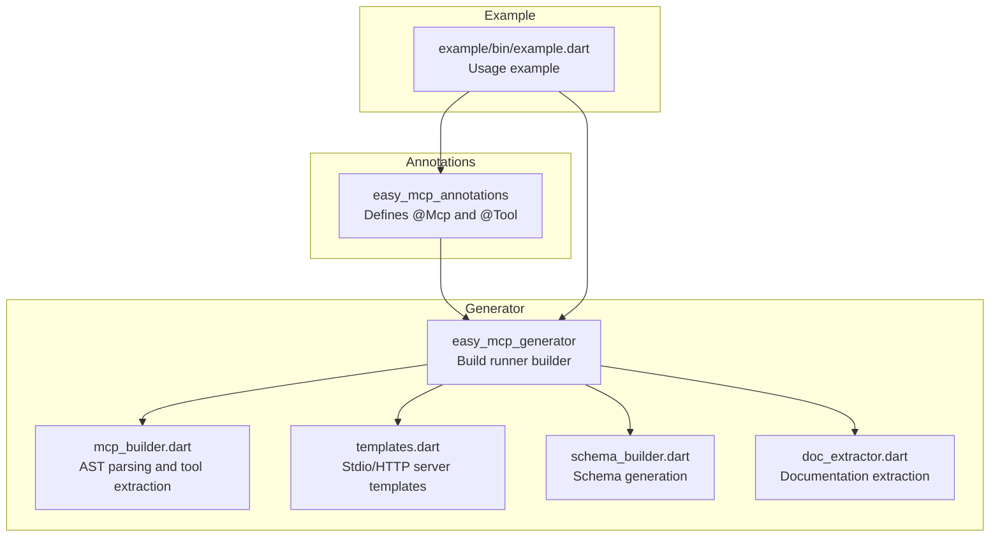
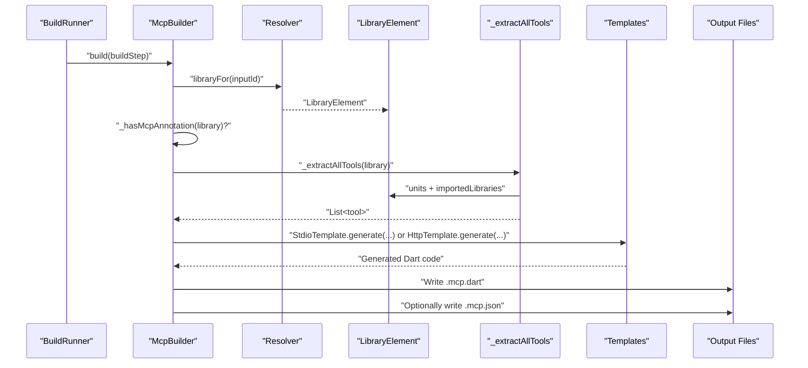
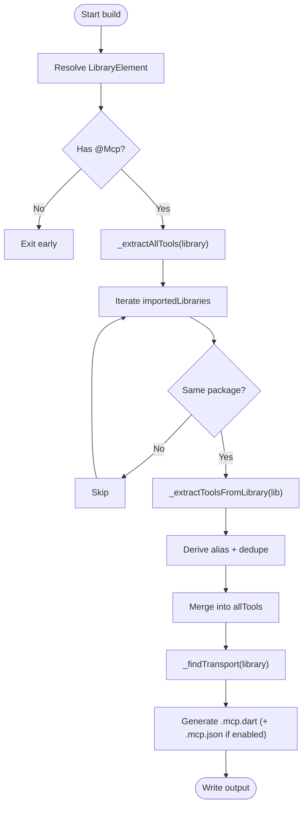
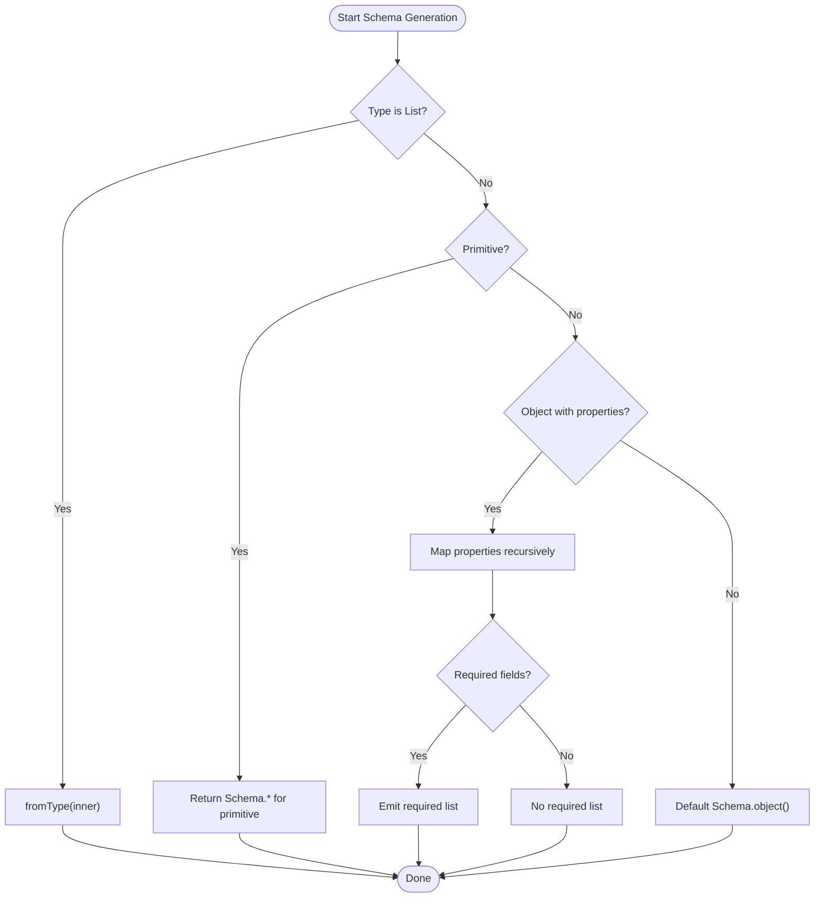
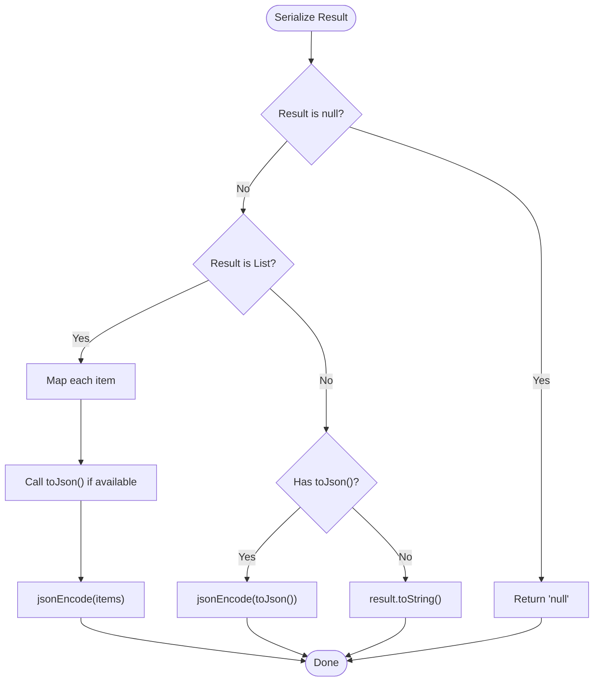
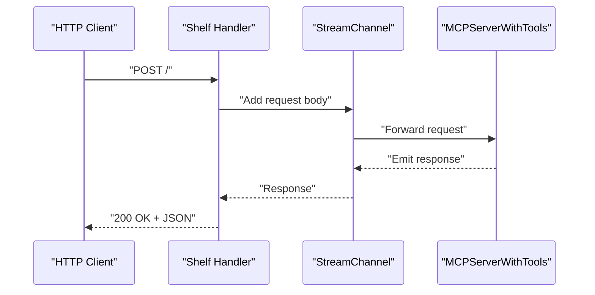
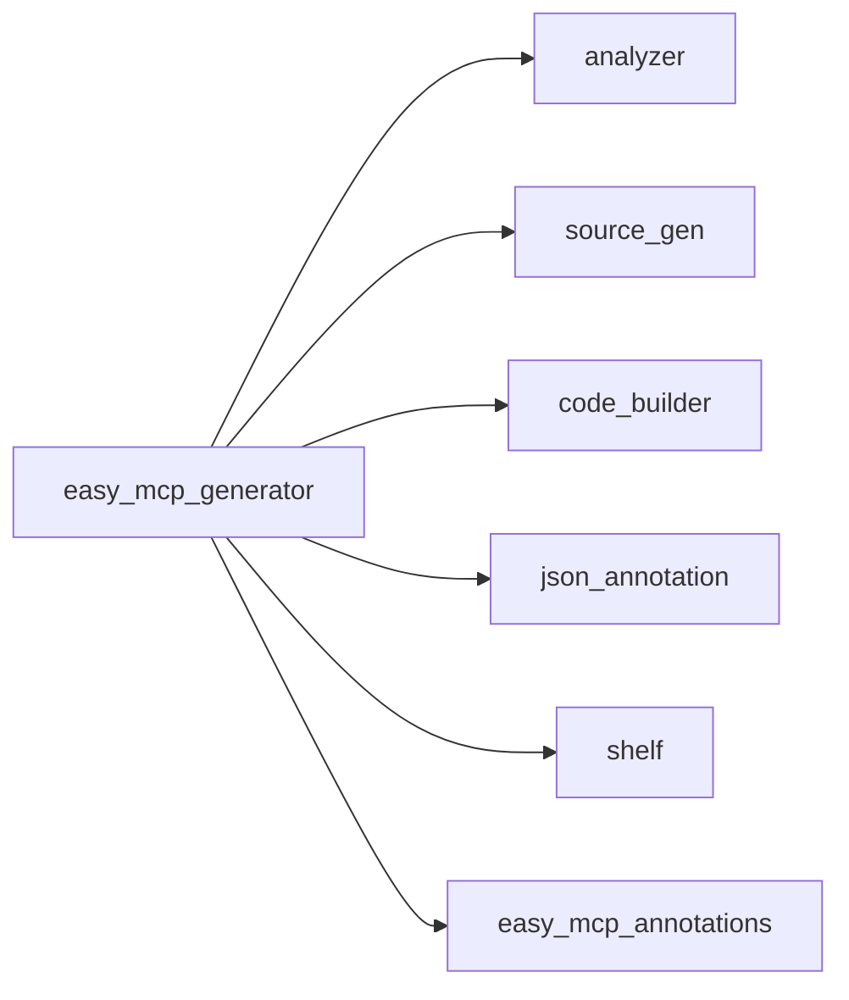

# Performance Optimization

<cite>
**Referenced Files in This Document**
- [README.md](file://README.md)
- [pubspec.yaml](file://packages/easy_mcp_generator/pubspec.yaml)
- [pubspec.yaml](file://packages/easy_mcp_annotations/pubspec.yaml)
- [mcp_generator.dart](file://packages/easy_mcp_generator/lib/mcp_generator.dart)
- [mcp_builder.dart](file://packages/easy_mcp_generator/lib/builder/mcp_builder.dart)
- [templates.dart](file://packages/easy_mcp_generator/lib/builder/templates.dart)
- [schema_builder.dart](file://packages/easy_mcp_generator/lib/builder/schema_builder.dart)
- [doc_extractor.dart](file://packages/easy_mcp_generator/lib/builder/doc_extractor.dart)
- [build.yaml](file://packages/easy_mcp_generator/build.yaml)
- [example.dart](file://example/bin/example.dart)
</cite>

## Table of Contents
1. [Introduction](#introduction)
2. [Project Structure](#project-structure)
3. [Core Components](#core-components)
4. [Architecture Overview](#architecture-overview)
5. [Detailed Component Analysis](#detailed-component-analysis)
6. [Dependency Analysis](#dependency-analysis)
7. [Performance Considerations](#performance-considerations)
8. [Troubleshooting Guide](#troubleshooting-guide)
9. [Conclusion](#conclusion)
10. [Appendices](#appendices)

## Introduction
This document focuses on performance optimization strategies and best practices for the Easy MCP code generation pipeline and generated servers. It covers memory management during AST traversal, caching mechanisms, garbage collection optimization, CPU optimization for large-scale projects, I/O optimization for multiple libraries and parallel builds, build system integration, runtime performance for generated servers, profiling and monitoring, and anti-patterns with solutions.

## Project Structure
The repository is a Dart workspace with two primary packages:
- easy_mcp_annotations: Defines annotations used to mark methods as MCP tools and configure transport.
- easy_mcp_generator: A build_runner generator that parses annotated libraries and produces MCP-compatible server code.

Key build configuration is defined in build.yaml, and the example demonstrates usage patterns.

**Diagram sources**
- [mcp_builder.dart](file://packages/easy_mcp_generator/lib/builder/mcp_builder.dart)
- [templates.dart](file://packages/easy_mcp_generator/lib/builder/templates.dart)
- [schema_builder.dart](file://packages/easy_mcp_generator/lib/builder/schema_builder.dart)
- [doc_extractor.dart](file://packages/easy_mcp_generator/lib/builder/doc_extractor.dart)
- [example.dart](file://example/bin/example.dart)

**Section sources**
- [README.md](file://README.md)
- [build.yaml](file://packages/easy_mcp_generator/build.yaml)

## Core Components
- McpBuilder: Orchestrates build steps, filters libraries with @Mcp, extracts tools from the library and its imports, selects transport, and writes generated files.
- Templates: Generates stdio and HTTP server code, including tool registration, handler scaffolding, and serialization logic.
- SchemaBuilder: Produces dart_mcp Schema.* expressions from introspected types and parameter metadata.
- DocExtractor: Extracts documentation comments and prepares default descriptions for tools.
- Build configuration: Declares build extensions and applies the builder to source.

Performance-critical areas:
- AST traversal and annotation scanning
- Type introspection and schema generation
- Template rendering and string concatenation
- JSON encoding and serialization
- Import aliasing and deduplication

**Section sources**
- [mcp_builder.dart](file://packages/easy_mcp_generator/lib/builder/mcp_builder.dart)
- [templates.dart](file://packages/easy_mcp_generator/lib/builder/templates.dart)
- [schema_builder.dart](file://packages/easy_mcp_generator/lib/builder/schema_builder.dart)
- [doc_extractor.dart](file://packages/easy_mcp_generator/lib/builder/doc_extractor.dart)
- [build.yaml](file://packages/easy_mcp_generator/build.yaml)

## Architecture Overview
The generator runs during build_runner. It resolves libraries, scans for annotations, extracts tools, builds schemas, and renders templates to produce server code and optional JSON metadata.

**Diagram sources**
- [mcp_builder.dart](file://packages/easy_mcp_generator/lib/builder/mcp_builder.dart)
- [templates.dart](file://packages/easy_mcp_generator/lib/builder/templates.dart)

## Detailed Component Analysis

### McpBuilder: AST Traversal and Tool Extraction
Key performance considerations:
- Efficiently scan units and children to locate annotated functions and class methods.
- Limit work to libraries with @Mcp annotations.
- Deduplicate imports and derive unique aliases to avoid redundant imports.
- Short-circuit when no tools are found.

Optimization opportunities:
- Cache resolved LibraryElement instances if reused across tools.
- Parallelize extraction across imported libraries when safe and beneficial.
- Minimize repeated string operations by reusing computed values.

**Diagram sources**
- [mcp_builder.dart](file://packages/easy_mcp_generator/lib/builder/mcp_builder.dart)

**Section sources**
- [mcp_builder.dart](file://packages/easy_mcp_generator/lib/builder/mcp_builder.dart)

### Type Introspection and Schema Generation
SchemaBuilder converts Dart types and schema maps into dart_mcp Schema.* expressions. This is CPU-intensive for deep or recursive types.

Optimization strategies:
- Memoize repeated type conversions.
- Short-circuit for primitive types.
- Avoid redundant property computations when generating object schemas.

**Diagram sources**
- [schema_builder.dart](file://packages/easy_mcp_generator/lib/builder/schema_builder.dart)

**Section sources**
- [schema_builder.dart](file://packages/easy_mcp_generator/lib/builder/schema_builder.dart)

### Template Rendering and Serialization
Templates generate server code and serialize results. Serialization overhead can be significant for large lists or complex objects.

Optimizations:
- Defer expensive jsonEncode calls until necessary.
- Avoid unnecessary conversions for primitive types.
- Reuse import statements and minimize string concatenation.

**Diagram sources**
- [templates.dart](file://packages/easy_mcp_generator/lib/builder/templates.dart)

**Section sources**
- [templates.dart](file://packages/easy_mcp_generator/lib/builder/templates.dart)

### HTTP Transport and Streaming
The HTTP template sets up a Shelf server and bridges it to the MCP server via StreamChannel. This introduces I/O and serialization costs.

Optimizations:
- Use broadcast streams judiciously.
- Buffer responses efficiently to avoid blocking.
- Close channels and streams deterministically.

**Diagram sources**
- [templates.dart](file://packages/easy_mcp_generator/lib/builder/templates.dart)

**Section sources**
- [templates.dart](file://packages/easy_mcp_generator/lib/builder/templates.dart)

## Dependency Analysis
External dependencies impacting performance:
- analyzer: AST parsing and element inspection.
- source_gen: Source generation framework.
- code_builder: Dart code generation.
- json_annotation: JSON serialization helpers.
- shelf: HTTP server for HTTP transport.

Build configuration:
- build.yaml defines build extensions and auto-application to dependents.

**Diagram sources**
- [pubspec.yaml](file://packages/easy_mcp_generator/pubspec.yaml)
- [pubspec.yaml](file://packages/easy_mcp_annotations/pubspec.yaml)

**Section sources**
- [pubspec.yaml](file://packages/easy_mcp_generator/pubspec.yaml)
- [pubspec.yaml](file://packages/easy_mcp_annotations/pubspec.yaml)
- [build.yaml](file://packages/easy_mcp_generator/build.yaml)

## Performance Considerations

### Memory Management During Code Generation
- AST traversal: Use lazy evaluation and avoid materializing unnecessary intermediate collections. Cache resolved elements and reuse computed metadata.
- Tool aggregation: Deduplicate imports and aliases early to reduce memory footprint.
- Schema generation: Memoize type-to-schema conversions to avoid repeated recursion and allocations.
- Template rendering: Minimize string concatenation; prefer StringBuilder-like patterns if needed. Avoid redundant import statements.

### Garbage Collection Optimization
- Reduce short-lived allocations by reusing buffers and builders.
- Prefer immutable maps/sets for configuration and metadata to enable sharing.
- Avoid boxing primitives unnecessarily; keep types strongly typed to minimize wrapper churn.

### CPU Optimization for Large Projects
- Parallelize independent tasks: Extract tools from imported libraries concurrently if safe and beneficial.
- Short-circuit early: Exit immediately if no @Mcp annotation is present.
- Optimize hot loops: Use efficient iteration patterns and avoid repeated reflection calls.

### I/O Optimization
- Minimize file writes: Write only when tool sets change.
- Use streaming I/O for large outputs when applicable.
- For HTTP transport, ensure efficient buffering and avoid synchronous I/O.

### Build System Integration
- Dependency tracking: Ensure build.yaml targets the correct inputs and outputs to leverage incremental builds.
- Cache utilization: Rely on build_runner’s caching; avoid writing identical outputs to prevent rebuild storms.
- Parallel execution: Configure build_runner to run multiple builders in parallel when independent.

### Runtime Performance for Generated Servers
- Transport efficiency: Stdio is generally lower overhead than HTTP; choose stdio for CLI integrations.
- Serialization overhead: Keep payload sizes reasonable; avoid serializing large objects repeatedly.
- Resource utilization: Close streams and channels promptly; monitor memory growth under load.

### Profiling and Monitoring
- Use Dart VM profiler to identify hotspots in AST traversal and schema generation.
- Instrument build_runner to measure total build time and per-file processing time.
- Monitor generated server memory and throughput under realistic loads.

### Scaling Strategies
- Horizontal scaling: Run multiple generated servers behind a load balancer for HTTP transport.
- Vertical scaling: Increase heap and optimize GC settings for long-running generators.
- Incremental builds: Ensure changes propagate efficiently through the pipeline.

### Common Anti-Patterns and Solutions
- Anti-pattern: Scanning all libraries regardless of annotations.
  - Solution: Check for @Mcp presence before parsing.
- Anti-pattern: Repeated type introspection without memoization.
  - Solution: Cache type-to-schema mappings.
- Anti-pattern: Excessive string concatenation in templates.
  - Solution: Use efficient string building and deduplicate imports.
- Anti-pattern: Blocking I/O in HTTP handlers.
  - Solution: Use asynchronous streams and non-blocking operations.

**Section sources**
- [mcp_builder.dart](file://packages/easy_mcp_generator/lib/builder/mcp_builder.dart)
- [templates.dart](file://packages/easy_mcp_generator/lib/builder/templates.dart)
- [schema_builder.dart](file://packages/easy_mcp_generator/lib/builder/schema_builder.dart)
- [build.yaml](file://packages/easy_mcp_generator/build.yaml)

## Troubleshooting Guide
- Slow builds: Verify that only necessary files are processed and that caching is effective.
- Excessive memory usage: Profile AST traversal and schema generation; add memoization where appropriate.
- HTTP server latency: Inspect serialization paths and stream handling; ensure proper buffering.
- Incorrect tool discovery: Confirm annotation presence and that imports are within the same package for tool discovery.

**Section sources**
- [mcp_builder.dart](file://packages/easy_mcp_generator/lib/builder/mcp_builder.dart)
- [templates.dart](file://packages/easy_mcp_generator/lib/builder/templates.dart)

## Conclusion
By focusing on efficient AST traversal, schema memoization, optimized template rendering, careful I/O handling, and robust build integration, the Easy MCP pipeline can scale effectively. Profiling and monitoring help sustain performance as projects grow, while mindful design choices mitigate common anti-patterns.

## Appendices
- Example usage demonstrates transport selection and basic integration patterns.

**Section sources**
- [example.dart](file://example/bin/example.dart)