# Template Customization

<cite>
**Referenced Files in This Document**
- [README.md](file://README.md)
- [packages/easy_mcp_annotations/lib/mcp_annotations.dart](file://packages/easy_mcp_annotations/lib/mcp_annotations.dart)
- [packages/easy_mcp_generator/lib/mcp_generator.dart](file://packages/easy_mcp_generator/lib/mcp_generator.dart)
- [packages/easy_mcp_generator/lib/builder/mcp_builder.dart](file://packages/easy_mcp_generator/lib/builder/mcp_builder.dart)
- [packages/easy_mcp_generator/lib/builder/templates.dart](file://packages/easy_mcp_generator/lib/builder/templates.dart)
- [packages/easy_mcp_generator/lib/builder/schema_builder.dart](file://packages/easy_mcp_generator/lib/builder/schema_builder.dart)
- [packages/easy_mcp_generator/lib/builder/doc_extractor.dart](file://packages/easy_mcp_generator/lib/builder/doc_extractor.dart)
- [packages/easy_mcp_generator/lib/stubs.dart](file://packages/easy_mcp_generator/lib/stubs.dart)
- [packages/easy_mcp_generator/build.yaml](file://packages/easy_mcp_generator/build.yaml)
- [packages/easy_mcp_generator/pubspec.yaml](file://packages/easy_mcp_generator/pubspec.yaml)
- [packages/easy_mcp_annotations/pubspec.yaml](file://packages/easy_mcp_annotations/pubspec.yaml)
- [example/bin/example.mcp.dart](file://example/bin/example.mcp.dart)
</cite>

## Table of Contents
1. [Introduction](#introduction)
2. [Project Structure](#project-structure)
3. [Core Components](#core-components)
4. [Architecture Overview](#architecture-overview)
5. [Detailed Component Analysis](#detailed-component-analysis)
6. [Dependency Analysis](#dependency-analysis)
7. [Performance Considerations](#performance-considerations)
8. [Troubleshooting Guide](#troubleshooting-guide)
9. [Conclusion](#conclusion)
10. [Appendices](#appendices)

## Introduction
This document explains how Easy MCP’s template system enables customization and extension for generating transport-specific MCP servers. It covers:
- The dual-transport architecture supporting stdio and HTTP generation
- The template rendering pipeline that builds server code and manages imports
- Extensibility points for adding new transports and customizing output
- The parameter system for shaping generated code structure and naming
- Integration with the build system for compilation and output generation
- Practical examples for extending transports, customizing error handling, and modifying output

## Project Structure
The repository is a Dart workspace with two primary packages:
- easy_mcp_annotations: Defines annotations that drive code generation
- easy_mcp_generator: Implements the build runner generator and templates

Key files:
- Annotations define transport mode and metadata
- The builder orchestrates AST-based discovery, schema generation, and template selection
- Templates render stdio and HTTP server code with proper imports and tool registration
- Build configuration ties the generator into the build pipeline

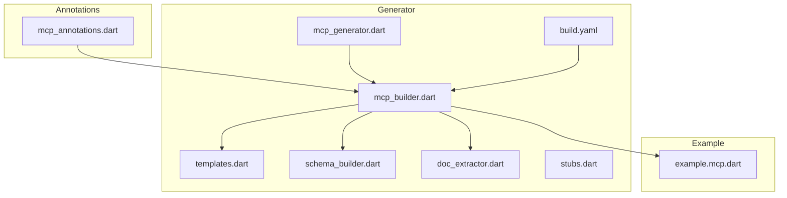

**Diagram sources**
- [packages/easy_mcp_annotations/lib/mcp_annotations.dart:1-107](file://packages/easy_mcp_annotations/lib/mcp_annotations.dart#L1-L107)
- [packages/easy_mcp_generator/lib/mcp_generator.dart:1-14](file://packages/easy_mcp_generator/lib/mcp_generator.dart#L1-L14)
- [packages/easy_mcp_generator/lib/builder/mcp_builder.dart:1-567](file://packages/easy_mcp_generator/lib/builder/mcp_builder.dart#L1-L567)
- [packages/easy_mcp_generator/lib/builder/templates.dart:1-578](file://packages/easy_mcp_generator/lib/builder/templates.dart#L1-L578)
- [packages/easy_mcp_generator/lib/builder/schema_builder.dart:1-99](file://packages/easy_mcp_generator/lib/builder/schema_builder.dart#L1-L99)
- [packages/easy_mcp_generator/lib/builder/doc_extractor.dart:1-106](file://packages/easy_mcp_generator/lib/builder/doc_extractor.dart#L1-L106)
- [packages/easy_mcp_generator/lib/stubs.dart:1-7](file://packages/easy_mcp_generator/lib/stubs.dart#L1-L7)
- [packages/easy_mcp_generator/build.yaml:1-12](file://packages/easy_mcp_generator/build.yaml#L1-L12)
- [example/bin/example.mcp.dart:1-200](file://example/bin/example.mcp.dart#L1-L200)

**Section sources**
- [README.md:1-120](file://README.md#L1-L120)
- [packages/easy_mcp_generator/build.yaml:1-12](file://packages/easy_mcp_generator/build.yaml#L1-L12)

## Core Components
- Annotations: Define transport mode and metadata for tools
- Builder: Discovers annotated functions, extracts metadata, selects template, and writes outputs
- Templates: Render stdio and HTTP server code with imports, tool registration, and handlers
- Schema Builder: Produces typed schema expressions for tool input validation
- Doc Extractor: Provides fallback descriptions from doc comments
- Build Pipeline: Integrates the generator into build_runner and emits .mcp.dart and .mcp.json

**Section sources**
- [packages/easy_mcp_annotations/lib/mcp_annotations.dart:39-106](file://packages/easy_mcp_annotations/lib/mcp_annotations.dart#L39-L106)
- [packages/easy_mcp_generator/lib/builder/mcp_builder.dart:12-567](file://packages/easy_mcp_generator/lib/builder/mcp_builder.dart#L12-L567)
- [packages/easy_mcp_generator/lib/builder/templates.dart:1-578](file://packages/easy_mcp_generator/lib/builder/templates.dart#L1-L578)
- [packages/easy_mcp_generator/lib/builder/schema_builder.dart:1-99](file://packages/easy_mcp_generator/lib/builder/schema_builder.dart#L1-L99)
- [packages/easy_mcp_generator/lib/builder/doc_extractor.dart:1-106](file://packages/easy_mcp_generator/lib/builder/doc_extractor.dart#L1-L106)
- [packages/easy_mcp_generator/build.yaml:1-12](file://packages/easy_mcp_generator/build.yaml#L1-L12)

## Architecture Overview
The generator operates in three stages:
1. Discovery: Traverse the library and imported libraries to collect tools
2. Rendering: Select a transport template and render server code with tool registrations and handlers
3. Output: Write .mcp.dart and optionally .mcp.json artifacts

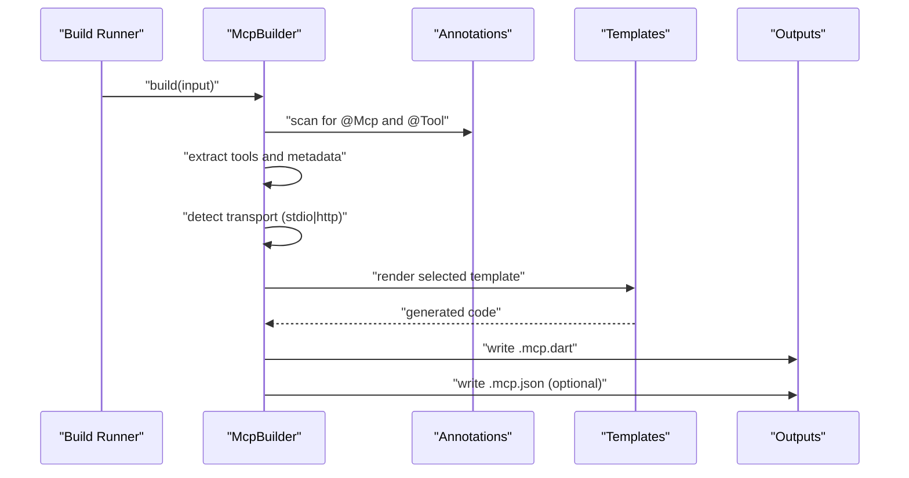

**Diagram sources**
- [packages/easy_mcp_generator/lib/builder/mcp_builder.dart:18-52](file://packages/easy_mcp_generator/lib/builder/mcp_builder.dart#L18-L52)
- [packages/easy_mcp_generator/lib/builder/templates.dart:6-175](file://packages/easy_mcp_generator/lib/builder/templates.dart#L6-L175)
- [packages/easy_mcp_generator/lib/builder/templates.dart:269-486](file://packages/easy_mcp_generator/lib/builder/templates.dart#L269-L486)

## Detailed Component Analysis

### Annotations and Transport Selection
- Mcp transport enum drives template selection
- Tool annotation supplies metadata used in schema and tool registration
- The builder reads the transport setting and decides which template to render

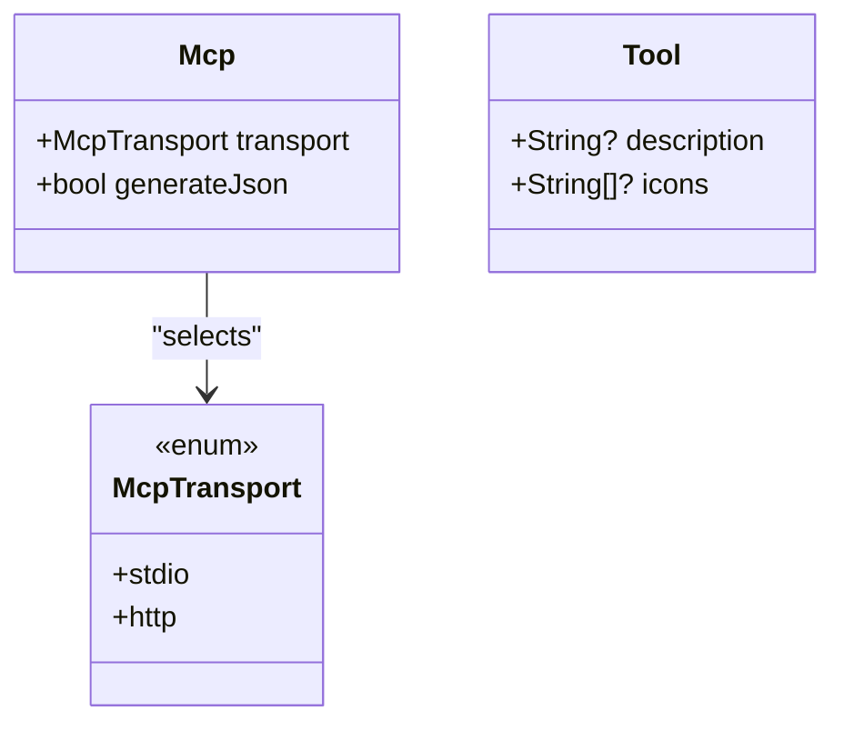

**Diagram sources**
- [packages/easy_mcp_annotations/lib/mcp_annotations.dart:39-106](file://packages/easy_mcp_annotations/lib/mcp_annotations.dart#L39-L106)

**Section sources**
- [packages/easy_mcp_annotations/lib/mcp_annotations.dart:9-19](file://packages/easy_mcp_annotations/lib/mcp_annotations.dart#L9-L19)
- [packages/easy_mcp_annotations/lib/mcp_annotations.dart:39-56](file://packages/easy_mcp_annotations/lib/mcp_annotations.dart#L39-L56)
- [packages/easy_mcp_annotations/lib/mcp_annotations.dart:80-106](file://packages/easy_mcp_annotations/lib/mcp_annotations.dart#L80-L106)
- [packages/easy_mcp_generator/lib/builder/mcp_builder.dart:515-563](file://packages/easy_mcp_generator/lib/builder/mcp_builder.dart#L515-L563)

### Builder Orchestration and Import Resolution
- Scans current library and package-local imports to aggregate tools
- Resolves unique per-tool source imports and aliases
- Detects transport and invokes the appropriate template
- Optionally generates JSON metadata

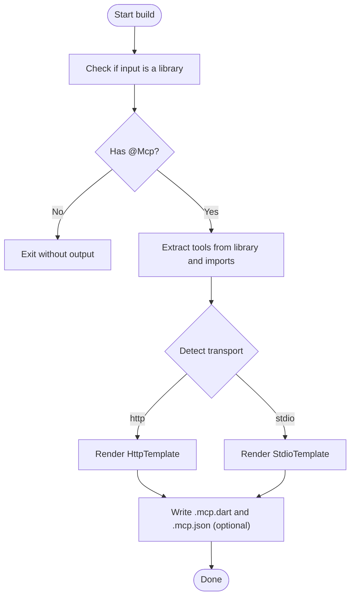

**Diagram sources**
- [packages/easy_mcp_generator/lib/builder/mcp_builder.dart:18-52](file://packages/easy_mcp_generator/lib/builder/mcp_builder.dart#L18-L52)
- [packages/easy_mcp_generator/lib/builder/mcp_builder.dart:112-166](file://packages/easy_mcp_generator/lib/builder/mcp_builder.dart#L112-L166)
- [packages/easy_mcp_generator/lib/builder/mcp_builder.dart:35-51](file://packages/easy_mcp_generator/lib/builder/mcp_builder.dart#L35-L51)

**Section sources**
- [packages/easy_mcp_generator/lib/builder/mcp_builder.dart:18-52](file://packages/easy_mcp_generator/lib/builder/mcp_builder.dart#L18-L52)
- [packages/easy_mcp_generator/lib/builder/mcp_builder.dart:112-166](file://packages/easy_mcp_generator/lib/builder/mcp_builder.dart#L112-L166)
- [packages/easy_mcp_generator/lib/builder/mcp_builder.dart:442-468](file://packages/easy_mcp_generator/lib/builder/mcp_builder.dart#L442-L468)

### Template Rendering System
- StdioTemplate renders a server using stdio streams and registers tools with a base class
- HttpTemplate renders an HTTP server using Shelf, bridges HTTP requests to MCP via StreamChannel, and registers tools similarly
- Both templates manage imports for custom List inner types and per-tool source imports with aliases
- Handlers extract parameters, convert List<T> with custom inner types, and serialize results

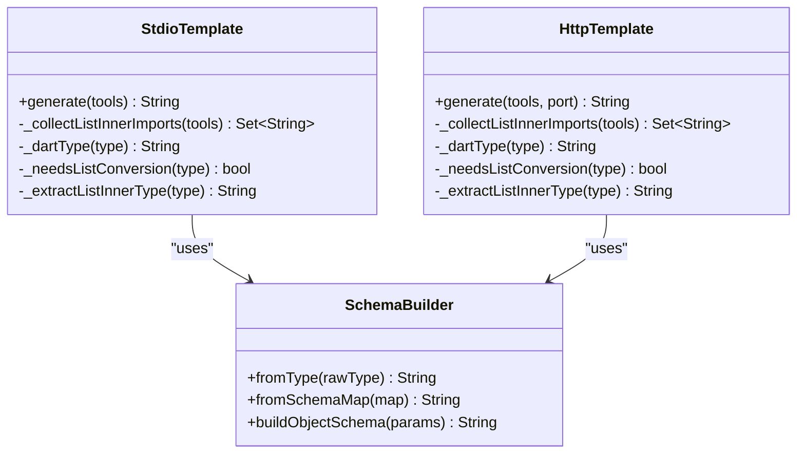

**Diagram sources**
- [packages/easy_mcp_generator/lib/builder/templates.dart:6-266](file://packages/easy_mcp_generator/lib/builder/templates.dart#L6-L266)
- [packages/easy_mcp_generator/lib/builder/templates.dart:269-577](file://packages/easy_mcp_generator/lib/builder/templates.dart#L269-L577)
- [packages/easy_mcp_generator/lib/builder/schema_builder.dart:1-99](file://packages/easy_mcp_generator/lib/builder/schema_builder.dart#L1-L99)

**Section sources**
- [packages/easy_mcp_generator/lib/builder/templates.dart:6-175](file://packages/easy_mcp_generator/lib/builder/templates.dart#L6-L175)
- [packages/easy_mcp_generator/lib/builder/templates.dart:269-486](file://packages/easy_mcp_generator/lib/builder/templates.dart#L269-L486)
- [packages/easy_mcp_generator/lib/builder/schema_builder.dart:68-98](file://packages/easy_mcp_generator/lib/builder/schema_builder.dart#L68-L98)

### Import Resolution and Dependency Management
- Per-tool source imports and aliases are collected and emitted to ensure handlers can call original functions
- Custom List inner types are detected and their import URIs are included to enable conversion
- The templates import runtime dependencies required by the chosen transport

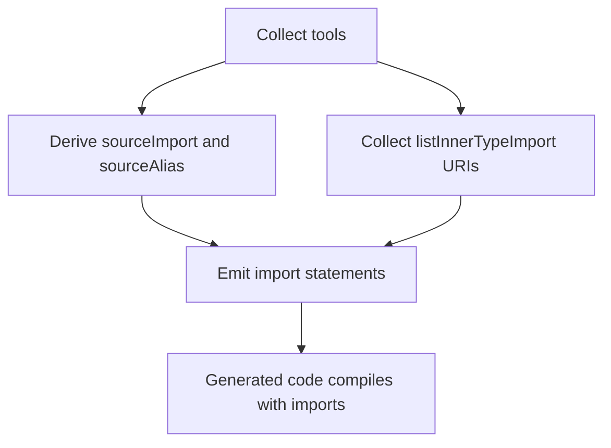

**Diagram sources**
- [packages/easy_mcp_generator/lib/builder/mcp_builder.dart:115-166](file://packages/easy_mcp_generator/lib/builder/mcp_builder.dart#L115-L166)
- [packages/easy_mcp_generator/lib/builder/templates.dart:8-26](file://packages/easy_mcp_generator/lib/builder/templates.dart#L8-L26)
- [packages/easy_mcp_generator/lib/builder/templates.dart:271-289](file://packages/easy_mcp_generator/lib/builder/templates.dart#L271-L289)

**Section sources**
- [packages/easy_mcp_generator/lib/builder/mcp_builder.dart:115-166](file://packages/easy_mcp_generator/lib/builder/mcp_builder.dart#L115-L166)
- [packages/easy_mcp_generator/lib/builder/templates.dart:8-26](file://packages/easy_mcp_generator/lib/builder/templates.dart#L8-L26)
- [packages/easy_mcp_generator/lib/builder/templates.dart:271-289](file://packages/easy_mcp_generator/lib/builder/templates.dart#L271-L289)

### Template Parameter System and Naming Conventions
- Tool metadata (name, description, parameters) drives schema and registration
- Descriptions fall back from annotation to doc comment extraction
- Parameter introspection derives JSON Schema maps and required fields
- Naming conventions:
  - Generated handler methods are prefixed with underscore
  - Tool registration uses the tool name
  - Serialization uses a shared helper method

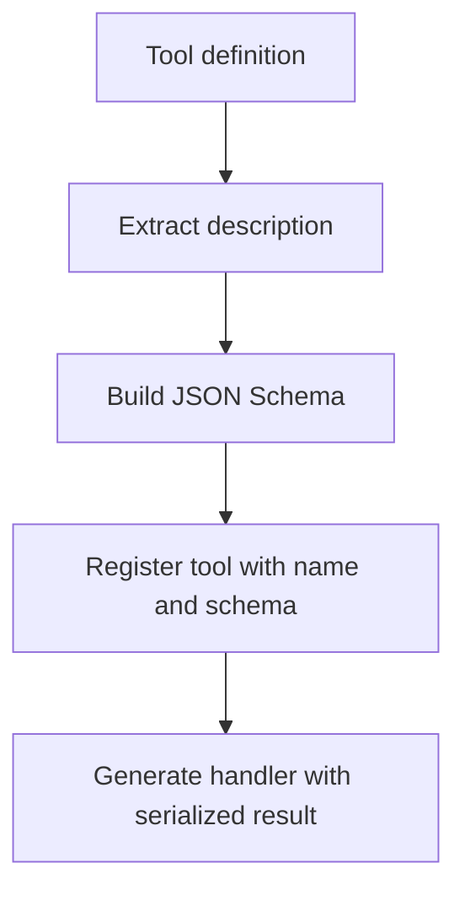

**Diagram sources**
- [packages/easy_mcp_generator/lib/builder/mcp_builder.dart:202-226](file://packages/easy_mcp_generator/lib/builder/mcp_builder.dart#L202-L226)
- [packages/easy_mcp_generator/lib/builder/mcp_builder.dart:442-468](file://packages/easy_mcp_generator/lib/builder/mcp_builder.dart#L442-L468)
- [packages/easy_mcp_generator/lib/builder/templates.dart:154-173](file://packages/easy_mcp_generator/lib/builder/templates.dart#L154-L173)

**Section sources**
- [packages/easy_mcp_generator/lib/builder/mcp_builder.dart:202-226](file://packages/easy_mcp_generator/lib/builder/mcp_builder.dart#L202-L226)
- [packages/easy_mcp_generator/lib/builder/mcp_builder.dart:442-468](file://packages/easy_mcp_generator/lib/builder/mcp_builder.dart#L442-L468)
- [packages/easy_mcp_generator/lib/builder/templates.dart:154-173](file://packages/easy_mcp_generator/lib/builder/templates.dart#L154-L173)

### Extensibility: Adding New Transports
To add a new transport (for example, a WebSocket transport):
1. Create a new template class similar to StdioTemplate and HttpTemplate
2. Implement a generate method that:
   - Accepts tools and transport-specific parameters (e.g., port)
   - Emits imports for transport runtime dependencies
   - Registers tools and generates handlers
   - Manages serialization and error handling patterns
3. Extend the builder to detect the new transport and route to the new template
4. Update the build configuration to include the new template output if needed

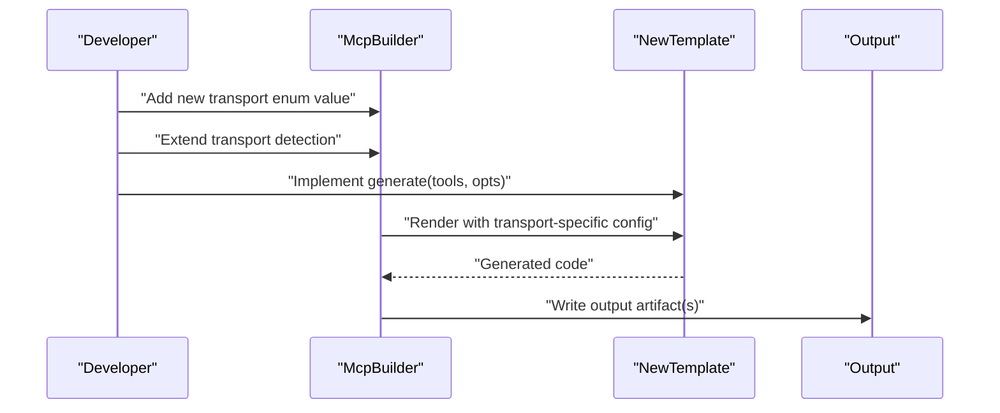

**Diagram sources**
- [packages/easy_mcp_generator/lib/builder/mcp_builder.dart:515-563](file://packages/easy_mcp_generator/lib/builder/mcp_builder.dart#L515-L563)
- [packages/easy_mcp_generator/lib/builder/templates.dart:6-175](file://packages/easy_mcp_generator/lib/builder/templates.dart#L6-L175)

**Section sources**
- [packages/easy_mcp_generator/lib/builder/mcp_builder.dart:515-563](file://packages/easy_mcp_generator/lib/builder/mcp_builder.dart#L515-L563)
- [packages/easy_mcp_generator/lib/builder/templates.dart:6-175](file://packages/easy_mcp_generator/lib/builder/templates.dart#L6-L175)

### Customizing Error Handling Patterns
- Both templates wrap tool handlers in try/catch blocks and return errors as CallToolResult with isError flag
- To customize error handling:
  - Modify the try/catch block in the template’s handler generation
  - Adjust serialization to include structured error payloads
  - Consider logging or metrics hooks around handler execution

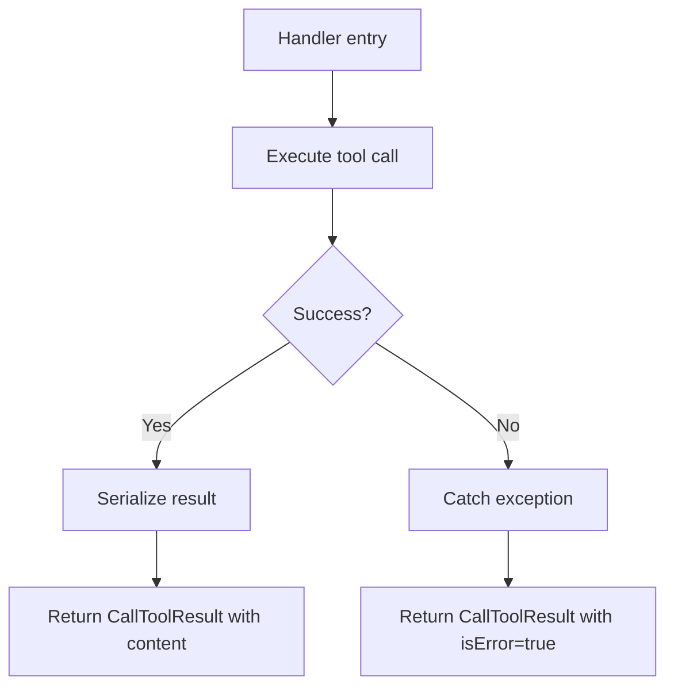

**Diagram sources**
- [packages/easy_mcp_generator/lib/builder/templates.dart:101-115](file://packages/easy_mcp_generator/lib/builder/templates.dart#L101-L115)
- [packages/easy_mcp_generator/lib/builder/templates.dart:363-378](file://packages/easy_mcp_generator/lib/builder/templates.dart#L363-L378)

**Section sources**
- [packages/easy_mcp_generator/lib/builder/templates.dart:101-115](file://packages/easy_mcp_generator/lib/builder/templates.dart#L101-L115)
- [packages/easy_mcp_generator/lib/builder/templates.dart:363-378](file://packages/easy_mcp_generator/lib/builder/templates.dart#L363-L378)

### Modifying Code Generation Output
- Tool registration and handler generation are driven by tool metadata
- To change naming or formatting:
  - Adjust the template’s string interpolation for registration and handler names
  - Customize schema generation via SchemaBuilder
  - Modify import emission logic for additional dependencies

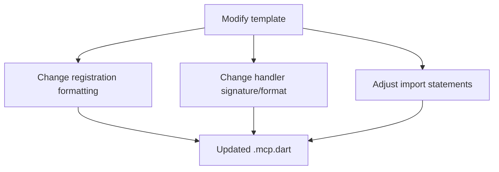

**Diagram sources**
- [packages/easy_mcp_generator/lib/builder/templates.dart:27-43](file://packages/easy_mcp_generator/lib/builder/templates.dart#L27-L43)
- [packages/easy_mcp_generator/lib/builder/templates.dart:100-117](file://packages/easy_mcp_generator/lib/builder/templates.dart#L100-L117)
- [packages/easy_mcp_generator/lib/builder/schema_builder.dart:68-98](file://packages/easy_mcp_generator/lib/builder/schema_builder.dart#L68-L98)

**Section sources**
- [packages/easy_mcp_generator/lib/builder/templates.dart:27-43](file://packages/easy_mcp_generator/lib/builder/templates.dart#L27-L43)
- [packages/easy_mcp_generator/lib/builder/templates.dart:100-117](file://packages/easy_mcp_generator/lib/builder/templates.dart#L100-L117)
- [packages/easy_mcp_generator/lib/builder/schema_builder.dart:68-98](file://packages/easy_mcp_generator/lib/builder/schema_builder.dart#L68-L98)

### Template Inheritance Patterns and Shared Utilities
- Both StdioTemplate and HttpTemplate share common patterns:
  - Tool registration via registerTool
  - Handler generation with parameter extraction and conversion
  - Shared serialization helper
- This promotes consistency across transports while allowing transport-specific differences (e.g., HTTP request handling vs stdio channels)

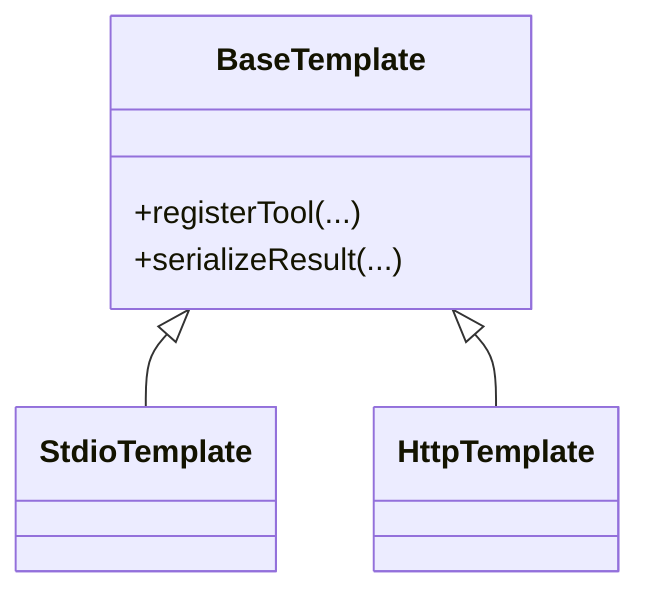

**Diagram sources**
- [packages/easy_mcp_generator/lib/builder/templates.dart:140-173](file://packages/easy_mcp_generator/lib/builder/templates.dart#L140-L173)
- [packages/easy_mcp_generator/lib/builder/templates.dart:451-484](file://packages/easy_mcp_generator/lib/builder/templates.dart#L451-L484)

**Section sources**
- [packages/easy_mcp_generator/lib/builder/templates.dart:140-173](file://packages/easy_mcp_generator/lib/builder/templates.dart#L140-L173)
- [packages/easy_mcp_generator/lib/builder/templates.dart:451-484](file://packages/easy_mcp_generator/lib/builder/templates.dart#L451-L484)

### Best Practices for Consistency Across Configurations
- Keep tool descriptions consistent by preferring explicit descriptions over doc comment fallbacks
- Standardize parameter naming and optional flags to simplify schema generation
- Centralize serialization logic in a single helper to avoid drift across templates
- Use aliases for imports to prevent naming conflicts when scanning multiple libraries

**Section sources**
- [packages/easy_mcp_generator/lib/builder/mcp_builder.dart:202-226](file://packages/easy_mcp_generator/lib/builder/mcp_builder.dart#L202-L226)
- [packages/easy_mcp_generator/lib/builder/mcp_builder.dart:115-166](file://packages/easy_mcp_generator/lib/builder/mcp_builder.dart#L115-L166)
- [packages/easy_mcp_generator/lib/builder/templates.dart:154-173](file://packages/easy_mcp_generator/lib/builder/templates.dart#L154-L173)

## Dependency Analysis
External dependencies used by the generator:
- analyzer: AST-based discovery and type introspection
- source_gen: code generation framework
- code_builder: programmatic Dart code construction
- shelf: HTTP transport support
- dart_mcp: runtime for MCP server behavior

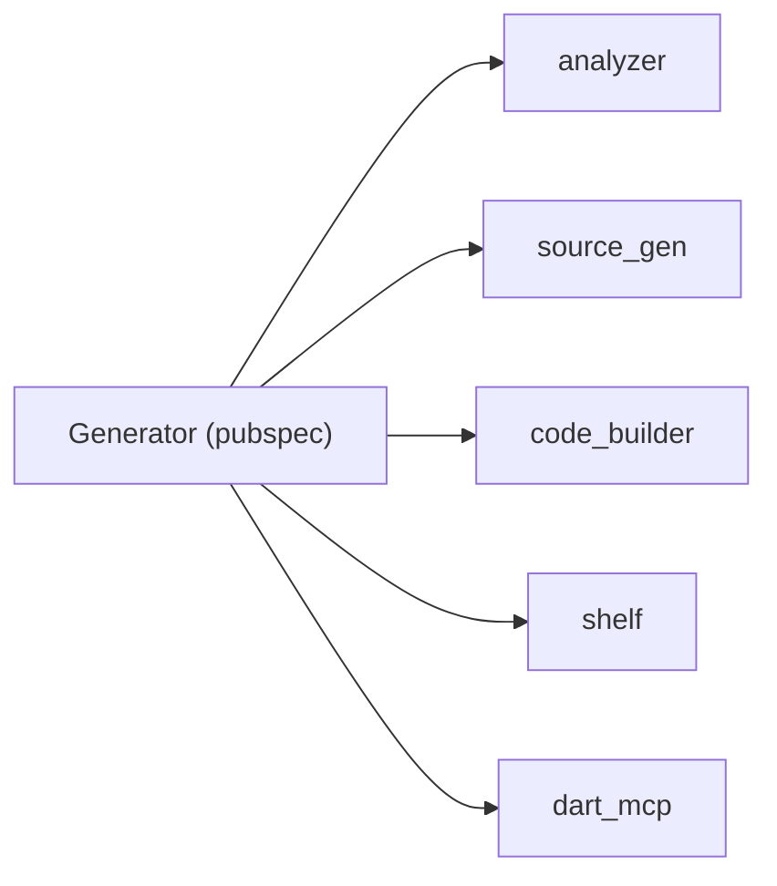

**Diagram sources**
- [packages/easy_mcp_generator/pubspec.yaml:10-18](file://packages/easy_mcp_generator/pubspec.yaml#L10-L18)

**Section sources**
- [packages/easy_mcp_generator/pubspec.yaml:10-18](file://packages/easy_mcp_generator/pubspec.yaml#L10-L18)
- [packages/easy_mcp_annotations/pubspec.yaml:11-13](file://packages/easy_mcp_annotations/pubspec.yaml#L11-L13)

## Performance Considerations
- AST traversal scans the current library and package-local imports; keep tool definitions organized to minimize unnecessary imports
- Schema generation is deterministic and lightweight; avoid excessive nested types to reduce generated code size
- HTTP transport introduces overhead from request/response bridging; tune buffer sizes and consider connection pooling for high-throughput scenarios

## Troubleshooting Guide
Common issues and resolutions:
- No output generated: Ensure the input library has an @Mcp annotation and at least one @Tool
- Missing imports in generated code: Verify that custom List inner types and per-tool source imports are resolvable
- Incorrect tool registration: Confirm tool names and descriptions are present; doc comment fallbacks require proper formatting
- HTTP server not reachable: Check port availability and firewall settings; ensure the HTTP transport is selected via @Mcp

**Section sources**
- [packages/easy_mcp_generator/lib/builder/mcp_builder.dart:27-33](file://packages/easy_mcp_generator/lib/builder/mcp_builder.dart#L27-L33)
- [packages/easy_mcp_generator/lib/builder/mcp_builder.dart:202-226](file://packages/easy_mcp_generator/lib/builder/mcp_builder.dart#L202-L226)
- [packages/easy_mcp_generator/lib/builder/templates.dart:269-486](file://packages/easy_mcp_generator/lib/builder/templates.dart#L269-L486)

## Conclusion
The Easy MCP template system provides a robust foundation for generating transport-specific MCP servers. By leveraging annotations, AST-based discovery, and transport-focused templates, it supports flexible customization and extension. Developers can add new transports, tailor error handling, and refine output formatting while maintaining consistency through shared utilities and standardized patterns.

## Appendices

### Build System Integration
- The generator is configured via build.yaml to target .dart inputs and emit .mcp.dart and .mcp.json outputs
- The build_runner integrates with the generator to produce artifacts during builds

**Section sources**
- [packages/easy_mcp_generator/build.yaml:1-12](file://packages/easy_mcp_generator/build.yaml#L1-L12)
- [packages/easy_mcp_generator/lib/mcp_generator.dart:11](file://packages/easy_mcp_generator/lib/mcp_generator.dart#L11)

### Example Output Reference
- The example package demonstrates generated server code for inspection and testing

**Section sources**
- [example/bin/example.mcp.dart:1-200](file://example/bin/example.mcp.dart#L1-L200)