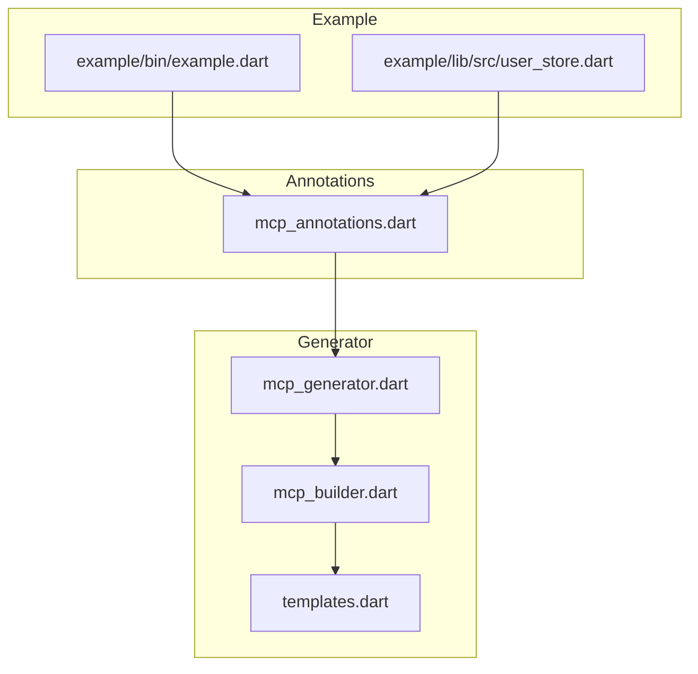
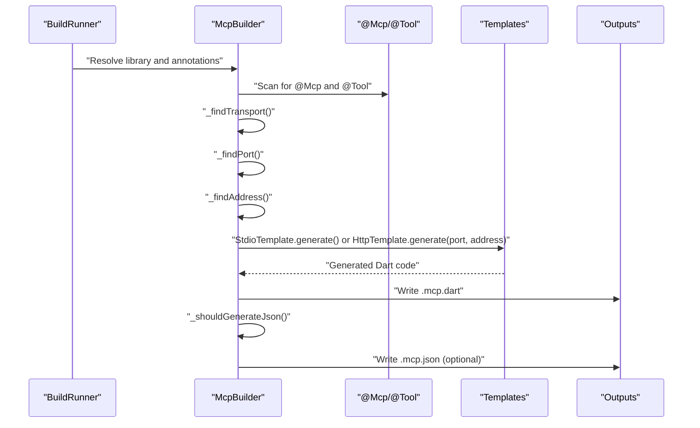
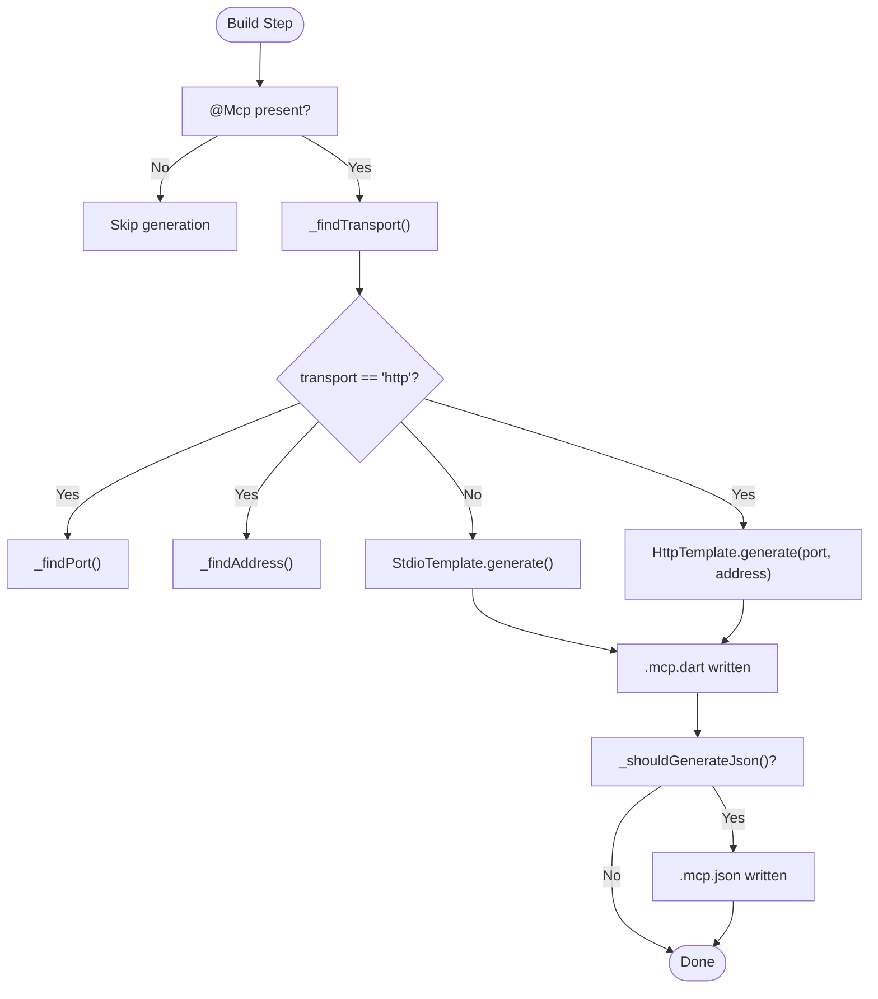
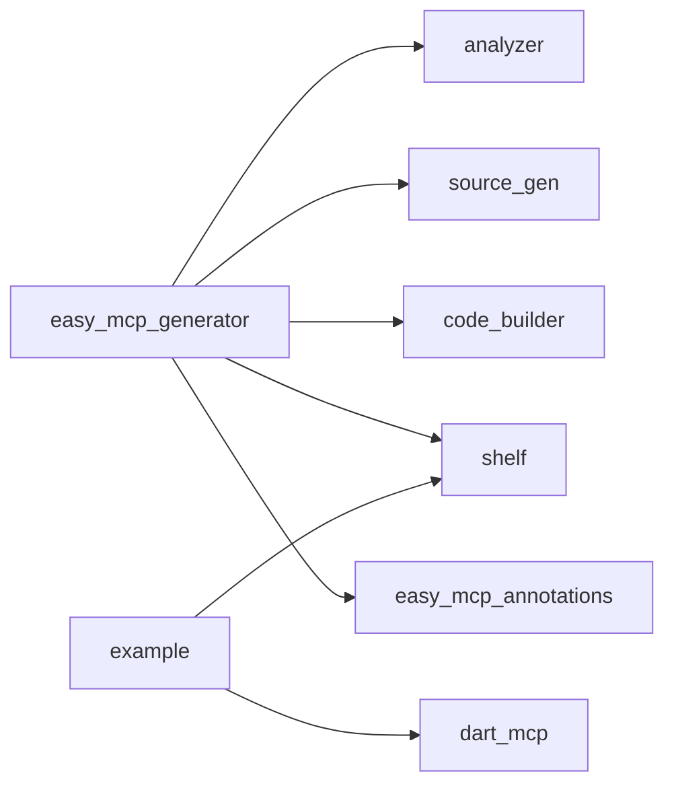

# @Mcp Annotation

<cite>
**Referenced Files in This Document**
- [mcp_annotations.dart](file://packages/easy_mcp_annotations/lib/mcp_annotations.dart)
- [mcp_generator.dart](file://packages/easy_mcp_generator/lib/mcp_generator.dart)
- [mcp_builder.dart](file://packages/easy_mcp_generator/lib/builder/mcp_builder.dart)
- [templates.dart](file://packages/easy_mcp_generator/lib/builder/templates.dart)
- [pubspec.yaml (annotations)](file://packages/easy_mcp_annotations/pubspec.yaml)
- [pubspec.yaml (generator)](file://packages/easy_mcp_generator/pubspec.yaml)
- [pubspec.yaml (example)](file://example/pubspec.yaml)
- [README.md](file://README.md)
- [mcp_annotation_test.dart](file://packages/easy_mcp_annotations/test/mcp_annotation_test.dart)
- [mcp_builder_test.dart](file://packages/easy_mcp_generator/test/mcp_builder_test.dart)
- [example.dart](file://example/bin/example.dart)
- [user_store.dart](file://example/lib/src/user_store.dart)
- [templates_test.dart](file://packages/easy_mcp_generator/test/templates_test.dart)
</cite>

## Update Summary
**Changes Made**
- Updated version information from 0.2.1 to 0.2.2 for easy_mcp_annotations and easy_mcp_generator packages
- Updated dependency examples to show ^0.2.2 versioning in README and pubspec files
- Enhanced documentation links and package information to reflect current versions
- Maintained all existing functionality documentation while updating version references

## Table of Contents
1. [Introduction](#introduction)
2. [Project Structure](#project-structure)
3. [Core Components](#core-components)
4. [Architecture Overview](#architecture-overview)
5. [Detailed Component Analysis](#detailed-component-analysis)
6. [Dependency Analysis](#dependency-analysis)
7. [Performance Considerations](#performance-considerations)
8. [Troubleshooting Guide](#troubleshooting-guide)
9. [Conclusion](#conclusion)
10. [Appendices](#appendices)

## Introduction
This document explains the @Mcp annotation and its role in configuring MCP server generation. It focuses on transport configuration (McpTransport.stdio vs McpTransport.http), HTTP server configuration with port and address parameters, JSON-RPC protocol setup for stdio, and the generateJson parameter that controls schema metadata generation. It also documents parameter validation, defaults, inheritance behavior, and practical examples of how transport selection affects generated server code.

**Updated** Version 0.2.2 introduces enhanced stability and improved dependency management with updated package versions.

## Project Structure
The repository is a Dart workspace with two primary packages:
- easy_mcp_annotations: Defines the @Mcp and @Tool annotations and enums.
- easy_mcp_generator: Implements a build_runner generator that reads annotations and produces MCP server code.

Key files:
- Annotations: packages/easy_mcp_annotations/lib/mcp_annotations.dart
- Generator: packages/easy_mcp_generator/lib/builder/mcp_builder.dart
- Templates: packages/easy_mcp_generator/lib/builder/templates.dart
- Example usage: example/bin/example.dart, example/lib/src/user_store.dart



**Diagram sources**
- [mcp_annotations.dart:1-241](file://packages/easy_mcp_annotations/lib/mcp_annotations.dart#L1-L241)
- [mcp_generator.dart:1-14](file://packages/easy_mcp_generator/lib/mcp_generator.dart#L1-L14)
- [mcp_builder.dart:1-834](file://packages/easy_mcp_generator/lib/builder/mcp_builder.dart#L1-L834)
- [templates.dart:1-630](file://packages/easy_mcp_generator/lib/builder/templates.dart#L1-L630)
- [example.dart:1-67](file://example/bin/example.dart#L1-L67)
- [user_store.dart:1-158](file://example/lib/src/user_store.dart#L1-L158)

**Section sources**
- [README.md:1-168](file://README.md#L1-L168)
- [pubspec.yaml (annotations):1-28](file://packages/easy_mcp_annotations/pubspec.yaml#L1-L28)
- [pubspec.yaml (generator):1-34](file://packages/easy_mcp_generator/pubspec.yaml#L1-L34)
- [pubspec.yaml (example):1-22](file://example/pubspec.yaml#L1-L22)

## Core Components
- McpTransport enum: stdio (default) and http.
- @Mcp annotation: configures transport, port, address, and whether to generate JSON metadata.
- @Tool annotation: marks functions as MCP tools and supplies metadata.
- McpBuilder: extracts annotations and generates server code.
- Templates: StdioTemplate and HttpTemplate produce runnable server code.

Key behaviors:
- Transport selection drives which template is used during generation.
- generateJson toggles creation of a .mcp.json metadata file.
- Default transport is stdio when @Mcp is present but transport is unspecified.
- HTTP transport supports configurable port (default: 3000) and address (default: '127.0.0.1').

**Section sources**
- [mcp_annotations.dart:10-20](file://packages/easy_mcp_annotations/lib/mcp_annotations.dart#L10-L20)
- [mcp_annotations.dart:54-90](file://packages/easy_mcp_annotations/lib/mcp_annotations.dart#L54-L90)
- [mcp_annotations.dart:114-140](file://packages/easy_mcp_annotations/lib/mcp_annotations.dart#L114-L140)
- [mcp_builder.dart:27-77](file://packages/easy_mcp_generator/lib/builder/mcp_builder.dart#L27-L77)
- [mcp_builder.dart:59-61](file://packages/easy_mcp_generator/lib/builder/mcp_builder.dart#L59-L61)
- [mcp_builder.dart:626-734](file://packages/easy_mcp_generator/lib/builder/mcp_builder.dart#L626-L734)
- [templates.dart:15-189](file://packages/easy_mcp_generator/lib/builder/templates.dart#L15-L189)
- [templates.dart:303-538](file://packages/easy_mcp_generator/lib/builder/templates.dart#L303-L538)

## Architecture Overview
The generator runs during build_runner and:
- Scans the library for @Mcp and @Tool annotations.
- Extracts tool metadata and parameter schemas.
- Chooses a transport template (stdio or http) based on transport parameter.
- For HTTP transport, extracts port and address configuration for server binding.
- Writes .mcp.dart and optionally .mcp.json artifacts.



**Diagram sources**
- [mcp_builder.dart:34-77](file://packages/easy_mcp_generator/lib/builder/mcp_builder.dart#L34-L77)
- [mcp_builder.dart:59-61](file://packages/easy_mcp_generator/lib/builder/mcp_builder.dart#L59-L61)
- [mcp_builder.dart:626-734](file://packages/easy_mcp_generator/lib/builder/mcp_builder.dart#L626-L734)
- [templates.dart:21-21](file://packages/easy_mcp_generator/lib/builder/templates.dart#L21-L21)
- [templates.dart:311-315](file://packages/easy_mcp_generator/lib/builder/templates.dart#L311-L315)

## Detailed Component Analysis

### McpTransport Enum
- stdio: Default transport. Generates a stdio-based server using JSON-RPC over stdin/stdout.
- http: HTTP transport. Generates an HTTP server using shelf, bridging HTTP requests to the MCP stream channel.

Implementation details:
- stdio template imports dart_mcp stdio utilities and sets up a stdio channel.
- http template imports shelf and stream_channel, creates a StreamChannel bridge, and serves HTTP on loopback.

Validation and defaults:
- Tests confirm stdio is accepted and is the default when transport is omitted.
- The builder falls back to stdio if no @Mcp transport is found.

**Section sources**
- [mcp_annotations.dart:10-20](file://packages/easy_mcp_annotations/lib/mcp_annotations.dart#L10-L20)
- [mcp_annotation_test.dart:6-19](file://packages/easy_mcp_annotations/test/mcp_annotation_test.dart#L6-L19)
- [mcp_builder.dart:590](file://packages/easy_mcp_generator/lib/builder/mcp_builder.dart#L590)
- [templates.dart:15-189](file://packages/easy_mcp_generator/lib/builder/templates.dart#L15-L189)
- [templates.dart:303-538](file://packages/easy_mcp_generator/lib/builder/templates.dart#L303-L538)

### @Mcp Annotation Parameters
- transport: McpTransport (stdio or http). Controls generated server transport.
- generateJson: bool. When true, the generator writes a .mcp.json file with tool metadata and input schemas.
- port: int. HTTP server port (only used when transport is http). Defaults to 3000.
- address: String. HTTP server bind address (only used when transport is http). Defaults to '127.0.0.1'.

Defaults and validation:
- transport defaults to stdio when omitted.
- generateJson defaults to false.
- port defaults to 3000 for HTTP transport.
- address defaults to '127.0.0.1' (loopback) for HTTP transport.
- The builder reads the constant values of @Mcp to determine behavior.

Inheritance behavior:
- The annotation can be applied to libraries, classes, or methods. The generator scans for @Mcp at the library level and uses its parameters to configure the server.

**Section sources**
- [mcp_annotations.dart:54-90](file://packages/easy_mcp_annotations/lib/mcp_annotations.dart#L54-L90)
- [mcp_builder.dart:626-734](file://packages/easy_mcp_generator/lib/builder/mcp_builder.dart#L626-L734)
- [mcp_builder.dart:590](file://packages/easy_mcp_generator/lib/builder/mcp_builder.dart#L590)

### Transport-Specific Configuration Effects

#### stdio Transport
- Protocol: JSON-RPC over stdin/stdout.
- Generated code: Sets up a stdio channel and registers tools in MCPServerWithTools.
- Typical use case: CLI-based MCP clients and local integration.



**Diagram sources**
- [mcp_builder.dart:34-77](file://packages/easy_mcp_generator/lib/builder/mcp_builder.dart#L34-L77)
- [mcp_builder.dart:59-61](file://packages/easy_mcp_generator/lib/builder/mcp_builder.dart#L59-L61)
- [mcp_builder.dart:626-734](file://packages/easy_mcp_generator/lib/builder/mcp_builder.dart#L626-L734)
- [templates.dart:21-21](file://packages/easy_mcp_generator/lib/builder/templates.dart#L21-L21)
- [templates.dart:311-315](file://packages/easy_mcp_generator/lib/builder/templates.dart#L311-L315)

#### http Transport
- Protocol: HTTP over localhost using shelf.
- Generated code: Creates a StreamChannel bridge, serves HTTP requests, and forwards JSON-RPC messages to the MCP server.
- Typical use case: Remote clients connecting via HTTP.
- Port configuration: Uses the configured port parameter (default: 3000).
- Address configuration: Uses the configured address parameter (default: '127.0.0.1').

HTTP server specifics visible in generated code:
- Conditional import of dart:io only when using the default loopback address ('127.0.0.1').
- Loopback IPv4 binding for default address and string literal binding for custom addresses.
- Request handler validates method and posts request bodies to the MCP channel.
- Responses are buffered and returned as JSON.
- Server prints the actual port number when started.

**Section sources**
- [templates.dart:303-538](file://packages/easy_mcp_generator/lib/builder/templates.dart#L303-L538)
- [mcp_builder.dart:626-734](file://packages/easy_mcp_generator/lib/builder/mcp_builder.dart#L626-L734)

### JSON Metadata Generation (generateJson)
- When generateJson is true, the builder generates a .mcp.json file containing schemaVersion and tools with inputSchema and required fields derived from parameter introspection.
- The JSON schema is built from parameter types and optionality.

**Section sources**
- [mcp_annotations.dart:60-64](file://packages/easy_mcp_annotations/lib/mcp_annotations.dart#L60-L64)
- [mcp_builder.dart:456-482](file://packages/easy_mcp_generator/lib/builder/mcp_builder.dart#L456-L482)
- [mcp_builder.dart:516-557](file://packages/easy_mcp_generator/lib/builder/mcp_builder.dart#L516-L557)

### Practical Examples

#### Example: @Mcp on a library main with HTTP transport and custom configuration
- The example applies @Mcp(transport: McpTransport.http, port: 8080, address: '0.0.0.0') to the main function and exposes tools via @Tool on static methods in a class.

References:
- [example.dart:6-6](file://example/bin/example.dart#L6-L6)
- [user_store.dart:55-65](file://example/lib/src/user_store.dart#L55-L65)

#### Example: @Mcp on a class
- Apply @Mcp to a class to configure transport for all methods within that class that are annotated with @Tool.

References:
- [user_store.dart:9-9](file://example/lib/src/user_store.dart#L9-L9)

#### Example: @Mcp on a method
- Apply @Mcp to a method to configure transport for that specific method's tool registration.

References:
- [user_store.dart:55-65](file://example/lib/src/user_store.dart#L55-L65)

#### Example: Default stdio transport
- Omitting transport uses stdio by default.

References:
- [mcp_annotation_test.dart:16-19](file://packages/easy_mcp_annotations/test/mcp_annotation_test.dart#L16-L19)

#### Example: HTTP transport with default configuration
- Using @Mcp(transport: McpTransport.http) without specifying port/address uses default values (port: 3000, address: '127.0.0.1').

References:
- [example.dart:6-6](file://example/bin/example.dart#L6-L6)

### Parameter Validation Rules and Defaults
- transport: Accepts McpTransport.stdio and McpTransport.http. Defaults to stdio when omitted.
- generateJson: Accepts boolean; defaults to false.
- port: Integer port number for HTTP transport; defaults to 3000 when omitted.
- address: String bind address for HTTP transport; defaults to '127.0.0.1' when omitted.
- Inheritance: The generator scans for @Mcp at the library level and uses its parameters to drive generation.

**Section sources**
- [mcp_annotations.dart:54-90](file://packages/easy_mcp_annotations/lib/mcp_annotations.dart#L54-L90)
- [mcp_annotation_test.dart:6-19](file://packages/easy_mcp_annotations/test/mcp_annotation_test.dart#L6-L19)
- [mcp_builder.dart:626-734](file://packages/easy_mcp_generator/lib/builder/mcp_builder.dart#L626-L734)

## Dependency Analysis
- easy_mcp_generator depends on:
  - analyzer and source_gen for AST processing.
  - code_builder for code generation.
  - shelf for HTTP transport.
  - easy_mcp_annotations for annotation definitions.
- example depends on dart_mcp and shelf to run generated servers.



**Diagram sources**
- [pubspec.yaml (generator):10-19](file://packages/easy_mcp_generator/pubspec.yaml#L10-L19)
- [pubspec.yaml (example):11-16](file://example/pubspec.yaml#L11-L16)

**Section sources**
- [pubspec.yaml (generator):10-19](file://packages/easy_mcp_generator/pubspec.yaml#L10-L19)
- [pubspec.yaml (annotations):11-13](file://packages/easy_mcp_annotations/pubspec.yaml#L11-L13)
- [pubspec.yaml (example):11-16](file://example/pubspec.yaml#L11-L16)

## Performance Considerations
- stdio transport has minimal overhead and is efficient for local CLI integrations.
- HTTP transport introduces HTTP parsing and JSON serialization overhead but enables remote clients.
- JSON metadata generation adds disk I/O and JSON encoding work; enable generateJson only when needed.
- HTTP server performance depends on port availability and network interface binding.

## Troubleshooting Guide
Common issues and resolutions:
- No server generated:
  - Ensure the library contains @Mcp and @Tool annotations. The builder only processes libraries with @Mcp.
  - Verify the annotation is applied at the library level or on a class/method that is part of the scanned library.

- Wrong transport selected:
  - Confirm the transport parameter is set to McpTransport.http or McpTransport.stdio.
  - The builder falls back to stdio if no @Mcp transport is found.

- HTTP server not reachable:
  - The generated HTTP server binds to the configured address and port. Ensure the port is free and accessible locally.
  - For remote access, use address '0.0.0.0' or a specific IP address.
  - Check firewall settings and network connectivity.

- Port conflicts:
  - If port 3000 is in use, specify a different port in the @Mcp annotation.
  - The builder will use the configured port value in the generated HTTP server.

- Address binding issues:
  - Default address '127.0.0.1' only accepts local connections.
  - Use '0.0.0.0' to accept connections from any interface.
  - Specify a specific IP address to bind to a particular network interface.

- JSON metadata missing:
  - Set generateJson to true in @Mcp to generate .mcp.json.

- Tool not registered:
  - Ensure methods are annotated with @Tool and are accessible (static or properly scoped) so the builder can extract them.

**Section sources**
- [mcp_builder.dart:34-77](file://packages/easy_mcp_generator/lib/builder/mcp_builder.dart#L34-L77)
- [mcp_builder.dart:626-734](file://packages/easy_mcp_generator/lib/builder/mcp_builder.dart#L626-L734)
- [templates_test.dart:170-183](file://packages/easy_mcp_generator/test/templates_test.dart#L170-L183)

## Conclusion
The @Mcp annotation provides a concise way to configure MCP server generation, selecting between stdio and HTTP transports and controlling JSON metadata generation. The addition of port and address parameters enhances HTTP transport flexibility, allowing precise control over server binding. Understanding how transport selection and configuration parameters influence generated code helps you choose the right mode for your deployment scenario and troubleshoot runtime issues effectively.

**Updated** Version 0.2.2 ensures stable package dependencies and improved compatibility with the latest Dart ecosystem.

## Appendices

### Best Practices for Transport Selection
- Use stdio for local CLI tools and tight integrations where low latency and simplicity are priorities.
- Use http for remote clients, web dashboards, or environments requiring HTTP connectivity.
- For production deployments, consider using non-loopback addresses and appropriate ports.

### Common Configuration Patterns
- Library-level @Mcp with @Tool on static methods for straightforward tool exposure.
- Class-level @Mcp to scope transport for a module of tools.
- Method-level @Mcp for selective overrides when mixing transports within a library.
- HTTP transport with custom port and address for containerized deployments.

### Parameter Reference
- transport: McpTransport (stdio | http)
- generateJson: bool
- port: int (HTTP transport only, default: 3000)
- address: String (HTTP transport only, default: '127.0.0.1')

### HTTP Transport Configuration Examples
- Default HTTP configuration: `@Mcp(transport: McpTransport.http)` → binds to 127.0.0.1:3000
- Custom port: `@Mcp(transport: McpTransport.http, port: 8080)` → binds to 127.0.0.1:8080
- Remote access: `@Mcp(transport: McpTransport.http, address: '0.0.0.0')` → binds to 0.0.0.0:3000
- Custom configuration: `@Mcp(transport: McpTransport.http, port: 8080, address: '0.0.0.0')` → binds to 0.0.0.0:8080

### Dependency Management Best Practices
- Keep easy_mcp_annotations as a separate package dependency for annotation definitions.
- Use easy_mcp_generator as a dev_dependency for code generation.
- Ensure proper version alignment between packages for stable builds.
- Example dependency structure:
  ```yaml
  dependencies:
    easy_mcp_annotations: ^0.2.2
  
  dev_dependencies:
    build_runner: ^2.4.0
    easy_mcp_generator: ^0.2.2
  ```

**Updated** Version 0.2.2 dependency examples show the latest package versions for optimal compatibility.

**Section sources**
- [mcp_annotations.dart:54-90](file://packages/easy_mcp_annotations/lib/mcp_annotations.dart#L54-L90)
- [mcp_builder.dart:27-77](file://packages/easy_mcp_generator/lib/builder/mcp_builder.dart#L27-L77)
- [templates_test.dart:150-183](file://packages/easy_mcp_generator/test/templates_test.dart#L150-L183)
- [pubspec.yaml (annotations):11-13](file://packages/easy_mcp_annotations/pubspec.yaml#L11-L13)
- [pubspec.yaml (generator):10-19](file://packages/easy_mcp_generator/pubspec.yaml#L10-L19)
- [pubspec.yaml (example):11-16](file://example/pubspec.yaml#L11-L16)
- [README.md:24-31](file://README.md#L24-L31)