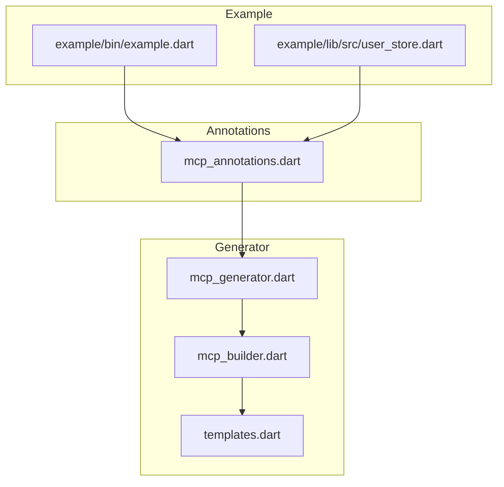
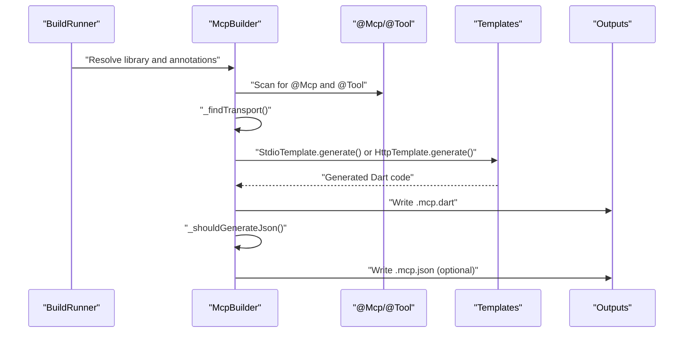
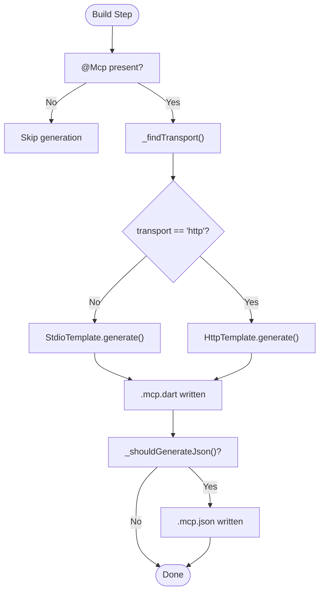
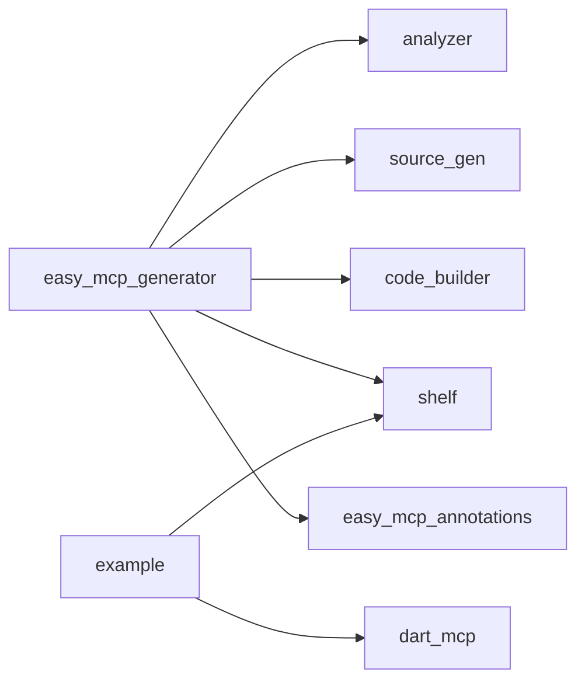

# @Mcp Annotation

<cite>
**Referenced Files in This Document**
- [mcp_annotations.dart](file://packages/easy_mcp_annotations/lib/mcp_annotations.dart)
- [mcp_generator.dart](file://packages/easy_mcp_generator/lib/mcp_generator.dart)
- [mcp_builder.dart](file://packages/easy_mcp_generator/lib/builder/mcp_builder.dart)
- [templates.dart](file://packages/easy_mcp_generator/lib/builder/templates.dart)
- [pubspec.yaml (annotations)](file://packages/easy_mcp_annotations/pubspec.yaml)
- [pubspec.yaml (generator)](file://packages/easy_mcp_generator/pubspec.yaml)
- [pubspec.yaml (example)](file://example/pubspec.yaml)
- [README.md](file://README.md)
- [mcp_annotation_test.dart](file://packages/easy_mcp_annotations/test/mcp_annotation_test.dart)
- [mcp_builder_test.dart](file://packages/easy_mcp_generator/test/mcp_builder_test.dart)
- [example.dart](file://example/bin/example.dart)
- [user_store.dart](file://example/lib/src/user_store.dart)
</cite>

## Table of Contents
1. [Introduction](#introduction)
2. [Project Structure](#project-structure)
3. [Core Components](#core-components)
4. [Architecture Overview](#architecture-overview)
5. [Detailed Component Analysis](#detailed-component-analysis)
6. [Dependency Analysis](#dependency-analysis)
7. [Performance Considerations](#performance-considerations)
8. [Troubleshooting Guide](#troubleshooting-guide)
9. [Conclusion](#conclusion)
10. [Appendices](#appendices)

## Introduction
This document explains the @Mcp annotation and its role in configuring MCP server generation. It focuses on transport configuration (McpTransport.stdio vs McpTransport.http), JSON-RPC protocol setup for stdio, HTTP server configuration for http, and the generateJson parameter that controls schema metadata generation. It also documents parameter validation, defaults, inheritance behavior, and practical examples of how transport selection affects generated server code.

## Project Structure
The repository is a Dart workspace with two primary packages:
- easy_mcp_annotations: Defines the @Mcp and @Tool annotations and enums.
- easy_mcp_generator: Implements a build_runner generator that reads annotations and produces MCP server code.

Key files:
- Annotations: packages/easy_mcp_annotations/lib/mcp_annotations.dart
- Generator: packages/easy_mcp_generator/lib/builder/mcp_builder.dart
- Templates: packages/easy_mcp_generator/lib/builder/templates.dart
- Example usage: example/bin/example.dart, example/lib/src/user_store.dart

**Diagram sources**
- [mcp_annotations.dart:1-107](file://packages/easy_mcp_annotations/lib/mcp_annotations.dart#L1-L107)
- [mcp_generator.dart:1-14](file://packages/easy_mcp_generator/lib/mcp_generator.dart#L1-L14)
- [mcp_builder.dart:1-567](file://packages/easy_mcp_generator/lib/builder/mcp_builder.dart#L1-L567)
- [templates.dart:1-578](file://packages/easy_mcp_generator/lib/builder/templates.dart#L1-L578)
- [example.dart:1-67](file://example/bin/example.dart#L1-L67)
- [user_store.dart:1-144](file://example/lib/src/user_store.dart#L1-L144)

**Section sources**
- [README.md:1-120](file://README.md#L1-L120)
- [pubspec.yaml (annotations):1-28](file://packages/easy_mcp_annotations/pubspec.yaml#L1-L28)
- [pubspec.yaml (generator):1-35](file://packages/easy_mcp_generator/pubspec.yaml#L1-L35)
- [pubspec.yaml (example):1-22](file://example/pubspec.yaml#L1-L22)

## Core Components
- McpTransport enum: stdio (default) and http.
- @Mcp annotation: configures transport and whether to generate JSON metadata.
- @Tool annotation: marks functions as MCP tools and supplies metadata.
- McpBuilder: extracts annotations and generates server code.
- Templates: StdioTemplate and HttpTemplate produce runnable server code.

Key behaviors:
- Transport selection drives which template is used during generation.
- generateJson toggles creation of a .mcp.json metadata file.
- Default transport is stdio when @Mcp is present but transport is unspecified.

**Section sources**
- [mcp_annotations.dart:6-19](file://packages/easy_mcp_annotations/lib/mcp_annotations.dart#L6-L19)
- [mcp_annotations.dart:39-56](file://packages/easy_mcp_annotations/lib/mcp_annotations.dart#L39-L56)
- [mcp_annotations.dart:80-106](file://packages/easy_mcp_annotations/lib/mcp_annotations.dart#L80-L106)
- [mcp_builder.dart:35-52](file://packages/easy_mcp_generator/lib/builder/mcp_builder.dart#L35-L52)
- [mcp_builder.dart:492-513](file://packages/easy_mcp_generator/lib/builder/mcp_builder.dart#L492-L513)
- [mcp_builder.dart:516-563](file://packages/easy_mcp_generator/lib/builder/mcp_builder.dart#L516-L563)
- [templates.dart:6-175](file://packages/easy_mcp_generator/lib/builder/templates.dart#L6-L175)
- [templates.dart:269-486](file://packages/easy_mcp_generator/lib/builder/templates.dart#L269-L486)

## Architecture Overview
The generator runs during build_runner and:
- Scans the library for @Mcp and @Tool annotations.
- Extracts tool metadata and parameter schemas.
- Chooses a transport template (stdio or http).
- Writes .mcp.dart and optionally .mcp.json artifacts.

**Diagram sources**
- [mcp_builder.dart:18-52](file://packages/easy_mcp_generator/lib/builder/mcp_builder.dart#L18-L52)
- [mcp_builder.dart:35-52](file://packages/easy_mcp_generator/lib/builder/mcp_builder.dart#L35-L52)
- [templates.dart:6-175](file://packages/easy_mcp_generator/lib/builder/templates.dart#L6-L175)
- [templates.dart:269-486](file://packages/easy_mcp_generator/lib/builder/templates.dart#L269-L486)

## Detailed Component Analysis

### McpTransport Enum
- stdio: Default transport. Generates a stdio-based server using JSON-RPC over stdin/stdout.
- http: HTTP transport. Generates an HTTP server using shelf, bridging HTTP requests to the MCP stream channel.

Implementation details:
- stdio template imports dart_mcp stdio utilities and sets up a stdio channel.
- http template imports shelf and stream_channel, creates a StreamChannel bridge, and serves HTTP on loopback.

Validation and defaults:
- Tests confirm stdio is accepted and is the default when transport is omitted.
- The builder falls back to stdio if no @Mcp transport is found.

**Section sources**
- [mcp_annotations.dart:9-19](file://packages/easy_mcp_annotations/lib/mcp_annotations.dart#L9-L19)
- [mcp_annotation_test.dart:6-19](file://packages/easy_mcp_annotations/test/mcp_annotation_test.dart#L6-L19)
- [mcp_builder.dart:516-563](file://packages/easy_mcp_generator/lib/builder/mcp_builder.dart#L516-L563)
- [templates.dart:6-175](file://packages/easy_mcp_generator/lib/builder/templates.dart#L6-L175)
- [templates.dart:269-486](file://packages/easy_mcp_generator/lib/builder/templates.dart#L269-L486)

### @Mcp Annotation Parameters
- transport: McpTransport (stdio or http). Controls generated server transport.
- generateJson: bool. When true, the generator writes a .mcp.json file with tool metadata and input schemas.

Defaults and validation:
- transport defaults to stdio when omitted.
- generateJson defaults to false.
- The builder reads the constant values of @Mcp to determine behavior.

Inheritance behavior:
- The annotation can be applied to libraries, classes, or methods. The generator scans for @Mcp at the library level and uses its parameters to configure the server.

**Section sources**
- [mcp_annotations.dart:39-56](file://packages/easy_mcp_annotations/lib/mcp_annotations.dart#L39-L56)
- [mcp_builder.dart:492-513](file://packages/easy_mcp_generator/lib/builder/mcp_builder.dart#L492-L513)
- [mcp_builder.dart:516-563](file://packages/easy_mcp_generator/lib/builder/mcp_builder.dart#L516-L563)

### Transport-Specific Configuration Effects

#### stdio Transport
- Protocol: JSON-RPC over stdin/stdout.
- Generated code: Sets up a stdio channel and registers tools in MCPServerWithTools.
- Typical use case: CLI-based MCP clients and local integration.

**Diagram sources**
- [mcp_builder.dart:18-52](file://packages/easy_mcp_generator/lib/builder/mcp_builder.dart#L18-L52)
- [mcp_builder.dart:35-52](file://packages/easy_mcp_generator/lib/builder/mcp_builder.dart#L35-L52)
- [mcp_builder.dart:492-513](file://packages/easy_mcp_generator/lib/builder/mcp_builder.dart#L492-L513)
- [mcp_builder.dart:516-563](file://packages/easy_mcp_generator/lib/builder/mcp_builder.dart#L516-L563)
- [templates.dart:6-175](file://packages/easy_mcp_generator/lib/builder/templates.dart#L6-L175)
- [templates.dart:269-486](file://packages/easy_mcp_generator/lib/builder/templates.dart#L269-L486)

#### http Transport
- Protocol: HTTP over localhost using shelf.
- Generated code: Creates a StreamChannel bridge, serves HTTP requests, and forwards JSON-RPC messages to the MCP server.
- Typical use case: Remote clients connecting via HTTP.

HTTP server specifics visible in generated code:
- Loopback IPv4 binding and a default port passed to HttpTemplate.generate().
- Request handler validates method and posts request bodies to the MCP channel.
- Responses are buffered and returned as JSON.

**Section sources**
- [templates.dart:382-486](file://packages/easy_mcp_generator/lib/builder/templates.dart#L382-L486)
- [mcp_builder.dart:36-38](file://packages/easy_mcp_generator/lib/builder/mcp_builder.dart#L36-L38)

### JSON Metadata Generation (generateJson)
- When generateJson is true, the builder generates a .mcp.json file containing schemaVersion and tools with inputSchema and required fields derived from parameter introspection.
- The JSON schema is built from parameter types and optionality.

**Section sources**
- [mcp_annotations.dart:45-49](file://packages/easy_mcp_annotations/lib/mcp_annotations.dart#L45-L49)
- [mcp_builder.dart:442-468](file://packages/easy_mcp_generator/lib/builder/mcp_builder.dart#L442-L468)
- [mcp_builder.dart:492-513](file://packages/easy_mcp_generator/lib/builder/mcp_builder.dart#L492-L513)

### Practical Examples

#### Example: @Mcp on a library main
- The example applies @Mcp(transport: McpTransport.http) to the main function and exposes tools via @Tool on static methods in a class.

References:
- [example.dart:6-6](file://example/bin/example.dart#L6-L6)
- [user_store.dart:55-65](file://example/lib/src/user_store.dart#L55-L65)

#### Example: @Mcp on a class
- Apply @Mcp to a class to configure transport for all methods within that class that are annotated with @Tool.

References:
- [user_store.dart:9-9](file://example/lib/src/user_store.dart#L9-L9)

#### Example: @Mcp on a method
- Apply @Mcp to a method to configure transport for that specific method’s tool registration.

References:
- [user_store.dart:55-65](file://example/lib/src/user_store.dart#L55-L65)

#### Example: Default stdio transport
- Omitting transport uses stdio by default.

References:
- [mcp_annotation_test.dart:16-19](file://packages/easy_mcp_annotations/test/mcp_annotation_test.dart#L16-L19)

### Parameter Validation Rules and Defaults
- transport: Accepts McpTransport.stdio and McpTransport.http. Defaults to stdio when omitted.
- generateJson: Accepts boolean; defaults to false.
- Inheritance: The generator scans for @Mcp at the library level and uses its parameters to drive generation.

**Section sources**
- [mcp_annotations.dart:39-56](file://packages/easy_mcp_annotations/lib/mcp_annotations.dart#L39-L56)
- [mcp_annotation_test.dart:6-19](file://packages/easy_mcp_annotations/test/mcp_annotation_test.dart#L6-L19)
- [mcp_builder.dart:470-489](file://packages/easy_mcp_generator/lib/builder/mcp_builder.dart#L470-L489)

## Dependency Analysis
- easy_mcp_generator depends on:
  - analyzer and source_gen for AST processing.
  - code_builder for code generation.
  - shelf for HTTP transport.
  - easy_mcp_annotations for annotation definitions.
- example depends on dart_mcp and shelf to run generated servers.

**Diagram sources**
- [pubspec.yaml (generator):10-19](file://packages/easy_mcp_generator/pubspec.yaml#L10-L19)
- [pubspec.yaml (example):11-16](file://example/pubspec.yaml#L11-L16)

**Section sources**
- [pubspec.yaml (generator):10-19](file://packages/easy_mcp_generator/pubspec.yaml#L10-L19)
- [pubspec.yaml (annotations):11-13](file://packages/easy_mcp_annotations/pubspec.yaml#L11-L13)
- [pubspec.yaml (example):11-16](file://example/pubspec.yaml#L11-L16)

## Performance Considerations
- stdio transport has minimal overhead and is efficient for local CLI integrations.
- HTTP transport introduces HTTP parsing and JSON serialization overhead but enables remote clients.
- JSON metadata generation adds disk I/O and JSON encoding work; enable generateJson only when needed.

## Troubleshooting Guide
Common issues and resolutions:
- No server generated:
  - Ensure the library contains @Mcp and @Tool annotations. The builder only processes libraries with @Mcp.
  - Verify the annotation is applied at the library level or on a class/method that is part of the scanned library.

- Wrong transport selected:
  - Confirm the transport parameter is set to McpTransport.http or McpTransport.stdio.
  - The builder falls back to stdio if no @Mcp transport is found.

- HTTP server not reachable:
  - The generated HTTP server binds to loopback IPv4 and prints the port. Ensure the port is free and accessible locally.

- JSON metadata missing:
  - Set generateJson to true in @Mcp to generate .mcp.json.

- Tool not registered:
  - Ensure methods are annotated with @Tool and are accessible (static or properly scoped) so the builder can extract them.

**Section sources**
- [mcp_builder.dart:27-33](file://packages/easy_mcp_generator/lib/builder/mcp_builder.dart#L27-L33)
- [mcp_builder.dart:492-513](file://packages/easy_mcp_generator/lib/builder/mcp_builder.dart#L492-L513)
- [mcp_builder.dart:516-563](file://packages/easy_mcp_generator/lib/builder/mcp_builder.dart#L516-L563)
- [templates.dart:436-449](file://packages/easy_mcp_generator/lib/builder/templates.dart#L436-L449)

## Conclusion
The @Mcp annotation provides a concise way to configure MCP server generation, selecting between stdio and HTTP transports and controlling JSON metadata generation. Understanding how transport selection influences generated code helps you choose the right mode for your deployment scenario and troubleshoot runtime issues effectively.

## Appendices

### Best Practices for Transport Selection
- Use stdio for local CLI tools and tight integrations where low latency and simplicity are priorities.
- Use http for remote clients, web dashboards, or environments requiring HTTP connectivity.

### Common Configuration Patterns
- Library-level @Mcp with @Tool on static methods for straightforward tool exposure.
- Class-level @Mcp to scope transport for a module of tools.
- Method-level @Mcp for selective overrides when mixing transports within a library.

### Parameter Reference
- transport: McpTransport (stdio | http)
- generateJson: bool

**Section sources**
- [mcp_annotations.dart:39-56](file://packages/easy_mcp_annotations/lib/mcp_annotations.dart#L39-L56)
- [mcp_builder.dart:35-52](file://packages/easy_mcp_generator/lib/builder/mcp_builder.dart#L35-L52)