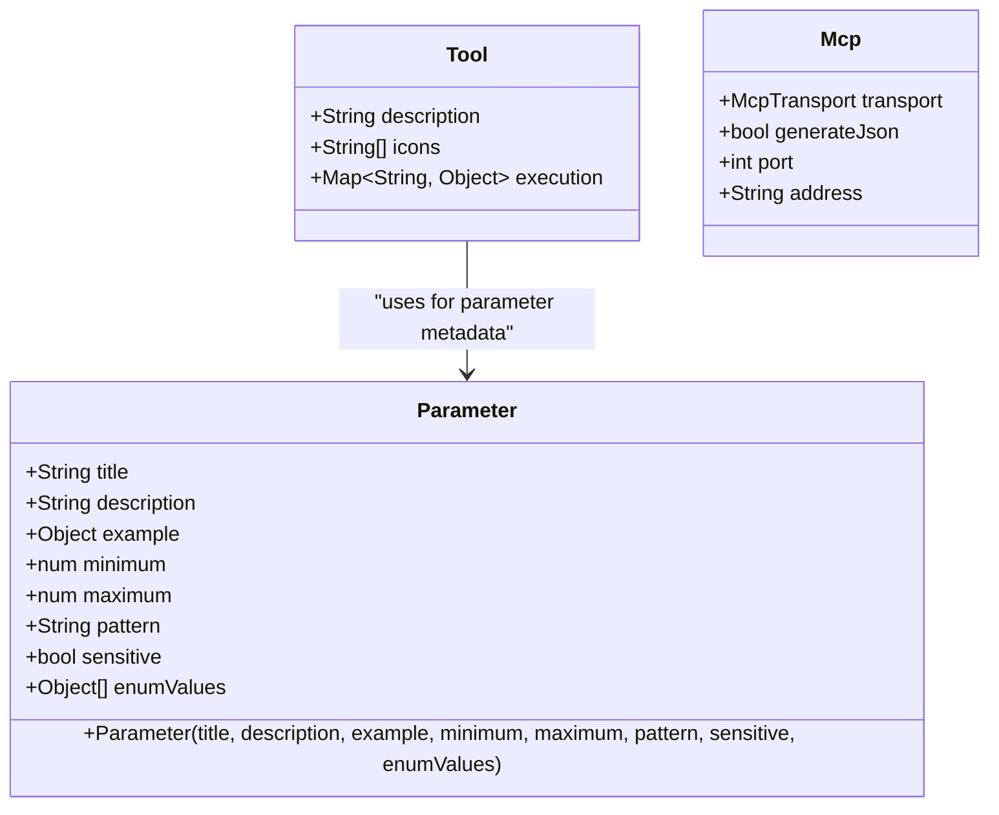
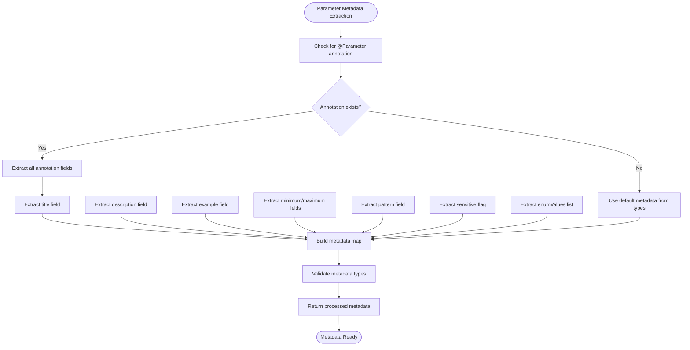
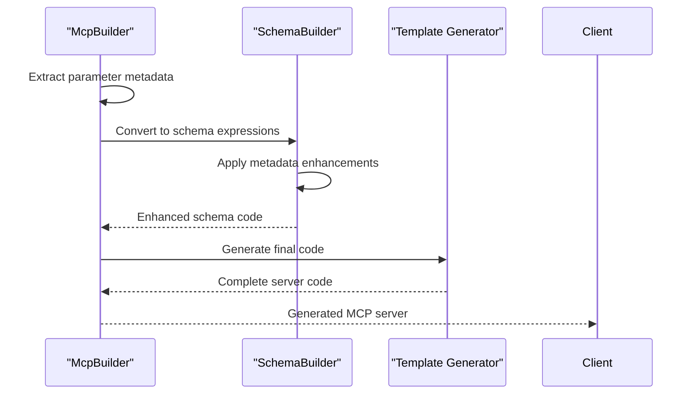
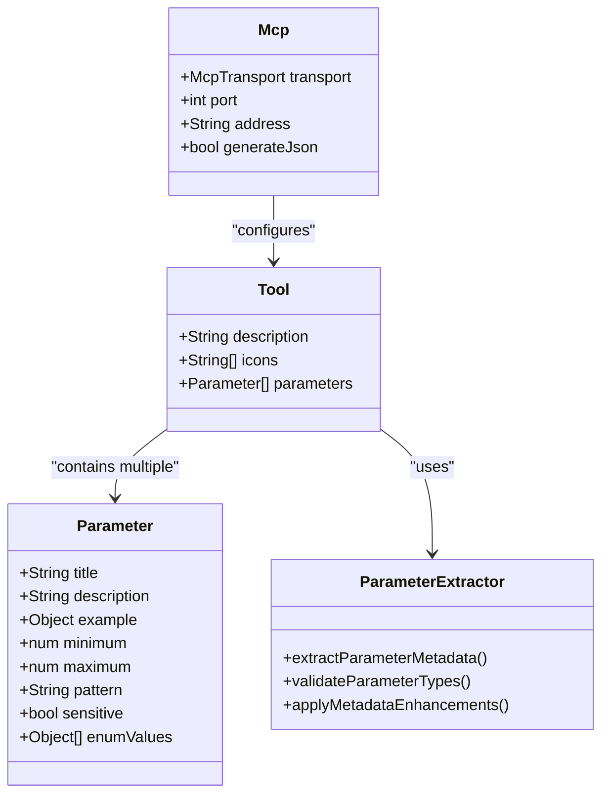

# @Parameter Annotation Documentation

<cite>
**Referenced Files in This Document**
- [mcp_annotations.dart](file://packages/easy_mcp_annotations/lib/mcp_annotations.dart)
- [mcp_builder.dart](file://packages/easy_mcp_generator/lib/builder/mcp_builder.dart)
- [schema_builder.dart](file://packages/easy_mcp_generator/lib/builder/schema_builder.dart)
- [templates.dart](file://packages/easy_mcp_generator/lib/builder/templates.dart)
- [README.md](file://packages/easy_mcp_annotations/README.md)
- [README.md](file://README.md)
- [example.dart](file://example/lib/src/user_store.dart)
</cite>

## Table of Contents
1. [Introduction](#introduction)
2. [Overview](#overview)
3. [Parameter Annotation Definition](#parameter-annotation-definition)
4. [Usage Examples](#usage-examples)
5. [Metadata Extraction Process](#metadata-extraction-process)
6. [Schema Generation](#schema-generation)
7. [Validation Features](#validation-features)
8. [Integration with MCP Tools](#integration-with-mcp-tools)
9. [Best Practices](#best-practices)
10. [Troubleshooting](#troubleshooting)

## Introduction

The `@Parameter` annotation is a powerful feature in the Easy MCP ecosystem that allows developers to provide rich metadata for individual parameters in MCP tools. This annotation enhances the developer experience by enabling detailed parameter descriptions, validation rules, and user-friendly presentations in MCP clients.

## Overview

The `@Parameter` annotation serves as an optional enhancement to the basic parameter extraction process. While the generator can automatically extract parameter information from Dart types and method signatures, the `@Parameter` annotation allows developers to provide additional metadata that improves the usability and reliability of MCP tools.

Key capabilities include:
- Human-readable titles and descriptions
- Validation constraints (min/max values, patterns)
- Example values for user guidance
- Sensitive data marking
- Enum value restrictions

## Parameter Annotation Definition

The `@Parameter` annotation is defined as a Dart class with the following structure:



**Diagram sources**
- [mcp_annotations.dart:175-240](file://packages/easy_mcp_annotations/lib/mcp_annotations.dart#L175-L240)
- [mcp_annotations.dart:114-140](file://packages/easy_mcp_annotations/lib/mcp_annotations.dart#L114-L140)
- [mcp_annotations.dart:54-90](file://packages/easy_mcp_annotations/lib/mcp_annotations.dart#L54-L90)

**Section sources**
- [mcp_annotations.dart:142-240](file://packages/easy_mcp_annotations/lib/mcp_annotations.dart#L142-L240)

## Usage Examples

### Basic Parameter Enhancement

The most common use case involves adding titles and descriptions to improve parameter clarity:

```dart
@Tool(description: 'Create a new user')
Future<User> createUser({
  @Parameter(
    title: 'Full Name',
    description: 'The user\'s complete name including first and last name',
    example: 'John Doe',
  )
  required String name,
  
  @Parameter(
    title: 'Email Address',
    description: 'A valid email address for the user',
    example: 'john.doe@example.com',
    pattern: r'^[\w\.-]+@[\w\.-]+\.\w+$',
  )
  required String email,
}) async { ... }
```

### Numeric Validation

For numeric parameters, you can specify minimum and maximum values:

```dart
@Tool(description: 'Create user with age validation')
Future<User> createUserWithAge({
  @Parameter(
    title: 'Age',
    description: 'User age in years',
    minimum: 0,
    maximum: 150,
    example: 25,
  )
  int? age,
}) async { ... }
```

### Sensitive Data Handling

Mark parameters containing sensitive information:

```dart
@Tool(description: 'Create user with password')
Future<User> createUserWithPassword({
  @Parameter(
    title: 'Username',
    description: 'Unique identifier for the user',
    example: 'johndoe',
  )
  required String username,
  
  @Parameter(
    title: 'Password',
    description: 'Secure password for account access',
    sensitive: true,
  )
  required String password,
}) async { ... }
```

**Section sources**
- [README.md:77-104](file://packages/easy_mcp_annotations/README.md#L77-L104)
- [README.md:106-118](file://packages/easy_mcp_annotations/README.md#L106-L118)

## Metadata Extraction Process

The parameter metadata extraction process involves several steps performed by the MCP builder:



**Diagram sources**
- [mcp_builder.dart:285-369](file://packages/easy_mcp_generator/lib/builder/mcp_builder.dart#L285-L369)

The extraction process handles various data types and ensures proper validation:

**Section sources**
- [mcp_builder.dart:285-369](file://packages/easy_mcp_generator/lib/builder/mcp_builder.dart#L285-L369)

## Schema Generation

The extracted parameter metadata is integrated into the JSON schema generation process:



**Diagram sources**
- [schema_builder.dart:110-188](file://packages/easy_mcp_generator/lib/builder/schema_builder.dart#L110-L188)
- [templates.dart:68-108](file://packages/easy_mcp_generator/lib/builder/templates.dart#L68-L108)

The schema builder applies metadata enhancements to simple primitive schemas:

**Section sources**
- [schema_builder.dart:110-188](file://packages/easy_mcp_generator/lib/builder/schema_builder.dart#L110-L188)

## Validation Features

The `@Parameter` annotation supports several validation mechanisms:

### String Pattern Validation
Regular expression patterns for string validation:
- Email validation: `r'^[\w\.-]+@[\w\.-]+\.\w+$'`
- Custom patterns for specific formats
- Pattern matching applied during parameter validation

### Numeric Range Validation
Minimum and maximum constraints for numeric parameters:
- Age validation: `minimum: 0, maximum: 150`
- Price range validation
- Quantity limits

### Enum Value Restriction
Limit parameter values to specific allowed options:
- Status values: `['active', 'inactive', 'pending']`
- Priority levels: `['low', 'medium', 'high']`
- Custom enumerated types

### Sensitive Data Masking
The `sensitive` flag indicates parameters containing confidential information that should be masked in logs and UI displays.

**Section sources**
- [mcp_annotations.dart:194-218](file://packages/easy_mcp_annotations/lib/mcp_annotations.dart#L194-L218)

## Integration with MCP Tools

The `@Parameter` annotation integrates seamlessly with the broader MCP tool system:



**Diagram sources**
- [mcp_annotations.dart:114-240](file://packages/easy_mcp_annotations/lib/mcp_annotations.dart#L114-L240)
- [mcp_builder.dart:285-369](file://packages/easy_mcp_generator/lib/builder/mcp_builder.dart#L285-L369)

**Section sources**
- [mcp_annotations.dart:114-240](file://packages/easy_mcp_annotations/lib/mcp_annotations.dart#L114-L240)

## Best Practices

### When to Use @Parameter

Use the `@Parameter` annotation when you need to provide additional metadata beyond what can be inferred from the code:

- **Human-readable titles**: When parameter names are cryptic or abbreviated
- **Detailed descriptions**: When the parameter's purpose requires explanation
- **Validation constraints**: When parameters have specific format or range requirements
- **Example values**: When users need guidance on expected input formats
- **Sensitive data**: When parameters contain confidential information

### Parameter Design Guidelines

Follow these guidelines for effective parameter annotation:

1. **Be descriptive**: Use clear, concise titles and descriptions
2. **Provide examples**: Include realistic example values
3. **Define constraints**: Specify minimum/maximum values for numeric types
4. **Use patterns**: Define regular expressions for string validation
5. **Mark sensitive data**: Use the sensitive flag for passwords and API keys
6. **Limit enums**: Provide clear, finite sets of allowed values

### Performance Considerations

- The `@Parameter` annotation adds minimal runtime overhead
- Metadata extraction occurs during code generation, not at runtime
- Complex validation patterns may impact generation time slightly

**Section sources**
- [README.md:80-89](file://example/README.md#L80-L89)

## Troubleshooting

### Common Issues and Solutions

**Issue**: Parameter metadata not appearing in generated code
- **Solution**: Ensure the `@Parameter` annotation is properly imported and applied
- Verify that the parameter has the annotation decorator

**Issue**: Validation not working as expected
- **Solution**: Check that validation constraints are appropriate for the parameter type
- Ensure patterns are properly escaped regular expressions

**Issue**: Sensitive data not being masked
- **Solution**: Verify the `sensitive` flag is set to `true`
- Check that the MCP client supports sensitive data masking

### Debugging Tips

1. **Check annotation imports**: Ensure `package:easy_mcp_annotations/mcp_annotations.dart` is imported
2. **Verify parameter types**: Confirm parameters have appropriate types for validation
3. **Test with simple examples**: Start with basic parameter annotations before adding complex validation
4. **Review generated code**: Examine the generated `.mcp.dart` file to verify metadata inclusion

**Section sources**
- [mcp_builder.dart:285-369](file://packages/easy_mcp_generator/lib/builder/mcp_builder.dart#L285-L369)