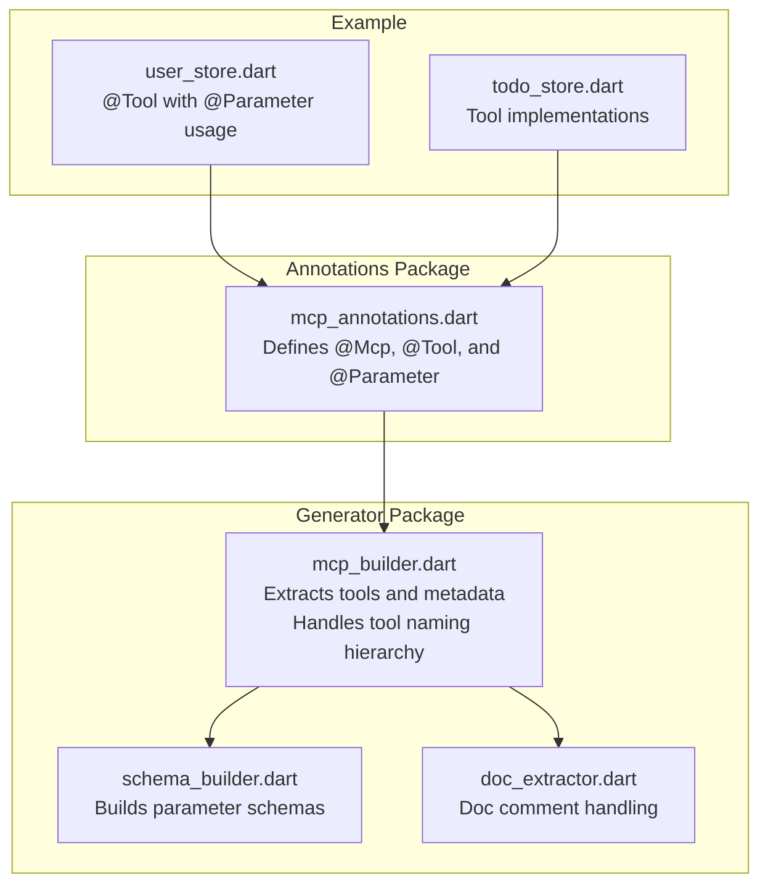
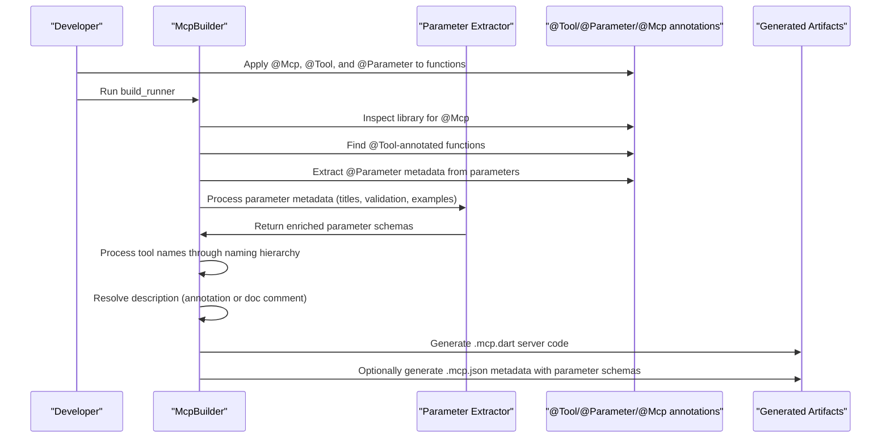
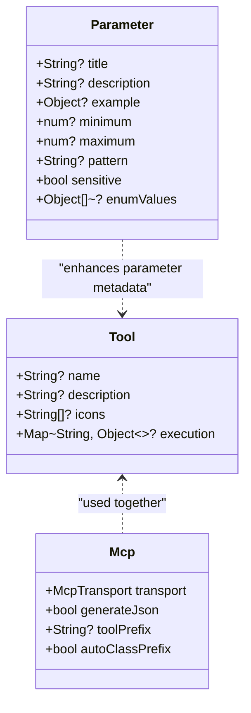
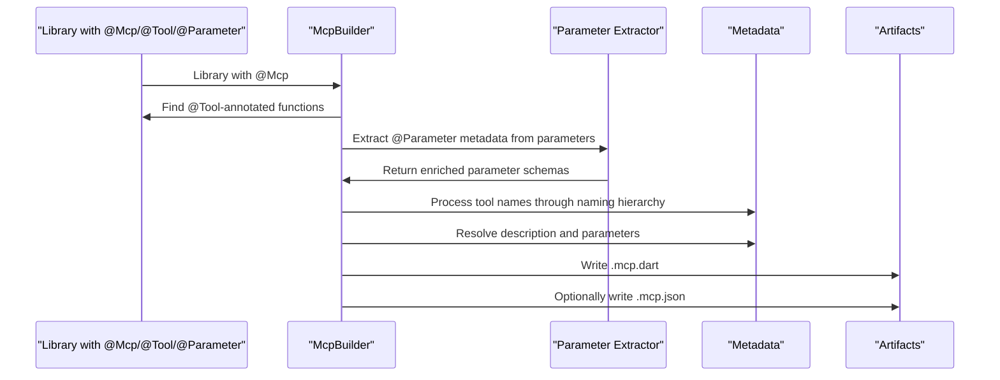
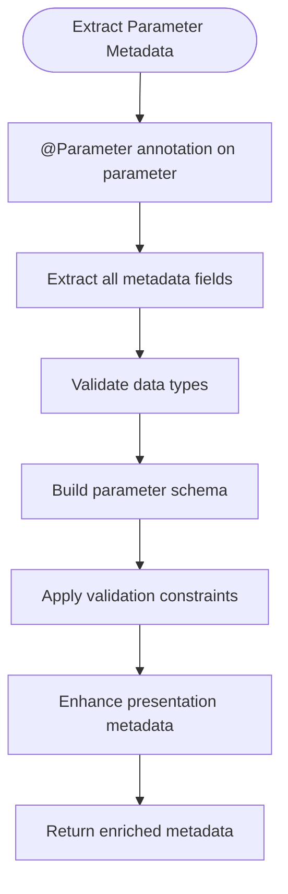
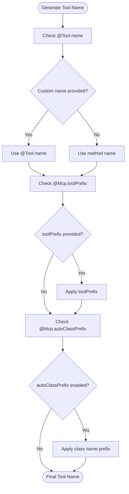
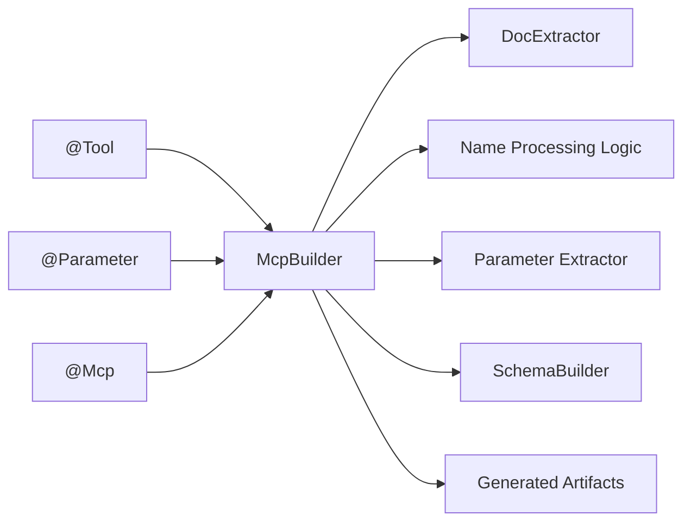

# @Tool Annotation

<cite>
**Referenced Files in This Document**
- [mcp_annotations.dart](file://packages/easy_mcp_annotations/lib/mcp_annotations.dart)
- [mcp_builder.dart](file://packages/easy_mcp_generator/lib/builder/mcp_builder.dart)
- [schema_builder.dart](file://packages/easy_mcp_generator/lib/builder/schema_builder.dart)
- [example.dart](file://packages/easy_mcp_annotations/test/example.dart)
- [user_store.dart](file://example/lib/src/user_store.dart)
- [todo_store.dart](file://example/lib/src/todo_store.dart)
- [README.md](file://README.md)
</cite>

## Update Summary
**Changes Made**
- Added comprehensive documentation for the new @Tool.name parameter for custom tool naming
- Updated tool naming priority system documentation to reflect custom name precedence
- Enhanced examples showing @Tool annotation usage with custom names, prefixes, and class prefixes
- Updated code generation pipeline integration to include custom name processing
- Added detailed coverage of the naming precedence: custom name > method name > toolPrefix > autoClassPrefix

## Table of Contents
1. [Introduction](#introduction)
2. [Project Structure](#project-structure)
3. [Core Components](#core-components)
4. [Architecture Overview](#architecture-overview)
5. [Detailed Component Analysis](#detailed-component-analysis)
6. [Enhanced Parameter Metadata System](#enhanced-parameter-metadata-system)
7. [Tool Naming System](#tool-naming-system)
8. [Dependency Analysis](#dependency-analysis)
9. [Performance Considerations](#performance-considerations)
10. [Troubleshooting Guide](#troubleshooting-guide)
11. [Conclusion](#conclusion)
12. [Appendices](#appendices)

## Introduction
This document provides comprehensive guidance for the @Tool annotation used to define MCP tool metadata and enhance documentation. The @Tool annotation now includes enhanced parameter metadata extraction capabilities through the new @Parameter annotation system and supports custom tool naming via the name parameter. It explains how to use the description parameter to override method doc comments, how to specify icons for visual representation, how the execution parameter is reserved for future use, and how custom tool names take precedence over method names in the naming hierarchy. The documentation covers the new @Parameter annotation system that enables rich parameter metadata including titles, descriptions, examples, validation constraints, and enum values. It also covers the relationship between @Tool and @Mcp annotations, precedence rules, and best practices for integrating @Tool metadata into the code generation pipeline to improve tool discoverability and user experience.

## Project Structure
The @Tool annotation is defined in the annotations package and consumed by the generator package. The generator extracts tool metadata from annotated functions and produces runnable MCP server code and optional JSON metadata. The new @Parameter annotation system enhances parameter metadata extraction with comprehensive validation and presentation capabilities. The tool naming system now supports custom names with a clear precedence hierarchy.



**Diagram sources**
- [mcp_annotations.dart](file://packages/easy_mcp_annotations/lib/mcp_annotations.dart)
- [mcp_builder.dart](file://packages/easy_mcp_generator/lib/builder/mcp_builder.dart)
- [schema_builder.dart](file://packages/easy_mcp_generator/lib/builder/schema_builder.dart)
- [user_store.dart](file://example/lib/src/user_store.dart)
- [todo_store.dart](file://example/lib/src/todo_store.dart)

**Section sources**
- [mcp_annotations.dart](file://packages/easy_mcp_annotations/lib/mcp_annotations.dart)
- [mcp_builder.dart](file://packages/easy_mcp_generator/lib/builder/mcp_builder.dart)
- [schema_builder.dart](file://packages/easy_mcp_generator/lib/builder/schema_builder.dart)
- [README.md](file://README.md)

## Core Components
- @Tool annotation: Defines tool metadata such as description, icons, and custom names, and reserves execution for future use.
- @Parameter annotation: **New** Rich parameter metadata including titles, descriptions, examples, validation constraints, and enum values.
- @Mcp annotation: Controls transport mode, optional JSON metadata generation, tool prefixing, and automatic class prefixing for the server.
- Generator: Extracts tools from annotated functions, resolves descriptions from annotations or doc comments, extracts parameter metadata, processes tool names according to the naming hierarchy, and builds server code and optional JSON metadata.

Key behaviors:
- description parameter overrides doc comments when present.
- icons parameter accepts a list of icon URLs for client-side visualization.
- execution parameter is marked as deprecated and reserved for future use.
- **New** @Tool.name parameter allows custom tool naming with highest precedence in the naming hierarchy.
- **New** Tool naming follows strict precedence: custom name > method name > toolPrefix > autoClassPrefix.

**Section sources**
- [mcp_annotations.dart](file://packages/easy_mcp_annotations/lib/mcp_annotations.dart)
- [mcp_builder.dart](file://packages/easy_mcp_generator/lib/builder/mcp_builder.dart)
- [README.md](file://README.md)

## Architecture Overview
The @Tool annotation integrates with the code generation pipeline as follows:
- The generator scans libraries for @Mcp-annotated code.
- It locates @Tool-annotated functions and extracts their metadata.
- If description is missing, it falls back to the function's doc comment.
- **New** The generator processes tool names through the naming hierarchy: custom name > method name > toolPrefix > autoClassPrefix.
- **New** The generator extracts @Parameter annotations from function parameters to build rich parameter schemas.
- The generator produces server code and optionally a JSON metadata file containing tool definitions with enhanced parameter metadata.



**Diagram sources**
- [mcp_builder.dart](file://packages/easy_mcp_generator/lib/builder/mcp_builder.dart)
- [mcp_annotations.dart](file://packages/easy_mcp_annotations/lib/mcp_annotations.dart)
- [schema_builder.dart](file://packages/easy_mcp_generator/lib/builder/schema_builder.dart)

## Detailed Component Analysis

### @Tool Annotation Definition and Behavior
The @Tool annotation supports four parameters:
- name: **New** Custom tool name that takes precedence over method names.
- description: Overrides the function's doc comment for the tool description.
- icons: A list of icon URLs for client-side visualization.
- execution: Reserved for future use; currently deprecated.

Behavior highlights:
- If name is provided, it takes precedence over the method name in the naming hierarchy.
- If name is omitted, the method name is used as the base tool name.
- If description is provided, it takes precedence over doc comments.
- If description is omitted, the generator uses the function's doc comment.
- Icons are not processed by the generator in this implementation; they are part of the tool metadata model.
- The execution parameter is deprecated and currently ignored.



**Diagram sources**
- [mcp_annotations.dart](file://packages/easy_mcp_annotations/lib/mcp_annotations.dart)

**Section sources**
- [mcp_annotations.dart](file://packages/easy_mcp_annotations/lib/mcp_annotations.dart)

### Description Resolution: Annotation vs Doc Comments
The generator resolves the tool description in this order:
1. Use @Tool.description if present.
2. Otherwise, fall back to the function's doc comment.
3. If neither is available, a default description is applied.


**Diagram sources**
- [mcp_builder.dart](file://packages/easy_mcp_generator/lib/builder/mcp_builder.dart)

**Section sources**
- [mcp_builder.dart](file://packages/easy_mcp_generator/lib/builder/mcp_builder.dart)
- [README.md](file://README.md)

### Icon Specification Guidelines
- Provide a list of icon URLs via the icons parameter.
- Clients may render these icons to improve tool discoverability.
- The generator does not validate or process icon URLs; ensure they are publicly accessible and appropriate for client environments.

Best practices:
- Prefer HTTPS URLs for icons.
- Keep icon sizes reasonable for UI rendering.
- Provide multiple resolutions if needed by clients.

**Section sources**
- [mcp_annotations.dart](file://packages/easy_mcp_annotations/lib/mcp_annotations.dart)

### Execution Parameter: Deprecation and Future Compatibility
- The execution parameter is deprecated and reserved for future use.
- Current behavior: Ignored by the generator.
- Future compatibility: Expect execution-related metadata to be supported in upcoming versions.

Recommendations:
- Avoid relying on execution in current implementations.
- Plan for future updates by noting the deprecation notice.

**Section sources**
- [mcp_annotations.dart](file://packages/easy_mcp_annotations/lib/mcp_annotations.dart)

### Relationship Between @Tool and @Mcp Annotations
- @Mcp controls transport mode, optional JSON metadata generation, tool prefixing, and automatic class prefixing.
- @Tool annotates functions as tools and supplies metadata including optional custom names.
- Together, they enable the generator to produce runnable servers and optional JSON metadata with proper tool naming.

Precedence and inheritance rules:
- @Mcp determines whether the generator runs and whether JSON metadata is produced.
- @Tool applies per annotated function; it does not inherit from @Mcp.
- Description resolution prioritizes @Tool.description over doc comments.
- **New** Tool naming follows strict precedence: @Tool.name > method name > @Mcp.toolPrefix > @Mcp.autoClassPrefix.

**Section sources**
- [mcp_annotations.dart](file://packages/easy_mcp_annotations/lib/mcp_annotations.dart)
- [mcp_builder.dart](file://packages/easy_mcp_generator/lib/builder/mcp_builder.dart)
- [README.md](file://README.md)

### Practical Examples and Usage Patterns
Examples demonstrate typical @Tool usage patterns:
- Basic description override.
- Icon specification for visual representation.
- **New** Custom tool name using @Tool.name parameter.
- **New** Tool naming with @Mcp.toolPrefix and @Mcp.autoClassPrefix.
- Deprecated execution parameter usage (for testing deprecation warnings).
- **New** Comprehensive @Parameter usage with validation constraints and examples.

These examples are available in the annotations test suite and the example project, serving as reference for correct usage.

**Section sources**
- [example.dart](file://packages/easy_mcp_annotations/test/example.dart)
- [user_store.dart](file://example/lib/src/user_store.dart)
- [todo_store.dart](file://example/lib/src/todo_store.dart)

### Code Generation Pipeline Integration
The generator performs the following steps:
- Scans libraries for @Mcp annotations.
- Extracts @Tool-annotated functions and metadata.
- Resolves descriptions from annotations or doc comments.
- **New** Processes tool names through the naming hierarchy with custom name precedence.
- **New** Extracts @Parameter annotations from function parameters to build rich parameter schemas.
- Produces server code and optionally JSON metadata.



**Diagram sources**
- [mcp_builder.dart](file://packages/easy_mcp_generator/lib/builder/mcp_builder.dart)

**Section sources**
- [mcp_builder.dart](file://packages/easy_mcp_generator/lib/builder/mcp_builder.dart)

## Enhanced Parameter Metadata System

### @Parameter Annotation Definition and Capabilities
The @Parameter annotation provides comprehensive parameter metadata extraction:

**Core Parameters:**
- title: Human-readable title displayed in MCP clients.
- description: Detailed explanation of the parameter's purpose.
- example: Example value to guide users.
- minimum/maximum: Numeric validation bounds.
- pattern: Regular expression pattern for string validation.
- sensitive: Whether parameter contains sensitive data.
- enumValues: List of allowed values for enum-like parameters.

**Advanced Features:**
- **Validation Constraints**: Automatic validation for numeric ranges and string patterns.
- **Presentation Hints**: Titles and descriptions for improved user experience.
- **Security Awareness**: Sensitive parameter marking for masking in logs and UI.
- **Enum Support**: Restricted value sets for controlled parameter inputs.

**Section sources**
- [mcp_annotations.dart:142-240](file://packages/easy_mcp_annotations/lib/mcp_annotations.dart#L142-L240)

### Parameter Metadata Extraction Process
The generator extracts @Parameter metadata through a comprehensive extraction process:



**Diagram sources**
- [mcp_builder.dart:285-369](file://packages/easy_mcp_generator/lib/builder/mcp_builder.dart#L285-L369)

**Section sources**
- [mcp_builder.dart:243-369](file://packages/easy_mcp_generator/lib/builder/mcp_builder.dart#L243-L369)

### Schema Builder Integration
The SchemaBuilder transforms extracted parameter metadata into executable Dart code:

**Supported Transformations:**
- Primitive types: String, int, double, bool with metadata enhancement.
- Complex types: Objects and arrays with recursive metadata application.
- Validation constraints: Automatic generation of validation rules.
- Presentation enhancements: Titles, descriptions, and examples.

**Section sources**
- [schema_builder.dart:1-199](file://packages/easy_mcp_generator/lib/builder/schema_builder.dart#L1-L199)

### Practical Parameter Metadata Examples
**Basic Parameter Enhancement:**
```dart
@Tool(description: 'Create a new user')
Future<User> createUser({
  @Parameter(
    title: 'Full Name',
    description: 'The user\'s complete name',
    example: 'John Doe',
  )
  required String name,
})
```

**Advanced Validation:**
```dart
@Tool(description: 'Process payment')
Future<Payment> processPayment({
  @Parameter(
    title: 'Amount',
    description: 'Payment amount in USD',
    minimum: 0.01,
    maximum: 999999.99,
    example: 99.99,
  )
  required double amount,
  
  @Parameter(
    title: 'Card Number',
    description: 'Credit card number',
    pattern: r'^\d{16}$',
    sensitive: true,
  )
  required String cardNumber,
})
```

**Section sources**
- [user_store.dart:52-72](file://example/lib/src/user_store.dart#L52-L72)
- [user_store.dart:138-156](file://example/lib/src/user_store.dart#L138-L156)

## Tool Naming System

### Naming Hierarchy and Precedence
The @Tool annotation now supports custom tool naming with a strict precedence hierarchy:

**Naming Priority (highest to lowest):**
1. **@Tool.name** - Custom tool name provided explicitly
2. **Method Name** - Original method name when no custom name is provided
3. **@Mcp.toolPrefix** - Global prefix applied to all tools in scope
4. **@Mcp.autoClassPrefix** - Class name prefix for tools defined in classes

**Important Notes:**
- Custom names take precedence over method names, even when method names would normally be used.
- Tool prefixes are applied after custom names but before method names.
- Auto class prefixes are applied after tool prefixes.
- The custom name parameter is designed for backward compatibility and explicit naming control.



**Diagram sources**
- [mcp_builder.dart:273-300](file://packages/easy_mcp_generator/lib/builder/mcp_builder.dart#L273-L300)

**Section sources**
- [mcp_annotations.dart:104-117](file://packages/easy_mcp_annotations/lib/mcp_annotations.dart#L104-L117)
- [mcp_builder.dart:273-300](file://packages/easy_mcp_generator/lib/builder/mcp_builder.dart#L273-L300)

### Practical Naming Examples

**Custom Tool Name:**
```dart
@Mcp(transport: McpTransport.stdio)
class UserService {
  @Tool(
    name: 'user_create',  // Custom tool name
    description: 'Creates a new user',
  )
  Future<User> createUser(String name, String email) async { ... }
}
// Result: Tool name = 'user_create'
```

**Tool Prefix Application:**
```dart
@Mcp(transport: McpTransport.stdio, toolPrefix: 'user_service_')
class UserService {
  @Tool(description: 'Create user')
  Future<User> createUser() async { ... }  // Tool name: user_service_createUser
}
```

**Auto Class Prefix Application:**
```dart
@Mcp(transport: McpTransport.stdio, autoClassPrefix: true)
class UserService {
  @Tool(description: 'Create user')
  Future<User> createUser() async { ... }  // Tool name: UserService_createUser
}
```

**Combined Prefixes:**
```dart
@Mcp(transport: McpTransport.stdio, autoClassPrefix: true, toolPrefix: 'api_')
class UserService {
  @Tool(description: 'Create user')
  Future<User> createUser() async { ... }  // Tool name: api_UserService_createUser
}
```

**Custom Name with Prefixes:**
```dart
@Mcp(transport: McpTransport.stdio, toolPrefix: 'user_service_')
class UserService {
  @Tool(
    name: 'create_user',  // Custom name takes precedence
    description: 'Creates a new user',
  )
  Future<User> createUser() async { ... }  // Tool name: create_user (custom name wins)
}
```

**Section sources**
- [README.md](file://README.md)
- [mcp_builder.dart:117-152](file://packages/easy_mcp_generator/lib/builder/mcp_builder.dart#L117-L152)

## Dependency Analysis
- @Tool depends on the generator to extract and process metadata.
- @Parameter provides enhanced metadata extraction capabilities.
- @Mcp controls the generator's behavior, output format, and tool naming prefixes.
- Doc comment extraction is handled by the generator's documentation extractor.
- **New** Tool naming hierarchy is handled by the generator's name processing logic.
- **New** Parameter metadata extraction is handled by dedicated parameter extraction logic.



**Diagram sources**
- [mcp_annotations.dart](file://packages/easy_mcp_annotations/lib/mcp_annotations.dart)
- [mcp_builder.dart](file://packages/easy_mcp_generator/lib/builder/mcp_builder.dart)
- [schema_builder.dart](file://packages/easy_mcp_generator/lib/builder/schema_builder.dart)

**Section sources**
- [mcp_annotations.dart](file://packages/easy_mcp_annotations/lib/mcp_annotations.dart)
- [mcp_builder.dart](file://packages/easy_mcp_generator/lib/builder/mcp_builder.dart)
- [schema_builder.dart](file://packages/easy_mcp_generator/lib/builder/schema_builder.dart)

## Performance Considerations
- Doc comment parsing is straightforward; keep descriptions concise for readability.
- Avoid excessive icon URLs to minimize metadata size.
- Prefer minimal execution metadata until the feature is implemented.
- **New** Parameter metadata extraction adds minimal overhead during compilation.
- **New** Tool naming hierarchy processing is efficient and constant-time.
- **New** Schema building is optimized for common parameter patterns.

## Troubleshooting Guide
Common issues and resolutions:
- Missing description: Ensure either @Tool.description is provided or the function has a doc comment.
- Deprecated execution warning: Remove or avoid setting execution until supported.
- Icons not rendering: Verify icon URLs are accessible and appropriate for client environments.
- **New** Tool naming conflicts: Use @Tool.name to resolve naming conflicts when multiple classes have methods with the same name.
- **New** Parameter metadata not appearing: Ensure @Parameter annotation is properly placed on function parameters.
- **New** Validation errors: Verify parameter constraints match expected input ranges and formats.
- **New** Schema generation issues: Check that parameter types are properly inferred and supported.
- **New** Custom name not taking effect: Ensure @Tool.name is non-empty and properly formatted.

**Section sources**
- [mcp_annotations.dart](file://packages/easy_mcp_annotations/lib/mcp_annotations.dart)
- [mcp_builder.dart](file://packages/easy_mcp_generator/lib/builder/mcp_builder.dart)
- [example.dart](file://packages/easy_mcp_annotations/test/example.dart)

## Conclusion
The @Tool annotation enables precise tool metadata definition for MCP servers. With the introduction of the @Parameter annotation system and the new @Tool.name parameter, developers can now provide comprehensive parameter metadata including validation constraints, presentation hints, and security considerations, while having explicit control over tool naming through custom names. The naming hierarchy ensures predictable tool identification with custom names taking precedence over method names, followed by tool prefixes and class prefixes. By combining @Tool with @Parameter and @Mcp, developers can produce discoverable, well-documented tools with rich parameter schemas, proper naming conventions, and optional JSON metadata. While the execution parameter is reserved for future use, description and icon specifications, along with the new parameter metadata system and custom naming capabilities, provide immediate value for user experience and tool presentation.

## Appendices

### Best Practices for Tool Documentation
- Write clear, concise descriptions that explain the tool's purpose and outcomes.
- Use doc comments when no @Tool.description is provided; ensure they are well-formatted.
- Provide meaningful icons to aid quick recognition in client UIs.
- **New** Use @Tool.name for explicit tool naming when method names are ambiguous or conflict with other tools.
- **New** Use @Mcp.toolPrefix and @Mcp.autoClassPrefix to organize tools by domain and class structure.

### Icon Specification Guidelines
- Use HTTPS URLs for icons.
- Keep icon sizes optimized for UI rendering.
- Provide multiple resolutions if needed by clients.

### Proper Description Formatting
- Start descriptions with a verb describing the action performed.
- Include expected inputs and outputs briefly if helpful.
- Avoid overly technical jargon when targeting diverse audiences.

### **New** Tool Naming Best Practices
- **Explicit Control**: Use @Tool.name for tools with ambiguous or conflicting names.
- **Consistency**: Maintain consistent naming patterns across related tools.
- **Hierarchical Organization**: Use @Mcp.toolPrefix to group tools by domain (e.g., 'user_', 'order_').
- **Class Organization**: Enable @Mcp.autoClassPrefix to namespace tools by their defining class.
- **Backward Compatibility**: Custom names provide explicit control while preserving method name fallbacks.

### **New** Advanced Parameter Validation Examples
**Numeric Validation:**
```dart
@Parameter(
  title: 'Age',
  description: 'User age in years',
  minimum: 0,
  maximum: 150,
  example: 25,
)
int? age,
```

**String Pattern Validation:**
```dart
@Parameter(
  title: 'Email',
  description: 'Valid email address',
  pattern: r'^[a-zA-Z0-9._%+-]+@[a-zA-Z0-9.-]+\.[a-zA-Z]{2,}$',
  example: 'user@example.com',
)
required String email,
```

### **New** Comprehensive Tool Naming Examples
**Custom Name Override:**
```dart
@Mcp(transport: McpTransport.stdio, toolPrefix: 'legacy_')
class LegacyUserService {
  @Tool(
    name: 'create_user',  // Explicitly named
    description: 'Creates a new user',
  )
  Future<User> createUser(String name, String email) async { ... }
}
// Result: Tool name = 'create_user' (custom name takes precedence)
```

**Domain Organization:**
```dart
@Mcp(transport: McpTransport.stdio, toolPrefix: 'user_api_')
class UserService {
  @Tool(description: 'Create user')
  Future<User> createUser() async { ... }  // Tool name: user_api_createUser
}
```

**Class-Based Organization:**
```dart
@Mcp(transport: McpTransport.stdio, autoClassPrefix: true)
class UserService {
  @Tool(description: 'Create user')
  Future<User> createUser() async { ... }  // Tool name: UserService_createUser
}
```

**Combined Strategy:**
```dart
@Mcp(transport: McpTransport.stdio, autoClassPrefix: true, toolPrefix: 'api_v1_')
class UserService {
  @Tool(
    name: 'create_user',  // Custom name for clarity
    description: 'Creates a new user',
  )
  Future<User> createUser(String name, String email) async { ... }
}
// Result: Tool name = 'create_user' (custom name takes precedence)
```

**Section sources**
- [README.md](file://README.md)
- [user_store.dart:52-72](file://example/lib/src/user_store.dart#L52-L72)
- [user_store.dart:138-156](file://example/lib/src/user_store.dart#L138-L156)
- [mcp_builder.dart:117-152](file://packages/easy_mcp_generator/lib/builder/mcp_builder.dart#L117-L152)