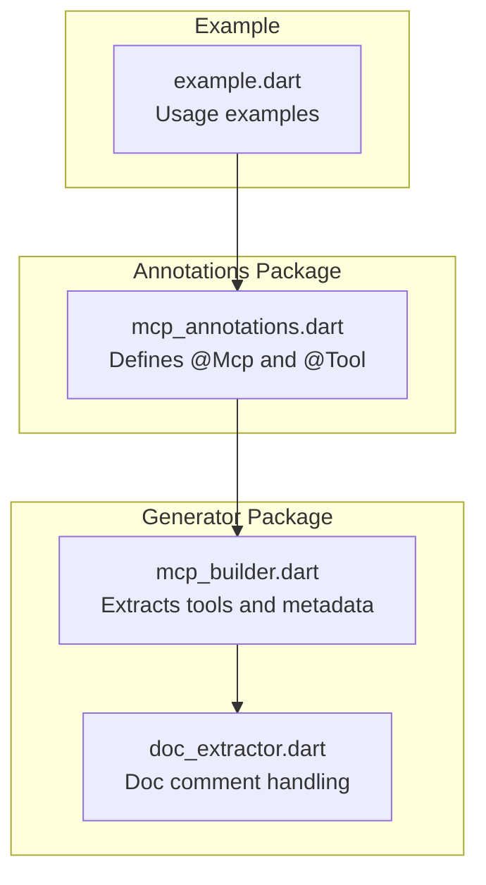
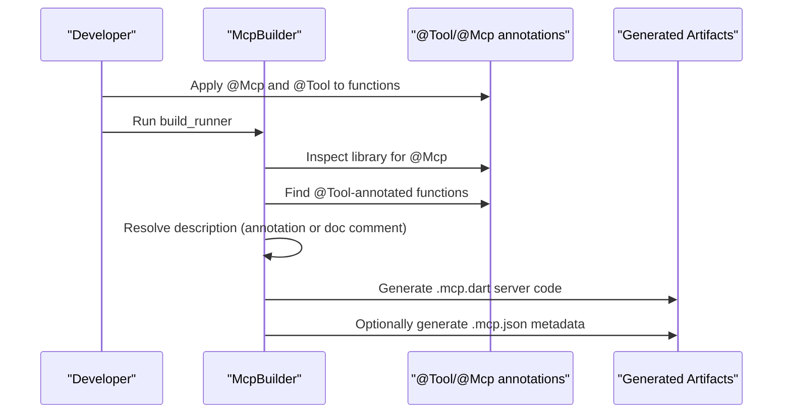
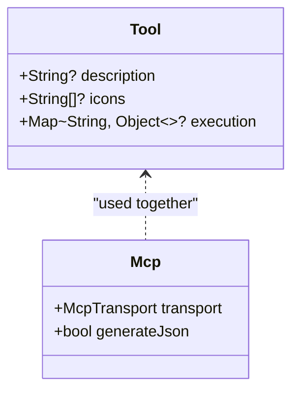
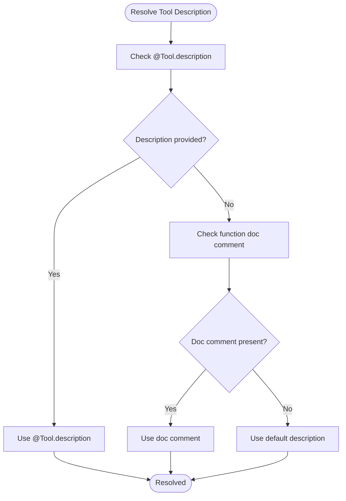
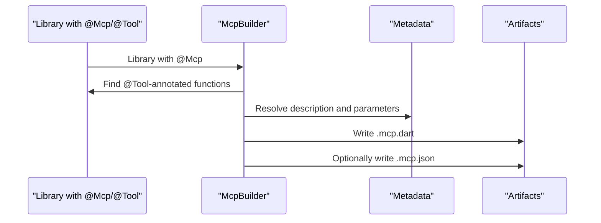
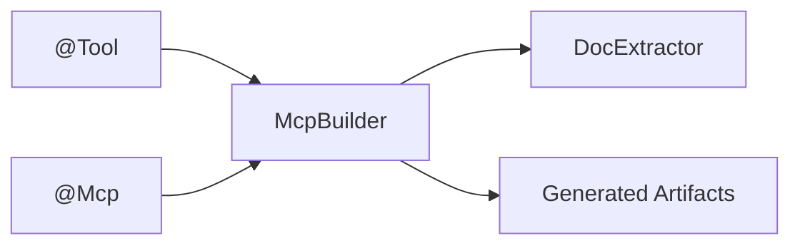

# @Tool Annotation

<cite>
**Referenced Files in This Document**
- [mcp_annotations.dart](file://packages/easy_mcp_annotations/lib/mcp_annotations.dart)
- [README.md](file://README.md)
- [mcp_builder.dart](file://packages/easy_mcp_generator/lib/builder/mcp_builder.dart)
- [doc_extractor.dart](file://packages/easy_mcp_generator/lib/builder/doc_extractor.dart)
- [example.dart](file://packages/easy_mcp_annotations/test/example.dart)
- [outline.md](file://outline.md)
</cite>

## Table of Contents
1. [Introduction](#introduction)
2. [Project Structure](#project-structure)
3. [Core Components](#core-components)
4. [Architecture Overview](#architecture-overview)
5. [Detailed Component Analysis](#detailed-component-analysis)
6. [Dependency Analysis](#dependency-analysis)
7. [Performance Considerations](#performance-considerations)
8. [Troubleshooting Guide](#troubleshooting-guide)
9. [Conclusion](#conclusion)
10. [Appendices](#appendices)

## Introduction
This document provides comprehensive guidance for the @Tool annotation used to define MCP tool metadata and enhance documentation. It explains how to use the description parameter to override method doc comments, how to specify icons for visual representation, and how the execution parameter is reserved for future use. It also covers the relationship between @Tool and @Mcp annotations, precedence rules, and best practices for integrating @Tool metadata into the code generation pipeline to improve tool discoverability and user experience.

## Project Structure
The @Tool annotation is defined in the annotations package and consumed by the generator package. The generator extracts tool metadata from annotated functions and produces runnable MCP server code and optional JSON metadata.

**Diagram sources**
- [mcp_annotations.dart](file://packages/easy_mcp_annotations/lib/mcp_annotations.dart)
- [mcp_builder.dart](file://packages/easy_mcp_generator/lib/builder/mcp_builder.dart)
- [doc_extractor.dart](file://packages/easy_mcp_generator/lib/builder/doc_extractor.dart)
- [example.dart](file://packages/easy_mcp_annotations/test/example.dart)

**Section sources**
- [mcp_annotations.dart](file://packages/easy_mcp_annotations/lib/mcp_annotations.dart)
- [mcp_builder.dart](file://packages/easy_mcp_generator/lib/builder/mcp_builder.dart)
- [doc_extractor.dart](file://packages/easy_mcp_generator/lib/builder/doc_extractor.dart)
- [README.md](file://README.md)

## Core Components
- @Tool annotation: Defines tool metadata such as description and icons, and reserves execution for future use.
- @Mcp annotation: Controls transport mode and optional JSON metadata generation for the server.
- Generator: Extracts tools from annotated functions, resolves descriptions from annotations or doc comments, and builds server code and optional JSON metadata.

Key behaviors:
- description parameter overrides doc comments when present.
- icons parameter accepts a list of icon URLs for client-side visualization.
- execution parameter is marked as deprecated and reserved for future use.

**Section sources**
- [mcp_annotations.dart](file://packages/easy_mcp_annotations/lib/mcp_annotations.dart)
- [mcp_builder.dart](file://packages/easy_mcp_generator/lib/builder/mcp_builder.dart)
- [README.md](file://README.md)

## Architecture Overview
The @Tool annotation integrates with the code generation pipeline as follows:
- The generator scans libraries for @Mcp-annotated code.
- It locates @Tool-annotated functions and extracts their metadata.
- If description is missing, it falls back to the function’s doc comment.
- The generator produces server code and optionally a JSON metadata file containing tool definitions.

**Diagram sources**
- [mcp_builder.dart](file://packages/easy_mcp_generator/lib/builder/mcp_builder.dart)
- [mcp_annotations.dart](file://packages/easy_mcp_annotations/lib/mcp_annotations.dart)

## Detailed Component Analysis

### @Tool Annotation Definition and Behavior
The @Tool annotation supports three parameters:
- description: Overrides the function’s doc comment for the tool description.
- icons: A list of icon URLs for client-side visualization.
- execution: Reserved for future use; currently deprecated.

Behavior highlights:
- If description is provided, it takes precedence over doc comments.
- If description is omitted, the generator uses the function’s doc comment.
- Icons are not processed by the generator in this implementation; they are part of the tool metadata model.
- The execution parameter is deprecated and currently ignored.

**Diagram sources**
- [mcp_annotations.dart](file://packages/easy_mcp_annotations/lib/mcp_annotations.dart)

**Section sources**
- [mcp_annotations.dart](file://packages/easy_mcp_annotations/lib/mcp_annotations.dart)

### Description Resolution: Annotation vs Doc Comments
The generator resolves the tool description in this order:
1. Use @Tool.description if present.
2. Otherwise, fall back to the function’s doc comment.
3. If neither is available, a default description is applied.

**Diagram sources**
- [mcp_builder.dart](file://packages/easy_mcp_generator/lib/builder/mcp_builder.dart)

**Section sources**
- [mcp_builder.dart](file://packages/easy_mcp_generator/lib/builder/mcp_builder.dart)
- [README.md](file://README.md)

### Icon Specification Guidelines
- Provide a list of icon URLs via the icons parameter.
- Clients may render these icons to improve tool discoverability.
- The generator does not validate or process icon URLs; ensure they are publicly accessible and appropriate for client environments.

Best practices:
- Prefer HTTPS URLs for icons.
- Keep icon sizes reasonable for UI rendering.
- Provide multiple resolutions if needed by clients.

**Section sources**
- [mcp_annotations.dart](file://packages/easy_mcp_annotations/lib/mcp_annotations.dart)

### Execution Parameter: Deprecation and Future Compatibility
- The execution parameter is deprecated and reserved for future use.
- Current behavior: Ignored by the generator.
- Future compatibility: Expect execution-related metadata to be supported in upcoming versions.

Recommendations:
- Avoid relying on execution in current implementations.
- Plan for future updates by noting the deprecation notice.

**Section sources**
- [mcp_annotations.dart](file://packages/easy_mcp_annotations/lib/mcp_annotations.dart)

### Relationship Between @Tool and @Mcp Annotations
- @Mcp controls transport mode and optional JSON metadata generation.
- @Tool annotates functions as tools and supplies metadata.
- Together, they enable the generator to produce runnable servers and optional JSON metadata.

Precedence and inheritance rules:
- @Mcp determines whether the generator runs and whether JSON metadata is produced.
- @Tool applies per annotated function; it does not inherit from @Mcp.
- Description resolution prioritizes @Tool.description over doc comments.

**Section sources**
- [mcp_annotations.dart](file://packages/easy_mcp_annotations/lib/mcp_annotations.dart)
- [mcp_builder.dart](file://packages/easy_mcp_generator/lib/builder/mcp_builder.dart)
- [README.md](file://README.md)

### Practical Examples and Usage Patterns
Examples demonstrate typical @Tool usage patterns:
- Basic description override.
- Icon specification for visual representation.
- Deprecated execution parameter usage (for testing deprecation warnings).

These examples are available in the annotations test suite and serve as reference for correct usage.

**Section sources**
- [example.dart](file://packages/easy_mcp_annotations/test/example.dart)

### Code Generation Pipeline Integration
The generator performs the following steps:
- Scans libraries for @Mcp annotations.
- Extracts @Tool-annotated functions and metadata.
- Resolves descriptions from annotations or doc comments.
- Produces server code and optionally JSON metadata.

**Diagram sources**
- [mcp_builder.dart](file://packages/easy_mcp_generator/lib/builder/mcp_builder.dart)

**Section sources**
- [mcp_builder.dart](file://packages/easy_mcp_generator/lib/builder/mcp_builder.dart)

## Dependency Analysis
- @Tool depends on the generator to extract and process metadata.
- @Mcp controls the generator’s behavior and output format.
- Doc comment extraction is handled by the generator’s documentation extractor.

**Diagram sources**
- [mcp_annotations.dart](file://packages/easy_mcp_annotations/lib/mcp_annotations.dart)
- [mcp_builder.dart](file://packages/easy_mcp_generator/lib/builder/mcp_builder.dart)
- [doc_extractor.dart](file://packages/easy_mcp_generator/lib/builder/doc_extractor.dart)

**Section sources**
- [mcp_annotations.dart](file://packages/easy_mcp_annotations/lib/mcp_annotations.dart)
- [mcp_builder.dart](file://packages/easy_mcp_generator/lib/builder/mcp_builder.dart)
- [doc_extractor.dart](file://packages/easy_mcp_generator/lib/builder/doc_extractor.dart)

## Performance Considerations
- Doc comment parsing is straightforward; keep descriptions concise for readability.
- Avoid excessive icon URLs to minimize metadata size.
- Prefer minimal execution metadata until the feature is implemented.

## Troubleshooting Guide
Common issues and resolutions:
- Missing description: Ensure either @Tool.description is provided or the function has a doc comment.
- Deprecated execution warning: Remove or avoid setting execution until supported.
- Icons not rendering: Verify icon URLs are accessible and appropriate for client environments.

**Section sources**
- [mcp_annotations.dart](file://packages/easy_mcp_annotations/lib/mcp_annotations.dart)
- [mcp_builder.dart](file://packages/easy_mcp_generator/lib/builder/mcp_builder.dart)
- [example.dart](file://packages/easy_mcp_annotations/test/example.dart)

## Conclusion
The @Tool annotation enables precise tool metadata definition for MCP servers. By combining @Tool with @Mcp, developers can produce discoverable, well-documented tools with optional JSON metadata. While the execution parameter is reserved for future use, description and icon specifications provide immediate value for user experience and tool presentation.

## Appendices

### Best Practices for Tool Documentation
- Write clear, concise descriptions that explain the tool’s purpose and outcomes.
- Use doc comments when no @Tool.description is provided; ensure they are well-formatted.
- Provide meaningful icons to aid quick recognition in client UIs.

### Icon Specification Guidelines
- Use HTTPS URLs for icons.
- Keep icon sizes optimized for UI rendering.
- Provide multiple resolutions if needed by clients.

### Proper Description Formatting
- Start descriptions with a verb describing the action performed.
- Include expected inputs and outputs briefly if helpful.
- Avoid overly technical jargon when targeting diverse audiences.

**Section sources**
- [README.md](file://README.md)
- [outline.md](file://outline.md)