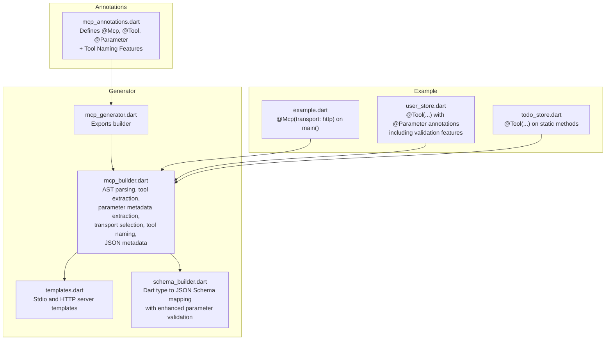
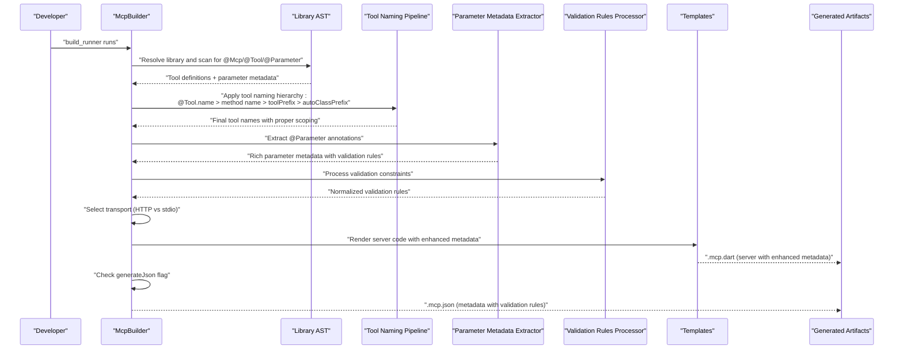
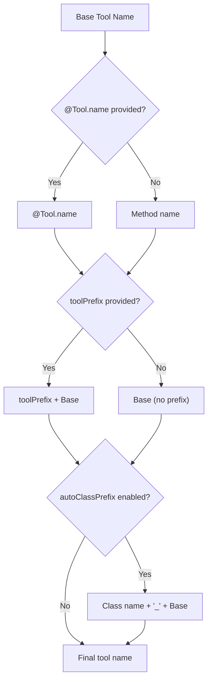
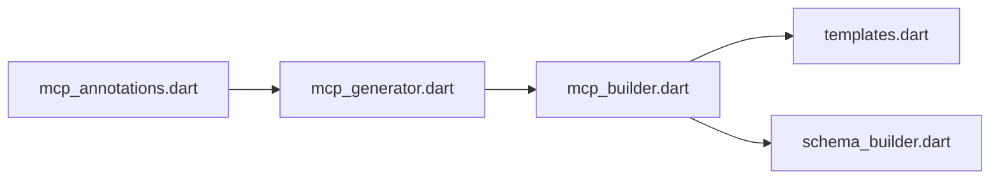

# Annotations Reference

<cite>
**Referenced Files in This Document**
- [mcp_annotations.dart](file://packages/easy_mcp_annotations/lib/mcp_annotations.dart)
- [mcp_builder.dart](file://packages/easy_mcp_generator/lib/builder/mcp_builder.dart)
- [templates.dart](file://packages/easy_mcp_generator/lib/builder/templates.dart)
- [schema_builder.dart](file://packages/easy_mcp_generator/lib/builder/schema_builder.dart)
- [mcp_generator.dart](file://packages/easy_mcp_generator/lib/mcp_generator.dart)
- [example.dart](file://example/bin/example.dart)
- [todo_store.dart](file://example/lib/src/todo_store.dart)
- [user_store.dart](file://example/lib/src/user_store.dart)
- [todo.dart](file://example/lib/src/todo.dart)
- [user.dart](file://example/lib/src/user.dart)
- [mcp_annotation_test.dart](file://packages/easy_mcp_annotations/test/mcp_annotation_test.dart)
- [README.md](file://packages/easy_mcp_annotations/README.md)
- [pubspec.yaml](file://packages/easy_mcp_annotations/pubspec.yaml)
</cite>

## Update Summary
**Changes Made**
- Enhanced @Mcp annotation documentation with new tool naming features: toolPrefix parameter, autoClassPrefix parameter, and custom tool names via @Tool annotation name parameter
- Updated @Tool annotation documentation to include custom tool name capability
- Added comprehensive coverage of tool naming hierarchy and precedence rules
- Expanded practical examples demonstrating tool organization and collision avoidance
- Updated architecture diagrams to reflect enhanced tool naming pipeline
- Added detailed documentation of tool naming precedence: custom @Tool.name > method name > toolPrefix > autoClassPrefix

## Table of Contents
1. [Introduction](#introduction)
2. [Project Structure](#project-structure)
3. [Core Components](#core-components)
4. [Architecture Overview](#architecture-overview)
5. [Detailed Component Analysis](#detailed-component-analysis)
6. [Dependency Analysis](#dependency-analysis)
7. [Performance Considerations](#performance-considerations)
8. [Troubleshooting Guide](#troubleshooting-guide)
9. [Conclusion](#conclusion)

## Introduction
This document provides a comprehensive reference for Easy MCP's annotation system. It covers:
- The @Mcp annotation for transport configuration and code generation triggers
- The @Tool annotation for tool metadata and schema generation
- The @Parameter annotation for rich parameter metadata and validation
- Complete parameter reference with types, defaults, and validation rules
- Practical examples of annotation combinations and their effects
- Annotation inheritance and precedence rules
- Advanced usage patterns, best practices, and common mistakes
- How annotations integrate with the code generation pipeline and affect schema generation
- **New** Tool naming enhancements including toolPrefix for consistent naming scopes, autoClassPrefix for automatic class-based namespace isolation, and custom tool names via @Tool annotation name parameter

**Updated** Version 0.2.1 introduces comprehensive parameter metadata support through the @Parameter annotation, enabling rich client-side parameter presentation and validation capabilities including pattern validation, enum restrictions, and sensitive data handling. **Enhanced** Version 0.2.2 adds powerful tool naming capabilities for flexible tool organization and collision avoidance.

## Project Structure
The annotation system spans two packages:
- easy_mcp_annotations: Defines the @Mcp, @Tool, and @Parameter annotations and their parameters
- easy_mcp_generator: Processes annotations and generates MCP-compatible servers and optional JSON metadata

**Diagram sources**
- [mcp_annotations.dart](file://packages/easy_mcp_annotations/lib/mcp_annotations.dart)
- [mcp_generator.dart](file://packages/easy_mcp_generator/lib/mcp_generator.dart)
- [mcp_builder.dart](file://packages/easy_mcp_generator/lib/builder/mcp_builder.dart)
- [templates.dart](file://packages/easy_mcp_generator/lib/builder/templates.dart)
- [schema_builder.dart](file://packages/easy_mcp_generator/lib/builder/schema_builder.dart)
- [example.dart](file://example/bin/example.dart)
- [user_store.dart](file://example/lib/src/user_store.dart)
- [todo_store.dart](file://example/lib/src/todo_store.dart)

**Section sources**
- [mcp_annotations.dart](file://packages/easy_mcp_annotations/lib/mcp_annotations.dart)
- [mcp_generator.dart](file://packages/easy_mcp_generator/lib/mcp_generator.dart)

## Core Components
- @Mcp (transport configuration)
  - Purpose: Declares the library/package as an MCP target and selects transport mode
  - Parameters:
    - transport: enum McpTransport (default stdio)
    - generateJson: bool (optional; default false)
    - port: int (HTTP transport only; default 3000)
    - address: String (HTTP transport only; default '127.0.0.1')
    - **toolPrefix: String? (optional; adds prefix to all tool names in scope)**
    - **autoClassPrefix: bool (optional; automatically prefixes tools with class name)**
  - Behavior:
    - Triggers code generation when present at library or element level
    - Controls whether HTTP or stdio server is generated
    - Controls optional .mcp.json metadata emission
    - Configures HTTP server binding and port for HTTP transport
    - **Applies toolPrefix to all tools in the annotated scope**
    - **Automatically prefixes tools with class names when autoClassPrefix is true**

- @Tool (tool metadata)
  - Purpose: Marks a function or method as an MCP tool and supplies metadata
  - Parameters:
    - **name: String? (optional; custom tool name for collision avoidance)**
    - description: string? (optional; falls back to doc comment if absent)
    - icons: List<String>? (optional; icon URLs)
    - execution: Map<String, Object?>? (reserved; currently ignored and marked deprecated)
  - Behavior:
    - Extracts tool description from annotation or doc comment
    - **Uses custom name if provided, otherwise falls back to method name**
    - Participates in automatic schema generation via parameter introspection

- @Parameter (rich parameter metadata)
  - Purpose: Provides detailed metadata and validation for individual tool parameters
  - Parameters:
    - title: string? (human-readable parameter label)
    - description: string? (detailed parameter description)
    - example: Object? (example value for guidance)
    - minimum: num? (minimum value for numeric types)
    - maximum: num? (maximum value for numeric types)
    - pattern: string? (regex pattern for string validation)
    - sensitive: bool (default false, whether parameter contains sensitive data)
    - enumValues: List<Object?>? (allowed values for enum-like parameters)
  - Behavior:
    - Enhances parameter presentation in MCP clients
    - Enables client-side validation and input assistance
    - Supports sensitive data masking in client UIs
    - Provides comprehensive validation rules for parameter inputs

**Section sources**
- [mcp_annotations.dart](file://packages/easy_mcp_annotations/lib/mcp_annotations.dart)
- [mcp_builder.dart](file://packages/easy_mcp_generator/lib/builder/mcp_builder.dart)

## Architecture Overview
The annotation-driven pipeline now includes comprehensive parameter metadata processing with validation capabilities and enhanced tool naming:
1. Annotations are parsed from source using analyzer and source_gen
2. Tools and parameter metadata are discovered across the library and its package-local imports
3. Transport is determined from @Mcp on library or elements
4. **Tool naming hierarchy is applied: custom @Tool.name > method name > toolPrefix > autoClassPrefix**
5. Templates generate either stdio or HTTP server code with enhanced parameter metadata
6. Optional JSON metadata is produced when requested, including parameter validation rules
7. Parameter validation rules are embedded in both generated schemas and metadata

**Diagram sources**
- [mcp_builder.dart](file://packages/easy_mcp_generator/lib/builder/mcp_builder.dart)
- [templates.dart](file://packages/easy_mcp_generator/lib/builder/templates.dart)

## Detailed Component Analysis

### @Mcp Annotation Reference
- Enum McpTransport
  - Values:
    - stdio: Standard input/output transport (JSON-RPC)
    - http: HTTP server using shelf
  - Default: stdio

- Parameters
  - transport: McpTransport (named, default stdio)
  - generateJson: bool (named, default false)
  - port: int (named, default 3000, HTTP transport only)
  - address: String (named, default '127.0.0.1', HTTP transport only)
  - **toolPrefix: String? (named, optional; adds prefix to all tool names)**
  - **autoClassPrefix: bool (named, default false; prefixes tools with class names)**

- Validation and defaults
  - If transport is omitted, defaults to stdio
  - If generateJson is omitted, defaults to false
  - If port is omitted for HTTP transport, defaults to 3000
  - If address is omitted for HTTP transport, defaults to '127.0.0.1'
  - **If toolPrefix is omitted, no prefix is applied**
  - **If autoClassPrefix is omitted, defaults to false**

- Precedence and inheritance
  - The generator scans library units and elements for @Mcp
  - The first @Mcp encountered determines transport and JSON generation behavior for that library
  - Elements annotated with @Mcp take effect even if the library lacks it (generator checks both)
  - **toolPrefix applies to all tools in the annotated scope**
  - **autoClassPrefix applies to all class methods in the annotated scope**

- Effects on generated code
  - transport=http → HTTP server template is used
  - transport=stdio → stdio server template is used
  - generateJson=true → emits .mcp.json metadata alongside .mcp.dart
  - HTTP transport configuration affects server binding and port
  - **toolPrefix → all tool names receive the specified prefix**
  - **autoClassPrefix → class methods become ClassName_methodName**

**Section sources**
- [mcp_annotations.dart](file://packages/easy_mcp_annotations/lib/mcp_annotations.dart)
- [mcp_builder.dart](file://packages/easy_mcp_generator/lib/builder/mcp_builder.dart)

### @Tool Annotation Reference
- Parameters
  - **name: String? (optional; custom tool name for collision avoidance)**
  - description: string? (optional)
  - icons: List<String>? (optional)
  - execution: Map<String, Object?>? (reserved; deprecated, ignored)

- Resolution order
  - **If name is provided, it overrides method name and takes precedence**
  - If description is provided, it overrides doc comment
  - If description is omitted, doc comment is used
  - If neither exists, a default placeholder is applied

- Effects on generated code
  - Tool name: **custom name (if provided) > method name > toolPrefix > autoClassPrefix**
  - Tool description: resolved value
  - Tool input schema: derived from parameter introspection
  - Icons: included in tool registration (if provided)

**Section sources**
- [mcp_annotations.dart](file://packages/easy_mcp_annotations/lib/mcp_annotations.dart)
- [mcp_builder.dart](file://packages/easy_mcp_generator/lib/builder/mcp_builder.dart)

### Tool Naming Hierarchy and Precedence
**New** The tool naming system provides flexible organization and collision avoidance through a well-defined hierarchy:

#### Naming Priority Order
1. **@Tool.name (highest priority)** - Explicit custom name from annotation
2. **Method name** - Original method name when no custom name provided
3. **toolPrefix** - Scope-wide prefix from @Mcp.annotation
4. **autoClassPrefix** - Class name prefix for class methods (lowest priority)

#### Application Logic

**Diagram sources**
- [mcp_builder.dart](file://packages/easy_mcp_generator/lib/builder/mcp_builder.dart)

#### Practical Examples
- **Custom tool name**: `@Tool(name: 'user_create')` → Tool name: `user_create`
- **Method name fallback**: `@Tool()` → Tool name: `createUser`
- **toolPrefix only**: `@Mcp(toolPrefix: 'api_')` → Tool name: `api_createUser`
- **autoClassPrefix only**: `@Mcp(autoClassPrefix: true)` → Tool name: `UserService_createUser`
- **Combined prefixes**: `@Mcp(toolPrefix: 'api_', autoClassPrefix: true)` → Tool name: `api_UserService_createUser`
- **Custom name overrides everything**: `@Mcp(toolPrefix: 'api_') @Tool(name: 'custom_name')` → Tool name: `custom_name`

**Section sources**
- [mcp_annotations.dart](file://packages/easy_mcp_annotations/lib/mcp_annotations.dart)
- [mcp_builder.dart](file://packages/easy_mcp_generator/lib/builder/mcp_builder.dart)

### @Parameter Annotation Reference
**Updated** The @Parameter annotation provides comprehensive metadata and validation capabilities for MCP tool parameters.

- Parameters
  - title: string? (human-readable parameter label, defaults to parameter name)
  - description: string? (detailed parameter description)
  - example: Object? (example value for guidance, supports string, int, double, bool)
  - minimum: num? (minimum value for numeric parameters)
  - maximum: num? (maximum value for numeric parameters)
  - pattern: string? (regex pattern for string validation)
  - sensitive: bool (default false, whether parameter contains sensitive data)
  - enumValues: List<Object?>? (allowed values for enum-like parameters)

- Data type handling
  - example supports multiple types: String, int, double, bool
  - minimum/maximum accept both int and double values
  - enumValues supports mixed-type lists (String, int, double, bool)

- Validation features
  - Numeric range validation using minimum/maximum
  - String pattern validation using regex
  - Enum constraint validation using enumValues
  - Sensitive data marking for client-side masking

- Client integration
  - Titles and descriptions improve parameter presentation
  - Examples guide users and assist LLMs
  - Validation rules enable client-side input checking
  - Sensitive flags enable secure parameter handling

**Section sources**
- [mcp_annotations.dart](file://packages/easy_mcp_annotations/lib/mcp_annotations.dart)
- [mcp_builder.dart](file://packages/easy_mcp_generator/lib/builder/mcp_builder.dart)

### Parameter Extraction and Schema Generation
**Updated** Enhanced parameter processing now includes comprehensive metadata extraction and validation rule generation.

- Parameter introspection
  - Extracts parameter name, type, optionality, and whether it is named
  - Supports primitives, lists, maps, and custom classes
  - Handles nullable types and optional parameters

- Parameter metadata extraction
  - Extracts @Parameter annotations from formal parameters
  - Processes title, description, example, minimum, maximum, pattern, sensitive, enumValues
  - Validates and normalizes metadata values
  - Supports mixed-type enum values and complex validation rules

- JSON Schema mapping
  - Primitive types map to JSON Schema types
  - Lists map to arrays; inner types are recursively introspected
  - Custom classes map to objects with properties and required fields
  - DateTime maps to string with date-time format
  - Parameter metadata enhances schema with titles, descriptions, and validation rules

- Template integration
  - Generated handlers extract request arguments and cast to inferred Dart types
  - Optional parameters are handled with null-aware casting
  - List parameters with custom inner types are converted using fromJson
  - Parameter metadata is embedded in generated code for client consumption

**Section sources**
- [mcp_builder.dart](file://packages/easy_mcp_generator/lib/builder/mcp_builder.dart)
- [schema_builder.dart](file://packages/easy_mcp_generator/lib/builder/schema_builder.dart)
- [templates.dart](file://packages/easy_mcp_generator/lib/builder/templates.dart)

### Practical Examples and Effects
**Updated** Examples now demonstrate comprehensive @Parameter usage patterns with validation features and enhanced tool naming capabilities.

- Example A: HTTP server with explicit transport
  - Annotation: @Mcp(transport: McpTransport.http, port: 8080, address: '0.0.0.0') on main()
  - Effect: Generator produces HTTP server code listening on port 8080
  - Related files: [example.dart](file://example/bin/example.dart), [mcp_builder.dart](file://packages/easy_mcp_generator/lib/builder/mcp_builder.dart)

- Example B: Multiple @Tool annotations with @Parameter metadata
  - Annotations: @Tool(description: "...") with @Parameter on several static methods
  - Effect: Each method becomes a registered tool with enhanced parameter metadata
  - Related files: [user_store.dart](file://example/lib/src/user_store.dart), [todo_store.dart](file://example/lib/src/todo_store.dart)

- Example C: Rich parameter metadata with validation
  - Annotations: @Parameter with title, description, example, pattern, sensitive
  - Effect: Enhanced parameter presentation with client-side validation
  - Related files: [user_store.dart](file://example/lib/src/user_store.dart)

- Example D: Tool description fallback to doc comment
  - Annotation: @Tool() without description
  - Effect: Description taken from method's doc comment
  - Related files: [mcp_builder.dart](file://packages/easy_mcp_generator/lib/builder/mcp_builder.dart)

- Example E: Optional parameters and named parameters
  - Signature: method with optional positional and named parameters
  - Effect: Generated handler casts arguments with null-aware logic; schema marks non-optional fields as required
  - Related files: [mcp_builder.dart](file://packages/easy_mcp_generator/lib/builder/mcp_builder.dart), [templates.dart](file://packages/easy_mcp_generator/lib/builder/templates.dart)

- Example F: Complex parameter validation
  - Annotations: @Parameter with minimum, maximum, pattern, enumValues
  - Effect: Client-side validation enforces numeric ranges, string patterns, and allowed values
  - Related files: [user_store.dart](file://example/lib/src/user_store.dart)

- Example G: Custom class parameters and nested lists
  - Signature: method with List<CustomClass> and CustomClass fields
  - Effect: SchemaBuilder builds nested object schemas; templates convert lists using fromJson
  - Related files: [schema_builder.dart](file://packages/easy_mcp_generator/lib/builder/schema_builder.dart), [templates.dart](file://packages/easy_mcp_generator/lib/builder/templates.dart), [todo.dart](file://example/lib/src/todo.dart), [user.dart](file://example/lib/src/user.dart)

- Example H: Tool naming with toolPrefix
  - Annotations: @Mcp(toolPrefix: 'user_service_') on class, @Tool(description: 'Create user')
  - Effect: Tool name becomes `user_service_createUser`
  - Related files: [mcp_builder.dart](file://packages/easy_mcp_generator/lib/builder/mcp_builder.dart)

- Example I: Tool naming with autoClassPrefix
  - Annotations: @Mcp(autoClassPrefix: true) on class, @Tool(description: 'Create user')
  - Effect: Tool name becomes `UserService_createUser`
  - Related files: [mcp_builder.dart](file://packages/easy_mcp_generator/lib/builder/mcp_builder.dart)

- Example J: Tool naming with custom @Tool.name
  - Annotations: @Tool(name: 'custom_user_create', description: 'Create user')
  - Effect: Tool name becomes `custom_user_create` (overrides method name)
  - Related files: [mcp_builder.dart](file://packages/easy_mcp_generator/lib/builder/mcp_builder.dart)

**Section sources**
- [example.dart](file://example/bin/example.dart)
- [user_store.dart](file://example/lib/src/user_store.dart)
- [todo_store.dart](file://example/lib/src/todo_store.dart)
- [mcp_builder.dart](file://packages/easy_mcp_generator/lib/builder/mcp_builder.dart)
- [schema_builder.dart](file://packages/easy_mcp_generator/lib/builder/schema_builder.dart)
- [templates.dart](file://packages/easy_mcp_generator/lib/builder/templates.dart)
- [todo.dart](file://example/lib/src/todo.dart)
- [user.dart](file://example/lib/src/user.dart)

### Annotation Inheritance and Precedence
- Discovery scope
  - Tools are extracted from the current library and package-local imports
  - Each tool carries sourceImport and sourceAlias for proper imports in generated code

- Transport precedence
  - The generator locates @Mcp on library or elements and resolves transport
  - If multiple @Mcp annotations exist, the first encountered determines behavior
  - Default is stdio if none found

- Metadata precedence
  - @Tool.description takes precedence over doc comment
  - @Tool.name takes precedence over method name in tool naming
  - @Parameter.title takes precedence over parameter name
  - @Parameter.description falls back to parameter doc comment
  - If both are missing, defaults are applied

- **Tool naming precedence**
  - **@Tool.name (highest) > Method name > toolPrefix > autoClassPrefix (lowest)**
  - **toolPrefix applies to all tools in annotated scope**
  - **autoClassPrefix applies to all class methods in annotated scope**

- Execution parameter
  - @Tool.execution is reserved and currently ignored; avoid relying on it

**Section sources**
- [mcp_builder.dart](file://packages/easy_mcp_generator/lib/builder/mcp_builder.dart)
- [mcp_annotations.dart](file://packages/easy_mcp_annotations/lib/mcp_annotations.dart)

### Advanced Usage Patterns and Best Practices
**Updated** Enhanced patterns now leverage comprehensive parameter metadata capabilities and flexible tool naming.

- Combine @Mcp, @Tool, and @Parameter effectively
  - Place @Mcp on the library or main entry to trigger generation
  - Apply @Tool to each method intended as an MCP tool
  - Use @Parameter for critical parameters requiring rich metadata
  - Prefer explicit description over relying on doc comments for clarity

- **Tool naming strategy**
  - Use @Tool.name for global tool names that must be unique across all services
  - Use toolPrefix for domain-based organization (e.g., 'user_', 'order_')
  - Use autoClassPrefix for automatic class-based namespace isolation
  - Combine strategies for complex service architectures

- Parameter metadata strategy
  - Use @Parameter.title for user-friendly parameter labels
  - Provide @Parameter.description for complex parameter explanations
  - Include @Parameter.example for common input formats
  - Apply @Parameter.minimum/@Parameter.maximum for numeric validation
  - Use @Parameter.pattern for string format validation
  - Mark sensitive parameters with @Parameter.sensitive
  - Restrict enum-like parameters with @Parameter.enumValues

- Schema hygiene
  - Keep parameters non-nullable when feasible to produce required fields in schemas
  - Use List<CustomClass> for strongly typed collections; ensure CustomClass has a fromJson method for conversion
  - Leverage @Parameter for validation instead of runtime checks when possible

- Transport selection
  - Use transport=http for HTTP-based integrations
  - Use transport=stdio for CLI or process-based integrations

- JSON metadata
  - Enable generateJson=true to emit .mcp.json for tool catalogs
  - Review emitted metadata to validate schema correctness and parameter validation rules

- **Tool organization best practices**
  - Use toolPrefix for service-level organization (e.g., 'ecommerce_')
  - Use autoClassPrefix for automatic namespace isolation
  - Use @Tool.name for globally unique tool names
  - Avoid naming collisions by combining strategies appropriately

**Section sources**
- [mcp_annotations.dart](file://packages/easy_mcp_annotations/lib/mcp_annotations.dart)
- [mcp_builder.dart](file://packages/easy_mcp_generator/lib/builder/mcp_builder.dart)

### Common Annotation Mistakes
**Updated** Includes new mistakes related to @Parameter usage and tool naming.

- Missing @Mcp
  - Symptom: No .mcp.dart/.mcp.json generated
  - Fix: Add @Mcp(transport: ...) at library or element level

- Conflicting transports
  - Symptom: Unexpected transport in generated code
  - Fix: Ensure a single @Mcp with a clear transport value

- Ignoring doc comment fallback
  - Symptom: Tool description appears less descriptive than expected
  - Fix: Provide @Tool(description: "...") explicitly

- **Tool naming conflicts**
  - Symptom: Duplicate tool names in generated metadata
  - Fix: Use @Tool.name for unique names, or combine toolPrefix with autoClassPrefix
  - Fix: Ensure tool naming hierarchy is understood and applied consistently

- **Reserved execution parameter**
  - Symptom: Confusion about execution metadata
  - Fix: Do not rely on @Tool.execution; it is reserved and ignored

- Parameter metadata type mismatches
  - Symptom: Validation errors or unexpected behavior
  - Fix: Ensure @Parameter.example type matches parameter type
  - Fix: Use consistent types in @Parameter.enumValues
  - Fix: Provide valid regex patterns in @Parameter.pattern

- Overusing parameter metadata
  - Symptom: Complex validation rules that are hard to maintain
  - Fix: Use @Parameter selectively for critical parameters only
  - Fix: Keep validation rules simple and user-friendly

**Section sources**
- [mcp_annotation_test.dart](file://packages/easy_mcp_annotations/test/mcp_annotation_test.dart)
- [mcp_annotations.dart](file://packages/easy_mcp_annotations/lib/mcp_annotations.dart)

## Dependency Analysis
The generator depends on:
- Annotations package for type definitions
- Analyzer and source_gen for AST parsing
- Templates for server code generation
- Schema builder for JSON Schema mapping

**Diagram sources**
- [mcp_annotations.dart](file://packages/easy_mcp_annotations/lib/mcp_annotations.dart)
- [mcp_generator.dart](file://packages/easy_mcp_generator/lib/mcp_generator.dart)
- [mcp_builder.dart](file://packages/easy_mcp_generator/lib/builder/mcp_builder.dart)
- [templates.dart](file://packages/easy_mcp_generator/lib/builder/templates.dart)
- [schema_builder.dart](file://packages/easy_mcp_generator/lib/builder/schema_builder.dart)

**Section sources**
- [mcp_generator.dart](file://packages/easy_mcp_generator/lib/mcp_generator.dart)
- [mcp_builder.dart](file://packages/easy_mcp_generator/lib/builder/mcp_builder.dart)

## Performance Considerations
- Parameter introspection depth
  - Custom classes with cycles are handled with cycle detection to avoid infinite recursion
- Optional parameter handling
  - Null-aware casting reduces runtime errors and improves robustness
- Import deduplication
  - Generated code collects unique imports for custom List inner types and per-tool source imports
- Parameter metadata processing
  - @Parameter annotations are processed during AST traversal
  - Validation rules are validated for type consistency
  - Complex enum values are normalized to supported types
- **Tool naming optimization**
  - Tool names are computed once per tool during extraction
  - Prefix application is efficient string concatenation operations
  - Class name detection avoids unnecessary processing for non-class methods

## Troubleshooting Guide
- No generated artifacts
  - Verify @Mcp presence and correct package path resolution
  - Confirm build_runner is executed against the annotated library

- Wrong transport selected
  - Check for multiple @Mcp annotations and resolve precedence
  - Ensure transport parameter matches expected enum value

- Incorrect tool descriptions
  - Provide @Tool(description: "...") or ensure doc comments are present
  - Avoid relying solely on fallback behavior

- **Tool naming issues**
  - **Verify tool naming hierarchy: @Tool.name > method name > toolPrefix > autoClassPrefix**
  - **Check for naming conflicts when combining strategies**
  - **Ensure toolPrefix is properly formatted (avoid trailing underscores)**

- **Reserved execution parameter**
  - Remove or ignore @Tool.execution; it is reserved and ignored

- Parameter metadata issues
  - Verify @Parameter types match expected values
  - Check that @Parameter.example is compatible with parameter type
  - Ensure @Parameter.pattern is a valid regular expression
  - Validate @Parameter.enumValues contain supported types

**Section sources**
- [mcp_annotation_test.dart](file://packages/easy_mcp_annotations/test/mcp_annotation_test.dart)
- [mcp_builder.dart](file://packages/easy_mcp_generator/lib/builder/mcp_builder.dart)

## Conclusion
Easy MCP's annotation system offers a concise and powerful way to expose Dart functions as MCP tools. Version 0.2.1 significantly enhances the system with comprehensive parameter metadata support through the @Parameter annotation, enabling rich client-side parameter presentation, validation, and user experience improvements. The enhanced @Parameter annotation now provides complete validation capabilities including pattern validation, enum restrictions, and sensitive data handling, making it a powerful tool for creating robust and user-friendly MCP integrations. **Version 0.2.2 further strengthens the system with powerful tool naming capabilities**, providing flexible tool organization and collision avoidance through toolPrefix for consistent naming scopes, autoClassPrefix for automatic class-based namespace isolation, and custom tool names via @Tool annotation name parameter. By combining @Mcp for transport configuration, @Tool for metadata, @Parameter for detailed parameter information, and the new tool naming features for organization, developers can quickly generate transport-ready servers with sophisticated parameter handling, accurate JSON schemas, and well-structured tool hierarchies. Following the best practices and understanding precedence rules ensures predictable and maintainable code generation with enhanced user experience capabilities and robust tool organization.