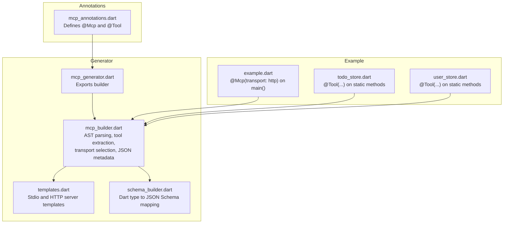
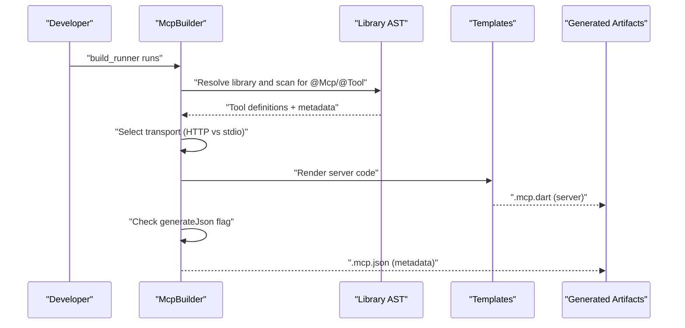
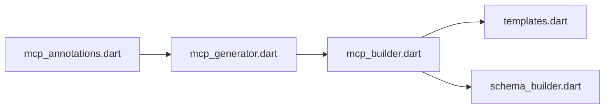

# Annotations Reference

<cite>
**Referenced Files in This Document**
- [mcp_annotations.dart](file://packages/easy_mcp_annotations/lib/mcp_annotations.dart)
- [mcp_builder.dart](file://packages/easy_mcp_generator/lib/builder/mcp_builder.dart)
- [templates.dart](file://packages/easy_mcp_generator/lib/builder/templates.dart)
- [schema_builder.dart](file://packages/easy_mcp_generator/lib/builder/schema_builder.dart)
- [mcp_generator.dart](file://packages/easy_mcp_generator/lib/mcp_generator.dart)
- [example.dart](file://example/bin/example.dart)
- [todo_store.dart](file://example/lib/src/todo_store.dart)
- [user_store.dart](file://example/lib/src/user_store.dart)
- [todo.dart](file://example/lib/src/todo.dart)
- [user.dart](file://example/lib/src/user.dart)
- [mcp_annotation_test.dart](file://packages/easy_mcp_annotations/test/mcp_annotation_test.dart)
</cite>

## Table of Contents
1. [Introduction](#introduction)
2. [Project Structure](#project-structure)
3. [Core Components](#core-components)
4. [Architecture Overview](#architecture-overview)
5. [Detailed Component Analysis](#detailed-component-analysis)
6. [Dependency Analysis](#dependency-analysis)
7. [Performance Considerations](#performance-considerations)
8. [Troubleshooting Guide](#troubleshooting-guide)
9. [Conclusion](#conclusion)

## Introduction
This document provides a comprehensive reference for Easy MCP’s annotation system. It covers:
- The @mcp annotation for transport configuration and code generation triggers
- The @tool annotation for tool metadata and schema generation
- Complete parameter reference with types, defaults, and validation rules
- Practical examples of annotation combinations and their effects
- Annotation inheritance and precedence rules
- Advanced usage patterns, best practices, and common mistakes
- How annotations integrate with the code generation pipeline and affect schema generation

## Project Structure
The annotation system spans two packages:
- easy_mcp_annotations: Defines the @Mcp and @Tool annotations and their parameters
- easy_mcp_generator: Processes annotations and generates MCP-compatible servers and optional JSON metadata

**Diagram sources**
- [mcp_annotations.dart](file://packages/easy_mcp_annotations/lib/mcp_annotations.dart)
- [mcp_generator.dart](file://packages/easy_mcp_generator/lib/mcp_generator.dart)
- [mcp_builder.dart](file://packages/easy_mcp_generator/lib/builder/mcp_builder.dart)
- [templates.dart](file://packages/easy_mcp_generator/lib/builder/templates.dart)
- [schema_builder.dart](file://packages/easy_mcp_generator/lib/builder/schema_builder.dart)
- [example.dart](file://example/bin/example.dart)
- [todo_store.dart](file://example/lib/src/todo_store.dart)
- [user_store.dart](file://example/lib/src/user_store.dart)

**Section sources**
- [mcp_annotations.dart](file://packages/easy_mcp_annotations/lib/mcp_annotations.dart)
- [mcp_generator.dart](file://packages/easy_mcp_generator/lib/mcp_generator.dart)

## Core Components
- @Mcp (transport configuration)
  - Purpose: Declares the library/package as an MCP target and selects transport mode
  - Parameters:
    - transport: enum McpTransport (default stdio)
    - generateJson: bool (optional; default false)
  - Behavior:
    - Triggers code generation when present at library or element level
    - Controls whether HTTP or stdio server is generated
    - Controls optional .mcp.json metadata emission

- @Tool (tool metadata)
  - Purpose: Marks a function or method as an MCP tool and supplies metadata
  - Parameters:
    - description: string? (optional; falls back to doc comment if absent)
    - icons: List<String>? (optional; icon URLs)
    - execution: Map<String, Object?>? (reserved; currently ignored and marked deprecated)
  - Behavior:
    - Extracts tool description from annotation or doc comment
    - Participates in automatic schema generation via parameter introspection

**Section sources**
- [mcp_annotations.dart](file://packages/easy_mcp_annotations/lib/mcp_annotations.dart)
- [mcp_builder.dart](file://packages/easy_mcp_generator/lib/builder/mcp_builder.dart)

## Architecture Overview
The annotation-driven pipeline:
1. Annotations are parsed from source using analyzer and source_gen
2. Tools are discovered across the library and its package-local imports
3. Transport is determined from @Mcp on library or elements
4. Templates generate either stdio or HTTP server code
5. Optional JSON metadata is produced when requested

**Diagram sources**
- [mcp_builder.dart](file://packages/easy_mcp_generator/lib/builder/mcp_builder.dart)
- [templates.dart](file://packages/easy_mcp_generator/lib/builder/templates.dart)

## Detailed Component Analysis

### @Mcp Annotation Reference
- Enum McpTransport
  - Values:
    - stdio: Standard input/output transport (JSON-RPC)
    - http: HTTP server using shelf
  - Default: stdio

- Parameters
  - transport: McpTransport (named, default stdio)
  - generateJson: bool (named, default false)

- Validation and defaults
  - If transport is omitted, defaults to stdio
  - If generateJson is omitted, defaults to false

- Precedence and inheritance
  - The generator scans library units and elements for @Mcp
  - The first @Mcp encountered determines transport and JSON generation behavior for that library
  - Elements annotated with @Mcp take effect even if the library lacks it (generator checks both)

- Effects on generated code
  - transport=http → HTTP server template is used
  - transport=stdio → stdio server template is used
  - generateJson=true → emits .mcp.json metadata alongside .mcp.dart

**Section sources**
- [mcp_annotations.dart](file://packages/easy_mcp_annotations/lib/mcp_annotations.dart)
- [mcp_builder.dart](file://packages/easy_mcp_generator/lib/builder/mcp_builder.dart)

### @Tool Annotation Reference
- Parameters
  - description: string? (optional)
  - icons: List<String>? (optional)
  - execution: Map<String, Object?>? (reserved; deprecated, ignored)

- Resolution order
  - If description is provided, it overrides doc comment
  - If description is omitted, doc comment is used
  - If neither exists, a default placeholder is applied

- Effects on generated code
  - Tool name: function/method name
  - Tool description: resolved value
  - Tool input schema: derived from parameter introspection
  - Icons: included in tool registration (if provided)

**Section sources**
- [mcp_annotations.dart](file://packages/easy_mcp_annotations/lib/mcp_annotations.dart)
- [mcp_builder.dart](file://packages/easy_mcp_generator/lib/builder/mcp_builder.dart)

### Parameter Extraction and Schema Generation
- Parameter introspection
  - Extracts parameter name, type, optionality, and whether it is named
  - Supports primitives, lists, maps, and custom classes
  - Handles nullable types and optional parameters

- JSON Schema mapping
  - Primitive types map to JSON Schema types
  - Lists map to arrays; inner types are recursively introspected
  - Custom classes map to objects with properties and required fields
  - DateTime maps to string with date-time format

- Template integration
  - Generated handlers extract request arguments and cast to inferred Dart types
  - Optional parameters are handled with null-aware casting
  - List parameters with custom inner types are converted using fromJson

**Section sources**
- [mcp_builder.dart](file://packages/easy_mcp_generator/lib/builder/mcp_builder.dart)
- [schema_builder.dart](file://packages/easy_mcp_generator/lib/builder/schema_builder.dart)
- [templates.dart](file://packages/easy_mcp_generator/lib/builder/templates.dart)

### Practical Examples and Effects
Note: The following examples describe effects without reproducing code content.

- Example A: HTTP server with explicit transport
  - Annotation: @Mcp(transport: McpTransport.http) on main()
  - Effect: Generator produces HTTP server code and prints the listening port
  - Related files: [example.dart](file://example/bin/example.dart), [mcp_builder.dart](file://packages/easy_mcp_generator/lib/builder/mcp_builder.dart)

- Example B: Multiple @Tool annotations on static methods
  - Annotations: @Tool(description: "...") on several static methods
  - Effect: Each method becomes a registered tool with its own input schema
  - Related files: [todo_store.dart](file://example/lib/src/todo_store.dart), [user_store.dart](file://example/lib/src/user_store.dart)

- Example C: Tool description fallback to doc comment
  - Annotation: @Tool() without description
  - Effect: Description taken from method’s doc comment
  - Related files: [mcp_builder.dart](file://packages/easy_mcp_generator/lib/builder/mcp_builder.dart)

- Example D: Optional parameters and named parameters
  - Signature: method with optional positional and named parameters
  - Effect: Generated handler casts arguments with null-aware logic; schema marks non-optional fields as required
  - Related files: [mcp_builder.dart](file://packages/easy_mcp_generator/lib/builder/mcp_builder.dart), [templates.dart](file://packages/easy_mcp_generator/lib/builder/templates.dart)

- Example E: Custom class parameters and nested lists
  - Signature: method with List<CustomClass> and CustomClass fields
  - Effect: SchemaBuilder builds nested object schemas; templates convert lists using fromJson
  - Related files: [schema_builder.dart](file://packages/easy_mcp_generator/lib/builder/schema_builder.dart), [templates.dart](file://packages/easy_mcp_generator/lib/builder/templates.dart), [todo.dart](file://example/lib/src/todo.dart), [user.dart](file://example/lib/src/user.dart)

**Section sources**
- [example.dart](file://example/bin/example.dart)
- [todo_store.dart](file://example/lib/src/todo_store.dart)
- [user_store.dart](file://example/lib/src/user_store.dart)
- [mcp_builder.dart](file://packages/easy_mcp_generator/lib/builder/mcp_builder.dart)
- [schema_builder.dart](file://packages/easy_mcp_generator/lib/builder/schema_builder.dart)
- [templates.dart](file://packages/easy_mcp_generator/lib/builder/templates.dart)
- [todo.dart](file://example/lib/src/todo.dart)
- [user.dart](file://example/lib/src/user.dart)

### Annotation Inheritance and Precedence
- Discovery scope
  - Tools are extracted from the current library and package-local imports
  - Each tool carries sourceImport and sourceAlias for proper imports in generated code

- Transport precedence
  - The generator locates @Mcp on library or elements and resolves transport
  - If multiple @Mcp annotations exist, the first encountered determines behavior
  - Default is stdio if none found

- Metadata precedence
  - @Tool.description takes precedence over doc comment
  - If both are missing, a default placeholder is used

- Execution parameter
  - @Tool.execution is reserved and currently ignored; avoid relying on it

**Section sources**
- [mcp_builder.dart](file://packages/easy_mcp_generator/lib/builder/mcp_builder.dart)
- [mcp_annotations.dart](file://packages/easy_mcp_annotations/lib/mcp_annotations.dart)

### Advanced Usage Patterns and Best Practices
- Combine @Mcp and @Tool effectively
  - Place @Mcp on the library or main entry to trigger generation
  - Apply @Tool to each method intended as an MCP tool
  - Prefer explicit description over relying on doc comments for clarity

- Schema hygiene
  - Keep parameters non-nullable when feasible to produce required fields in schemas
  - Use List<CustomClass> for strongly typed collections; ensure CustomClass has a fromJson method for conversion

- Transport selection
  - Use transport=http for HTTP-based integrations
  - Use transport=stdio for CLI or process-based integrations

- JSON metadata
  - Enable generateJson=true to emit .mcp.json for tool catalogs
  - Review emitted metadata to validate schema correctness

**Section sources**
- [mcp_annotations.dart](file://packages/easy_mcp_annotations/lib/mcp_annotations.dart)
- [mcp_builder.dart](file://packages/easy_mcp_generator/lib/builder/mcp_builder.dart)

### Common Annotation Mistakes
- Missing @Mcp
  - Symptom: No .mcp.dart/.mcp.json generated
  - Fix: Add @Mcp(transport: ...) at library or element level

- Conflicting transports
  - Symptom: Unexpected transport in generated code
  - Fix: Ensure a single @Mcp with a clear transport value

- Ignoring doc comment fallback
  - Symptom: Tool description appears less descriptive than expected
  - Fix: Provide @Tool(description: "...") explicitly

- Reserved execution parameter
  - Symptom: Confusion about execution metadata
  - Fix: Do not rely on @Tool.execution; it is reserved and ignored

**Section sources**
- [mcp_annotation_test.dart](file://packages/easy_mcp_annotations/test/mcp_annotation_test.dart)
- [mcp_annotations.dart](file://packages/easy_mcp_annotations/lib/mcp_annotations.dart)

## Dependency Analysis
The generator depends on:
- Annotations package for type definitions
- Analyzer and source_gen for AST parsing
- Templates for server code generation
- Schema builder for JSON Schema mapping

**Diagram sources**
- [mcp_annotations.dart](file://packages/easy_mcp_annotations/lib/mcp_annotations.dart)
- [mcp_generator.dart](file://packages/easy_mcp_generator/lib/mcp_generator.dart)
- [mcp_builder.dart](file://packages/easy_mcp_generator/lib/builder/mcp_builder.dart)
- [templates.dart](file://packages/easy_mcp_generator/lib/builder/templates.dart)
- [schema_builder.dart](file://packages/easy_mcp_generator/lib/builder/schema_builder.dart)

**Section sources**
- [mcp_generator.dart](file://packages/easy_mcp_generator/lib/mcp_generator.dart)
- [mcp_builder.dart](file://packages/easy_mcp_generator/lib/builder/mcp_builder.dart)

## Performance Considerations
- Parameter introspection depth
  - Custom classes with cycles are handled with cycle detection to avoid infinite recursion
- Optional parameter handling
  - Null-aware casting reduces runtime errors and improves robustness
- Import deduplication
  - Generated code collects unique imports for custom List inner types and per-tool source imports

[No sources needed since this section provides general guidance]

## Troubleshooting Guide
- No generated artifacts
  - Verify @Mcp presence and correct package path resolution
  - Confirm build_runner is executed against the annotated library

- Wrong transport selected
  - Check for multiple @Mcp annotations and resolve precedence
  - Ensure transport parameter matches expected enum value

- Incorrect tool descriptions
  - Provide @Tool(description: "...") or ensure doc comments are present
  - Avoid relying solely on fallback behavior

- Reserved execution parameter
  - Remove or ignore @Tool.execution; it is reserved and ignored

**Section sources**
- [mcp_annotation_test.dart](file://packages/easy_mcp_annotations/test/mcp_annotation_test.dart)
- [mcp_builder.dart](file://packages/easy_mcp_generator/lib/builder/mcp_builder.dart)

## Conclusion
Easy MCP’s annotation system offers a concise and powerful way to expose Dart functions as MCP tools. By combining @Mcp for transport configuration and @Tool for metadata, developers can quickly generate transport-ready servers and accurate JSON schemas. Following the best practices and understanding precedence rules ensures predictable and maintainable code generation.