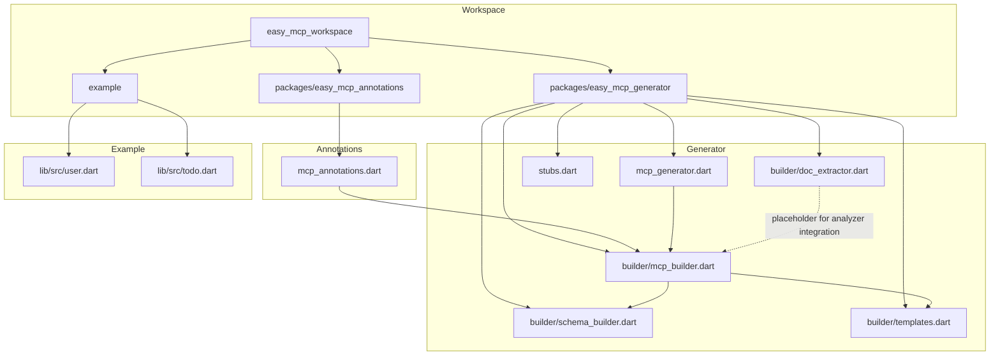
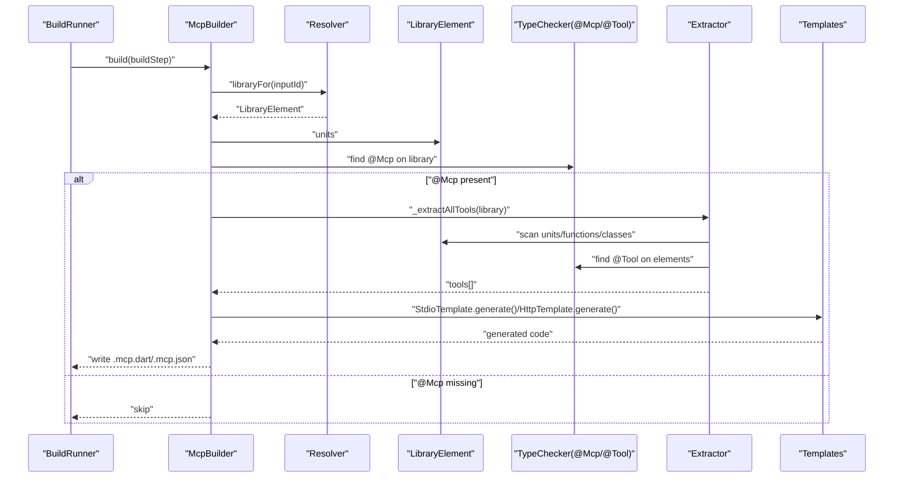
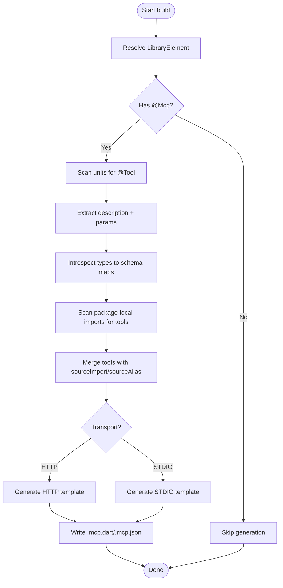
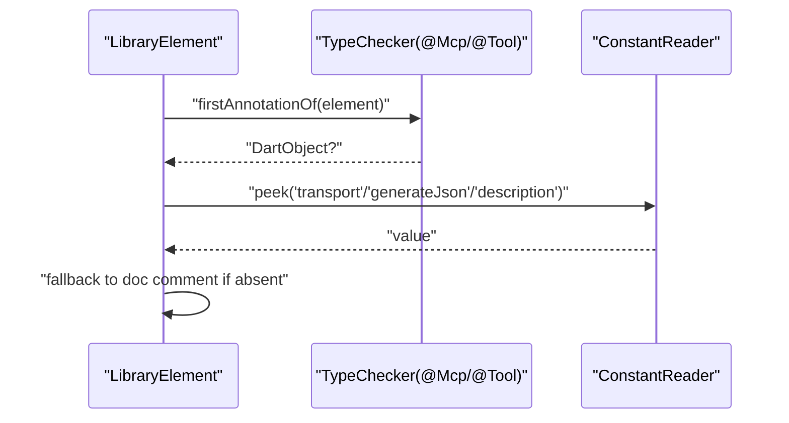
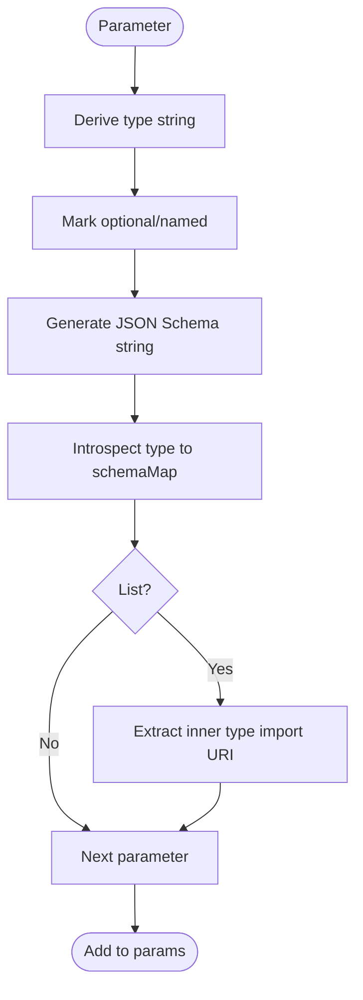
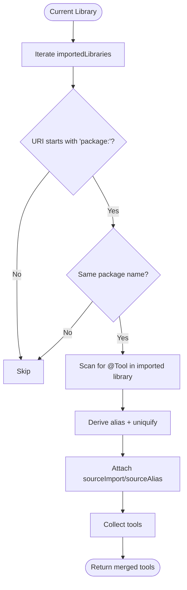
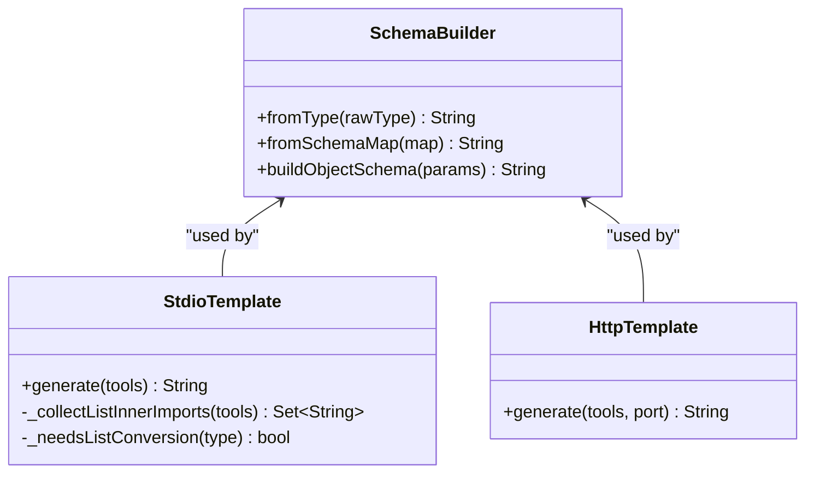
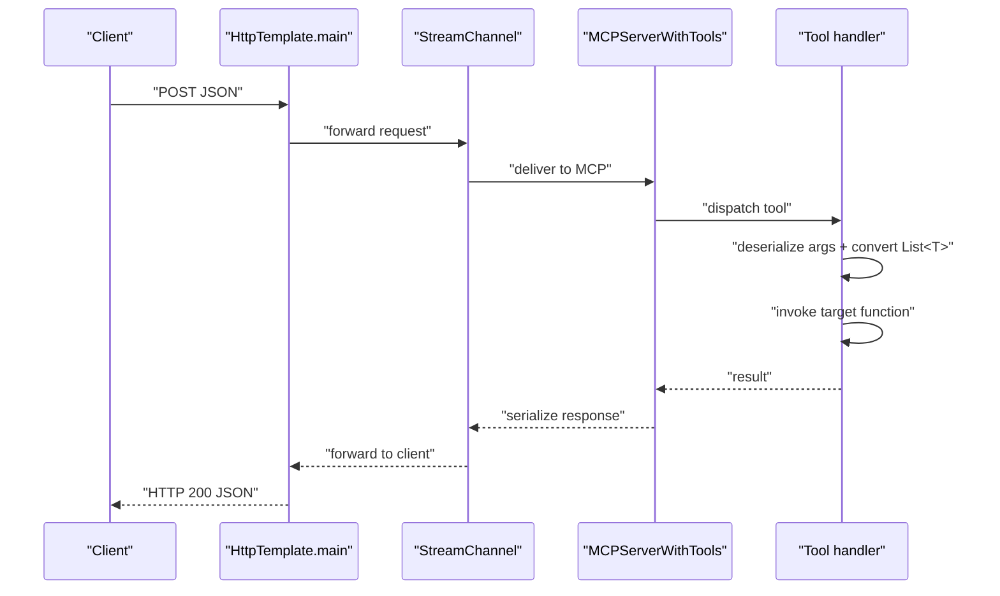
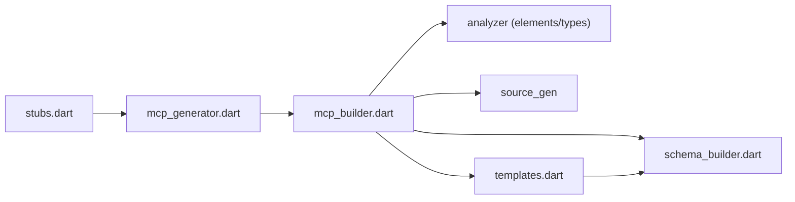

# AST Analysis and Processing

<cite>
**Referenced Files in This Document**
- [README.md](file://README.md)
- [pubspec.yaml](file://pubspec.yaml)
- [mcp_annotations.dart](file://packages/easy_mcp_annotations/lib/mcp_annotations.dart)
- [mcp_generator.dart](file://packages/easy_mcp_generator/lib/mcp_generator.dart)
- [mcp_builder.dart](file://packages/easy_mcp_generator/lib/builder/mcp_builder.dart)
- [schema_builder.dart](file://packages/easy_mcp_generator/lib/builder/schema_builder.dart)
- [doc_extractor.dart](file://packages/easy_mcp_generator/lib/builder/doc_extractor.dart)
- [templates.dart](file://packages/easy_mcp_generator/lib/builder/templates.dart)
- [stubs.dart](file://packages/easy_mcp_generator/lib/stubs.dart)
- [user.dart](file://example/lib/src/user.dart)
- [todo.dart](file://example/lib/src/todo.dart)
</cite>

## Table of Contents
1. [Introduction](#introduction)
2. [Project Structure](#project-structure)
3. [Core Components](#core-components)
4. [Architecture Overview](#architecture-overview)
5. [Detailed Component Analysis](#detailed-component-analysis)
6. [Dependency Analysis](#dependency-analysis)
7. [Performance Considerations](#performance-considerations)
8. [Troubleshooting Guide](#troubleshooting-guide)
9. [Conclusion](#conclusion)

## Introduction
This document explains the AST analysis and processing subsystem that powers the Easy MCP code generator. It focuses on how the generator integrates with dart:analyzer to reliably extract annotated functions, scan libraries for tools, introspect types, and generate MCP-compatible servers. It covers annotation scanning, parameter introspection, type mapping, cross-library discovery, and performance considerations for large codebases.

## Project Structure
The workspace is organized as a Melos-managed Dart workspace with three primary parts:
- easy_mcp_annotations: Defines the @Mcp and @Tool annotations.
- easy_mcp_generator: Implements the build-time generator using dart:analyzer and source_gen.
- example: Demonstrates usage with annotated domain classes and tools.

**Diagram sources**
- [pubspec.yaml:1-64](file://pubspec.yaml#L1-L64)
- [mcp_annotations.dart:1-107](file://packages/easy_mcp_annotations/lib/mcp_annotations.dart#L1-L107)
- [mcp_generator.dart:1-14](file://packages/easy_mcp_generator/lib/mcp_generator.dart#L1-L14)
- [mcp_builder.dart:1-567](file://packages/easy_mcp_generator/lib/builder/mcp_builder.dart#L1-L567)
- [schema_builder.dart:1-99](file://packages/easy_mcp_generator/lib/builder/schema_builder.dart#L1-L99)
- [doc_extractor.dart:1-106](file://packages/easy_mcp_generator/lib/builder/doc_extractor.dart#L1-L106)
- [templates.dart:1-578](file://packages/easy_mcp_generator/lib/builder/templates.dart#L1-L578)
- [stubs.dart:1-7](file://packages/easy_mcp_generator/lib/stubs.dart#L1-L7)
- [user.dart:1-42](file://example/lib/src/user.dart#L1-L42)
- [todo.dart:1-46](file://example/lib/src/todo.dart#L1-L46)

**Section sources**
- [pubspec.yaml:1-64](file://pubspec.yaml#L1-L64)
- [README.md:1-120](file://README.md#L1-L120)

## Core Components
- Annotations: @Mcp and @Tool define transport mode and tool metadata.
- Builder: Scans libraries, discovers tools, extracts parameters and types, and generates code.
- Templates: Produce stdio and HTTP server code with tool registration and handlers.
- Schema Builder: Converts parameter metadata into typed schema expressions.
- Doc Extractor: Placeholder for doc comment extraction (planned analyzer integration).

Key responsibilities:
- Library scanning and filtering for @Mcp and @Tool.
- AST traversal via analyzer elements to collect function/method signatures.
- Parameter introspection and type mapping to JSON Schema.
- Cross-library discovery respecting package boundaries.
- Generation of server code and optional JSON metadata.

**Section sources**
- [mcp_annotations.dart:1-107](file://packages/easy_mcp_annotations/lib/mcp_annotations.dart#L1-L107)
- [mcp_builder.dart:12-567](file://packages/easy_mcp_generator/lib/builder/mcp_builder.dart#L12-L567)
- [templates.dart:1-578](file://packages/easy_mcp_generator/lib/builder/templates.dart#L1-L578)
- [schema_builder.dart:1-99](file://packages/easy_mcp_generator/lib/builder/schema_builder.dart#L1-L99)
- [doc_extractor.dart:1-106](file://packages/easy_mcp_generator/lib/builder/doc_extractor.dart#L1-L106)

## Architecture Overview
The generator is a build step that:
- Resolves the target library.
- Validates presence of @Mcp annotation.
- Scans the library and its package-local imports for @Tool-annotated functions and methods.
- Extracts descriptions, parameters, and types.
- Generates either stdio or HTTP server code and optionally JSON metadata.

**Diagram sources**
- [mcp_builder.dart:18-52](file://packages/easy_mcp_generator/lib/builder/mcp_builder.dart#L18-L52)
- [mcp_builder.dart:112-166](file://packages/easy_mcp_generator/lib/builder/mcp_builder.dart#L112-L166)
- [templates.dart:6-175](file://packages/easy_mcp_generator/lib/builder/templates.dart#L6-L175)
- [templates.dart:269-486](file://packages/easy_mcp_generator/lib/builder/templates.dart#L269-L486)

## Detailed Component Analysis

### Annotation Definitions (@Mcp and @Tool)
- @Mcp configures transport mode and optional JSON metadata generation.
- @Tool annotates functions and methods as MCP tools, with optional description and icons.

Implementation highlights:
- Enums and constants are used to encode transport and flags.
- Annotations are designed for source_gen compatibility.

**Section sources**
- [mcp_annotations.dart:6-19](file://packages/easy_mcp_annotations/lib/mcp_annotations.dart#L6-L19)
- [mcp_annotations.dart:39-56](file://packages/easy_mcp_annotations/lib/mcp_annotations.dart#L39-L56)
- [mcp_annotations.dart:79-106](file://packages/easy_mcp_annotations/lib/mcp_annotations.dart#L79-L106)

### Builder and AST Traversal
The builder orchestrates scanning and extraction:
- Filters libraries by @Mcp presence.
- Scans top-level functions and class methods for @Tool.
- Extracts descriptions from annotation or doc comments.
- Builds parameter metadata and type introspection maps.
- Supports cross-library discovery within the same package.

Key methods and responsibilities:
- Library gating and transport selection.
- Tool extraction from current library and package-local imports.
- Parameter extraction and schema map generation.
- JSON metadata generation.

**Diagram sources**
- [mcp_builder.dart:18-52](file://packages/easy_mcp_generator/lib/builder/mcp_builder.dart#L18-L52)
- [mcp_builder.dart:112-166](file://packages/easy_mcp_generator/lib/builder/mcp_builder.dart#L112-L166)
- [mcp_builder.dart:228-259](file://packages/easy_mcp_generator/lib/builder/mcp_builder.dart#L228-L259)
- [mcp_builder.dart:307-411](file://packages/easy_mcp_generator/lib/builder/mcp_builder.dart#L307-L411)

**Section sources**
- [mcp_builder.dart:12-52](file://packages/easy_mcp_generator/lib/builder/mcp_builder.dart#L12-L52)
- [mcp_builder.dart:54-110](file://packages/easy_mcp_generator/lib/builder/mcp_builder.dart#L54-L110)
- [mcp_builder.dart:112-166](file://packages/easy_mcp_generator/lib/builder/mcp_builder.dart#L112-L166)
- [mcp_builder.dart:201-226](file://packages/easy_mcp_generator/lib/builder/mcp_builder.dart#L201-L226)
- [mcp_builder.dart:228-259](file://packages/easy_mcp_generator/lib/builder/mcp_builder.dart#L228-L259)
- [mcp_builder.dart:285-305](file://packages/easy_mcp_generator/lib/builder/mcp_builder.dart#L285-L305)
- [mcp_builder.dart:307-411](file://packages/easy_mcp_generator/lib/builder/mcp_builder.dart#L307-L411)
- [mcp_builder.dart:442-468](file://packages/easy_mcp_generator/lib/builder/mcp_builder.dart#L442-L468)
- [mcp_builder.dart:470-563](file://packages/easy_mcp_generator/lib/builder/mcp_builder.dart#L470-L563)

### Annotation Extraction and Validation
- Uses TypeChecker to locate @Mcp and @Tool annotations on library and executable elements.
- Reads annotation fields via ConstantReader to extract transport, flags, and metadata.
- Falls back to doc comments when description is not provided.
- Validates presence of @Mcp before proceeding.

**Diagram sources**
- [mcp_builder.dart:470-563](file://packages/easy_mcp_generator/lib/builder/mcp_builder.dart#L470-L563)
- [mcp_builder.dart:201-226](file://packages/easy_mcp_generator/lib/builder/mcp_builder.dart#L201-L226)

**Section sources**
- [mcp_builder.dart:470-563](file://packages/easy_mcp_generator/lib/builder/mcp_builder.dart#L470-L563)
- [mcp_builder.dart:201-226](file://packages/easy_mcp_generator/lib/builder/mcp_builder.dart#L201-L226)

### Parameter Introspection and Type Analysis
- Iterates over parameters to derive type strings, optionality, and named vs positional.
- Produces a compact JSON Schema string and a richer schemaMap for deep introspection.
- Handles futures by unwrapping to underlying type.
- Detects custom classes (non-dart:core/dart:async) and skips private/static fields.
- Supports cycle detection for recursive types.
- Special-cases DateTime as string with date-time format.
- Records import URIs for List<T> inner types when T is a custom class.

**Diagram sources**
- [mcp_builder.dart:228-259](file://packages/easy_mcp_generator/lib/builder/mcp_builder.dart#L228-L259)
- [mcp_builder.dart:261-283](file://packages/easy_mcp_generator/lib/builder/mcp_builder.dart#L261-L283)
- [mcp_builder.dart:285-305](file://packages/easy_mcp_generator/lib/builder/mcp_builder.dart#L285-L305)
- [mcp_builder.dart:307-411](file://packages/easy_mcp_generator/lib/builder/mcp_builder.dart#L307-L411)
- [mcp_builder.dart:413-440](file://packages/easy_mcp_generator/lib/builder/mcp_builder.dart#L413-L440)

**Section sources**
- [mcp_builder.dart:228-259](file://packages/easy_mcp_generator/lib/builder/mcp_builder.dart#L228-L259)
- [mcp_builder.dart:261-283](file://packages/easy_mcp_generator/lib/builder/mcp_builder.dart#L261-L283)
- [mcp_builder.dart:285-305](file://packages/easy_mcp_generator/lib/builder/mcp_builder.dart#L285-L305)
- [mcp_builder.dart:307-411](file://packages/easy_mcp_generator/lib/builder/mcp_builder.dart#L307-L411)
- [mcp_builder.dart:413-440](file://packages/easy_mcp_generator/lib/builder/mcp_builder.dart#L413-L440)

### Cross-Library Tool Discovery
- Scans imported libraries and filters to package-local imports (package: URIs).
- Derives unique import aliases per library and ensures uniqueness.
- Attaches sourceImport and sourceAlias to each discovered tool to enable correct imports in generated code.

**Diagram sources**
- [mcp_builder.dart:112-166](file://packages/easy_mcp_generator/lib/builder/mcp_builder.dart#L112-L166)
- [mcp_builder.dart:168-199](file://packages/easy_mcp_generator/lib/builder/mcp_builder.dart#L168-L199)

**Section sources**
- [mcp_builder.dart:112-166](file://packages/easy_mcp_generator/lib/builder/mcp_builder.dart#L112-L166)
- [mcp_builder.dart:168-199](file://packages/easy_mcp_generator/lib/builder/mcp_builder.dart#L168-L199)

### Type System Integration and Serialization
- Primitive mapping: int, double/num, String, bool; special handling for DateTime.
- Generic handling: List<T>, Map<K,V> treated as array/object; inner type import recorded when T is custom.
- Custom class serialization: Skips private/static fields; records required fields based on non-nullable types; supports cycle detection.
- Generated server code serializes results using toJson() when available, falling back to toString.

**Diagram sources**
- [schema_builder.dart:1-99](file://packages/easy_mcp_generator/lib/builder/schema_builder.dart#L1-L99)
- [templates.dart:6-175](file://packages/easy_mcp_generator/lib/builder/templates.dart#L6-L175)
- [templates.dart:269-486](file://packages/easy_mcp_generator/lib/builder/templates.dart#L269-L486)

**Section sources**
- [schema_builder.dart:1-99](file://packages/easy_mcp_generator/lib/builder/schema_builder.dart#L1-L99)
- [templates.dart:6-175](file://packages/easy_mcp_generator/lib/builder/templates.dart#L6-L175)
- [templates.dart:269-486](file://packages/easy_mcp_generator/lib/builder/templates.dart#L269-L486)

### Generated Code Templates and Handler Logic
- Both stdio and HTTP templates import per-tool source aliases and custom List inner types.
- Handlers extract arguments, apply conversions for List<T> where T is a custom class, and call the target function (static or instance).
- Results are serialized using JSON encoding when available; otherwise string representation is used.
- HTTP template bridges HTTP requests to MCP via a StreamChannel.

**Diagram sources**
- [templates.dart:382-486](file://packages/easy_mcp_generator/lib/builder/templates.dart#L382-L486)

**Section sources**
- [templates.dart:6-175](file://packages/easy_mcp_generator/lib/builder/templates.dart#L6-L175)
- [templates.dart:269-486](file://packages/easy_mcp_generator/lib/builder/templates.dart#L269-L486)

### Example Domain Types
The example demonstrates custom classes with toJson/fromJson and lists of primitives, which are processed by the type introspection and template logic.

**Section sources**
- [user.dart:1-42](file://example/lib/src/user.dart#L1-L42)
- [todo.dart:1-46](file://example/lib/src/todo.dart#L1-L46)

## Dependency Analysis
- The generator depends on analyzer for element and type resolution, and on source_gen for annotation processing.
- The builder exports a Builder that integrates with build_runner.
- Templates depend on schema_builder to produce typed schema expressions.
- Stubs provide compile-time exports for build types during development.

**Diagram sources**
- [mcp_builder.dart:1-11](file://packages/easy_mcp_generator/lib/builder/mcp_builder.dart#L1-L11)
- [mcp_generator.dart:1-14](file://packages/easy_mcp_generator/lib/mcp_generator.dart#L1-L14)
- [stubs.dart:1-7](file://packages/easy_mcp_generator/lib/stubs.dart#L1-L7)

**Section sources**
- [mcp_builder.dart:1-11](file://packages/easy_mcp_generator/lib/builder/mcp_builder.dart#L1-L11)
- [mcp_generator.dart:1-14](file://packages/easy_mcp_generator/lib/mcp_generator.dart#L1-L14)
- [stubs.dart:1-7](file://packages/easy_mcp_generator/lib/stubs.dart#L1-L7)

## Performance Considerations
- Limit scanning scope: Only libraries annotated with @Mcp are processed.
- Package-local imports only: Cross-library scanning is restricted to package: URIs from the same package, reducing unnecessary traversal.
- Early exits: If no tools are found, generation is skipped.
- Efficient type checks: Primitive and core type checks short-circuit expensive reflection.
- Memoization opportunities: Caching of type introspection results could benefit very large schemas.
- Batch generation: The builder aggregates tools and writes outputs once per input library.

[No sources needed since this section provides general guidance]

## Troubleshooting Guide
Common issues and remedies:
- No tools generated:
  - Ensure the library under analysis has an @Mcp annotation.
  - Verify @Tool annotations exist on functions or class methods.
  - Confirm the library is recognized as a library by the resolver.
- Incorrect transport:
  - Check @Mcp transport field; the builder reads enum by name and falls back to index-based detection.
- Missing descriptions:
  - Provide description in @Tool or ensure doc comments are present and properly formatted.
- Type mismatches in generated handlers:
  - Review parameter optionality and named vs positional flags.
  - For List<T> with custom T, confirm T has a proper import URI attached.
- Cross-library import problems:
  - Ensure imported libraries are package-local (package: URIs) and belong to the same package.
  - Verify derived aliases are unique and correctly applied in generated imports.

**Section sources**
- [mcp_builder.dart:18-52](file://packages/easy_mcp_generator/lib/builder/mcp_builder.dart#L18-L52)
- [mcp_builder.dart:470-563](file://packages/easy_mcp_generator/lib/builder/mcp_builder.dart#L470-L563)
- [mcp_builder.dart:201-226](file://packages/easy_mcp_generator/lib/builder/mcp_builder.dart#L201-L226)
- [mcp_builder.dart:112-166](file://packages/easy_mcp_generator/lib/builder/mcp_builder.dart#L112-L166)

## Conclusion
The AST analysis and processing subsystem leverages dart:analyzer and source_gen to reliably discover MCP tools, introspect parameters and types, and generate transport-specific servers. Its design emphasizes correctness (package-local imports), maintainability (clear separation of concerns), and extensibility (schema builder and templates). For large codebases, careful annotation placement and adherence to package boundaries yield predictable performance and accurate metadata generation.