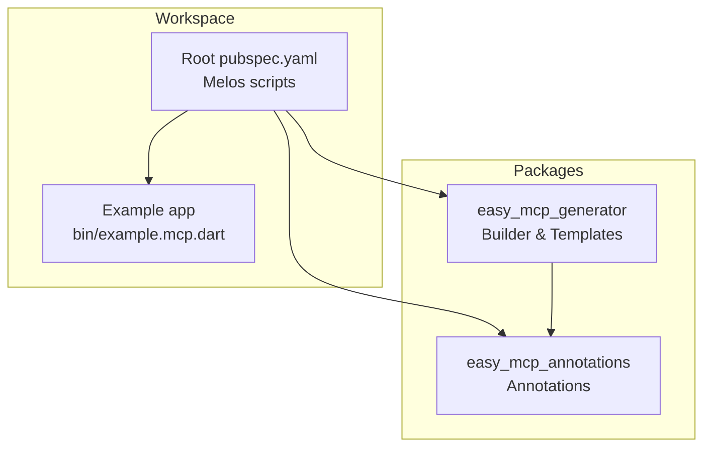
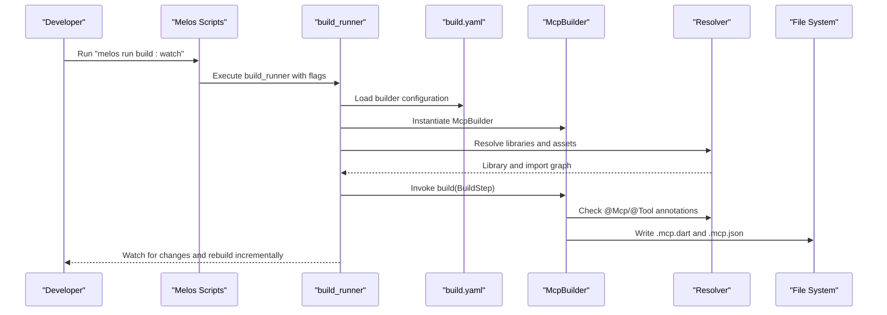
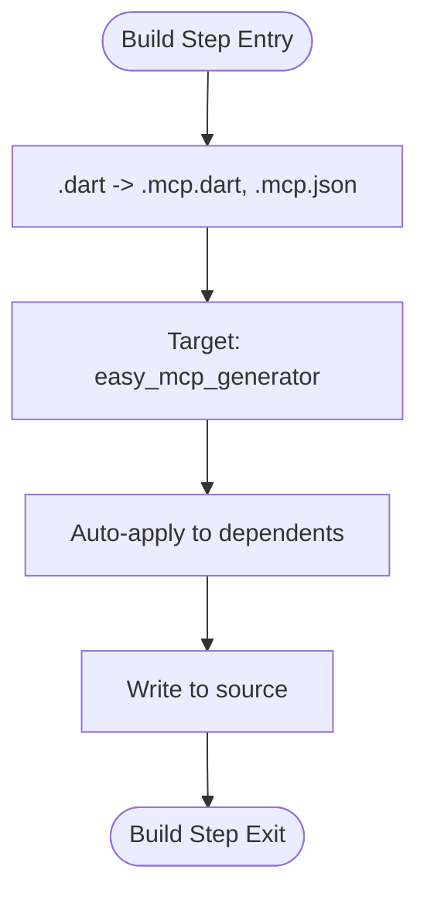
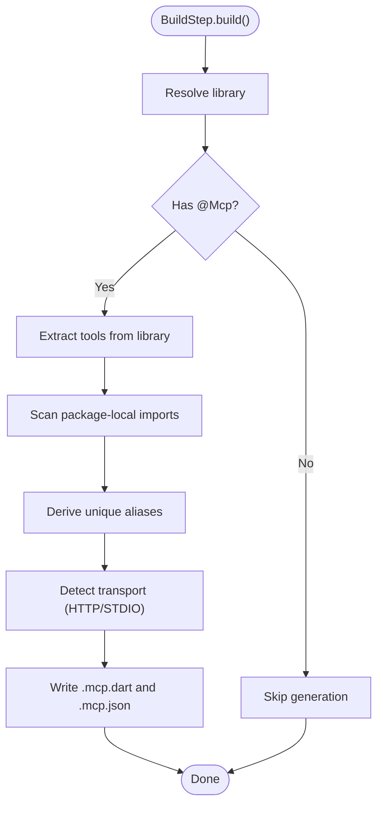
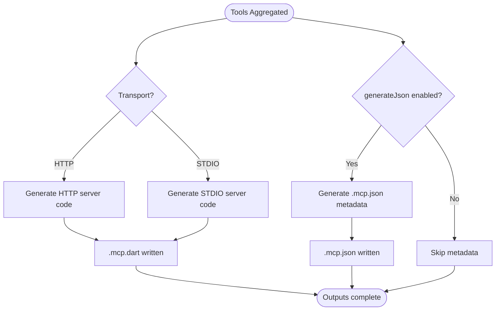
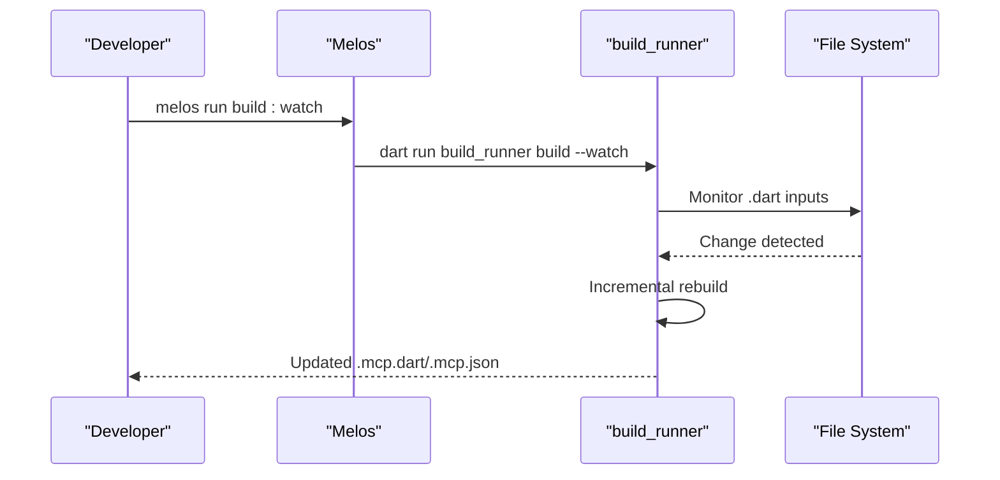
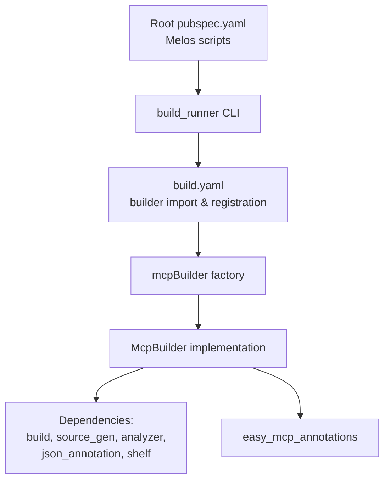
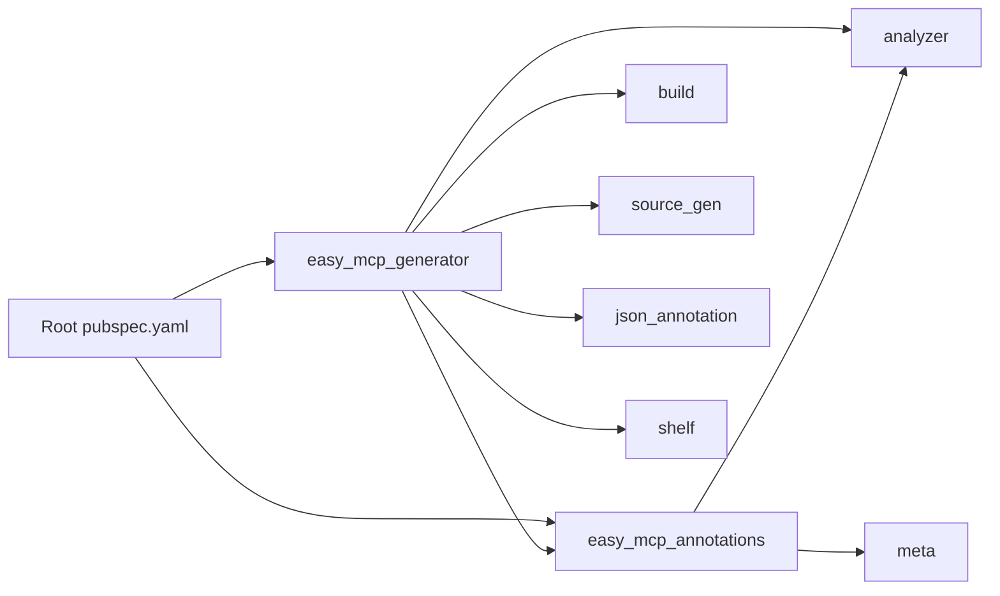

# Build System Integration

<cite>
**Referenced Files in This Document**
- [pubspec.yaml](file://pubspec.yaml)
- [packages/easy_mcp_generator/build.yaml](file://packages/easy_mcp_generator/build.yaml)
- [packages/easy_mcp_generator/lib/mcp_generator.dart](file://packages/easy_mcp_generator/lib/mcp_generator.dart)
- [packages/easy_mcp_generator/lib/builder/mcp_builder.dart](file://packages/easy_mcp_generator/lib/builder/mcp_builder.dart)
- [packages/easy_mcp_generator/lib/stubs.dart](file://packages/easy_mcp_generator/lib/stubs.dart)
- [packages/easy_mcp_annotations/pubspec.yaml](file://packages/easy_mcp_annotations/pubspec.yaml)
- [packages/easy_mcp_generator/pubspec.yaml](file://packages/easy_mcp_generator/pubspec.yaml)
- [example/bin/example.mcp.dart](file://example/bin/example.mcp.dart)
</cite>

## Table of Contents
1. [Introduction](#introduction)
2. [Project Structure](#project-structure)
3. [Core Components](#core-components)
4. [Architecture Overview](#architecture-overview)
5. [Detailed Component Analysis](#detailed-component-analysis)
6. [Dependency Analysis](#dependency-analysis)
7. [Performance Considerations](#performance-considerations)
8. [Troubleshooting Guide](#troubleshooting-guide)
9. [Conclusion](#conclusion)

## Introduction
This document explains how the build system integrates with the code generation pipeline for Model Context Protocol (MCP) tools. It covers the build extension setup that triggers code generation for .dart files, producing .mcp.dart and .mcp.json outputs. It also documents the build step processing, resolver integration, and output generation workflows. The guide includes watch mode usage for continuous development and incremental builds, integration with the build_runner ecosystem via build.yaml configuration and custom builder registration, caching strategies, incremental compilation, and performance optimization techniques. Finally, it provides troubleshooting guidance for common build issues, dependency resolution problems, and generator conflicts, along with workspace coordination in multi-package environments and build order dependencies.

## Project Structure
The workspace is organized as a Melos-managed monorepo with three primary parts:
- Root workspace configuration and scripts for build_runner orchestration
- Annotations package defining the @Mcp and @Tool annotations used to mark MCP-capable functions and methods
- Generator package implementing the build step that reads annotated libraries and produces MCP server code and optional metadata

**Diagram sources**
- [pubspec.yaml:1-64](file://pubspec.yaml#L1-L64)
- [packages/easy_mcp_generator/build.yaml:1-12](file://packages/easy_mcp_generator/build.yaml#L1-L12)
- [packages/easy_mcp_annotations/pubspec.yaml:1-28](file://packages/easy_mcp_annotations/pubspec.yaml#L1-L28)
- [packages/easy_mcp_generator/pubspec.yaml:1-34](file://packages/easy_mcp_generator/pubspec.yaml#L1-L34)

**Section sources**
- [pubspec.yaml:1-64](file://pubspec.yaml#L1-L64)
- [packages/easy_mcp_generator/build.yaml:1-12](file://packages/easy_mcp_generator/build.yaml#L1-L12)

## Core Components
- Build extension configuration: Declares that .dart inputs produce .mcp.dart and .mcp.json outputs and applies automatically to dependent packages.
- Custom builder: Implements the build step that inspects libraries for @Mcp and @Tool annotations, extracts tool metadata, and writes generated outputs.
- Stubs: Provides local re-exports of build types so the generator compiles during development; build_runner supplies the real types at runtime.
- Annotation package: Defines the @Mcp and @Tool annotations and related enums used to mark and describe MCP tools.

Key responsibilities:
- Build extension mapping: Associates input .dart files with generated .mcp.dart and .mcp.json outputs.
- Resolver integration: Uses the BuildStep resolver to identify libraries, check annotations, and resolve imports.
- Output generation: Writes server code and optional JSON metadata describing tool signatures.
- Workspace-aware tool extraction: Aggregates tools from the current library and package-local imports, deriving unique aliases to avoid collisions.

**Section sources**
- [packages/easy_mcp_generator/build.yaml:1-12](file://packages/easy_mcp_generator/build.yaml#L1-L12)
- [packages/easy_mcp_generator/lib/builder/mcp_builder.dart:12-52](file://packages/easy_mcp_generator/lib/builder/mcp_builder.dart#L12-L52)
- [packages/easy_mcp_generator/lib/stubs.dart:1-7](file://packages/easy_mcp_generator/lib/stubs.dart#L1-L7)
- [packages/easy_mcp_annotations/pubspec.yaml:1-28](file://packages/easy_mcp_annotations/pubspec.yaml#L1-L28)

## Architecture Overview
The build system orchestrator invokes build_runner, which loads the custom builder and applies it according to the build.yaml configuration. The builder inspects annotated libraries, aggregates tools across the current package’s imports, and writes generated outputs.

**Diagram sources**
- [pubspec.yaml:35-38](file://pubspec.yaml#L35-L38)
- [packages/easy_mcp_generator/build.yaml:1-12](file://packages/easy_mcp_generator/build.yaml#L1-L12)
- [packages/easy_mcp_generator/lib/builder/mcp_builder.dart:18-52](file://packages/easy_mcp_generator/lib/builder/mcp_builder.dart#L18-L52)

## Detailed Component Analysis

### Build Extension Setup and Custom Builder Registration
- Build extension mapping: The builder declares that .dart inputs produce .mcp.dart and .mcp.json outputs and sets the build target to the generator package.
- Auto-application: The builder is configured to apply to dependents, ensuring downstream packages automatically trigger generation when they depend on the generator.
- Output location: Generated outputs are written to the source directory, enabling immediate consumption by the same package.

**Diagram sources**
- [packages/easy_mcp_generator/build.yaml:2-12](file://packages/easy_mcp_generator/build.yaml#L2-L12)

**Section sources**
- [packages/easy_mcp_generator/build.yaml:1-12](file://packages/easy_mcp_generator/build.yaml#L1-L12)

### Build Step Processing and Resolver Integration
- Library identification: The builder checks whether the input is a library and retrieves the library element for inspection.
- Annotation scanning: It verifies the presence of @Mcp at the library level and @Tool on top-level functions and class methods.
- Import traversal: The builder scans package-local imports within the same package to aggregate tools, deriving unique aliases per import to prevent conflicts.
- Transport selection: Based on the @Mcp annotation, the builder selects either HTTP or stdio transport for the generated server code.

**Diagram sources**
- [packages/easy_mcp_generator/lib/builder/mcp_builder.dart:18-52](file://packages/easy_mcp_generator/lib/builder/mcp_builder.dart#L18-L52)
- [packages/easy_mcp_generator/lib/builder/mcp_builder.dart:112-166](file://packages/easy_mcp_generator/lib/builder/mcp_builder.dart#L112-L166)
- [packages/easy_mcp_generator/lib/builder/mcp_builder.dart:515-563](file://packages/easy_mcp_generator/lib/builder/mcp_builder.dart#L515-L563)

**Section sources**
- [packages/easy_mcp_generator/lib/builder/mcp_builder.dart:18-52](file://packages/easy_mcp_generator/lib/builder/mcp_builder.dart#L18-L52)
- [packages/easy_mcp_generator/lib/builder/mcp_builder.dart:112-166](file://packages/easy_mcp_generator/lib/builder/mcp_builder.dart#L112-L166)
- [packages/easy_mcp_generator/lib/builder/mcp_builder.dart:515-563](file://packages/easy_mcp_generator/lib/builder/mcp_builder.dart#L515-L563)

### Output Generation Workflows
- Server code generation: The builder generates MCP-compatible server code tailored to the selected transport (HTTP or stdio) using template helpers.
- JSON metadata generation: When enabled by the @Mcp annotation, the builder writes a JSON schema describing tool names, descriptions, and input schemas derived from parameter introspection.
- Parameter introspection: The builder converts Dart types to JSON Schema equivalents, handling primitives, collections, maps, and custom classes with cycle detection.

**Diagram sources**
- [packages/easy_mcp_generator/lib/builder/mcp_builder.dart:35-51](file://packages/easy_mcp_generator/lib/builder/mcp_builder.dart#L35-L51)
- [packages/easy_mcp_generator/lib/builder/mcp_builder.dart:442-468](file://packages/easy_mcp_generator/lib/builder/mcp_builder.dart#L442-L468)

**Section sources**
- [packages/easy_mcp_generator/lib/builder/mcp_builder.dart:35-51](file://packages/easy_mcp_generator/lib/builder/mcp_builder.dart#L35-L51)
- [packages/easy_mcp_generator/lib/builder/mcp_builder.dart:442-468](file://packages/easy_mcp_generator/lib/builder/mcp_builder.dart#L442-L468)

### Watch Mode and Incremental Builds
- Continuous development: The Melos script exposes a watch command that runs build_runner in watch mode, rebuilding on file changes.
- Incremental compilation: build_runner tracks inputs and outputs, regenerating only affected targets when dependencies change.
- Delete conflicting outputs: The build scripts pass a flag to remove outputs that conflict with declared build extensions, preventing stale artifacts.

**Diagram sources**
- [pubspec.yaml:37-38](file://pubspec.yaml#L37-L38)

**Section sources**
- [pubspec.yaml:35-38](file://pubspec.yaml#L35-L38)

### Integration with build_runner Ecosystem
- Workspace scripts: The root pubspec defines Melos scripts to invoke build_runner with consistent flags for building, watching, and cleaning.
- Custom builder registration: The build.yaml imports the builder factory from the generator package and registers it under a named builder.
- Package dependencies: The generator depends on build, source_gen, analyzer, and the annotations package, while the annotations package depends on analyzer and meta.

**Diagram sources**
- [pubspec.yaml:35-38](file://pubspec.yaml#L35-L38)
- [packages/easy_mcp_generator/build.yaml:3-11](file://packages/easy_mcp_generator/build.yaml#L3-L11)
- [packages/easy_mcp_generator/lib/mcp_generator.dart:11](file://packages/easy_mcp_generator/lib/mcp_generator.dart#L11)
- [packages/easy_mcp_generator/pubspec.yaml:10-21](file://packages/easy_mcp_generator/pubspec.yaml#L10-L21)
- [packages/easy_mcp_annotations/pubspec.yaml:11-17](file://packages/easy_mcp_annotations/pubspec.yaml#L11-L17)

**Section sources**
- [pubspec.yaml:35-38](file://pubspec.yaml#L35-L38)
- [packages/easy_mcp_generator/build.yaml:3-11](file://packages/easy_mcp_generator/build.yaml#L3-L11)
- [packages/easy_mcp_generator/lib/mcp_generator.dart:11](file://packages/easy_mcp_generator/lib/mcp_generator.dart#L11)
- [packages/easy_mcp_generator/pubspec.yaml:10-21](file://packages/easy_mcp_generator/pubspec.yaml#L10-L21)
- [packages/easy_mcp_annotations/pubspec.yaml:11-17](file://packages/easy_mcp_annotations/pubspec.yaml#L11-L17)

### Build Caching Strategies and Performance Optimization
- Incremental builds: build_runner tracks input/output relationships and rebuilds only changed targets, minimizing work.
- Resolver caching: The BuildStep resolver caches library and import resolutions, reducing repeated analysis overhead.
- Template reuse: Generated code is produced from templates and schema builders, avoiding redundant computation.
- Workspace resolution: Using workspace resolution ensures consistent dependency versions across packages, reducing rebuild churn.
- Local stubs: The stubs export enables local compilation without the full build environment, speeding up iteration.

Practical tips:
- Keep annotations minimal and focused to reduce scanning overhead.
- Group related tools within the same package to leverage package-local import aggregation.
- Use workspace resolution to align versions and avoid transitive dependency conflicts.

**Section sources**
- [packages/easy_mcp_generator/lib/stubs.dart:1-7](file://packages/easy_mcp_generator/lib/stubs.dart#L1-L7)
- [packages/easy_mcp_generator/pubspec.yaml:9](file://packages/easy_mcp_generator/pubspec.yaml#L9)
- [packages/easy_mcp_annotations/pubspec.yaml:9](file://packages/easy_mcp_annotations/pubspec.yaml#L9)

### Example Output Artifact
The example package demonstrates the generated output after running the build. The .mcp.dart file is produced alongside the example’s source files.

**Section sources**
- [example/bin/example.mcp.dart:1-20](file://example/bin/example.mcp.dart#L1-L20)

## Dependency Analysis
The generator package depends on build, source_gen, analyzer, and the annotations package. The annotations package depends on analyzer and meta. The root workspace configures Melos to run build_runner commands consistently across packages.

**Diagram sources**
- [pubspec.yaml:8-11](file://pubspec.yaml#L8-L11)
- [packages/easy_mcp_generator/pubspec.yaml:10-21](file://packages/easy_mcp_generator/pubspec.yaml#L10-L21)
- [packages/easy_mcp_annotations/pubspec.yaml:11-17](file://packages/easy_mcp_annotations/pubspec.yaml#L11-L17)

**Section sources**
- [pubspec.yaml:8-11](file://pubspec.yaml#L8-L11)
- [packages/easy_mcp_generator/pubspec.yaml:10-21](file://packages/easy_mcp_generator/pubspec.yaml#L10-L21)
- [packages/easy_mcp_annotations/pubspec.yaml:11-17](file://packages/easy_mcp_annotations/pubspec.yaml#L11-L17)

## Performance Considerations
- Prefer workspace resolution to minimize dependency divergence and rebuild frequency.
- Limit the number of annotated tools per library to reduce scanning and generation overhead.
- Use package-local imports judiciously; excessive cross-imports increase tool aggregation work.
- Keep generated code in source to enable immediate consumption without additional steps.
- Clean periodically to remove stale outputs and avoid conflicts.

## Troubleshooting Guide
Common issues and resolutions:
- No .mcp.dart/.mcp.json generated
  - Ensure the library has the @Mcp annotation and annotated functions/methods have @Tool.
  - Verify the package depends on the generator and build_runner is invoked with delete-conflicting-outputs.
  - Confirm the build.yaml is present and the builder import path is correct.
  - Check that the package is included in the workspace and Melos scripts are used to run build_runner.

- Conflicting outputs or stale artifacts
  - Use the build script with the delete-conflicting-outputs flag to remove conflicting files before generating.

- Dependency resolution errors
  - Align versions using workspace resolution.
  - Ensure the annotations package is resolvable and the generator depends on it.

- Generator conflicts or multiple builders
  - Confirm only one builder targets the same extensions and that auto_apply is configured appropriately for dependents.

- Watch mode not triggering rebuilds
  - Verify file paths and that the watch script is executed from the root with Melos.
  - Ensure generated outputs are written to the source directory as configured.

**Section sources**
- [pubspec.yaml:35-38](file://pubspec.yaml#L35-L38)
- [packages/easy_mcp_generator/build.yaml:7-12](file://packages/easy_mcp_generator/build.yaml#L7-L12)
- [packages/easy_mcp_generator/lib/builder/mcp_builder.dart:23-28](file://packages/easy_mcp_generator/lib/builder/mcp_builder.dart#L23-L28)

## Conclusion
The build system integrates seamlessly with build_runner to transform annotated Dart libraries into MCP-compatible server code and metadata. The custom builder leverages the resolver to scan libraries and imports, aggregates tools with workspace-aware aliasing, and writes deterministic outputs. With watch mode, incremental builds, and Melos-driven scripts, developers can iterate efficiently. Proper workspace coordination, dependency alignment, and careful use of annotations ensure smooth operation across multi-package environments.