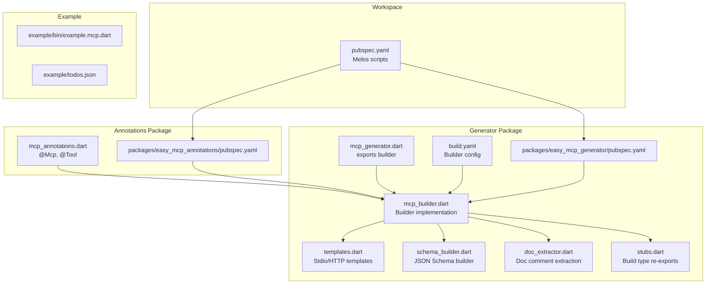
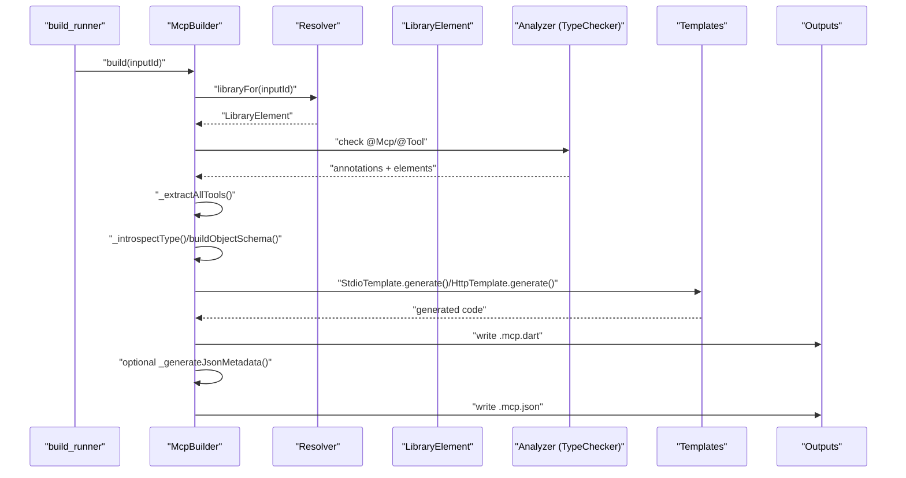
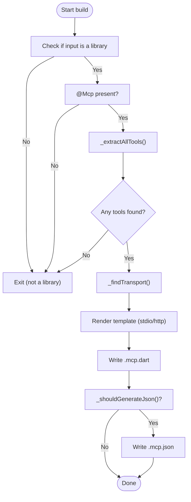
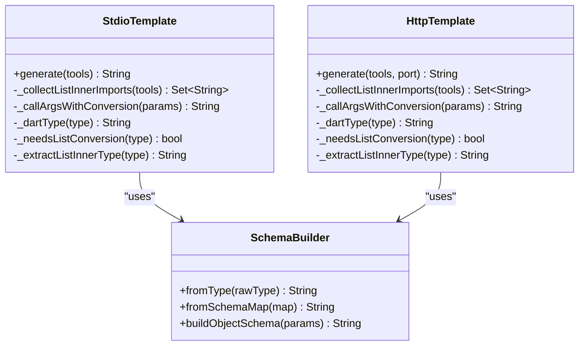
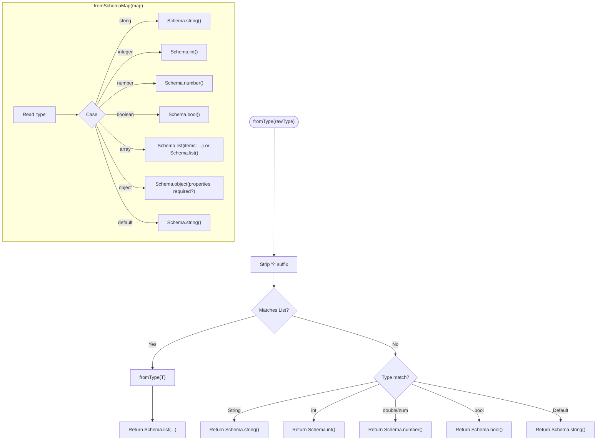
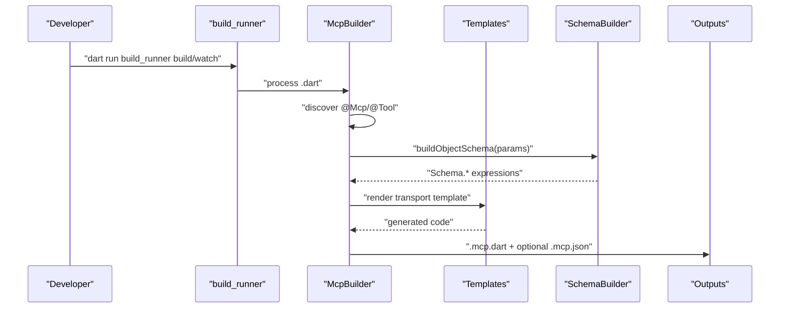
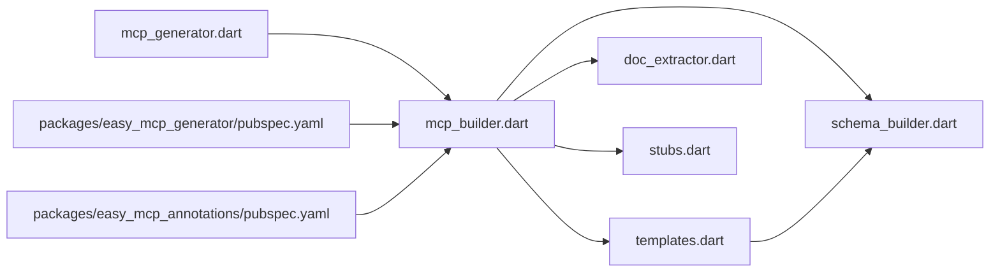

# Code Generation Engine

<cite>
**Referenced Files in This Document**
- [pubspec.yaml](file://pubspec.yaml)
- [packages/easy_mcp_generator/pubspec.yaml](file://packages/easy_mcp_generator/pubspec.yaml)
- [packages/easy_mcp_annotations/pubspec.yaml](file://packages/easy_mcp_annotations/pubspec.yaml)
- [packages/easy_mcp_generator/lib/mcp_generator.dart](file://packages/easy_mcp_generator/lib/mcp_generator.dart)
- [packages/easy_mcp_generator/lib/builder/mcp_builder.dart](file://packages/easy_mcp_generator/lib/builder/mcp_builder.dart)
- [packages/easy_mcp_generator/lib/builder/templates.dart](file://packages/easy_mcp_generator/lib/builder/templates.dart)
- [packages/easy_mcp_generator/lib/builder/schema_builder.dart](file://packages/easy_mcp_generator/lib/builder/schema_builder.dart)
- [packages/easy_mcp_generator/lib/builder/doc_extractor.dart](file://packages/easy_mcp_generator/lib/builder/doc_extractor.dart)
- [packages/easy_mcp_generator/lib/stubs.dart](file://packages/easy_mcp_generator/lib/stubs.dart)
- [packages/easy_mcp_generator/build.yaml](file://packages/easy_mcp_generator/build.yaml)
- [packages/easy_mcp_generator/README.md](file://packages/easy_mcp_generator/README.md)
- [packages/easy_mcp_annotations/lib/mcp_annotations.dart](file://packages/easy_mcp_annotations/lib/mcp_annotations.dart)
</cite>

## Table of Contents
1. [Introduction](#introduction)
2. [Project Structure](#project-structure)
3. [Core Components](#core-components)
4. [Architecture Overview](#architecture-overview)
5. [Detailed Component Analysis](#detailed-component-analysis)
6. [Dependency Analysis](#dependency-analysis)
7. [Performance Considerations](#performance-considerations)
8. [Troubleshooting Guide](#troubleshooting-guide)
9. [Conclusion](#conclusion)
10. [Appendices](#appendices)

## Introduction
This document explains Easy MCP's build-time code generation engine that transforms annotated Dart libraries into production-ready MCP servers. It covers:
- AST analysis using dart:analyzer for robust annotation discovery and metadata extraction
- Template system architecture for generating stdio and HTTP server code
- Schema builder for JSON Schema generation from Dart types
- Build extension configuration, watch mode, and integration with build_runner
- End-to-end pipeline from annotation discovery to final server code
- Performance considerations, caching strategies, and debugging techniques
- Extensibility points for custom templates and schema generation rules

## Project Structure
The workspace is a Melos-managed monorepo with three main parts:
- easy_mcp_annotations: Provides @Mcp and @Tool annotations
- easy_mcp_generator: Implements the build_runner builder and templates
- example: Demonstrates usage and generated outputs

**Diagram sources**
- [pubspec.yaml:1-64](file://pubspec.yaml#L1-L64)
- [packages/easy_mcp_generator/lib/mcp_generator.dart:1-14](file://packages/easy_mcp_generator/lib/mcp_generator.dart#L1-L14)
- [packages/easy_mcp_generator/lib/builder/mcp_builder.dart:1-567](file://packages/easy_mcp_generator/lib/builder/mcp_builder.dart#L1-L567)
- [packages/easy_mcp_generator/lib/builder/templates.dart:1-578](file://packages/easy_mcp_generator/lib/builder/templates.dart#L1-L578)
- [packages/easy_mcp_generator/lib/builder/schema_builder.dart:1-99](file://packages/easy_mcp_generator/lib/builder/schema_builder.dart#L1-L99)
- [packages/easy_mcp_generator/lib/builder/doc_extractor.dart:1-106](file://packages/easy_mcp_generator/lib/builder/doc_extractor.dart#L1-L106)
- [packages/easy_mcp_generator/lib/stubs.dart:1-7](file://packages/easy_mcp_generator/lib/stubs.dart#L1-L7)
- [packages/easy_mcp_generator/build.yaml:1-12](file://packages/easy_mcp_generator/build.yaml#L1-L12)
- [packages/easy_mcp_annotations/lib/mcp_annotations.dart:1-49](file://packages/easy_mcp_annotations/lib/mcp_annotations.dart#L1-L49)

**Section sources**
- [pubspec.yaml:1-64](file://pubspec.yaml#L1-L64)
- [packages/easy_mcp_generator/build.yaml:1-12](file://packages/easy_mcp_generator/build.yaml#L1-L12)

## Core Components
- Annotations: @Mcp and @Tool define transport mode and tool metadata
- Builder: Scans libraries, discovers tools, builds schemas, and writes outputs
- Templates: Generate stdio and HTTP server code plus optional JSON metadata
- Schema Builder: Maps Dart types to JSON Schema expressions and objects
- Doc Extractor: Placeholder for doc comment extraction (planned analyzer integration)
- Stubs: Local re-exports to enable compilation during development

Key responsibilities:
- Annotation discovery via analyzer TypeChecker
- Parameter introspection and schema generation
- Import resolution for cross-package tools
- Transport-specific code generation
- Optional JSON metadata emission

**Section sources**
- [packages/easy_mcp_annotations/lib/mcp_annotations.dart:14-49](file://packages/easy_mcp_annotations/lib/mcp_annotations.dart#L14-L49)
- [packages/easy_mcp_generator/lib/builder/mcp_builder.dart:12-567](file://packages/easy_mcp_generator/lib/builder/mcp_builder.dart#L12-L567)
- [packages/easy_mcp_generator/lib/builder/templates.dart:1-578](file://packages/easy_mcp_generator/lib/builder/templates.dart#L1-L578)
- [packages/easy_mcp_generator/lib/builder/schema_builder.dart:1-99](file://packages/easy_mcp_generator/lib/builder/schema_builder.dart#L1-L99)
- [packages/easy_mcp_generator/lib/builder/doc_extractor.dart:1-106](file://packages/easy_mcp_generator/lib/builder/doc_extractor.dart#L1-L106)
- [packages/easy_mcp_generator/lib/stubs.dart:1-7](file://packages/easy_mcp_generator/lib/stubs.dart#L1-L7)

## Architecture Overview
The generator is a build_runner Builder that:
- Watches .dart inputs and produces .mcp.dart and optionally .mcp.json outputs
- Uses analyzer to discover @Mcp and @Tool annotations
- Aggregates tools across the library and its package-local imports
- Renders transport-specific templates with resolved imports
- Emits JSON metadata when configured

**Diagram sources**
- [packages/easy_mcp_generator/lib/builder/mcp_builder.dart:18-52](file://packages/easy_mcp_generator/lib/builder/mcp_builder.dart#L18-L52)
- [packages/easy_mcp_generator/lib/builder/templates.dart:6-175](file://packages/easy_mcp_generator/lib/builder/templates.dart#L6-L175)
- [packages/easy_mcp_generator/lib/builder/schema_builder.dart:68-97](file://packages/easy_mcp_generator/lib/builder/schema_builder.dart#L68-L97)

## Detailed Component Analysis

### Annotation System (@Mcp and @Tool)
- @Mcp defines transport mode (stdio/http) and whether to emit JSON metadata
- @Tool annotates functions/classes with optional description and icons
- Both are defined in the annotations package and consumed by the builder

Implementation highlights:
- Enum McpTransport controls stdio vs HTTP generation
- Tool supports optional metadata; doc comments are used as fallback descriptions

**Section sources**
- [packages/easy_mcp_annotations/lib/mcp_annotations.dart:6-49](file://packages/easy_mcp_annotations/lib/mcp_annotations.dart#L6-L49)

### Builder and AST Analysis
The McpBuilder integrates analyzer to reliably discover annotations and extract metadata:
- Uses TypeChecker to locate @Mcp and @Tool
- Walks library units to collect top-level functions and class methods
- Extracts parameter metadata including type, optionality, and schema maps
- Resolves package-local imports to aggregate tools across the workspace
- Determines transport mode and optional JSON metadata generation

Key processing steps:
- Library-level checks for @Mcp
- Per-element checks for @Tool
- Parameter introspection with _introspectType and _dartTypeToJsonSchema
- Cross-library import scanning with alias derivation
- Transport selection and JSON metadata emission

**Diagram sources**
- [packages/easy_mcp_generator/lib/builder/mcp_builder.dart:18-52](file://packages/easy_mcp_generator/lib/builder/mcp_builder.dart#L18-L52)
- [packages/easy_mcp_generator/lib/builder/mcp_builder.dart:112-166](file://packages/easy_mcp_generator/lib/builder/mcp_builder.dart#L112-L166)
- [packages/easy_mcp_generator/lib/builder/mcp_builder.dart:470-563](file://packages/easy_mcp_generator/lib/builder/mcp_builder.dart#L470-L563)

**Section sources**
- [packages/easy_mcp_generator/lib/builder/mcp_builder.dart:12-567](file://packages/easy_mcp_generator/lib/builder/mcp_builder.dart#L12-L567)

### Template System Architecture
The generator ships two transport templates:
- StdioTemplate: JSON-RPC over stdin/stdout
- HttpTemplate: Shelf-based HTTP server

Shared capabilities:
- Imports resolution for custom List inner types and per-tool source imports
- Parameter extraction and conversion for List<T> with custom inner types
- Dynamic dispatch to original tool methods (static or instance)
- Serialization helpers for results
- Optional per-tool source import aliasing to avoid conflicts

**Diagram sources**
- [packages/easy_mcp_generator/lib/builder/templates.dart:6-266](file://packages/easy_mcp_generator/lib/builder/templates.dart#L6-L266)
- [packages/easy_mcp_generator/lib/builder/templates.dart:269-578](file://packages/easy_mcp_generator/lib/builder/templates.dart#L269-L578)
- [packages/easy_mcp_generator/lib/builder/schema_builder.dart:1-99](file://packages/easy_mcp_generator/lib/builder/schema_builder.dart#L1-L99)

**Section sources**
- [packages/easy_mcp_generator/lib/builder/templates.dart:1-578](file://packages/easy_mcp_generator/lib/builder/templates.dart#L1-L578)

### Schema Builder Component
The SchemaBuilder converts Dart types and introspected metadata into JSON Schema expressions:
- Primitive mapping: String/int/double/bool to JSON Schema types
- Nullable handling: strips ? suffix for mapping
- Lists: recursive item schema generation
- Objects: property maps with required fields derived from non-nullable fields
- Fallback: defaults to object for unknown/custom types

**Diagram sources**
- [packages/easy_mcp_generator/lib/builder/schema_builder.dart:3-27](file://packages/easy_mcp_generator/lib/builder/schema_builder.dart#L3-L27)
- [packages/easy_mcp_generator/lib/builder/schema_builder.dart:29-66](file://packages/easy_mcp_generator/lib/builder/schema_builder.dart#L29-L66)

**Section sources**
- [packages/easy_mcp_generator/lib/builder/schema_builder.dart:1-99](file://packages/easy_mcp_generator/lib/builder/schema_builder.dart#L1-L99)

### Build Extension Configuration and Integration
- build.yaml registers mcpBuilder with build extensions .dart -> [.mcp.dart, .mcp.json]
- auto_apply: dependents ensures downstream packages pick up generated code
- build_to: source emits outputs alongside source files
- The builder targets the generator package and uses local stubs for compilation

Integration with build_runner:
- Scripts in the workspace root demonstrate build, watch, and clean commands
- The generator depends on build_runner for orchestration

**Section sources**
- [packages/easy_mcp_generator/build.yaml:1-12](file://packages/easy_mcp_generator/build.yaml#L1-L12)
- [pubspec.yaml:35-38](file://pubspec.yaml#L35-L38)
- [packages/easy_mcp_generator/lib/stubs.dart:1-7](file://packages/easy_mcp_generator/lib/stubs.dart#L1-L7)

### End-to-End Pipeline
From annotated code to generated server:
1. Developer adds @Mcp and @Tool annotations
2. build_runner triggers mcpBuilder for affected libraries
3. Builder resolves library and imports, discovers tools
4. Parameters are introspected and schemas built
5. Templates render stdio or HTTP server code
6. Optional JSON metadata emitted for tool schemas
7. Generated files placed next to source

**Diagram sources**
- [packages/easy_mcp_generator/lib/builder/mcp_builder.dart:18-52](file://packages/easy_mcp_generator/lib/builder/mcp_builder.dart#L18-L52)
- [packages/easy_mcp_generator/lib/builder/templates.dart:6-175](file://packages/easy_mcp_generator/lib/builder/templates.dart#L6-L175)
- [packages/easy_mcp_generator/lib/builder/schema_builder.dart:68-97](file://packages/easy_mcp_generator/lib/builder/schema_builder.dart#L68-L97)

## Dependency Analysis
External dependencies and their roles:
- analyzer: AST parsing and annotation discovery
- build: build_runner integration and BuildStep APIs
- source_gen: code generation utilities
- code_builder: programmatic Dart code construction
- json_annotation: JSON serialization support
- shelf: HTTP transport template
- dart_mcp: runtime server framework (referenced in templates)

Internal relationships:
- mcp_generator exports the builder
- mcp_builder depends on templates and schema_builder
- templates depend on schema_builder
- doc_extractor is a placeholder for future analyzer integration

**Diagram sources**
- [packages/easy_mcp_generator/lib/builder/mcp_builder.dart:1-11](file://packages/easy_mcp_generator/lib/builder/mcp_builder.dart#L1-L11)
- [packages/easy_mcp_generator/lib/builder/templates.dart:1-3](file://packages/easy_mcp_generator/lib/builder/templates.dart#L1-L3)
- [packages/easy_mcp_generator/lib/builder/schema_builder.dart:1-2](file://packages/easy_mcp_generator/lib/builder/schema_builder.dart#L1-L2)
- [packages/easy_mcp_generator/lib/builder/doc_extractor.dart:1-2](file://packages/easy_mcp_generator/lib/builder/doc_extractor.dart#L1-L2)
- [packages/easy_mcp_generator/lib/stubs.dart:1-6](file://packages/easy_mcp_generator/lib/stubs.dart#L1-L6)
- [packages/easy_mcp_generator/lib/mcp_generator.dart:11](file://packages/easy_mcp_generator/lib/mcp_generator.dart#L11)
- [packages/easy_mcp_generator/pubspec.yaml:10-18](file://packages/easy_mcp_generator/pubspec.yaml#L10-L18)
- [packages/easy_mcp_annotations/pubspec.yaml:11-13](file://packages/easy_mcp_annotations/pubspec.yaml#L11-L13)

**Section sources**
- [packages/easy_mcp_generator/pubspec.yaml:10-18](file://packages/easy_mcp_generator/pubspec.yaml#L10-L18)
- [packages/easy_mcp_annotations/pubspec.yaml:11-13](file://packages/easy_mcp_annotations/pubspec.yaml#L11-L13)

## Performance Considerations
- AST traversal cost: Analyzer walks library units; keep libraries modular to limit scan scope
- Cross-import aggregation: Scanning imported libraries increases work; restrict to package-local imports
- Schema recursion: Custom class introspection uses cycle detection; avoid deeply nested cycles
- Template rendering: String concatenation is efficient; avoid excessive repeated computations inside loops
- Output granularity: .mcp.dart and .mcp.json are small; ensure incremental builds by relying on build_runner
- Caching: build_runner caches previous outputs; use --delete-conflicting-outputs to prevent stale artifacts
- Watch mode: Use --watch to regenerate on change; monitor memory usage in large projects

[No sources needed since this section provides general guidance]

## Troubleshooting Guide
Common issues and remedies:
- No generated files:
  - Verify @Mcp annotation presence in the library
  - Confirm build_runner is invoked and build.yaml is effective
- Missing tools:
  - Ensure @Tool annotations are on callable members
  - Check that tools are in package-local imports (only those under the same package are scanned)
- Incorrect schemas:
  - Review parameter types; nullable types are handled by stripping ?
  - For List<T>, ensure inner types are serializable or use supported primitives
- Transport mismatch:
  - Confirm @Mcp.transport matches stdio/http expectations
- JSON metadata not generated:
  - Ensure @Mcp.generateJson is true
- Debugging generated code:
  - Inspect .mcp.dart and .mcp.json outputs
  - Temporarily add logging in templates or builder for visibility
  - Use build_runner --verbose for detailed logs

**Section sources**
- [packages/easy_mcp_generator/lib/builder/mcp_builder.dart:470-563](file://packages/easy_mcp_generator/lib/builder/mcp_builder.dart#L470-L563)
- [packages/easy_mcp_generator/lib/builder/mcp_builder.dart:442-468](file://packages/easy_mcp_generator/lib/builder/mcp_builder.dart#L442-L468)
- [packages/easy_mcp_generator/README.md:57-68](file://packages/easy_mcp_generator/README.md#L57-L68)

## Conclusion
Easy MCP’s code generation engine combines robust AST analysis with flexible template rendering to produce transport-ready MCP servers. By leveraging analyzer for annotation discovery, carefully handling Dart-to-JSON Schema mapping, and supporting both stdio and HTTP transports, it enables rapid prototyping and production deployment. The modular design allows extension through custom templates and schema rules while maintaining strong defaults for common use cases.

[No sources needed since this section summarizes without analyzing specific files]

## Appendices

### Extensibility Points
- Custom templates:
  - Add new template classes similar to StdioTemplate/HttpTemplate
  - Implement generate(tools, options) and reuse SchemaBuilder
- Custom schema rules:
  - Extend SchemaBuilder.withCustomRules() or compose new builders
  - Override type mapping for domain-specific types
- Enhanced doc extraction:
  - Replace DocExtractor with analyzer-based comment parsing
- Additional transports:
  - Implement transport-specific handlers and channel wiring in new templates

**Section sources**
- [packages/easy_mcp_generator/lib/builder/templates.dart:6-266](file://packages/easy_mcp_generator/lib/builder/templates.dart#L6-L266)
- [packages/easy_mcp_generator/lib/builder/templates.dart:269-578](file://packages/easy_mcp_generator/lib/builder/templates.dart#L269-L578)
- [packages/easy_mcp_generator/lib/builder/schema_builder.dart:1-99](file://packages/easy_mcp_generator/lib/builder/schema_builder.dart#L1-L99)
- [packages/easy_mcp_generator/lib/builder/doc_extractor.dart:72-105](file://packages/easy_mcp_generator/lib/builder/doc_extractor.dart#L72-L105)