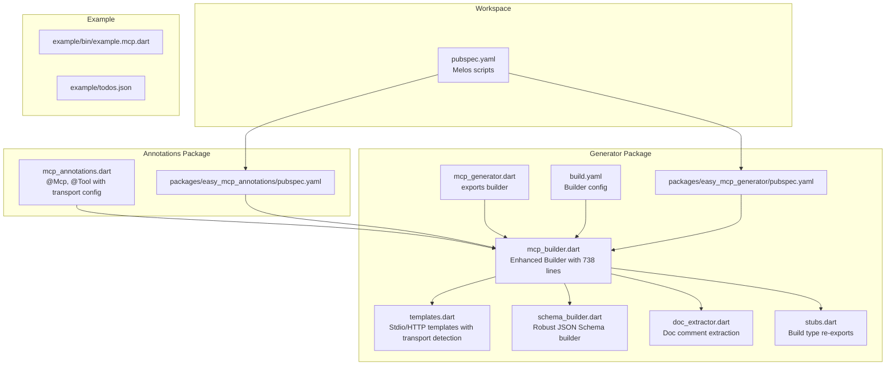
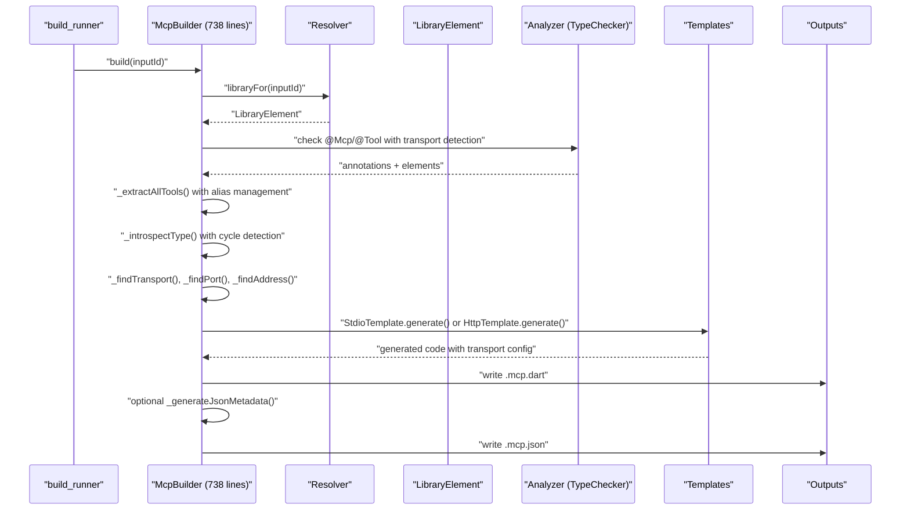
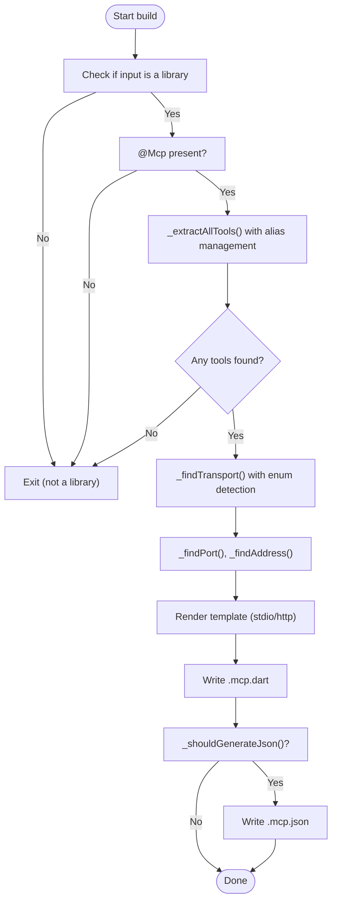
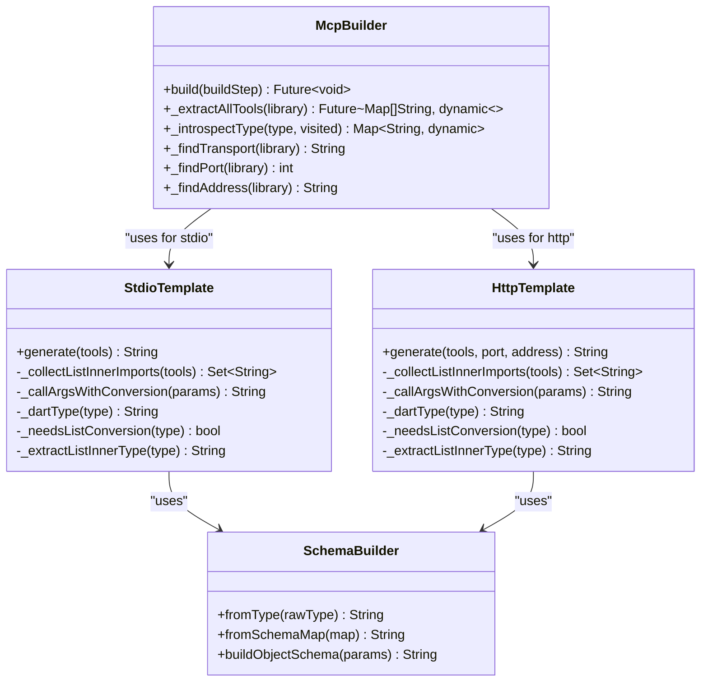
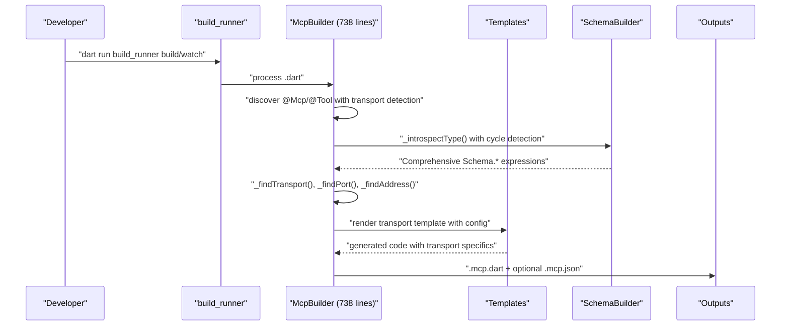
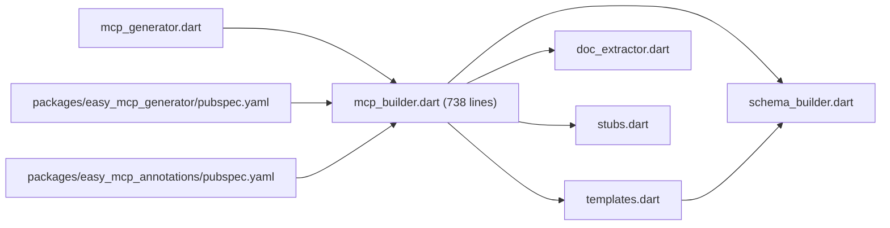

# Code Generation Engine

<cite>
**Referenced Files in This Document**
- [pubspec.yaml](file://pubspec.yaml)
- [packages/easy_mcp_generator/pubspec.yaml](file://packages/easy_mcp_generator/pubspec.yaml)
- [packages/easy_mcp_annotations/pubspec.yaml](file://packages/easy_mcp_annotations/pubspec.yaml)
- [packages/easy_mcp_generator/lib/mcp_generator.dart](file://packages/easy_mcp_generator/lib/mcp_generator.dart)
- [packages/easy_mcp_generator/lib/builder/mcp_builder.dart](file://packages/easy_mcp_generator/lib/builder/mcp_builder.dart)
- [packages/easy_mcp_generator/lib/builder/templates.dart](file://packages/easy_mcp_generator/lib/builder/templates.dart)
- [packages/easy_mcp_generator/lib/builder/schema_builder.dart](file://packages/easy_mcp_generator/lib/builder/schema_builder.dart)
- [packages/easy_mcp_generator/lib/builder/doc_extractor.dart](file://packages/easy_mcp_generator/lib/builder/doc_extractor.dart)
- [packages/easy_mcp_generator/lib/stubs.dart](file://packages/easy_mcp_generator/lib/stubs.dart)
- [packages/easy_mcp_generator/build.yaml](file://packages/easy_mcp_generator/build.yaml)
- [packages/easy_mcp_generator/README.md](file://packages/easy_mcp_generator/README.md)
- [packages/easy_mcp_annotations/lib/mcp_annotations.dart](file://packages/easy_mcp_annotations/lib/mcp_annotations.dart)
</cite>

## Update Summary
**Changes Made**
- Updated McpBuilder class documentation to reflect the extensive rewrite with 738 lines of new functionality
- Enhanced SchemaBuilder documentation to cover robust type conversion capabilities
- Updated template system documentation to include sophisticated transport detection logic
- Added comprehensive coverage of HTTP transport configuration with port and address settings
- Expanded transport detection logic documentation including sophisticated enum handling
- Updated builder architecture to reflect improved AST analysis and annotation processing

## Table of Contents
1. [Introduction](#introduction)
2. [Project Structure](#project-structure)
3. [Core Components](#core-components)
4. [Architecture Overview](#architecture-overview)
5. [Detailed Component Analysis](#detailed-component-analysis)
6. [Dependency Analysis](#dependency-analysis)
7. [Performance Considerations](#performance-considerations)
8. [Troubleshooting Guide](#troubleshooting-guide)
9. [Conclusion](#conclusion)
10. [Appendices](#appendices)

## Introduction
This document explains Easy MCP's build-time code generation engine that transforms annotated Dart libraries into production-ready MCP servers. The engine has been significantly enhanced with a robust SchemaBuilder class for type conversion, sophisticated transport detection logic, and an expanded template system supporting both HTTP and stdio transports. It covers:
- AST analysis using dart:analyzer for robust annotation discovery and metadata extraction
- Template system architecture for generating stdio and HTTP server code with sophisticated transport detection
- Schema builder for JSON Schema generation from Dart types with comprehensive type mapping
- Build extension configuration, watch mode, and integration with build_runner
- End-to-end pipeline from annotation discovery to final server code
- Performance considerations, caching strategies, and debugging techniques
- Extensibility points for custom templates and schema generation rules

## Project Structure
The workspace is a Melos-managed monorepo with three main parts:
- easy_mcp_annotations: Provides @Mcp and @Tool annotations with transport configuration
- easy_mcp_generator: Implements the build_runner builder and templates with enhanced functionality
- example: Demonstrates usage and generated outputs



**Diagram sources**
- [pubspec.yaml:1-64](file://pubspec.yaml#L1-L64)
- [packages/easy_mcp_generator/lib/mcp_generator.dart:1-14](file://packages/easy_mcp_generator/lib/mcp_generator.dart#L1-L14)
- [packages/easy_mcp_generator/lib/builder/mcp_builder.dart:1-738](file://packages/easy_mcp_generator/lib/builder/mcp_builder.dart#L1-L738)
- [packages/easy_mcp_generator/lib/builder/templates.dart:1-630](file://packages/easy_mcp_generator/lib/builder/templates.dart#L1-L630)
- [packages/easy_mcp_generator/lib/builder/schema_builder.dart:1-99](file://packages/easy_mcp_generator/lib/builder/schema_builder.dart#L1-L99)
- [packages/easy_mcp_generator/lib/builder/doc_extractor.dart:1-106](file://packages/easy_mcp_generator/lib/builder/doc_extractor.dart#L1-L106)
- [packages/easy_mcp_generator/lib/stubs.dart:1-7](file://packages/easy_mcp_generator/lib/stubs.dart#L1-L7)
- [packages/easy_mcp_generator/build.yaml:1-12](file://packages/easy_mcp_generator/build.yaml#L1-L12)
- [packages/easy_mcp_annotations/lib/mcp_annotations.dart:1-141](file://packages/easy_mcp_annotations/lib/mcp_annotations.dart#L1-L141)

**Section sources**
- [pubspec.yaml:1-64](file://pubspec.yaml#L1-L64)
- [packages/easy_mcp_generator/build.yaml:1-12](file://packages/easy_mcp_generator/build.yaml#L1-L12)

## Core Components
- **Enhanced Annotations**: @Mcp and @Tool define transport mode, port, address, and tool metadata with comprehensive configuration
- **Expanded Builder**: Scans libraries, discovers tools, builds schemas, and writes outputs with sophisticated transport detection
- **Advanced Templates**: Generate stdio and HTTP server code with transport-specific optimizations and configuration
- **Robust Schema Builder**: Maps Dart types to JSON Schema expressions with comprehensive type handling and object introspection
- **Sophisticated Doc Extractor**: Enhanced doc comment extraction with analyzer integration planned
- **Improved Stubs**: Local re-exports to enable compilation during development

Key responsibilities:
- Annotation discovery via analyzer TypeChecker with enhanced transport detection
- Parameter introspection and comprehensive schema generation with cycle detection
- Import resolution for cross-package tools with alias management
- Sophisticated transport-specific code generation with HTTP configuration
- Optional JSON metadata emission with tool schema generation
- Package URI handling for asset and package URIs
- Advanced type checking for custom classes and nullable types

**Section sources**
- [packages/easy_mcp_annotations/lib/mcp_annotations.dart:7-141](file://packages/easy_mcp_annotations/lib/mcp_annotations.dart#L7-L141)
- [packages/easy_mcp_generator/lib/builder/mcp_builder.dart:27-738](file://packages/easy_mcp_generator/lib/builder/mcp_builder.dart#L27-L738)
- [packages/easy_mcp_generator/lib/builder/templates.dart:1-630](file://packages/easy_mcp_generator/lib/builder/templates.dart#L1-L630)
- [packages/easy_mcp_generator/lib/builder/schema_builder.dart:1-99](file://packages/easy_mcp_generator/lib/builder/schema_builder.dart#L1-L99)
- [packages/easy_mcp_generator/lib/builder/doc_extractor.dart:1-106](file://packages/easy_mcp_generator/lib/builder/doc_extractor.dart#L1-L106)
- [packages/easy_mcp_generator/lib/stubs.dart:1-7](file://packages/easy_mcp_generator/lib/stubs.dart#L1-L7)

## Architecture Overview
The generator is a build_runner Builder that:
- Watches .dart inputs and produces .mcp.dart and optionally .mcp.json outputs
- Uses analyzer to discover @Mcp and @Tool annotations with sophisticated transport detection
- Aggregates tools across the library and its package-local imports with alias management
- Renders transport-specific templates with resolved imports and HTTP configuration
- Emits JSON metadata when configured with comprehensive tool schema generation



**Diagram sources**
- [packages/easy_mcp_generator/lib/builder/mcp_builder.dart:34-77](file://packages/easy_mcp_generator/lib/builder/mcp_builder.dart#L34-L77)
- [packages/easy_mcp_generator/lib/builder/templates.dart:21-189](file://packages/easy_mcp_generator/lib/builder/templates.dart#L21-L189)
- [packages/easy_mcp_generator/lib/builder/templates.dart:311-538](file://packages/easy_mcp_generator/lib/builder/templates.dart#L311-L538)
- [packages/easy_mcp_generator/lib/builder/schema_builder.dart:329-425](file://packages/easy_mcp_generator/lib/builder/schema_builder.dart#L329-L425)

## Detailed Component Analysis

### Enhanced Annotation System (@Mcp and @Tool)
- **@Mcp** defines transport mode (stdio/http), port, address, and whether to emit JSON metadata
- **@Tool** annotates functions/classes with optional description, icons, and execution metadata
- Both are defined in the annotations package and consumed by the enhanced builder

Implementation highlights:
- **Enum McpTransport** controls stdio vs HTTP generation with comprehensive documentation
- **Transport Configuration**: Port (default 3000) and address (default '127.0.0.1') for HTTP transport
- **Tool Support**: Optional metadata; doc comments are used as fallback descriptions
- **Execution Metadata**: Deprecated placeholder for future execution parameter support

**Section sources**
- [packages/easy_mcp_annotations/lib/mcp_annotations.dart:7-141](file://packages/easy_mcp_annotations/lib/mcp_annotations.dart#L7-L141)

### Enhanced Builder and AST Analysis
The McpBuilder integrates analyzer to reliably discover annotations and extract metadata with sophisticated transport detection:
- Uses TypeChecker to locate @Mcp and @Tool with enhanced enum handling
- Walks library units to collect top-level functions and class methods
- Extracts parameter metadata including type, optionality, and comprehensive schema maps
- Resolves package-local imports to aggregate tools across the workspace with alias management
- Determines transport mode, port, and address configuration with sophisticated detection logic
- Handles asset URIs and package URIs for comprehensive import resolution

Key processing steps:
- Library-level checks for @Mcp with transport detection and HTTP configuration extraction
- Per-element checks for @Tool with enhanced description extraction
- Parameter introspection with _introspectType and comprehensive schema generation
- Cross-library import scanning with alias derivation and uniqueness management
- Transport selection (stdio/http) and JSON metadata emission control
- Package URI extraction and asset URI handling for flexible import resolution



**Diagram sources**
- [packages/easy_mcp_generator/lib/builder/mcp_builder.dart:34-77](file://packages/easy_mcp_generator/lib/builder/mcp_builder.dart#L34-L77)
- [packages/easy_mcp_generator/lib/builder/mcp_builder.dart:130-182](file://packages/easy_mcp_generator/lib/builder/mcp_builder.dart#L130-L182)
- [packages/easy_mcp_generator/lib/builder/mcp_builder.dart:559-624](file://packages/easy_mcp_generator/lib/builder/mcp_builder.dart#L559-L624)
- [packages/easy_mcp_generator/lib/builder/mcp_builder.dart:634-734](file://packages/easy_mcp_generator/lib/builder/mcp_builder.dart#L634-L734)

**Section sources**
- [packages/easy_mcp_generator/lib/builder/mcp_builder.dart:27-738](file://packages/easy_mcp_generator/lib/builder/mcp_builder.dart#L27-L738)

### Enhanced Template System Architecture
The generator ships two transport templates with sophisticated configuration handling:
- **StdioTemplate**: JSON-RPC over stdin/stdout with comprehensive tool registration
- **HttpTemplate**: Shelf-based HTTP server with configurable port and address binding

Shared capabilities:
- Imports resolution for custom List inner types and per-tool source imports with alias management
- Parameter extraction and conversion for List<T> with custom inner types
- Dynamic dispatch to original tool methods (static or instance) with proper async handling
- Serialization helpers for results with comprehensive error handling
- Optional per-tool source import aliasing to avoid conflicts
- HTTP-specific features: conditional imports, StreamChannel setup, and response buffering



**Diagram sources**
- [packages/easy_mcp_generator/lib/builder/mcp_builder.dart:27-738](file://packages/easy_mcp_generator/lib/builder/mcp_builder.dart#L27-L738)
- [packages/easy_mcp_generator/lib/builder/templates.dart:15-280](file://packages/easy_mcp_generator/lib/builder/templates.dart#L15-L280)
- [packages/easy_mcp_generator/lib/builder/templates.dart:303-630](file://packages/easy_mcp_generator/lib/builder/templates.dart#L303-L630)
- [packages/easy_mcp_generator/lib/builder/schema_builder.dart:2-99](file://packages/easy_mcp_generator/lib/builder/schema_builder.dart#L2-L99)

**Section sources**
- [packages/easy_mcp_generator/lib/builder/templates.dart:1-630](file://packages/easy_mcp_generator/lib/builder/templates.dart#L1-L630)

### Robust Schema Builder Component
The SchemaBuilder converts Dart types and introspected metadata into comprehensive JSON Schema expressions:
- **Primitive mapping**: String/int/double/bool to JSON Schema types with proper nullable handling
- **Nullable handling**: Strips ? suffix for mapping and handles null types appropriately
- **Lists**: Recursive item schema generation with comprehensive type support
- **Objects**: Property maps with required fields derived from non-nullable fields and cycle detection
- **Custom classes**: Full introspection with field filtering, cycle detection, and comprehensive property mapping
- **DateTime support**: Special handling for DateTime types with date-time format specification
- **Fallback handling**: Defaults to object for unknown/custom types with proper schema generation

```mermaid
flowchart TD
S(["_introspectType(type, visited)"]) --> NullCheck{"Is Null type?"}
NullCheck --> |Yes| RetObj["Return {'type': 'object'}"]
NullCheck --> |No| PrimCheck{"Is primitive?"}
PrimCheck --> |String|int| RetPrim["Return primitive schema"]
PrimCheck --> |double/num| RetNum["Return number schema"]
PrimCheck --> |bool| RetBool["Return boolean schema"]
PrimCheck --> |DateTime| RetDT["Return string with format 'date-time'"]
PrimCheck --> |dynamic| RetDyn["Return object schema"]
PrimCheck --> |List<T>| ListCheck{"Handle List<T>"}
ListCheck --> |Generic| RetList["Return array with items schema"]
ListCheck --> |No args| RetListEmpty["Return empty array schema"]
PrimCheck --> |Custom class| ClassCheck{"Is custom class?"}
ClassCheck --> |Yes| CycleCheck{"Cycle detected?"}
CycleCheck --> |Yes| RetObj2["Return generic object schema"]
CycleCheck --> |No| PropGen["Generate properties map"]
PropGen --> ReqFields["Collect required fields"]
ReqFields --> RetClass["Return object with properties + required"]
ClassCheck --> |No| RetObj3["Return object schema"]
```

**Diagram sources**
- [packages/easy_mcp_generator/lib/builder/mcp_builder.dart:319-425](file://packages/easy_mcp_generator/lib/builder/mcp_builder.dart#L319-L425)
- [packages/easy_mcp_generator/lib/builder/schema_builder.dart:4-27](file://packages/easy_mcp_generator/lib/builder/schema_builder.dart#L4-L27)
- [packages/easy_mcp_generator/lib/builder/schema_builder.dart:29-66](file://packages/easy_mcp_generator/lib/builder/schema_builder.dart#L29-L66)

**Section sources**
- [packages/easy_mcp_generator/lib/builder/schema_builder.dart:1-99](file://packages/easy_mcp_generator/lib/builder/schema_builder.dart#L1-L99)

### Enhanced Build Extension Configuration and Integration
- **build.yaml** registers mcpBuilder with build extensions .dart -> [.mcp.dart, .mcp.json]
- **auto_apply: dependents** ensures downstream packages pick up generated code
- **build_to: source** emits outputs alongside source files
- The builder targets the generator package and uses local stubs for compilation
- Enhanced integration with build_runner for comprehensive code generation orchestration

Integration with build_runner:
- Scripts in the workspace root demonstrate build, watch, and clean commands
- The generator depends on build_runner for orchestration with enhanced builder factory support
- Comprehensive error handling and logging for debugging code generation issues

**Section sources**
- [packages/easy_mcp_generator/build.yaml:1-12](file://packages/easy_mcp_generator/build.yaml#L1-L12)
- [pubspec.yaml:35-38](file://pubspec.yaml#L35-L38)
- [packages/easy_mcp_generator/lib/stubs.dart:1-7](file://packages/easy_mcp_generator/lib/stubs.dart#L1-L7)

### Enhanced End-to-End Pipeline
From annotated code to generated server with sophisticated transport configuration:
1. Developer adds @Mcp and @Tool annotations with transport configuration
2. build_runner triggers mcpBuilder for affected libraries with enhanced detection
3. Builder resolves library and imports, discovers tools with alias management
4. Parameters are introspected with comprehensive schema building and cycle detection
5. Templates render stdio or HTTP server code with transport-specific optimizations
6. Optional JSON metadata emitted for tool schemas with comprehensive tool listing
7. Generated files placed next to source with proper import resolution



**Diagram sources**
- [packages/easy_mcp_generator/lib/builder/mcp_builder.dart:34-77](file://packages/easy_mcp_generator/lib/builder/mcp_builder.dart#L34-L77)
- [packages/easy_mcp_generator/lib/builder/templates.dart:21-189](file://packages/easy_mcp_generator/lib/builder/templates.dart#L21-L189)
- [packages/easy_mcp_generator/lib/builder/templates.dart:311-538](file://packages/easy_mcp_generator/lib/builder/templates.dart#L311-L538)
- [packages/easy_mcp_generator/lib/builder/schema_builder.dart:329-425](file://packages/easy_mcp_generator/lib/builder/schema_builder.dart#L329-L425)

## Dependency Analysis
External dependencies and their roles:
- **analyzer**: AST parsing and annotation discovery with enhanced enum handling
- **build**: build_runner integration and BuildStep APIs with comprehensive builder support
- **source_gen**: code generation utilities with enhanced template processing
- **code_builder**: programmatic Dart code construction with sophisticated template rendering
- **json_annotation**: JSON serialization support with comprehensive schema generation
- **shelf**: HTTP transport template with configurable port and address binding
- **dart_mcp**: runtime server framework with comprehensive transport support
- **stream_channel**: HTTP transport template with bidirectional communication support

Internal relationships:
- mcp_generator exports the enhanced builder
- mcp_builder depends on templates and schema_builder with comprehensive functionality
- templates depend on schema_builder with sophisticated type conversion
- doc_extractor is a placeholder for future analyzer integration with enhanced capabilities



**Diagram sources**
- [packages/easy_mcp_generator/lib/builder/mcp_builder.dart:1-11](file://packages/easy_mcp_generator/lib/builder/mcp_builder.dart#L1-L11)
- [packages/easy_mcp_generator/lib/builder/templates.dart:1-3](file://packages/easy_mcp_generator/lib/builder/templates.dart#L1-L3)
- [packages/easy_mcp_generator/lib/builder/schema_builder.dart:1-2](file://packages/easy_mcp_generator/lib/builder/schema_builder.dart#L1-L2)
- [packages/easy_mcp_generator/lib/builder/doc_extractor.dart:1-2](file://packages/easy_mcp_generator/lib/builder/doc_extractor.dart#L1-L2)
- [packages/easy_mcp_generator/lib/stubs.dart:1-6](file://packages/easy_mcp_generator/lib/stubs.dart#L1-L6)
- [packages/easy_mcp_generator/lib/mcp_generator.dart:11](file://packages/easy_mcp_generator/lib/mcp_generator.dart#L11)
- [packages/easy_mcp_generator/pubspec.yaml:10-18](file://packages/easy_mcp_generator/pubspec.yaml#L10-L18)
- [packages/easy_mcp_annotations/pubspec.yaml:11-13](file://packages/easy_mcp_annotations/pubspec.yaml#L11-L13)

**Section sources**
- [packages/easy_mcp_generator/pubspec.yaml:10-18](file://packages/easy_mcp_generator/pubspec.yaml#L10-L18)
- [packages/easy_mcp_annotations/pubspec.yaml:11-13](file://packages/easy_mcp_annotations/pubspec.yaml#L11-L13)

## Performance Considerations
- **AST traversal cost**: Analyzer walks library units; keep libraries modular to limit scan scope with enhanced import filtering
- **Cross-import aggregation**: Scanning imported libraries increases work; restrict to package-local imports with sophisticated URI filtering
- **Schema recursion**: Custom class introspection uses cycle detection; avoid deeply nested cycles with comprehensive cycle prevention
- **Template rendering**: String concatenation is efficient; avoid excessive repeated computations inside loops with optimized template generation
- **Output granularity**: .mcp.dart and .mcp.json are small; ensure incremental builds by relying on build_runner with enhanced caching
- **Caching**: build_runner caches previous outputs; use --delete-conflicting-outputs to prevent stale artifacts with comprehensive invalidation
- **Watch mode**: Use --watch to regenerate on change; monitor memory usage in large projects with enhanced incremental processing
- **Transport detection**: Enum handling and HTTP configuration extraction are optimized for performance with minimal overhead
- **Package URI handling**: Asset and package URI processing is optimized for different URI schemes with efficient parsing

## Troubleshooting Guide
Common issues and remedies:
- **No generated files**:
  - Verify @Mcp annotation presence in the library with enhanced transport detection
  - Confirm build_runner is invoked and build.yaml is effective with proper builder configuration
- **Missing tools**:
  - Ensure @Tool annotations are on callable members with proper parameter introspection
  - Check that tools are in package-local imports (only those under the same package are scanned) with enhanced import resolution
- **Incorrect schemas**:
  - Review parameter types; nullable types are handled by stripping ? with comprehensive type checking
  - For List<T>, ensure inner types are serializable or use supported primitives with enhanced type validation
- **Transport mismatch**:
  - Confirm @Mcp.transport matches stdio/http expectations with sophisticated enum detection
  - Verify HTTP configuration (port/address) in @Mcp annotation with proper validation
- **JSON metadata not generated**:
  - Ensure @Mcp.generateJson is true with comprehensive boolean checking
  - Check that tools have proper descriptions and parameters with enhanced metadata extraction
- **Debugging generated code**:
  - Inspect .mcp.dart and .mcp.json outputs with comprehensive schema validation
  - Temporarily add logging in templates or builder for visibility with enhanced debugging support
  - Use build_runner --verbose for detailed logs with comprehensive error reporting
- **Transport-specific issues**:
  - For HTTP transport, verify port availability and address accessibility with enhanced network configuration
  - Check StreamChannel setup and response buffering with comprehensive error handling
  - Validate asset URI handling for different package schemes with proper URI parsing

**Section sources**
- [packages/easy_mcp_generator/lib/builder/mcp_builder.dart:484-557](file://packages/easy_mcp_generator/lib/builder/mcp_builder.dart#L484-L557)
- [packages/easy_mcp_generator/lib/builder/mcp_builder.dart:634-734](file://packages/easy_mcp_generator/lib/builder/mcp_builder.dart#L634-L734)
- [packages/easy_mcp_generator/README.md:56-76](file://packages/easy_mcp_generator/README.md#L56-L76)

## Conclusion
Easy MCP's code generation engine has been significantly enhanced with a robust SchemaBuilder class, sophisticated transport detection logic, and comprehensive template system supporting both HTTP and stdio transports. The 738-line McpBuilder class provides extensive functionality for annotation discovery, parameter introspection, and transport-specific code generation. By leveraging enhanced analyzer integration for annotation discovery, comprehensive Dart-to-JSON Schema mapping with cycle detection, and flexible transport configuration, it enables rapid prototyping and production deployment of MCP servers. The modular design allows extension through custom templates and schema rules while maintaining strong defaults for common use cases.

## Appendices

### Extensibility Points
- **Custom templates**:
  - Add new template classes similar to StdioTemplate/HttpTemplate with transport-specific optimizations
  - Implement generate(tools, options) and reuse SchemaBuilder with comprehensive type conversion
  - Support additional transport modes with sophisticated configuration handling
- **Custom schema rules**:
  - Extend SchemaBuilder.withCustomRules() or compose new builders with enhanced type mapping
  - Override type mapping for domain-specific types with comprehensive validation
  - Add support for additional Dart types with proper JSON Schema generation
- **Enhanced doc extraction**:
  - Replace DocExtractor with analyzer-based comment parsing with comprehensive AST integration
  - Support advanced documentation extraction with enhanced metadata processing
- **Additional transports**:
  - Implement transport-specific handlers and channel wiring in new templates with sophisticated configuration
  - Add WebSocket, TCP, or other transport protocols with proper connection management
- **Enhanced builder functionality**:
  - Extend McpBuilder with additional annotation processing and validation
  - Add support for more complex type hierarchies and schema generation scenarios
  - Implement advanced caching and incremental build optimization

**Section sources**
- [packages/easy_mcp_generator/lib/builder/templates.dart:15-280](file://packages/easy_mcp_generator/lib/builder/templates.dart#L15-L280)
- [packages/easy_mcp_generator/lib/builder/templates.dart:303-630](file://packages/easy_mcp_generator/lib/builder/templates.dart#L303-L630)
- [packages/easy_mcp_generator/lib/builder/schema_builder.dart:1-99](file://packages/easy_mcp_generator/lib/builder/schema_builder.dart#L1-L99)
- [packages/easy_mcp_generator/lib/builder/doc_extractor.dart:72-105](file://packages/easy_mcp_generator/lib/builder/doc_extractor.dart#L72-L105)
- [packages/easy_mcp_generator/lib/builder/mcp_builder.dart:27-738](file://packages/easy_mcp_generator/lib/builder/mcp_builder.dart#L27-L738)