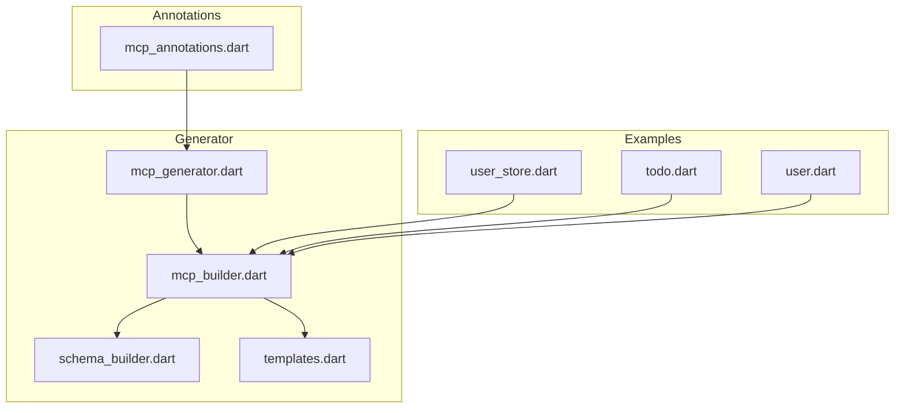
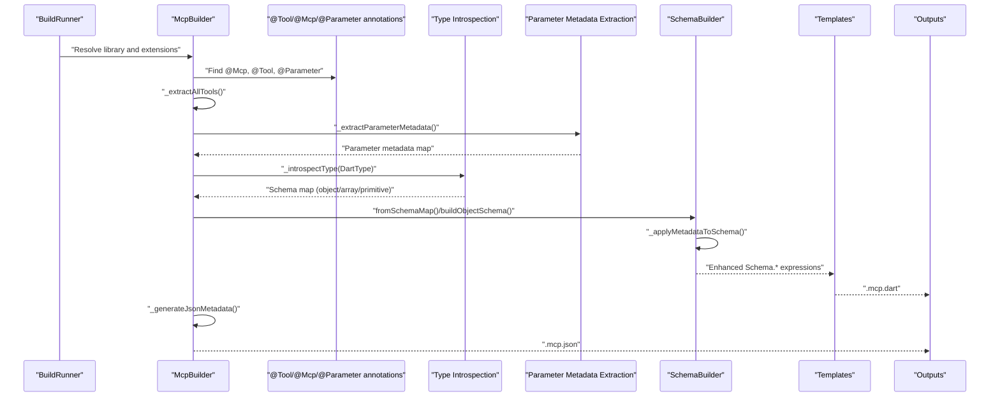
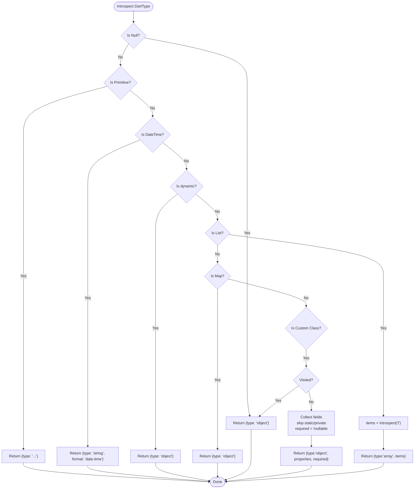
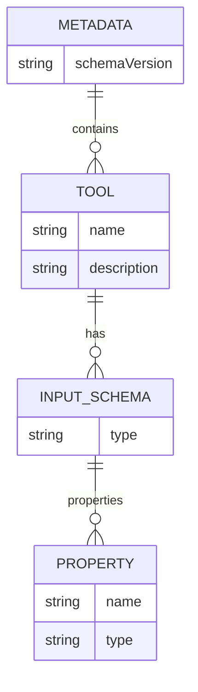
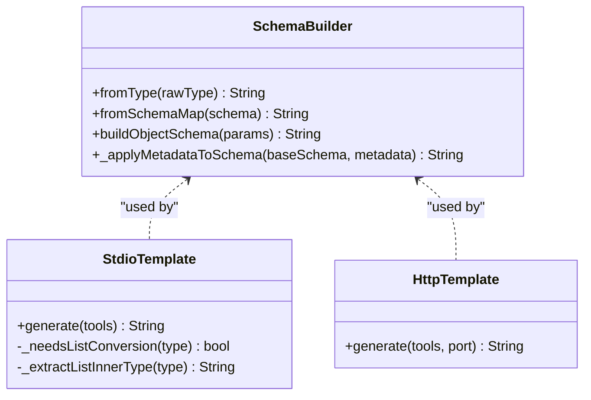
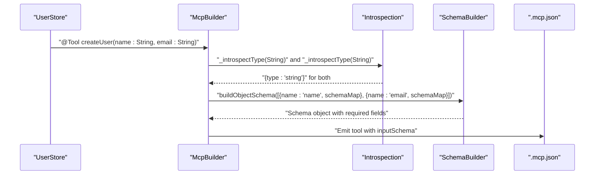
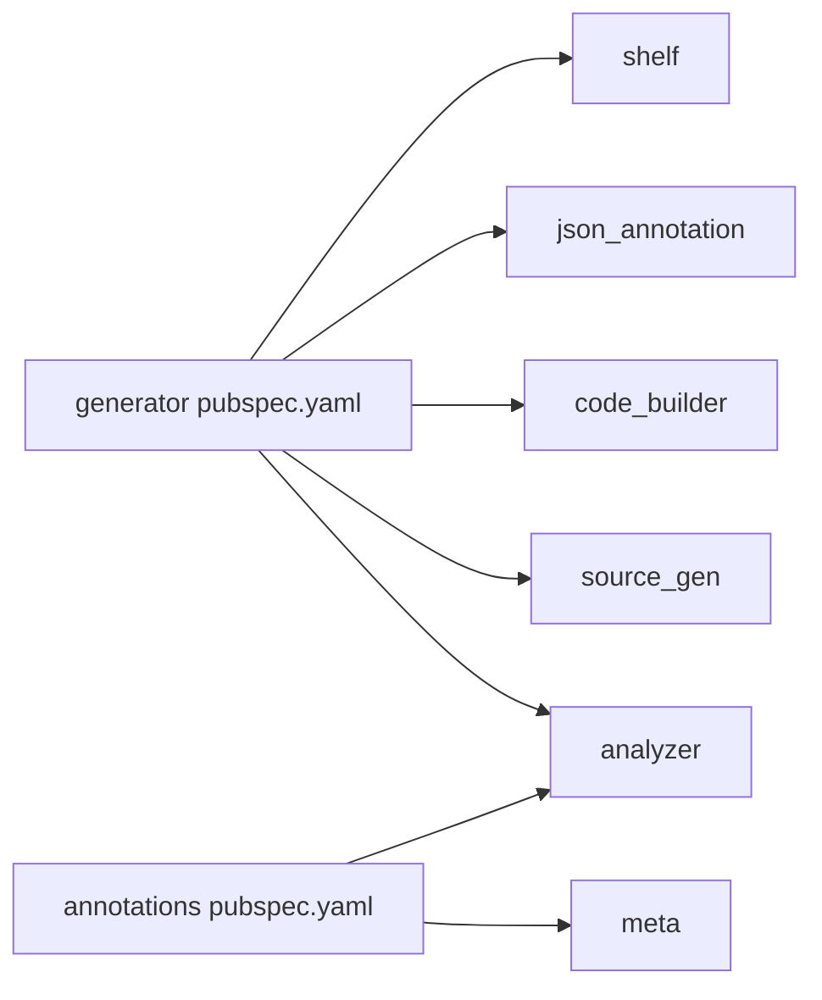

# Schema Generation

<cite>
**Referenced Files in This Document**
- [mcp_annotations.dart](file://packages/easy_mcp_annotations/lib/mcp_annotations.dart)
- [mcp_generator.dart](file://packages/easy_mcp_generator/lib/mcp_generator.dart)
- [mcp_builder.dart](file://packages/easy_mcp_generator/lib/builder/mcp_builder.dart)
- [schema_builder.dart](file://packages/easy_mcp_generator/lib/builder/schema_builder.dart)
- [templates.dart](file://packages/easy_mcp_generator/lib/builder/templates.dart)
- [user_store.dart](file://example/lib/src/user_store.dart)
- [todo.dart](file://example/lib/src/todo.dart)
- [user.dart](file://example/lib/src/user.dart)
- [pubspec.yaml](file://packages/easy_mcp_generator/pubspec.yaml)
- [pubspec.yaml](file://packages/easy_mcp_annotations/pubspec.yaml)
</cite>

## Update Summary
**Changes Made**
- Added comprehensive documentation for @Parameter annotation metadata integration
- Updated SchemaBuilder section to cover enhanced metadata application
- Added new section on Parameter annotation metadata extraction and application
- Enhanced examples showing practical usage of @Parameter annotations
- Updated architecture diagrams to reflect metadata flow

## Table of Contents
1. [Introduction](#introduction)
2. [Project Structure](#project-structure)
3. [Core Components](#core-components)
4. [Architecture Overview](#architecture-overview)
5. [Detailed Component Analysis](#detailed-component-analysis)
6. [Parameter Annotation Metadata System](#parameter-annotation-metadata-system)
7. [Dependency Analysis](#dependency-analysis)
8. [Performance Considerations](#performance-considerations)
9. [Troubleshooting Guide](#troubleshooting-guide)
10. [Conclusion](#conclusion)
11. [Appendices](#appendices)

## Introduction
This document explains the JSON Schema generation subsystem responsible for automatically constructing JSON Schemas from Dart types. It covers how the generator performs type introspection, maps Dart primitives and generics to JSON Schema equivalents, detects cycles in object graphs, and produces both a Dart-side schema representation and a JSON metadata file consumed by MCP clients. The system now incorporates rich metadata from @Parameter annotations to enhance schema descriptions with titles, descriptions, validation constraints, patterns, and enum values. It also documents required field detection, optional parameter handling, collection and nullable type support, and practical guidance for customization, versioning, backward compatibility, and performance.

## Project Structure
The schema generation capability spans two packages:
- easy_mcp_annotations: Defines annotations that drive code generation and optional JSON metadata emission.
- easy_mcp_generator: Implements the build-time generator that extracts tool metadata, introspects Dart types, builds JSON Schemas, and writes both Dart and JSON artifacts.

Key files:
- Annotations: packages/easy_mcp_annotations/lib/mcp_annotations.dart
- Generator entrypoint: packages/easy_mcp_generator/lib/mcp_generator.dart
- Core builder: packages/easy_mcp_generator/lib/builder/mcp_builder.dart
- Schema builder: packages/easy_mcp_generator/lib/builder/schema_builder.dart
- Templates: packages/easy_mcp_generator/lib/builder/templates.dart
- Examples: example/lib/src/user_store.dart, example/lib/src/todo.dart, example/lib/src/user.dart



**Diagram sources**
- [mcp_annotations.dart:1-241](file://packages/easy_mcp_annotations/lib/mcp_annotations.dart#L1-L241)
- [mcp_generator.dart:1-14](file://packages/easy_mcp_generator/lib/mcp_generator.dart#L1-L14)
- [mcp_builder.dart:1-834](file://packages/easy_mcp_generator/lib/builder/mcp_builder.dart#L1-L834)
- [schema_builder.dart:1-199](file://packages/easy_mcp_generator/lib/builder/schema_builder.dart#L1-L199)
- [templates.dart:1-630](file://packages/easy_mcp_generator/lib/builder/templates.dart#L1-L630)
- [user_store.dart:1-158](file://example/lib/src/user_store.dart#L1-L158)
- [todo.dart:1-46](file://example/lib/src/todo.dart#L1-L46)
- [user.dart:1-42](file://example/lib/src/user.dart#L1-L42)

**Section sources**
- [mcp_generator.dart:1-14](file://packages/easy_mcp_generator/lib/mcp_generator.dart#L1-L14)
- [mcp_builder.dart:1-834](file://packages/easy_mcp_generator/lib/builder/mcp_builder.dart#L1-L834)
- [schema_builder.dart:1-199](file://packages/easy_mcp_generator/lib/builder/schema_builder.dart#L1-L199)
- [templates.dart:1-630](file://packages/easy_mcp_generator/lib/builder/templates.dart#L1-L630)
- [mcp_annotations.dart:1-241](file://packages/easy_mcp_annotations/lib/mcp_annotations.dart#L1-L241)

## Core Components
- Annotations: Provide configuration for transport and JSON metadata generation, including rich parameter metadata through @Parameter annotations.
- McpBuilder: Extracts tools, introspects parameter types, extracts @Parameter metadata, builds schema maps, and emits .mcp.dart and .mcp.json outputs.
- SchemaBuilder: Translates schema maps into dart_mcp Schema.* expressions for code generation, with enhanced metadata application from @Parameter annotations.
- Templates: Generate server code and embed the built schemas; also handle list conversion for custom inner types.

Key responsibilities:
- Type introspection and schema map construction
- Parameter metadata extraction and enhancement
- Required vs optional field detection
- Nullable and collection handling
- Cycle detection for complex object graphs
- JSON metadata emission and versioning

**Section sources**
- [mcp_annotations.dart:142-240](file://packages/easy_mcp_annotations/lib/mcp_annotations.dart#L142-L240)
- [mcp_builder.dart:243-369](file://packages/easy_mcp_generator/lib/builder/mcp_builder.dart#L243-L369)
- [schema_builder.dart:29-199](file://packages/easy_mcp_generator/lib/builder/schema_builder.dart#L29-L199)
- [templates.dart:29-42](file://packages/easy_mcp_generator/lib/builder/templates.dart#L29-L42)

## Architecture Overview
The generator runs during build time and targets libraries annotated with @Mcp. It scans for @Tool-annotated methods, extracts parameter metadata including @Parameter annotations, performs deep type introspection, and produces:
- A Dart file (.mcp.dart) registering tools with their enhanced input schemas
- A JSON metadata file (.mcp.json) with schemaVersion and tool definitions



**Diagram sources**
- [mcp_builder.dart:243-369](file://packages/easy_mcp_generator/lib/builder/mcp_builder.dart#L243-L369)
- [mcp_builder.dart:552-578](file://packages/easy_mcp_generator/lib/builder/mcp_builder.dart#L552-L578)
- [mcp_builder.dart:309-411](file://packages/easy_mcp_generator/lib/builder/mcp_builder.dart#L309-L411)
- [schema_builder.dart:110-187](file://packages/easy_mcp_generator/lib/builder/schema_builder.dart#L110-L187)
- [templates.dart:29-42](file://packages/easy_mcp_generator/lib/builder/templates.dart#L29-L42)

## Detailed Component Analysis

### Type Introspection and Schema Construction
The introspection engine converts Dart types into JSON Schema-like maps with cycle detection and required field inference.

Highlights:
- Primitive mapping: int → integer, double/num → number, String → string, bool → boolean, DateTime → string with date-time format.
- Collections: List<T> → array with items schema derived from T; Map<K,V> → object.
- Custom classes: Recursively build properties map; skip static/private fields; infer required fields from non-nullable types without defaults.
- Nullability: Nullable types are unwrapped for introspection; the final schema marks fields as required based on non-nullability.
- Cycles: Track visited type names; if revisited, emit a generic object to prevent infinite recursion.



**Diagram sources**
- [mcp_builder.dart:309-411](file://packages/easy_mcp_generator/lib/builder/mcp_builder.dart#L309-L411)

**Section sources**
- [mcp_builder.dart:309-411](file://packages/easy_mcp_generator/lib/builder/mcp_builder.dart#L309-L411)

### Required Field Detection and Optional Parameter Handling
- Required fields: Derived from non-nullable Dart fields (no trailing ?) and absence of default values.
- Optional parameters: Determined by the parameter's isOptional flag; in the final schema, optional parameters are not included in the required list.
- Named vs positional: Named parameters are supported; the template code extracts arguments accordingly.

Practical implications:
- Fields typed as T? are treated as optional in the schema.
- Parameters without defaults are required; named parameters are supported.

**Section sources**
- [mcp_builder.dart:376-403](file://packages/easy_mcp_generator/lib/builder/mcp_builder.dart#L376-L403)
- [mcp_builder.dart:234-256](file://packages/easy_mcp_generator/lib/builder/mcp_builder.dart#L234-L256)
- [templates.dart:50-62](file://packages/easy_mcp_generator/lib/builder/templates.dart#L50-L62)

### Collections, Nested Objects, and Nullable Types
- Arrays: List<T> mapped to JSON Schema arrays; items schema derived recursively.
- Objects: Custom classes mapped to objects with properties and required arrays.
- Maps: Mapped to generic objects.
- Nullables: Handled by unwrapping for introspection; final schema reflects required/optional based on nullability.
- DateTime: Special-cased to string with date-time format.

**Section sources**
- [mcp_builder.dart:342-357](file://packages/easy_mcp_generator/lib/builder/mcp_builder.dart#L342-L357)
- [mcp_builder.dart:331-335](file://packages/easy_mcp_generator/lib/builder/mcp_builder.dart#L331-L335)
- [mcp_builder.dart:312-315](file://packages/easy_mcp_generator/lib/builder/mcp_builder.dart#L312-L315)

### Cycle Detection Mechanism
To avoid infinite recursion in self-referential or mutually referencing types:
- Maintain a visited set of type names during introspection.
- If a type is encountered again, return a generic object schema instead of recursing further.

This ensures termination and produces a safe, valid schema even for complex graphs.

**Section sources**
- [mcp_builder.dart:363-366](file://packages/easy_mcp_generator/lib/builder/mcp_builder.dart#L363-L366)
- [mcp_builder.dart:309-369](file://packages/easy_mcp_generator/lib/builder/mcp_builder.dart#L309-L369)

### Schema Validation Rules and JSON Metadata
- JSON metadata includes a schemaVersion and a tools array.
- Each tool defines an inputSchema with properties and required arrays.
- The generator derives required fields from parameter and field nullability.



**Diagram sources**
- [mcp_builder.dart:552-578](file://packages/easy_mcp_generator/lib/builder/mcp_builder.dart#L552-L578)

**Section sources**
- [mcp_builder.dart:552-578](file://packages/easy_mcp_generator/lib/builder/mcp_builder.dart#L552-L578)

### Dart-to-Schema Mapping and Template Integration
- SchemaBuilder translates schema maps into dart_mcp Schema.* expressions.
- Templates embed these expressions into generated server code and handle list conversions for custom inner types.



**Diagram sources**
- [schema_builder.dart:1-199](file://packages/easy_mcp_generator/lib/builder/schema_builder.dart#L1-L199)
- [templates.dart:29-42](file://packages/easy_mcp_generator/lib/builder/templates.dart#L29-L42)
- [templates.dart:269-296](file://packages/easy_mcp_generator/lib/builder/templates.dart#L269-L296)

**Section sources**
- [schema_builder.dart:29-199](file://packages/easy_mcp_generator/lib/builder/schema_builder.dart#L29-L199)
- [templates.dart:29-42](file://packages/easy_mcp_generator/lib/builder/templates.dart#L29-L42)
- [templates.dart:269-296](file://packages/easy_mcp_generator/lib/builder/templates.dart#L269-L296)

### Example: Tool Parameter Introspection and Schema Emission
The example demonstrates how a tool with typed parameters is processed:
- A tool method is annotated with @Tool.
- The builder extracts parameters, computes schema maps, and emits both Dart registration and JSON metadata.



**Diagram sources**
- [user_store.dart:51-72](file://example/lib/src/user_store.dart#L51-L72)
- [mcp_builder.dart:229-259](file://packages/easy_mcp_generator/lib/builder/mcp_builder.dart#L229-L259)
- [mcp_builder.dart:552-578](file://packages/easy_mcp_generator/lib/builder/mcp_builder.dart#L552-L578)
- [schema_builder.dart:68-108](file://packages/easy_mcp_generator/lib/builder/schema_builder.dart#L68-L108)

**Section sources**
- [user_store.dart:51-72](file://example/lib/src/user_store.dart#L51-L72)
- [mcp_builder.dart:229-259](file://packages/easy_mcp_generator/lib/builder/mcp_builder.dart#L229-L259)
- [mcp_builder.dart:552-578](file://packages/easy_mcp_generator/lib/builder/mcp_builder.dart#L552-L578)
- [schema_builder.dart:68-108](file://packages/easy_mcp_generator/lib/builder/schema_builder.dart#L68-L108)

## Parameter Annotation Metadata System

### Parameter Annotation Overview
The @Parameter annotation provides rich metadata for individual parameters in MCP tools, enabling enhanced schema generation with human-readable titles, descriptions, validation constraints, and examples.

### Supported Metadata Fields
The @Parameter annotation supports the following metadata fields:

- **title**: Human-readable title displayed in MCP clients (replaces parameter name)
- **description**: Detailed description explaining parameter purpose and usage
- **example**: Example value to guide users and help LLMs understand expected format
- **minimum/maximum**: Numeric validation constraints for int and double types
- **pattern**: Regular expression pattern for string validation
- **sensitive**: Boolean flag marking sensitive parameters (passwords, API keys)
- **enumValues**: List of allowed values for enum-like parameters

### Metadata Extraction Process
The McpBuilder extracts @Parameter metadata through the `_extractParameterMetadata` method:

1. **Annotation Detection**: Uses TypeChecker to find @Parameter annotations on formal parameters
2. **Constant Reader**: Extracts metadata values using ConstantReader
3. **Type Safety**: Validates and converts values to appropriate Dart types
4. **Metadata Collection**: Builds a structured metadata map for schema enhancement

### Schema Enhancement Application
The SchemaBuilder applies extracted metadata through the `_applyMetadataToSchema` method:

1. **Schema Type Matching**: Identifies simple primitive schemas (string, int, number, bool)
2. **Metadata Augmentation**: Adds title, description, examples, validation constraints
3. **Complex Schema Preservation**: Leaves complex schemas (objects, arrays) unchanged
4. **String Escaping**: Properly escapes special characters in metadata values

### Practical Usage Examples
The example demonstrates real-world usage of @Parameter annotations:

```dart
@Tool(description: 'Create a new user')
static Future<User> createUser({
  @Parameter(
    title: 'Full Name',
    description: 'The user\'s full name (1-100 characters)',
    example: 'John Doe',
  )
  required String name,
  
  @Parameter(
    title: 'Email Address',
    description: 'A valid email address for the user',
    example: 'john.doe@example.com',
    pattern: r'^[\w\.-]+@[\w\.-]+\.\w+$',
  )
  required String email,
})
```

### Metadata Flow Architecture


**Diagram sources**
- [mcp_builder.dart:285-369](file://packages/easy_mcp_generator/lib/builder/mcp_builder.dart#L285-L369)
- [schema_builder.dart:110-187](file://packages/easy_mcp_generator/lib/builder/schema_builder.dart#L110-L187)

**Section sources**
- [mcp_annotations.dart:142-240](file://packages/easy_mcp_annotations/lib/mcp_annotations.dart#L142-L240)
- [mcp_builder.dart:285-369](file://packages/easy_mcp_generator/lib/builder/mcp_builder.dart#L285-L369)
- [schema_builder.dart:110-187](file://packages/easy_mcp_generator/lib/builder/schema_builder.dart#L110-L187)
- [user_store.dart:52-72](file://example/lib/src/user_store.dart#L52-L72)

## Dependency Analysis
External dependencies influencing schema generation:
- analyzer: Provides Dart element and type analysis used by the builder.
- source_gen: Enables source generation and annotation processing.
- code_builder: Used by templates to generate Dart code.
- json_annotation: Supports JSON serialization patterns (referenced in generator pubspec).
- shelf: Used by HTTP template for server scaffolding.



**Diagram sources**
- [pubspec.yaml:10-18](file://packages/easy_mcp_generator/pubspec.yaml#L10-L18)
- [pubspec.yaml:11-13](file://packages/easy_mcp_annotations/pubspec.yaml#L11-L13)

**Section sources**
- [pubspec.yaml:10-18](file://packages/easy_mcp_generator/pubspec.yaml#L10-L18)
- [pubspec.yaml:11-13](file://packages/easy_mcp_annotations/pubspec.yaml#L11-L13)

## Performance Considerations
- Complexity of introspection scales with the depth and breadth of object graphs. Cycle detection prevents exponential blowup.
- For large schemas, consider minimizing deeply nested structures or flattening where feasible.
- Avoid excessive use of generic collections with unknown inner types to keep schemas precise.
- Keep the number of tools and parameters manageable to reduce build-time overhead.
- **Updated**: Parameter metadata extraction adds minimal overhead as it only processes annotated parameters.

## Troubleshooting Guide
Common issues and remedies:
- Missing JSON metadata: Ensure the library has @Mcp with generateJson enabled and that the library is processed by the builder.
- Incorrect required fields: Verify parameter and field nullability; optional parameters and nullable fields are not marked required.
- Infinite recursion in schemas: Self-referential types are handled by cycle detection; if unexpected, review type relationships.
- Custom list inner types: For List<T> where T is a custom class, ensure imports are present so the template can convert items using fromJson.
- **Updated**: Parameter metadata not appearing: Ensure @Parameter annotations are properly imported and applied to formal parameters, not local variables.

**Section sources**
- [mcp_builder.dart:492-513](file://packages/easy_mcp_generator/lib/builder/mcp_builder.dart#L492-L513)
- [mcp_builder.dart:363-366](file://packages/easy_mcp_generator/lib/builder/mcp_builder.dart#L363-L366)
- [templates.dart:192-207](file://packages/easy_mcp_generator/lib/builder/templates.dart#L192-L207)
- [templates.dart:328-341](file://packages/easy_mcp_generator/lib/builder/templates.dart#L328-L341)
- [mcp_builder.dart:285-369](file://packages/easy_mcp_generator/lib/builder/mcp_builder.dart#L285-L369)

## Conclusion
The JSON Schema generation subsystem provides robust, automated schema construction from Dart types with enhanced metadata support. It supports primitives, generics, nullable types, collections, and custom classes while guarding against cycles. The new @Parameter annotation integration adds rich human-readable metadata, validation constraints, and examples directly to generated schemas. It emits both Dart registration code and a JSON metadata file with schemaVersion and tool definitions, enabling clients to validate inputs, understand parameter requirements, and discover capabilities with comprehensive contextual information.

## Appendices

### Schema Versioning and Backward Compatibility
- The emitted JSON metadata includes a schemaVersion field. Increment this field when introducing breaking changes to tool signatures or schema structures.
- Maintain backward-compatible additions (new optional fields) to preserve compatibility with older clients.

**Section sources**
- [mcp_builder.dart:577-577](file://packages/easy_mcp_generator/lib/builder/mcp_builder.dart#L577-L577)

### Customization and Extension Patterns
- Customize tool descriptions and icons via @Tool annotations.
- Enhance parameter schemas with @Parameter annotations for improved user experience.
- Extend schemas by adding explicit serialization logic in custom classes (e.g., toJson/fromJson) to influence the shape of nested objects.
- For complex nested structures, consider flattening or introducing intermediate DTOs to simplify schemas.
- **Updated**: Leverage @Parameter metadata for validation constraints, examples, and user guidance.

**Section sources**
- [mcp_annotations.dart:142-240](file://packages/easy_mcp_annotations/lib/mcp_annotations.dart#L142-L240)
- [todo.dart:14-28](file://example/lib/src/todo.dart#L14-L28)
- [user.dart:14-28](file://example/lib/src/user.dart#L14-L28)
- [user_store.dart:52-72](file://example/lib/src/user_store.dart#L52-L72)

### Parameter Metadata Best Practices
- Use descriptive titles that replace parameter names in UI contexts
- Provide clear, concise descriptions explaining parameter purpose and constraints
- Include realistic examples that demonstrate expected input formats
- Apply numeric constraints (minimum/maximum) for quantitative parameters
- Use regex patterns for string validation (email addresses, IDs, etc.)
- Mark sensitive parameters (passwords, API keys) with the sensitive flag
- Define enum values for restricted choice parameters

**Section sources**
- [mcp_annotations.dart:175-240](file://packages/easy_mcp_annotations/lib/mcp_annotations.dart#L175-L240)
- [user_store.dart:52-72](file://example/lib/src/user_store.dart#L52-L72)