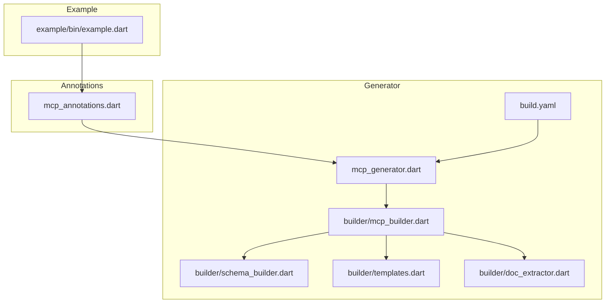
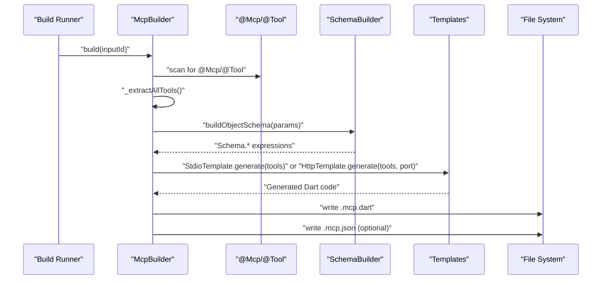
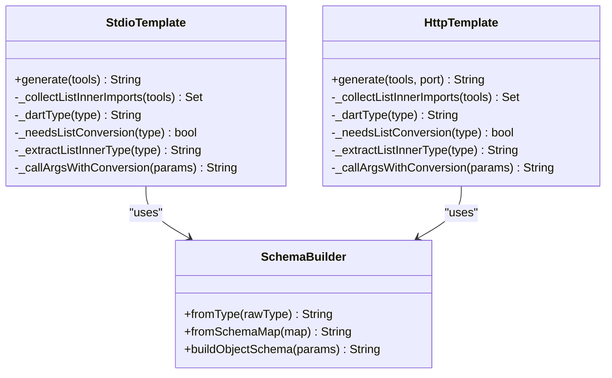
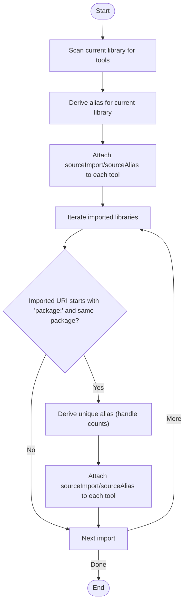
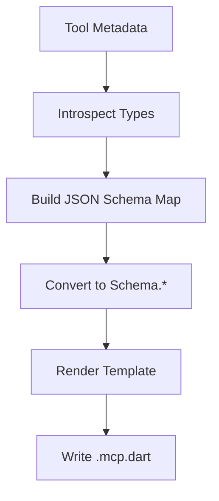
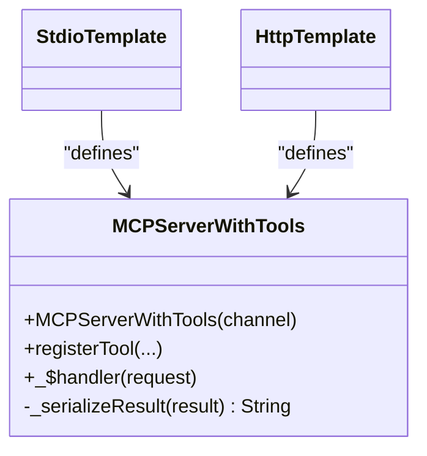
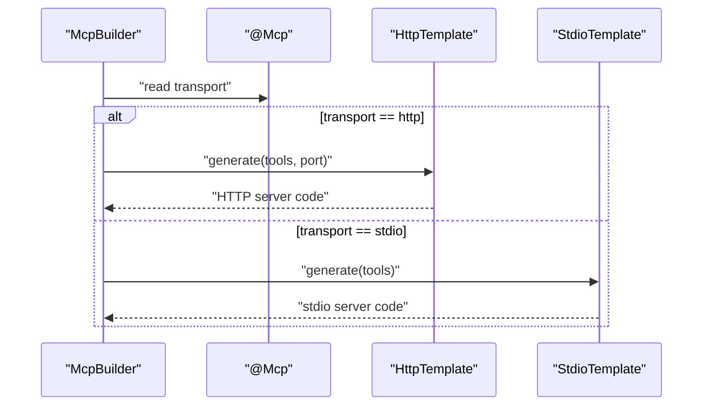
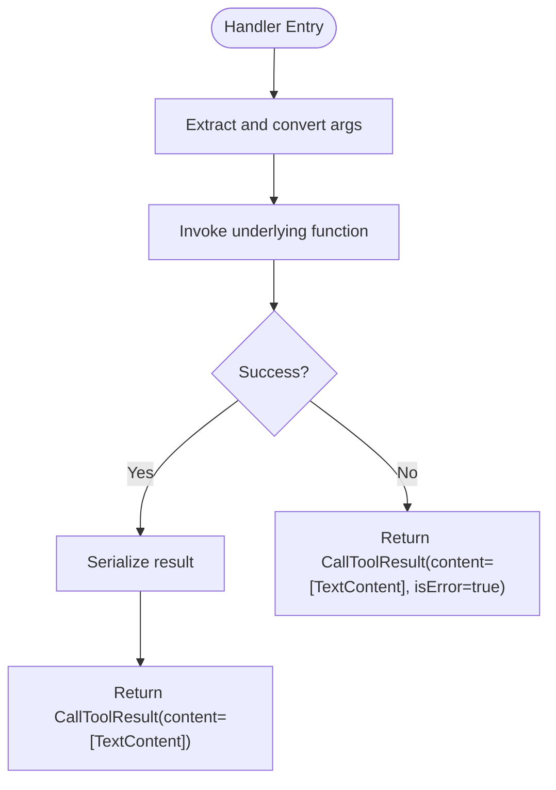
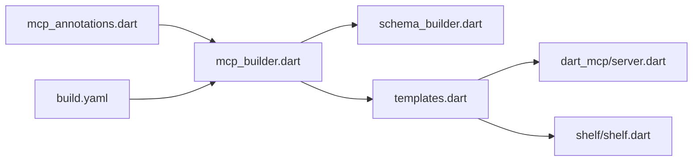

# Template System

<cite>
**Referenced Files in This Document**
- [README.md](file://README.md)
- [mcp_annotations.dart](file://packages/easy_mcp_annotations/lib/mcp_annotations.dart)
- [mcp_generator.dart](file://packages/easy_mcp_generator/lib/mcp_generator.dart)
- [mcp_builder.dart](file://packages/easy_mcp_generator/lib/builder/mcp_builder.dart)
- [templates.dart](file://packages/easy_mcp_generator/lib/builder/templates.dart)
- [schema_builder.dart](file://packages/easy_mcp_generator/lib/builder/schema_builder.dart)
- [doc_extractor.dart](file://packages/easy_mcp_generator/lib/builder/doc_extractor.dart)
- [build.yaml](file://packages/easy_mcp_generator/build.yaml)
- [example.dart](file://example/bin/example.dart)
- [templates_test.dart](file://packages/easy_mcp_generator/test/templates_test.dart)
</cite>

## Table of Contents
1. [Introduction](#introduction)
2. [Project Structure](#project-structure)
3. [Core Components](#core-components)
4. [Architecture Overview](#architecture-overview)
5. [Detailed Component Analysis](#detailed-component-analysis)
6. [Dependency Analysis](#dependency-analysis)
7. [Performance Considerations](#performance-considerations)
8. [Troubleshooting Guide](#troubleshooting-guide)
9. [Conclusion](#conclusion)
10. [Appendices](#appendices)

## Introduction
This document explains the template system architecture and rendering engine used to generate MCP (Model Context Protocol) servers from annotated Dart functions. It covers:
- Template-based code generation approach
- Transport-specific template implementations for stdio and HTTP modes
- Template rendering process, import resolution, and code generation strategies
- Template inheritance patterns and transport configuration application
- Template variable substitution and integration of tool metadata
- Template compilation and error handling for malformed templates
- Examples of customization and extension points for new transport modes
- Template caching strategies and performance optimization techniques

## Project Structure
The template system spans two packages:
- easy_mcp_annotations: Defines annotations that drive generation (e.g., @Mcp, @Tool).
- easy_mcp_generator: Implements the build-time generator that reads annotations, extracts tool metadata, builds schemas, and renders transport-specific templates.

**Diagram sources**
- [mcp_annotations.dart:1-107](file://packages/easy_mcp_annotations/lib/mcp_annotations.dart#L1-L107)
- [mcp_generator.dart:1-14](file://packages/easy_mcp_generator/lib/mcp_generator.dart#L1-L14)
- [mcp_builder.dart:1-567](file://packages/easy_mcp_generator/lib/builder/mcp_builder.dart#L1-L567)
- [schema_builder.dart:1-99](file://packages/easy_mcp_generator/lib/builder/schema_builder.dart#L1-L99)
- [templates.dart:1-578](file://packages/easy_mcp_generator/lib/builder/templates.dart#L1-L578)
- [doc_extractor.dart:1-106](file://packages/easy_mcp_generator/lib/builder/doc_extractor.dart#L1-L106)
- [build.yaml:1-12](file://packages/easy_mcp_generator/build.yaml#L1-L12)
- [example.dart:1-67](file://example/bin/example.dart#L1-L67)

**Section sources**
- [README.md:1-120](file://README.md#L1-L120)
- [build.yaml:1-12](file://packages/easy_mcp_generator/build.yaml#L1-L12)

## Core Components
- Annotations: Define transport mode and tool metadata.
- Builder: Orchestrates AST-based extraction, schema building, and template rendering.
- Schema Builder: Converts parameter metadata into Schema.* expressions.
- Templates: Transport-specific renderers for stdio and HTTP.
- Doc Extractor: Placeholder for documentation extraction (future analyzer integration).
- Build Configuration: Declares the builder and output extensions.

Key responsibilities:
- Extract tools from the annotated library and its package-local imports.
- Resolve per-tool source imports and aliases to avoid naming conflicts.
- Build JSON Schema maps and convert them to Schema.* expressions.
- Render stdio or HTTP templates with tool registrations, handlers, and serialization logic.
- Optionally generate a .mcp.json metadata file.

**Section sources**
- [mcp_annotations.dart:39-56](file://packages/easy_mcp_annotations/lib/mcp_annotations.dart#L39-L56)
- [mcp_builder.dart:12-52](file://packages/easy_mcp_generator/lib/builder/mcp_builder.dart#L12-L52)
- [schema_builder.dart:29-98](file://packages/easy_mcp_generator/lib/builder/schema_builder.dart#L29-L98)
- [templates.dart:6-266](file://packages/easy_mcp_generator/lib/builder/templates.dart#L6-L266)
- [templates.dart:269-578](file://packages/easy_mcp_generator/lib/builder/templates.dart#L269-L578)
- [doc_extractor.dart:1-106](file://packages/easy_mcp_generator/lib/builder/doc_extractor.dart#L1-L106)

## Architecture Overview
The generator runs during build time and transforms annotated libraries into runnable MCP servers. The flow:
1. Build runner triggers the builder for .dart inputs.
2. The builder locates @Mcp and @Tool annotations and extracts tool metadata.
3. It aggregates tools from the library and package-local imports, deriving source import URIs and unique aliases.
4. It builds JSON Schema maps and converts them to Schema.* expressions.
5. Based on transport mode, it renders either the stdio or HTTP template.
6. It optionally writes a .mcp.json metadata file.

**Diagram sources**
- [mcp_builder.dart:18-52](file://packages/easy_mcp_generator/lib/builder/mcp_builder.dart#L18-L52)
- [schema_builder.dart:68-98](file://packages/easy_mcp_generator/lib/builder/schema_builder.dart#L68-L98)
- [templates.dart:6-266](file://packages/easy_mcp_generator/lib/builder/templates.dart#L6-L266)
- [templates.dart:269-578](file://packages/easy_mcp_generator/lib/builder/templates.dart#L269-L578)

## Detailed Component Analysis

### Template Rendering Engine
The rendering engine consists of two transport-specific templates:
- StdioTemplate: Generates a stdio-based server using dart_mcp stdio channel.
- HttpTemplate: Generates an HTTP server using Shelf, bridging HTTP requests to the MCP server via a StreamChannel.

Both templates:
- Compute unique imports for custom List inner types across all tools.
- Resolve per-tool source imports and aliases to avoid collisions.
- Generate tool registration blocks using SchemaBuilder-produced expressions.
- Generate handler methods that extract parameters, perform conversions for List<T> with custom inner types, call the underlying function, serialize results, and wrap errors.
- Serialize results using a robust serializer that handles nulls, lists, and objects with toJson.

**Diagram sources**
- [templates.dart:6-266](file://packages/easy_mcp_generator/lib/builder/templates.dart#L6-L266)
- [templates.dart:269-578](file://packages/easy_mcp_generator/lib/builder/templates.dart#L269-L578)
- [schema_builder.dart:29-98](file://packages/easy_mcp_generator/lib/builder/schema_builder.dart#L29-L98)

**Section sources**
- [templates.dart:6-266](file://packages/easy_mcp_generator/lib/builder/templates.dart#L6-L266)
- [templates.dart:269-578](file://packages/easy_mcp_generator/lib/builder/templates.dart#L269-L578)
- [schema_builder.dart:29-98](file://packages/easy_mcp_generator/lib/builder/schema_builder.dart#L29-L98)

### Import Resolution Mechanisms
The builder resolves imports and aliases for tools originating from the same package:
- Derives a unique alias per imported library to prevent naming collisions.
- Adds per-tool sourceImport/sourceAlias to template variables so templates can emit precise import statements.
- Collects unique import URIs for List<T> inner types that are custom classes, enabling templates to import those types.

**Diagram sources**
- [mcp_builder.dart:115-166](file://packages/easy_mcp_generator/lib/builder/mcp_builder.dart#L115-L166)
- [mcp_builder.dart:187-199](file://packages/easy_mcp_generator/lib/builder/mcp_builder.dart#L187-L199)

**Section sources**
- [mcp_builder.dart:115-166](file://packages/easy_mcp_generator/lib/builder/mcp_builder.dart#L115-L166)
- [mcp_builder.dart:187-199](file://packages/easy_mcp_generator/lib/builder/mcp_builder.dart#L187-L199)

### Code Generation Strategies
- Tool Registration: Each tool gets a registerTool call with a Tool object built from name, description, and inputSchema.
- Handler Methods: For each tool, a handler method extracts arguments from request.arguments, performs conversions for List<T> with custom inner types, invokes the underlying function, serializes results, and wraps exceptions into CallToolResult.
- Serialization: A serializer handles nulls, lists, and objects with toJson; falls back to toString on failure.
- Schema Generation: The builder introspects Dart types to produce JSON Schema maps, then converts them to Schema.* expressions for templates.

**Diagram sources**
- [mcp_builder.dart:307-411](file://packages/easy_mcp_generator/lib/builder/mcp_builder.dart#L307-L411)
- [schema_builder.dart:29-98](file://packages/easy_mcp_generator/lib/builder/schema_builder.dart#L29-L98)
- [templates.dart:27-43](file://packages/easy_mcp_generator/lib/builder/templates.dart#L27-L43)

**Section sources**
- [mcp_builder.dart:307-411](file://packages/easy_mcp_generator/lib/builder/mcp_builder.dart#L307-L411)
- [schema_builder.dart:29-98](file://packages/easy_mcp_generator/lib/builder/schema_builder.dart#L29-L98)
- [templates.dart:27-43](file://packages/easy_mcp_generator/lib/builder/templates.dart#L27-L43)

### Template Inheritance Patterns
Both templates define a base class that extends the MCP server and mixes in tools support. The base class constructor configures implementation metadata and instructions, and registers tools during initialization. Handlers inherit from this base class and reuse the serialization logic.

**Diagram sources**
- [templates.dart:140-173](file://packages/easy_mcp_generator/lib/builder/templates.dart#L140-L173)
- [templates.dart:451-484](file://packages/easy_mcp_generator/lib/builder/templates.dart#L451-L484)

**Section sources**
- [templates.dart:140-173](file://packages/easy_mcp_generator/lib/builder/templates.dart#L140-L173)
- [templates.dart:451-484](file://packages/easy_mcp_generator/lib/builder/templates.dart#L451-L484)

### Transport Configuration Application
- Transport selection: The builder reads the @Mcp annotation’s transport field to choose between stdio and HTTP templates.
- HTTP port: The HttpTemplate.generate method accepts a port parameter; the stdio template uses a fixed stdio channel.
- Instructions and metadata: The base class sets implementation metadata and instructions, including the port for HTTP.

**Diagram sources**
- [mcp_builder.dart:35-38](file://packages/easy_mcp_generator/lib/builder/mcp_builder.dart#L35-L38)
- [mcp_builder.dart:516-563](file://packages/easy_mcp_generator/lib/builder/mcp_builder.dart#L516-L563)
- [templates.dart:269-486](file://packages/easy_mcp_generator/lib/builder/templates.dart#L269-L486)
- [templates.dart:6-175](file://packages/easy_mcp_generator/lib/builder/templates.dart#L6-L175)

**Section sources**
- [mcp_builder.dart:35-38](file://packages/easy_mcp_generator/lib/builder/mcp_builder.dart#L35-L38)
- [mcp_builder.dart:516-563](file://packages/easy_mcp_generator/lib/builder/mcp_builder.dart#L516-L563)
- [templates.dart:269-486](file://packages/easy_mcp_generator/lib/builder/templates.dart#L269-L486)
- [templates.dart:6-175](file://packages/easy_mcp_generator/lib/builder/templates.dart#L6-L175)

### Template Variable Substitution System
Templates receive a list of tool maps with keys such as:
- name, description, parameters, isAsync, className, isStatic, sourceImport, sourceAlias
- parameters include name, type, schema, schemaMap, isOptional, isNamed, listInnerTypeImport

These variables are substituted directly into the template strings to generate imports, registrations, and handler bodies.

**Section sources**
- [templates.dart:7-43](file://packages/easy_mcp_generator/lib/builder/templates.dart#L7-L43)
- [templates.dart:270-380](file://packages/easy_mcp_generator/lib/builder/templates.dart#L270-L380)

### Tool Metadata Integration
- Tool description: Derived from @Tool(description) or fallback to doc comment.
- Icons: Available via @Tool.icons for UI clients.
- JSON metadata: When enabled, a .mcp.json file is generated containing schemaVersion and tools with inputSchema.

**Section sources**
- [mcp_annotations.dart:80-106](file://packages/easy_mcp_annotations/lib/mcp_annotations.dart#L80-L106)
- [mcp_builder.dart:442-468](file://packages/easy_mcp_generator/lib/builder/mcp_builder.dart#L442-L468)
- [mcp_builder.dart:492-513](file://packages/easy_mcp_generator/lib/builder/mcp_builder.dart#L492-L513)

### Template Compilation and Error Handling
- Compilation: Templates are pure string-generating functions; no runtime compilation occurs.
- Error handling: Handler methods wrap exceptions into CallToolResult with isError=true and include the error text in TextContent.
- Malformed templates: The system relies on generated Dart code being syntactically valid; runtime errors in user code surface as CallToolResult with isError=true.

**Diagram sources**
- [templates.dart:101-115](file://packages/easy_mcp_generator/lib/builder/templates.dart#L101-L115)
- [templates.dart:364-378](file://packages/easy_mcp_generator/lib/builder/templates.dart#L364-L378)

**Section sources**
- [templates.dart:101-115](file://packages/easy_mcp_generator/lib/builder/templates.dart#L101-L115)
- [templates.dart:364-378](file://packages/easy_mcp_generator/lib/builder/templates.dart#L364-L378)

### Examples of Template Customization and Extension
- Adding a new transport mode:
  - Create a new template class similar to StdioTemplate/HttpTemplate with a generate method that accepts transport-specific parameters (e.g., host/port).
  - Extend the builder to select the new template based on a new enum value in @Mcp.
  - Emit transport-specific imports and server setup code in the template.
- Customizing schema generation:
  - Enhance SchemaBuilder to handle additional types or formats.
  - Update templates to consume richer schema expressions.

Validation and tests demonstrate expected behavior for stdio and HTTP templates.

**Section sources**
- [templates_test.dart:1-189](file://packages/easy_mcp_generator/test/templates_test.dart#L1-L189)
- [templates.dart:6-266](file://packages/easy_mcp_generator/lib/builder/templates.dart#L6-L266)
- [templates.dart:269-578](file://packages/easy_mcp_generator/lib/builder/templates.dart#L269-L578)

## Dependency Analysis
- Annotations package defines enums and classes consumed by the generator.
- Generator depends on:
  - Analyzer APIs for AST traversal and type introspection.
  - dart_mcp for server and schema types.
  - shelf for HTTP transport (in HttpTemplate).
  - build_runner for build-time execution.

**Diagram sources**
- [mcp_annotations.dart:1-107](file://packages/easy_mcp_annotations/lib/mcp_annotations.dart#L1-L107)
- [mcp_builder.dart:1-11](file://packages/easy_mcp_generator/lib/builder/mcp_builder.dart#L1-L11)
- [templates.dart:127-128](file://packages/easy_mcp_generator/lib/builder/templates.dart#L127-L128)
- [templates.dart:390-393](file://packages/easy_mcp_generator/lib/builder/templates.dart#L390-L393)
- [build.yaml:1-12](file://packages/easy_mcp_generator/build.yaml#L1-L12)

**Section sources**
- [mcp_builder.dart:1-11](file://packages/easy_mcp_generator/lib/builder/mcp_builder.dart#L1-L11)
- [templates.dart:127-128](file://packages/easy_mcp_generator/lib/builder/templates.dart#L127-L128)
- [templates.dart:390-393](file://packages/easy_mcp_generator/lib/builder/templates.dart#L390-L393)
- [build.yaml:1-12](file://packages/easy_mcp_generator/build.yaml#L1-L12)

## Performance Considerations
- Minimize reflection overhead: The generator uses analyzer APIs once per build to extract metadata and types.
- Efficient schema generation: SchemaBuilder caches minimal state; most work is string concatenation and map traversal.
- Template rendering: Templates are deterministic and fast; avoid heavy computations inside them.
- Import deduplication: The builder collects unique imports and aliases to reduce code size and improve readability.
- Incremental builds: Keep annotations and tool signatures stable to benefit from build_runner caching.

## Troubleshooting Guide
Common issues and resolutions:
- Missing imports for List<T> with custom inner types:
  - Ensure the inner type is a custom class and belongs to a package-local library; the builder will extract its import URI and templates will import it.
- Ambiguous imports:
  - The builder derives unique aliases for imported libraries; if collisions occur, adjust import paths or rely on the derived aliases.
- HTTP server not reachable:
  - Verify the port is free and the server prints the listening address; check firewall and localhost binding.
- Tool not registered:
  - Confirm the function is annotated with @Tool and the library is annotated with @Mcp; ensure the function is in a package-local import if used from another library.
- JSON metadata missing:
  - Enable generateJson in @Mcp to produce .mcp.json.

**Section sources**
- [mcp_builder.dart:115-166](file://packages/easy_mcp_generator/lib/builder/mcp_builder.dart#L115-L166)
- [mcp_builder.dart:492-513](file://packages/easy_mcp_generator/lib/builder/mcp_builder.dart#L492-L513)
- [templates.dart:269-486](file://packages/easy_mcp_generator/lib/builder/templates.dart#L269-L486)

## Conclusion
The template system provides a robust, extensible mechanism to generate MCP servers from annotated Dart functions. By separating concerns across annotations, builder, schema builder, and transport-specific templates, it supports stdio and HTTP transports out of the box and can be extended for additional transports. The design emphasizes correctness, maintainability, and performance through careful import resolution, schema generation, and error handling.

## Appendices

### Example Usage
- Annotate functions with @Tool and a library with @Mcp(transport: McpTransport.http).
- Run build_runner to generate .mcp.dart and optionally .mcp.json.
- Execute the generated server binary.

**Section sources**
- [README.md:31-53](file://README.md#L31-L53)
- [example.dart:6-7](file://example/bin/example.dart#L6-L7)