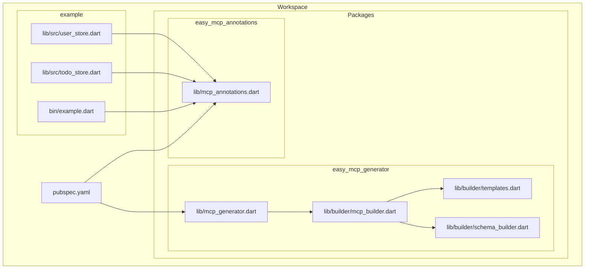
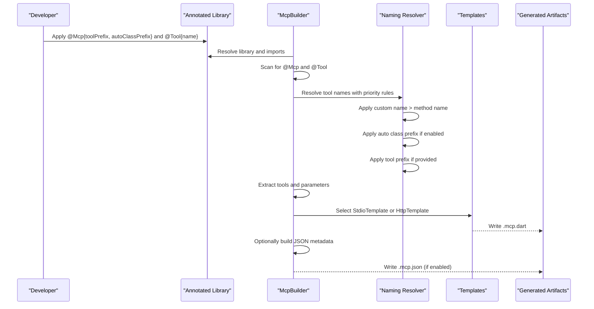
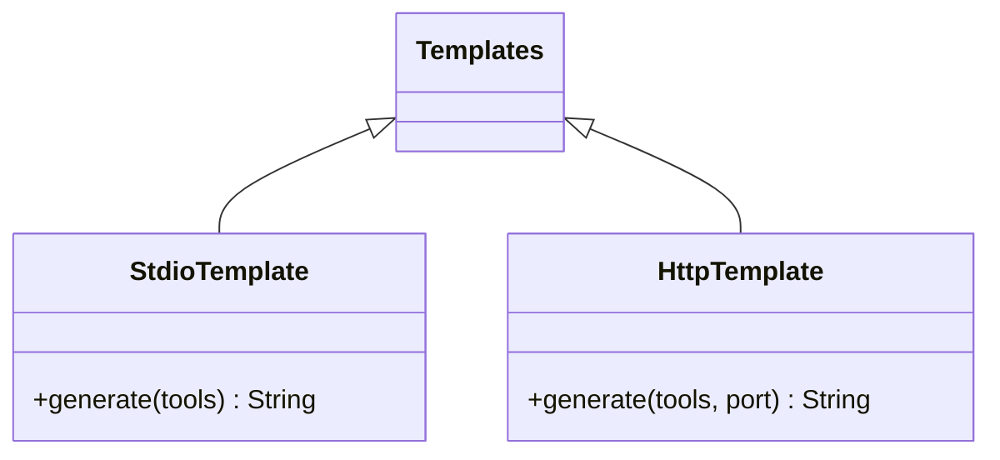
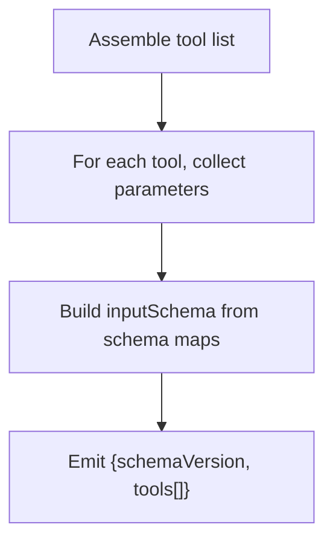
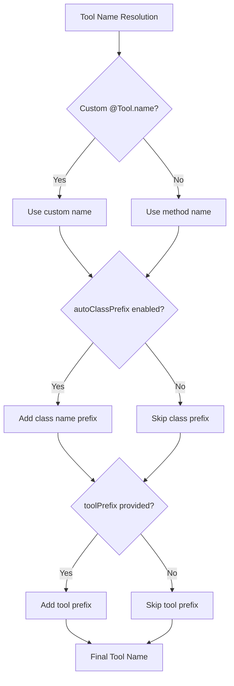
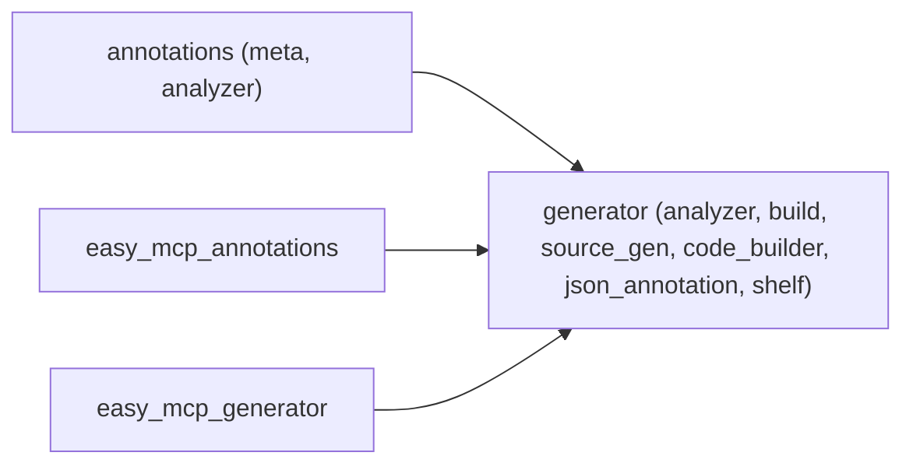

# Annotation System Overview

<cite>
**Referenced Files in This Document**
- [README.md](file://README.md)
- [pubspec.yaml](file://pubspec.yaml)
- [packages/easy_mcp_annotations/lib/mcp_annotations.dart](file://packages/easy_mcp_annotations/lib/mcp_annotations.dart)
- [packages/easy_mcp_generator/lib/mcp_generator.dart](file://packages/easy_mcp_generator/lib/mcp_generator.dart)
- [packages/easy_mcp_generator/lib/builder/mcp_builder.dart](file://packages/easy_mcp_generator/lib/builder/mcp_builder.dart)
- [packages/easy_mcp_generator/lib/builder/templates.dart](file://packages/easy_mcp_generator/lib/builder/templates.dart)
- [packages/easy_mcp_generator/lib/builder/schema_builder.dart](file://packages/easy_mcp_generator/lib/builder/schema_builder.dart)
- [packages/easy_mcp_annotations/test/mcp_annotation_test.dart](file://packages/easy_mcp_annotations/test/mcp_annotation_test.dart)
- [packages/easy_mcp_generator/test/mcp_builder_test.dart](file://packages/easy_mcp_generator/test/mcp_builder_test.dart)
- [example/lib/src/user_store.dart](file://example/lib/src/user_store.dart)
- [example/lib/src/todo_store.dart](file://example/lib/src/todo_store.dart)
- [example/bin/example.dart](file://example/bin/example.dart)
</cite>

## Update Summary
**Changes Made**
- Enhanced @Mcp annotation documentation with comprehensive tool naming system coverage
- Added detailed explanations of toolPrefix, autoClassPrefix, and custom tool names
- Updated examples demonstrating practical applications for tool organization and collision prevention
- Expanded tool naming priority and precedence rules
- Added new section on tool naming best practices and collision prevention

## Table of Contents
1. [Introduction](#introduction)
2. [Project Structure](#project-structure)
3. [Core Components](#core-components)
4. [Architecture Overview](#architecture-overview)
5. [Detailed Component Analysis](#detailed-component-analysis)
6. [Tool Naming System](#tool-naming-system)
7. [Dependency Analysis](#dependency-analysis)
8. [Performance Considerations](#performance-considerations)
9. [Troubleshooting Guide](#troubleshooting-guide)
10. [Conclusion](#conclusion)
11. [Appendices](#appendices)

## Introduction
This document explains the Easy MCP annotation system that powers the Model Context Protocol (MCP) code generator. It focuses on two annotations:
- @Mcp: Declares a library or executable as an MCP server and configures transport, JSON metadata generation, and tool naming conventions.
- @Tool: Marks a function as an MCP tool and supplies metadata such as description and icons.

These annotations enable you to declaratively expose Dart functions as MCP tools with sophisticated naming control. The generator reads these annotations at build time and produces runnable MCP servers (stdio or HTTP) along with optional JSON metadata and configurable tool naming schemes.

## Project Structure
The repository is organized as a Dart workspace with three primary parts:
- easy_mcp_annotations: Defines the @Mcp and @Tool annotations with enhanced tool naming capabilities.
- easy_mcp_generator: Implements the build-time code generator that turns annotated functions into MCP servers with advanced tool naming.
- example: Demonstrates real-world usage of annotations on methods and classes with various naming configurations.



**Diagram sources**
- [pubspec.yaml:1-64](file://pubspec.yaml#L1-L64)
- [packages/easy_mcp_annotations/lib/mcp_annotations.dart:1-302](file://packages/easy_mcp_annotations/lib/mcp_annotations.dart#L1-L302)
- [packages/easy_mcp_generator/lib/mcp_generator.dart:1-14](file://packages/easy_mcp_generator/lib/mcp_generator.dart#L1-L14)
- [packages/easy_mcp_generator/lib/builder/mcp_builder.dart:1-567](file://packages/easy_mcp_generator/lib/builder/mcp_builder.dart#L1-L567)
- [packages/easy_mcp_generator/lib/builder/templates.dart:1-578](file://packages/easy_mcp_generator/lib/builder/templates.dart#L1-L578)
- [packages/easy_mcp_generator/lib/builder/schema_builder.dart:1-99](file://packages/easy_mcp_generator/lib/builder/schema_builder.dart#L1-L99)
- [example/lib/src/user_store.dart:1-158](file://example/lib/src/user_store.dart#L1-L158)
- [example/lib/src/todo_store.dart:1-236](file://example/lib/src/todo_store.dart#L1-L236)
- [example/bin/example.dart:1-67](file://example/bin/example.dart#L1-L67)

**Section sources**
- [pubspec.yaml:1-64](file://pubspec.yaml#L1-L64)
- [README.md:1-120](file://README.md#L1-L120)

## Core Components
- @Mcp annotation
  - Purpose: Declares an MCP server and controls transport, JSON metadata generation, and tool naming conventions.
  - Key parameters:
    - transport: McpTransport.stdio or McpTransport.http.
    - generateJson: Boolean flag to emit a .mcp.json metadata file.
    - toolPrefix: Optional prefix applied to all tool names in this scope.
    - autoClassPrefix: Boolean flag to automatically prefix tool names with their class name.
  - Behavior: The generator scans the library for this annotation to decide whether to process annotated tools, how to generate the server, and how to name tools.

- @Tool annotation
  - Purpose: Marks a function as an MCP tool and provides metadata.
  - Key parameters:
    - name: Optional custom tool name (overrides method name).
    - description: Human-readable tool description. Falls back to the function's doc comment if omitted.
    - icons: Optional list of icon URLs for UI clients.
    - execution: Deprecated placeholder for future execution metadata.
  - Behavior: The generator extracts tool metadata and builds JSON Schema for input parameters.

- Transport modes
  - stdio: JSON-RPC over stdin/stdout, suitable for CLI-based clients.
  - http: Shelf-based HTTP server, enabling remote clients.

- JSON metadata generation
  - When generateJson is enabled, the generator emits a .mcp.json file containing tool names, descriptions, and input schemas.

**Section sources**
- [packages/easy_mcp_annotations/lib/mcp_annotations.dart:22-137](file://packages/easy_mcp_annotations/lib/mcp_annotations.dart#L22-L137)
- [packages/easy_mcp_generator/lib/builder/mcp_builder.dart:45-52](file://packages/easy_mcp_generator/lib/builder/mcp_builder.dart#L45-L52)
- [packages/easy_mcp_generator/lib/builder/mcp_builder.dart:442-468](file://packages/easy_mcp_generator/lib/builder/mcp_builder.dart#L442-L468)
- [README.md:55-76](file://README.md#L55-L76)

## Architecture Overview
The annotation-driven pipeline consists of:
- Annotation authoring: Developers annotate functions/classes with @Mcp and @Tool, configuring tool naming preferences.
- Build-time scanning: The generator inspects the library and imports for @Mcp and @Tool.
- Tool extraction: Functions and class methods with @Tool are collected, including parameter introspection and schema mapping.
- Tool naming resolution: The generator applies toolPrefix, autoClassPrefix, and custom names according to priority rules.
- Template generation: Based on transport, the generator emits either stdio or HTTP server code.
- Optional JSON emission: When configured, a .mcp.json file is produced with properly named tools.



**Diagram sources**
- [packages/easy_mcp_generator/lib/builder/mcp_builder.dart:18-52](file://packages/easy_mcp_generator/lib/builder/mcp_builder.dart#L18-L52)
- [packages/easy_mcp_generator/lib/builder/mcp_builder.dart:117-156](file://packages/easy_mcp_generator/lib/builder/mcp_builder.dart#L117-L156)
- [packages/easy_mcp_generator/lib/builder/templates.dart:6-175](file://packages/easy_mcp_generator/lib/builder/templates.dart#L6-L175)
- [packages/easy_mcp_generator/lib/builder/templates.dart:269-486](file://packages/easy_mcp_generator/lib/builder/templates.dart#L269-L486)

## Detailed Component Analysis

### @Mcp Annotation
- Parameters
  - transport: McpTransport.stdio or McpTransport.http.
  - generateJson: Controls emission of .mcp.json.
  - toolPrefix: Optional prefix applied to all tool names in this scope.
  - autoClassPrefix: Boolean flag to automatically prefix tool names with their class name.
- Impact on generated code
  - transport selects StdioTemplate or HttpTemplate.
  - generateJson toggles JSON metadata emission.
  - toolPrefix and autoClassPrefix control tool naming strategy.

```mermaid
classDiagram
class Mcp {
+McpTransport transport
+bool generateJson
+int port
+String address
+String? toolPrefix
+bool autoClassPrefix
+Mcp({transport, generateJson, port, address, toolPrefix, autoClassPrefix})
}
class McpTransport {
+stdio
+http
}
Mcp --> McpTransport : "uses"
```

**Diagram sources**
- [packages/easy_mcp_annotations/lib/mcp_annotations.dart:76-137](file://packages/easy_mcp_annotations/lib/mcp_annotations.dart#L76-L137)
- [packages/easy_mcp_annotations/lib/mcp_annotations.dart:10-20](file://packages/easy_mcp_annotations/lib/mcp_annotations.dart#L10-L20)

**Section sources**
- [packages/easy_mcp_annotations/lib/mcp_annotations.dart:22-137](file://packages/easy_mcp_annotations/lib/mcp_annotations.dart#L22-L137)
- [packages/easy_mcp_generator/lib/builder/mcp_builder.dart:515-563](file://packages/easy_mcp_generator/lib/builder/mcp_builder.dart#L515-L563)

### @Tool Annotation
- Parameters
  - name: Optional custom tool name (overrides method name).
  - description: Tool purpose; falls back to doc comment if absent.
  - icons: Optional icon URLs.
  - execution: Deprecated.
- Behavior
  - Extracted with function/class method elements.
  - Used to populate tool registration and JSON schema.
  - Custom names take precedence over method names.

```mermaid
classDiagram
class Tool {
+String? name
+String? description
+String[]? icons
+Map~String, Object~~? execution
+Tool({name, description, icons, execution})
}
```

**Diagram sources**
- [packages/easy_mcp_annotations/lib/mcp_annotations.dart:167-201](file://packages/easy_mcp_annotations/lib/mcp_annotations.dart#L167-L201)

**Section sources**
- [packages/easy_mcp_annotations/lib/mcp_annotations.dart:139-201](file://packages/easy_mcp_annotations/lib/mcp_annotations.dart#L139-L201)
- [packages/easy_mcp_generator/lib/builder/mcp_builder.dart:202-226](file://packages/easy_mcp_generator/lib/builder/mcp_builder.dart#L202-L226)

### Tool Extraction and Schema Building
- Extraction
  - Scans top-level functions and class methods for @Tool.
  - Supports both static and instance methods.
  - Captures parameter types, optionality, and named parameters.
- Schema mapping
  - Primitive types map to JSON Schema primitives.
  - Lists and maps are handled with recursive introspection.
  - Custom classes are serialized to object schemas with required fields derived from non-nullable properties.


**Diagram sources**
- [packages/easy_mcp_generator/lib/builder/mcp_builder.dart:55-110](file://packages/easy_mcp_generator/lib/builder/mcp_builder.dart#L55-L110)
- [packages/easy_mcp_generator/lib/builder/mcp_builder.dart:229-283](file://packages/easy_mcp_generator/lib/builder/mcp_builder.dart#L229-L283)
- [packages/easy_mcp_generator/lib/builder/schema_builder.dart:29-98](file://packages/easy_mcp_generator/lib/builder/schema_builder.dart#L29-L98)

**Section sources**
- [packages/easy_mcp_generator/lib/builder/mcp_builder.dart:55-110](file://packages/easy_mcp_generator/lib/builder/mcp_builder.dart#L55-L110)
- [packages/easy_mcp_generator/lib/builder/mcp_builder.dart:307-411](file://packages/easy_mcp_generator/lib/builder/mcp_builder.dart#L307-L411)
- [packages/easy_mcp_generator/lib/builder/schema_builder.dart:1-99](file://packages/easy_mcp_generator/lib/builder/schema_builder.dart#L1-L99)

### Transport Selection and Generated Servers
- Stdio server
  - Uses dart_mcp stdio channel.
  - Registers tools and serializes results to JSON.
- HTTP server
  - Uses Shelf to bridge HTTP requests to MCP.
  - Maintains a StreamChannel for bidirectional communication.



**Diagram sources**
- [packages/easy_mcp_generator/lib/builder/templates.dart:6-175](file://packages/easy_mcp_generator/lib/builder/templates.dart#L6-L175)
- [packages/easy_mcp_generator/lib/builder/templates.dart:269-486](file://packages/easy_mcp_generator/lib/builder/templates.dart#L269-L486)

**Section sources**
- [packages/easy_mcp_generator/lib/builder/templates.dart:6-175](file://packages/easy_mcp_generator/lib/builder/templates.dart#L6-L175)
- [packages/easy_mcp_generator/lib/builder/templates.dart:269-486](file://packages/easy_mcp_generator/lib/builder/templates.dart#L269-L486)

### JSON Metadata Generation
- Emits a .mcp.json file with schemaVersion and tools array.
- Each tool includes name, description, and inputSchema built from parameter introspection.



**Diagram sources**
- [packages/easy_mcp_generator/lib/builder/mcp_builder.dart:442-468](file://packages/easy_mcp_generator/lib/builder/mcp_builder.dart#L442-L468)

**Section sources**
- [packages/easy_mcp_generator/lib/builder/mcp_builder.dart:442-468](file://packages/easy_mcp_generator/lib/builder/mcp_builder.dart#L442-L468)

### Annotation Usage Examples
- Applying @Mcp to a library/executable
  - Example: [example/bin/example.dart:6](file://example/bin/example.dart#L6)
- Applying @Tool to static methods
  - Example: [example/lib/src/user_store.dart:51](file://example/lib/src/user_store.dart#L51)
  - Example: [example/lib/src/todo_store.dart:69](file://example/lib/src/todo_store.dart#L69)
- Mixed usage across classes and methods
  - Example: [example/lib/src/user_store.dart:89](file://example/lib/src/user_store.dart#L89)
  - Example: [example/lib/src/todo_store.dart:145](file://example/lib/src/todo_store.dart#L145)

**Section sources**
- [example/bin/example.dart:6](file://example/bin/example.dart#L6)
- [example/lib/src/user_store.dart:51-158](file://example/lib/src/user_store.dart#L51-L158)
- [example/lib/src/todo_store.dart:69-236](file://example/lib/src/todo_store.dart#L69-L236)

## Tool Naming System

**Updated** Enhanced with comprehensive tool naming system including toolPrefix, autoClassPrefix, and custom tool names for improved organization and collision prevention.

The Easy MCP annotation system now provides sophisticated tool naming capabilities controlled through the @Mcp annotation. This system enables developers to organize tools, prevent naming collisions, and create more descriptive tool names for MCP clients.

### Tool Naming Priority and Precedence

The tool naming system follows a strict priority order:

1. **Custom Tool Name** (`@Tool.name`)
2. **Method Name** (fallback when no custom name)
3. **Auto Class Prefix** (when enabled)
4. **Tool Prefix** (when provided)



**Diagram sources**
- [packages/easy_mcp_generator/lib/builder/mcp_builder.dart:117-156](file://packages/easy_mcp_generator/lib/builder/mcp_builder.dart#L117-L156)
- [packages/easy_mcp_generator/lib/builder/mcp_builder.dart:273-300](file://packages/easy_mcp_generator/lib/builder/mcp_builder.dart#L273-L300)

### Tool Prefix Configuration

The `toolPrefix` parameter adds a consistent prefix to all tool names within a scope:

```dart
@Mcp(transport: McpTransport.stdio, toolPrefix: 'user_service_')
class UserService {
  @Tool(description: 'Create user')
  Future<User> createUser() async { 
    // Tool name: user_service_createUser
  }
  
  @Tool(description: 'Delete user')
  Future<void> deleteUser(String id) async { 
    // Tool name: user_service_deleteUser
  }
}
```

**Key Benefits:**
- Organizes tools by domain (e.g., `user_`, `order_`, `admin_`)
- Prevents naming collisions when aggregating tools from multiple files
- Creates more descriptive names for MCP clients

### Auto Class Prefix Configuration

The `autoClassPrefix` parameter automatically prefixes tool names with their class name:

```dart
@Mcp(transport: McpTransport.stdio, autoClassPrefix: true)
class UserService {
  @Tool(description: 'Create user')
  Future<User> createUser() async { 
    // Tool name: UserService_createUser
  }
  
  @Tool(description: 'Delete user')
  Future<void> deleteUser(String id) async { 
    // Tool name: UserService_deleteUser
  }
}
```

**Key Benefits:**
- Automatically prevents collisions between methods with identical names in different classes
- Creates self-documenting tool names
- Simplifies tool organization by class

### Combined Naming Strategy

Both `autoClassPrefix` and `toolPrefix` can be used together for maximum organization:

```dart
@Mcp(transport: McpTransport.stdio, autoClassPrefix: true, toolPrefix: 'api_')
class UserService {
  @Tool(description: 'Create user')
  Future<User> createUser() async { 
    // Tool name: api_UserService_createUser
  }
}
```

**Best Practices:**
- Use `toolPrefix` for domain organization (e.g., `user_`, `order_`)
- Use `autoClassPrefix` for class-level organization
- Combine both for hierarchical naming (domain → class → method)
- Keep prefixes short but descriptive

### Practical Applications

**Domain Organization:**
```dart
@Mcp(transport: McpTransport.stdio, toolPrefix: 'user_')
class UserManagement {
  @Tool(description: 'Create user account')
  Future<User> createUser() async { ... }
}

@Mcp(transport: McpTransport.stdio, toolPrefix: 'order_')
class OrderProcessing {
  @Tool(description: 'Process customer order')
  Future<Order> processOrder() async { ... }
}
```

**Collision Prevention:**
```dart
@Mcp(transport: McpTransport.stdio, autoClassPrefix: true)
class DatabaseManager {
  @Tool(description: 'Execute query')
  Future<List<Map<String, dynamic>>> query() async { ... }
}

@Mcp(transport: McpTransport.stdio, autoClassPrefix: true)
class FileManager {
  @Tool(description: 'Execute query')
  Future<List<String>> query() async { ... }
}
```

**Section sources**
- [packages/easy_mcp_annotations/lib/mcp_annotations.dart:41-119](file://packages/easy_mcp_annotations/lib/mcp_annotations.dart#L41-L119)
- [packages/easy_mcp_generator/lib/builder/mcp_builder.dart:117-156](file://packages/easy_mcp_generator/lib/builder/mcp_builder.dart#L117-L156)
- [packages/easy_mcp_generator/lib/builder/mcp_builder.dart:948-967](file://packages/easy_mcp_generator/lib/builder/mcp_builder.dart#L948-L967)

## Dependency Analysis
- easy_mcp_annotations depends on meta and analyzer for annotation definitions and AST support.
- easy_mcp_generator depends on analyzer, build, source_gen, code_builder, json_annotation, and shelf.
- The generator exports the builder implementation and consumes the annotations package.



**Diagram sources**
- [packages/easy_mcp_annotations/pubspec.yaml:11-17](file://packages/easy_mcp_annotations/pubspec.yaml#L11-L17)
- [packages/easy_mcp_generator/pubspec.yaml:10-18](file://packages/easy_mcp_generator/pubspec.yaml#L10-L18)

**Section sources**
- [packages/easy_mcp_annotations/pubspec.yaml:11-17](file://packages/easy_mcp_annotations/pubspec.yaml#L11-L17)
- [packages/easy_mcp_generator/pubspec.yaml:10-18](file://packages/easy_mcp_generator/pubspec.yaml#L10-L18)

## Performance Considerations
- AST scanning is efficient due to analyzer-based extraction.
- Schema generation avoids redundant work by caching type introspection results per tool.
- HTTP transport introduces overhead from Shelf and StreamChannel bridging; prefer stdio for CLI-focused deployments.
- Tool naming resolution occurs during build time and has minimal runtime impact.

## Troubleshooting Guide
- No generated server appears
  - Ensure the library or executable under @Mcp is processed by build_runner and contains at least one @Tool.
  - Verify the @Mcp annotation presence and correct import path.
  - Confirm build_runner is executed with the correct extensions.

- Tools not registered
  - Check that @Tool is applied to functions or class methods (static or instance).
  - Ensure the function signatures are resolvable by the analyzer.

- Incorrect transport selected
  - Confirm @Mcp.transport is set to the intended mode.
  - The generator reads the enum value to choose StdioTemplate or HttpTemplate.

- JSON metadata missing
  - Enable generateJson in @Mcp.
  - Ensure the generator runs after tool extraction completes.

- Parameter schema mismatches
  - Non-nullable fields become required in the schema.
  - Custom class parameters are represented as objects; ensure types are serializable.

- HTTP server not reachable
  - Verify the generated main function starts the Shelf server on the expected port.
  - Check firewall and port availability.

- Tool naming conflicts
  - Use toolPrefix to organize tools by domain.
  - Use autoClassPrefix to prevent collisions between methods with identical names.
  - Use custom @Tool.name for unique tool identification.

- Unexpected tool names
  - Remember the naming priority: custom name > method name > auto class prefix > tool prefix.
  - Check the order of @Mcp parameters and verify they're applied correctly.

**Section sources**
- [packages/easy_mcp_generator/lib/builder/mcp_builder.dart:18-52](file://packages/easy_mcp_generator/lib/builder/mcp_builder.dart#L18-L52)
- [packages/easy_mcp_generator/lib/builder/mcp_builder.dart:491-513](file://packages/easy_mcp_generator/lib/builder/mcp_builder.dart#L491-L513)
- [packages/easy_mcp_generator/lib/builder/templates.dart:398-449](file://packages/easy_mcp_generator/lib/builder/templates.dart#L398-L449)

## Conclusion
The Easy MCP annotation system provides a concise, declarative way to expose Dart functions as MCP tools with sophisticated naming control. By annotating with @Mcp and @Tool, developers can quickly generate stdio or HTTP servers with accurate JSON schemas, optional metadata, and configurable tool naming strategies. The enhanced tool naming system enables better organization, collision prevention, and client-friendly tool identification. The generator's AST-based approach ensures robust tool discovery and schema mapping, while best practices around annotation placement, tool naming configuration, and parameter setup yield predictable and maintainable MCP integrations.

## Appendices

### Best Practices for Annotation Placement and Configuration
- Place @Mcp on the library or executable that orchestrates the server lifecycle.
- Place @Tool on functions or class methods intended for client invocation.
- Prefer explicit description in @Tool; otherwise, the generator uses the function's doc comment.
- Keep parameter types simple and serializable; custom classes should expose toJson methods for consistent serialization.
- Use generateJson when clients rely on external tool catalogs or documentation.
- Configure tool naming strategically: use toolPrefix for domain organization, autoClassPrefix for class separation, and custom names for unique identification.

**Section sources**
- [packages/easy_mcp_annotations/lib/mcp_annotations.dart:139-201](file://packages/easy_mcp_annotations/lib/mcp_annotations.dart#L139-L201)
- [packages/easy_mcp_generator/lib/builder/mcp_builder.dart:202-226](file://packages/easy_mcp_generator/lib/builder/mcp_builder.dart#L202-L226)

### Example References
- @Mcp usage on main:
  - [example/bin/example.dart:6](file://example/bin/example.dart#L6)
- @Tool usage on static methods:
  - [example/lib/src/user_store.dart:51](file://example/lib/src/user_store.dart#L51)
  - [example/lib/src/todo_store.dart:69](file://example/lib/src/todo_store.dart#L69)
- Test coverage for @Mcp transport:
  - [packages/easy_mcp_annotations/test/mcp_annotation_test.dart:6-20](file://packages/easy_mcp_annotations/test/mcp_annotation_test.dart#L6-L20)
- Generator builder configuration:
  - [packages/easy_mcp_generator/test/mcp_builder_test.dart:5-10](file://packages/easy_mcp_generator/test/mcp_builder_test.dart#L5-L10)
- Tool naming examples:
  - [packages/easy_mcp_annotations/lib/mcp_annotations.dart:59-75](file://packages/easy_mcp_annotations/lib/mcp_annotations.dart#L59-L75)
  - [packages/easy_mcp_generator/README.md:124-158](file://packages/easy_mcp_generator/README.md#L124-L158)