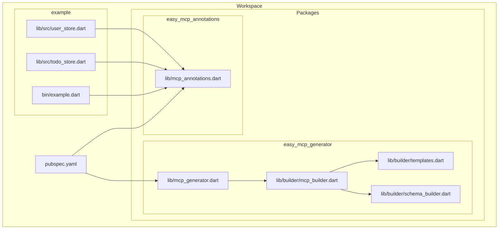
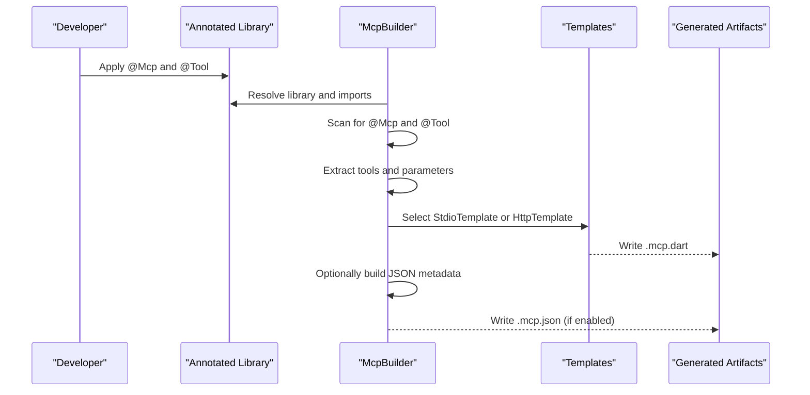
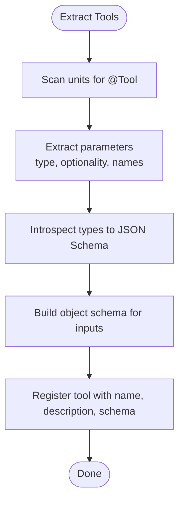
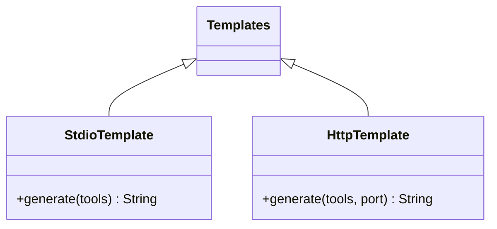
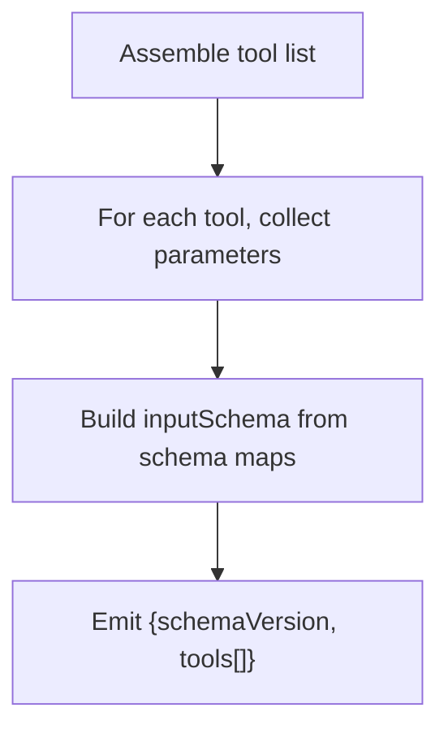
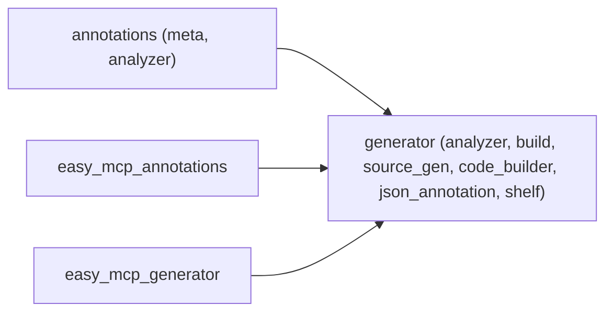

# Annotation System Overview

<cite>
**Referenced Files in This Document**
- [README.md](file://README.md)
- [pubspec.yaml](file://pubspec.yaml)
- [packages/easy_mcp_annotations/lib/mcp_annotations.dart](file://packages/easy_mcp_annotations/lib/mcp_annotations.dart)
- [packages/easy_mcp_generator/lib/mcp_generator.dart](file://packages/easy_mcp_generator/lib/mcp_generator.dart)
- [packages/easy_mcp_generator/lib/builder/mcp_builder.dart](file://packages/easy_mcp_generator/lib/builder/mcp_builder.dart)
- [packages/easy_mcp_generator/lib/builder/templates.dart](file://packages/easy_mcp_generator/lib/builder/templates.dart)
- [packages/easy_mcp_generator/lib/builder/schema_builder.dart](file://packages/easy_mcp_generator/lib/builder/schema_builder.dart)
- [packages/easy_mcp_annotations/test/mcp_annotation_test.dart](file://packages/easy_mcp_annotations/test/mcp_annotation_test.dart)
- [packages/easy_mcp_generator/test/mcp_builder_test.dart](file://packages/easy_mcp_generator/test/mcp_builder_test.dart)
- [example/lib/src/user_store.dart](file://example/lib/src/user_store.dart)
- [example/lib/src/todo_store.dart](file://example/lib/src/todo_store.dart)
- [example/bin/example.dart](file://example/bin/example.dart)
</cite>

## Table of Contents
1. [Introduction](#introduction)
2. [Project Structure](#project-structure)
3. [Core Components](#core-components)
4. [Architecture Overview](#architecture-overview)
5. [Detailed Component Analysis](#detailed-component-analysis)
6. [Dependency Analysis](#dependency-analysis)
7. [Performance Considerations](#performance-considerations)
8. [Troubleshooting Guide](#troubleshooting-guide)
9. [Conclusion](#conclusion)
10. [Appendices](#appendices)

## Introduction
This document explains the Easy MCP annotation system that powers the Model Context Protocol (MCP) code generator. It focuses on two annotations:
- @Mcp: Declares a library or executable as an MCP server and configures transport and JSON metadata generation.
- @Tool: Marks a function as an MCP tool and supplies metadata such as description and icons.

These annotations enable you to declaratively expose Dart functions as MCP tools. The generator reads these annotations at build time and produces runnable MCP servers (stdio or HTTP) along with optional JSON metadata.

## Project Structure
The repository is organized as a Dart workspace with three primary parts:
- easy_mcp_annotations: Defines the @Mcp and @Tool annotations.
- easy_mcp_generator: Implements the build-time code generator that turns annotated functions into MCP servers.
- example: Demonstrates real-world usage of annotations on methods and classes.



**Diagram sources**
- [pubspec.yaml:1-64](file://pubspec.yaml#L1-L64)
- [packages/easy_mcp_annotations/lib/mcp_annotations.dart:1-107](file://packages/easy_mcp_annotations/lib/mcp_annotations.dart#L1-L107)
- [packages/easy_mcp_generator/lib/mcp_generator.dart:1-14](file://packages/easy_mcp_generator/lib/mcp_generator.dart#L1-L14)
- [packages/easy_mcp_generator/lib/builder/mcp_builder.dart:1-567](file://packages/easy_mcp_generator/lib/builder/mcp_builder.dart#L1-L567)
- [packages/easy_mcp_generator/lib/builder/templates.dart:1-578](file://packages/easy_mcp_generator/lib/builder/templates.dart#L1-L578)
- [packages/easy_mcp_generator/lib/builder/schema_builder.dart:1-99](file://packages/easy_mcp_generator/lib/builder/schema_builder.dart#L1-L99)
- [example/lib/src/user_store.dart:1-144](file://example/lib/src/user_store.dart#L1-L144)
- [example/lib/src/todo_store.dart:1-236](file://example/lib/src/todo_store.dart#L1-L236)
- [example/bin/example.dart:1-67](file://example/bin/example.dart#L1-L67)

**Section sources**
- [pubspec.yaml:1-64](file://pubspec.yaml#L1-L64)
- [README.md:1-120](file://README.md#L1-L120)

## Core Components
- @Mcp annotation
  - Purpose: Declares an MCP server and controls transport and JSON metadata generation.
  - Key parameters:
    - transport: McpTransport.stdio or McpTransport.http.
    - generateJson: Boolean flag to emit a .mcp.json metadata file.
  - Behavior: The generator scans the library for this annotation to decide whether to process annotated tools and how to generate the server.

- @Tool annotation
  - Purpose: Marks a function as an MCP tool and provides metadata.
  - Key parameters:
    - description: Human-readable tool description. Falls back to the function’s doc comment if omitted.
    - icons: Optional list of icon URLs for UI clients.
    - execution: Deprecated placeholder for future execution metadata.
  - Behavior: The generator extracts tool metadata and builds JSON Schema for input parameters.

- Transport modes
  - stdio: JSON-RPC over stdin/stdout, suitable for CLI-based clients.
  - http: Shelf-based HTTP server, enabling remote clients.

- JSON metadata generation
  - When generateJson is enabled, the generator emits a .mcp.json file containing tool names, descriptions, and input schemas.

**Section sources**
- [packages/easy_mcp_annotations/lib/mcp_annotations.dart:21-107](file://packages/easy_mcp_annotations/lib/mcp_annotations.dart#L21-L107)
- [packages/easy_mcp_generator/lib/builder/mcp_builder.dart:45-52](file://packages/easy_mcp_generator/lib/builder/mcp_builder.dart#L45-L52)
- [packages/easy_mcp_generator/lib/builder/mcp_builder.dart:442-468](file://packages/easy_mcp_generator/lib/builder/mcp_builder.dart#L442-L468)
- [README.md:55-76](file://README.md#L55-L76)

## Architecture Overview
The annotation-driven pipeline consists of:
- Annotation authoring: Developers annotate functions/classes with @Mcp and @Tool.
- Build-time scanning: The generator inspects the library and imports for @Mcp and @Tool.
- Tool extraction: Functions and class methods with @Tool are collected, including parameter introspection and schema mapping.
- Template generation: Based on transport, the generator emits either stdio or HTTP server code.
- Optional JSON emission: When configured, a .mcp.json file is produced.



**Diagram sources**
- [packages/easy_mcp_generator/lib/builder/mcp_builder.dart:18-52](file://packages/easy_mcp_generator/lib/builder/mcp_builder.dart#L18-L52)
- [packages/easy_mcp_generator/lib/builder/templates.dart:6-175](file://packages/easy_mcp_generator/lib/builder/templates.dart#L6-L175)
- [packages/easy_mcp_generator/lib/builder/templates.dart:269-486](file://packages/easy_mcp_generator/lib/builder/templates.dart#L269-L486)

## Detailed Component Analysis

### @Mcp Annotation
- Parameters
  - transport: McpTransport.stdio or McpTransport.http.
  - generateJson: Controls emission of .mcp.json.
- Impact on generated code
  - transport selects StdioTemplate or HttpTemplate.
  - generateJson toggles JSON metadata emission.

```mermaid
classDiagram
class Mcp {
+McpTransport transport
+bool generateJson
+Mcp({transport, generateJson})
}
class McpTransport {
+stdio
+http
}
Mcp --> McpTransport : "uses"
```

**Diagram sources**
- [packages/easy_mcp_annotations/lib/mcp_annotations.dart:39-56](file://packages/easy_mcp_annotations/lib/mcp_annotations.dart#L39-L56)
- [packages/easy_mcp_annotations/lib/mcp_annotations.dart:9-19](file://packages/easy_mcp_annotations/lib/mcp_annotations.dart#L9-L19)

**Section sources**
- [packages/easy_mcp_annotations/lib/mcp_annotations.dart:21-56](file://packages/easy_mcp_annotations/lib/mcp_annotations.dart#L21-L56)
- [packages/easy_mcp_generator/lib/builder/mcp_builder.dart:515-563](file://packages/easy_mcp_generator/lib/builder/mcp_builder.dart#L515-L563)

### @Tool Annotation
- Parameters
  - description: Tool purpose; falls back to doc comment if absent.
  - icons: Optional icon URLs.
  - execution: Deprecated.
- Behavior
  - Extracted with function/class method elements.
  - Used to populate tool registration and JSON schema.

```mermaid
classDiagram
class Tool {
+String? description
+String[]? icons
+Map~String, Object~~? execution
+Tool({description, icons, execution})
}
```

**Diagram sources**
- [packages/easy_mcp_annotations/lib/mcp_annotations.dart:80-106](file://packages/easy_mcp_annotations/lib/mcp_annotations.dart#L80-L106)

**Section sources**
- [packages/easy_mcp_annotations/lib/mcp_annotations.dart:58-106](file://packages/easy_mcp_annotations/lib/mcp_annotations.dart#L58-L106)
- [packages/easy_mcp_generator/lib/builder/mcp_builder.dart:202-226](file://packages/easy_mcp_generator/lib/builder/mcp_builder.dart#L202-L226)

### Tool Extraction and Schema Building
- Extraction
  - Scans top-level functions and class methods for @Tool.
  - Supports both static and instance methods.
  - Captures parameter types, optionality, and named parameters.
- Schema mapping
  - Primitive types map to JSON Schema primitives.
  - Lists and maps are handled with recursive introspection.
  - Custom classes are serialized to object schemas with required fields derived from non-nullable properties.



**Diagram sources**
- [packages/easy_mcp_generator/lib/builder/mcp_builder.dart:55-110](file://packages/easy_mcp_generator/lib/builder/mcp_builder.dart#L55-L110)
- [packages/easy_mcp_generator/lib/builder/mcp_builder.dart:229-283](file://packages/easy_mcp_generator/lib/builder/mcp_builder.dart#L229-L283)
- [packages/easy_mcp_generator/lib/builder/schema_builder.dart:29-98](file://packages/easy_mcp_generator/lib/builder/schema_builder.dart#L29-L98)

**Section sources**
- [packages/easy_mcp_generator/lib/builder/mcp_builder.dart:55-110](file://packages/easy_mcp_generator/lib/builder/mcp_builder.dart#L55-L110)
- [packages/easy_mcp_generator/lib/builder/mcp_builder.dart:307-411](file://packages/easy_mcp_generator/lib/builder/mcp_builder.dart#L307-L411)
- [packages/easy_mcp_generator/lib/builder/schema_builder.dart:1-99](file://packages/easy_mcp_generator/lib/builder/schema_builder.dart#L1-L99)

### Transport Selection and Generated Servers
- Stdio server
  - Uses dart_mcp stdio channel.
  - Registers tools and serializes results to JSON.
- HTTP server
  - Uses Shelf to bridge HTTP requests to MCP.
  - Maintains a StreamChannel for bidirectional communication.



**Diagram sources**
- [packages/easy_mcp_generator/lib/builder/templates.dart:6-175](file://packages/easy_mcp_generator/lib/builder/templates.dart#L6-L175)
- [packages/easy_mcp_generator/lib/builder/templates.dart:269-486](file://packages/easy_mcp_generator/lib/builder/templates.dart#L269-L486)

**Section sources**
- [packages/easy_mcp_generator/lib/builder/templates.dart:6-175](file://packages/easy_mcp_generator/lib/builder/templates.dart#L6-L175)
- [packages/easy_mcp_generator/lib/builder/templates.dart:269-486](file://packages/easy_mcp_generator/lib/builder/templates.dart#L269-L486)

### JSON Metadata Generation
- Emits a .mcp.json file with schemaVersion and tools array.
- Each tool includes name, description, and inputSchema built from parameter introspection.



**Diagram sources**
- [packages/easy_mcp_generator/lib/builder/mcp_builder.dart:442-468](file://packages/easy_mcp_generator/lib/builder/mcp_builder.dart#L442-L468)

**Section sources**
- [packages/easy_mcp_generator/lib/builder/mcp_builder.dart:442-468](file://packages/easy_mcp_generator/lib/builder/mcp_builder.dart#L442-L468)

### Annotation Usage Examples
- Applying @Mcp to a library/executable
  - Example: [example/bin/example.dart:6](file://example/bin/example.dart#L6)
- Applying @Tool to static methods
  - Example: [example/lib/src/user_store.dart:55](file://example/lib/src/user_store.dart#L55)
  - Example: [example/lib/src/todo_store.dart:69](file://example/lib/src/todo_store.dart#L69)
- Mixed usage across classes and methods
  - Example: [example/lib/src/user_store.dart:82](file://example/lib/src/user_store.dart#L82)
  - Example: [example/lib/src/todo_store.dart:145](file://example/lib/src/todo_store.dart#L145)

**Section sources**
- [example/bin/example.dart:6](file://example/bin/example.dart#L6)
- [example/lib/src/user_store.dart:55-100](file://example/lib/src/user_store.dart#L55-L100)
- [example/lib/src/todo_store.dart:69-182](file://example/lib/src/todo_store.dart#L69-L182)

## Dependency Analysis
- easy_mcp_annotations depends on meta and analyzer for annotation definitions and AST support.
- easy_mcp_generator depends on analyzer, build, source_gen, code_builder, json_annotation, and shelf.
- The generator exports the builder implementation and consumes the annotations package.



**Diagram sources**
- [packages/easy_mcp_annotations/pubspec.yaml:11-17](file://packages/easy_mcp_annotations/pubspec.yaml#L11-L17)
- [packages/easy_mcp_generator/pubspec.yaml:10-18](file://packages/easy_mcp_generator/pubspec.yaml#L10-L18)

**Section sources**
- [packages/easy_mcp_annotations/pubspec.yaml:11-17](file://packages/easy_mcp_annotations/pubspec.yaml#L11-L17)
- [packages/easy_mcp_generator/pubspec.yaml:10-18](file://packages/easy_mcp_generator/pubspec.yaml#L10-L18)

## Performance Considerations
- AST scanning is efficient due to analyzer-based extraction.
- Schema generation avoids redundant work by caching type introspection results per tool.
- HTTP transport introduces overhead from Shelf and StreamChannel bridging; prefer stdio for CLI-focused deployments.

## Troubleshooting Guide
- No generated server appears
  - Ensure the library or executable under @Mcp is processed by build_runner and contains at least one @Tool.
  - Verify the @Mcp annotation presence and correct import path.
  - Confirm build_runner is executed with the correct extensions.

- Tools not registered
  - Check that @Tool is applied to functions or class methods (static or instance).
  - Ensure the function signatures are resolvable by the analyzer.

- Incorrect transport selected
  - Confirm @Mcp.transport is set to the intended mode.
  - The generator reads the enum value to choose StdioTemplate or HttpTemplate.

- JSON metadata missing
  - Enable generateJson in @Mcp.
  - Ensure the generator runs after tool extraction completes.

- Parameter schema mismatches
  - Non-nullable fields become required in the schema.
  - Custom class parameters are represented as objects; ensure types are serializable.

- HTTP server not reachable
  - Verify the generated main function starts the Shelf server on the expected port.
  - Check firewall and port availability.

**Section sources**
- [packages/easy_mcp_generator/lib/builder/mcp_builder.dart:18-52](file://packages/easy_mcp_generator/lib/builder/mcp_builder.dart#L18-L52)
- [packages/easy_mcp_generator/lib/builder/mcp_builder.dart:491-513](file://packages/easy_mcp_generator/lib/builder/mcp_builder.dart#L491-L513)
- [packages/easy_mcp_generator/lib/builder/templates.dart:398-449](file://packages/easy_mcp_generator/lib/builder/templates.dart#L398-L449)

## Conclusion
The Easy MCP annotation system provides a concise, declarative way to expose Dart functions as MCP tools. By annotating with @Mcp and @Tool, developers can quickly generate stdio or HTTP servers with accurate JSON schemas and optional metadata. The generator’s AST-based approach ensures robust tool discovery and schema mapping, while best practices around annotation placement and parameter configuration yield predictable and maintainable MCP integrations.

## Appendices

### Best Practices for Annotation Placement and Configuration
- Place @Mcp on the library or executable that orchestrates the server lifecycle.
- Place @Tool on functions or class methods intended for client invocation.
- Prefer explicit description in @Tool; otherwise, the generator uses the function’s doc comment.
- Keep parameter types simple and serializable; custom classes should expose toJson methods for consistent serialization.
- Use generateJson when clients rely on external tool catalogs or documentation.

**Section sources**
- [packages/easy_mcp_annotations/lib/mcp_annotations.dart:58-106](file://packages/easy_mcp_annotations/lib/mcp_annotations.dart#L58-L106)
- [packages/easy_mcp_generator/lib/builder/mcp_builder.dart:202-226](file://packages/easy_mcp_generator/lib/builder/mcp_builder.dart#L202-L226)

### Example References
- @Mcp usage on main:
  - [example/bin/example.dart:6](file://example/bin/example.dart#L6)
- @Tool usage on static methods:
  - [example/lib/src/user_store.dart:55](file://example/lib/src/user_store.dart#L55)
  - [example/lib/src/todo_store.dart:69](file://example/lib/src/todo_store.dart#L69)
- Test coverage for @Mcp transport:
  - [packages/easy_mcp_annotations/test/mcp_annotation_test.dart:6-20](file://packages/easy_mcp_annotations/test/mcp_annotation_test.dart#L6-L20)
- Generator builder configuration:
  - [packages/easy_mcp_generator/test/mcp_builder_test.dart:5-10](file://packages/easy_mcp_generator/test/mcp_builder_test.dart#L5-L10)