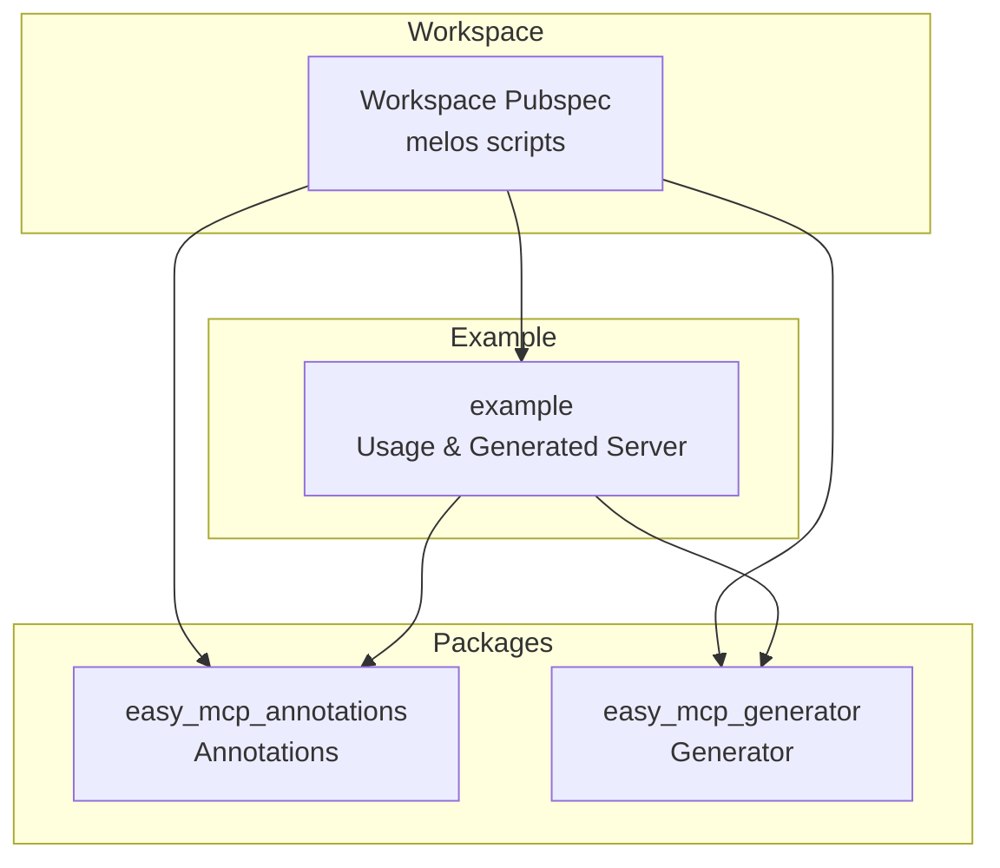
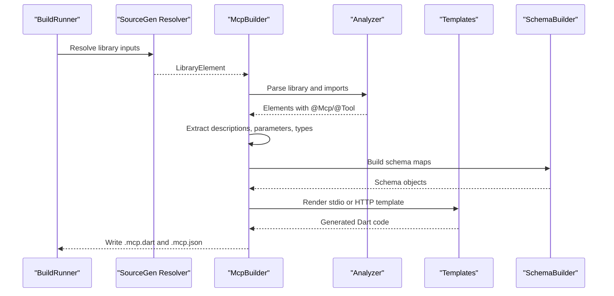
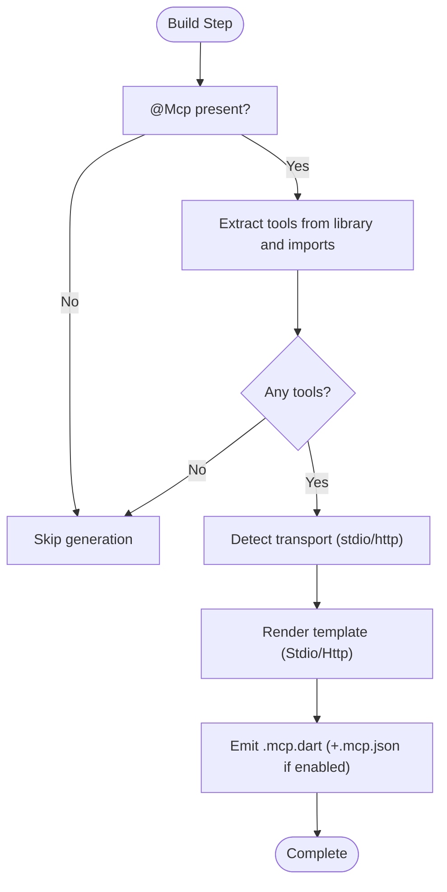
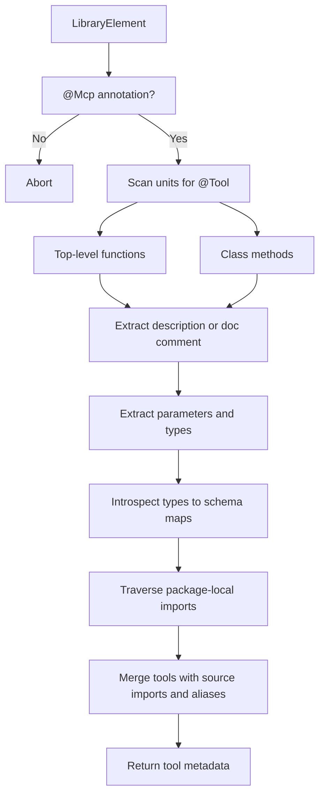
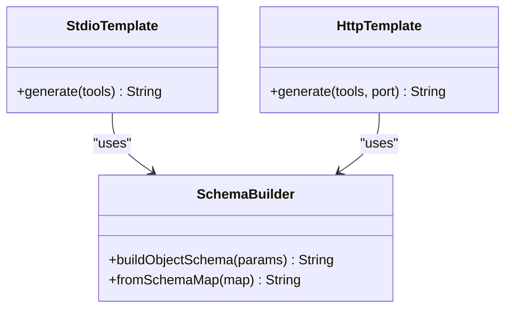
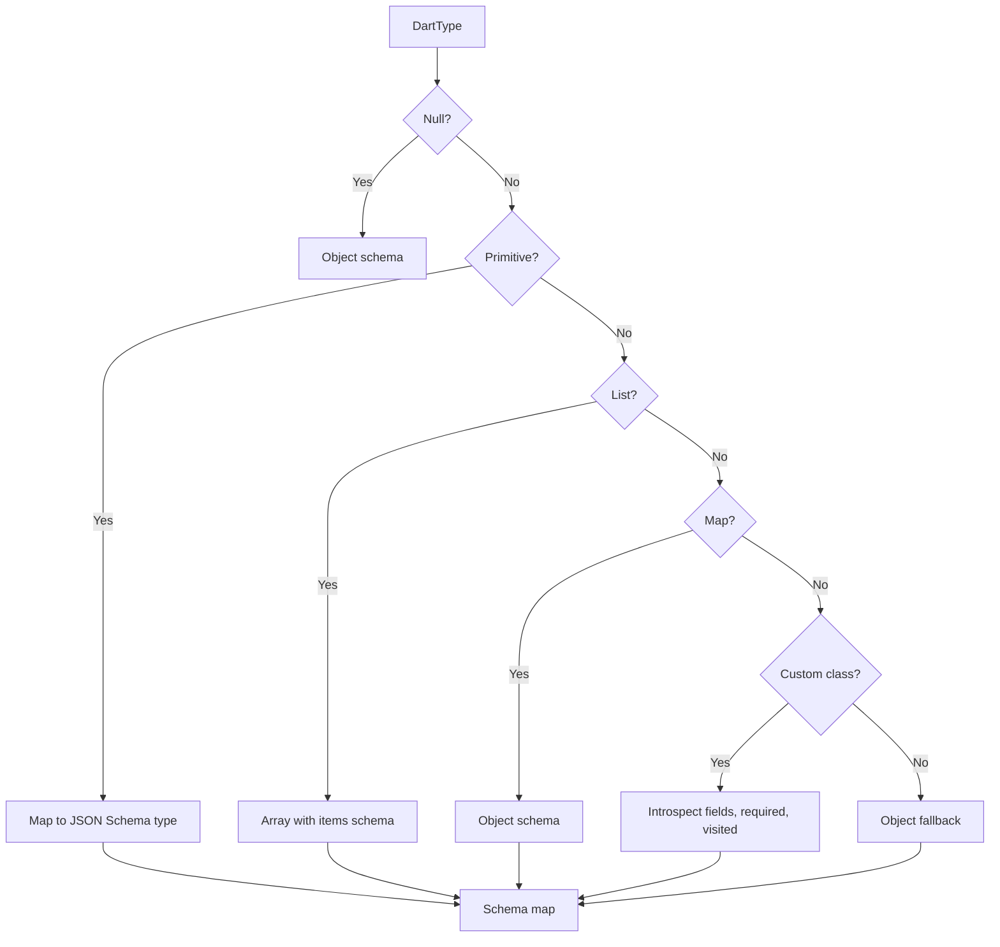
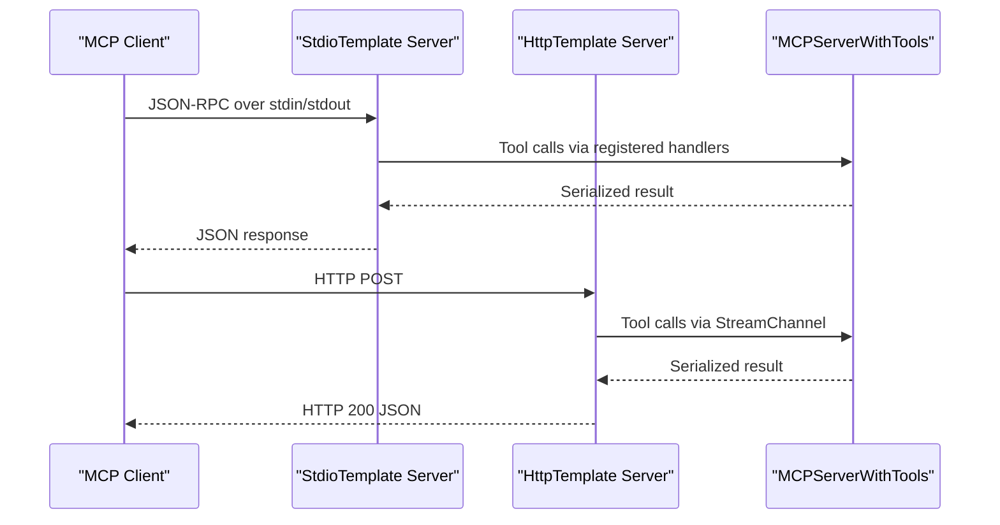
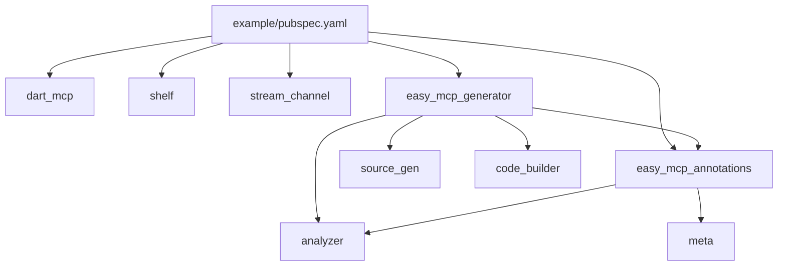

# Code Generation Workflow

<cite>
**Referenced Files in This Document**
- [README.md](file://README.md)
- [pubspec.yaml](file://pubspec.yaml)
- [packages/easy_mcp_annotations/pubspec.yaml](file://packages/easy_mcp_annotations/pubspec.yaml)
- [packages/easy_mcp_generator/pubspec.yaml](file://packages/easy_mcp_generator/pubspec.yaml)
- [packages/easy_mcp_annotations/lib/mcp_annotations.dart](file://packages/easy_mcp_annotations/lib/mcp_annotations.dart)
- [packages/easy_mcp_generator/lib/mcp_generator.dart](file://packages/easy_mcp_generator/lib/mcp_generator.dart)
- [packages/easy_mcp_generator/lib/builder/mcp_builder.dart](file://packages/easy_mcp_generator/lib/builder/mcp_builder.dart)
- [packages/easy_mcp_generator/lib/builder/templates.dart](file://packages/easy_mcp_generator/lib/builder/templates.dart)
- [packages/easy_mcp_generator/lib/builder/schema_builder.dart](file://packages/easy_mcp_generator/lib/builder/schema_builder.dart)
- [packages/easy_mcp_generator/lib/builder/doc_extractor.dart](file://packages/easy_mcp_generator/lib/builder/doc_extractor.dart)
- [packages/easy_mcp_generator/build.yaml](file://packages/easy_mcp_generator/build.yaml)
- [example/pubspec.yaml](file://example/pubspec.yaml)
- [example/README.md](file://example/README.md)
- [example/bin/example.dart](file://example/bin/example.dart)
- [example/bin/example.mcp.dart](file://example/bin/example.mcp.dart)
- [example/lib/src/user_store.dart](file://example/lib/src/user_store.dart)
- [example/lib/src/todo_store.dart](file://example/lib/src/todo_store.dart)
</cite>

## Table of Contents
1. [Introduction](#introduction)
2. [Project Structure](#project-structure)
3. [Core Components](#core-components)
4. [Architecture Overview](#architecture-overview)
5. [Detailed Component Analysis](#detailed-component-analysis)
6. [Dependency Analysis](#dependency-analysis)
7. [Performance Considerations](#performance-considerations)
8. [Troubleshooting Guide](#troubleshooting-guide)
9. [Conclusion](#conclusion)
10. [Appendices](#appendices)

## Introduction
This document explains the Easy MCP code generation workflow that transforms annotated Dart functions into executable Model Context Protocol (MCP) servers. It covers the build system integration using build_runner and source_gen, AST analysis with dart:analyzer, template-based code generation, dual transport generation (stdio and HTTP), schema generation from Dart types, and the end-to-end build pipeline. It also documents how the generated servers integrate with the dart_mcp runtime and provides guidance for build configuration, watch mode, and troubleshooting.

## Project Structure
The workspace is organized as a Dart package with two primary packages and an example application:
- easy_mcp_annotations: Defines the @Mcp and @Tool annotations used to mark entry points and tools.
- easy_mcp_generator: Implements the build_runner generator that parses annotated code and emits MCP server implementations.
- example: Demonstrates usage of annotations and generated servers, including stdio transport and tool discovery across imported libraries.



**Diagram sources**
- [pubspec.yaml:1-64](file://pubspec.yaml#L1-L64)
- [packages/easy_mcp_annotations/pubspec.yaml:1-28](file://packages/easy_mcp_annotations/pubspec.yaml#L1-L28)
- [packages/easy_mcp_generator/pubspec.yaml:1-34](file://packages/easy_mcp_generator/pubspec.yaml#L1-L34)
- [example/pubspec.yaml:1-22](file://example/pubspec.yaml#L1-L22)

**Section sources**
- [pubspec.yaml:1-64](file://pubspec.yaml#L1-L64)
- [README.md:1-120](file://README.md#L1-L120)

## Core Components
- Annotations: @Mcp controls transport mode and optional JSON metadata generation; @Tool marks functions as MCP tools and supplies descriptions/icons.
- Generator: A build_runner builder that uses analyzer to discover annotated functions across the library and its package-local imports, then renders templates for stdio or HTTP transports.
- Templates: Two server templates (stdio and HTTP) that emit complete MCP servers using dart_mcp, including tool registration, parameter extraction, and serialization.
- Schema Builder: Converts Dart type metadata into dart_mcp Schema expressions and JSON Schema-compatible structures.
- Doc Extractor: Provides placeholder logic for extracting descriptions from doc comments (future analyzer integration planned).

Key responsibilities:
- AST analysis: Scans libraries and imports to collect @Tool-annotated methods and their metadata.
- Template rendering: Produces server code with imports, tool registrations, and handler methods.
- Schema generation: Builds JSON Schema and dart_mcp Schema objects from parameter introspection.
- Dual transport: Adapts templates to stdio (JSON-RPC over stdin/stdout) and HTTP (Shelf-based).

**Section sources**
- [packages/easy_mcp_annotations/lib/mcp_annotations.dart:6-107](file://packages/easy_mcp_annotations/lib/mcp_annotations.dart#L6-L107)
- [packages/easy_mcp_generator/lib/builder/mcp_builder.dart:12-567](file://packages/easy_mcp_generator/lib/builder/mcp_builder.dart#L12-L567)
- [packages/easy_mcp_generator/lib/builder/templates.dart:1-578](file://packages/easy_mcp_generator/lib/builder/templates.dart#L1-L578)
- [packages/easy_mcp_generator/lib/builder/schema_builder.dart:1-99](file://packages/easy_mcp_generator/lib/builder/schema_builder.dart#L1-L99)
- [packages/easy_mcp_generator/lib/builder/doc_extractor.dart:1-106](file://packages/easy_mcp_generator/lib/builder/doc_extractor.dart#L1-L106)

## Architecture Overview
The generator integrates with build_runner and source_gen to transform annotated Dart code into runnable MCP servers. The process involves:
- Discovery: Analyzer locates libraries and imports annotated with @Mcp and collects @Tool methods.
- Metadata extraction: Descriptions, parameters, and types are extracted; doc comments are used when descriptions are missing.
- Schema generation: Dart types are introspected to produce JSON Schema and dart_mcp Schema objects.
- Template rendering: Based on transport mode, stdio or HTTP templates render complete server code.
- Emission: The generator writes .mcp.dart and optionally .mcp.json artifacts.



**Diagram sources**
- [packages/easy_mcp_generator/lib/builder/mcp_builder.dart:18-52](file://packages/easy_mcp_generator/lib/builder/mcp_builder.dart#L18-L52)
- [packages/easy_mcp_generator/lib/builder/templates.dart:6-175](file://packages/easy_mcp_generator/lib/builder/templates.dart#L6-L175)
- [packages/easy_mcp_generator/lib/builder/schema_builder.dart:29-98](file://packages/easy_mcp_generator/lib/builder/schema_builder.dart#L29-L98)

## Detailed Component Analysis

### Annotations and Transport Modes
- @Mcp supports transport selection (stdio or http) and optional JSON metadata generation.
- @Tool annotates methods as MCP tools, with optional description and icons; falls back to doc comments if description is absent.

```mermaid
classDiagram
class Mcp {
+McpTransport transport
+bool generateJson
}
class Tool {
+String? description
+String[]? icons
}
enum McpTransport {
+stdio
+http
}
Mcp --> McpTransport : "uses"
```

**Diagram sources**
- [packages/easy_mcp_annotations/lib/mcp_annotations.dart:39-56](file://packages/easy_mcp_annotations/lib/mcp_annotations.dart#L39-L56)
- [packages/easy_mcp_annotations/lib/mcp_annotations.dart:80-106](file://packages/easy_mcp_annotations/lib/mcp_annotations.dart#L80-L106)
- [packages/easy_mcp_annotations/lib/mcp_annotations.dart:9-19](file://packages/easy_mcp_annotations/lib/mcp_annotations.dart#L9-L19)

**Section sources**
- [packages/easy_mcp_annotations/lib/mcp_annotations.dart:6-107](file://packages/easy_mcp_annotations/lib/mcp_annotations.dart#L6-L107)
- [README.md:55-84](file://README.md#L55-L84)

### Build Pipeline Stages
- Analysis: The builder checks if the library has @Mcp, enumerates tools from the library and package-local imports, and derives source aliases to avoid naming conflicts.
- Template Rendering: Based on transport, the stdio or HTTP template is rendered with imports, tool registrations, and handler methods.
- Code Emission: The generator writes .mcp.dart and optionally .mcp.json artifacts.
- Compilation: The emitted server integrates with dart_mcp and can be executed directly.



**Diagram sources**
- [packages/easy_mcp_generator/lib/builder/mcp_builder.dart:18-52](file://packages/easy_mcp_generator/lib/builder/mcp_builder.dart#L18-L52)
- [packages/easy_mcp_generator/lib/builder/templates.dart:6-175](file://packages/easy_mcp_generator/lib/builder/templates.dart#L6-L175)

**Section sources**
- [packages/easy_mcp_generator/lib/builder/mcp_builder.dart:18-52](file://packages/easy_mcp_generator/lib/builder/mcp_builder.dart#L18-L52)
- [packages/easy_mcp_generator/build.yaml:1-12](file://packages/easy_mcp_generator/build.yaml#L1-L12)

### AST Analysis Phase
The builder uses analyzer to:
- Verify the library is annotated with @Mcp.
- Discover @Tool-annotated top-level functions and class methods.
- Extract descriptions from @Tool or doc comments.
- Inspect parameter types and build schema maps for JSON Schema and dart_mcp Schema.
- Traverse package-local imports to aggregate tools from multiple libraries.



**Diagram sources**
- [packages/easy_mcp_generator/lib/builder/mcp_builder.dart:54-166](file://packages/easy_mcp_generator/lib/builder/mcp_builder.dart#L54-L166)
- [packages/easy_mcp_generator/lib/builder/mcp_builder.dart:228-411](file://packages/easy_mcp_generator/lib/builder/mcp_builder.dart#L228-L411)

**Section sources**
- [packages/easy_mcp_generator/lib/builder/mcp_builder.dart:54-166](file://packages/easy_mcp_generator/lib/builder/mcp_builder.dart#L54-L166)
- [packages/easy_mcp_generator/lib/builder/mcp_builder.dart:228-411](file://packages/easy_mcp_generator/lib/builder/mcp_builder.dart#L228-L411)

### Template-Based Code Generation
The generator renders two templates:
- StdioTemplate: Emits a server that uses dart_mcp stdio transport, registers tools, and handles parameter extraction and serialization.
- HttpTemplate: Emits a Shelf-based HTTP server that bridges HTTP requests to the MCP server via a StreamChannel.

Both templates:
- Import custom List inner types when needed.
- Import source libraries with unique aliases to prevent collisions.
- Register tools with input schemas derived from parameter introspection.
- Generate handler methods that extract arguments, convert List parameters with custom inner types, call the underlying functions, and serialize results.



**Diagram sources**
- [packages/easy_mcp_generator/lib/builder/templates.dart:6-175](file://packages/easy_mcp_generator/lib/builder/templates.dart#L6-L175)
- [packages/easy_mcp_generator/lib/builder/templates.dart:269-486](file://packages/easy_mcp_generator/lib/builder/templates.dart#L269-L486)
- [packages/easy_mcp_generator/lib/builder/schema_builder.dart:29-98](file://packages/easy_mcp_generator/lib/builder/schema_builder.dart#L29-L98)

**Section sources**
- [packages/easy_mcp_generator/lib/builder/templates.dart:6-175](file://packages/easy_mcp_generator/lib/builder/templates.dart#L6-L175)
- [packages/easy_mcp_generator/lib/builder/templates.dart:269-486](file://packages/easy_mcp_generator/lib/builder/templates.dart#L269-L486)

### Schema Generation from Dart Types
The generator builds JSON Schema-compatible structures and dart_mcp Schema expressions:
- Primitive types map to JSON Schema types (integer, number, string, boolean).
- Lists and Maps are handled with appropriate item/object semantics.
- Custom classes are introspected to produce object schemas with properties and required fields.
- Nullable types are supported; cycles are detected to avoid infinite recursion.



**Diagram sources**
- [packages/easy_mcp_generator/lib/builder/mcp_builder.dart:307-411](file://packages/easy_mcp_generator/lib/builder/mcp_builder.dart#L307-L411)
- [packages/easy_mcp_generator/lib/builder/schema_builder.dart:29-98](file://packages/easy_mcp_generator/lib/builder/schema_builder.dart#L29-L98)

**Section sources**
- [packages/easy_mcp_generator/lib/builder/mcp_builder.dart:307-411](file://packages/easy_mcp_generator/lib/builder/mcp_builder.dart#L307-L411)
- [packages/easy_mcp_generator/lib/builder/schema_builder.dart:1-99](file://packages/easy_mcp_generator/lib/builder/schema_builder.dart#L1-L99)

### Dual Transport Generation
- Stdio transport: The stdio template creates a server that uses dart_mcp’s stdio channel, registers tools, and serializes results to JSON.
- HTTP transport: The HTTP template sets up a Shelf server that forwards HTTP requests to the MCP server via a StreamChannel, returning JSON responses.



**Diagram sources**
- [packages/easy_mcp_generator/lib/builder/templates.dart:133-174](file://packages/easy_mcp_generator/lib/builder/templates.dart#L133-L174)
- [packages/easy_mcp_generator/lib/builder/templates.dart:398-486](file://packages/easy_mcp_generator/lib/builder/templates.dart#L398-L486)

**Section sources**
- [packages/easy_mcp_generator/lib/builder/templates.dart:6-175](file://packages/easy_mcp_generator/lib/builder/templates.dart#L6-L175)
- [packages/easy_mcp_generator/lib/builder/templates.dart:269-486](file://packages/easy_mcp_generator/lib/builder/templates.dart#L269-L486)

### Generated Code Structure and Integration with dart_mcp
Generated servers:
- Import dart_mcp and transport-specific packages (stdio or shelf).
- Import source libraries with aliases to avoid naming conflicts.
- Define a main function that starts the server on the chosen transport.
- Provide a base class extending MCPServer with ToolsSupport, registering tools and their input schemas.
- Include handler methods that extract parameters, convert List parameters with custom inner types, call the underlying functions, and serialize results.

Integration highlights:
- The generated server uses dart_mcp’s MCPServer and ToolsSupport to register tools and handle calls.
- Serialization uses JSON encoding for lists and objects with a fallback to toString for unknown types.

**Section sources**
- [example/README.md:224-301](file://example/README.md#L224-L301)
- [example/bin/example.mcp.dart](file://example/bin/example.mcp.dart)

## Dependency Analysis
The generator depends on analyzer, source_gen, code_builder, and the annotations package. The example depends on dart_mcp, shelf, stream_channel, and the generator.



**Diagram sources**
- [example/pubspec.yaml:11-22](file://example/pubspec.yaml#L11-L22)
- [packages/easy_mcp_generator/pubspec.yaml:10-18](file://packages/easy_mcp_generator/pubspec.yaml#L10-L18)
- [packages/easy_mcp_annotations/pubspec.yaml:11-13](file://packages/easy_mcp_annotations/pubspec.yaml#L11-L13)

**Section sources**
- [example/pubspec.yaml:11-22](file://example/pubspec.yaml#L11-L22)
- [packages/easy_mcp_generator/pubspec.yaml:10-18](file://packages/easy_mcp_generator/pubspec.yaml#L10-L18)
- [packages/easy_mcp_annotations/pubspec.yaml:11-13](file://packages/easy_mcp_annotations/pubspec.yaml#L11-L13)

## Performance Considerations
- Minimize unnecessary imports: The generator deduplicates List inner-type imports and source imports with aliases to reduce overhead.
- Efficient schema building: SchemaBuilder constructs object schemas with required fields and nested arrays/maps without redundant allocations.
- Type introspection: The introspection avoids cycles by tracking visited types, preventing exponential expansion for recursive structures.
- Transport choice: Stdio transport is lightweight for CLI usage; HTTP transport adds overhead but enables web-based clients.

## Troubleshooting Guide
Common issues and resolutions:
- No tools generated: Ensure the library has @Mcp and contains @Tool-annotated methods. The builder only processes libraries with @Mcp.
- Missing imports in generated code: Confirm that package-local imports are used so the generator can traverse them; non-package imports are skipped.
- Incorrect parameter types: Verify that parameter types are resolvable; custom classes must be importable and not private.
- HTTP server not responding: Check that the HTTP template is selected via @Mcp(transport: McpTransport.http) and that the port is reachable.
- JSON metadata not generated: Enable JSON generation via @Mcp(generateJson: true) and rebuild.
- Watch mode not triggering: Use the melos script to run build_runner watch for the workspace; ensure changes are saved and the watcher is active.

**Section sources**
- [packages/easy_mcp_generator/lib/builder/mcp_builder.dart:27-33](file://packages/easy_mcp_generator/lib/builder/mcp_builder.dart#L27-L33)
- [packages/easy_mcp_generator/lib/builder/mcp_builder.dart:134-166](file://packages/easy_mcp_generator/lib/builder/mcp_builder.dart#L134-L166)
- [pubspec.yaml:36-38](file://pubspec.yaml#L36-L38)

## Conclusion
The Easy MCP code generation workflow seamlessly converts annotated Dart functions into robust MCP servers. By leveraging analyzer for AST analysis, source_gen for code emission, and template-driven rendering, it supports both stdio and HTTP transports while generating accurate JSON schemas and integrating cleanly with dart_mcp. The melos-based build scripts simplify development, watch mode, and regeneration, enabling rapid iteration on MCP tool implementations.

## Appendices

### Build Configuration and Commands
- Install dependencies and run tasks via melos scripts.
- Build: runs build_runner to generate .mcp.dart and .mcp.json.
- Watch: continuously regenerates code on changes.
- Clean: clears generated outputs.

**Section sources**
- [pubspec.yaml:35-38](file://pubspec.yaml#L35-L38)

### Example Usage and Generated Artifacts
- The example demonstrates @Mcp on the entry point and @Tool on static methods across stores.
- The generator aggregates tools from the entry library and its package-local imports.
- The generated server integrates with dart_mcp and can be executed directly.

**Section sources**
- [example/README.md:13-75](file://example/README.md#L13-L75)
- [example/bin/example.dart](file://example/bin/example.dart)
- [example/lib/src/user_store.dart](file://example/lib/src/user_store.dart)
- [example/lib/src/todo_store.dart](file://example/lib/src/todo_store.dart)