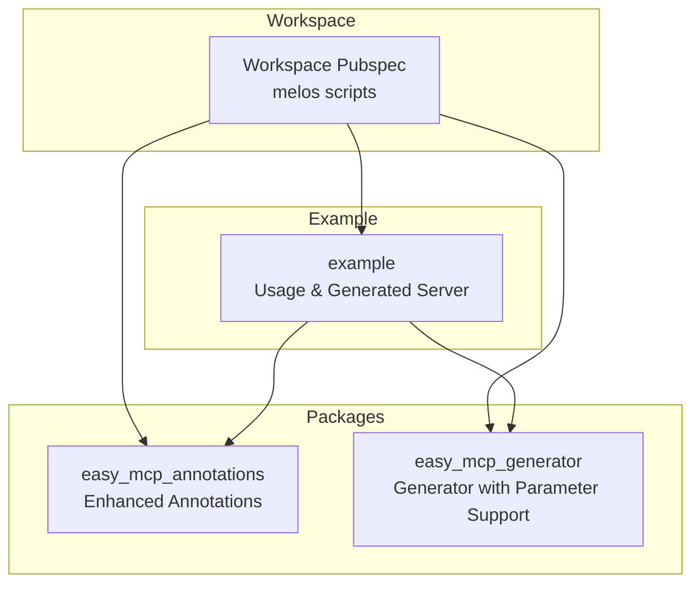
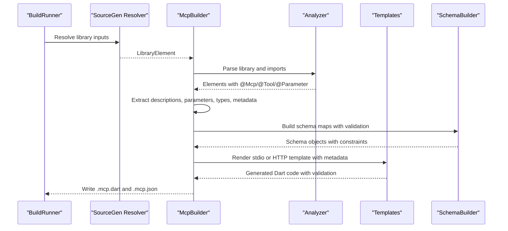
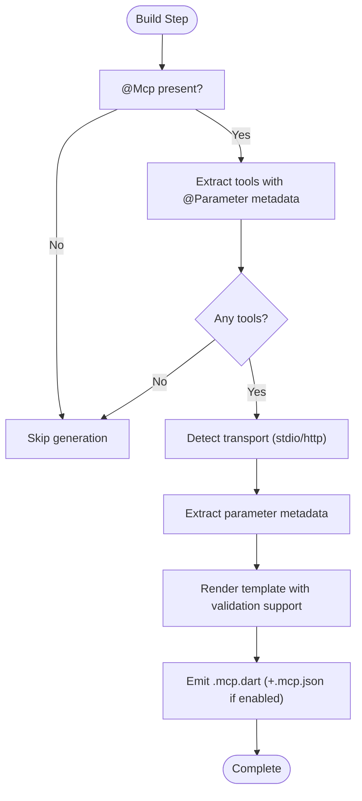
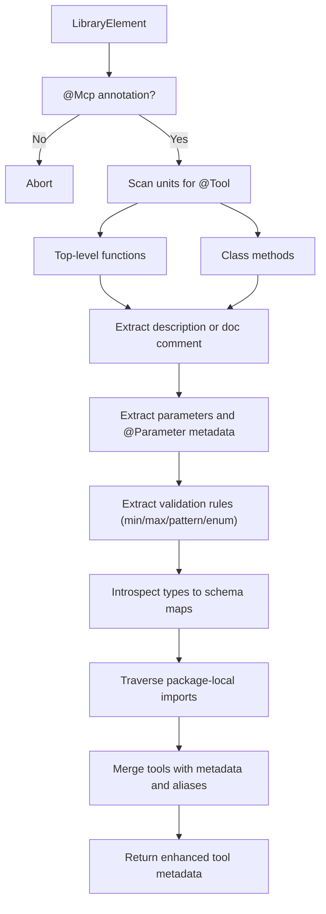
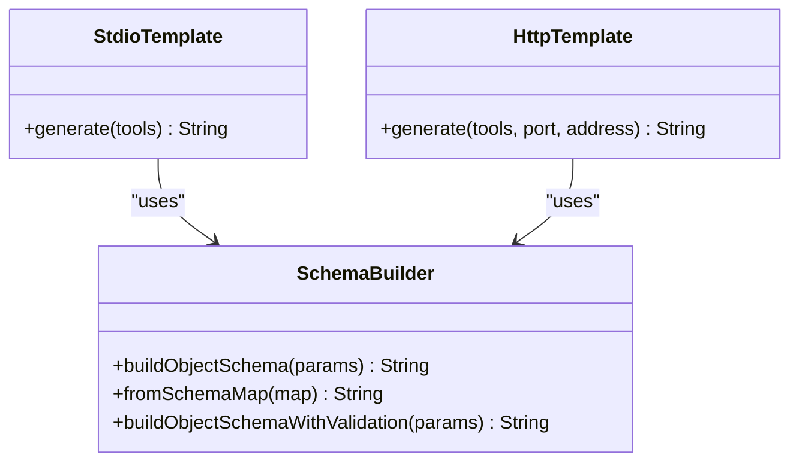
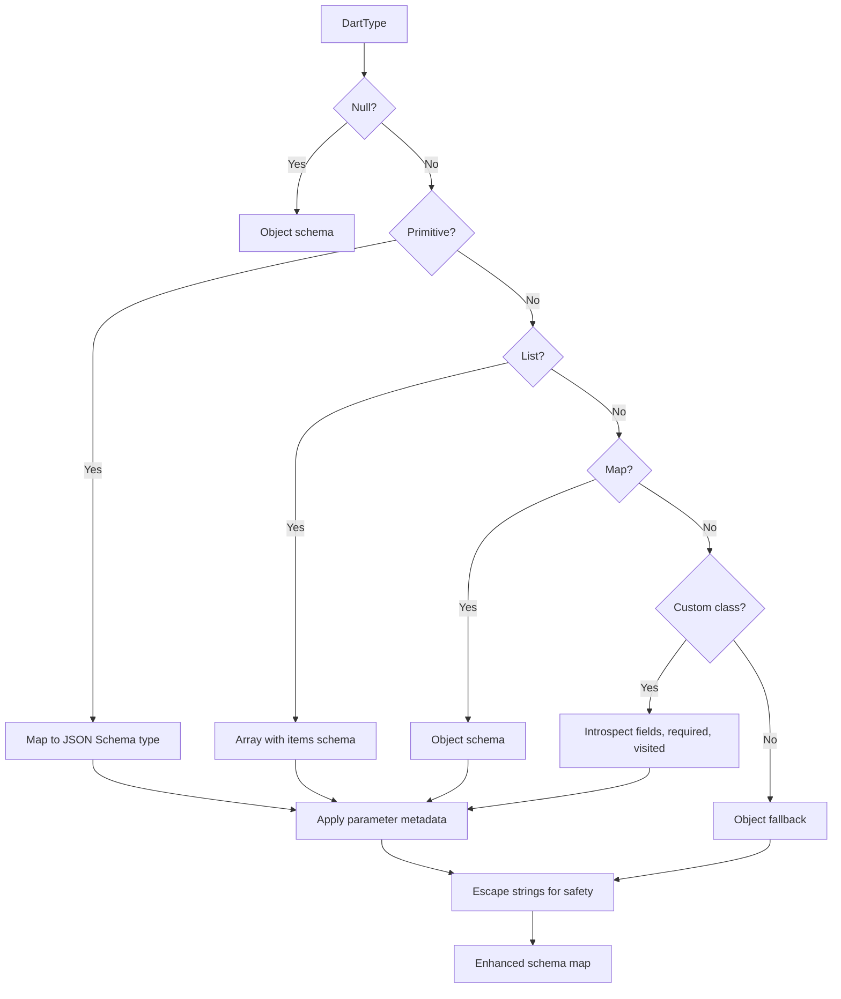
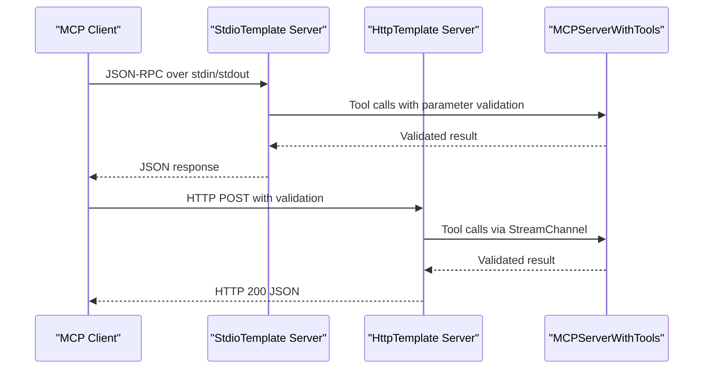
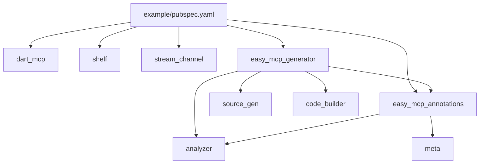

# Code Generation Workflow

<cite>
**Referenced Files in This Document**
- [README.md](file://README.md)
- [pubspec.yaml](file://pubspec.yaml)
- [packages/easy_mcp_annotations/pubspec.yaml](file://packages/easy_mcp_annotations/pubspec.yaml)
- [packages/easy_mcp_generator/pubspec.yaml](file://packages/easy_mcp_generator/pubspec.yaml)
- [packages/easy_mcp_annotations/lib/mcp_annotations.dart](file://packages/easy_mcp_annotations/lib/mcp_annotations.dart)
- [packages/easy_mcp_generator/lib/mcp_generator.dart](file://packages/easy_mcp_generator/lib/mcp_generator.dart)
- [packages/easy_mcp_generator/lib/builder/mcp_builder.dart](file://packages/easy_mcp_generator/lib/builder/mcp_builder.dart)
- [packages/easy_mcp_generator/lib/builder/templates.dart](file://packages/easy_mcp_generator/lib/builder/templates.dart)
- [packages/easy_mcp_generator/lib/builder/schema_builder.dart](file://packages/easy_mcp_generator/lib/builder/schema_builder.dart)
- [packages/easy_mcp_generator/lib/builder/doc_extractor.dart](file://packages/easy_mcp_generator/lib/builder/doc_extractor.dart)
- [packages/easy_mcp_generator/build.yaml](file://packages/easy_mcp_generator/build.yaml)
- [example/pubspec.yaml](file://example/pubspec.yaml)
- [example/README.md](file://example/README.md)
- [example/bin/example.dart](file://example/bin/example.dart)
- [example/bin/example.mcp.dart](file://example/bin/example.mcp.dart)
- [example/lib/src/user_store.dart](file://example/lib/src/user_store.dart)
- [example/lib/src/todo_store.dart](file://example/lib/src/todo_store.dart)
- [example/lib/src/user.dart](file://example/lib/src/user.dart)
- [example/lib/src/todo.dart](file://example/lib/src/todo.dart)
</cite>

## Update Summary
**Changes Made**
- Enhanced @Parameter annotation integration with comprehensive metadata extraction
- Improved parameter metadata system with validation features (min/max, pattern, enum values)
- Added string escaping and schema corruption prevention mechanisms
- Updated schema generation to support rich parameter descriptions and examples
- Enhanced template rendering to incorporate parameter metadata into generated servers

## Table of Contents
1. [Introduction](#introduction)
2. [Project Structure](#project-structure)
3. [Core Components](#core-components)
4. [Architecture Overview](#architecture-overview)
5. [Detailed Component Analysis](#detailed-component-analysis)
6. [Dependency Analysis](#dependency-analysis)
7. [Performance Considerations](#performance-considerations)
8. [Troubleshooting Guide](#troubleshooting-guide)
9. [Conclusion](#conclusion)
10. [Appendices](#appendices)

## Introduction
This document explains the Easy MCP code generation workflow that transforms annotated Dart functions into executable Model Context Protocol (MCP) servers. The workflow has been enhanced with comprehensive @Parameter annotation support, improved metadata extraction processes, and robust validation features. It covers the build system integration using build_runner and source_gen, AST analysis with dart:analyzer, template-based code generation, dual transport generation (stdio and HTTP), schema generation from Dart types, and the end-to-end build pipeline. It also documents how the generated servers integrate with the dart_mcp runtime and provides guidance for build configuration, watch mode, and troubleshooting.

## Project Structure
The workspace is organized as a Dart package with two primary packages and an example application:
- easy_mcp_annotations: Defines the @Mcp, @Tool, and @Parameter annotations used to mark entry points, tools, and parameter metadata.
- easy_mcp_generator: Implements the build_runner generator that parses annotated code and emits MCP server implementations with rich parameter metadata.
- example: Demonstrates usage of annotations including @Parameter for validation and enhancement features, showcasing stdio transport and tool discovery across imported libraries.



**Diagram sources**
- [pubspec.yaml:1-64](file://pubspec.yaml#L1-L64)
- [packages/easy_mcp_annotations/pubspec.yaml:1-28](file://packages/easy_mcp_annotations/pubspec.yaml#L1-L28)
- [packages/easy_mcp_generator/pubspec.yaml:1-34](file://packages/easy_mcp_generator/pubspec.yaml#L1-L34)
- [example/pubspec.yaml:1-22](file://example/pubspec.yaml#L1-L22)

**Section sources**
- [pubspec.yaml:1-64](file://pubspec.yaml#L1-L64)
- [README.md:1-120](file://README.md#L1-L120)

## Core Components
- **Enhanced Annotations**: @Mcp controls transport mode and optional JSON metadata generation; @Tool marks functions as MCP tools with descriptions/icons; @Parameter provides rich metadata for individual parameters including validation rules and UI enhancements.
- **Generator**: A build_runner builder that uses analyzer to discover annotated functions across the library and its package-local imports, then renders templates for stdio or HTTP transports with comprehensive parameter metadata.
- **Templates**: Two server templates (stdio and HTTP) that emit complete MCP servers using dart_mcp, including tool registration, parameter extraction, validation, and serialization with enhanced metadata support.
- **Schema Builder**: Converts Dart type metadata into dart_mcp Schema expressions and JSON Schema-compatible structures, now supporting rich parameter descriptions and validation constraints.
- **Doc Extractor**: Provides placeholder logic for extracting descriptions from doc comments (future analyzer integration planned).

Key responsibilities:
- **AST analysis**: Scans libraries and imports to collect @Tool-annotated methods and their parameter metadata including @Parameter annotations.
- **Metadata extraction**: Extracts comprehensive parameter metadata including titles, descriptions, validation rules, and examples from @Parameter annotations.
- **Template rendering**: Produces server code with imports, tool registrations, parameter validation, and handler methods with enhanced metadata support.
- **Schema generation**: Builds JSON Schema and dart_mcp Schema objects from parameter introspection with validation constraints.
- **Dual transport**: Adapts templates to stdio (JSON-RPC over stdin/stdout) and HTTP (Shelf-based) with parameter validation support.

**Section sources**
- [packages/easy_mcp_annotations/lib/mcp_annotations.dart:6-241](file://packages/easy_mcp_annotations/lib/mcp_annotations.dart#L6-L241)
- [packages/easy_mcp_generator/lib/builder/mcp_builder.dart:12-834](file://packages/easy_mcp_generator/lib/builder/mcp_builder.dart#L12-L834)
- [packages/easy_mcp_generator/lib/builder/templates.dart:1-630](file://packages/easy_mcp_generator/lib/builder/templates.dart#L1-L630)
- [packages/easy_mcp_generator/lib/builder/schema_builder.dart:1-195](file://packages/easy_mcp_generator/lib/builder/schema_builder.dart#L1-L195)
- [packages/easy_mcp_generator/lib/builder/doc_extractor.dart:1-106](file://packages/easy_mcp_generator/lib/builder/doc_extractor.dart#L1-L106)

## Architecture Overview
The generator integrates with build_runner and source_gen to transform annotated Dart code into runnable MCP servers with comprehensive parameter metadata support. The process involves:
- **Discovery**: Analyzer locates libraries and imports annotated with @Mcp and collects @Tool methods along with their @Parameter annotations.
- **Metadata extraction**: Descriptions, parameters, types, and rich parameter metadata are extracted; doc comments are used when descriptions are missing.
- **Schema generation**: Dart types are introspected to produce JSON Schema and dart_mcp Schema objects with validation constraints.
- **Template rendering**: Based on transport mode, stdio or HTTP templates render complete server code with parameter validation support.
- **Emission**: The generator writes .mcp.dart and optionally .mcp.json artifacts with enhanced metadata.



**Diagram sources**
- [packages/easy_mcp_generator/lib/builder/mcp_builder.dart:18-834](file://packages/easy_mcp_generator/lib/builder/mcp_builder.dart#L18-L834)
- [packages/easy_mcp_generator/lib/builder/templates.dart:6-630](file://packages/easy_mcp_generator/lib/builder/templates.dart#L6-L630)
- [packages/easy_mcp_generator/lib/builder/schema_builder.dart:29-195](file://packages/easy_mcp_generator/lib/builder/schema_builder.dart#L29-L195)

## Detailed Component Analysis

### Enhanced Annotations and Transport Modes
- @Mcp supports transport selection (stdio or http) and optional JSON metadata generation.
- @Tool annotates methods as MCP tools, with optional description and icons; falls back to doc comments if description is absent.
- **@Parameter** provides comprehensive metadata for individual parameters including titles, descriptions, validation rules, examples, and security considerations.

```mermaid
classDiagram
class Mcp {
+McpTransport transport
+bool generateJson
+int port
+String address
}
class Tool {
+String? description
+String[]? icons
}
class Parameter {
+String? title
+String? description
+Object? example
+num? minimum
+num? maximum
+String? pattern
+bool sensitive
+Object[]~? enumValues
}
enum McpTransport {
+stdio
+http
}
Mcp --> McpTransport : "uses"
```

**Diagram sources**
- [packages/easy_mcp_annotations/lib/mcp_annotations.dart:54-90](file://packages/easy_mcp_annotations/lib/mcp_annotations.dart#L54-L90)
- [packages/easy_mcp_annotations/lib/mcp_annotations.dart:114-140](file://packages/easy_mcp_annotations/lib/mcp_annotations.dart#L114-L140)
- [packages/easy_mcp_annotations/lib/mcp_annotations.dart:175-241](file://packages/easy_mcp_annotations/lib/mcp_annotations.dart#L175-L241)

**Section sources**
- [packages/easy_mcp_annotations/lib/mcp_annotations.dart:6-241](file://packages/easy_mcp_annotations/lib/mcp_annotations.dart#L6-L241)
- [README.md:55-84](file://README.md#L55-L84)

### Enhanced Build Pipeline Stages
- **Analysis**: The builder checks if the library has @Mcp, enumerates tools from the library and package-local imports, extracts @Parameter metadata, and derives source aliases to avoid naming conflicts.
- **Template Rendering**: Based on transport, the stdio or HTTP template is rendered with imports, tool registrations, parameter validation, and handler methods with enhanced metadata support.
- **Code Emission**: The generator writes .mcp.dart and optionally .mcp.json artifacts with comprehensive parameter metadata.
- **Compilation**: The emitted server integrates with dart_mcp and can be executed directly with parameter validation support.



**Diagram sources**
- [packages/easy_mcp_generator/lib/builder/mcp_builder.dart:18-834](file://packages/easy_mcp_generator/lib/builder/mcp_builder.dart#L18-L834)
- [packages/easy_mcp_generator/lib/builder/templates.dart:6-630](file://packages/easy_mcp_generator/lib/builder/templates.dart#L6-L630)

**Section sources**
- [packages/easy_mcp_generator/lib/builder/mcp_builder.dart:18-834](file://packages/easy_mcp_generator/lib/builder/mcp_builder.dart#L18-L834)
- [packages/easy_mcp_generator/build.yaml:1-12](file://packages/easy_mcp_generator/build.yaml#L1-L12)

### Enhanced AST Analysis Phase
The builder uses analyzer to:
- Verify the library is annotated with @Mcp.
- Discover @Tool-annotated top-level functions and class methods.
- Extract descriptions from @Tool or doc comments.
- **Extract @Parameter metadata** including titles, descriptions, validation rules, and examples.
- Inspect parameter types and build schema maps for JSON Schema and dart_mcp Schema with validation constraints.
- Traverse package-local imports to aggregate tools from multiple libraries.



**Diagram sources**
- [packages/easy_mcp_generator/lib/builder/mcp_builder.dart:79-182](file://packages/easy_mcp_generator/lib/builder/mcp_builder.dart#L79-L182)
- [packages/easy_mcp_generator/lib/builder/mcp_builder.dart:243-369](file://packages/easy_mcp_generator/lib/builder/mcp_builder.dart#L243-L369)
- [packages/easy_mcp_generator/lib/builder/mcp_builder.dart:285-369](file://packages/easy_mcp_generator/lib/builder/mcp_builder.dart#L285-L369)

**Section sources**
- [packages/easy_mcp_generator/lib/builder/mcp_builder.dart:79-182](file://packages/easy_mcp_generator/lib/builder/mcp_builder.dart#L79-L182)
- [packages/easy_mcp_generator/lib/builder/mcp_builder.dart:243-369](file://packages/easy_mcp_generator/lib/builder/mcp_builder.dart#L243-L369)

### Enhanced Template-Based Code Generation
The generator renders two templates with comprehensive parameter metadata support:
- **StdioTemplate**: Emits a server that uses dart_mcp stdio transport, registers tools with parameter validation, and handles parameter extraction, validation, and serialization.
- **HttpTemplate**: Emits a Shelf-based HTTP server that bridges HTTP requests to the MCP server via a StreamChannel, with parameter validation support.

Both templates now include:
- Import custom List inner types when needed.
- Import source libraries with unique aliases to prevent collisions.
- Register tools with input schemas derived from parameter introspection and validation metadata.
- Generate handler methods that extract arguments, validate parameters, convert List parameters with custom inner types, call the underlying functions, and serialize results.



**Diagram sources**
- [packages/easy_mcp_generator/lib/builder/templates.dart:15-630](file://packages/easy_mcp_generator/lib/builder/templates.dart#L15-L630)
- [packages/easy_mcp_generator/lib/builder/schema_builder.dart:29-195](file://packages/easy_mcp_generator/lib/builder/schema_builder.dart#L29-L195)

**Section sources**
- [packages/easy_mcp_generator/lib/builder/templates.dart:15-630](file://packages/easy_mcp_generator/lib/builder/templates.dart#L15-L630)
- [packages/easy_mcp_generator/lib/builder/templates.dart:282-630](file://packages/easy_mcp_generator/lib/builder/templates.dart#L282-L630)

### Enhanced Schema Generation from Dart Types
The generator builds JSON Schema-compatible structures and dart_mcp Schema expressions with comprehensive validation support:
- Primitive types map to JSON Schema types (integer, number, string, boolean) with enhanced metadata.
- Lists and Maps are handled with appropriate item/object semantics.
- Custom classes are introspected to produce object schemas with properties and required fields.
- **Parameter metadata is applied to enhance validation constraints** including titles, descriptions, min/max values, patterns, and enum restrictions.
- Nullable types are supported; cycles are detected to avoid infinite recursion.
- **String escaping prevents schema corruption** during metadata embedding.



**Diagram sources**
- [packages/easy_mcp_generator/lib/builder/mcp_builder.dart:415-521](file://packages/easy_mcp_generator/lib/builder/mcp_builder.dart#L415-L521)
- [packages/easy_mcp_generator/lib/builder/schema_builder.dart:29-195](file://packages/easy_mcp_generator/lib/builder/schema_builder.dart#L29-L195)

**Section sources**
- [packages/easy_mcp_generator/lib/builder/mcp_builder.dart:415-521](file://packages/easy_mcp_generator/lib/builder/mcp_builder.dart#L415-L521)
- [packages/easy_mcp_generator/lib/builder/schema_builder.dart:1-195](file://packages/easy_mcp_generator/lib/builder/schema_builder.dart#L1-L195)

### Enhanced Dual Transport Generation
- **Stdio transport**: The stdio template creates a server that uses dart_mcp's stdio channel, registers tools with parameter validation, and serializes results to JSON with metadata support.
- **HTTP transport**: The HTTP template sets up a Shelf server that forwards HTTP requests to the MCP server via a StreamChannel, returning JSON responses with parameter validation support.



**Diagram sources**
- [packages/easy_mcp_generator/lib/builder/templates.dart:133-189](file://packages/easy_mcp_generator/lib/builder/templates.dart#L133-L189)
- [packages/easy_mcp_generator/lib/builder/templates.dart:432-538](file://packages/easy_mcp_generator/lib/builder/templates.dart#L432-L538)

**Section sources**
- [packages/easy_mcp_generator/lib/builder/templates.dart:15-189](file://packages/easy_mcp_generator/lib/builder/templates.dart#L15-L189)
- [packages/easy_mcp_generator/lib/builder/templates.dart:282-538](file://packages/easy_mcp_generator/lib/builder/templates.dart#L282-L538)

### Enhanced Generated Code Structure and Integration with dart_mcp
Generated servers now include comprehensive parameter metadata support:
- Import dart_mcp and transport-specific packages (stdio or shelf).
- Import source libraries with aliases to avoid naming conflicts.
- Define a main function that starts the server on the chosen transport.
- Provide a base class extending MCPServer with ToolsSupport, registering tools and their input schemas with validation metadata.
- Include handler methods that extract parameters, validate them using enhanced metadata, convert List parameters with custom inner types, call the underlying functions, and serialize results.

Integration highlights:
- The generated server uses dart_mcp's MCPServer and ToolsSupport to register tools with parameter validation.
- **Serialization uses JSON encoding for lists and objects with enhanced metadata support**.
- **String escaping prevents schema corruption** during metadata embedding in generated code.

**Section sources**
- [example/README.md:224-301](file://example/README.md#L224-L301)
- [example/bin/example.mcp.dart](file://example/bin/example.mcp.dart)

## Dependency Analysis
The generator depends on analyzer, source_gen, code_builder, and the enhanced annotations package. The example depends on dart_mcp, shelf, stream_channel, and the generator.



**Diagram sources**
- [example/pubspec.yaml:11-22](file://example/pubspec.yaml#L11-L22)
- [packages/easy_mcp_generator/pubspec.yaml:10-18](file://packages/easy_mcp_generator/pubspec.yaml#L10-L18)
- [packages/easy_mcp_annotations/pubspec.yaml:11-13](file://packages/easy_mcp_annotations/pubspec.yaml#L11-L13)

**Section sources**
- [example/pubspec.yaml:11-22](file://example/pubspec.yaml#L11-L22)
- [packages/easy_mcp_generator/pubspec.yaml:10-18](file://packages/easy_mcp_generator/pubspec.yaml#L10-L18)
- [packages/easy_mcp_annotations/pubspec.yaml:11-13](file://packages/easy_mcp_annotations/pubspec.yaml#L11-L13)

## Performance Considerations
- **Minimize unnecessary imports**: The generator deduplicates List inner-type imports and source imports with aliases to reduce overhead.
- **Efficient schema building**: SchemaBuilder constructs object schemas with required fields, nested arrays/maps, and validation constraints without redundant allocations.
- **Type introspection**: The introspection avoids cycles by tracking visited types, preventing exponential expansion for recursive structures.
- **Transport choice**: Stdio transport is lightweight for CLI usage; HTTP transport adds overhead but enables web-based clients with validation support.
- **Metadata optimization**: Parameter metadata extraction is optimized to avoid redundant processing and ensure efficient template rendering.

## Troubleshooting Guide
Common issues and resolutions:
- **No tools generated**: Ensure the library has @Mcp and contains @Tool-annotated methods. The builder only processes libraries with @Mcp.
- **Missing imports in generated code**: Confirm that package-local imports are used so the generator can traverse them; non-package imports are skipped.
- **Incorrect parameter types**: Verify that parameter types are resolvable; custom classes must be importable and not private.
- **HTTP server not responding**: Check that the HTTP template is selected via @Mcp(transport: McpTransport.http) and that the port is reachable.
- **JSON metadata not generated**: Enable JSON generation via @Mcp(generateJson: true) and rebuild.
- **Watch mode not triggering**: Use the melos script to run build_runner watch for the workspace; ensure changes are saved and the watcher is active.
- **Parameter validation not working**: Ensure @Parameter annotations are properly formatted and contain valid validation rules.
- **String escaping issues**: The generator automatically escapes special characters in parameter metadata to prevent schema corruption.
- **Enum validation problems**: Verify that enumValues contain valid values matching the parameter type.

**Section sources**
- [packages/easy_mcp_generator/lib/builder/mcp_builder.dart:27-834](file://packages/easy_mcp_generator/lib/builder/mcp_builder.dart#L27-L834)
- [packages/easy_mcp_generator/lib/builder/mcp_builder.dart:134-182](file://packages/easy_mcp_generator/lib/builder/mcp_builder.dart#L134-L182)
- [pubspec.yaml:36-38](file://pubspec.yaml#L36-L38)

## Conclusion
The Easy MCP code generation workflow seamlessly converts annotated Dart functions into robust MCP servers with comprehensive parameter metadata support. By leveraging analyzer for AST analysis, source_gen for code emission, and template-driven rendering with enhanced @Parameter annotation support, it supports both stdio and HTTP transports while generating accurate JSON schemas, rich validation constraints, and integrating cleanly with dart_mcp. The melos-based build scripts simplify development, watch mode, and regeneration, enabling rapid iteration on MCP tool implementations with advanced validation features.

## Appendices

### Build Configuration and Commands
- Install dependencies and run tasks via melos scripts.
- Build: runs build_runner to generate .mcp.dart and .mcp.json with enhanced metadata.
- Watch: continuously regenerates code on changes with parameter validation support.
- Clean: clears generated outputs.

**Section sources**
- [pubspec.yaml:35-38](file://pubspec.yaml#L35-L38)

### Enhanced Example Usage and Generated Artifacts
- The example demonstrates @Mcp on the entry point, @Tool on static methods, and comprehensive @Parameter annotations for validation and UI enhancement.
- The generator aggregates tools from the entry library and its package-local imports with rich parameter metadata.
- The generated server integrates with dart_mcp and can be executed directly with parameter validation support.
- **Parameter metadata includes titles, descriptions, validation rules, and examples** for enhanced user experience.

**Section sources**
- [example/README.md:13-75](file://example/README.md#L13-L75)
- [example/bin/example.dart](file://example/bin/example.dart)
- [example/lib/src/user_store.dart](file://example/lib/src/user_store.dart)
- [example/lib/src/todo_store.dart](file://example/lib/src/todo_store.dart)
- [example/lib/src/user.dart](file://example/lib/src/user.dart)
- [example/lib/src/todo.dart](file://example/lib/src/todo.dart)

### Enhanced Parameter Metadata Features
The @Parameter annotation provides comprehensive metadata support:
- **Titles and descriptions** for enhanced UI presentation
- **Validation rules** including minimum/maximum values for numeric types
- **Pattern matching** for string validation using regular expressions
- **Enum restrictions** for constrained parameter values
- **Example values** to guide users and assist LLMs
- **Sensitive flag** for masking in logs and UI
- **Automatic string escaping** to prevent schema corruption

**Section sources**
- [packages/easy_mcp_annotations/lib/mcp_annotations.dart:175-241](file://packages/easy_mcp_annotations/lib/mcp_annotations.dart#L175-L241)
- [packages/easy_mcp_generator/lib/builder/mcp_builder.dart:285-369](file://packages/easy_mcp_generator/lib/builder/mcp_builder.dart#L285-L369)
- [packages/easy_mcp_generator/lib/builder/schema_builder.dart:110-195](file://packages/easy_mcp_generator/lib/builder/schema_builder.dart#L110-L195)