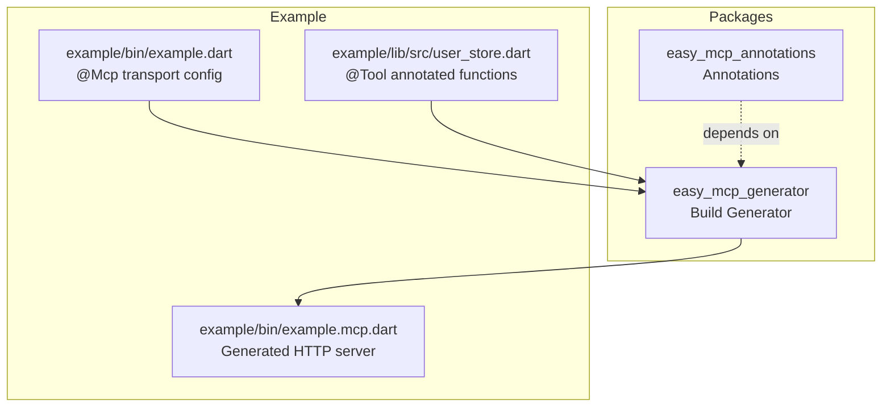
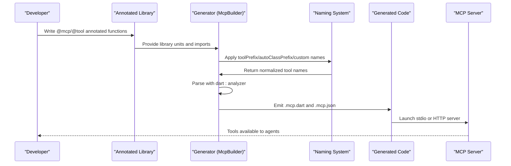
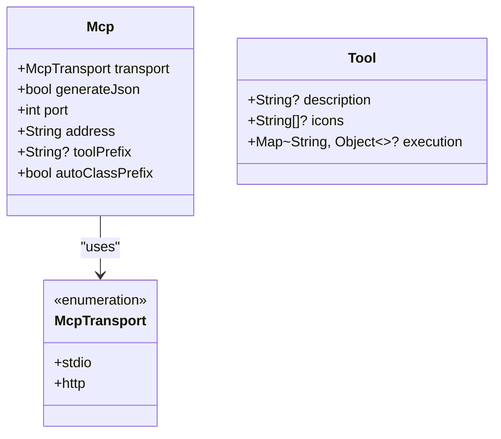
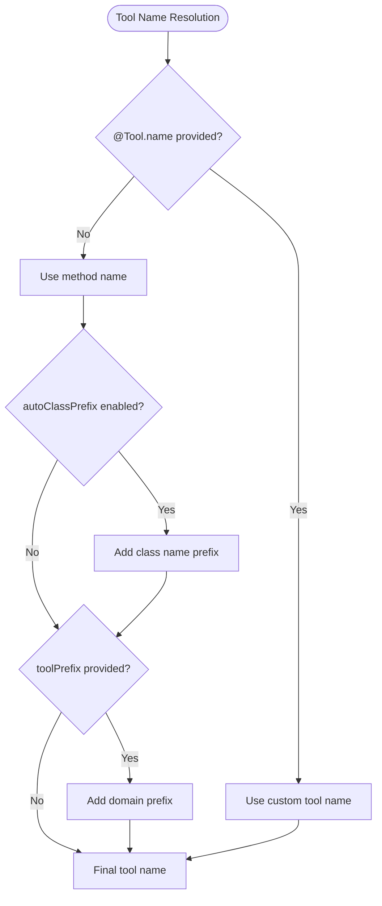
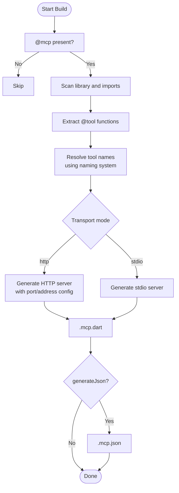
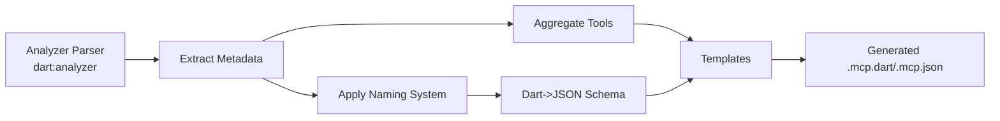
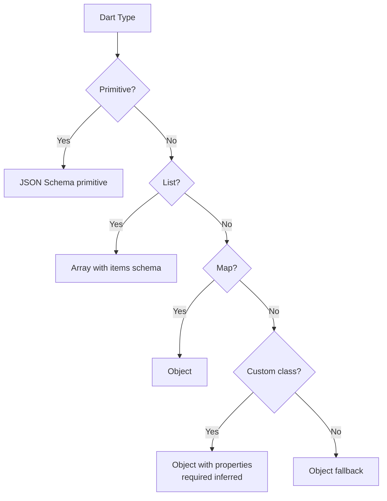
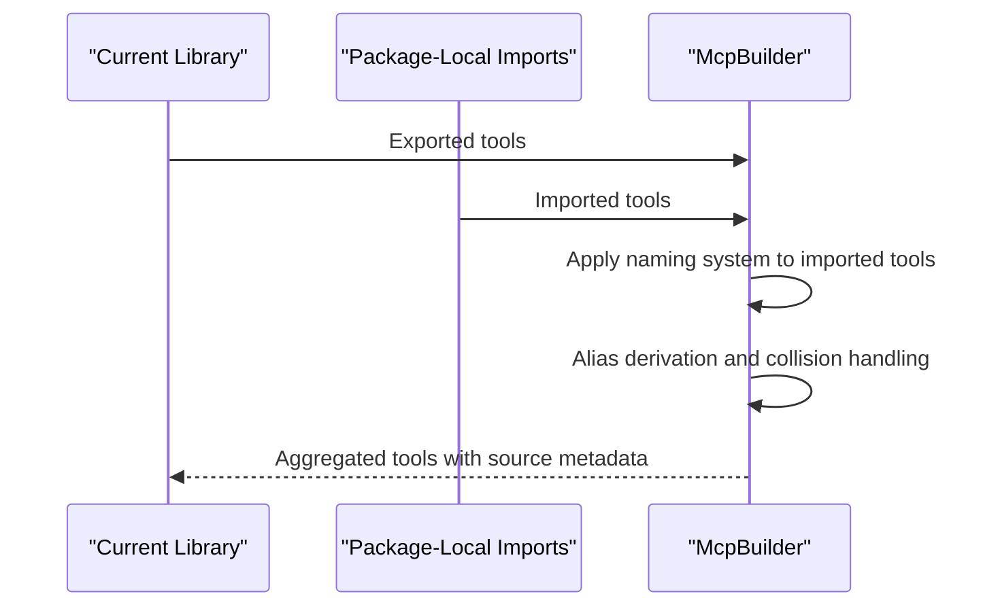
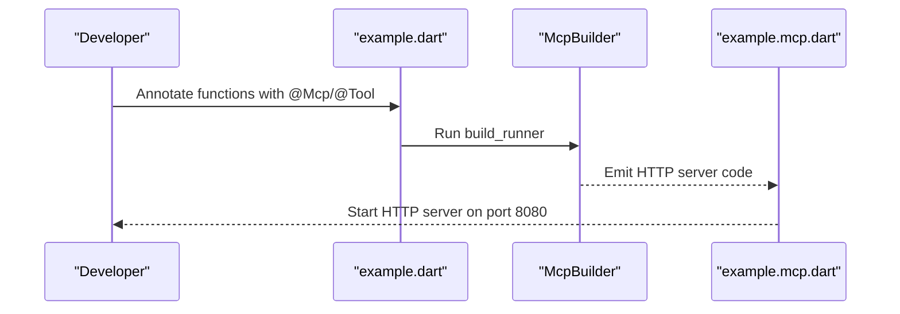
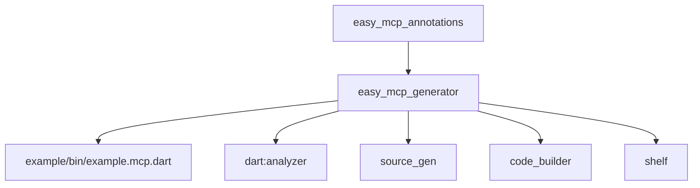

# Core Concepts

<cite>
**Referenced Files in This Document**
- [README.md](file://README.md)
- [pubspec.yaml](file://packages/easy_mcp_annotations/pubspec.yaml)
- [mcp_annotations.dart](file://packages/easy_mcp_annotations/lib/mcp_annotations.dart)
- [pubspec.yaml](file://packages/easy_mcp_generator/pubspec.yaml)
- [mcp_generator.dart](file://packages/easy_mcp_generator/lib/mcp_generator.dart)
- [mcp_builder.dart](file://packages/easy_mcp_generator/lib/builder/mcp_builder.dart)
- [templates.dart](file://packages/easy_mcp_generator/lib/builder/templates.dart)
- [example.dart](file://example/bin/example.dart)
- [example.mcp.dart](file://example/bin/example.mcp.dart)
- [user_store.dart](file://example/lib/src/user_store.dart)
- [todo_store.dart](file://example/lib/src/todo_store.dart)
- [todo.dart](file://example/lib/src/todo.dart)
- [user.dart](file://example/lib/src/user.dart)
</cite>

## Update Summary
**Changes Made**
- Enhanced documentation to reflect the new flexible tool naming system with `toolPrefix` and `autoClassPrefix` parameters
- Updated tool naming concepts section to explain prefix-based organization strategies
- Added comprehensive coverage of the naming priority system and tool organization best practices
- Expanded dual transport mode documentation with HTTP-specific configuration examples
- Improved code generation workflow documentation with naming system integration
- Enhanced type system integration documentation with List inner type handling
- Updated dependency analysis with current package specifications

## Table of Contents
1. [Introduction](#introduction)
2. [Project Structure](#project-structure)
3. [Core Components](#core-components)
4. [Architecture Overview](#architecture-overview)
5. [Detailed Component Analysis](#detailed-component-analysis)
6. [Dependency Analysis](#dependency-analysis)
7. [Performance Considerations](#performance-considerations)
8. [Troubleshooting Guide](#troubleshooting-guide)
9. [Conclusion](#conclusion)
10. [Appendices](#appendices)

## Introduction
This document explains the core concepts of Easy MCP, focusing on how the framework transforms annotated Dart functions into Model Context Protocol (MCP) servers. It covers:
- Model Context Protocol basics and its role in AI agent communication
- The annotation system using @mcp for transport configuration and @tool for tool metadata
- The code generation workflow from annotated functions to executable MCP servers
- Dual transport modes (stdio and HTTP) and their use cases
- AST-based parsing using dart:analyzer and the template-driven code generation system
- Type system integration, schema generation principles, and cross-library tool discovery
- **Enhanced tool naming system** with flexible prefix-based organization and automatic class-based namespaces
- Conceptual diagrams illustrating the relationship between annotations, build process, and generated code

## Project Structure
The repository is organized as a Dart workspace with two primary packages and an example application:
- easy_mcp_annotations: Defines the @mcp and @tool annotations used to mark functions for MCP exposure.
- easy_mcp_generator: Implements a build_runner generator that parses annotated code and produces MCP-compatible server code.
- example: Demonstrates usage by annotating functions and generating an HTTP server.

**Diagram sources**
- [mcp_annotations.dart:6-49](file://packages/easy_mcp_annotations/lib/mcp_annotations.dart#L6-L49)
- [mcp_builder.dart:12-52](file://packages/easy_mcp_generator/lib/builder/mcp_builder.dart#L12-L52)
- [example.dart:6-7](file://example/bin/example.dart#L6-L7)
- [user_store.dart:55-142](file://example/lib/src/user_store.dart#L55-L142)
- [example.mcp.dart:1-68](file://example/bin/example.mcp.dart#L1-L68)

**Section sources**
- [README.md:1-124](file://README.md#L1-L124)
- [pubspec.yaml:1-28](file://packages/easy_mcp_annotations/pubspec.yaml#L1-L28)
- [pubspec.yaml:1-34](file://packages/easy_mcp_generator/pubspec.yaml#L1-L34)

## Core Components
- Annotations:
  - @mcp controls transport mode (stdio or http) and optional JSON metadata generation flag.
  - @tool marks functions as MCP tools and supplies metadata such as description and icons.
  - **Enhanced naming system**: toolPrefix for custom domain prefixes and autoClassPrefix for automatic class-based namespaces.
- Generator:
  - Scans libraries and imports for @mcp and @tool annotations.
  - Extracts function signatures, parameter types, and doc comments.
  - **Integrates flexible naming system**: Applies toolPrefix, autoClassPrefix, and custom tool names in priority order.
  - Generates MCP-compatible server code and optionally JSON metadata.
- Example:
  - Demonstrates HTTP transport configuration and tool registration.

Key capabilities:
- AST-based parsing using dart:analyzer for reliable code extraction.
- Automatic schema generation mapping Dart types to JSON Schema.
- Cross-library tool discovery across package-local imports.
- Dual transport modes: stdio (JSON-RPC) and HTTP (Shelf).
- **Flexible tool naming with prefix-based organization and automatic class namespaces**.

**Section sources**
- [mcp_annotations.dart:6-49](file://packages/easy_mcp_annotations/lib/mcp_annotations.dart#L6-L49)
- [mcp_builder.dart:12-52](file://packages/easy_mcp_generator/lib/builder/mcp_builder.dart#L12-L52)
- [README.md:79-88](file://README.md#L79-L88)

## Architecture Overview
The Easy MCP pipeline consists of three stages:
1. Authoring: Developers annotate functions with @mcp and @tool, utilizing the flexible naming system.
2. Build: The generator scans the library and imports, extracts metadata, applies naming conventions, and produces server code.
3. Runtime: The generated server runs in the chosen transport mode and exposes tools to MCP clients.

**Diagram sources**
- [mcp_builder.dart:18-52](file://packages/easy_mcp_generator/lib/builder/mcp_builder.dart#L18-L52)
- [mcp_annotations.dart:25-48](file://packages/easy_mcp_annotations/lib/mcp_annotations.dart#L25-L48)
- [example.mcp.dart:17-68](file://example/bin/example.mcp.dart#L17-L68)

## Detailed Component Analysis

### Annotation System: @mcp and @tool
- @mcp:
  - transport: Selects stdio (JSON-RPC) or http (Shelf) mode.
  - generateJson: Controls whether to emit .mcp.json metadata.
  - port: HTTP server port configuration (default: 3000).
  - address: HTTP server bind address (default: '127.0.0.1').
  - **toolPrefix: Adds a custom prefix to all tool names in this scope**.
  - **autoClassPrefix: Automatically prefixes tool names with their class name**.
- @tool:
  - description: Overrides doc comment when present.
  - icons: Optional list of icon URLs.
  - execution: Reserved for future use.

Implementation highlights:
- Enum McpTransport defines stdio and http.
- Tool supports optional metadata and deprecation notice for execution.
- **Enhanced naming system with flexible prefix application**.

**Diagram sources**
- [mcp_annotations.dart:6-49](file://packages/easy_mcp_annotations/lib/mcp_annotations.dart#L6-L49)

**Section sources**
- [mcp_annotations.dart:6-49](file://packages/easy_mcp_annotations/lib/mcp_annotations.dart#L6-L49)
- [README.md:59-80](file://README.md#L59-L80)

### Flexible Tool Naming System
**Updated** The tool naming system now provides three layers of customization:

#### Naming Priority System
1. **Custom tool name** (`@Tool.name`): Highest priority, overrides method name
2. **Class name prefix** (`autoClassPrefix: true`): Applied to class methods
3. **Domain prefix** (`toolPrefix`): Applied to all tools in scope

#### Examples
- **Custom name override**: `@Tool(name: 'user_create')` → Tool name: `user_create`
- **Class-based naming**: `@Mcp(autoClassPrefix: true)` → Tool name: `UserService_createUser`
- **Domain organization**: `@Mcp(toolPrefix: 'user_service_')` → Tool name: `user_service_createUser`
- **Combined approach**: Both class and domain prefixes → Tool name: `user_service_UserService_createUser`

#### Tool Organization Strategies
- **Domain-based organization**: Use `toolPrefix` to group tools by domain (e.g., `user_`, `order_`, `admin_`)
- **Class-based organization**: Use `autoClassPrefix: true` to namespace tools by their defining class
- **Hybrid approach**: Combine both for hierarchical organization (e.g., `api_user_UserService_createUser`)
- **Collision avoidance**: Use custom names for methods with identical names across different classes

**Diagram sources**
- [mcp_builder.dart:127-142](file://packages/easy_mcp_generator/lib/builder/mcp_builder.dart#L127-L142)
- [mcp_annotations.dart:108-119](file://packages/easy_mcp_annotations/lib/mcp_annotations.dart#L108-L119)

**Section sources**
- [mcp_annotations.dart:6-49](file://packages/easy_mcp_annotations/lib/mcp_annotations.dart#L6-L49)
- [mcp_builder.dart:127-142](file://packages/easy_mcp_generator/lib/builder/mcp_builder.dart#L127-L142)
- [mcp_builder.dart:277-300](file://packages/easy_mcp_generator/lib/builder/mcp_builder.dart#L277-L300)

### Code Generation Workflow
The generator performs the following steps:
- Detects libraries with @mcp annotations.
- Recursively scans the library and package-local imports for @tool annotations.
- **Applies the flexible naming system**: Resolves tool names using the priority system.
- Extracts function metadata, parameter types, and doc comments.
- Generates transport-specific server code and optional JSON metadata.

**Diagram sources**
- [mcp_builder.dart:18-52](file://packages/easy_mcp_generator/lib/builder/mcp_builder.dart#L18-L52)
- [mcp_builder.dart:115-166](file://packages/easy_mcp_generator/lib/builder/mcp_builder.dart#L115-L166)
- [mcp_builder.dart:516-563](file://packages/easy_mcp_generator/lib/builder/mcp_builder.dart#L516-L563)

**Section sources**
- [mcp_builder.dart:18-52](file://packages/easy_mcp_generator/lib/builder/mcp_builder.dart#L18-L52)
- [mcp_builder.dart:115-166](file://packages/easy_mcp_generator/lib/builder/mcp_builder.dart#L115-L166)
- [mcp_builder.dart:516-563](file://packages/easy_mcp_generator/lib/builder/mcp_builder.dart#L516-L563)

### Dual Transport Modes: stdio and HTTP
- stdio (JSON-RPC):
  - Suitable for CLI environments and process-based agent integration.
  - Emits .mcp.dart server code compatible with JSON-RPC over stdin/stdout.
- http (Shelf):
  - Suitable for web-based agents and containerized deployments.
  - Generates an HTTP server using Shelf to bridge requests to the MCP protocol.
  - Supports configurable port and bind address parameters.

Use cases:
- stdio: Local development, Docker containers, and agent integrations that spawn processes.
- http: Cloud-native deployments, reverse proxies, and browser-based agent UIs.

**Section sources**
- [README.md:81-88](file://README.md#L81-L88)
- [mcp_builder.dart:36-38](file://packages/easy_mcp_generator/lib/builder/mcp_builder.dart#L36-L38)
- [example.mcp.dart:55-61](file://example/bin/example.mcp.dart#L55-L61)

### AST-Based Parsing and Template-Driven Generation
- AST parsing:
  - Uses dart:analyzer to reliably extract function signatures, parameter types, and doc comments.
  - Supports top-level functions and class methods.
- Template-driven generation:
  - Produces transport-specific server code and optional JSON metadata.
  - Cross-library tool discovery ensures tools from package-local imports are included.
  - **Integrates flexible naming system for consistent tool naming across generated code**.

**Diagram sources**
- [mcp_builder.dart:54-110](file://packages/easy_mcp_generator/lib/builder/mcp_builder.dart#L54-L110)
- [mcp_builder.dart:228-259](file://packages/easy_mcp_generator/lib/builder/mcp_builder.dart#L228-L259)
- [mcp_builder.dart:307-411](file://packages/easy_mcp_generator/lib/builder/mcp_builder.dart#L307-L411)

**Section sources**
- [mcp_builder.dart:54-110](file://packages/easy_mcp_generator/lib/builder/mcp_builder.dart#L54-L110)
- [mcp_builder.dart:228-259](file://packages/easy_mcp_generator/lib/builder/mcp_builder.dart#L228-L259)
- [mcp_builder.dart:307-411](file://packages/easy_mcp_generator/lib/builder/mcp_builder.dart#L307-L411)

### Type System Integration and Schema Generation
- Primitive types: Mapped to JSON Schema primitives (integer, number, string, boolean).
- Collections: List<T> becomes array with items schema; Map<K,V> becomes object.
- Custom classes: Serialized to object with properties derived from fields; required fields inferred from non-nullable types.
- Nullable types: Handled by unwrapping and adjusting schema accordingly.
- DateTime: Treated as string with date-time format.
- Cross-library references: Inner types of List<T> resolve to their import URIs when T is a custom type.

**Diagram sources**
- [mcp_builder.dart:413-440](file://packages/easy_mcp_generator/lib/builder/mcp_builder.dart#L413-L440)
- [mcp_builder.dart:307-411](file://packages/easy_mcp_generator/lib/builder/mcp_builder.dart#L307-L411)
- [mcp_builder.dart:261-283](file://packages/easy_mcp_generator/lib/builder/mcp_builder.dart#L261-L283)

**Section sources**
- [mcp_builder.dart:413-440](file://packages/easy_mcp_generator/lib/builder/mcp_builder.dart#L413-L440)
- [mcp_builder.dart:307-411](file://packages/easy_mcp_generator/lib/builder/mcp_builder.dart#L307-L411)
- [mcp_builder.dart:261-283](file://packages/easy_mcp_generator/lib/builder/mcp_builder.dart#L261-L283)

### Cross-Library Tool Discovery
- The generator scans the current library and package-local imports for @tool annotations.
- It derives import aliases and tracks counts to avoid collisions.
- Tools are enriched with sourceImport and sourceAlias for traceability.
- **Integrates with the naming system to ensure consistent tool naming across imported libraries**.

**Diagram sources**
- [mcp_builder.dart:115-166](file://packages/easy_mcp_generator/lib/builder/mcp_builder.dart#L115-L166)

**Section sources**
- [mcp_builder.dart:115-166](file://packages/easy_mcp_generator/lib/builder/mcp_builder.dart#L115-L166)

### Example: HTTP Transport and Tool Registration
- The example demonstrates:
  - @Mcp configured for HTTP transport with port 8080 and address '0.0.0.0'.
  - @Tool annotations on functions in the user store.
  - Generated HTTP server that registers tools and routes requests.

**Diagram sources**
- [example.dart:6-7](file://example/bin/example.dart#L6-L7)
- [user_store.dart:55-142](file://example/lib/src/user_store.dart#L55-L142)
- [example.mcp.dart:17-68](file://example/bin/example.mcp.dart#L17-L68)

**Section sources**
- [example.dart:6-7](file://example/bin/example.dart#L6-L7)
- [user_store.dart:55-142](file://example/lib/src/user_store.dart#L55-L142)
- [example.mcp.dart:17-68](file://example/bin/example.mcp.dart#L17-L68)

## Dependency Analysis
- easy_mcp_annotations:
  - Depends on meta and analyzer for annotation definitions and AST support.
- easy_mcp_generator:
  - Depends on analyzer, build, source_gen, code_builder, json_annotation, shelf, and easy_mcp_annotations.
- Example:
  - Uses @Tool annotations and imports generated server code.

**Diagram sources**
- [pubspec.yaml:11-13](file://packages/easy_mcp_annotations/pubspec.yaml#L11-L13)
- [pubspec.yaml:10-19](file://packages/easy_mcp_generator/pubspec.yaml#L10-L19)
- [mcp_builder.dart:1-10](file://packages/easy_mcp_generator/lib/builder/mcp_builder.dart#L1-L10)

**Section sources**
- [pubspec.yaml:11-13](file://packages/easy_mcp_annotations/pubspec.yaml#L11-L13)
- [pubspec.yaml:10-19](file://packages/easy_mcp_generator/pubspec.yaml#L10-L19)
- [mcp_builder.dart:1-10](file://packages/easy_mcp_generator/lib/builder/mcp_builder.dart#L1-L10)

## Performance Considerations
- AST parsing overhead is minimized by scanning only libraries with @mcp annotations.
- Cross-library discovery is scoped to package-local imports to reduce unnecessary work.
- Schema generation avoids cycles by tracking visited types during introspection.
- HTTP transport leverages Shelf's efficient request handling for MCP message routing.
- **Naming system optimization**: Tool name resolution is performed once per tool during generation, minimizing runtime overhead.

## Troubleshooting Guide
Common issues and resolutions:
- No tools generated:
  - Ensure the library contains @mcp and @tool annotations.
  - Verify that tools are in package-local imports if relying on cross-library discovery.
- Incorrect transport mode:
  - Confirm @mcp transport setting matches intended runtime environment.
- Missing JSON metadata:
  - Set generateJson flag in @mcp to enable .mcp.json emission.
- Parameter schema mismatches:
  - Review Dart type annotations and ensure custom types are serializable.
  - Check for nullable vs required fields and adjust types accordingly.
- **Tool naming conflicts**:
  - Use custom tool names (@Tool.name) to override method names.
  - Enable autoClassPrefix to avoid collisions between classes with same method names.
  - Use toolPrefix to organize tools by domain and prevent global namespace collisions.
  - Combine naming strategies for hierarchical organization (e.g., api_user_UserService_createUser).

**Section sources**
- [mcp_builder.dart:27-33](file://packages/easy_mcp_generator/lib/builder/mcp_builder.dart#L27-L33)
- [mcp_builder.dart:45-51](file://packages/easy_mcp_generator/lib/builder/mcp_builder.dart#L45-L51)
- [mcp_builder.dart:516-563](file://packages/easy_mcp_generator/lib/builder/mcp_builder.dart#L516-L563)

## Conclusion
Easy MCP simplifies exposing Dart functions as MCP tools by combining a concise annotation system with robust AST-based parsing and template-driven code generation. The framework supports dual transport modes, integrates deeply with Dart's type system, and enables cross-library tool discovery. **The enhanced flexible naming system provides powerful tool organization capabilities through prefix-based domains, automatic class-based namespaces, and customizable naming priorities.** Beginners can quickly adopt the framework by annotating functions and generating servers, while advanced users benefit from customizable transports, schema generation, extensible templates, and sophisticated tool naming strategies.

## Appendices
- Getting started:
  - Add dependencies and run build_runner to generate servers.
  - Choose transport mode based on deployment needs.
- Best practices:
  - Keep tool descriptions clear and icons accessible for agent UIs.
  - Use nullable types judiciously to reflect optional parameters.
  - Prefer package-local imports for predictable tool discovery.
  - **Use toolPrefix for domain-based organization (e.g., user_, order_, admin_)**.
  - **Enable autoClassPrefix for automatic class-based namespace organization**.
  - **Combine naming strategies for hierarchical tool organization**.
  - **Use custom tool names to resolve naming conflicts and create descriptive tool identifiers**.

**Section sources**
- [README.md:20-58](file://README.md#L20-L58)
- [README.md:79-88](file://README.md#L79-L88)
- [mcp_annotations.dart:108-119](file://packages/easy_mcp_annotations/lib/mcp_annotations.dart#L108-L119)
- [mcp_builder.dart:127-142](file://packages/easy_mcp_generator/lib/builder/mcp_builder.dart#L127-L142)