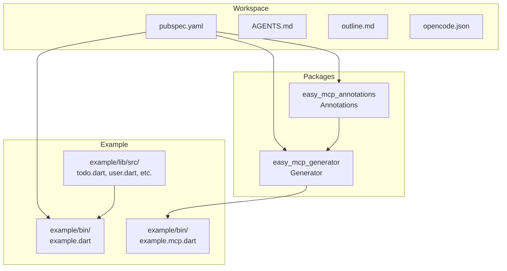
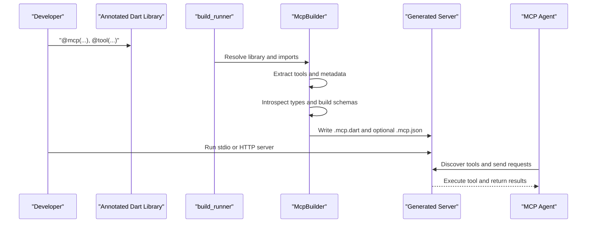
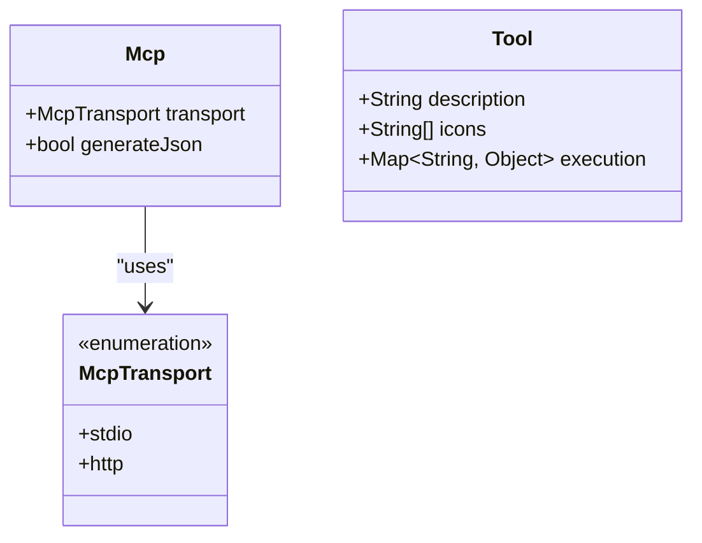
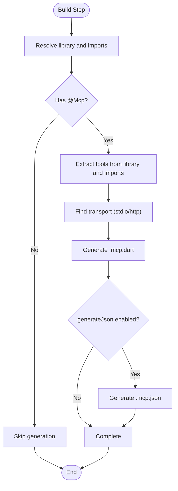
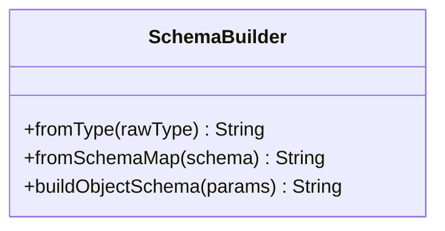
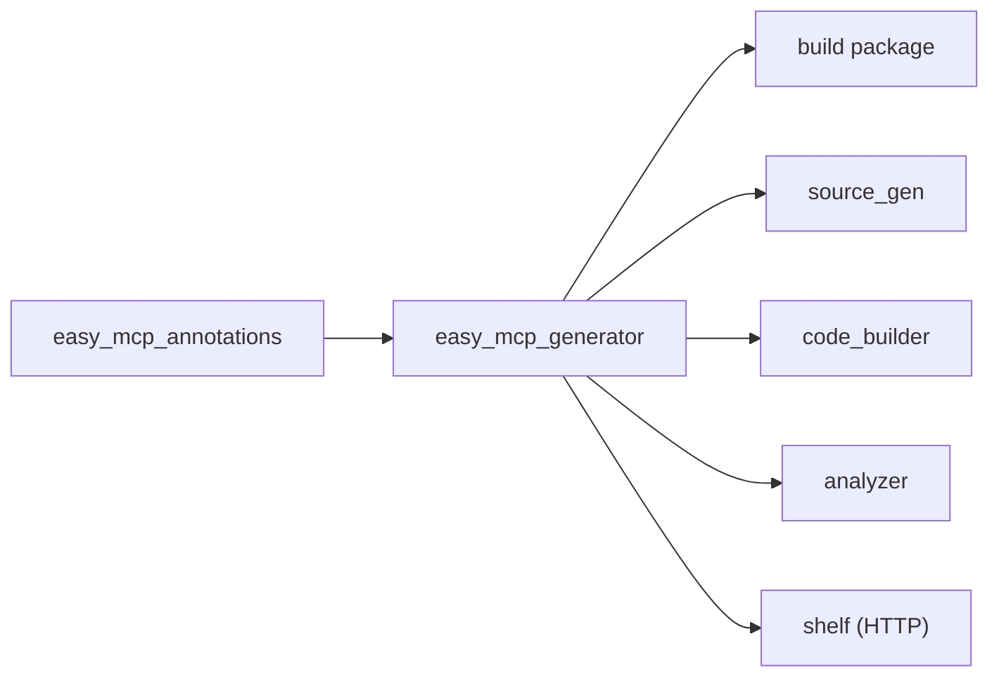

# Model Context Protocol Fundamentals

<cite>
**Referenced Files in This Document**
- [README.md](file://README.md)
- [outline.md](file://outline.md)
- [pubspec.yaml](file://pubspec.yaml)
- [AGENTS.md](file://AGENTS.md)
- [opencode.json](file://opencode.json)
- [packages/easy_mcp_annotations/lib/mcp_annotations.dart](file://packages/easy_mcp_annotations/lib/mcp_annotations.dart)
- [packages/easy_mcp_generator/lib/mcp_generator.dart](file://packages/easy_mcp_generator/lib/mcp_generator.dart)
- [packages/easy_mcp_generator/lib/builder/mcp_builder.dart](file://packages/easy_mcp_generator/lib/builder/mcp_builder.dart)
- [packages/easy_mcp_generator/lib/builder/schema_builder.dart](file://packages/easy_mcp_generator/lib/builder/schema_builder.dart)
- [example/bin/example.dart](file://example/bin/example.dart)
- [example/bin/example.mcp.dart](file://example/bin/example.mcp.dart)
- [example/lib/src/todo.dart](file://example/lib/src/todo.dart)
- [example/lib/src/todo_store.dart](file://example/lib/src/todo_store.dart)
- [example/lib/src/user.dart](file://example/lib/src/user.dart)
- [example/lib/src/user_store.dart](file://example/lib/src/user_store.dart)
</cite>

## Table of Contents
1. [Introduction](#introduction)
2. [Project Structure](#project-structure)
3. [Core Components](#core-components)
4. [Architecture Overview](#architecture-overview)
5. [Detailed Component Analysis](#detailed-component-analysis)
6. [Dependency Analysis](#dependency-analysis)
7. [Performance Considerations](#performance-considerations)
8. [Troubleshooting Guide](#troubleshooting-guide)
9. [Conclusion](#conclusion)

## Introduction
The Model Context Protocol (MCP) defines a standardized communication interface enabling AI agents to securely discover, reason about, and execute tools and access resources from external services. At its core, MCP establishes a bidirectional protocol where agents can request capabilities and services, and providers can proactively offer updates and context. This repository demonstrates a practical implementation that exposes Dart library functions as MCP tools through annotations and code generation, producing either stdio-based JSON-RPC servers or HTTP servers for broader integration.

Why MCP matters for AI agent development:
- Standardization: Provides a consistent contract for tools and resources across diverse services.
- Security isolation: Enables controlled, sandboxed execution of tools without embedding arbitrary code in the agent runtime.
- Extensibility: New capabilities can be added by annotating existing Dart functions; generation handles server scaffolding and schema.
- Interoperability: Tools and resources become discoverable and usable by any MCP-compliant agent.

## Project Structure
This is a Dart monorepo organized around two primary packages and an example application:
- easy_mcp_annotations: Defines the @mcp and @tool annotations used to mark functions for MCP exposure.
- easy_mcp_generator: A build_runner generator that processes annotations and produces MCP server code and optional JSON metadata.
- example: Demonstrates usage of the generator to create an MCP server from annotated Dart functions.

**Diagram sources**
- [pubspec.yaml:8-11](file://pubspec.yaml#L8-L11)
- [packages/easy_mcp_annotations/lib/mcp_annotations.dart:39-106](file://packages/easy_mcp_annotations/lib/mcp_annotations.dart#L39-L106)
- [packages/easy_mcp_generator/lib/mcp_generator.dart:10-11](file://packages/easy_mcp_generator/lib/mcp_generator.dart#L10-L11)
- [example/bin/example.dart](file://example/bin/example.dart)
- [example/bin/example.mcp.dart](file://example/bin/example.mcp.dart)
- [example/lib/src/todo.dart](file://example/lib/src/todo.dart)

**Section sources**
- [pubspec.yaml:8-11](file://pubspec.yaml#L8-L11)
- [AGENTS.md:10-15](file://AGENTS.md#L10-L15)
- [outline.md:11-14](file://outline.md#L11-L14)

## Core Components
- Annotations package (easy_mcp_annotations):
  - Mcp: Controls transport mode (stdio or http) and optional JSON metadata generation.
  - Tool: Marks functions as MCP tools and supplies human-readable descriptions and optional icons.
- Generator package (easy_mcp_generator):
  - McpBuilder: Scans libraries for @Mcp and @tool annotations, extracts tool metadata and schemas, and generates server code and optional .mcp.json metadata.
  - SchemaBuilder: Converts Dart parameter metadata into schema expressions for validation and discovery.

Key capabilities:
- AST-based parsing using dart:analyzer for reliable extraction of function signatures and doc comments.
- Dual transport modes: stdio (JSON-RPC) and HTTP (shelf-based).
- Automatic schema generation: Dart types mapped to JSON Schema, including nested objects and lists.
- Optional parameter support and doc comment fallback for descriptions.

**Section sources**
- [packages/easy_mcp_annotations/lib/mcp_annotations.dart:6-19](file://packages/easy_mcp_annotations/lib/mcp_annotations.dart#L6-L19)
- [packages/easy_mcp_annotations/lib/mcp_annotations.dart:39-56](file://packages/easy_mcp_annotations/lib/mcp_annotations.dart#L39-L56)
- [packages/easy_mcp_annotations/lib/mcp_annotations.dart:80-106](file://packages/easy_mcp_annotations/lib/mcp_annotations.dart#L80-L106)
- [packages/easy_mcp_generator/lib/mcp_generator.dart:10-11](file://packages/easy_mcp_generator/lib/mcp_generator.dart#L10-L11)
- [packages/easy_mcp_generator/lib/builder/schema_builder.dart:1-99](file://packages/easy_mcp_generator/lib/builder/schema_builder.dart#L1-L99)
- [README.md:77-84](file://README.md#L77-L84)

## Architecture Overview
The MCP implementation follows a code generation pipeline:
- Developer annotates Dart functions with @mcp and @tool.
- build_runner invokes McpBuilder to scan the library and imports for annotated elements.
- McpBuilder extracts tool metadata, introspects parameter types, and generates server code tailored to the selected transport.
- Optional JSON metadata is produced for tool discovery and validation.
- The generated server runs as stdio or HTTP, exposing tools that agents can invoke.

**Diagram sources**
- [packages/easy_mcp_generator/lib/builder/mcp_builder.dart:18-52](file://packages/easy_mcp_generator/lib/builder/mcp_builder.dart#L18-L52)
- [packages/easy_mcp_generator/lib/builder/mcp_builder.dart:112-166](file://packages/easy_mcp_generator/lib/builder/mcp_builder.dart#L112-L166)
- [packages/easy_mcp_generator/lib/builder/mcp_builder.dart:442-468](file://packages/easy_mcp_generator/lib/builder/mcp_builder.dart#L442-L468)
- [packages/easy_mcp_annotations/lib/mcp_annotations.dart:39-56](file://packages/easy_mcp_annotations/lib/mcp_annotations.dart#L39-L56)

## Detailed Component Analysis

### Annotations: Mcp and Tool
- Mcp:
  - transport: Selects stdio or http.
  - generateJson: Controls whether to emit a .mcp.json metadata file.
- Tool:
  - description: Human-readable tool purpose; falls back to doc comment if absent.
  - icons: Optional URLs for UI representation.
  - execution: Reserved for future execution parameters.

**Diagram sources**
- [packages/easy_mcp_annotations/lib/mcp_annotations.dart:9-19](file://packages/easy_mcp_annotations/lib/mcp_annotations.dart#L9-L19)
- [packages/easy_mcp_annotations/lib/mcp_annotations.dart:39-56](file://packages/easy_mcp_annotations/lib/mcp_annotations.dart#L39-L56)
- [packages/easy_mcp_annotations/lib/mcp_annotations.dart:80-106](file://packages/easy_mcp_annotations/lib/mcp_annotations.dart#L80-L106)

**Section sources**
- [packages/easy_mcp_annotations/lib/mcp_annotations.dart:6-19](file://packages/easy_mcp_annotations/lib/mcp_annotations.dart#L6-L19)
- [packages/easy_mcp_annotations/lib/mcp_annotations.dart:39-56](file://packages/easy_mcp_annotations/lib/mcp_annotations.dart#L39-L56)
- [packages/easy_mcp_annotations/lib/mcp_annotations.dart:80-106](file://packages/easy_mcp_annotations/lib/mcp_annotations.dart#L80-L106)

### Generator: McpBuilder
Responsibilities:
- Detect libraries annotated with @mcp.
- Traverse the library and its imports to collect tools annotated with @tool.
- Extract descriptions (explicit or from doc comments), parameters, and async nature.
- Determine transport mode and generate server code accordingly.
- Optionally produce JSON metadata describing tool input schemas.

Processing logic highlights:
- Tool discovery across current library and package-local imports.
- Parameter introspection to derive JSON Schema maps and Dart-to-JSON Schema conversions.
- Transport selection via annotation inspection.
- JSON metadata generation with schemaVersion and tools array.

**Diagram sources**
- [packages/easy_mcp_generator/lib/builder/mcp_builder.dart:18-52](file://packages/easy_mcp_generator/lib/builder/mcp_builder.dart#L18-L52)
- [packages/easy_mcp_generator/lib/builder/mcp_builder.dart:112-166](file://packages/easy_mcp_generator/lib/builder/mcp_builder.dart#L112-L166)
- [packages/easy_mcp_generator/lib/builder/mcp_builder.dart:442-468](file://packages/easy_mcp_generator/lib/builder/mcp_builder.dart#L442-L468)

**Section sources**
- [packages/easy_mcp_generator/lib/builder/mcp_builder.dart:12-52](file://packages/easy_mcp_generator/lib/builder/mcp_builder.dart#L12-L52)
- [packages/easy_mcp_generator/lib/builder/mcp_builder.dart:112-166](file://packages/easy_mcp_generator/lib/builder/mcp_builder.dart#L112-L166)
- [packages/easy_mcp_generator/lib/builder/mcp_builder.dart:442-468](file://packages/easy_mcp_generator/lib/builder/mcp_builder.dart#L442-L468)

### SchemaBuilder
Purpose:
- Convert parameter metadata into schema expressions for validation and discovery.
- Handle primitives, arrays, and object schemas with required fields.

**Diagram sources**
- [packages/easy_mcp_generator/lib/builder/schema_builder.dart:1-99](file://packages/easy_mcp_generator/lib/builder/schema_builder.dart#L1-L99)

**Section sources**
- [packages/easy_mcp_generator/lib/builder/schema_builder.dart:1-99](file://packages/easy_mcp_generator/lib/builder/schema_builder.dart#L1-L99)

### Example Application
The example demonstrates:
- Annotated functions that serve as MCP tools.
- Generated server code that exposes these tools via stdio or HTTP.
- Supporting domain models (e.g., Todo, User) and stores used by the tools.

Practical implications:
- Rapid prototyping of tools without manual server boilerplate.
- Consistent schema-driven discovery and validation.
- Seamless integration with MCP agents through standardized transports.

**Section sources**
- [example/bin/example.dart](file://example/bin/example.dart)
- [example/bin/example.mcp.dart](file://example/bin/example.mcp.dart)
- [example/lib/src/todo.dart](file://example/lib/src/todo.dart)
- [example/lib/src/todo_store.dart](file://example/lib/src/todo_store.dart)
- [example/lib/src/user.dart](file://example/lib/src/user.dart)
- [example/lib/src/user_store.dart](file://example/lib/src/user_store.dart)

## Dependency Analysis
Relationships:
- easy_mcp_generator depends on easy_mcp_annotations for type checking and constant reader access.
- Both packages rely on analyzer for AST parsing and source_gen/code_builder for code generation.
- The generator optionally uses shelf for HTTP transport generation.

**Diagram sources**
- [packages/easy_mcp_generator/lib/mcp_generator.dart:10-11](file://packages/easy_mcp_generator/lib/mcp_generator.dart#L10-L11)
- [packages/easy_mcp_generator/lib/builder/mcp_builder.dart:1-11](file://packages/easy_mcp_generator/lib/builder/mcp_builder.dart#L1-L11)
- [packages/easy_mcp_annotations/lib/mcp_annotations.dart:11-13](file://packages/easy_mcp_annotations/lib/mcp_annotations.dart#L11-L13)
- [packages/easy_mcp_generator/lib/builder/mcp_builder.dart:17-18](file://packages/easy_mcp_generator/lib/builder/mcp_builder.dart#L17-L18)

**Section sources**
- [packages/easy_mcp_generator/lib/mcp_generator.dart:10-11](file://packages/easy_mcp_generator/lib/mcp_generator.dart#L10-L11)
- [packages/easy_mcp_generator/lib/builder/mcp_builder.dart:1-11](file://packages/easy_mcp_generator/lib/builder/mcp_builder.dart#L1-L11)
- [packages/easy_mcp_annotations/lib/mcp_annotations.dart:11-13](file://packages/easy_mcp_annotations/lib/mcp_annotations.dart#L11-L13)

## Performance Considerations
- AST traversal and schema introspection scale with the number of annotated tools and parameter depth; keep tool sets focused and parameter schemas concise.
- HTTP transport adds overhead compared to stdio; prefer stdio for tight CLI integrations and HTTP when remote clients require network access.
- JSON metadata generation is optional; disable it in constrained environments to reduce I/O.

## Troubleshooting Guide
Common issues and resolutions:
- No tools generated:
  - Ensure the library has an @mcp annotation and at least one function annotated with @tool.
  - Verify build_runner executed after adding annotations.
- Incorrect transport:
  - Confirm the @mcp transport setting matches the intended mode (stdio/http).
- Missing descriptions:
  - Provide a description in @tool or include a doc comment on the annotated function.
- Schema mismatches:
  - Review parameter types and ensure custom types are package-local for proper introspection.
- HTTP server binding:
  - Check port availability and firewall rules if using HTTP transport.

**Section sources**
- [packages/easy_mcp_generator/lib/builder/mcp_builder.dart:27-28](file://packages/easy_mcp_generator/lib/builder/mcp_builder.dart#L27-L28)
- [packages/easy_mcp_generator/lib/builder/mcp_builder.dart:470-489](file://packages/easy_mcp_generator/lib/builder/mcp_builder.dart#L470-L489)
- [packages/easy_mcp_annotations/lib/mcp_annotations.dart:202-219](file://packages/easy_mcp_annotations/lib/mcp_annotations.dart#L202-L219)

## Conclusion
The Model Context Protocol provides a robust foundation for AI agent integration by standardizing how agents discover, validate, and execute tools and access resources. This repository demonstrates a practical path to MCP adoption in Dart projects: annotate existing functions, run the generator, and deploy either stdio or HTTP servers. The resulting tools benefit from automatic schema generation, consistent metadata, and secure, isolated execution—enabling scalable and maintainable agent ecosystems.