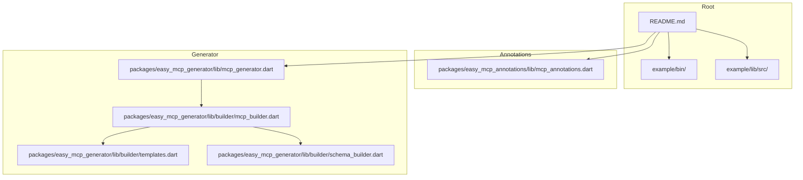
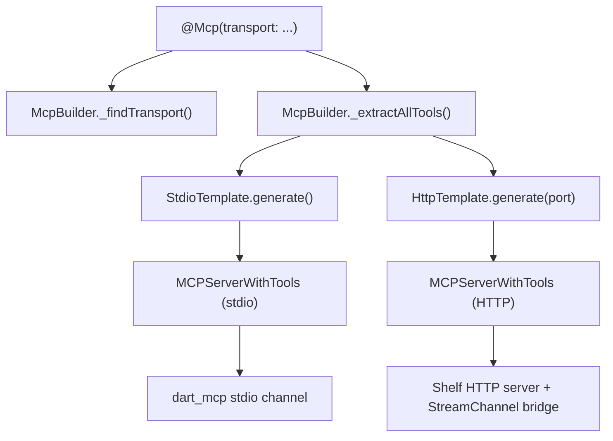
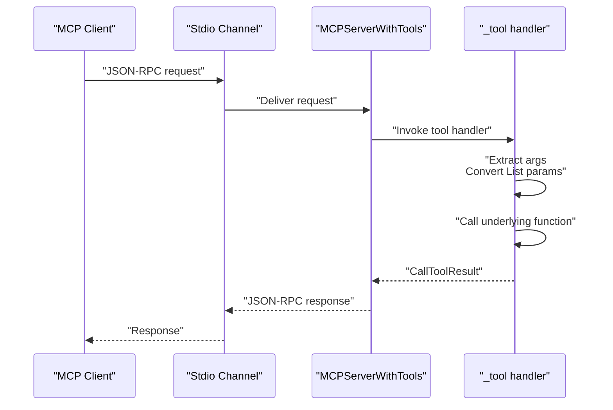
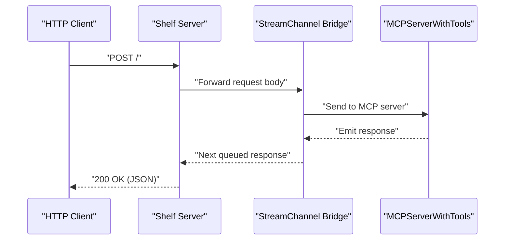
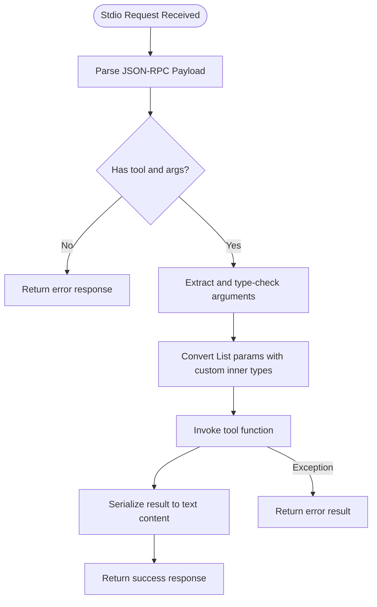
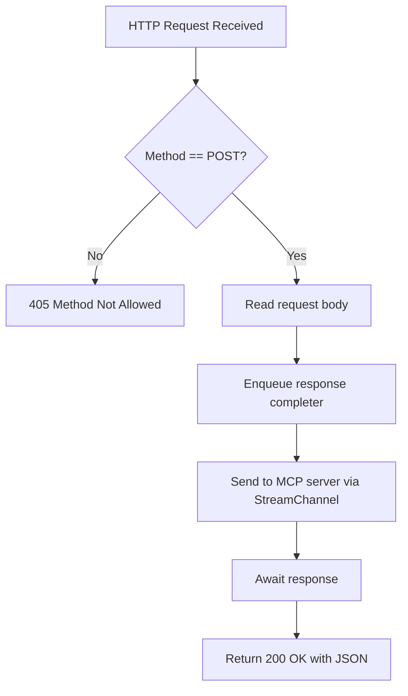
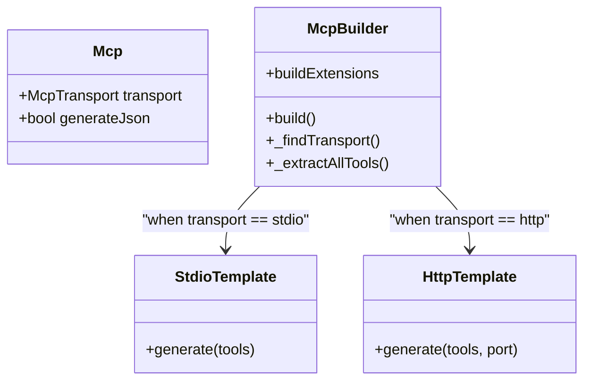
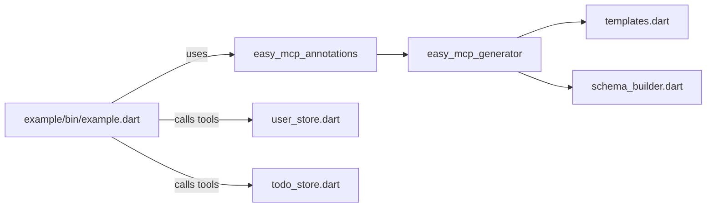

# Transport Modes Basics

<cite>
**Referenced Files in This Document**
- [README.md](file://README.md)
- [mcp_annotations.dart](file://packages/easy_mcp_annotations/lib/mcp_annotations.dart)
- [mcp_generator.dart](file://packages/easy_mcp_generator/lib/mcp_generator.dart)
- [mcp_builder.dart](file://packages/easy_mcp_generator/lib/builder/mcp_builder.dart)
- [templates.dart](file://packages/easy_mcp_generator/lib/builder/templates.dart)
- [schema_builder.dart](file://packages/easy_mcp_generator/lib/builder/schema_builder.dart)
- [example.dart](file://example/bin/example.dart)
- [example.mcp.dart](file://example/bin/example.mcp.dart)
- [user_store.dart](file://example/lib/src/user_store.dart)
- [todo_store.dart](file://example/lib/src/todo_store.dart)
</cite>

## Table of Contents
1. [Introduction](#introduction)
2. [Project Structure](#project-structure)
3. [Core Components](#core-components)
4. [Architecture Overview](#architecture-overview)
5. [Detailed Component Analysis](#detailed-component-analysis)
6. [Dependency Analysis](#dependency-analysis)
7. [Performance Considerations](#performance-considerations)
8. [Troubleshooting Guide](#troubleshooting-guide)
9. [Conclusion](#conclusion)

## Introduction
This document explains Easy MCP transport modes with a focus on the two supported protocols: stdio and HTTP. It covers how transport selection influences generated code, the JSON-RPC protocol implementation for stdio, and the HTTP transport specifics including Shelf-based server setup, request routing, and bidirectional streaming. Practical examples demonstrate transport configuration, testing approaches, and performance considerations for each mode.

## Project Structure
The repository is organized into:
- A documentation and example guide in the root README
- Two Dart packages:
  - easy_mcp_annotations: defines the @Mcp and @Tool annotations
  - easy_mcp_generator: build_runner generator that emits MCP server code
- An example application demonstrating both transport modes

**Diagram sources**
- [README.md](file://README.md)
- [mcp_annotations.dart](file://packages/easy_mcp_annotations/lib/mcp_annotations.dart)
- [mcp_generator.dart](file://packages/easy_mcp_generator/lib/mcp_generator.dart)
- [mcp_builder.dart](file://packages/easy_mcp_generator/lib/builder/mcp_builder.dart)
- [templates.dart](file://packages/easy_mcp_generator/lib/builder/templates.dart)
- [schema_builder.dart](file://packages/easy_mcp_generator/lib/builder/schema_builder.dart)

**Section sources**
- [README.md](file://README.md)

## Core Components
- McpTransport enum: selects stdio or http transport
- @Mcp annotation: configures transport and optional JSON metadata generation
- @Tool annotation: marks functions as MCP tools with description and optional icons
- McpBuilder: scans libraries for @Mcp and @Tool, extracts tool metadata, and delegates code generation
- Templates: StdioTemplate and HttpTemplate generate server code tailored to the selected transport

Key behaviors:
- Transport selection drives which template is used during code generation
- Tool discovery includes top-level functions and class methods across imported libraries within the same package
- JSON metadata generation is controlled by @Mcp(generateJson: ...)

**Section sources**
- [mcp_annotations.dart:6-56](file://packages/easy_mcp_annotations/lib/mcp_annotations.dart#L6-L56)
- [mcp_builder.dart:12-52](file://packages/easy_mcp_generator/lib/builder/mcp_builder.dart#L12-L52)
- [mcp_builder.dart:516-563](file://packages/easy_mcp_generator/lib/builder/mcp_builder.dart#L516-L563)

## Architecture Overview
The generator orchestrates annotation scanning, tool extraction, and code generation. The resulting server code embeds the chosen transport mechanism.

**Diagram sources**
- [mcp_builder.dart:35-52](file://packages/easy_mcp_generator/lib/builder/mcp_builder.dart#L35-L52)
- [templates.dart:6-175](file://packages/easy_mcp_generator/lib/builder/templates.dart#L6-L175)
- [templates.dart:269-486](file://packages/easy_mcp_generator/lib/builder/templates.dart#L269-L486)

## Detailed Component Analysis

### Transport Selection and Generated Code Structure
- @Mcp(transport: McpTransport.stdio) produces a stdio-based server using a stream channel over stdin/stdout
- @Mcp(transport: McpTransport.http) produces an HTTP server using Shelf, with a StreamChannel bridge for bidirectional communication

Generated artifacts:
- .mcp.dart: the server implementation
- .mcp.json (optional): JSON metadata derived from tool schemas

Port configuration:
- HTTP transport uses a fixed default port in the template; the generator passes the port to HttpTemplate.generate()

**Section sources**
- [mcp_annotations.dart:39-56](file://packages/easy_mcp_annotations/lib/mcp_annotations.dart#L39-L56)
- [mcp_builder.dart:35-52](file://packages/easy_mcp_generator/lib/builder/mcp_builder.dart#L35-L52)
- [templates.dart:270-449](file://packages/easy_mcp_generator/lib/builder/templates.dart#L270-L449)

### Stdio Transport Mode (JSON-RPC over stdin/stdout)
Implementation highlights:
- Channel creation: StreamChannel over stdin/stdout
- Server lifecycle: MCPServerWithTools extends MCPServer with ToolsSupport
- Tool registration: Each @Tool is registered with a name, description, and input schema
- Request handling: Tool handlers extract arguments, convert List parameters with custom inner types, call the underlying function, and serialize results
- Error propagation: Exceptions are caught and returned as error results with text content

**Diagram sources**
- [templates.dart:133-174](file://packages/easy_mcp_generator/lib/builder/templates.dart#L133-L174)
- [templates.dart:100-116](file://packages/easy_mcp_generator/lib/builder/templates.dart#L100-L116)

**Section sources**
- [templates.dart:6-175](file://packages/easy_mcp_generator/lib/builder/templates.dart#L6-L175)

### HTTP Transport Mode (Shelf-based with Bidirectional Streaming)
Implementation highlights:
- HTTP server: Shelf server bound to loopback IPv4 and a configured port
- StreamChannel bridge: Two StreamControllers enable bidirectional communication between HTTP requests and the MCP server
- Request routing: Only POST requests are accepted; other methods return 405
- Response buffering: Responses are queued and delivered to the next awaiting request
- Server lifecycle: The HTTP server shuts down gracefully when the MCP server completes

**Diagram sources**
- [templates.dart:398-449](file://packages/easy_mcp_generator/lib/builder/templates.dart#L398-L449)
- [templates.dart:419-434](file://packages/easy_mcp_generator/lib/builder/templates.dart#L419-L434)

**Section sources**
- [templates.dart:269-486](file://packages/easy_mcp_generator/lib/builder/templates.dart#L269-L486)

### JSON-RPC Protocol Implementation for Stdio
- Message format: Requests and responses conform to the MCP JSON-RPC protocol
- Request handling: Tool handlers receive a CallToolRequest with arguments extracted from the payload
- Response handling: Results are serialized to text content; errors are propagated as error results
- Schema-driven tool registration: Tool input schemas are built from Dart types and stored in the generated server

**Diagram sources**
- [templates.dart:100-116](file://packages/easy_mcp_generator/lib/builder/templates.dart#L100-L116)
- [schema_builder.dart:68-98](file://packages/easy_mcp_generator/lib/builder/schema_builder.dart#L68-L98)

**Section sources**
- [templates.dart:100-116](file://packages/easy_mcp_generator/lib/builder/templates.dart#L100-L116)
- [schema_builder.dart:1-99](file://packages/easy_mcp_generator/lib/builder/schema_builder.dart#L1-L99)

### HTTP Transport Specifics
- Port configuration: The HTTP template accepts a port parameter; the example server uses port 3000
- Request routing: Only POST requests are handled; method-not-allowed responses are returned for other methods
- Streaming capabilities: The StreamChannel bridge enables bidirectional streaming between HTTP and the MCP server
- Lifecycle: The HTTP server closes when the MCP server completes, ensuring graceful shutdown

**Diagram sources**
- [templates.dart:419-434](file://packages/easy_mcp_generator/lib/builder/templates.dart#L419-L434)
- [templates.dart:436-449](file://packages/easy_mcp_generator/lib/builder/templates.dart#L436-L449)

**Section sources**
- [templates.dart:419-449](file://packages/easy_mcp_generator/lib/builder/templates.dart#L419-L449)

### Transport Configuration via @Mcp and Generated Code
- @Mcp(transport: McpTransport.stdio) selects StdioTemplate
- @Mcp(transport: McpTransport.http) selects HttpTemplate with a port
- Tool discovery aggregates functions and methods across the library and its imports within the same package
- Tool registration and schema generation are identical for both transports, differing only in transport-specific server scaffolding

**Diagram sources**
- [mcp_annotations.dart:39-56](file://packages/easy_mcp_annotations/lib/mcp_annotations.dart#L39-L56)
- [mcp_builder.dart:12-52](file://packages/easy_mcp_generator/lib/builder/mcp_builder.dart#L12-L52)
- [templates.dart:6-175](file://packages/easy_mcp_generator/lib/builder/templates.dart#L6-L175)
- [templates.dart:269-486](file://packages/easy_mcp_generator/lib/builder/templates.dart#L269-L486)

**Section sources**
- [mcp_annotations.dart:39-56](file://packages/easy_mcp_annotations/lib/mcp_annotations.dart#L39-L56)
- [mcp_builder.dart:35-52](file://packages/easy_mcp_generator/lib/builder/mcp_builder.dart#L35-L52)
- [mcp_builder.dart:516-563](file://packages/easy_mcp_generator/lib/builder/mcp_builder.dart#L516-L563)

### Practical Examples and Testing Approaches
- Stdio server: Run the generated .mcp.dart file; it connects to stdin/stdout and expects JSON-RPC messages
- HTTP server: Run the generated .mcp.dart file; it starts a Shelf server on localhost and prints the port
- Example usage: The example demonstrates @Mcp(transport: McpTransport.http) and exposes tools via UserStore and TodoStore

Testing tips:
- Stdio: Pipe JSON-RPC requests to the process and capture stdout for responses
- HTTP: Send POST requests to the server endpoint and verify responses
- Schema validation: Confirm tool input schemas match expected parameter types

**Section sources**
- [README.md:49-53](file://README.md#L49-L53)
- [example.dart:6-6](file://example/bin/example.dart#L6-L6)
- [example.mcp.dart:17-68](file://example/bin/example.mcp.dart#L17-L68)
- [user_store.dart:55-142](file://example/lib/src/user_store.dart#L55-L142)
- [todo_store.dart:69-235](file://example/lib/src/todo_store.dart#L69-L235)

## Dependency Analysis
- Annotations package: Provides @Mcp and @Tool definitions
- Generator package: Depends on analyzer, source_gen, code_builder, and shelf; uses templates and schema_builder to generate server code
- Example application: Demonstrates usage of @Mcp and @Tool with concrete tool implementations

**Diagram sources**
- [mcp_annotations.dart:1-107](file://packages/easy_mcp_annotations/lib/mcp_annotations.dart#L1-L107)
- [mcp_generator.dart:1-14](file://packages/easy_mcp_generator/lib/mcp_generator.dart#L1-L14)
- [templates.dart:1-578](file://packages/easy_mcp_generator/lib/builder/templates.dart#L1-L578)
- [schema_builder.dart:1-99](file://packages/easy_mcp_generator/lib/builder/schema_builder.dart#L1-L99)
- [example.dart:1-67](file://example/bin/example.dart#L1-L67)
- [user_store.dart:1-144](file://example/lib/src/user_store.dart#L1-L144)
- [todo_store.dart:1-236](file://example/lib/src/todo_store.dart#L1-L236)

**Section sources**
- [mcp_generator.dart:1-14](file://packages/easy_mcp_generator/lib/mcp_generator.dart#L1-L14)
- [templates.dart:1-578](file://packages/easy_mcp_generator/lib/builder/templates.dart#L1-L578)
- [schema_builder.dart:1-99](file://packages/easy_mcp_generator/lib/builder/schema_builder.dart#L1-L99)
- [example.dart:1-67](file://example/bin/example.dart#L1-L67)

## Performance Considerations
- Stdio transport: Lower overhead, suitable for CLI integrations; synchronous stdin/stdout I/O can be a bottleneck under heavy concurrency
- HTTP transport: Adds network stack overhead but supports concurrent connections; streaming bridge introduces minimal latency
- Serialization: Result serialization converts objects to JSON; avoid excessive object creation in hot paths
- Schema generation: Automatic schema derivation reduces manual effort but adds slight runtime cost during server initialization

## Troubleshooting Guide
Common issues and resolutions:
- No tools generated: Ensure the library has @Mcp and at least one @Tool; verify the generator runs and the file is processed
- HTTP server binding failures: Check if the port is in use; adjust the port in the HTTP template or pass a different port
- Method not allowed errors: Confirm HTTP requests use POST; other methods return 405
- Serialization errors: Verify tool return types can be serialized; handle custom types with proper JSON conversion

**Section sources**
- [mcp_builder.dart:18-52](file://packages/easy_mcp_generator/lib/builder/mcp_builder.dart#L18-L52)
- [templates.dart:419-434](file://packages/easy_mcp_generator/lib/builder/templates.dart#L419-L434)

## Conclusion
Easy MCP provides a straightforward way to expose Dart functions as MCP tools via two transport modes. The @Mcp annotation controls transport selection, which determines the generated server scaffold. Stdio mode offers a lightweight, CLI-friendly JSON-RPC channel, while HTTP mode delivers a Shelf-based server with bidirectional streaming. Both modes share the same tool registration and schema generation logic, enabling consistent behavior across transports.