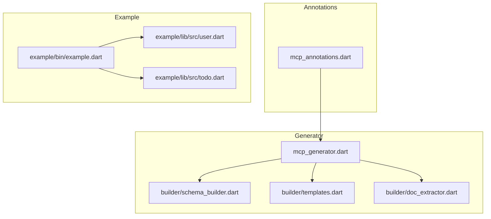
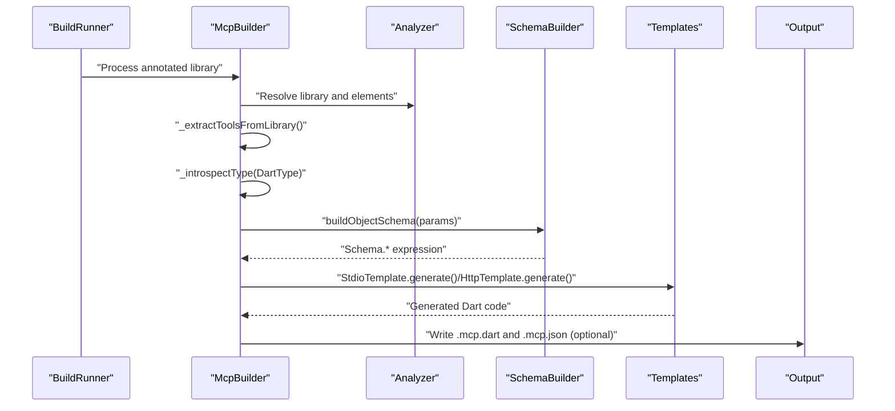
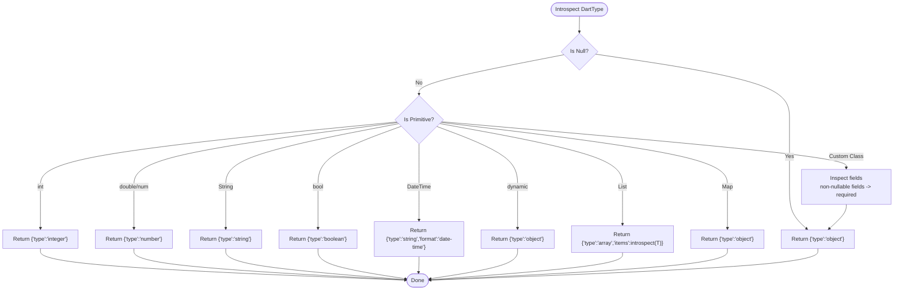
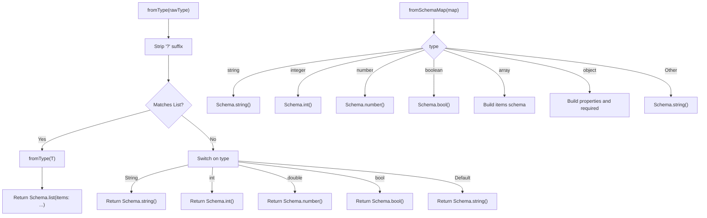
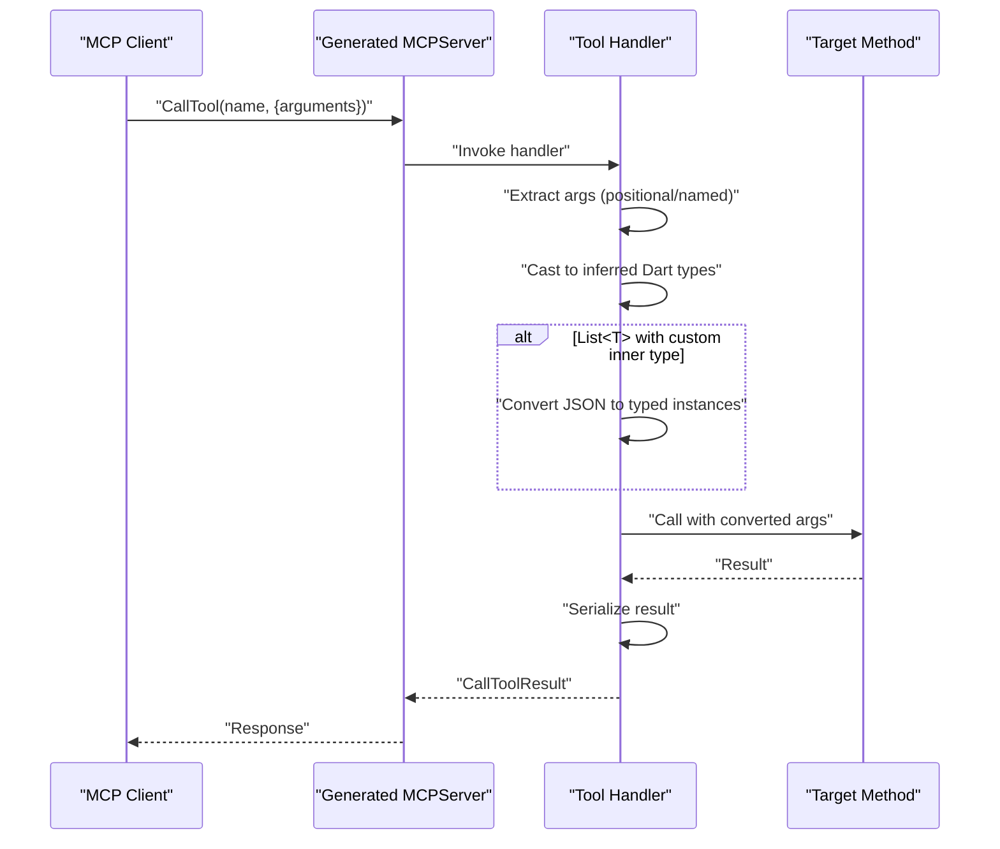
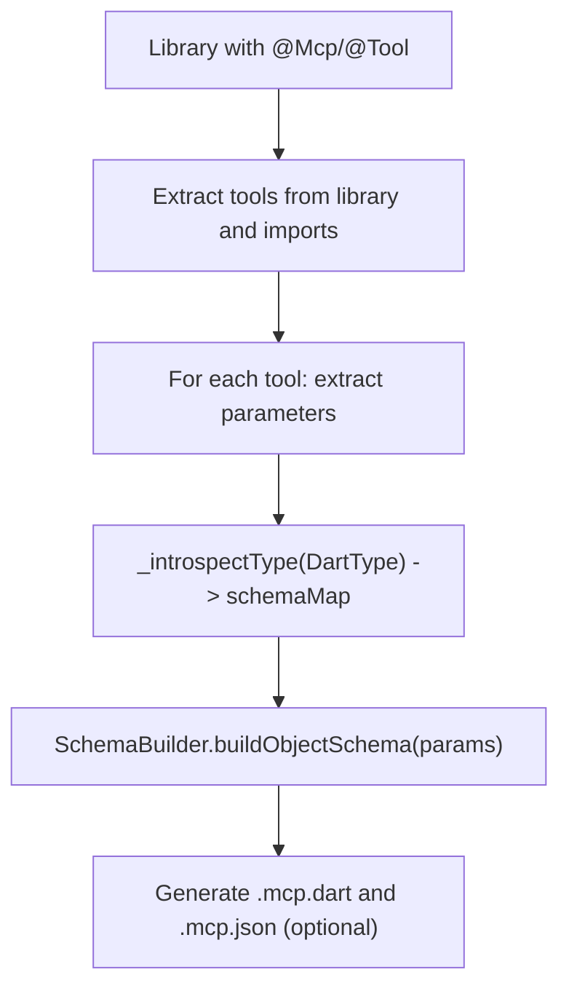
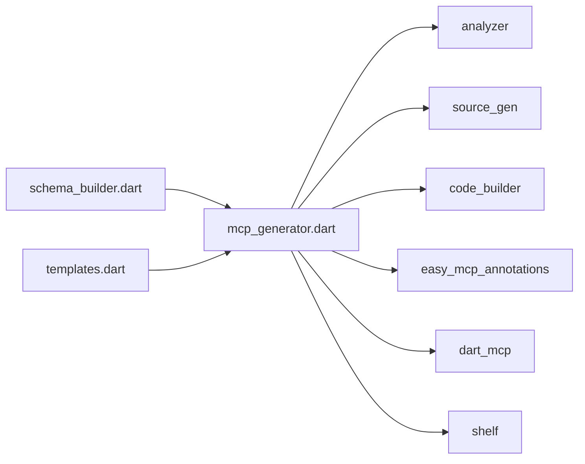

# Type System Integration

<cite>
**Referenced Files in This Document**
- [README.md](file://README.md)
- [pubspec.yaml](file://packages/easy_mcp_generator/pubspec.yaml)
- [mcp_annotations.dart](file://packages/easy_mcp_annotations/lib/mcp_annotations.dart)
- [mcp_generator.dart](file://packages/easy_mcp_generator/lib/mcp_generator.dart)
- [schema_builder.dart](file://packages/easy_mcp_generator/lib/builder/schema_builder.dart)
- [templates.dart](file://packages/easy_mcp_generator/lib/builder/templates.dart)
- [doc_extractor.dart](file://packages/easy_mcp_generator/lib/builder/doc_extractor.dart)
- [example.dart](file://example/bin/example.dart)
- [user.dart](file://example/lib/src/user.dart)
- [todo.dart](file://example/lib/src/todo.dart)
- [schema_builder_test.dart](file://packages/easy_mcp_generator/test/schema_builder_test.dart)
</cite>

## Table of Contents
1. [Introduction](#introduction)
2. [Project Structure](#project-structure)
3. [Core Components](#core-components)
4. [Architecture Overview](#architecture-overview)
5. [Detailed Component Analysis](#detailed-component-analysis)
6. [Dependency Analysis](#dependency-analysis)
7. [Performance Considerations](#performance-considerations)
8. [Troubleshooting Guide](#troubleshooting-guide)
9. [Conclusion](#conclusion)

## Introduction
This document explains how Easy MCP integrates Dart types into JSON Schema-based validation for Model Context Protocol (MCP) tools. It covers how the generator analyzes Dart function signatures and parameter types to produce JSON Schema definitions, how primitive and complex types are mapped, how optional parameters and defaults are handled, and how the resulting schemas are embedded into generated server code. It also documents type safety guarantees, validation error handling, debugging strategies, and limitations with workarounds for advanced scenarios.

## Project Structure
The repository is organized into two primary packages and an example application:
- easy_mcp_annotations: Defines the @mcp and @tool annotations used to mark functions for MCP exposure.
- easy_mcp_generator: A build_runner generator that parses annotated functions, builds JSON Schemas, and generates MCP server code (stdio and HTTP).
- example: Demonstrates usage of annotations and models with lists and custom classes.

**Diagram sources**
- [mcp_annotations.dart](file://packages/easy_mcp_annotations/lib/mcp_annotations.dart)
- [mcp_generator.dart](file://packages/easy_mcp_generator/lib/mcp_generator.dart)
- [schema_builder.dart](file://packages/easy_mcp_generator/lib/builder/schema_builder.dart)
- [templates.dart](file://packages/easy_mcp_generator/lib/builder/templates.dart)
- [doc_extractor.dart](file://packages/easy_mcp_generator/lib/builder/doc_extractor.dart)
- [example.dart](file://example/bin/example.dart)
- [user.dart](file://example/lib/src/user.dart)
- [todo.dart](file://example/lib/src/todo.dart)

**Section sources**
- [README.md](file://README.md)
- [pubspec.yaml](file://packages/easy_mcp_generator/pubspec.yaml)

## Core Components
- Annotations: @mcp and @tool define transport mode and tool metadata.
- Type introspection: The generator inspects Dart types to produce JSON Schema maps.
- Schema builder: Converts Dart type strings and schema maps into Schema.* expressions for generated code.
- Templates: Generate stdio and HTTP server code, embedding tool registrations with input schemas and runtime argument extraction/conversion.
- Doc extractor: Provides basic doc comment extraction and simple JSON Schema generation for parameter types.

Key responsibilities:
- Extract tools from libraries and imports, including class methods.
- Build parameter metadata including type, schema map, optionality, and named vs positional.
- Generate JSON metadata with input schemas when requested.
- Emit server code with registered tools and input validation via generated Schema.* expressions.

**Section sources**
- [mcp_annotations.dart](file://packages/easy_mcp_annotations/lib/mcp_annotations.dart)
- [mcp_generator.dart](file://packages/easy_mcp_generator/lib/mcp_generator.dart)
- [schema_builder.dart](file://packages/easy_mcp_generator/lib/builder/schema_builder.dart)
- [templates.dart](file://packages/easy_mcp_generator/lib/builder/templates.dart)
- [doc_extractor.dart](file://packages/easy_mcp_generator/lib/builder/doc_extractor.dart)

## Architecture Overview
The generator runs during build_runner and performs AST-based analysis of annotated libraries. It collects tools, introspects parameter types, generates JSON Schema maps, converts them to Schema.* expressions, and writes both Dart server code and optionally a .mcp.json metadata file.

**Diagram sources**
- [mcp_generator.dart](file://packages/easy_mcp_generator/lib/mcp_generator.dart)
- [schema_builder.dart](file://packages/easy_mcp_generator/lib/builder/schema_builder.dart)
- [templates.dart](file://packages/easy_mcp_generator/lib/builder/templates.dart)

## Detailed Component Analysis

### Type Introspection and JSON Schema Generation
The generator builds a full JSON Schema map for each parameter type:
- Primitives: int, double/num, String, bool map to JSON Schema types integer, number, string, boolean.
- Lists: List<T> produce array with items schema derived from T.
- Maps: Map<K,V> are represented as object (no generic key/value typing).
- Custom classes: Non-core types are introspected to produce object schemas with properties and required fields inferred from non-nullable fields.
- Nullables: Unwrapped for introspection; null type maps to object.
- Special case: DateTime is treated as string with date-time format.
- Dynamic: Treated as object.

**Diagram sources**
- [mcp_generator.dart](file://packages/easy_mcp_generator/lib/mcp_generator.dart)

**Section sources**
- [mcp_generator.dart](file://packages/easy_mcp_generator/lib/mcp_generator.dart)

### Automatic Type-to-Schema Conversion
The SchemaBuilder converts Dart type strings and schema maps into Schema.* expressions:
- Primitive mapping: String → Schema.string(), int → Schema.int(), double → Schema.number(), bool → Schema.bool().
- Lists: List<T> recursively resolves items schema via fromType or fromSchemaMap.
- Objects: Properties and required arrays are built from schema maps; empty objects handled gracefully.
- Default fallback: Unknown types map to Schema.string().

**Diagram sources**
- [schema_builder.dart](file://packages/easy_mcp_generator/lib/builder/schema_builder.dart)

**Section sources**
- [schema_builder.dart](file://packages/easy_mcp_generator/lib/builder/schema_builder.dart)

### Runtime Argument Extraction and Validation
Generated server code extracts arguments from the request and applies type conversions:
- Arguments are cast according to inferred Dart types.
- For List<T> with non-primitive inner types, a conversion step maps JSON objects to typed instances using fromJson.
- Optional parameters are handled by checking presence in request arguments and casting to nullable types.
- Results are serialized using a safe serializer that checks for toJson methods.

**Diagram sources**
- [templates.dart](file://packages/easy_mcp_generator/lib/builder/templates.dart)

**Section sources**
- [templates.dart](file://packages/easy_mcp_generator/lib/builder/templates.dart)

### Primitive Type Mappings
- String → JSON Schema string
- int → JSON Schema integer
- double/num → JSON Schema number
- bool → JSON Schema boolean
- DateTime → JSON Schema string with date-time format
- null → object (used for nullable unwrapping)
- dynamic → object
- List<T> → JSON Schema array with items derived from T
- Map<K,V> → JSON Schema object (no generic typing)

These mappings are applied consistently across:
- Type introspection for parameter schemas
- Direct type-to-schema conversion for simple cases
- Template-driven argument extraction and conversion

**Section sources**
- [mcp_generator.dart](file://packages/easy_mcp_generator/lib/mcp_generator.dart)
- [schema_builder.dart](file://packages/easy_mcp_generator/lib/builder/schema_builder.dart)
- [templates.dart](file://packages/easy_mcp_generator/lib/builder/templates.dart)

### Complex Types and Nested Structures
- Custom classes: Non-core classes are introspected to derive object schemas. Public, non-static, non-private fields are included; required fields exclude nullable ones. Cycle detection prevents infinite recursion by returning generic object for repeated types.
- Nested lists and maps: Lists of custom types resolve inner schemas; maps are represented as generic objects.
- Import handling: For List<T> where T is a custom type from another library, the generator records the import URI so the generated server can import the target library.

Practical example models:
- User: fields include id (int), name (String), email (String), todoIds (List<int>). The schema captures these as required fields.
- Todo: fields include id (int), title (String), completed (bool), userIds (List<int>). The schema captures these as required fields except for completed defaulting to false in code but still considered optional in schema.

**Section sources**
- [mcp_generator.dart](file://packages/easy_mcp_generator/lib/mcp_generator.dart)
- [user.dart](file://example/lib/src/user.dart)
- [todo.dart](file://example/lib/src/todo.dart)

### Optional Parameters and Defaults
- Optional handling: Named optional parameters and optional positional parameters are marked as isOptional. In generated schemas, required arrays exclude optional parameters.
- Defaults: The generator does not embed default values into JSON Schema; defaults are enforced in Dart code during argument extraction and conversion.
- Nullable types: Trailing ? indicates nullability; introspection unwraps for schema generation, while template logic casts to nullable types when extracting.

**Section sources**
- [mcp_generator.dart](file://packages/easy_mcp_generator/lib/mcp_generator.dart)
- [templates.dart](file://packages/easy_mcp_generator/lib/builder/templates.dart)

### Schema Generation Algorithm
The algorithm proceeds as follows:
1. Extract tools from the library and imported package-local libraries.
2. For each tool, extract parameters and compute:
   - Type string (with nullability)
   - Full schema map via _introspectType
   - Simple JSON Schema string for quick reference
   - Optional flag and named parameter flag
   - Import URI for List<T> inner custom types
3. Build object schema for tool inputs using SchemaBuilder.buildObjectSchema.
4. Optionally generate .mcp.json metadata with inputSchema for each tool.
5. Generate server code with registered tools and handlers that extract, convert, and validate arguments.

**Diagram sources**
- [mcp_generator.dart](file://packages/easy_mcp_generator/lib/mcp_generator.dart)
- [schema_builder.dart](file://packages/easy_mcp_generator/lib/builder/schema_builder.dart)

**Section sources**
- [mcp_generator.dart](file://packages/easy_mcp_generator/lib/mcp_generator.dart)
- [schema_builder.dart](file://packages/easy_mcp_generator/lib/builder/schema_builder.dart)

### Examples of Type Mappings
Common scenarios:
- List<String>: array with string items
- List<int>: array with integer items
- List<User>: array with items derived from User schema (object)
- Map<String, dynamic>: object
- User: object with properties derived from User fields (required fields inferred)
- Optional fields: excluded from required arrays in schema
- DateTime: string with date-time format

These mappings are validated by tests for SchemaBuilder.fromType and SchemaBuilder.buildObjectSchema.

**Section sources**
- [schema_builder_test.dart](file://packages/easy_mcp_generator/test/schema_builder_test.dart)
- [schema_builder.dart](file://packages/easy_mcp_generator/lib/builder/schema_builder.dart)
- [mcp_generator.dart](file://packages/easy_mcp_generator/lib/mcp_generator.dart)

### Type Safety Guarantees and Validation Error Handling
- Compile-time safety: Generated code uses type assertions and nullable-aware casting based on inferred Dart types.
- Runtime validation: Generated handlers extract arguments and apply conversions; failures are caught and returned as error responses with text content.
- Serialization safety: Results are serialized using a serializer that checks for toJson methods and falls back to toString if unavailable.

Debugging approaches:
- Inspect generated .mcp.dart and .mcp.json files to verify schemas and tool registrations.
- Review parameter metadata collected during extraction (type, schemaMap, isOptional, isNamed).
- Temporarily enable logging around argument extraction and conversion in generated handlers.

**Section sources**
- [templates.dart](file://packages/easy_mcp_generator/lib/builder/templates.dart)
- [mcp_generator.dart](file://packages/easy_mcp_generator/lib/mcp_generator.dart)

### Limitations and Workarounds
- Generic typing: Maps and Lists are not fully generic-typed in JSON Schema; Map<K,V> is object, List<T> items schema is derived but inner custom types require import URIs to be recorded.
- Field visibility: Only public, non-static, non-private fields are included in custom class schemas.
- Cycles: Cycle detection returns generic object to prevent infinite recursion.
- Defaults: Not embedded in JSON Schema; enforce defaults in Dart code.
- DateTime: Treated as string with date-time format; ensure clients send RFC 3339-compatible strings.

Workarounds:
- For Map<K,V>, accept object and validate/convert in code.
- For List<T> with custom T, ensure the inner type’s library is imported so the generator can record the import URI.
- For complex nested structures, prefer explicit custom classes with fromJson constructors to maintain strong typing.

**Section sources**
- [mcp_generator.dart](file://packages/easy_mcp_generator/lib/mcp_generator.dart)
- [templates.dart](file://packages/easy_mcp_generator/lib/builder/templates.dart)

## Dependency Analysis
The generator depends on analyzer for AST parsing, source_gen for code generation, and code_builder for constructing Dart code. It also integrates with dart_mcp for server runtime and shelf for HTTP transport.

**Diagram sources**
- [pubspec.yaml](file://packages/easy_mcp_generator/pubspec.yaml)
- [mcp_generator.dart](file://packages/easy_mcp_generator/lib/mcp_generator.dart)
- [schema_builder.dart](file://packages/easy_mcp_generator/lib/builder/schema_builder.dart)
- [templates.dart](file://packages/easy_mcp_generator/lib/builder/templates.dart)

**Section sources**
- [pubspec.yaml](file://packages/easy_mcp_generator/pubspec.yaml)

## Performance Considerations
- AST traversal: The generator scans libraries and imports; keep the number of annotated tools manageable.
- Schema building: Recursive introspection of custom classes is efficient but watch for deep nesting to avoid excessive object schemas.
- Template rendering: Code generation is linear in the number of tools and parameters; keep parameter counts reasonable.

## Troubleshooting Guide
Common issues and resolutions:
- Missing imports for List<T> inner custom types: Ensure the inner type’s library is imported so the generator can record the import URI.
- Unexpected required fields: Verify field nullability; only non-nullable fields appear in required arrays.
- DateTime parsing errors: Send RFC 3339-formatted strings to match the date-time format.
- HTTP server not responding: Confirm the generated HTTP server is started and reachable on the expected port.
- JSON metadata missing: Enable generateJson in @Mcp and rebuild.

Validation and debugging aids:
- Review generated .mcp.json to confirm inputSchema correctness.
- Temporarily log extracted arguments and converted values in generated handlers.
- Use tests for SchemaBuilder to validate expected mappings.

**Section sources**
- [mcp_generator.dart](file://packages/easy_mcp_generator/lib/mcp_generator.dart)
- [templates.dart](file://packages/easy_mcp_generator/lib/builder/templates.dart)
- [schema_builder_test.dart](file://packages/easy_mcp_generator/test/schema_builder_test.dart)

## Conclusion
Easy MCP’s type system integration provides a robust bridge between Dart types and JSON Schema validation for MCP tools. By leveraging analyzer-based introspection, the generator produces accurate schemas for primitives, collections, and custom classes, while templates ensure safe runtime argument extraction and serialization. Optional parameters and nullable types are handled consistently, and the system offers practical workarounds for complex scenarios. Together, these mechanisms deliver type safety and predictable validation behavior for MCP clients and servers.