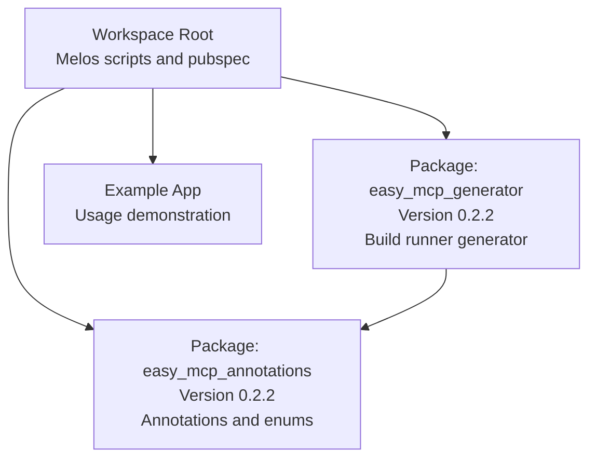
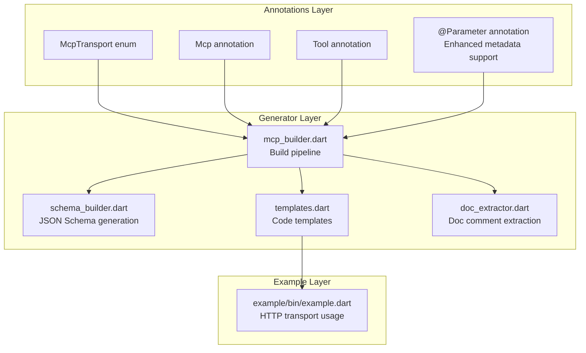
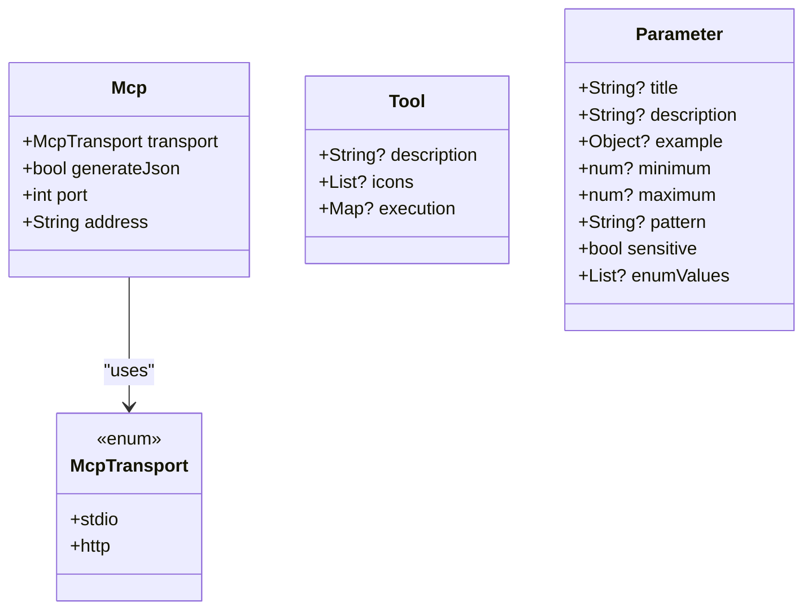
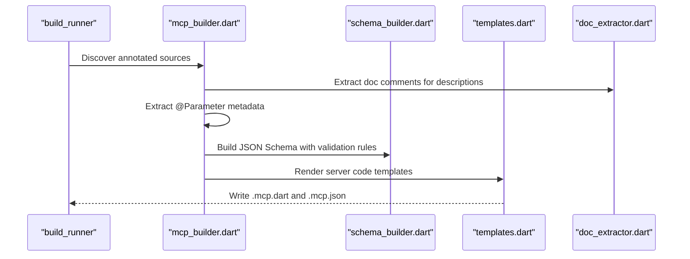
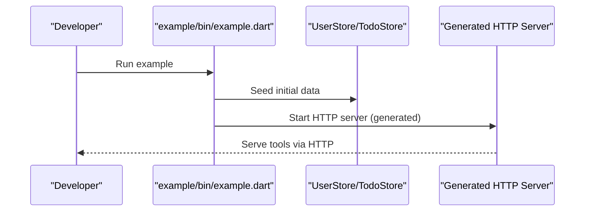
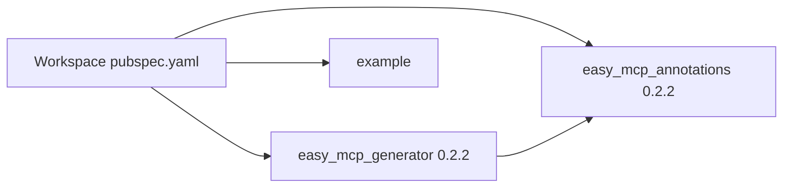
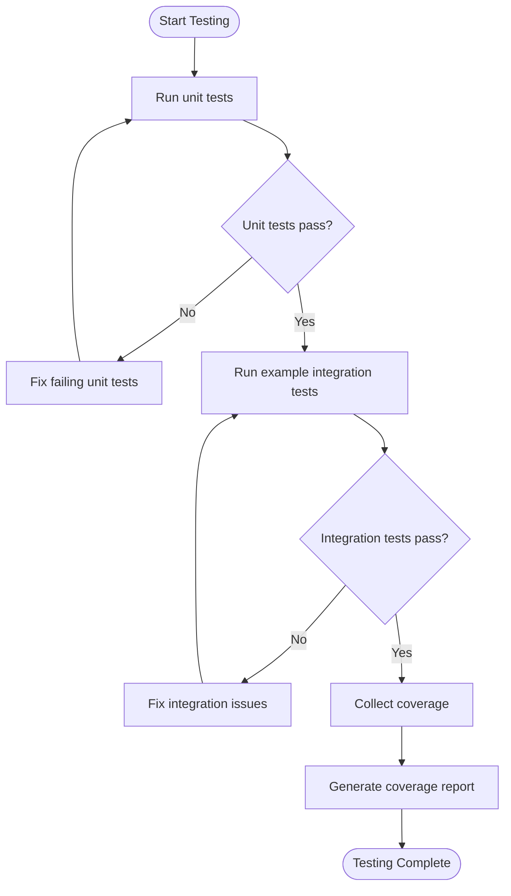
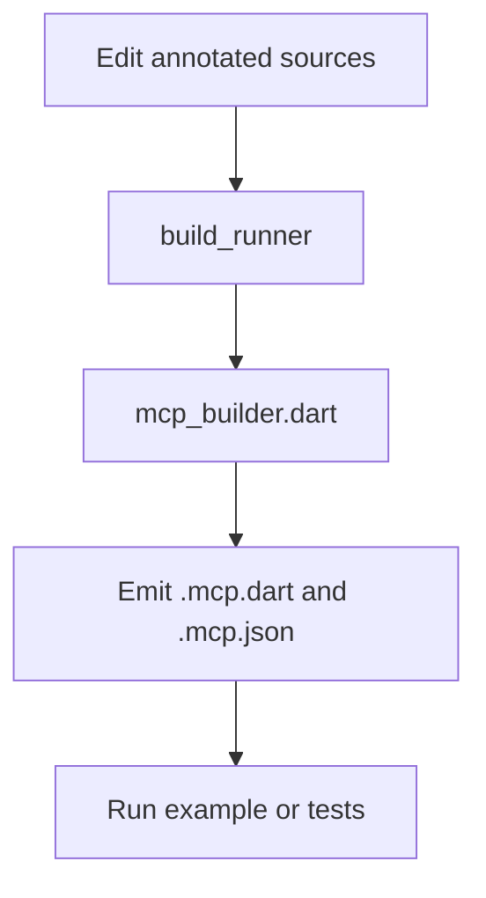
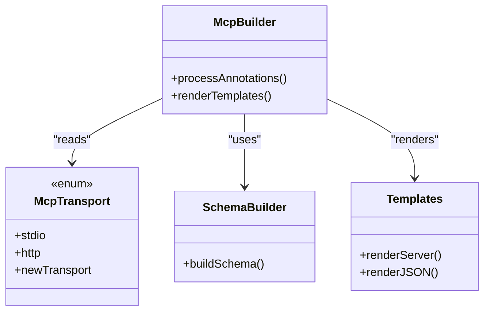

# Development Guide

<cite>
**Referenced Files in This Document**
- [README.md](file://README.md)
- [pubspec.yaml](file://pubspec.yaml)
- [CHANGELOG.md](file://CHANGELOG.md)
- [packages/easy_mcp_annotations/pubspec.yaml](file://packages/easy_mcp_annotations/pubspec.yaml)
- [packages/easy_mcp_annotations/CHANGELOG.md](file://packages/easy_mcp_annotations/CHANGELOG.md)
- [packages/easy_mcp_generator/pubspec.yaml](file://packages/easy_mcp_generator/pubspec.yaml)
- [packages/easy_mcp_generator/CHANGELOG.md](file://packages/easy_mcp_generator/CHANGELOG.md)
- [packages/easy_mcp_annotations/lib/mcp_annotations.dart](file://packages/easy_mcp_annotations/lib/mcp_annotations.dart)
- [packages/easy_mcp_generator/README.md](file://packages/easy_mcp_generator/README.md)
- [packages/easy_mcp_generator/build.yaml](file://packages/easy_mcp_generator/build.yaml)
- [packages/easy_mcp_generator/lib/mcp_generator.dart](file://packages/easy_mcp_generator/lib/mcp_generator.dart)
- [packages/easy_mcp_generator/lib/builder/mcp_builder.dart](file://packages/easy_mcp_generator/lib/builder/mcp_builder.dart)
- [packages/easy_mcp_generator/lib/builder/schema_builder.dart](file://packages/easy_mcp_generator/lib/builder/schema_builder.dart)
- [packages/easy_mcp_generator/lib/builder/templates.dart](file://packages/easy_mcp_generator/lib/builder/templates.dart)
- [packages/easy_mcp_generator/lib/builder/doc_extractor.dart](file://packages/easy_mcp_generator/lib/builder/doc_extractor.dart)
- [packages/easy_mcp_generator/test/mcp_builder_test.dart](file://packages/easy_mcp_generator/test/mcp_builder_test.dart)
- [packages/easy_mcp_generator/test/schema_builder_test.dart](file://packages/easy_mcp_generator/test/schema_builder_test.dart)
- [packages/easy_mcp_generator/test/templates_test.dart](file://packages/easy_mcp_generator/test/templates_test.dart)
- [example/pubspec.yaml](file://example/pubspec.yaml)
- [example/bin/example.dart](file://example/bin/example.dart)
</cite>

## Update Summary
**Changes Made**
- Updated version information to reflect 0.2.2 release across all Easy MCP packages
- Updated package version references throughout the documentation to match current state
- Enhanced version management documentation to reflect improved dependency practices
- Updated release procedures to reflect current version numbering scheme
- Corrected all version references from 0.2.0 to 0.2.2 in development workflows

## Table of Contents
1. [Introduction](#introduction)
2. [Project Structure](#project-structure)
3. [Core Components](#core-components)
4. [Architecture Overview](#architecture-overview)
5. [Detailed Component Analysis](#detailed-component-analysis)
6. [Dependency Analysis](#dependency-analysis)
7. [Performance Considerations](#performance-considerations)
8. [Troubleshooting Guide](#troubleshooting-guide)
9. [Contribution Guidelines](#contribution-guidelines)
10. [Development Environment Setup](#development-environment-setup)
11. [Testing Strategy](#testing-strategy)
12. [Build System and Generated Code](#build-system-and-generated-code)
13. [Extending the Framework](#extending-the-framework)
14. [Release and Version Management](#release-and-version-management)
15. [Security Guidelines](#security-guidelines)
16. [Conclusion](#conclusion)

## Introduction
This development guide explains how to build, test, and contribute to the Easy MCP framework. It covers workspace management with Melos, the build system powered by build_runner, testing strategies, development environment setup, contribution workflows, and extension patterns for maintainers and extension developers. The framework is currently at version 0.2.2 with enhanced @Parameter annotation support and comprehensive publishing procedures.

## Project Structure
The repository is a Melos-managed workspace with three primary parts:
- Workspace root: defines Melos scripts and coordinates packages and example.
- packages/easy_mcp_annotations: provides annotations used to mark methods for MCP tool generation.
- packages/easy_mcp_generator: a build_runner generator that produces MCP server code and metadata from annotated sources.
- example: a sample application demonstrating usage of the annotations and generator.

**Diagram sources**
- [pubspec.yaml:1-64](file://pubspec.yaml#L1-L64)
- [packages/easy_mcp_annotations/pubspec.yaml:1-28](file://packages/easy_mcp_annotations/pubspec.yaml#L1-L28)
- [packages/easy_mcp_generator/pubspec.yaml:1-34](file://packages/easy_mcp_generator/pubspec.yaml#L1-L34)
- [example/pubspec.yaml:1-22](file://example/pubspec.yaml#L1-L22)

**Section sources**
- [pubspec.yaml:1-64](file://pubspec.yaml#L1-L64)
- [README.md:1-168](file://README.md#L1-L168)

## Core Components
- Annotations package: Defines McpTransport and annotations such as Mcp and Tool used to mark methods and libraries for MCP exposure. Now includes comprehensive @Parameter annotation support for enhanced parameter metadata.
- Generator package: Implements a build_runner builder that parses annotated sources and emits MCP server code and JSON metadata with rich parameter validation.

Key responsibilities:
- easy_mcp_annotations: Provide stable, minimal annotation APIs with @Parameter support for enhanced parameter metadata consumption by generators.
- easy_mcp_generator: Parse AST, extract tool metadata including parameter annotations, generate server code and JSON schema, and wire transport-specific handlers.

**Section sources**
- [packages/easy_mcp_annotations/lib/mcp_annotations.dart:1-241](file://packages/easy_mcp_annotations/lib/mcp_annotations.dart#L1-L241)
- [packages/easy_mcp_generator/README.md:1-156](file://packages/easy_mcp_generator/README.md#L1-L156)

## Architecture Overview
The framework follows a layered architecture:
- Annotations layer: Minimal Dart APIs for marking code with enhanced @Parameter support for rich metadata.
- Generator layer: AST-based code generation for stdio and HTTP transports with comprehensive parameter validation.
- Example layer: Demonstrates usage and validates end-to-end behavior.

**Diagram sources**
- [packages/easy_mcp_annotations/lib/mcp_annotations.dart:6-241](file://packages/easy_mcp_annotations/lib/mcp_annotations.dart#L6-L241)
- [packages/easy_mcp_generator/lib/builder/mcp_builder.dart](file://packages/easy_mcp_generator/lib/builder/mcp_builder.dart)
- [packages/easy_mcp_generator/lib/builder/schema_builder.dart](file://packages/easy_mcp_generator/lib/builder/schema_builder.dart)
- [packages/easy_mcp_generator/lib/builder/templates.dart](file://packages/easy_mcp_generator/lib/builder/templates.dart)
- [packages/easy_mcp_generator/lib/builder/doc_extractor.dart](file://packages/easy_mcp_generator/lib/builder/doc_extractor.dart)
- [example/bin/example.dart:1-67](file://example/bin/example.dart#L1-L67)

## Detailed Component Analysis

### Annotations Package
The annotations define transport mode and tool metadata with comprehensive @Parameter support. They are intentionally minimal and stable to support long-term compatibility.

**Diagram sources**
- [packages/easy_mcp_annotations/lib/mcp_annotations.dart:6-241](file://packages/easy_mcp_annotations/lib/mcp_annotations.dart#L6-L241)

**Section sources**
- [packages/easy_mcp_annotations/lib/mcp_annotations.dart:6-241](file://packages/easy_mcp_annotations/lib/mcp_annotations.dart#L6-L241)
- [packages/easy_mcp_annotations/pubspec.yaml:1-28](file://packages/easy_mcp_annotations/pubspec.yaml#L1-L28)

### Generator Package
The generator uses build_runner to process annotated sources and emit:
- A .mcp.dart server implementation (stdio or HTTP)
- A .mcp.json metadata file with tool schemas including parameter validation rules

**Diagram sources**
- [packages/easy_mcp_generator/lib/builder/mcp_builder.dart](file://packages/easy_mcp_generator/lib/builder/mcp_builder.dart)
- [packages/easy_mcp_generator/lib/builder/schema_builder.dart](file://packages/easy_mcp_generator/lib/builder/schema_builder.dart)
- [packages/easy_mcp_generator/lib/builder/templates.dart](file://packages/easy_mcp_generator/lib/builder/templates.dart)
- [packages/easy_mcp_generator/lib/builder/doc_extractor.dart](file://packages/easy_mcp_generator/lib/builder/doc_extractor.dart)

**Section sources**
- [packages/easy_mcp_generator/README.md:1-156](file://packages/easy_mcp_generator/README.md#L1-L156)
- [packages/easy_mcp_generator/build.yaml:1-12](file://packages/easy_mcp_generator/build.yaml#L1-L12)
- [packages/easy_mcp_generator/pubspec.yaml:1-34](file://packages/easy_mcp_generator/pubspec.yaml#L1-L34)

### Example Application
The example demonstrates HTTP transport usage and seeds data for demonstration.

**Diagram sources**
- [example/bin/example.dart:1-67](file://example/bin/example.dart#L1-L67)

**Section sources**
- [example/bin/example.dart:1-67](file://example/bin/example.dart#L1-L67)
- [example/pubspec.yaml:1-22](file://example/pubspec.yaml#L1-L22)

## Dependency Analysis
The workspace coordinates three packages with explicit interdependencies and Melos scripts for multi-package workflows.

**Diagram sources**
- [pubspec.yaml:1-64](file://pubspec.yaml#L1-L64)
- [packages/easy_mcp_annotations/pubspec.yaml:1-28](file://packages/easy_mcp_annotations/pubspec.yaml#L1-L28)
- [packages/easy_mcp_generator/pubspec.yaml:1-34](file://packages/easy_mcp_generator/pubspec.yaml#L1-L34)
- [example/pubspec.yaml:1-22](file://example/pubspec.yaml#L1-L22)

**Section sources**
- [pubspec.yaml:1-64](file://pubspec.yaml#L1-L64)
- [packages/easy_mcp_generator/pubspec.yaml:1-34](file://packages/easy_mcp_generator/pubspec.yaml#L1-L34)

## Performance Considerations
- Keep annotations minimal and stable to reduce generator overhead.
- Prefer incremental builds by leveraging build_runner watch mode during development.
- Avoid heavy reflection in generated code; rely on static templates and schema builders.
- Use JSON schema generation judiciously to balance accuracy and build time.
- Leverage @Parameter annotation caching for frequently used parameter metadata.

## Troubleshooting Guide
Common issues and resolutions:
- Build failures due to missing build_runner: Ensure dev_dependencies are installed and run the build script from Melos.
- Generated code not updating: Clean generated files and rebuild using the Melos build commands.
- Transport mismatch: Verify McpTransport setting in annotations matches the intended runtime environment.
- JSON schema errors: Confirm parameter types are serializable and documented appropriately.
- @Parameter annotation not recognized: Ensure @Parameter is imported from easy_mcp_annotations package.

**Section sources**
- [pubspec.yaml:35-38](file://pubspec.yaml#L35-L38)
- [packages/easy_mcp_generator/README.md:1-156](file://packages/easy_mcp_generator/README.md#L1-L156)

## Contribution Guidelines
- Fork and branch: Work from feature branches; keep commits small and focused.
- Code style: Use melos run format and melos run analyze to enforce style and static checks.
- Tests: Add unit tests for new logic; run melos run test to validate changes.
- Pull requests: Open PRs against the main branch; include a summary of changes and rationale.
- Reviews: Expect feedback; address comments promptly and re-run quality checks.

**Section sources**
- [pubspec.yaml:21-28](file://pubspec.yaml#L21-L28)
- [pubspec.yaml:30-34](file://pubspec.yaml#L30-L34)

## Development Environment Setup
- Prerequisites: Dart SDK ^3.9.0 and Melos.
- Bootstrap the workspace: Run melos bootstrap to install dependencies across packages.
- IDE: Open the root folder in your editor; enable Dart analysis and formatting.
- Debugging: Use your IDE's debugger to launch example/bin/example.dart or attach to generated server processes.

**Section sources**
- [README.md:135-168](file://README.md#L135-L168)
- [pubspec.yaml:5-7](file://pubspec.yaml#L5-L7)

## Testing Strategy
- Unit tests: Located under packages/easy_mcp_generator/test; validate builder logic, schema generation, and template rendering.
- Integration tests: Use the example app to exercise generated servers and ensure end-to-end behavior.
- Quality gates: Run melos run test and melos run test:coverage to ensure coverage and correctness.

**Diagram sources**
- [packages/easy_mcp_generator/test/mcp_builder_test.dart](file://packages/easy_mcp_generator/test/mcp_builder_test.dart)
- [packages/easy_mcp_generator/test/schema_builder_test.dart](file://packages/easy_mcp_generator/test/schema_builder_test.dart)
- [packages/easy_mcp_generator/test/templates_test.dart](file://packages/easy_mcp_generator/test/templates_test.dart)

**Section sources**
- [pubspec.yaml:30-34](file://pubspec.yaml#L30-L34)
- [packages/easy_mcp_generator/test/mcp_builder_test.dart](file://packages/easy_mcp_generator/test/mcp_builder_test.dart)
- [packages/easy_mcp_generator/test/schema_builder_test.dart](file://packages/easy_mcp_generator/test/schema_builder_test.dart)
- [packages/easy_mcp_generator/test/templates_test.dart](file://packages/easy_mcp_generator/test/templates_test.dart)

## Build System and Generated Code
- Build runner configuration: The generator declares a builder in build.yaml with extensions for .mcp.dart and .mcp.json.
- Watch mode: Use melos run build:watch to continuously regenerate code as sources change.
- Generated artifacts: The generator emits a server implementation and a JSON metadata file per annotated source.

**Diagram sources**
- [packages/easy_mcp_generator/build.yaml:1-12](file://packages/easy_mcp_generator/build.yaml#L1-L12)
- [pubspec.yaml:35-38](file://pubspec.yaml#L35-L38)

**Section sources**
- [packages/easy_mcp_generator/build.yaml:1-12](file://packages/easy_mcp_generator/build.yaml#L1-L12)
- [pubspec.yaml:35-38](file://pubspec.yaml#L35-L38)

## Extending the Framework
- Adding new transport modes: Extend McpTransport and update the generator to render transport-specific server code in templates.
- Customizing code generation: Modify schema_builder.dart and templates.dart to adapt schema mapping and emitted code structure.
- New annotations: Add stable annotations to easy_mcp_annotations and wire them through mcp_builder.dart and doc_extractor.dart.

**Diagram sources**
- [packages/easy_mcp_annotations/lib/mcp_annotations.dart:6-241](file://packages/easy_mcp_annotations/lib/mcp_annotations.dart#L6-L241)
- [packages/easy_mcp_generator/lib/builder/mcp_builder.dart](file://packages/easy_mcp_generator/lib/builder/mcp_builder.dart)
- [packages/easy_mcp_generator/lib/builder/schema_builder.dart](file://packages/easy_mcp_generator/lib/builder/schema_builder.dart)
- [packages/easy_mcp_generator/lib/builder/templates.dart](file://packages/easy_mcp_generator/lib/builder/templates.dart)

**Section sources**
- [packages/easy_mcp_annotations/lib/mcp_annotations.dart:6-241](file://packages/easy_mcp_annotations/lib/mcp_annotations.dart#L6-L241)
- [packages/easy_mcp_generator/lib/builder/mcp_builder.dart](file://packages/easy_mcp_generator/lib/builder/mcp_builder.dart)
- [packages/easy_mcp_generator/lib/builder/schema_builder.dart](file://packages/easy_mcp_generator/lib/builder/schema_builder.dart)
- [packages/easy_mcp_generator/lib/builder/templates.dart](file://packages/easy_mcp_generator/lib/builder/templates.dart)

## Release and Version Management
- Versioning: Both packages declare version 0.2.2; update versions consistently across related packages.
- Publishing: Use Melos scripts to dry-run and publish packages in the correct order.
- Dependency updates: Use melos run upgrade and melos run outdated to manage dependency health.
- Version alignment: All packages maintain the same version number (0.2.2) to ensure compatibility.

**Updated** Version management now reflects the current 0.2.2 release with improved dependency alignment and consistent versioning across all packages.

**Section sources**
- [pubspec.yaml:40-54](file://pubspec.yaml#L40-L54)
- [packages/easy_mcp_annotations/pubspec.yaml:3](file://packages/easy_mcp_annotations/pubspec.yaml#L3)
- [packages/easy_mcp_generator/pubspec.yaml:3](file://packages/easy_mcp_generator/pubspec.yaml#L3)
- [packages/easy_mcp_annotations/CHANGELOG.md:10-18](file://packages/easy_mcp_annotations/CHANGELOG.md#L10-L18)
- [packages/easy_mcp_generator/CHANGELOG.md:10-18](file://packages/easy_mcp_generator/CHANGELOG.md#L10-L18)

## Security Guidelines
- Parameter validation: Use @Parameter annotation with pattern, minimum, and maximum fields for input sanitization.
- Sensitive data handling: Mark sensitive parameters with sensitive: true to enable masking in MCP clients.
- Transport security: Use HTTP transport with proper address binding (avoid 0.0.0.0 in production environments).
- Dependency updates: Regularly run melos run outdated to identify and update vulnerable dependencies.
- Code review: Implement mandatory security review for any changes affecting parameter validation or transport security.

**Section sources**
- [packages/easy_mcp_annotations/lib/mcp_annotations.dart:142-241](file://packages/easy_mcp_annotations/lib/mcp_annotations.dart#L142-L241)
- [packages/easy_mcp_generator/README.md:62-106](file://packages/easy_mcp_generator/README.md#L62-L106)

## Conclusion
This guide outlined how to develop, test, and contribute to the Easy MCP framework version 0.2.2. By leveraging Melos for workspace management, build_runner for code generation, and a clear separation of concerns between annotations and generators, contributors can reliably extend the framework and add new capabilities while maintaining high-quality standards. The enhanced @Parameter annotation support provides comprehensive parameter metadata and validation capabilities for building secure and user-friendly MCP tools. The current version 0.2.2 represents a stable release with improved dependency management and consistent versioning across all packages.