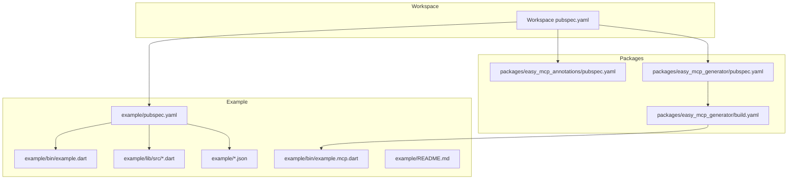
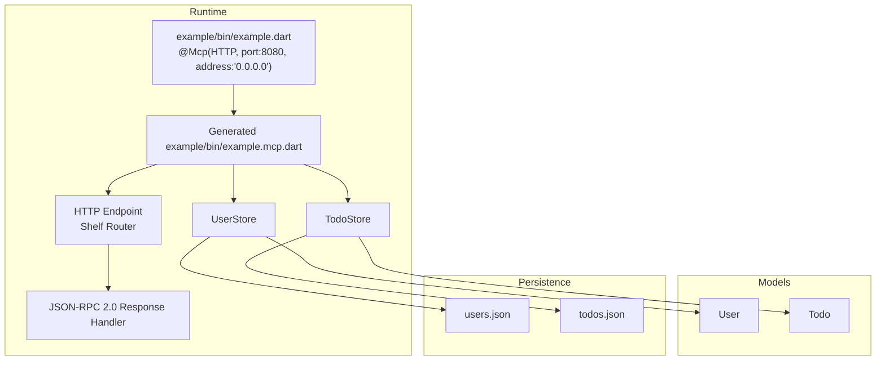
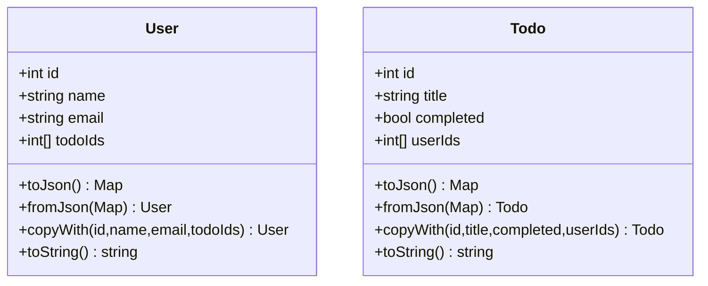
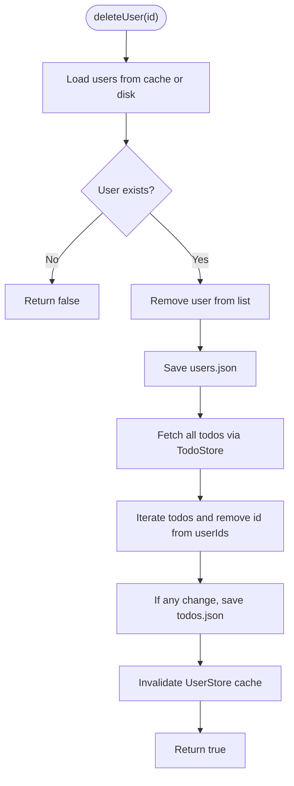
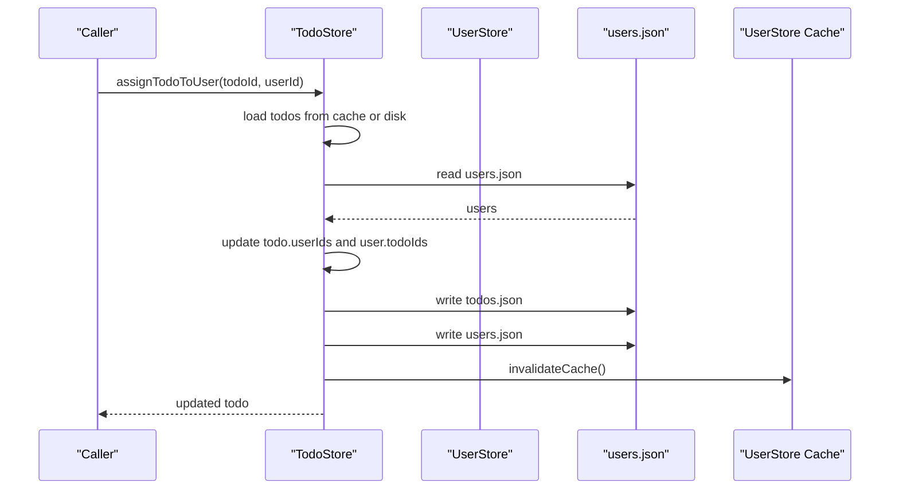
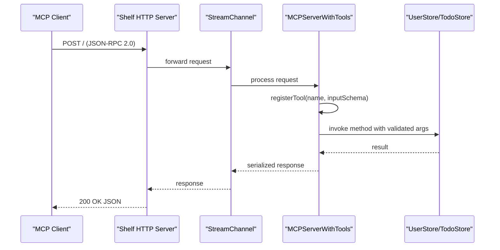
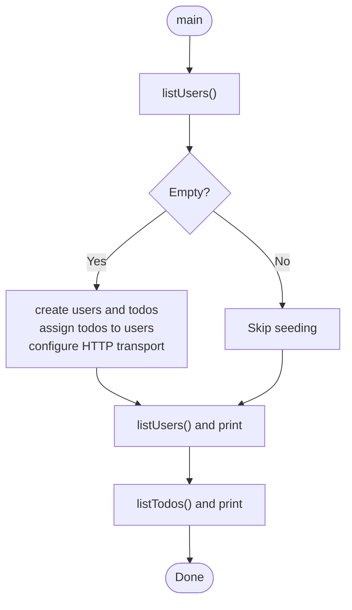
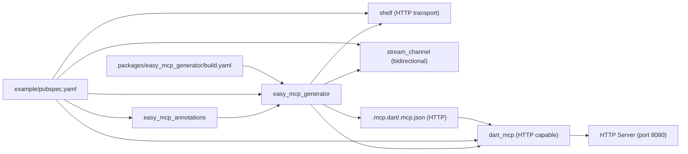

# Example Implementation

<cite>
**Referenced Files in This Document**
- [README.md](file://README.md)
- [pubspec.yaml](file://pubspec.yaml)
- [example/README.md](file://example/README.md)
- [example/pubspec.yaml](file://example/pubspec.yaml)
- [example/bin/example.dart](file://example/bin/example.dart)
- [example/bin/example.mcp.dart](file://example/bin/example.mcp.dart)
- [example/lib/src/user.dart](file://example/lib/src/user.dart)
- [example/lib/src/user_store.dart](file://example/lib/src/user_store.dart)
- [example/lib/src/todo.dart](file://example/lib/src/todo.dart)
- [example/lib/src/todo_store.dart](file://example/lib/src/todo_store.dart)
- [example/todos.json](file://example/todos.json)
- [example/users.json](file://example/users.json)
- [packages/easy_mcp_generator/build.yaml](file://packages/easy_mcp_generator/build.yaml)
- [packages/easy_mcp_annotations/pubspec.yaml](file://packages/easy_mcp_annotations/pubspec.yaml)
- [packages/easy_mcp_generator/pubspec.yaml](file://packages/easy_mcp_generator/pubspec.yaml)
</cite>

## Update Summary
**Changes Made**
- Updated transport configuration section to reflect HTTP-based MCP server implementation
- Enhanced TodoStore documentation to highlight comprehensive persistent storage capabilities
- Added detailed explanation of many-to-many relationship management between users and todos
- Updated architecture overview to show HTTP transport with Shelf integration
- Revised step-by-step walkthroughs to include HTTP server configuration and testing
- Enhanced API reference with complete tool schemas and transport-specific considerations

## Table of Contents
1. [Introduction](#introduction)
2. [Project Structure](#project-structure)
3. [Core Components](#core-components)
4. [Architecture Overview](#architecture-overview)
5. [Detailed Component Analysis](#detailed-component-analysis)
6. [Dependency Analysis](#dependency-analysis)
7. [Performance Considerations](#performance-considerations)
8. [Troubleshooting Guide](#troubleshooting-guide)
9. [Conclusion](#conclusion)
10. [Appendices](#appendices)

## Introduction
This document explains a practical example implementation of Easy MCP that demonstrates building an HTTP-based MCP server from annotated Dart functions. The example models two domains with comprehensive persistent storage:
- User management: CRUD operations, search, and cross-store relationships
- Task management: many-to-many relationships between users and tasks with bidirectional reference management

The implementation showcases a complete HTTP server solution using Shelf transport with proper JSON-RPC 2.0 handling, demonstrating how annotations transform your code into a production-ready MCP server with automatic schema generation and transport configuration.

## Project Structure
The workspace is a Dart package set with three parts:
- example: The runnable example with annotated stores and generated HTTP server
- packages/easy_mcp_annotations: Annotations for marking entry points and tools
- packages/easy_mcp_generator: Build runner generator that emits MCP server code with HTTP transport support

**Diagram sources**
- [pubspec.yaml:1-64](file://pubspec.yaml#L1-L64)
- [example/pubspec.yaml:1-22](file://example/pubspec.yaml#L1-L22)
- [packages/easy_mcp_annotations/pubspec.yaml:1-28](file://packages/easy_mcp_annotations/pubspec.yaml#L1-L28)
- [packages/easy_mcp_generator/pubspec.yaml:1-35](file://packages/easy_mcp_generator/pubspec.yaml#L1-L35)
- [packages/easy_mcp_generator/build.yaml:1-12](file://packages/easy_mcp_generator/build.yaml#L1-L12)
- [example/bin/example.dart:1-67](file://example/bin/example.dart#L1-L67)
- [example/bin/example.mcp.dart:1-490](file://example/bin/example.mcp.dart#L1-L490)
- [example/lib/src/user.dart:1-42](file://example/lib/src/user.dart#L1-L42)
- [example/lib/src/todo.dart:1-46](file://example/lib/src/todo.dart#L1-L46)
- [example/lib/src/user_store.dart:1-144](file://example/lib/src/user_store.dart#L1-L144)
- [example/lib/src/todo_store.dart:1-236](file://example/lib/src/todo_store.dart#L1-L236)
- [example/todos.json:1-1](file://example/todos.json#L1-L1)
- [example/users.json:1-1](file://example/users.json#L1-L1)

**Section sources**
- [pubspec.yaml:1-64](file://pubspec.yaml#L1-L64)
- [example/pubspec.yaml:1-22](file://example/pubspec.yaml#L1-L22)
- [example/README.md:192-207](file://example/README.md#L192-L207)

## Core Components
- Data models
  - User: immutable fields plus a mutable list of associated todo identifiers with JSON serialization
  - Todo: immutable fields plus a mutable list of associated user identifiers with JSON serialization
- Stores
  - UserStore: persistent JSON-backed store with caching, CRUD, search, and cleanup routines with cross-store integration
  - TodoStore: comprehensive persistent JSON-backed store with caching, CRUD, completion toggling, and sophisticated cross-store assignment/removal
- Generated HTTP server
  - example/bin/example.mcp.dart: HTTP server with Shelf transport that exposes all @Tool methods as MCP tools with JSON-RPC 2.0 support
- Console entry point
  - example/bin/example.dart: Demonstrates seeding data and listing users/todos with HTTP transport configuration

Key implementation patterns:
- Cross-store operations: TodoStore reads/writes UserStore data and vice versa to maintain bidirectional references
- Caching: Stores cache loaded lists to avoid repeated disk I/O with proper cache invalidation
- Idempotent updates: Assignment/Removal checks presence before modifying collections
- Cleanup on delete: Deleting a user removes references from todos; deleting a todo removes references from users
- HTTP transport: Proper JSON-RPC 2.0 handling with Shelf integration and bidirectional stream channel support

**Section sources**
- [example/lib/src/user.dart:1-42](file://example/lib/src/user.dart#L1-L42)
- [example/lib/src/todo.dart:1-46](file://example/lib/src/todo.dart#L1-L46)
- [example/lib/src/user_store.dart:1-144](file://example/lib/src/user_store.dart#L1-L144)
- [example/lib/src/todo_store.dart:1-236](file://example/lib/src/todo_store.dart#L1-L236)
- [example/bin/example.mcp.dart:70-490](file://example/bin/example.mcp.dart#L70-L490)
- [example/bin/example.dart:1-67](file://example/bin/example.dart#L1-L67)

## Architecture Overview
The example uses annotations to declare MCP entry points and tools with HTTP transport configuration. The generator scans the annotated entry point and imports to produce a complete MCP server that:
- Registers tools with JSON Schema input validation
- Bridges tool invocations to your store methods
- Supports HTTP transport via Shelf with bidirectional stream channel
- Handles JSON-RPC 2.0 protocol with proper request/response routing

**Diagram sources**
- [example/bin/example.dart:6-7](file://example/bin/example.dart#L6-L7)
- [example/bin/example.mcp.dart:17-68](file://example/bin/example.mcp.dart#L17-L68)
- [example/lib/src/user_store.dart:9-144](file://example/lib/src/user_store.dart#L9-L144)
- [example/lib/src/todo_store.dart:9-236](file://example/lib/src/todo_store.dart#L9-L236)
- [example/lib/src/user.dart:1-42](file://example/lib/src/user.dart#L1-L42)
- [example/lib/src/todo.dart:1-46](file://example/lib/src/todo.dart#L1-L46)
- [example/users.json:1-1](file://example/users.json#L1-L1)
- [example/todos.json:1-1](file://example/todos.json#L1-L1)

## Detailed Component Analysis

### Data Models: User and Todo
- User: immutable fields plus a mutable list of associated todo identifiers with comprehensive serialization/deserialization
- Todo: immutable fields plus a mutable list of associated user identifiers with comprehensive serialization/deserialization
- Both models include efficient JSON serialization helpers and copyWith for safe mutations

**Diagram sources**
- [example/lib/src/user.dart:1-42](file://example/lib/src/user.dart#L1-L42)
- [example/lib/src/todo.dart:1-46](file://example/lib/src/todo.dart#L1-L46)

**Section sources**
- [example/lib/src/user.dart:1-42](file://example/lib/src/user.dart#L1-L42)
- [example/lib/src/todo.dart:1-46](file://example/lib/src/todo.dart#L1-L46)

### User Store: Comprehensive CRUD, Search, and Cross-Cleanup
Responsibilities:
- Create, read, list, delete, and search users with caching and persistence
- Resolve a user's assigned todos by filtering TodoStore
- On user deletion, remove the user's references from all todos with proper cache invalidation

Implementation highlights:
- Caching: loads from disk once per process and invalidates on write operations
- Persistence: writes JSON arrays to users.json with efficient serialization
- Cross-store: deletes call TodoStore.listTodos and update affected todos
- Cache management: centralized invalidation mechanism for consistency

**Diagram sources**
- [example/lib/src/user_store.dart:101-128](file://example/lib/src/user_store.dart#L101-L128)
- [example/lib/src/todo_store.dart:95-126](file://example/lib/src/todo_store.dart#L95-L126)

**Section sources**
- [example/lib/src/user_store.dart:1-144](file://example/lib/src/user_store.dart#L1-L144)
- [example/lib/src/todo_store.dart:95-126](file://example/lib/src/todo_store.dart#L95-L126)

### Todo Store: Advanced Many-to-Many Assignment and Cross-Store Operations
Responsibilities:
- Create, read, list, delete, and mark completion for todos with comprehensive state management
- Assign/remove a user from a todo with bidirectional updates and idempotent operations
- Retrieve todos assigned to a specific user with efficient filtering
- On todo deletion, remove the todo's references from all users with proper cache invalidation

Advanced cross-store operations:
- Reads/writes users.json to keep references consistent across stores
- Invalidates UserStore cache after cross-modifications to maintain data integrity
- Implements sophisticated conflict resolution and idempotent update patterns
- Provides transaction-like behavior through coordinated file operations

**Diagram sources**
- [example/lib/src/todo_store.dart:143-182](file://example/lib/src/todo_store.dart#L143-L182)
- [example/lib/src/user_store.dart:14](file://example/lib/src/user_store.dart#L14)

**Section sources**
- [example/lib/src/todo_store.dart:1-236](file://example/lib/src/todo_store.dart#L1-L236)
- [example/lib/src/user_store.dart:1-144](file://example/lib/src/user_store.dart#L1-L144)

### Generated HTTP Server: Complete Tool Registration and Invocation
The generator creates a comprehensive Shelf-based HTTP server that:
- Exposes a JSON endpoint to receive MCP requests on port 8080
- Registers tools with JSON Schema input validation for each method
- Delegates tool calls to your store methods with proper error handling
- Serializes results to JSON for transport with bidirectional stream channel support
- Implements JSON-RPC 2.0 protocol with proper request/response routing

**Diagram sources**
- [example/bin/example.mcp.dart:17-68](file://example/bin/example.mcp.dart#L17-L68)
- [example/bin/example.mcp.dart:70-490](file://example/bin/example.mcp.dart#L70-L490)

**Section sources**
- [example/bin/example.mcp.dart:1-490](file://example/bin/example.mcp.dart#L1-L490)

### Console Entry Point: Enhanced Seeding and Listing
The console entry point demonstrates:
- Seeding initial data when stores are empty with HTTP transport configuration
- Listing users and their assigned todos with proper error handling
- Listing all todos with comprehensive display formatting
- HTTP server startup with proper port binding and address configuration

**Diagram sources**
- [example/bin/example.dart:7-67](file://example/bin/example.dart#L7-L67)

**Section sources**
- [example/bin/example.dart:1-67](file://example/bin/example.dart#L1-L67)

## Dependency Analysis
The example depends on:
- easy_mcp_annotations for @Mcp and @Tool annotations with transport configuration
- easy_mcp_generator for code generation with HTTP transport support
- dart_mcp for the MCP server runtime with HTTP transport capabilities
- shelf for HTTP transport with JSON-RPC 2.0 handling
- stream_channel for bidirectional communication support

Build pipeline:
- build_runner triggers the generator with proper transport configuration
- The generator produces example/bin/example.mcp.dart with HTTP server support
- The build.yaml maps .dart to .mcp.dart/.mcp.json with enhanced transport handling
- HTTP server configuration includes port binding and address settings

**Diagram sources**
- [example/pubspec.yaml:11-22](file://example/pubspec.yaml#L11-L22)
- [packages/easy_mcp_generator/build.yaml:1-12](file://packages/easy_mcp_generator/build.yaml#L1-12)
- [packages/easy_mcp_annotations/pubspec.yaml:11-13](file://packages/easy_mcp_annotations/pubspec.yaml#L11-L13)
- [packages/easy_mcp_generator/pubspec.yaml:10-19](file://packages/easy_mcp_generator/pubspec.yaml#L10-L19)

**Section sources**
- [example/pubspec.yaml:11-22](file://example/pubspec.yaml#L11-L22)
- [packages/easy_mcp_generator/build.yaml:1-12](file://packages/easy_mcp_generator/build.yaml#L1-12)
- [packages/easy_mcp_annotations/pubspec.yaml:1-28](file://packages/easy_mcp_annotations/pubspec.yaml#L1-L28)
- [packages/easy_mcp_generator/pubspec.yaml:1-35](file://packages/easy_mcp_generator/pubspec.yaml#L1-L35)

## Performance Considerations
- Caching: Stores cache loaded lists to reduce disk I/O with proper cache invalidation mechanisms
- Batch writes: Group updates to minimize file writes (e.g., after scanning all users/todos during cleanup)
- Idempotency: Assignment/removal checks presence before updating to avoid redundant writes
- Serialization: Use efficient JSON encoding and avoid unnecessary conversions with proper error handling
- Transport: HTTP transport with Shelf provides better development experience; for high-throughput scenarios, consider stdio transport and connection pooling
- Memory management: Proper cache invalidation prevents memory leaks in long-running HTTP servers
- Concurrent operations: HTTP server handles multiple concurrent requests through proper stream channel management

## Troubleshooting Guide
Common issues and resolutions:
- Tools not appearing
  - Ensure build_runner has run and generated example/bin/example.mcp.dart with HTTP transport
  - Verify @Mcp is applied to the entry point with transport: McpTransport.http and @Tool is on methods you want exposed
- HTTP server not starting
  - Confirm port 8080 is free and the generated server runs without errors
  - Check that example/bin/example.mcp.dart exists and imports stores correctly
  - Verify HTTP transport configuration in @Mcp annotation
- Data inconsistencies after cross-store operations
  - Ensure both stores write to disk and caches are invalidated after cross-modifications
  - Check that UserStore.invalidateCache() is called after TodoStore modifications
- JSON files missing or empty
  - The stores initialize empty files if they do not exist with proper error handling
  - Verify file paths and permissions for users.json and todos.json
- HTTP request handling issues
  - Ensure proper JSON-RPC 2.0 format in requests
  - Check that Shelf router properly handles POST requests on root endpoint
- Port conflicts
  - Change port in @Mcp annotation if 8080 is already in use
  - Verify network interface binding with address parameter

**Section sources**
- [example/bin/example.mcp.dart:17-68](file://example/bin/example.mcp.dart#L17-L68)
- [example/lib/src/user_store.dart:14](file://example/lib/src/user_store.dart#L14)
- [example/lib/src/todo_store.dart:119-121](file://example/lib/src/todo_store.dart#L119-L121)

## Conclusion
This example demonstrates how to build a robust HTTP-based MCP server from annotated Dart functions. By structuring data models and stores around clear responsibilities—caching, persistence, cross-store operations—you can implement scalable many-to-many relationships and complex workflows. The generator simplifies server creation with HTTP transport configuration, while the console entry point provides a practical way to seed and validate data. The comprehensive TodoStore implementation showcases advanced patterns for managing persistent storage with bidirectional relationships and proper cache management.

## Appendices

### Step-by-Step Walkthrough: Console Application
1. Install dependencies
   - Run dependency resolution in the example directory
2. Seed data (optional)
   - The console entry point seeds users and todos if the stores are empty with HTTP transport configuration
3. List users and their todos
   - The program prints all users and their assigned todos with proper formatting
4. List all todos
   - The program prints all todos with comprehensive display information

**Section sources**
- [example/bin/example.dart:7-67](file://example/bin/example.dart#L7-L67)

### Step-by-Step Walkthrough: HTTP Server
1. Install dependencies
   - Ensure example dependencies are resolved with HTTP transport support
2. Generate the server
   - Run the build runner to produce example/bin/example.mcp.dart with HTTP transport
3. Start the server
   - Run the generated server; it listens on port 8080 with HTTP transport
4. Test tools
   - Use the MCP Inspector to list and call tools
   - Example commands:
     - List tools: `npx @modelcontextprotocol/inspector --cli dart run example/bin/example.mcp.dart --method tools/list`
     - Call listUsers: `npx @modelcontextprotocol/inspector --cli dart run example/bin/example.mcp.dart --method tools/call --tool-name listUsers`
     - Call createUser with parameters: `npx @modelcontextprotocol/inspector --cli dart run example/bin/example.mcp.dart --method tools/call --tool-name createUser --tool-arg 'name=Test User' --tool-arg 'email=test@example.com'`
     - Call getUser with an ID: `npx @modelcontextprotocol/inspector --cli dart run example/bin/example.mcp.dart --method tools/call --tool-name getUser --tool-arg 'id=1'`
     - Call searchUsers with a query: `npx @modelcontextprotocol/inspector --cli dart run example/bin/example.mcp.dart --method tools/call --tool-name searchUsers --tool-arg 'query=Alice'`
     - Call getUserTodos with a user ID: `npx @modelcontextprotocol/inspector --cli dart run example/bin/example.mcp.dart --method tools/call --tool-name getUserTodos --tool-arg 'userId=1'`
     - Call createTodo with a title: `npx @modelcontextprotocol/inspector --cli dart run example/bin/example.mcp.dart --method tools/call --tool-name createTodo --tool-arg 'title=Buy groceries'`
     - Call listTodos: `npx @modelcontextprotocol/inspector --cli dart run example/bin/example.mcp.dart --method tools/call --tool-name listTodos`
     - Call completeTodo with an ID: `npx @modelcontextprotocol/inspector --cli dart run example/bin/example.mcp.dart --method tools/call --tool-name completeTodo --tool-arg 'id=1'`
     - Call assignTodoToUser with todoId and userId: `npx @modelcontextprotocol/inspector --cli dart run example/bin/example.mcp.dart --method tools/call --tool-name assignTodoToUser --tool-arg 'todoId=1' --tool-arg 'userId=1'`
     - Call removeTodoFromUser with todoId and userId: `npx @modelcontextprotocol/inspector --cli dart run example/bin/example.mcp.dart --method tools/call --tool-name removeTodoFromUser --tool-arg 'todoId=1' --tool-arg 'userId=1'`
     - Call getTodosForUser with a user ID: `npx @modelcontextprotocol/inspector --cli dart run example/bin/example.mcp.dart --method tools/call --tool-name getTodosForUser --tool-arg 'userId=1'`

**Section sources**
- [example/README.md:119-191](file://example/README.md#L119-L191)
- [example/bin/example.mcp.dart:17-68](file://example/bin/example.mcp.dart#L17-L68)

### API Reference: Tools and Schemas
- UserStore
  - createUser: name (string), email (string)
  - getUser: id (integer)
  - listUsers: no parameters
  - deleteUser: id (integer)
  - searchUsers: query (string)
  - getUserTodos: userId (integer)
- TodoStore
  - createTodo: title (string)
  - getTodo: id (integer)
  - listTodos: no parameters
  - deleteTodo: id (integer)
  - completeTodo: id (integer)
  - assignTodoToUser: todoId (integer), userId (integer)
  - removeTodoFromUser: todoId (integer), userId (integer)
  - getTodosForUser: userId (integer)

**Section sources**
- [example/README.md:76-103](file://example/README.md#L76-L103)
- [example/bin/example.mcp.dart:79-253](file://example/bin/example.mcp.dart#L79-L253)

### Data Models Reference
- User
  - Fields: id, name, email, todoIds
  - Methods: toJson, fromJson, copyWith, toString
- Todo
  - Fields: id, title, completed, userIds
  - Methods: toJson, fromJson, copyWith, toString

**Section sources**
- [example/lib/src/user.dart:1-42](file://example/lib/src/user.dart#L1-L42)
- [example/lib/src/todo.dart:1-46](file://example/lib/src/todo.dart#L1-L46)

### Best Practices and Extension Patterns
- Keep stores stateless except for caches; always persist changes with proper error handling
- Use copyWith to safely mutate models and avoid accidental shared state
- Centralize cross-store operations in one store to maintain consistency with proper cache invalidation
- Add logging and structured error responses for production HTTP servers
- Consider transactions or atomic batches for complex multi-write operations
- For scaling, replace JSON files with a database and add indexing for search queries
- For production, add health checks, rate limiting, and input validation beyond JSON Schema
- Implement proper HTTP error handling and response formatting
- Configure appropriate CORS settings for web-based clients
- Add monitoring and metrics collection for production HTTP servers
- Implement graceful shutdown procedures for HTTP server lifecycle management