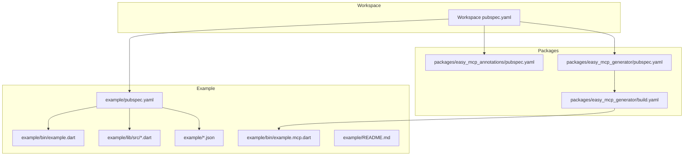
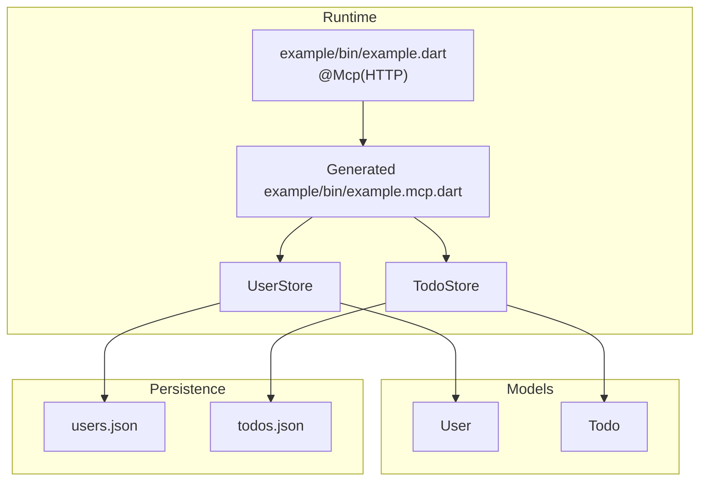
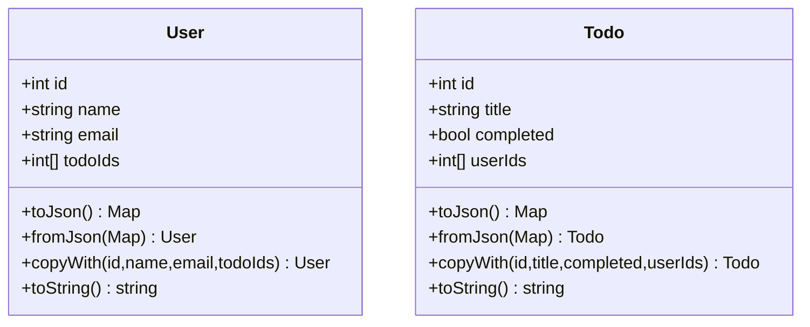
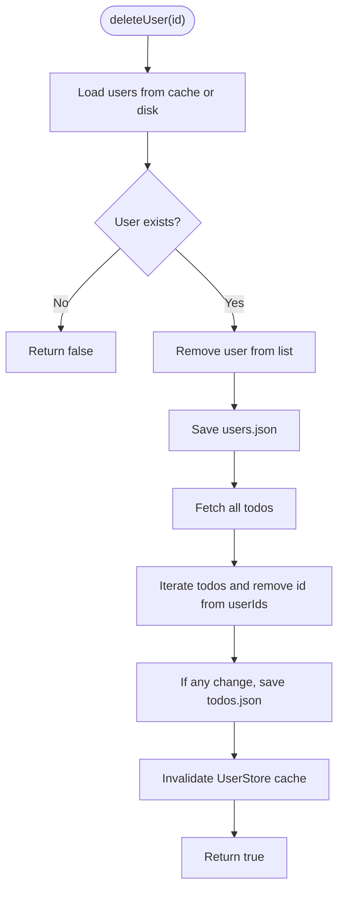
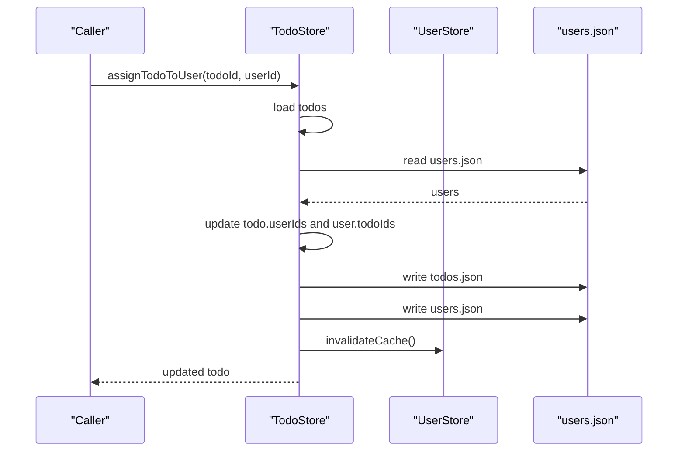
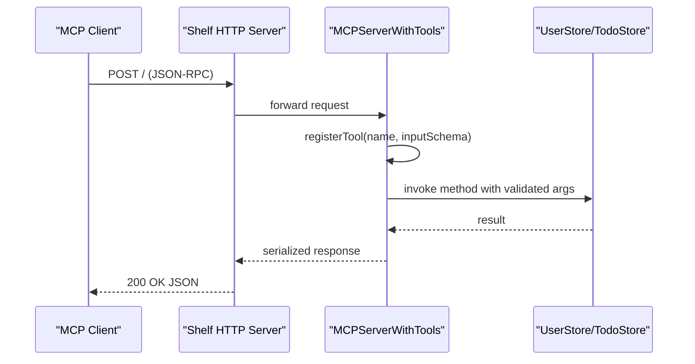
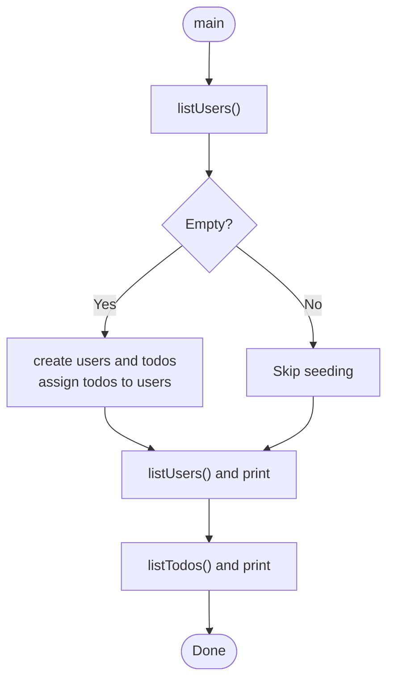
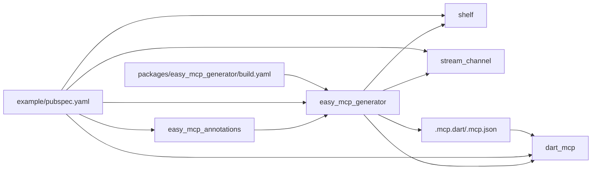

# Example Implementation

<cite>
**Referenced Files in This Document**
- [README.md](file://README.md)
- [pubspec.yaml](file://pubspec.yaml)
- [example/README.md](file://example/README.md)
- [example/pubspec.yaml](file://example/pubspec.yaml)
- [example/bin/example.dart](file://example/bin/example.dart)
- [example/bin/example.mcp.dart](file://example/bin/example.mcp.dart)
- [example/lib/src/user.dart](file://example/lib/src/user.dart)
- [example/lib/src/user_store.dart](file://example/lib/src/user_store.dart)
- [example/lib/src/todo.dart](file://example/lib/src/todo.dart)
- [example/lib/src/todo_store.dart](file://example/lib/src/todo_store.dart)
- [example/todos.json](file://example/todos.json)
- [example/users.json](file://example/users.json)
- [packages/easy_mcp_generator/build.yaml](file://packages/easy_mcp_generator/build.yaml)
- [packages/easy_mcp_annotations/pubspec.yaml](file://packages/easy_mcp_annotations/pubspec.yaml)
- [packages/easy_mcp_generator/pubspec.yaml](file://packages/easy_mcp_generator/pubspec.yaml)
</cite>

## Table of Contents
1. [Introduction](#introduction)
2. [Project Structure](#project-structure)
3. [Core Components](#core-components)
4. [Architecture Overview](#architecture-overview)
5. [Detailed Component Analysis](#detailed-component-analysis)
6. [Dependency Analysis](#dependency-analysis)
7. [Performance Considerations](#performance-considerations)
8. [Troubleshooting Guide](#troubleshooting-guide)
9. [Conclusion](#conclusion)
10. [Appendices](#appendices)

## Introduction
This document explains a practical example implementation of Easy MCP that demonstrates building an MCP server from annotated Dart functions. The example models two domains:
- User management: CRUD operations and search
- Task management: many-to-many relationships between users and tasks, with cross-store operations

It covers the example project structure, dependency configuration, build process integration, and step-by-step walkthroughs of both the console and HTTP server variants. You will learn how annotations transform your code into a production-ready MCP server, how data models and stores are structured, and how to extend and scale the example for real-world use.

## Project Structure
The workspace is a Dart package set with three parts:
- example: The runnable example with annotated stores and generated server
- packages/easy_mcp_annotations: Annotations for marking entry points and tools
- packages/easy_mcp_generator: Build runner generator that emits MCP server code

**Diagram sources**
- [pubspec.yaml:1-64](file://pubspec.yaml#L1-L64)
- [example/pubspec.yaml:1-22](file://example/pubspec.yaml#L1-L22)
- [packages/easy_mcp_annotations/pubspec.yaml:1-28](file://packages/easy_mcp_annotations/pubspec.yaml#L1-L28)
- [packages/easy_mcp_generator/pubspec.yaml:1-35](file://packages/easy_mcp_generator/pubspec.yaml#L1-L35)
- [packages/easy_mcp_generator/build.yaml:1-12](file://packages/easy_mcp_generator/build.yaml#L1-L12)
- [example/bin/example.dart:1-67](file://example/bin/example.dart#L1-L67)
- [example/bin/example.mcp.dart:1-490](file://example/bin/example.mcp.dart#L1-L490)
- [example/lib/src/user.dart:1-42](file://example/lib/src/user.dart#L1-L42)
- [example/lib/src/todo.dart:1-46](file://example/lib/src/todo.dart#L1-L46)
- [example/lib/src/user_store.dart:1-144](file://example/lib/src/user_store.dart#L1-L144)
- [example/lib/src/todo_store.dart:1-236](file://example/lib/src/todo_store.dart#L1-L236)
- [example/todos.json:1-1](file://example/todos.json#L1-L1)
- [example/users.json:1-1](file://example/users.json#L1-L1)

**Section sources**
- [pubspec.yaml:1-64](file://pubspec.yaml#L1-L64)
- [example/pubspec.yaml:1-22](file://example/pubspec.yaml#L1-L22)
- [example/README.md:192-207](file://example/README.md#L192-L207)

## Core Components
- Data models
  - User: identifier, name, email, and a list of associated todo identifiers
  - Todo: identifier, title, completion status, and a list of associated user identifiers
- Stores
  - UserStore: persistent JSON-backed store with caching, CRUD, search, and cleanup routines
  - TodoStore: persistent JSON-backed store with caching, CRUD, completion toggling, and cross-store assignment/removal
- Generated server
  - example/bin/example.mcp.dart: HTTP server that exposes all @Tool methods as MCP tools
- Console entry point
  - example/bin/example.dart: Demonstrates seeding data and listing users/todos

Key implementation patterns:
- Cross-store operations: TodoStore reads/writes UserStore data and vice versa to maintain bidirectional references
- Caching: Stores cache loaded lists to avoid repeated disk I/O
- Idempotent updates: Assignment/Removal checks presence before modifying collections
- Cleanup on delete: Deleting a user removes references from todos; deleting a todo removes references from users

**Section sources**
- [example/lib/src/user.dart:1-42](file://example/lib/src/user.dart#L1-L42)
- [example/lib/src/todo.dart:1-46](file://example/lib/src/todo.dart#L1-L46)
- [example/lib/src/user_store.dart:1-144](file://example/lib/src/user_store.dart#L1-L144)
- [example/lib/src/todo_store.dart:1-236](file://example/lib/src/todo_store.dart#L1-L236)
- [example/bin/example.mcp.dart:70-490](file://example/bin/example.mcp.dart#L70-L490)
- [example/bin/example.dart:1-67](file://example/bin/example.dart#L1-L67)

## Architecture Overview
The example uses annotations to declare MCP entry points and tools. The generator scans the annotated entry point and imports to produce a complete MCP server that:
- Registers tools with JSON Schema input validation
- Bridges tool invocations to your store methods
- Supports HTTP transport via Shelf

**Diagram sources**
- [example/bin/example.dart:6-67](file://example/bin/example.dart#L6-L67)
- [example/bin/example.mcp.dart:14-68](file://example/bin/example.mcp.dart#L14-L68)
- [example/lib/src/user_store.dart:9-144](file://example/lib/src/user_store.dart#L9-L144)
- [example/lib/src/todo_store.dart:9-236](file://example/lib/src/todo_store.dart#L9-L236)
- [example/lib/src/user.dart:1-42](file://example/lib/src/user.dart#L1-L42)
- [example/lib/src/todo.dart:1-46](file://example/lib/src/todo.dart#L1-L46)
- [example/users.json:1-1](file://example/users.json#L1-L1)
- [example/todos.json:1-1](file://example/todos.json#L1-L1)

## Detailed Component Analysis

### Data Models: User and Todo
- User: immutable fields plus a mutable list of associated todo identifiers
- Todo: immutable fields plus a mutable list of associated user identifiers
- Both models include serialization/deserialization helpers and copyWith for safe mutations

**Diagram sources**
- [example/lib/src/user.dart:1-42](file://example/lib/src/user.dart#L1-L42)
- [example/lib/src/todo.dart:1-46](file://example/lib/src/todo.dart#L1-L46)

**Section sources**
- [example/lib/src/user.dart:1-42](file://example/lib/src/user.dart#L1-L42)
- [example/lib/src/todo.dart:1-46](file://example/lib/src/todo.dart#L1-L46)

### User Store: CRUD, Search, and Cross-Cleanup
Responsibilities:
- Create, read, list, delete, and search users
- Resolve a user’s assigned todos by filtering TodoStore
- On user deletion, remove the user’s references from all todos

Implementation highlights:
- Caching: loads from disk once per process and invalidates on write
- Persistence: writes JSON arrays to users.json
- Cross-store: deletes call TodoStore.listTodos and update affected todos

**Diagram sources**
- [example/lib/src/user_store.dart:98-128](file://example/lib/src/user_store.dart#L98-L128)
- [example/lib/src/todo_store.dart:95-126](file://example/lib/src/todo_store.dart#L95-L126)

**Section sources**
- [example/lib/src/user_store.dart:1-144](file://example/lib/src/user_store.dart#L1-L144)
- [example/lib/src/todo_store.dart:95-126](file://example/lib/src/todo_store.dart#L95-L126)

### Todo Store: Many-to-Many Assignment and Cross-Store Operations
Responsibilities:
- Create, read, list, delete, and mark completion for todos
- Assign/remove a user from a todo (bidirectional updates)
- Retrieve todos assigned to a specific user
- On todo deletion, remove the todo’s references from all users

Cross-store operations:
- Reads/writes users.json to keep references consistent
- Invalidates UserStore cache after cross-modifications

**Diagram sources**
- [example/lib/src/todo_store.dart:143-182](file://example/lib/src/todo_store.dart#L143-L182)
- [example/lib/src/user_store.dart:14](file://example/lib/src/user_store.dart#L14)

**Section sources**
- [example/lib/src/todo_store.dart:1-236](file://example/lib/src/todo_store.dart#L1-L236)
- [example/lib/src/user_store.dart:1-144](file://example/lib/src/user_store.dart#L1-L144)

### Generated HTTP Server: Tool Registration and Invocation
The generator creates a Shelf-based HTTP server that:
- Exposes a JSON endpoint to receive MCP requests
- Registers tools with JSON Schema input validation
- Delegates tool calls to your store methods
- Serializes results to JSON for transport

**Diagram sources**
- [example/bin/example.mcp.dart:17-68](file://example/bin/example.mcp.dart#L17-L68)
- [example/bin/example.mcp.dart:70-490](file://example/bin/example.mcp.dart#L70-L490)

**Section sources**
- [example/bin/example.mcp.dart:1-490](file://example/bin/example.mcp.dart#L1-L490)

### Console Entry Point: Seeding and Listing
The console entry point demonstrates:
- Seeding initial data when stores are empty
- Listing users and their assigned todos
- Listing all todos

**Diagram sources**
- [example/bin/example.dart:7-67](file://example/bin/example.dart#L7-L67)

**Section sources**
- [example/bin/example.dart:1-67](file://example/bin/example.dart#L1-L67)

## Dependency Analysis
The example depends on:
- easy_mcp_annotations for @Mcp and @Tool
- easy_mcp_generator for code generation
- dart_mcp for the MCP server runtime
- shelf for HTTP transport
- stream_channel for bidirectional communication

Build pipeline:
- build_runner triggers the generator
- The generator produces example/bin/example.mcp.dart
- The build.yaml maps .dart to .mcp.dart/.mcp.json

**Diagram sources**
- [example/pubspec.yaml:11-22](file://example/pubspec.yaml#L11-L22)
- [packages/easy_mcp_generator/build.yaml:1-12](file://packages/easy_mcp_generator/build.yaml#L1-12)
- [packages/easy_mcp_annotations/pubspec.yaml:11-13](file://packages/easy_mcp_annotations/pubspec.yaml#L11-L13)
- [packages/easy_mcp_generator/pubspec.yaml:10-19](file://packages/easy_mcp_generator/pubspec.yaml#L10-L19)

**Section sources**
- [example/pubspec.yaml:11-22](file://example/pubspec.yaml#L11-L22)
- [packages/easy_mcp_generator/build.yaml:1-12](file://packages/easy_mcp_generator/build.yaml#L1-12)
- [packages/easy_mcp_annotations/pubspec.yaml:1-28](file://packages/easy_mcp_annotations/pubspec.yaml#L1-L28)
- [packages/easy_mcp_generator/pubspec.yaml:1-35](file://packages/easy_mcp_generator/pubspec.yaml#L1-L35)

## Performance Considerations
- Caching: Stores cache loaded lists to reduce disk I/O. Invalidate when external writes occur (e.g., cross-store modifications)
- Batch writes: Group updates to minimize file writes (e.g., after scanning all users/todos during cleanup)
- Idempotency: Assignment/removal checks presence before updating to avoid redundant writes
- Serialization: Use efficient JSON encoding and avoid unnecessary conversions
- Transport: HTTP transport is convenient for development; for high-throughput scenarios, consider stdio transport and connection pooling

[No sources needed since this section provides general guidance]

## Troubleshooting Guide
Common issues and resolutions:
- Tools not appearing
  - Ensure build_runner has run and generated example/bin/example.mcp.dart
  - Verify @Mcp is applied to the entry point and @Tool is on methods you want exposed
- HTTP server not starting
  - Confirm port is free and the generated server runs without errors
  - Check that example/bin/example.mcp.dart exists and imports stores correctly
- Data inconsistencies after cross-store operations
  - Ensure both stores write to disk and caches are invalidated after cross-modifications
- JSON files missing or empty
  - The stores initialize empty files if they do not exist
  - Verify file paths and permissions

**Section sources**
- [example/bin/example.mcp.dart:17-68](file://example/bin/example.mcp.dart#L17-L68)
- [example/lib/src/user_store.dart:14](file://example/lib/src/user_store.dart#L14)
- [example/lib/src/todo_store.dart:119-121](file://example/lib/src/todo_store.dart#L119-L121)

## Conclusion
This example demonstrates how to build a robust MCP server from annotated Dart functions. By structuring data models and stores around clear responsibilities—caching, persistence, cross-store operations—you can implement scalable many-to-many relationships and complex workflows. The generator simplifies server creation and transport selection, while the console entry point provides a practical way to seed and validate data.

[No sources needed since this section summarizes without analyzing specific files]

## Appendices

### Step-by-Step Walkthrough: Console Application
1. Install dependencies
   - Run dependency resolution in the example directory
2. Seed data (optional)
   - The console entry point seeds users and todos if the stores are empty
3. List users and their todos
   - The program prints all users and their assigned todos
4. List all todos
   - The program prints all todos

**Section sources**
- [example/bin/example.dart:7-67](file://example/bin/example.dart#L7-L67)

### Step-by-Step Walkthrough: HTTP Server
1. Install dependencies
   - Ensure example dependencies are resolved
2. Generate the server
   - Run the build runner to produce example/bin/example.mcp.dart
3. Start the server
   - Run the generated server; it listens on a local HTTP port
4. Test tools
   - Use the MCP Inspector to list and call tools
   - Example commands:
     - List tools
     - Call listUsers
     - Call createUser with parameters
     - Call getUser with an ID
     - Call searchUsers with a query
     - Call getUserTodos with a user ID
     - Call createTodo with a title
     - Call listTodos
     - Call completeTodo with an ID
     - Call assignTodoToUser with todoId and userId
     - Call removeTodoFromUser with todoId and userId
     - Call getTodosForUser with a user ID

**Section sources**
- [example/README.md:119-191](file://example/README.md#L119-L191)
- [example/bin/example.mcp.dart:17-68](file://example/bin/example.mcp.dart#L17-L68)

### API Reference: Tools and Schemas
- UserStore
  - createUser: name (string), email (string)
  - getUser: id (integer)
  - listUsers: no parameters
  - deleteUser: id (integer)
  - searchUsers: query (string)
  - getUserTodos: userId (integer)
- TodoStore
  - createTodo: title (string)
  - getTodo: id (integer)
  - listTodos: no parameters
  - deleteTodo: id (integer)
  - completeTodo: id (integer)
  - assignTodoToUser: todoId (integer), userId (integer)
  - removeTodoFromUser: todoId (integer), userId (integer)
  - getTodosForUser: userId (integer)

**Section sources**
- [example/README.md:76-103](file://example/README.md#L76-L103)
- [example/bin/example.mcp.dart:79-253](file://example/bin/example.mcp.dart#L79-L253)

### Data Models Reference
- User
  - Fields: id, name, email, todoIds
  - Methods: toJson, fromJson, copyWith, toString
- Todo
  - Fields: id, title, completed, userIds
  - Methods: toJson, fromJson, copyWith, toString

**Section sources**
- [example/lib/src/user.dart:1-42](file://example/lib/src/user.dart#L1-L42)
- [example/lib/src/todo.dart:1-46](file://example/lib/src/todo.dart#L1-L46)

### Best Practices and Extension Patterns
- Keep stores stateless except for caches; always persist changes
- Use copyWith to safely mutate models and avoid accidental shared state
- Centralize cross-store operations in one store to maintain consistency
- Add logging and structured error responses for production servers
- Consider transactions or atomic batches for complex multi-write operations
- For scaling, replace JSON files with a database and add indexing for search queries
- For production, add health checks, rate limiting, and input validation beyond JSON Schema

[No sources needed since this section provides general guidance]