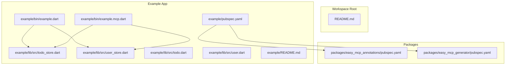
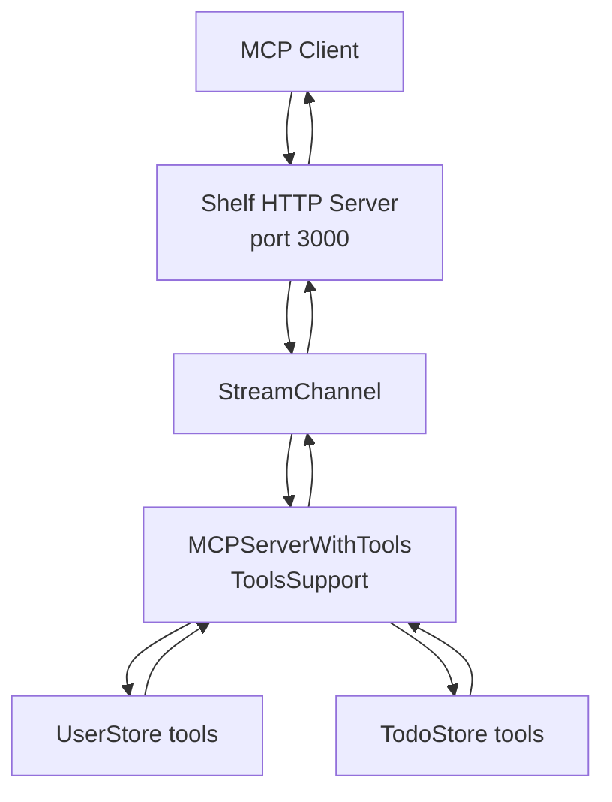
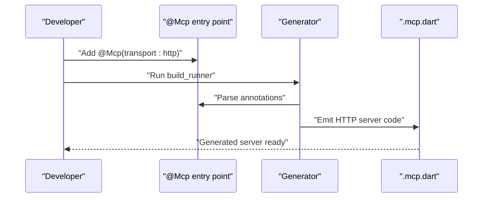
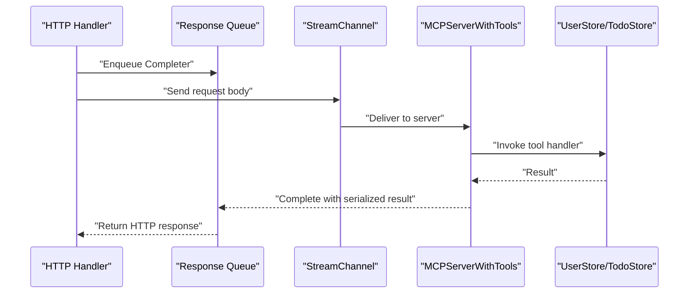
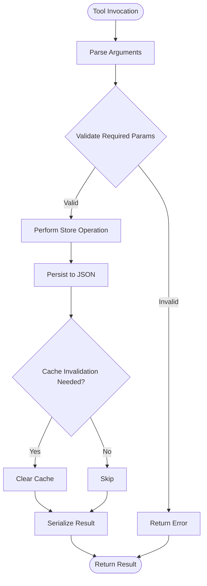
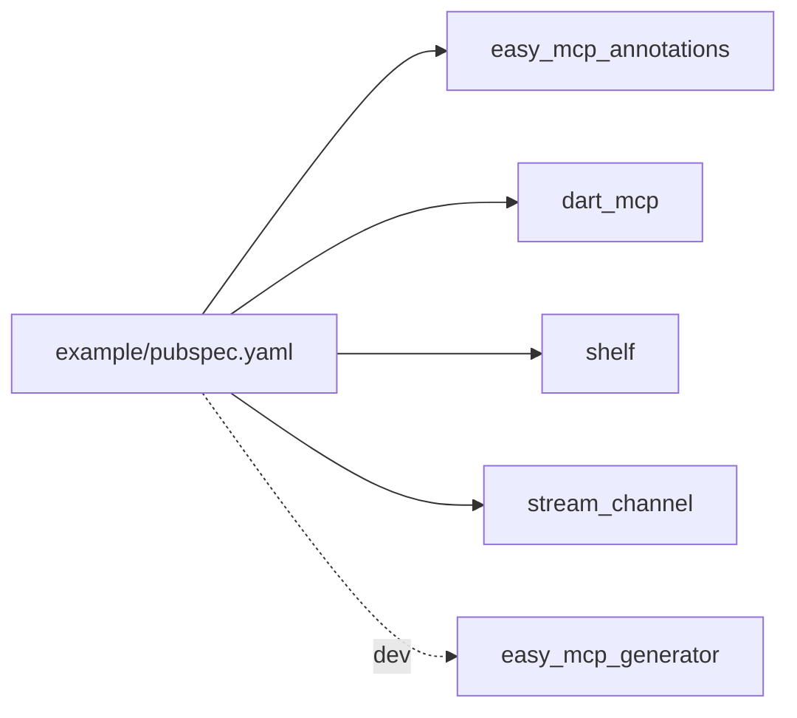

# Example Project Setup and Configuration

<cite>
**Referenced Files in This Document**
- [example/pubspec.yaml](file://example/pubspec.yaml)
- [packages/easy_mcp_annotations/pubspec.yaml](file://packages/easy_mcp_annotations/pubspec.yaml)
- [packages/easy_mcp_generator/pubspec.yaml](file://packages/easy_mcp_generator/pubspec.yaml)
- [example/bin/example.dart](file://example/bin/example.dart)
- [example/bin/example.mcp.dart](file://example/bin/example.mcp.dart)
- [example/lib/src/todo_store.dart](file://example/lib/src/todo_store.dart)
- [example/lib/src/user_store.dart](file://example/lib/src/user_store.dart)
- [example/lib/src/todo.dart](file://example/lib/src/todo.dart)
- [example/lib/src/user.dart](file://example/lib/src/user.dart)
- [example/README.md](file://example/README.md)
- [README.md](file://README.md)
</cite>

## Table of Contents
1. [Introduction](#introduction)
2. [Project Structure](#project-structure)
3. [Core Components](#core-components)
4. [Architecture Overview](#architecture-overview)
5. [Detailed Component Analysis](#detailed-component-analysis)
6. [Dependency Analysis](#dependency-analysis)
7. [Performance Considerations](#performance-considerations)
8. [Troubleshooting Guide](#troubleshooting-guide)
9. [Conclusion](#conclusion)
10. [Appendices](#appendices)

## Introduction
This document explains how to set up and configure the example project that demonstrates generating and running an MCP server from annotated Dart code. It covers the project layout, dependency configuration, code generation process, entry point and server initialization, transport configuration, build and watch modes, generated code validation, and practical steps to run and test the example. It also clarifies how annotations are transformed into executable MCP servers and how to extend the example patterns for custom implementations.

## Project Structure
The example project is organized as a Dart workspace with:
- A top-level workspace configuration and documentation
- An example application under example/ that depends on the local packages
- Two packages under packages/:
  - easy_mcp_annotations: defines @Mcp and @Tool annotations
  - easy_mcp_generator: generates MCP server code from annotated Dart code

Key files and roles:
- example/pubspec.yaml: Declares dependencies on the local packages and dev_dependencies on the generator, plus runtime dependencies for MCP and HTTP stack
- example/bin/example.dart: Entry point annotated with @Mcp and imports stores to seed and demonstrate usage
- example/bin/example.mcp.dart: Generated MCP server code (HTTP transport in this example)
- example/lib/src/*.dart: Domain models and stores annotated with @Tool
- packages/easy_mcp_annotations/pubspec.yaml: Defines the annotations package
- packages/easy_mcp_generator/pubspec.yaml: Defines the generator package

**Diagram sources**
- [example/pubspec.yaml:1-22](file://example/pubspec.yaml#L1-L22)
- [packages/easy_mcp_annotations/pubspec.yaml:1-28](file://packages/easy_mcp_annotations/pubspec.yaml#L1-L28)
- [packages/easy_mcp_generator/pubspec.yaml:1-34](file://packages/easy_mcp_generator/pubspec.yaml#L1-L34)
- [example/bin/example.dart:1-67](file://example/bin/example.dart#L1-L67)
- [example/bin/example.mcp.dart:1-490](file://example/bin/example.mcp.dart#L1-L490)
- [example/lib/src/todo_store.dart:1-236](file://example/lib/src/todo_store.dart#L1-L236)
- [example/lib/src/user_store.dart:1-144](file://example/lib/src/user_store.dart#L1-L144)
- [example/lib/src/todo.dart:1-46](file://example/lib/src/todo.dart#L1-L46)
- [example/lib/src/user.dart:1-42](file://example/lib/src/user.dart#L1-L42)

**Section sources**
- [example/pubspec.yaml:1-22](file://example/pubspec.yaml#L1-L22)
- [packages/easy_mcp_annotations/pubspec.yaml:1-28](file://packages/easy_mcp_annotations/pubspec.yaml#L1-L28)
- [packages/easy_mcp_generator/pubspec.yaml:1-34](file://packages/easy_mcp_generator/pubspec.yaml#L1-L34)
- [example/README.md:192-207](file://example/README.md#L192-L207)

## Core Components
- Annotations package (easy_mcp_annotations): Provides @Mcp and @Tool annotations to declare MCP transport and tools
- Generator package (easy_mcp_generator): Reads annotated code and emits a complete MCP server implementation
- Example app (example/): Demonstrates usage with annotated stores and an entry point

Key responsibilities:
- @Mcp: Configures transport (stdio or http) and optional JSON metadata generation
- @Tool: Exposes static methods as MCP tools with descriptions and optional icons
- Generated server: Registers tools, validates inputs via JSON schema, and delegates to store methods

**Section sources**
- [packages/easy_mcp_annotations/pubspec.yaml:1-28](file://packages/easy_mcp_annotations/pubspec.yaml#L1-L28)
- [packages/easy_mcp_generator/pubspec.yaml:1-34](file://packages/easy_mcp_generator/pubspec.yaml#L1-L34)
- [packages/easy_mcp_annotations/lib/mcp_annotations.dart:1-107](file://packages/easy_mcp_annotations/lib/mcp_annotations.dart#L1-L107)

## Architecture Overview
The example uses HTTP transport for the MCP server. The generated server:
- Initializes a StreamChannel for bidirectional communication
- Wraps an MCPServer with ToolsSupport
- Registers tools discovered from @Tool-annotated methods
- Serves HTTP requests via Shelf and relays messages to/from the MCP channel

**Diagram sources**
- [example/bin/example.mcp.dart:17-68](file://example/bin/example.mcp.dart#L17-L68)
- [example/bin/example.mcp.dart:70-254](file://example/bin/example.mcp.dart#L70-L254)
- [example/lib/src/user_store.dart:50-142](file://example/lib/src/user_store.dart#L50-L142)
- [example/lib/src/todo_store.dart:68-234](file://example/lib/src/todo_store.dart#L68-L234)

## Detailed Component Analysis

### Example Entry Point and Transport Configuration
- The entry point declares @Mcp with transport set to HTTP
- It seeds initial data and prints summaries to demonstrate runtime behavior
- The generator reads this entry point to discover tools from imported libraries

**Diagram sources**
- [example/bin/example.dart:6-67](file://example/bin/example.dart#L6-L67)
- [example/bin/example.mcp.dart:17-68](file://example/bin/example.mcp.dart#L17-L68)

**Section sources**
- [example/bin/example.dart:6-67](file://example/bin/example.dart#L6-L67)
- [example/README.md:119-128](file://example/README.md#L119-L128)

### Generated Server Initialization and Tool Registration
- The generated server sets up StreamControllers and StreamChannel
- It initializes MCPServerWithTools and registers tools with input schemas derived from method signatures
- Each tool handler extracts arguments, calls the corresponding store method, serializes results, and returns CallToolResult

**Diagram sources**
- [example/bin/example.mcp.dart:38-68](file://example/bin/example.mcp.dart#L38-L68)
- [example/bin/example.mcp.dart:256-468](file://example/bin/example.mcp.dart#L256-L468)

**Section sources**
- [example/bin/example.mcp.dart:17-68](file://example/bin/example.mcp.dart#L17-L68)
- [example/bin/example.mcp.dart:70-254](file://example/bin/example.mcp.dart#L70-L254)
- [example/bin/example.mcp.dart:470-488](file://example/bin/example.mcp.dart#L470-L488)

### Tool Definitions and Cross-Store Operations
- UserStore and TodoStore define @Tool-annotated methods for CRUD and cross-entity operations
- Methods include parameter validation, persistence to JSON files, and cache invalidation
- Many methods coordinate updates across both stores to maintain referential integrity

**Diagram sources**
- [example/lib/src/user_store.dart:50-142](file://example/lib/src/user_store.dart#L50-L142)
- [example/lib/src/todo_store.dart:68-234](file://example/lib/src/todo_store.dart#L68-L234)

**Section sources**
- [example/lib/src/user_store.dart:50-142](file://example/lib/src/user_store.dart#L50-L142)
- [example/lib/src/todo_store.dart:68-234](file://example/lib/src/todo_store.dart#L68-L234)

### Data Models
- User and Todo encapsulate identity, attributes, serialization, deserialization, and copying
- They form the foundation for tool parameters and return values

**Section sources**
- [example/lib/src/user.dart:1-42](file://example/lib/src/user.dart#L1-L42)
- [example/lib/src/todo.dart:1-46](file://example/lib/src/todo.dart#L1-L46)

## Dependency Analysis
The example app depends on:
- easy_mcp_annotations: Provides @Mcp and @Tool
- easy_mcp_generator: Dev dependency for code generation
- dart_mcp: Runtime for MCP server
- shelf and stream_channel: HTTP transport and streaming

**Diagram sources**
- [example/pubspec.yaml:11-21](file://example/pubspec.yaml#L11-L21)
- [packages/easy_mcp_annotations/pubspec.yaml:11-13](file://packages/easy_mcp_annotations/pubspec.yaml#L11-L13)
- [packages/easy_mcp_generator/pubspec.yaml:10-18](file://packages/easy_mcp_generator/pubspec.yaml#L10-L18)

**Section sources**
- [example/pubspec.yaml:11-21](file://example/pubspec.yaml#L11-L21)
- [packages/easy_mcp_annotations/pubspec.yaml:11-13](file://packages/easy_mcp_annotations/pubspec.yaml#L11-L13)
- [packages/easy_mcp_generator/pubspec.yaml:10-18](file://packages/easy_mcp_generator/pubspec.yaml#L10-L18)

## Performance Considerations
- JSON file I/O: Loading and saving users/todos occurs on each operation; consider caching and batching for high throughput
- Serialization: The generated server serializes results; ensure DTOs implement efficient serialization
- HTTP overhead: The HTTP transport introduces network latency compared to stdio; monitor response times and tune concurrency
- Tool registration: Generating schemas from types is automatic but can be optimized by minimizing unnecessary tool registrations

[No sources needed since this section provides general guidance]

## Troubleshooting Guide
Common issues and resolutions:
- Missing or outdated dependencies
  - Ensure the example pubspec references the local packages and dev_dependencies include build_runner
  - Verify the generator pubspec includes required dependencies (analyzer, build, source_gen, code_builder)
- Build runner not found
  - Run build_runner from the workspace root as documented
- Generated server not found
  - Confirm the generator ran successfully and produced example/bin/example.mcp.dart
- HTTP server fails to start
  - Check port availability and firewall settings
  - Validate the generated server’s HTTP handler logic
- Tools not appearing
  - Verify @Tool annotations on static methods and that the entry point imports the libraries
  - Ensure the generator runs after adding new annotations

**Section sources**
- [example/README.md:59-75](file://example/README.md#L59-L75)
- [example/README.md:119-128](file://example/README.md#L119-L128)
- [README.md:87-109](file://README.md#L87-L109)

## Conclusion
The example project demonstrates a complete pipeline: annotate Dart methods with @Mcp and @Tool, run the generator to produce an MCP server, and run the server to expose tools to clients. The HTTP transport example illustrates how the generator integrates with shelf and stream_channel to deliver a working MCP server. Following the setup and testing steps enables quick iteration and extension to custom domains.

[No sources needed since this section summarizes without analyzing specific files]

## Appendices

### Step-by-Step Setup Instructions
- Prerequisites
  - Install dependencies in the workspace root
  - Use the documented commands to bootstrap and run tests/analyze/format
- Configure the example app
  - Add @Mcp to the entry point and @Tool to desired methods
  - Ensure imports include the annotated stores
- Run code generation
  - From the workspace root, run build_runner to generate .mcp.dart
  - Optionally enable watch mode for continuous regeneration
- Validate generated code
  - Review example/bin/example.mcp.dart for tool registrations and HTTP server setup
- Run the server
  - Execute the generated server using dart run
- Test the server
  - Use the MCP Inspector CLI to list tools and call them
  - Alternatively, run the inspector in web UI mode for interactive testing

**Section sources**
- [example/README.md:5-11](file://example/README.md#L5-L11)
- [example/README.md:59-75](file://example/README.md#L59-L75)
- [example/README.md:119-191](file://example/README.md#L119-L191)
- [README.md:87-109](file://README.md#L87-L109)

### Environment Requirements
- Dart SDK version aligned with package requirements
- Workspace management tooling as indicated by the root README
- Node.js for MCP Inspector testing (as documented)

**Section sources**
- [packages/easy_mcp_annotations/pubspec.yaml:7-8](file://packages/easy_mcp_annotations/pubspec.yaml#L7-L8)
- [packages/easy_mcp_generator/pubspec.yaml:7-8](file://packages/easy_mcp_generator/pubspec.yaml#L7-L8)
- [README.md:87-90](file://README.md#L87-L90)
- [example/README.md:133-134](file://example/README.md#L133-L134)

### Extending the Example Patterns
- Add new stores with @Tool-annotated methods
- Import the new stores in the @Mcp entry point to include their tools
- Regenerate code and rerun the server
- Customize transport by changing @Mcp transport setting (stdio vs http)
- Enhance models with richer serialization and validation as needed

**Section sources**
- [example/bin/example.dart:2-4](file://example/bin/example.dart#L2-L4)
- [example/lib/src/user_store.dart:50-142](file://example/lib/src/user_store.dart#L50-L142)
- [example/lib/src/todo_store.dart:68-234](file://example/lib/src/todo_store.dart#L68-L234)
- [packages/easy_mcp_annotations/lib/mcp_annotations.dart:39-56](file://packages/easy_mcp_annotations/lib/mcp_annotations.dart#L39-L56)