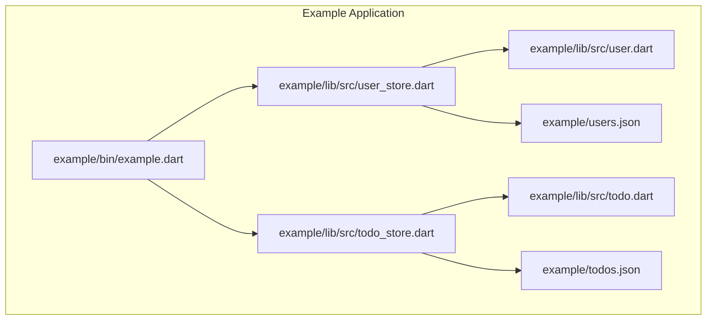
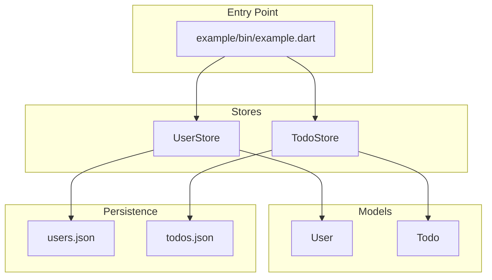
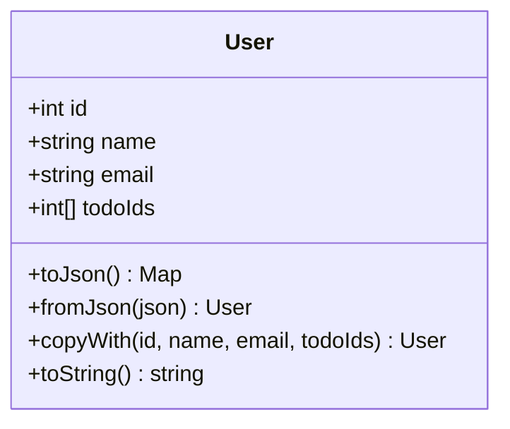
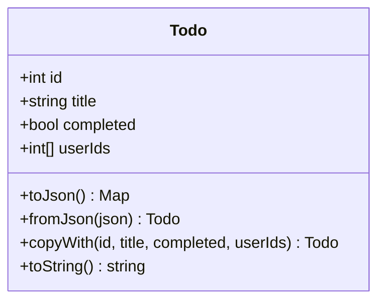
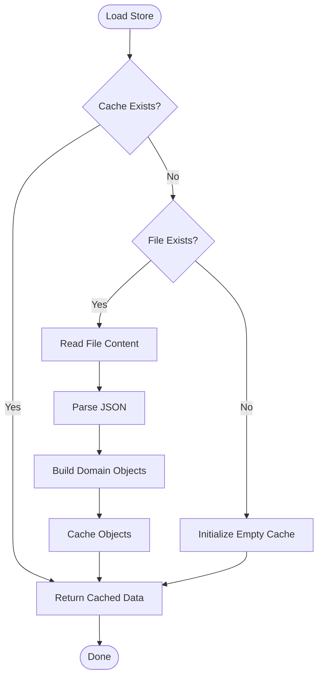
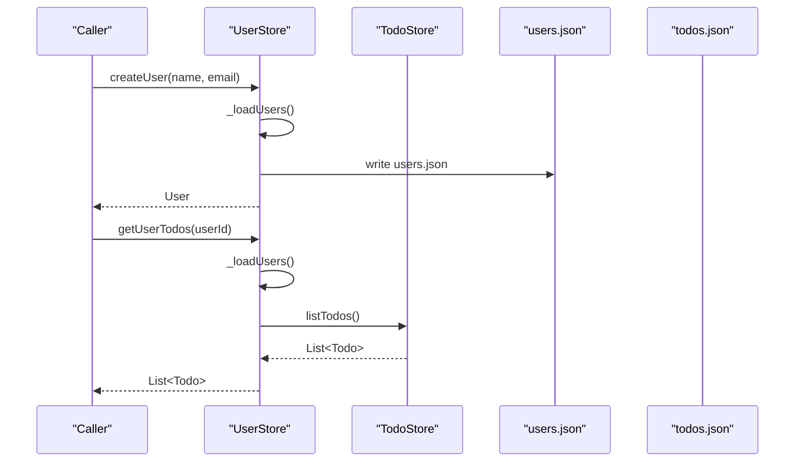
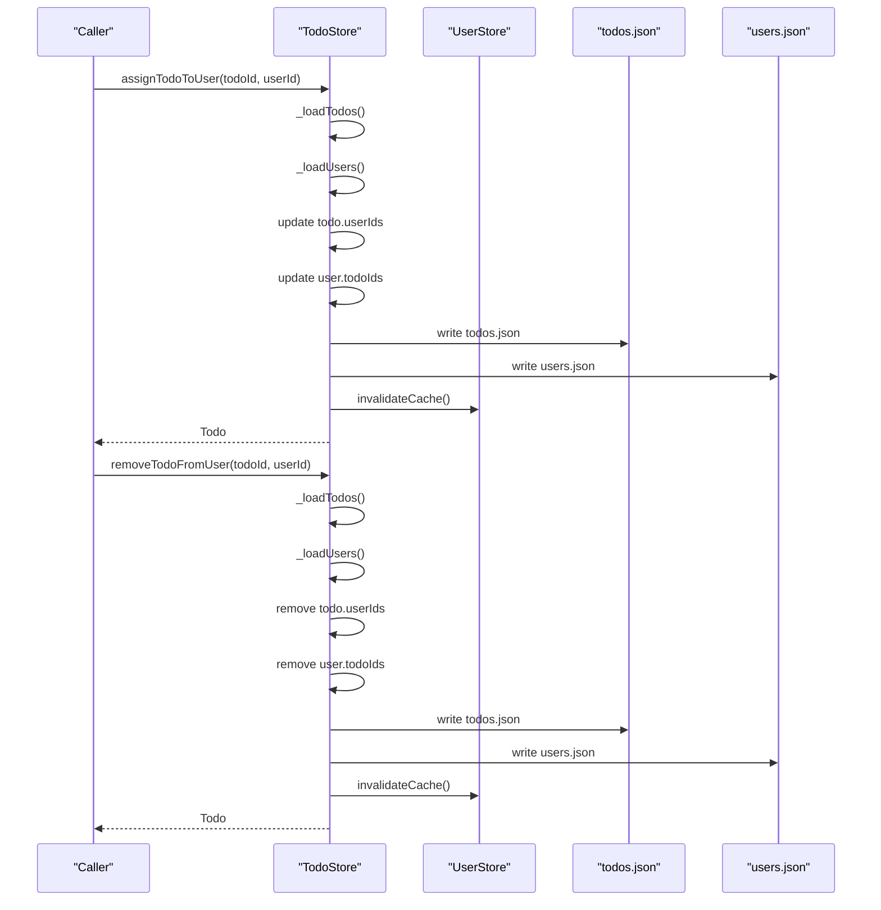
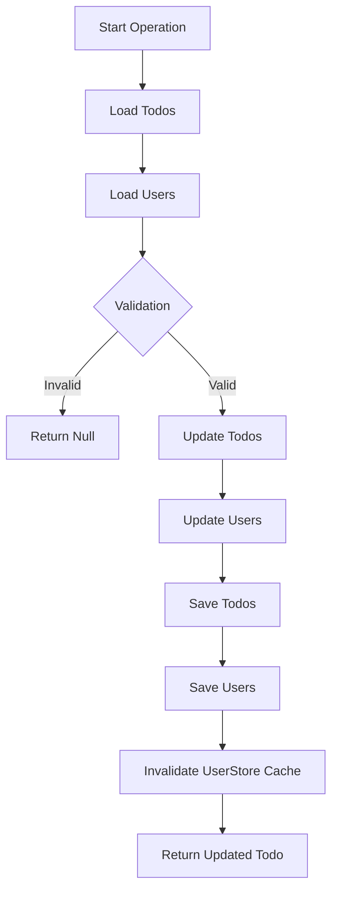
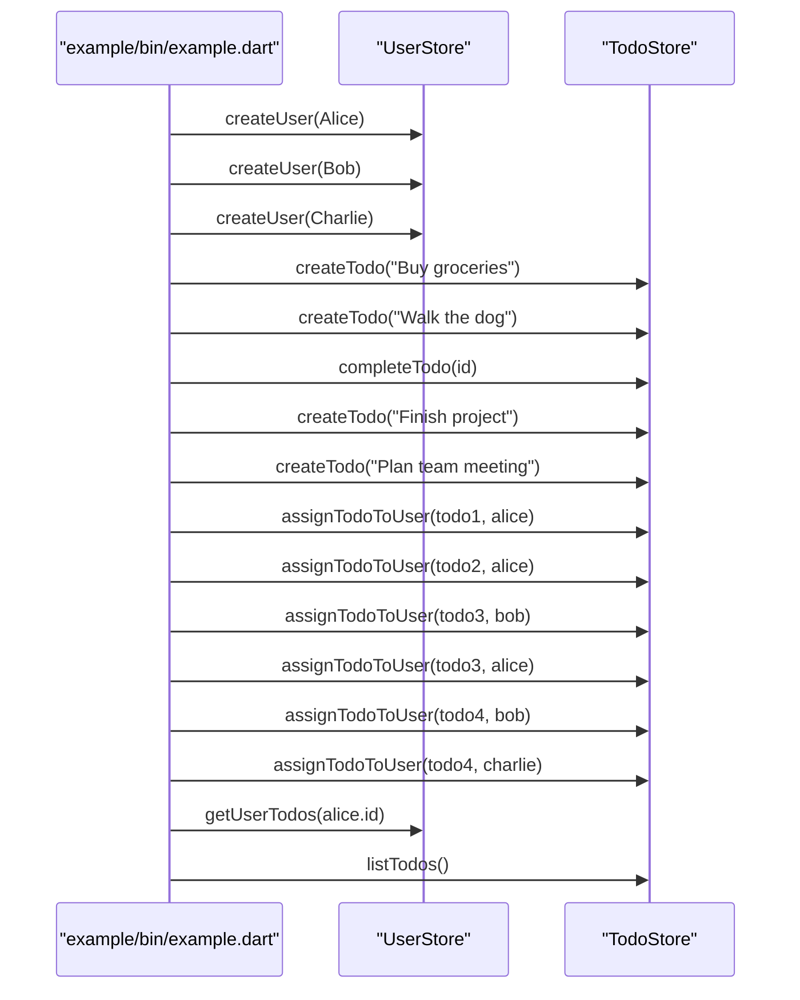
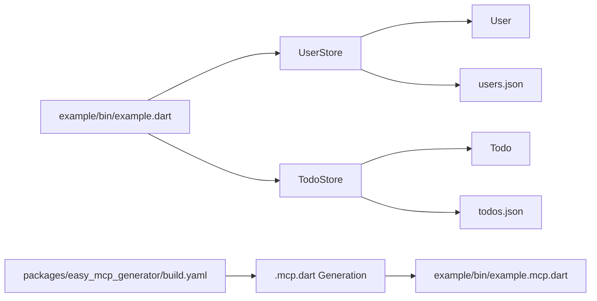

# Task Management System

<cite>
**Referenced Files in This Document**
- [todo_store.dart](file://example/lib/src/todo_store.dart)
- [todo.dart](file://example/lib/src/todo.dart)
- [user_store.dart](file://example/lib/src/user_store.dart)
- [user.dart](file://example/lib/src/user.dart)
- [todos.json](file://example/todos.json)
- [users.json](file://example/users.json)
- [README.md](file://example/README.md)
- [pubspec.yaml](file://example/pubspec.yaml)
- [example.dart](file://example/bin/example.dart)
- [build.yaml](file://packages/easy_mcp_generator/build.yaml)
</cite>

## Table of Contents
1. [Introduction](#introduction)
2. [Project Structure](#project-structure)
3. [Core Components](#core-components)
4. [Architecture Overview](#architecture-overview)
5. [Detailed Component Analysis](#detailed-component-analysis)
6. [Dependency Analysis](#dependency-analysis)
7. [Performance Considerations](#performance-considerations)
8. [Troubleshooting Guide](#troubleshooting-guide)
9. [Conclusion](#conclusion)
10. [Appendices](#appendices)

## Introduction
This document describes the task management system example implementation that demonstrates a many-to-many relationship between users and tasks. The system uses persistent storage patterns with JSON files, manages task lifecycle operations, and maintains bidirectional associations between users and tasks. It exposes a set of tools via the Model Context Protocol (MCP) for creating, assigning, completing, and querying tasks and users.

## Project Structure
The example is organized around two primary data models and their persistent stores:
- User model and store: manage user profiles and their assigned tasks
- Todo model and store: manage tasks, completion status, and assignments to users



**Diagram sources**
- [example.dart:1-67](file://example/bin/example.dart#L1-L67)
- [user_store.dart:1-144](file://example/lib/src/user_store.dart#L1-L144)
- [todo_store.dart:1-236](file://example/lib/src/todo_store.dart#L1-L236)
- [user.dart:1-42](file://example/lib/src/user.dart#L1-L42)
- [todo.dart:1-46](file://example/lib/src/todo.dart#L1-L46)

**Section sources**
- [README.md:192-207](file://example/README.md#L192-L207)
- [pubspec.yaml:1-22](file://example/pubspec.yaml#L1-L22)

## Core Components
- User model: encapsulates identity, contact information, and a list of associated task identifiers
- Todo model: encapsulates task metadata, completion state, and a list of associated user identifiers
- UserStore: provides user lifecycle operations and maintains referential integrity with tasks
- TodoStore: provides task lifecycle operations and maintains referential integrity with users

Key capabilities:
- CRUD operations for users and tasks
- Many-to-many assignment with bidirectional updates
- Cross-store operations for consistency
- Persistent storage via JSON files with caching

**Section sources**
- [user.dart:1-42](file://example/lib/src/user.dart#L1-L42)
- [todo.dart:1-46](file://example/lib/src/todo.dart#L1-L46)
- [user_store.dart:1-144](file://example/lib/src/user_store.dart#L1-L144)
- [todo_store.dart:1-236](file://example/lib/src/todo_store.dart#L1-L236)

## Architecture Overview
The system follows a layered architecture:
- Data models define the domain entities and serialization
- Stores encapsulate persistence and business logic
- An entry point initializes data and demonstrates workflows
- A code generation pipeline produces an MCP server that exposes tools



**Diagram sources**
- [example.dart:1-67](file://example/bin/example.dart#L1-L67)
- [user_store.dart:1-144](file://example/lib/src/user_store.dart#L1-L144)
- [todo_store.dart:1-236](file://example/lib/src/todo_store.dart#L1-L236)
- [user.dart:1-42](file://example/lib/src/user.dart#L1-L42)
- [todo.dart:1-46](file://example/lib/src/todo.dart#L1-L46)

## Detailed Component Analysis

### Data Models

#### User Model
- Fields: identifier, name, email, and a list of task identifiers
- Serialization: converts to/from JSON map with optional field handling
- Copy operation: immutable update pattern for state transitions



**Diagram sources**
- [user.dart:1-42](file://example/lib/src/user.dart#L1-L42)

**Section sources**
- [user.dart:1-42](file://example/lib/src/user.dart#L1-L42)

#### Todo Model
- Fields: identifier, title, completion status, and a list of user identifiers
- Serialization: converts to/from JSON map with optional field handling
- Copy operation: immutable update pattern for state transitions



**Diagram sources**
- [todo.dart:1-46](file://example/lib/src/todo.dart#L1-L46)

**Section sources**
- [todo.dart:1-46](file://example/lib/src/todo.dart#L1-L46)

### Persistence and Caching Patterns
Both stores implement a simple caching mechanism:
- Cache is initialized on first load
- Subsequent reads return cached data until invalidated
- Writes update the cache and persist to disk



**Diagram sources**
- [user_store.dart:18-43](file://example/lib/src/user_store.dart#L18-L43)
- [todo_store.dart:14-39](file://example/lib/src/todo_store.dart#L14-L39)

**Section sources**
- [user_store.dart:18-43](file://example/lib/src/user_store.dart#L18-L43)
- [todo_store.dart:14-39](file://example/lib/src/todo_store.dart#L14-L39)

### UserStore Operations
UserStore provides:
- Creation with automatic ID assignment
- Retrieval by identifier
- Listing all users
- Deletion with cleanup of references in tasks
- Assignment-related queries
- Search by name or email



**Diagram sources**
- [user_store.dart:56-79](file://example/lib/src/user_store.dart#L56-L79)
- [user_store.dart:18-43](file://example/lib/src/user_store.dart#L18-L43)
- [todo_store.dart:91-93](file://example/lib/src/todo_store.dart#L91-L93)

**Section sources**
- [user_store.dart:56-79](file://example/lib/src/user_store.dart#L56-L79)
- [user_store.dart:98-128](file://example/lib/src/user_store.dart#L98-L128)

### TodoStore Operations
TodoStore provides:
- Creation with automatic ID assignment
- Retrieval by identifier
- Listing all tasks
- Deletion with cleanup of references in users
- Completion marking
- Assignment and removal between users and tasks
- Queries for tasks assigned to a specific user



**Diagram sources**
- [todo_store.dart:146-182](file://example/lib/src/todo_store.dart#L146-L182)
- [todo_store.dart:187-227](file://example/lib/src/todo_store.dart#L187-L227)
- [user_store.dart:13-16](file://example/lib/src/user_store.dart#L13-L16)

**Section sources**
- [todo_store.dart:68-76](file://example/lib/src/todo_store.dart#L68-L76)
- [todo_store.dart:95-126](file://example/lib/src/todo_store.dart#L95-L126)
- [todo_store.dart:128-141](file://example/lib/src/todo_store.dart#L128-L141)
- [todo_store.dart:146-182](file://example/lib/src/todo_store.dart#L146-L182)
- [todo_store.dart:187-227](file://example/lib/src/todo_store.dart#L187-L227)
- [todo_store.dart:229-234](file://example/lib/src/todo_store.dart#L229-L234)

### Many-to-Many Relationship Implementation
The relationship is modeled using inverse references:
- User has a list of task identifiers
- Todo has a list of user identifiers
- Assignment tools maintain bidirectional consistency
- Deletion tools clean up references in both directions
- Queries resolve assignments by intersecting identifiers

```mermaid
erDiagram
USER {
int id PK
string name
string email
List<int> todoIds
}
TODO {
int id PK
string title
bool completed
List<int> userIds
}
USER ||--o{ TODO : "assigned_tasks"
TODO ||--o{ USER : "assigned_users"
```

**Diagram sources**
- [user.dart:1-42](file://example/lib/src/user.dart#L1-L42)
- [todo.dart:1-46](file://example/lib/src/todo.dart#L1-L46)

**Section sources**
- [README.md:211-222](file://example/README.md#L211-L222)
- [user_store.dart:98-128](file://example/lib/src/user_store.dart#L98-L128)
- [todo_store.dart:95-126](file://example/lib/src/todo_store.dart#L95-L126)

### Cross-Store Operations and Referential Integrity
Cross-store operations ensure consistency:
- Assignment updates both sides of the relationship
- Deletion removes references from both sides
- Cache invalidation prevents stale data
- Bulk operations iterate through collections and apply updates atomically



**Diagram sources**
- [todo_store.dart:146-182](file://example/lib/src/todo_store.dart#L146-L182)
- [todo_store.dart:187-227](file://example/lib/src/todo_store.dart#L187-L227)
- [user_store.dart:13-16](file://example/lib/src/user_store.dart#L13-L16)

**Section sources**
- [todo_store.dart:146-182](file://example/lib/src/todo_store.dart#L146-L182)
- [todo_store.dart:187-227](file://example/lib/src/todo_store.dart#L187-L227)
- [user_store.dart:13-16](file://example/lib/src/user_store.dart#L13-L16)

### Practical Workflows and Tool Usage
Common workflows include:
- Creating users and tasks
- Assigning tasks to users (including shared assignments)
- Completing tasks
- Querying tasks for a user
- Deleting users and tasks while maintaining referential integrity



**Diagram sources**
- [example.dart:14-47](file://example/bin/example.dart#L14-L47)
- [user_store.dart:56-65](file://example/lib/src/user_store.dart#L56-L65)
- [todo_store.dart:68-76](file://example/lib/src/todo_store.dart#L68-L76)
- [todo_store.dart:128-141](file://example/lib/src/todo_store.dart#L128-L141)
- [todo_store.dart:146-182](file://example/lib/src/todo_store.dart#L146-L182)

**Section sources**
- [example.dart:14-47](file://example/bin/example.dart#L14-L47)
- [README.md:161-180](file://example/README.md#L161-L180)

## Dependency Analysis
The system relies on:
- Dart standard libraries for file I/O and JSON encoding/decoding
- MCP annotations and generator for tool exposure
- A generated server that aggregates tools from both stores



**Diagram sources**
- [example.dart:1-67](file://example/bin/example.dart#L1-L67)
- [user_store.dart:1-144](file://example/lib/src/user_store.dart#L1-L144)
- [todo_store.dart:1-236](file://example/lib/src/todo_store.dart#L1-L236)
- [build.yaml:1-12](file://packages/easy_mcp_generator/build.yaml#L1-L12)

**Section sources**
- [pubspec.yaml:11-21](file://example/pubspec.yaml#L11-L21)
- [build.yaml:1-12](file://packages/easy_mcp_generator/build.yaml#L1-L12)

## Performance Considerations
- Caching reduces repeated file I/O during a session
- Batch writes minimize disk operations for cross-store updates
- Immutable copy operations prevent accidental mutations
- Efficient filtering and iteration patterns for queries
- Consider adding indexing or precomputed views for large datasets

[No sources needed since this section provides general guidance]

## Troubleshooting Guide
Common issues and resolutions:
- Empty or missing JSON files: stores initialize empty caches and continue operating
- Invalid identifiers: assignment and deletion return null when entities are not found
- Stale cache after external edits: use cache invalidation methods exposed by stores
- Cross-store inconsistencies: rely on provided assignment/removal tools to maintain bidirectional integrity

**Section sources**
- [user_store.dart:13-16](file://example/lib/src/user_store.dart#L13-L16)
- [todo_store.dart:146-182](file://example/lib/src/todo_store.dart#L146-L182)
- [todo_store.dart:187-227](file://example/lib/src/todo_store.dart#L187-L227)

## Conclusion
The task management system demonstrates a robust many-to-many relationship model with bidirectional associations, persistent storage, and cross-store consistency. The stores provide a comprehensive set of CRUD and assignment operations, while the example entry point illustrates practical workflows. The MCP integration enables tool-based interaction with the system.

[No sources needed since this section summarizes without analyzing specific files]

## Appendices

### Data Model Definitions
- User: identifier, name, email, and assigned task identifiers
- Todo: identifier, title, completion status, and assigned user identifiers

**Section sources**
- [user.dart:1-42](file://example/lib/src/user.dart#L1-L42)
- [todo.dart:1-46](file://example/lib/src/todo.dart#L1-L46)

### Sample Data
- Initial users and tasks are seeded by the example entry point
- Current sample data reflects many-to-many assignments among users and tasks

**Section sources**
- [users.json:1-1](file://example/users.json#L1-L1)
- [todos.json:1-1](file://example/todos.json#L1-L1)
- [example.dart:8-47](file://example/bin/example.dart#L8-L47)