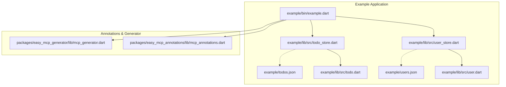
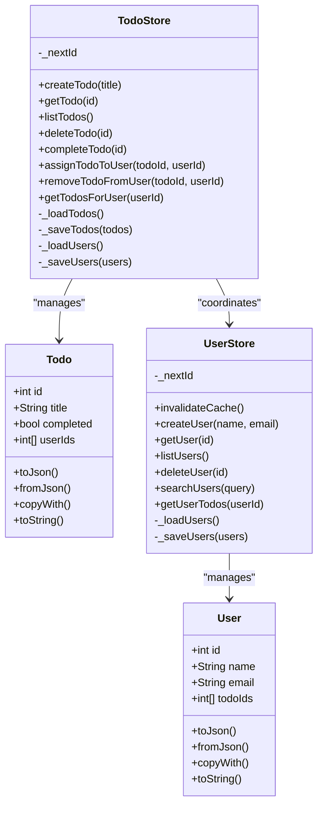
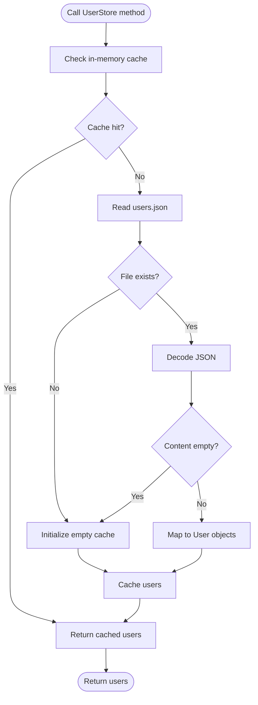
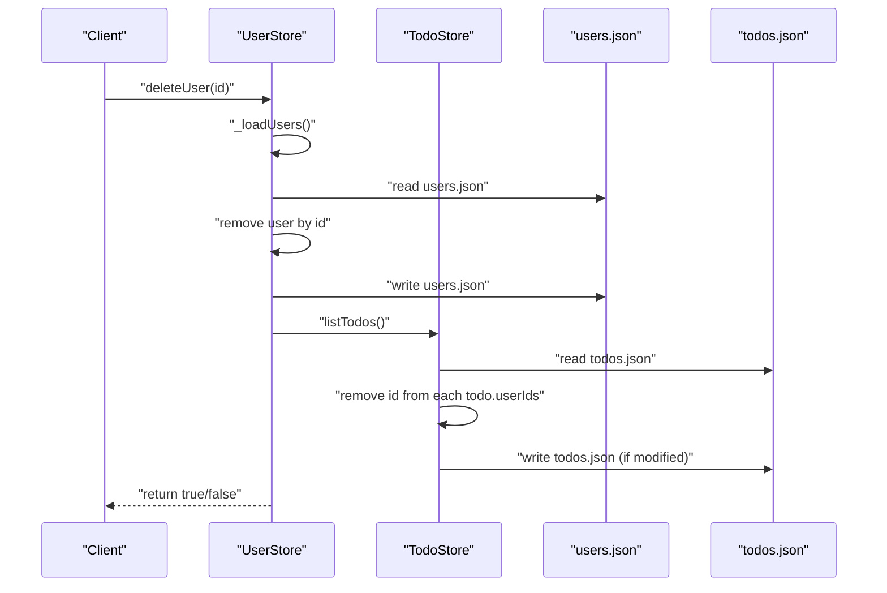
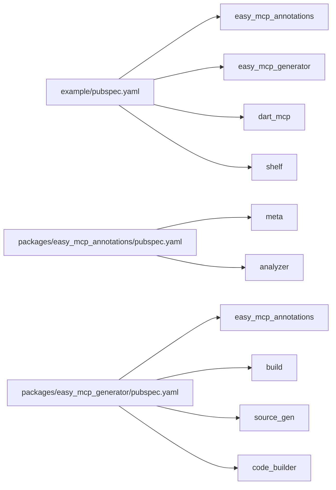

# User Management System

<cite>
**Referenced Files in This Document**
- [user_store.dart](file://example/lib/src/user_store.dart)
- [user.dart](file://example/lib/src/user.dart)
- [todo_store.dart](file://example/lib/src/todo_store.dart)
- [todo.dart](file://example/lib/src/todo.dart)
- [example.dart](file://example/bin/example.dart)
- [pubspec.yaml](file://example/pubspec.yaml)
- [todos.json](file://example/todos.json)
- [users.json](file://example/users.json)
- [mcp_annotations.dart](file://packages/easy_mcp_annotations/lib/mcp_annotations.dart)
- [pubspec.yaml](file://packages/easy_mcp_annotations/pubspec.yaml)
- [pubspec.yaml](file://packages/easy_mcp_generator/pubspec.yaml)
</cite>

## Table of Contents
1. [Introduction](#introduction)
2. [Project Structure](#project-structure)
3. [Core Components](#core-components)
4. [Architecture Overview](#architecture-overview)
5. [Detailed Component Analysis](#detailed-component-analysis)
6. [Dependency Analysis](#dependency-analysis)
7. [Performance Considerations](#performance-considerations)
8. [Troubleshooting Guide](#troubleshooting-guide)
9. [Conclusion](#conclusion)

## Introduction
This document explains the user management system example implementation that demonstrates persistent storage, caching, and cross-store relationships between users and todos. It focuses on the UserStore class architecture, JSON-backed persistence, caching strategies, CRUD operations exposed via @Tool annotations, and the bidirectional relationships with TodoStore including cascade deletion and foreign key cleanup. It also covers data models, parameter validation, error handling patterns, file I/O operations, and production-ready patterns.

## Project Structure
The example consists of:
- A user management module with UserStore and User model
- A todo management module with TodoStore and Todo model
- An example binary that seeds data and demonstrates usage
- Annotations and code generation packages for exposing methods as MCP tools

**Diagram sources**
- [example.dart:1-67](file://example/bin/example.dart#L1-L67)
- [user_store.dart:1-144](file://example/lib/src/user_store.dart#L1-L144)
- [todo_store.dart:1-236](file://example/lib/src/todo_store.dart#L1-L236)
- [user.dart:1-42](file://example/lib/src/user.dart#L1-L42)
- [todo.dart:1-46](file://example/lib/src/todo.dart#L1-L46)
- [mcp_annotations.dart:1-107](file://packages/easy_mcp_annotations/lib/mcp_annotations.dart#L1-L107)

**Section sources**
- [pubspec.yaml:1-22](file://example/pubspec.yaml#L1-L22)
- [pubspec.yaml:1-28](file://packages/easy_mcp_annotations/pubspec.yaml#L1-L28)
- [pubspec.yaml:1-35](file://packages/easy_mcp_generator/pubspec.yaml#L1-L35)

## Core Components
- UserStore: Manages user persistence and exposes CRUD operations via @Tool annotations. Implements a simple in-memory cache and JSON file I/O.
- User model: Immutable data structure with JSON serialization/deserialization and copyWith support.
- TodoStore: Manages todo persistence and exposes CRUD operations via @Tool annotations. Coordinates with UserStore for cross-store operations.
- Todo model: Immutable data structure with JSON serialization/deserialization and copyWith support.
- Example binary: Seeds initial data and demonstrates usage of both stores.

Key responsibilities:
- UserStore: load/save users, cache invalidation, user creation, retrieval, listing, deletion, and search.
- TodoStore: load/save todos, cache invalidation, todo creation, retrieval, listing, deletion, completion, assignment to users, and removal from users.
- Cross-store relationships: Bidirectional foreign keys (user.todoIds and todo.userIds) with cleanup on delete and assignment.

**Section sources**
- [user_store.dart:1-144](file://example/lib/src/user_store.dart#L1-L144)
- [user.dart:1-42](file://example/lib/src/user.dart#L1-L42)
- [todo_store.dart:1-236](file://example/lib/src/todo_store.dart#L1-L236)
- [todo.dart:1-46](file://example/lib/src/todo.dart#L1-L46)
- [example.dart:1-67](file://example/bin/example.dart#L1-L67)

## Architecture Overview
The system uses a layered architecture:
- Data models define immutable structures with JSON conversion.
- Stores encapsulate persistence and caching logic.
- Tools annotate methods to expose them as MCP tools.
- Example binary orchestrates seeding and demonstrates usage.

**Diagram sources**
- [user_store.dart:1-144](file://example/lib/src/user_store.dart#L1-L144)
- [user.dart:1-42](file://example/lib/src/user.dart#L1-L42)
- [todo_store.dart:1-236](file://example/lib/src/todo_store.dart#L1-L236)
- [todo.dart:1-46](file://example/lib/src/todo.dart#L1-L46)

## Detailed Component Analysis

### UserStore Architecture and Persistence
- Persistent storage: Uses a JSON file named users.json for user records.
- Caching: Maintains an in-memory cache of users to avoid repeated file reads until invalidated.
- Loading pattern: Reads file asynchronously, decodes JSON, maps to User objects, and caches the result.
- Saving pattern: Encodes users to JSON and writes to file, updating the cache.
- Cache invalidation: Public method to clear the cache so subsequent reads reload from disk.

**Diagram sources**
- [user_store.dart:18-43](file://example/lib/src/user_store.dart#L18-L43)

**Section sources**
- [user_store.dart:1-144](file://example/lib/src/user_store.dart#L1-L144)

### User Model
- Immutable fields: id, name, email, todoIds.
- JSON conversion: toJson encodes all fields; fromJson decodes with safe defaults for missing fields.
- Copy operation: copyWith returns a new User with selected fields replaced.
- String representation: toString for debugging.

Validation and safety:
- todoIds defaults to an empty list if missing in JSON.
- No explicit parameter validation in the model; validation occurs at call sites or via tool usage.

**Section sources**
- [user.dart:1-42](file://example/lib/src/user.dart#L1-L42)

### TodoStore Architecture and Persistence
- Persistent storage: Uses a JSON file named todos.json for todo records.
- Caching: Maintains an in-memory cache of todos to avoid repeated file reads until invalidated.
- Loading pattern: Similar to UserStore, with file existence checks and JSON decoding.
- Saving pattern: Encodes todos to JSON and writes to file, updating the cache.
- Cross-store helpers: Loads users and saves users to coordinate assignments.

**Diagram sources**
- [todo_store.dart:14-39](file://example/lib/src/todo_store.dart#L14-L39)

**Section sources**
- [todo_store.dart:1-236](file://example/lib/src/todo_store.dart#L1-L236)

### Todo Model
- Immutable fields: id, title, completed, userIds.
- JSON conversion: toJson encodes all fields; fromJson decodes with safe defaults for missing fields.
- Copy operation: copyWith returns a new Todo with selected fields replaced.
- String representation: toString for debugging.

Validation and safety:
- completed defaults to false if missing in JSON.
- userIds defaults to an empty list if missing in JSON.
- No explicit parameter validation in the model; validation occurs at call sites or via tool usage.

**Section sources**
- [todo.dart:1-46](file://example/lib/src/todo.dart#L1-L46)

### CRUD Operations via @Tool Annotations

#### UserStore Tools
- createUser
  - Description: Create a new user.
  - Parameters: name (required), email (required).
  - Behavior: Generates next id, appends new user, persists to file, returns created user.
  - Return type: Future<User>.
  - Expected behavior: Non-blocking, returns newly created user.
  - Related file: [user_store.dart:50-65](file://example/lib/src/user_store.dart#L50-L65)

- getUser
  - Description: Get user by ID.
  - Parameters: id (required).
  - Behavior: Loads users, searches by id, returns user or null.
  - Return type: Future<User?>.
  - Expected behavior: Returns null if not found.
  - Related file: [user_store.dart:81-90](file://example/lib/src/user_store.dart#L81-L90)

- listUsers
  - Description: List all users.
  - Parameters: none.
  - Behavior: Returns cached users or loads from file.
  - Return type: Future<List<User>>.
  - Expected behavior: Returns empty list if no users.
  - Related file: [user_store.dart:92-96](file://example/lib/src/user_store.dart#L92-L96)

- deleteUser
  - Description: Delete a user.
  - Parameters: id (required).
  - Behavior: Removes user, persists changes, cleans up references in todos (removes id from userIds), writes todos.json if modified.
  - Return type: Future<bool>.
  - Expected behavior: Returns true if deleted, false if not found.
  - Related file: [user_store.dart:98-128](file://example/lib/src/user_store.dart#L98-L128)

- searchUsers
  - Description: Search users by query.
  - Parameters: query (required).
  - Behavior: Case-insensitive substring match on name or email.
  - Return type: Future<List<User>>.
  - Expected behavior: Returns matching users.
  - Related file: [user_store.dart:130-142](file://example/lib/src/user_store.dart#L130-L142)

- getUserTodos
  - Description: Get all todos assigned to a user.
  - Parameters: userId (required).
  - Behavior: Loads users, locates user by id, retrieves all todos, filters by user's todoIds.
  - Return type: Future<List<Todo>>.
  - Expected behavior: Returns empty list if no todos assigned.
  - Related file: [user_store.dart:67-79](file://example/lib/src/user_store.dart#L67-L79)

#### TodoStore Tools
- createTodo
  - Description: Create a new todo.
  - Parameters: title (required).
  - Behavior: Generates next id, appends new todo, persists to file, returns created todo.
  - Return type: Future<Todo>.
  - Expected behavior: Non-blocking, returns newly created todo.
  - Related file: [todo_store.dart:68-76](file://example/lib/src/todo_store.dart#L68-L76)

- getTodo
  - Description: Get todo by ID.
  - Parameters: id (required).
  - Behavior: Loads todos, searches by id, returns todo or null.
  - Return type: Future<Todo?>.
  - Expected behavior: Returns null if not found.
  - Related file: [todo_store.dart:78-87](file://example/lib/src/todo_store.dart#L78-L87)

- listTodos
  - Description: List all todos.
  - Parameters: none.
  - Behavior: Returns cached todos or loads from file.
  - Return type: Future<List<Todo>>.
  - Expected behavior: Returns empty list if no todos.
  - Related file: [todo_store.dart:89-93](file://example/lib/src/todo_store.dart#L89-L93)

- deleteTodo
  - Description: Delete a todo.
  - Parameters: id (required).
  - Behavior: Removes todo, persists changes, cleans up references in users (removes id from todoIds), writes users.json and invalidates UserStore cache if modified.
  - Return type: Future<bool>.
  - Expected behavior: Returns true if deleted, false if not found.
  - Related file: [todo_store.dart:95-126](file://example/lib/src/todo_store.dart#L95-L126)

- completeTodo
  - Description: Mark a todo as completed.
  - Parameters: id (required).
  - Behavior: Finds todo, updates completed flag, persists changes, returns updated todo or null.
  - Return type: Future<Todo?>.
  - Expected behavior: Returns null if not found.
  - Related file: [todo_store.dart:128-141](file://example/lib/src/todo_store.dart#L128-L141)

- assignTodoToUser
  - Description: Assign a todo to a user.
  - Parameters: todoId (required), userId (required).
  - Behavior: Loads both stores, ensures bidirectional references exist, saves both stores, invalidates UserStore cache.
  - Return type: Future<Todo?>.
  - Expected behavior: Returns null if either not found.
  - Related file: [todo_store.dart:143-182](file://example/lib/src/todo_store.dart#L143-L182)

- removeTodoFromUser
  - Description: Remove a user from a todo.
  - Parameters: todoId (required), userId (required).
  - Behavior: Loads both stores, removes bidirectional references, saves both stores, invalidates UserStore cache.
  - Return type: Future<Todo?>.
  - Expected behavior: Returns null if either not found.
  - Related file: [todo_store.dart:184-227](file://example/lib/src/todo_store.dart#L184-L227)

- getTodosForUser
  - Description: Get all todos assigned to a user.
  - Parameters: userId (required).
  - Behavior: Loads todos, filters by userId in userIds.
  - Return type: Future<List<Todo>>.
  - Expected behavior: Returns empty list if no todos assigned.
  - Related file: [todo_store.dart:229-234](file://example/lib/src/todo_store.dart#L229-L234)

**Section sources**
- [user_store.dart:50-142](file://example/lib/src/user_store.dart#L50-L142)
- [todo_store.dart:68-234](file://example/lib/src/todo_store.dart#L68-L234)

### Cross-Store Relationships and Cascade Deletion
Bidirectional foreign keys:
- User.todoIds: Tracks todo ids assigned to the user.
- Todo.userIds: Tracks user ids assigned to the todo.

Cascade deletion and cleanup:
- Deleting a user removes the user’s id from all todos’ userIds lists and writes todos.json if any changes occur.
- Deleting a todo removes the todo’s id from all users’ todoIds lists, writes users.json, and invalidates UserStore cache to ensure consistency.

**Diagram sources**
- [user_store.dart:100-128](file://example/lib/src/user_store.dart#L100-L128)
- [todo_store.dart:98-126](file://example/lib/src/todo_store.dart#L98-L126)

**Section sources**
- [user_store.dart:98-128](file://example/lib/src/user_store.dart#L98-L128)
- [todo_store.dart:95-126](file://example/lib/src/todo_store.dart#L95-L126)

### Data Models and Parameter Validation
- User model:
  - Fields: id, name, email, todoIds.
  - Validation: None in model; relies on tool usage and JSON parsing defaults.
  - Related file: [user.dart:1-42](file://example/lib/src/user.dart#L1-L42)

- Todo model:
  - Fields: id, title, completed, userIds.
  - Validation: None in model; relies on tool usage and JSON parsing defaults.
  - Related file: [todo.dart:1-46](file://example/lib/src/todo.dart#L1-L46)

Parameter validation patterns in tools:
- Required parameters enforced by @Tool usage and Dart signatures.
- Search and filtering performed in-memory on loaded collections.
- Safe defaults for missing JSON fields handled during deserialization.

**Section sources**
- [user.dart:1-42](file://example/lib/src/user.dart#L1-L42)
- [todo.dart:1-46](file://example/lib/src/todo.dart#L1-L46)

### Error Handling Patterns
- File I/O:
  - Existence checks before reading; empty content treated as initialization to empty state.
  - JSON decode errors would propagate; callers should handle exceptions appropriately.
- Lookup failures:
  - Methods returning optional results (getUser, getTodo, completeTodo) return null when not found.
  - Methods returning collections return empty lists when no matches.
- Cross-store operations:
  - If either entity is not found, assignment/removal returns null.
  - Modifications trigger persistence and cache invalidation to maintain consistency.

**Section sources**
- [user_store.dart:18-43](file://example/lib/src/user_store.dart#L18-L43)
- [todo_store.dart:14-39](file://example/lib/src/todo_store.dart#L14-L39)
- [todo_store.dart:143-182](file://example/lib/src/todo_store.dart#L143-L182)

### Practical Examples of Tool Methods
- Seeding and listing:
  - The example binary seeds users and todos, then prints all users and their assigned todos.
  - Demonstrates createUser, createTodo, completeTodo, assignTodoToUser, and getUserTodos.
  - Related file: [example.dart:1-67](file://example/bin/example.dart#L1-L67)

- Cross-store usage:
  - Assigning todos to users and removing users from todos updates both stores and invalidates caches.
  - Related file: [todo_store.dart:143-182](file://example/lib/src/todo_store.dart#L143-L182)

**Section sources**
- [example.dart:1-67](file://example/bin/example.dart#L1-L67)
- [todo_store.dart:143-182](file://example/lib/src/todo_store.dart#L143-L182)

## Dependency Analysis
External dependencies:
- easy_mcp_annotations: Provides @Mcp and @Tool annotations for exposing methods as MCP tools.
- easy_mcp_generator: Generates MCP server code from @Tool annotations.
- dart_mcp, shelf: Transport and HTTP server support for MCP.
- Standard library: dart:io for file I/O, dart:convert for JSON encoding/decoding.

Internal dependencies:
- UserStore depends on User model and TodoStore for cascade deletion.
- TodoStore depends on Todo model and UserStore for cross-store operations.

**Diagram sources**
- [pubspec.yaml:11-21](file://example/pubspec.yaml#L11-L21)
- [pubspec.yaml:11-17](file://packages/easy_mcp_annotations/pubspec.yaml#L11-L17)
- [pubspec.yaml:10-19](file://packages/easy_mcp_generator/pubspec.yaml#L10-L19)

**Section sources**
- [pubspec.yaml:1-22](file://example/pubspec.yaml#L1-L22)
- [pubspec.yaml:1-28](file://packages/easy_mcp_annotations/pubspec.yaml#L1-L28)
- [pubspec.yaml:1-35](file://packages/easy_mcp_generator/pubspec.yaml#L1-L35)

## Performance Considerations
- Caching strategy:
  - Both stores maintain in-memory caches to reduce file I/O. Cache is invalidated on write operations and when cross-store modifications occur.
  - Recommendation: For larger datasets, consider lazy loading, pagination, or more sophisticated cache policies.
- File I/O:
  - JSON read/write occurs synchronously on the event loop; for high throughput, consider asynchronous batching or write coalescing.
- Search operations:
  - In-memory linear scans are O(n); for frequent searches, consider indexing or precomputed search structures.
- Cross-store operations:
  - Assignment/removal triggers two writes (one per store) plus cache invalidation. Batch related operations when possible.
- Transport:
  - The example uses HTTP transport via @Mcp; ensure proper connection pooling and request/response buffering for production.

[No sources needed since this section provides general guidance]

## Troubleshooting Guide
Common issues and resolutions:
- Empty or missing JSON files:
  - On first run, files may not exist; stores initialize empty caches and write defaults. Verify file paths and permissions.
  - Related file: [user_store.dart:18-43](file://example/lib/src/user_store.dart#L18-L43), [todo_store.dart:14-39](file://example/lib/src/todo_store.dart#L14-L39)

- JSON decode errors:
  - Malformed JSON will cause decode failures. Ensure files are valid JSON arrays of objects.
  - Related file: [user.dart:21-28](file://example/lib/src/user.dart#L21-L28), [todo.dart:21-28](file://example/lib/src/todo.dart#L21-L28)

- Cross-store inconsistencies:
  - After manual edits to JSON files, cache may be stale. Call invalidateCache on affected stores or restart the service.
  - Related file: [user_store.dart:14-16](file://example/lib/src/user_store.dart#L14-L16), [todo_store.dart:11-12](file://example/lib/src/todo_store.dart#L11-L12)

- Foreign key cleanup failures:
  - If deletes do not update references, verify that the delete methods are invoked and that cross-store writes succeed.
  - Related file: [user_store.dart:100-128](file://example/lib/src/user_store.dart#L100-L128), [todo_store.dart:95-126](file://example/lib/src/todo_store.dart#L95-L126)

**Section sources**
- [user_store.dart:14-16](file://example/lib/src/user_store.dart#L14-L16)
- [todo_store.dart:11-12](file://example/lib/src/todo_store.dart#L11-L12)
- [user_store.dart:100-128](file://example/lib/src/user_store.dart#L100-L128)
- [todo_store.dart:95-126](file://example/lib/src/todo_store.dart#L95-L126)
- [user.dart:21-28](file://example/lib/src/user.dart#L21-L28)
- [todo.dart:21-28](file://example/lib/src/todo.dart#L21-L28)

## Conclusion
The user management system demonstrates a clean separation of concerns with immutable models, robust caching, and JSON-backed persistence. The @Tool annotations expose a set of practical CRUD operations with clear return types and behaviors. Cross-store relationships are maintained through bidirectional foreign keys and coordinated cleanup on delete and assignment. The example provides a solid foundation for building production-ready MCP tools with proper error handling, cache invalidation, and file I/O patterns.