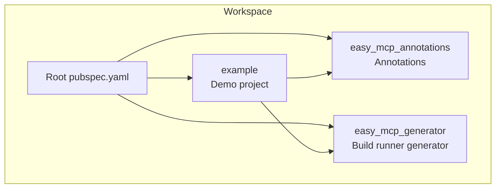
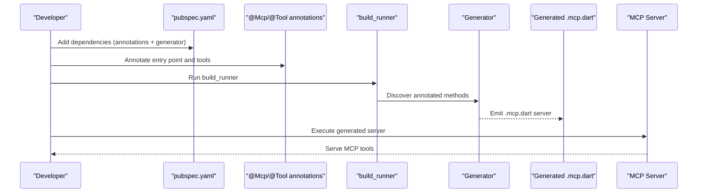
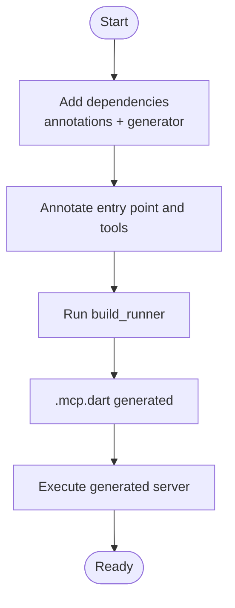
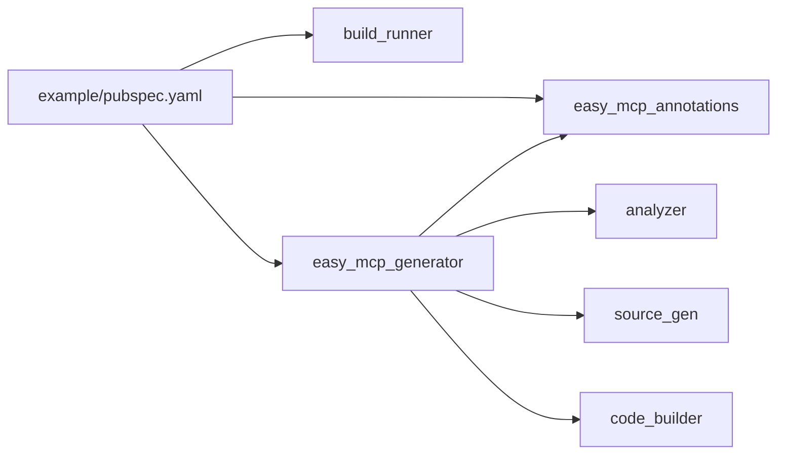

# Getting Started

<cite>
**Referenced Files in This Document**
- [README.md](file://README.md)
- [pubspec.yaml](file://pubspec.yaml)
- [packages/easy_mcp_annotations/pubspec.yaml](file://packages/easy_mcp_annotations/pubspec.yaml)
- [packages/easy_mcp_generator/pubspec.yaml](file://packages/easy_mcp_generator/pubspec.yaml)
- [packages/easy_mcp_annotations/lib/mcp_annotations.dart](file://packages/easy_mcp_annotations/lib/mcp_annotations.dart)
- [packages/easy_mcp_generator/build.yaml](file://packages/easy_mcp_generator/build.yaml)
- [packages/easy_mcp_generator/lib/mcp_generator.dart](file://packages/easy_mcp_generator/lib/mcp_generator.dart)
- [example/pubspec.yaml](file://example/pubspec.yaml)
- [example/README.md](file://example/README.md)
- [example/bin/example.dart](file://example/bin/example.dart)
- [example/lib/src/todo.dart](file://example/lib/src/todo.dart)
- [example/lib/src/user.dart](file://example/lib/src/user.dart)
</cite>

## Table of Contents
1. [Introduction](#introduction)
2. [Project Structure](#project-structure)
3. [Core Components](#core-components)
4. [Architecture Overview](#architecture-overview)
5. [Detailed Component Analysis](#detailed-component-analysis)
6. [Dependency Analysis](#dependency-analysis)
7. [Performance Considerations](#performance-considerations)
8. [Troubleshooting Guide](#troubleshooting-guide)
9. [Conclusion](#conclusion)
10. [Appendices](#appendices)

## Introduction
This guide helps you quickly set up Easy MCP and run your first Model Context Protocol (MCP) server in Dart. You will learn the prerequisites, how to add dependencies, annotate your functions, run the code generator, and execute the generated server. Practical examples show how to use the @mcp and @tool decorators, and we explain the generated code structure so you can extend your server confidently.

## Project Structure
The repository is a Dart workspace containing:
- easy_mcp_annotations: Annotations for marking methods as MCP tools and configuring transport.
- easy_mcp_generator: A build_runner generator that produces MCP server code from annotations.
- example: A working example project demonstrating annotations, stores, and the generated server.

**Diagram sources**
- [pubspec.yaml:1-11](file://pubspec.yaml#L1-L11)
- [packages/easy_mcp_annotations/pubspec.yaml:1-28](file://packages/easy_mcp_annotations/pubspec.yaml#L1-L28)
- [packages/easy_mcp_generator/pubspec.yaml:1-35](file://packages/easy_mcp_generator/pubspec.yaml#L1-L35)
- [example/pubspec.yaml:1-22](file://example/pubspec.yaml#L1-L22)

**Section sources**
- [pubspec.yaml:1-64](file://pubspec.yaml#L1-L64)
- [example/README.md:192-207](file://example/README.md#L192-L207)

## Core Components
- easy_mcp_annotations: Defines @Mcp and @Tool annotations and transport modes (stdio, http).
- easy_mcp_generator: A build_runner builder that scans annotated methods and generates an MCP server implementation.
- example: Demonstrates how to annotate functions, run the generator, and execute the generated server.

Key capabilities:
- AST-based parsing using analyzer.
- Two transport modes: stdio (JSON-RPC) and HTTP (shelf).
- Automatic schema generation from Dart types.
- Optional parameters and doc-comment fallbacks for descriptions.

**Section sources**
- [README.md:55-84](file://README.md#L55-L84)
- [packages/easy_mcp_annotations/lib/mcp_annotations.dart:6-49](file://packages/easy_mcp_annotations/lib/mcp_annotations.dart#L6-L49)
- [packages/easy_mcp_generator/pubspec.yaml:10-19](file://packages/easy_mcp_generator/pubspec.yaml#L10-L19)

## Architecture Overview
The Easy MCP workflow consists of annotating functions, running build_runner to generate an MCP server, and executing the generated server.

**Diagram sources**
- [README.md:16-53](file://README.md#L16-L53)
- [packages/easy_mcp_generator/build.yaml:1-12](file://packages/easy_mcp_generator/build.yaml#L1-L12)
- [example/README.md:59-74](file://example/README.md#L59-L74)

## Detailed Component Analysis

### Prerequisites and Environment Setup
- Dart SDK: ^3.9.0 or compatible.
- Optional: Melos for workspace management (used here for scripts).
- Example project uses ^3.11.0 for demonstration.

Verification steps:
- Confirm your environment satisfies the SDK requirement.
- From the project root, run dependency resolution as shown in the example README.

**Section sources**
- [README.md:87-90](file://README.md#L87-L90)
- [example/README.md:5-11](file://example/README.md#L5-L11)
- [example/pubspec.yaml:6-7](file://example/pubspec.yaml#L6-L7)

### Step-by-Step Installation and First Server
1) Add dependencies
- Add easy_mcp_annotations to dependencies.
- Add build_runner and easy_mcp_generator to dev_dependencies.

2) Annotate your functions
- Place @Mcp on your entry point and @Tool on methods you want to expose as tools.
- Choose transport: stdio or http.

3) Run the generator
- Execute build_runner from the project root to produce .mcp.dart files.

4) Run the server
- Execute the generated server file.

**Diagram sources**
- [README.md:16-53](file://README.md#L16-L53)
- [example/README.md:59-74](file://example/README.md#L59-L74)

**Section sources**
- [README.md:16-53](file://README.md#L16-L53)
- [example/README.md:13-74](file://example/README.md#L13-L74)

### Annotation Syntax and Examples
- @Mcp controls transport mode.
- @Tool marks a function as an MCP tool and provides metadata like description and icons.
- If description is omitted, the generator can extract it from the function’s doc comment.

Practical example locations:
- Entry point with @Mcp and @Tool usage.
- Tool definitions in stores.

**Section sources**
- [packages/easy_mcp_annotations/lib/mcp_annotations.dart:14-49](file://packages/easy_mcp_annotations/lib/mcp_annotations.dart#L14-L49)
- [example/bin/example.dart:6-67](file://example/bin/example.dart#L6-L67)
- [example/README.md:17-57](file://example/README.md#L17-L57)

### Build Process and Generated Code Structure
- The generator emits a .mcp.dart file that imports your stores and registers tools.
- The generated server uses a base class that integrates with the MCP runtime and registers each tool with its input schema.
- The example README documents the generated server structure and shows how tools are registered and handled.

What to expect after generation:
- A single-file MCP server that aggregates tools from imported libraries.
- Tool registration with input schemas derived from parameter types.
- Handler methods that deserialize arguments and call your store methods.

**Section sources**
- [packages/easy_mcp_generator/build.yaml:1-12](file://packages/easy_mcp_generator/build.yaml#L1-L12)
- [packages/easy_mcp_generator/lib/mcp_generator.dart:1-14](file://packages/easy_mcp_generator/lib/mcp_generator.dart#L1-L14)
- [example/README.md:224-300](file://example/README.md#L224-L300)

### Quick Start Tutorial: Your First MCP Server
Follow along with the example project to create a minimal server:

1) Prepare dependencies
- Add easy_mcp_annotations to dependencies.
- Add build_runner and easy_mcp_generator to dev_dependencies.

2) Create an entry point
- Annotate your main function with @Mcp and choose transport.
- Optionally seed or initialize data.

3) Define tools
- Create static methods in stores and annotate them with @Tool.
- Use clear descriptions and optional icons.

4) Generate and run
- Run build_runner from the project root.
- Execute the generated .mcp.dart file.

Verification:
- Use the MCP Inspector to list and call tools.
- Test both CLI and web UI modes.

**Section sources**
- [README.md:16-53](file://README.md#L16-L53)
- [example/README.md:13-74](file://example/README.md#L13-L74)
- [example/README.md:119-190](file://example/README.md#L119-L190)

## Dependency Analysis
The example project demonstrates the recommended dependency layout:
- easy_mcp_annotations in dependencies.
- build_runner and easy_mcp_generator in dev_dependencies.
- The generator depends on analyzer, build, source_gen, code_builder, and easy_mcp_annotations.

**Diagram sources**
- [example/pubspec.yaml:11-21](file://example/pubspec.yaml#L11-L21)
- [packages/easy_mcp_generator/pubspec.yaml:10-19](file://packages/easy_mcp_generator/pubspec.yaml#L10-L19)

**Section sources**
- [example/pubspec.yaml:11-21](file://example/pubspec.yaml#L11-L21)
- [packages/easy_mcp_generator/pubspec.yaml:10-19](file://packages/easy_mcp_generator/pubspec.yaml#L10-L19)

## Performance Considerations
- Keep tool signatures simple and leverage automatic schema generation to reduce boilerplate.
- Use optional parameters judiciously; they increase flexibility but can complicate schemas.
- Prefer streaming or batch operations for large datasets to minimize latency.
- Monitor memory usage during long-running operations and consider caching for repeated reads.

[No sources needed since this section provides general guidance]

## Troubleshooting Guide
Common setup issues and fixes:
- SDK mismatch: Ensure your environment meets the minimum Dart SDK requirement.
- Missing dependencies: Add easy_mcp_annotations to dependencies and build_runner plus easy_mcp_generator to dev_dependencies.
- Generator not running: Verify the builder configuration and run build_runner from the project root.
- Generated file missing: Confirm the build produced .mcp.dart and .mcp.json outputs.
- Transport selection: If using HTTP, ensure the appropriate dependencies are present and the entry point uses the correct transport.

Verification steps:
- Run build_runner and check for generated files.
- Execute the generated server and confirm it starts without errors.
- Use the MCP Inspector to list tools and call a simple tool.

**Section sources**
- [README.md:87-90](file://README.md#L87-L90)
- [example/README.md:59-74](file://example/README.md#L59-L74)
- [example/README.md:119-190](file://example/README.md#L119-L190)

## Conclusion
You now have the essentials to install Easy MCP, annotate your functions, generate an MCP server, and run it. Start with the example project, explore the generated code, and incrementally add more tools. For deeper exploration, review the annotations, generator behavior, and the example’s many-to-many data model.

[No sources needed since this section summarizes without analyzing specific files]

## Appendices

### Appendix A: Quick Reference
- Prerequisites: Dart SDK ^3.9.0+.
- Dependencies: easy_mcp_annotations (dependencies), build_runner and easy_mcp_generator (dev_dependencies).
- Annotations: @Mcp for transport, @Tool for tools.
- Build: dart run build_runner build from the project root.
- Run: dart run path/to/generated.mcp.dart.

**Section sources**
- [README.md:87-90](file://README.md#L87-L90)
- [README.md:16-53](file://README.md#L16-L53)
- [example/README.md:59-74](file://example/README.md#L59-L74)