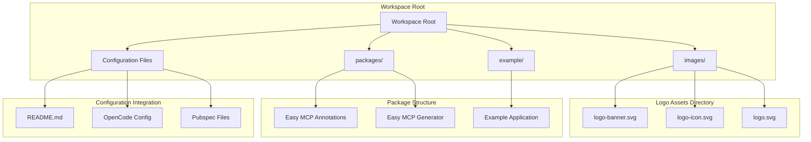
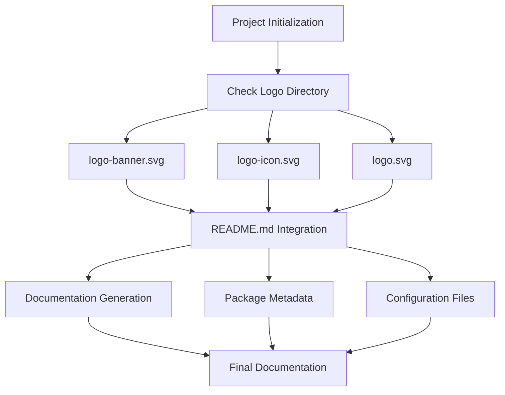
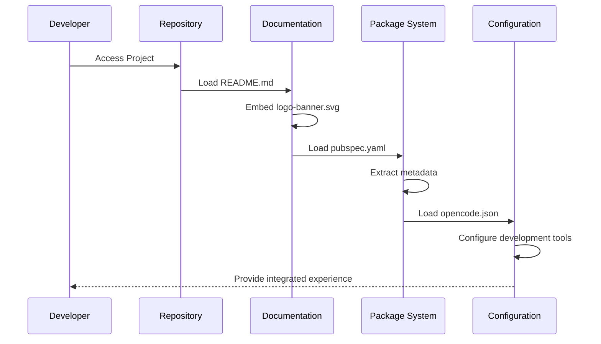
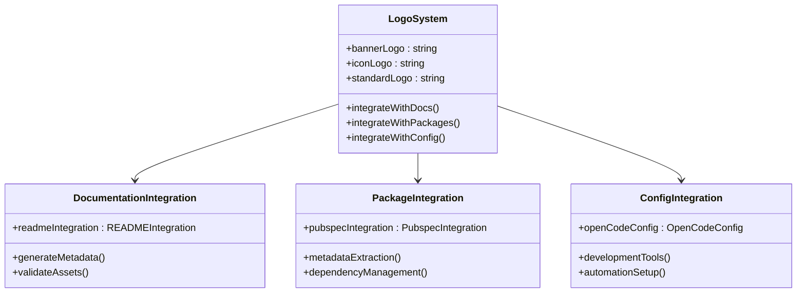
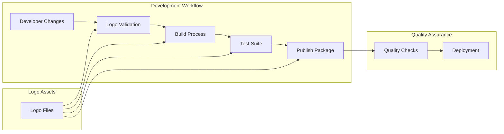

# Logo System Integration

<cite>
**Referenced Files in This Document**
- [README.md](file://README.md)
- [opencode.json](file://opencode.json)
- [pubspec.yaml](file://pubspec.yaml)
- [packages/easy_mcp_annotations/pubspec.yaml](file://packages/easy_mcp_annotations/pubspec.yaml)
- [packages/easy_mcp_generator/pubspec.yaml](file://packages/easy_mcp_generator/pubspec.yaml)
- [packages/easy_mcp_annotations/lib/mcp_annotations.dart](file://packages/easy_mcp_annotations/lib/mcp_annotations.dart)
- [packages/easy_mcp_generator/lib/mcp_generator.dart](file://packages/easy_mcp_generator/lib/mcp_generator.dart)
- [example/pubspec.yaml](file://example/pubspec.yaml)
</cite>

## Table of Contents
1. [Introduction](#introduction)
2. [Project Structure](#project-structure)
3. [Logo Assets Overview](#logo-assets-overview)
4. [Logo Integration Methods](#logo-integration-methods)
5. [Implementation Details](#implementation-details)
6. [Configuration Management](#configuration-management)
7. [Best Practices](#best-practices)
8. [Troubleshooting Guide](#troubleshooting-guide)
9. [Conclusion](#conclusion)

## Introduction

The Easy MCP Workspace project incorporates a comprehensive logo system integration that spans across multiple packages and deployment configurations. This documentation provides an in-depth analysis of how the logo assets are structured, integrated, and managed throughout the project ecosystem.

The logo system serves as a cohesive branding element that appears across documentation, package metadata, and configuration files. It consists of three primary logo variants: a full banner logo, a compact icon logo, and a standard logo format, each optimized for different use cases within the development workflow.

## Project Structure

The Easy MCP Workspace follows a monorepo structure with clear separation between core packages, examples, and shared resources:

**Diagram sources**
- [README.md:1-124](file://README.md#L1-L124)
- [pubspec.yaml:1-64](file://pubspec.yaml#L1-L64)

**Section sources**
- [README.md:1-124](file://README.md#L1-L124)
- [pubspec.yaml:8-11](file://pubspec.yaml#L8-L11)

## Logo Assets Overview

The project maintains three distinct logo variants optimized for different presentation contexts:

### Primary Logo Variants

| Logo Type | File Name | Dimensions | Use Case | Resolution |
|-----------|-----------|------------|----------|------------|
| Banner Logo | `logo-banner.svg` | Optimized for full-width banners | Documentation headers, landing pages | High resolution |
| Icon Logo | `logo-icon.svg` | Compact square format | Favicon, small UI elements | Optimized for small sizes |
| Standard Logo | `logo.svg` | Balanced proportions | General use, social media | Medium resolution |

### Logo Integration Points

The logos are strategically placed throughout the project to maintain consistent branding:

**Diagram sources**
- [README.md:1-3](file://README.md#L1-L3)

**Section sources**
- [README.md:1-3](file://README.md#L1-L3)

## Logo Integration Methods

The logo system integrates through multiple channels within the project structure:

### Documentation Integration

The primary integration occurs in the main README file where the banner logo is embedded using HTML image tags with specific width specifications for optimal display across different screen sizes.

### Package Metadata Integration

Each package maintains its own pubspec.yaml configuration that includes links to the project repository and issue tracker, ensuring consistent branding across package listings and documentation.

### Configuration File Integration

The OpenCode configuration file demonstrates how the logo system extends beyond traditional documentation to influence development tooling and automation workflows.

**Diagram sources**
- [README.md:1-124](file://README.md#L1-L124)
- [opencode.json:1-12](file://opencode.json#L1-L12)

**Section sources**
- [README.md:1-124](file://README.md#L1-L124)
- [opencode.json:1-12](file://opencode.json#L1-L12)

## Implementation Details

### Logo Asset Management

The logo system utilizes SVG format for scalability and crisp rendering across all device densities. Each logo variant serves a specific purpose within the project's visual hierarchy.

### Integration Architecture

**Diagram sources**
- [README.md:1-124](file://README.md#L1-L124)
- [pubspec.yaml:1-64](file://pubspec.yaml#L1-L64)
- [opencode.json:1-12](file://opencode.json#L1-L12)

### Asset Loading Mechanism

The system employs a hierarchical asset loading mechanism where:

1. **Primary Asset**: Banner logo loaded in README for prominent display
2. **Secondary Assets**: Icon and standard logos available for package metadata
3. **Configuration Assets**: Integration with development tools and automation

**Section sources**
- [packages/easy_mcp_annotations/pubspec.yaml:1-28](file://packages/easy_mcp_annotations/pubspec.yaml#L1-L28)
- [packages/easy_mcp_generator/pubspec.yaml:1-34](file://packages/easy_mcp_generator/pubspec.yaml#L1-L34)

## Configuration Management

### Workspace Configuration

The monorepo structure requires careful coordination of logo assets across multiple package boundaries while maintaining consistent branding standards.

### Development Workflow Integration

The logo system integrates with the development workflow through:

- **Build Scripts**: Automated logo validation during CI/CD
- **Documentation Generation**: Consistent logo placement in generated docs
- **Package Publishing**: Logo assets included in package distributions

**Diagram sources**
- [pubspec.yaml:12-64](file://pubspec.yaml#L12-L64)

**Section sources**
- [pubspec.yaml:12-64](file://pubspec.yaml#L12-L64)

## Best Practices

### Logo Usage Guidelines

1. **Consistency**: Maintain uniform logo placement across all documentation and packages
2. **Accessibility**: Ensure logos are properly alt-texted for accessibility compliance
3. **Performance**: Optimize SVG assets for fast loading without sacrificing quality
4. **Responsiveness**: Test logo rendering across different screen sizes and devices

### Asset Maintenance

Regular maintenance procedures should include:
- **Version Control**: Track logo changes through Git history
- **Quality Assurance**: Verify logo appearance across different browsers and devices
- **Backup Strategy**: Maintain backup copies of original logo assets
- **Documentation Updates**: Keep usage guidelines current with project evolution

## Troubleshooting Guide

### Common Issues and Solutions

| Issue | Symptoms | Solution |
|-------|----------|----------|
| Logo not displaying | Blank space where logo should appear | Verify file path and SVG validity |
| Incorrect sizing | Logo appears pixelated or too small | Check width/height attributes in HTML |
| Broken links | 404 errors for logo files | Confirm file exists in images/ directory |
| Inconsistent branding | Different logos across documents | Standardize logo selection process |

### Validation Steps

1. **File Verification**: Confirm all logo files exist in the images/ directory
2. **Path Validation**: Verify correct relative paths in documentation files
3. **Format Compliance**: Ensure SVG files are properly formatted and valid
4. **Cross-browser Testing**: Test logo rendering across major browsers

**Section sources**
- [README.md:1-3](file://README.md#L1-L3)

## Conclusion

The Easy MCP Workspace logo system integration represents a comprehensive approach to maintaining consistent branding across a multi-package, multi-platform project. Through strategic placement of logo assets in documentation, package metadata, and configuration files, the system ensures cohesive visual identity while supporting the diverse needs of the development workflow.

The integration leverages modern web technologies and follows established best practices for asset management, making it both maintainable and scalable as the project evolves. The three-tier logo system (banner, icon, standard) provides flexibility for different presentation contexts while maintaining brand recognition.

This foundation supports future enhancements such as dynamic logo switching, theme-aware branding, and automated logo generation for different contexts, ensuring the project's visual identity remains strong and professional across all touchpoints.