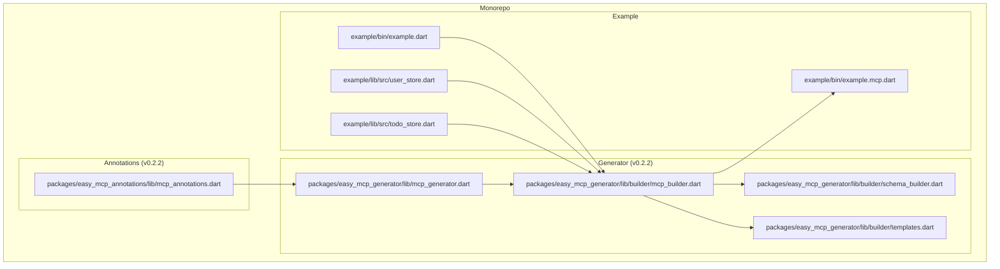
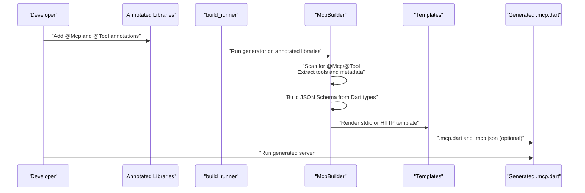
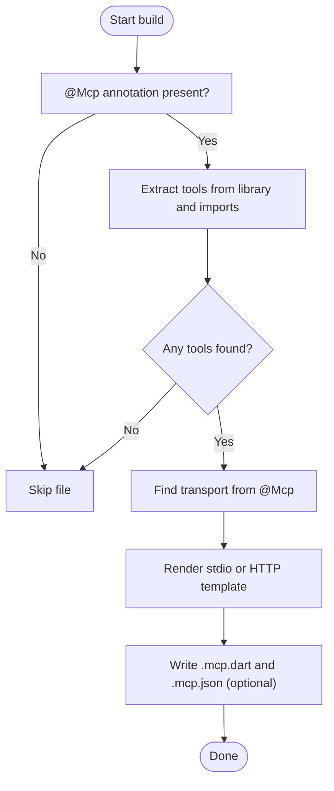
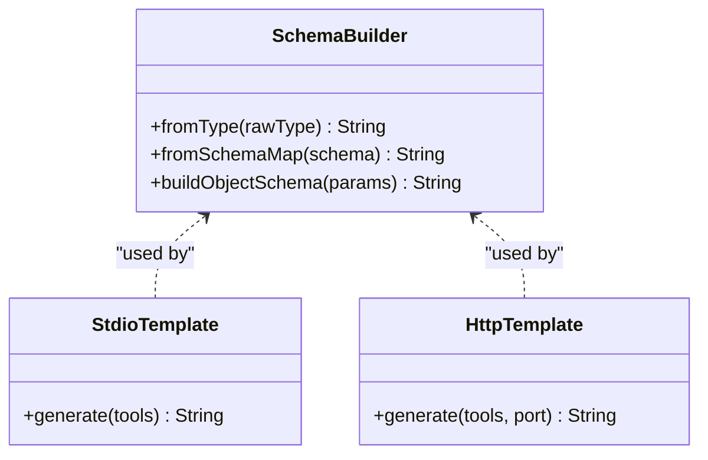
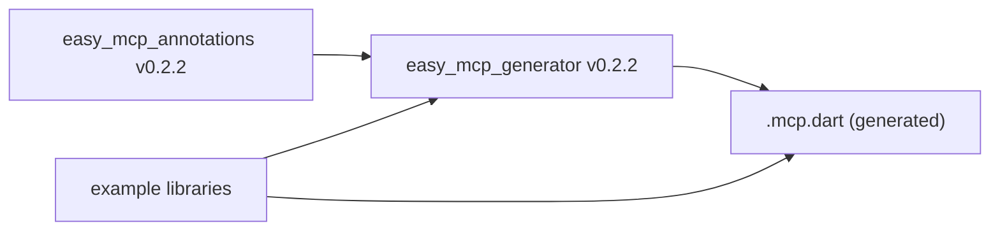

# Project Overview

<cite>
**Referenced Files in This Document**
- [README.md](file://README.md)
- [packages/easy_mcp_annotations/lib/mcp_annotations.dart](file://packages/easy_mcp_annotations/lib/mcp_annotations.dart)
- [packages/easy_mcp_generator/lib/mcp_generator.dart](file://packages/easy_mcp_generator/lib/mcp_generator.dart)
- [packages/easy_mcp_generator/lib/builder/mcp_builder.dart](file://packages/easy_mcp_generator/lib/builder/mcp_builder.dart)
- [packages/easy_mcp_generator/lib/builder/schema_builder.dart](file://packages/easy_mcp_generator/lib/builder/schema_builder.dart)
- [packages/easy_mcp_generator/lib/builder/templates.dart](file://packages/easy_mcp_generator/lib/builder/templates.dart)
- [example/README.md](file://example/README.md)
- [example/bin/example.dart](file://example/bin/example.dart)
- [example/bin/example.mcp.dart](file://example/bin/example.mcp.dart)
- [example/lib/src/user_store.dart](file://example/lib/src/user_store.dart)
- [example/lib/src/todo_store.dart](file://example/lib/src/todo_store.dart)
- [packages/easy_mcp_annotations/pubspec.yaml](file://packages/easy_mcp_annotations/pubspec.yaml)
- [packages/easy_mcp_generator/pubspec.yaml](file://packages/easy_mcp_generator/pubspec.yaml)
- [pubspec.yaml](file://pubspec.yaml)
</cite>

## Update Summary
**Changes Made**
- Updated version information from 0.2.1 to 0.2.2 across all package specifications
- Updated README dependency specifications to reflect new version 0.2.2
- Enhanced package version tracking and dependency management information
- Updated monorepo structure documentation to reflect current package versions

## Table of Contents
1. [Introduction](#introduction)
2. [Project Structure](#project-structure)
3. [Core Components](#core-components)
4. [Architecture Overview](#architecture-overview)
5. [Detailed Component Analysis](#detailed-component-analysis)
6. [Dependency Analysis](#dependency-analysis)
7. [Performance Considerations](#performance-considerations)
8. [Troubleshooting Guide](#troubleshooting-guide)
9. [Conclusion](#conclusion)

## Introduction
Easy MCP is a Dart framework that transforms annotated Dart functions into Model Context Protocol (MCP) servers with minimal boilerplate. By annotating existing library methods with simple decorators, developers can expose their functionality as MCP tools and run either stdio-based or HTTP-based servers that conform to the MCP specification. The framework emphasizes rapid development, automatic schema generation, dual transport support, and an annotation-driven workflow that integrates seamlessly with build_runner.

**Updated** Version 0.2.2 introduces enhanced stability and improved dependency management across the ecosystem.

Key value propositions:
- Rapid development: Write your business logic once, annotate it, and generate production-ready MCP servers.
- Automatic schema generation: Dart types are introspected and mapped to JSON Schema for precise tool contracts.
- Dual transport support: Choose between stdio (JSON-RPC) and HTTP (Shelf-based) transport modes.
- Annotation-driven workflow: Keep your codebase clean and declarative using @Mcp and @Tool annotations.

## Project Structure
The repository is a Dart monorepo containing two main packages and an example application that demonstrates real-world usage. All packages have been updated to version 0.2.2 for consistent ecosystem compatibility.

- **packages/easy_mcp_annotations (v0.2.2)**: Defines the @Mcp and @Tool annotations used to mark entry points and MCP tools.
- **packages/easy_mcp_generator (v0.2.2)**: Implements a build_runner generator that parses annotated code and produces MCP server implementations.
- **example**: A comprehensive example showcasing a many-to-many domain model (Users and Todos) with cross-store operations, demonstrating how to aggregate tools from multiple libraries into a single MCP server.



**Diagram sources**
- [packages/easy_mcp_annotations/lib/mcp_annotations.dart:1-241](file://packages/easy_mcp_annotations/lib/mcp_annotations.dart#L1-L241)
- [packages/easy_mcp_generator/lib/mcp_generator.dart:1-14](file://packages/easy_mcp_generator/lib/mcp_generator.dart#L1-L14)
- [packages/easy_mcp_generator/lib/builder/mcp_builder.dart:1-567](file://packages/easy_mcp_generator/lib/builder/mcp_builder.dart#L1-L567)
- [packages/easy_mcp_generator/lib/builder/schema_builder.dart:1-99](file://packages/easy_mcp_generator/lib/builder/schema_builder.dart#L1-L99)
- [packages/easy_mcp_generator/lib/builder/templates.dart:1-578](file://packages/easy_mcp_generator/lib/builder/templates.dart#L1-L578)
- [example/bin/example.dart:1-67](file://example/bin/example.dart#L1-L67)
- [example/bin/example.mcp.dart:1-200](file://example/bin/example.mcp.dart#L1-L200)
- [example/lib/src/user_store.dart:1-144](file://example/lib/src/user_store.dart#L1-L144)
- [example/lib/src/todo_store.dart:1-236](file://example/lib/src/todo_store.dart#L1-L236)

**Section sources**
- [README.md:1-168](file://README.md#L1-L168)
- [packages/easy_mcp_annotations/pubspec.yaml:1-28](file://packages/easy_mcp_annotations/pubspec.yaml#L1-L28)
- [packages/easy_mcp_generator/pubspec.yaml:1-34](file://packages/easy_mcp_generator/pubspec.yaml#L1-L34)
- [pubspec.yaml:1-64](file://pubspec.yaml#L1-L64)

## Core Components
- **Annotations package (v0.2.2)**: Provides @Mcp and @Tool annotations to declare transport modes and tool metadata. The @Mcp annotation controls transport (stdio or http), while @Tool marks methods as MCP tools and supplies descriptions/icons.
- **Generator package (v0.2.2)**: Implements a build_runner builder that scans libraries for @Mcp and @Tool annotations, extracts tool metadata, generates JSON Schema, and produces complete MCP server code with stdio or HTTP transport modes.
- **Example application**: Demonstrates practical usage with a realistic domain model, showing how tools are aggregated from multiple libraries and how the generated server exposes them.

Benefits:
- Minimal boilerplate: Developers write annotated functions; the generator produces runnable servers.
- Automatic schema generation: JSON Schema is derived from Dart types and method signatures.
- Dual transport support: Servers can run over stdio (JSON-RPC) or HTTP (Shelf-based).
- Annotation-driven development: Clear separation between business logic and server scaffolding.

**Section sources**
- [packages/easy_mcp_annotations/lib/mcp_annotations.dart:6-241](file://packages/easy_mcp_annotations/lib/mcp_annotations.dart#L6-L241)
- [packages/easy_mcp_generator/lib/mcp_generator.dart:1-14](file://packages/easy_mcp_generator/lib/mcp_generator.dart#L1-L14)
- [packages/easy_mcp_generator/lib/builder/mcp_builder.dart:12-567](file://packages/easy_mcp_generator/lib/builder/mcp_builder.dart#L12-L567)
- [packages/easy_mcp_generator/lib/builder/templates.dart:6-578](file://packages/easy_mcp_generator/lib/builder/templates.dart#L6-L578)
- [example/README.md:15-191](file://example/README.md#L15-L191)

## Architecture Overview
The framework follows an annotation-driven code generation pipeline:
- Developer writes annotated Dart functions in their libraries.
- build_runner invokes the generator to parse annotations and extract tool metadata.
- The generator builds JSON Schema from Dart types and emits MCP server code with transport-specific templates.
- The generated server runs as either a stdio or HTTP service, exposing the annotated tools as MCP tools.



**Diagram sources**
- [packages/easy_mcp_generator/lib/builder/mcp_builder.dart:18-52](file://packages/easy_mcp_generator/lib/builder/mcp_builder.dart#L18-L52)
- [packages/easy_mcp_generator/lib/builder/templates.dart:6-175](file://packages/easy_mcp_generator/lib/builder/templates.dart#L6-L175)
- [packages/easy_mcp_generator/lib/builder/templates.dart:269-486](file://packages/easy_mcp_generator/lib/builder/templates.dart#L269-L486)

**Section sources**
- [packages/easy_mcp_generator/lib/builder/mcp_builder.dart:18-52](file://packages/easy_mcp_generator/lib/builder/mcp_builder.dart#L18-L52)
- [packages/easy_mcp_generator/lib/builder/templates.dart:6-175](file://packages/easy_mcp_generator/lib/builder/templates.dart#L6-L175)
- [packages/easy_mcp_generator/lib/builder/templates.dart:269-486](file://packages/easy_mcp_generator/lib/builder/templates.dart#L269-L486)

## Detailed Component Analysis

### Annotations: @Mcp and @Tool
- @Mcp: Declares the transport mode for the generated server (stdio or http) and optionally enables JSON metadata generation.
- @Tool: Marks a function as an MCP tool, providing a description and optional icons. If description is omitted, the generator falls back to the function's doc comment.

```mermaid
classDiagram
class Mcp {
+McpTransport transport
+bool generateJson
}
class Tool {
+String? description
+String[]? icons
}
enum McpTransport {
+stdio
+http
}
```

**Diagram sources**
- [packages/easy_mcp_annotations/lib/mcp_annotations.dart:25-241](file://packages/easy_mcp_annotations/lib/mcp_annotations.dart#L25-L241)

**Section sources**
- [packages/easy_mcp_annotations/lib/mcp_annotations.dart:6-241](file://packages/easy_mcp_annotations/lib/mcp_annotations.dart#L6-L241)

### Generator Pipeline: McpBuilder
- Scans libraries for @Mcp annotations to determine which files to process.
- Extracts tools from the annotated library and all its package-local imports, deriving unique import aliases to avoid naming conflicts.
- Determines transport mode from @Mcp and renders either stdio or HTTP templates.
- Optionally generates JSON metadata describing tool schemas.



**Diagram sources**
- [packages/easy_mcp_generator/lib/builder/mcp_builder.dart:18-52](file://packages/easy_mcp_generator/lib/builder/mcp_builder.dart#L18-L52)
- [packages/easy_mcp_generator/lib/builder/mcp_builder.dart:112-166](file://packages/easy_mcp_generator/lib/builder/mcp_builder.dart#L112-L166)
- [packages/easy_mcp_generator/lib/builder/mcp_builder.dart:515-563](file://packages/easy_mcp_generator/lib/builder/mcp_builder.dart#L515-L563)

**Section sources**
- [packages/easy_mcp_generator/lib/builder/mcp_builder.dart:18-52](file://packages/easy_mcp_generator/lib/builder/mcp_builder.dart#L18-L52)
- [packages/easy_mcp_generator/lib/builder/mcp_builder.dart:112-166](file://packages/easy_mcp_generator/lib/builder/mcp_builder.dart#L112-L166)
- [packages/easy_mcp_generator/lib/builder/mcp_builder.dart:515-563](file://packages/easy_mcp_generator/lib/builder/mcp_builder.dart#L515-L563)

### Schema Builder and Templates
- SchemaBuilder converts Dart type metadata into dart_mcp Schema expressions, handling primitives, arrays, and nested objects with required fields.
- StdioTemplate and HttpTemplate generate complete server code, including tool registration, parameter extraction, conversions for complex types, and serialization of results.



**Diagram sources**
- [packages/easy_mcp_generator/lib/builder/schema_builder.dart:1-99](file://packages/easy_mcp_generator/lib/builder/schema_builder.dart#L1-L99)
- [packages/easy_mcp_generator/lib/builder/templates.dart:6-175](file://packages/easy_mcp_generator/lib/builder/templates.dart#L6-L175)
- [packages/easy_mcp_generator/lib/builder/templates.dart:269-486](file://packages/easy_mcp_generator/lib/builder/templates.dart#L269-L486)

**Section sources**
- [packages/easy_mcp_generator/lib/builder/schema_builder.dart:1-99](file://packages/easy_mcp_generator/lib/builder/schema_builder.dart#L1-L99)
- [packages/easy_mcp_generator/lib/builder/templates.dart:6-175](file://packages/easy_mcp_generator/lib/builder/templates.dart#L6-L175)
- [packages/easy_mcp_generator/lib/builder/templates.dart:269-486](file://packages/easy_mcp_generator/lib/builder/templates.dart#L269-L486)

### Practical Examples: AI Agent Integrations and Server Automation
Common use cases:
- AI agent integrations: Expose domain-specific tools (e.g., search, create, update, delete) as MCP tools so agents can discover and invoke them automatically.
- Server automation: Automate routine tasks by exposing CRUD-like tools for internal systems, enabling external orchestration or UIs to trigger actions.

Example domains:
- User management: Tools for creating, retrieving, listing, updating, and deleting users.
- Task management: Tools for creating, completing, assigning, and listing tasks, with cross-store operations between users and tasks.

These examples demonstrate how to:
- Annotate static methods as @Tool.
- Aggregate tools from multiple libraries into a single MCP server.
- Run the generated server in stdio or HTTP transport modes.

**Section sources**
- [example/README.md:15-191](file://example/README.md#L15-L191)
- [example/bin/example.dart:6-67](file://example/bin/example.dart#L6-L67)
- [example/bin/example.mcp.dart:70-490](file://example/bin/example.mcp.dart#L70-L490)
- [example/lib/src/user_store.dart:50-142](file://example/lib/src/user_store.dart#L50-L142)
- [example/lib/src/todo_store.dart:68-234](file://example/lib/src/todo_store.dart#L68-L234)

## Dependency Analysis
The generator depends on the annotations package and uses analyzer, source_gen, and code_builder to parse Dart code and generate code. The example application demonstrates how annotated libraries feed into the generator to produce a runnable MCP server.

**Updated** All packages now consistently use version 0.2.2 for ecosystem compatibility.



**Diagram sources**
- [packages/easy_mcp_generator/lib/mcp_generator.dart:11](file://packages/easy_mcp_generator/lib/mcp_generator.dart#L11)
- [packages/easy_mcp_generator/lib/builder/mcp_builder.dart:1](file://packages/easy_mcp_generator/lib/builder/mcp_builder.dart#L1)
- [packages/easy_mcp_annotations/lib/mcp_annotations.dart:1](file://packages/easy_mcp_annotations/lib/mcp_annotations.dart#L1)

**Section sources**
- [packages/easy_mcp_generator/pubspec.yaml:10-20](file://packages/easy_mcp_generator/pubspec.yaml#L10-L20)
- [packages/easy_mcp_annotations/pubspec.yaml:11-13](file://packages/easy_mcp_annotations/pubspec.yaml#L11-L13)
- [packages/easy_mcp_generator/lib/mcp_generator.dart:11](file://packages/easy_mcp_generator/lib/mcp_generator.dart#L11)

## Performance Considerations
- AST-based parsing: Relies on analyzer for robust and accurate code extraction.
- Efficient schema generation: Uses type introspection to minimize redundant checks and cycles.
- Transport selection: Choose stdio for lightweight, CLI-focused integrations or HTTP for web-based inspection and browser UI testing.
- Generated code: The templates avoid reflection and use direct parameter extraction and serialization for predictable runtime performance.

## Troubleshooting Guide
- No tools discovered: Ensure the entry point library has an @Mcp annotation and that @Tool methods are static or properly scoped within classes.
- Transport mismatch: Verify the @Mcp transport setting matches the intended runtime environment (stdio vs. HTTP).
- Parameter type issues: Complex types in List<T> require inner types to be importable; the generator collects import URIs for custom inner types.
- HTTP server startup: Confirm the generated server binds to the expected port and that the HTTP handler responds to POST requests.

**Section sources**
- [packages/easy_mcp_generator/lib/builder/mcp_builder.dart:27-33](file://packages/easy_mcp_generator/lib/builder/mcp_builder.dart#L27-L33)
- [packages/easy_mcp_generator/lib/builder/mcp_builder.dart:515-563](file://packages/easy_mcp_generator/lib/builder/mcp_builder.dart#L515-L563)
- [packages/easy_mcp_generator/lib/builder/templates.dart:382-486](file://packages/easy_mcp_generator/lib/builder/templates.dart#L382-L486)

## Conclusion
Easy MCP accelerates the creation of MCP servers by turning annotated Dart functions into runnable services with minimal effort. Its annotation-driven design, automatic schema generation, and dual transport support streamline development for both beginners and experienced developers. The monorepo structure cleanly separates concerns between annotations and code generation, while the example demonstrates practical patterns for building AI agent integrations and automating server-side workflows.

**Updated** Version 0.2.2 provides enhanced stability and consistent dependency management across the ecosystem, making it easier for developers to adopt and integrate Easy MCP into their projects.