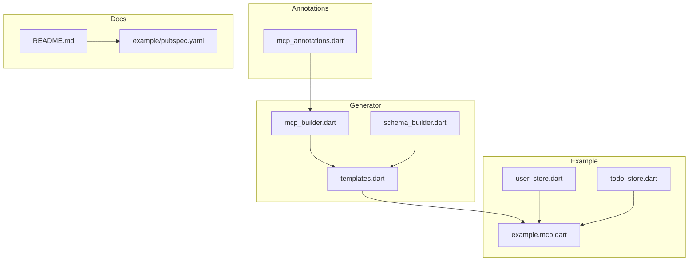
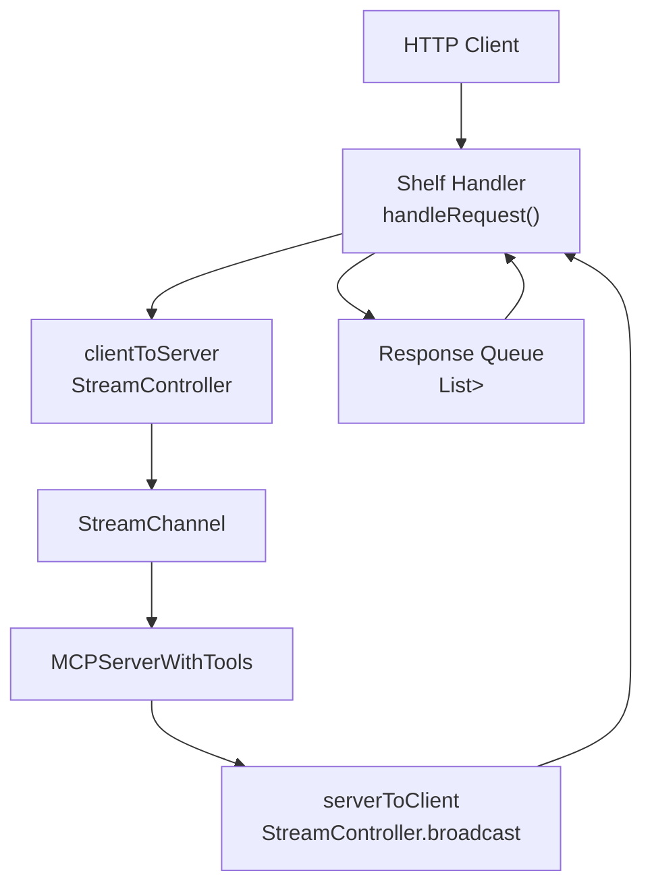
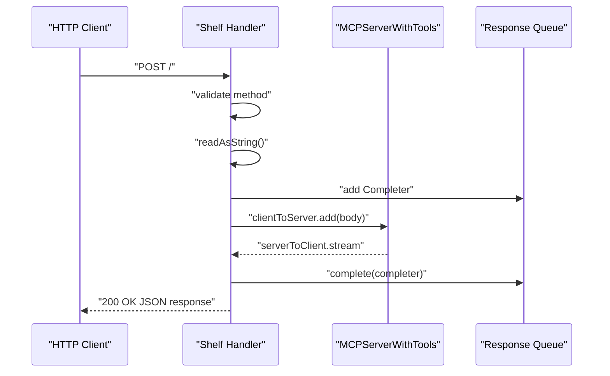
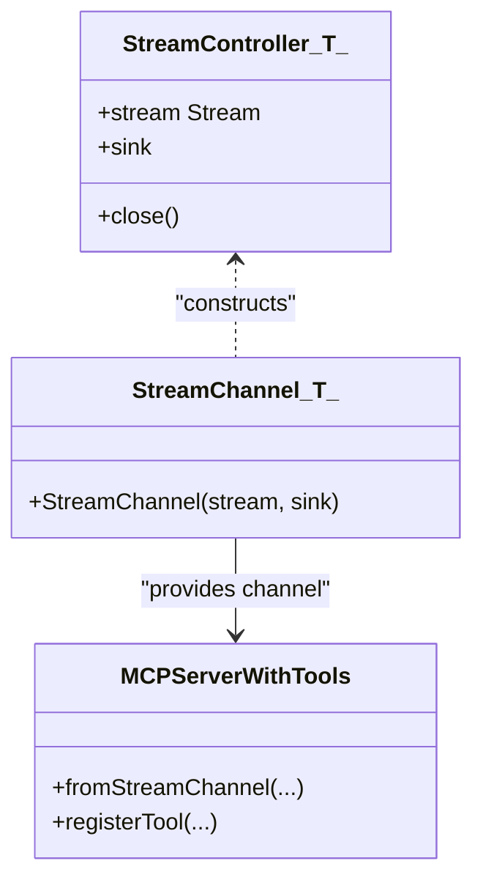
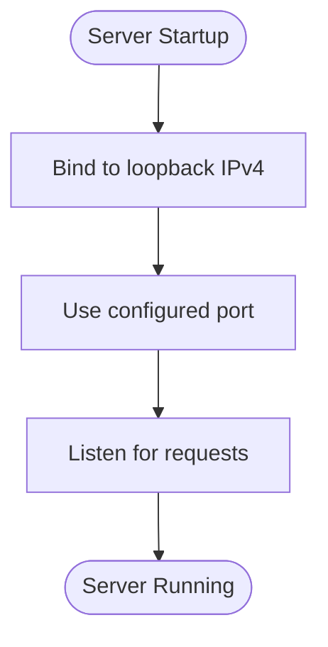
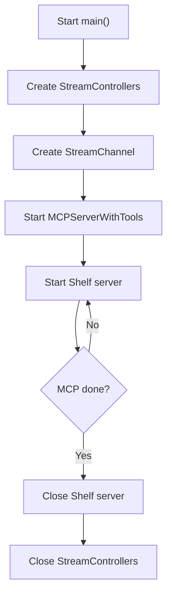
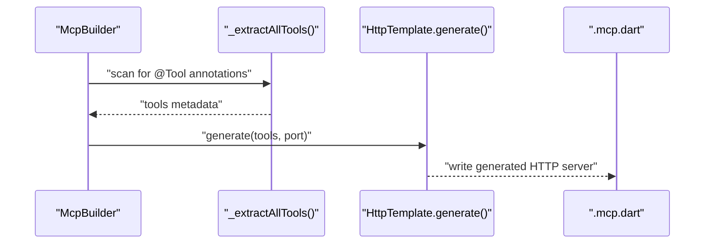
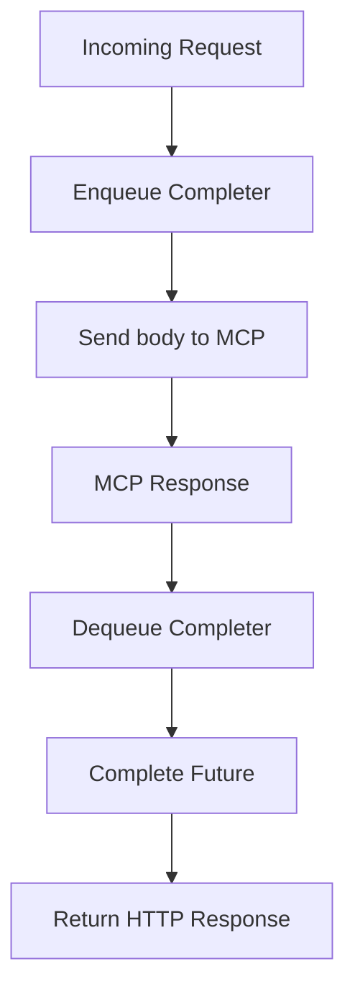
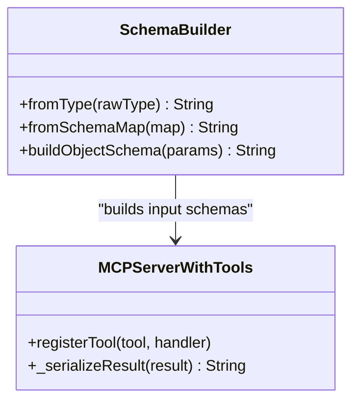
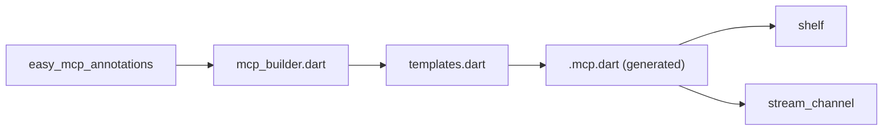

# HTTP Transport

<cite>
**Referenced Files in This Document**
- [README.md](file://README.md)
- [pubspec.yaml](file://pubspec.yaml)
- [packages/easy_mcp_annotations/lib/mcp_annotations.dart](file://packages/easy_mcp_annotations/lib/mcp_annotations.dart)
- [packages/easy_mcp_generator/lib/builder/mcp_builder.dart](file://packages/easy_mcp_generator/lib/builder/mcp_builder.dart)
- [packages/easy_mcp_generator/lib/builder/templates.dart](file://packages/easy_mcp_generator/lib/builder/templates.dart)
- [packages/easy_mcp_generator/lib/builder/schema_builder.dart](file://packages/easy_mcp_generator/lib/builder/schema_builder.dart)
- [packages/easy_mcp_generator/test/templates_test.dart](file://packages/easy_mcp_generator/test/templates_test.dart)
- [example/bin/example.mcp.dart](file://example/bin/example.mcp.dart)
- [example/lib/src/user_store.dart](file://example/lib/src/user_store.dart)
- [example/lib/src/todo_store.dart](file://example/lib/src/todo_store.dart)
- [example/pubspec.yaml](file://example/pubspec.yaml)
</cite>

## Table of Contents
1. [Introduction](#introduction)
2. [Project Structure](#project-structure)
3. [Core Components](#core-components)
4. [Architecture Overview](#architecture-overview)
5. [Detailed Component Analysis](#detailed-component-analysis)
6. [Dependency Analysis](#dependency-analysis)
7. [Performance Considerations](#performance-considerations)
8. [Troubleshooting Guide](#troubleshooting-guide)
9. [Security Considerations](#security-considerations)
10. [Practical Examples](#practical-examples)
11. [Conclusion](#conclusion)

## Introduction
This document explains the HTTP transport implementation for Easy MCP’s web-based communication system. It covers how the Shelf framework integrates with the MCP server to enable HTTP-based tool invocation, the bidirectional streaming architecture using StreamController and StreamChannel, port configuration and loopback binding, server lifecycle management, template generation for HTTP endpoints, response buffering with completer queues, and practical guidance for testing, monitoring, error handling, and performance optimization.

## Project Structure
The repository provides:
- Annotations and generator for building HTTP or stdio MCP servers
- Example application demonstrating HTTP transport usage
- Tests validating the generated HTTP server template

**Diagram sources**
- [packages/easy_mcp_annotations/lib/mcp_annotations.dart:1-107](file://packages/easy_mcp_annotations/lib/mcp_annotations.dart#L1-L107)
- [packages/easy_mcp_generator/lib/builder/mcp_builder.dart:1-567](file://packages/easy_mcp_generator/lib/builder/mcp_builder.dart#L1-L567)
- [packages/easy_mcp_generator/lib/builder/templates.dart:268-486](file://packages/easy_mcp_generator/lib/builder/templates.dart#L268-L486)
- [packages/easy_mcp_generator/lib/builder/schema_builder.dart:1-99](file://packages/easy_mcp_generator/lib/builder/schema_builder.dart#L1-L99)
- [example/bin/example.mcp.dart:1-68](file://example/bin/example.mcp.dart#L1-L68)
- [example/lib/src/user_store.dart:1-144](file://example/lib/src/user_store.dart#L1-L144)
- [example/lib/src/todo_store.dart:1-236](file://example/lib/src/todo_store.dart#L1-L236)
- [README.md:1-120](file://README.md#L1-L120)
- [example/pubspec.yaml:1-22](file://example/pubspec.yaml#L1-L22)

**Section sources**
- [README.md:1-120](file://README.md#L1-L120)
- [pubspec.yaml:1-64](file://pubspec.yaml#L1-L64)

## Core Components
- Annotations define transport mode selection (HTTP vs stdio) and tool metadata.
- The generator builds HTTP server code using a Shelf handler and a StreamChannel bridge to the MCP server.
- The example demonstrates a working HTTP server bound to the loopback interface on a fixed port.

Key responsibilities:
- McpTransport enum selects HTTP transport.
- McpBuilder reads annotations and emits HTTP or stdio server code.
- HttpTemplate generates the Shelf-based HTTP server, StreamChannel wiring, and response buffering.
- Example server binds to loopback IPv4 and prints the effective port.

**Section sources**
- [packages/easy_mcp_annotations/lib/mcp_annotations.dart:9-19](file://packages/easy_mcp_annotations/lib/mcp_annotations.dart#L9-L19)
- [packages/easy_mcp_generator/lib/builder/mcp_builder.dart:18-52](file://packages/easy_mcp_generator/lib/builder/mcp_builder.dart#L18-L52)
- [packages/easy_mcp_generator/lib/builder/templates.dart:268-486](file://packages/easy_mcp_generator/lib/builder/templates.dart#L268-L486)
- [example/bin/example.mcp.dart:55-61](file://example/bin/example.mcp.dart#L55-L61)

## Architecture Overview
The HTTP transport architecture connects incoming HTTP requests to the MCP server via a bidirectional stream. The Shelf handler validates the request, forwards the payload to the MCP server through a StreamChannel, and returns the serialized response.

**Diagram sources**
- [packages/easy_mcp_generator/lib/builder/templates.dart:398-449](file://packages/easy_mcp_generator/lib/builder/templates.dart#L398-L449)
- [example/bin/example.mcp.dart:17-67](file://example/bin/example.mcp.dart#L17-L67)

## Detailed Component Analysis

### Shelf Integration and Request Routing
- The generated server defines a Shelf route handler that accepts only POST requests.
- Non-POST requests return an appropriate HTTP error status.
- On successful POST, the handler reads the request body, enqueues a Completer for response synchronization, and forwards the body to the MCP server via the client-to-server stream.

**Diagram sources**
- [packages/easy_mcp_generator/lib/builder/templates.dart:419-434](file://packages/easy_mcp_generator/lib/builder/templates.dart#L419-L434)
- [example/bin/example.mcp.dart:38-53](file://example/bin/example.mcp.dart#L38-L53)

**Section sources**
- [packages/easy_mcp_generator/lib/builder/templates.dart:419-434](file://packages/easy_mcp_generator/lib/builder/templates.dart#L419-L434)
- [example/bin/example.mcp.dart:38-53](file://example/bin/example.mcp.dart#L38-L53)

### Bidirectional Streaming with StreamController and StreamChannel
- Two StreamControllers manage directions:
  - clientToServer: receives HTTP request bodies and forwards to MCP.
  - serverToClient: broadcasts MCP responses back to the HTTP handler.
- StreamChannel connects these streams to the MCP server’s expected channel interface.
- The MCP server registers tools and serializes results for transport.

**Diagram sources**
- [packages/easy_mcp_generator/lib/builder/templates.dart:399-407](file://packages/easy_mcp_generator/lib/builder/templates.dart#L399-L407)
- [packages/easy_mcp_generator/lib/builder/templates.dart:451-461](file://packages/easy_mcp_generator/lib/builder/templates.dart#L451-L461)
- [example/bin/example.mcp.dart:18-26](file://example/bin/example.mcp.dart#L18-L26)

**Section sources**
- [packages/easy_mcp_generator/lib/builder/templates.dart:399-407](file://packages/easy_mcp_generator/lib/builder/templates.dart#L399-L407)
- [packages/easy_mcp_generator/lib/builder/templates.dart:451-461](file://packages/easy_mcp_generator/lib/builder/templates.dart#L451-L461)
- [example/bin/example.mcp.dart:18-26](file://example/bin/example.mcp.dart#L18-L26)

### Port Configuration and Loopback Binding
- The generated HTTP server binds to the loopback IPv4 address and a configured port.
- The example server uses a fixed port value in the generated code.
- The builder chooses the HTTP template when transport is set to HTTP.

**Diagram sources**
- [packages/easy_mcp_generator/lib/builder/mcp_builder.dart:36-38](file://packages/easy_mcp_generator/lib/builder/mcp_builder.dart#L36-L38)
- [packages/easy_mcp_generator/lib/builder/templates.dart:436-440](file://packages/easy_mcp_generator/lib/builder/templates.dart#L436-L440)
- [example/bin/example.mcp.dart:55-59](file://example/bin/example.mcp.dart#L55-L59)

**Section sources**
- [packages/easy_mcp_generator/lib/builder/mcp_builder.dart:36-38](file://packages/easy_mcp_generator/lib/builder/mcp_builder.dart#L36-L38)
- [packages/easy_mcp_generator/lib/builder/templates.dart:436-440](file://packages/easy_mcp_generator/lib/builder/templates.dart#L436-L440)
- [example/bin/example.mcp.dart:55-59](file://example/bin/example.mcp.dart#L55-L59)

### Server Lifecycle Management
- The server starts the Shelf HTTP server, waits for the MCP server to complete, and closes resources cleanly.
- Streams and controllers are closed after the MCP server finishes.

**Diagram sources**
- [packages/easy_mcp_generator/lib/builder/templates.dart:398-449](file://packages/easy_mcp_generator/lib/builder/templates.dart#L398-L449)
- [example/bin/example.mcp.dart:63-67](file://example/bin/example.mcp.dart#L63-L67)

**Section sources**
- [packages/easy_mcp_generator/lib/builder/templates.dart:398-449](file://packages/easy_mcp_generator/lib/builder/templates.dart#L398-L449)
- [example/bin/example.mcp.dart:63-67](file://example/bin/example.mcp.dart#L63-L67)

### Template Generation Process
- The generator extracts tool definitions and metadata from annotated libraries.
- It emits an HTTP server template that includes:
  - Imports for Shelf and StreamChannel
  - StreamControllers and StreamChannel construction
  - Response buffering via a queue of Completers
  - Tool registration and handlers
  - Server startup and lifecycle cleanup

**Diagram sources**
- [packages/easy_mcp_generator/lib/builder/mcp_builder.dart:18-52](file://packages/easy_mcp_generator/lib/builder/mcp_builder.dart#L18-L52)
- [packages/easy_mcp_generator/lib/builder/templates.dart:268-486](file://packages/easy_mcp_generator/lib/builder/templates.dart#L268-L486)

**Section sources**
- [packages/easy_mcp_generator/lib/builder/mcp_builder.dart:18-52](file://packages/easy_mcp_generator/lib/builder/mcp_builder.dart#L18-L52)
- [packages/easy_mcp_generator/lib/builder/templates.dart:268-486](file://packages/easy_mcp_generator/lib/builder/templates.dart#L268-L486)

### Response Buffering Mechanism
- A queue of Completers ensures that responses from the MCP server match the correct request.
- When a response arrives on the server-to-client stream, the head of the queue completes, unblocking the corresponding request handler.

**Diagram sources**
- [packages/easy_mcp_generator/lib/builder/templates.dart:411-417](file://packages/easy_mcp_generator/lib/builder/templates.dart#L411-L417)
- [example/bin/example.mcp.dart:30-36](file://example/bin/example.mcp.dart#L30-L36)

**Section sources**
- [packages/easy_mcp_generator/lib/builder/templates.dart:411-417](file://packages/easy_mcp_generator/lib/builder/templates.dart#L411-L417)
- [example/bin/example.mcp.dart:30-36](file://example/bin/example.mcp.dart#L30-L36)

### Tool Registration and Serialization
- Tools are registered with input schemas derived from parameter introspection.
- Results are serialized to JSON for transport and returned as HTTP responses.

**Diagram sources**
- [packages/easy_mcp_generator/lib/builder/schema_builder.dart:1-99](file://packages/easy_mcp_generator/lib/builder/schema_builder.dart#L1-L99)
- [packages/easy_mcp_generator/lib/builder/templates.dart:451-484](file://packages/easy_mcp_generator/lib/builder/templates.dart#L451-L484)

**Section sources**
- [packages/easy_mcp_generator/lib/builder/schema_builder.dart:1-99](file://packages/easy_mcp_generator/lib/builder/schema_builder.dart#L1-L99)
- [packages/easy_mcp_generator/lib/builder/templates.dart:451-484](file://packages/easy_mcp_generator/lib/builder/templates.dart#L451-L484)

## Dependency Analysis
- The example depends on Shelf and StreamChannel to implement HTTP transport and bidirectional streaming.
- The generator depends on the annotations package and uses dart_mcp for server scaffolding.

**Diagram sources**
- [packages/easy_mcp_annotations/lib/mcp_annotations.dart:1-107](file://packages/easy_mcp_annotations/lib/mcp_annotations.dart#L1-L107)
- [packages/easy_mcp_generator/lib/builder/mcp_builder.dart:1-567](file://packages/easy_mcp_generator/lib/builder/mcp_builder.dart#L1-L567)
- [packages/easy_mcp_generator/lib/builder/templates.dart:268-486](file://packages/easy_mcp_generator/lib/builder/templates.dart#L268-L486)
- [example/pubspec.yaml:11-22](file://example/pubspec.yaml#L11-L22)

**Section sources**
- [example/pubspec.yaml:11-22](file://example/pubspec.yaml#L11-L22)
- [packages/easy_mcp_generator/lib/builder/mcp_builder.dart:18-52](file://packages/easy_mcp_generator/lib/builder/mcp_builder.dart#L18-L52)

## Performance Considerations
- Request handling is synchronous per request; ensure the MCP server remains responsive.
- Avoid blocking operations inside tool handlers to prevent queue backlog.
- Consider connection pooling and concurrency limits at the HTTP layer if scaling horizontally.
- Monitor queue depth and completion latency to detect backpressure.

[No sources needed since this section provides general guidance]

## Troubleshooting Guide
Common issues and remedies:
- Method not allowed: Ensure clients send POST requests to the HTTP endpoint.
- Port conflicts: Change the port in the generated code and rebuild.
- Loopback binding: Confirm the server binds to loopback; adjust address if exposing externally.
- Resource cleanup: Verify server lifecycle closes streams and the HTTP server gracefully.

**Section sources**
- [packages/easy_mcp_generator/lib/builder/templates.dart:420-422](file://packages/easy_mcp_generator/lib/builder/templates.dart#L420-L422)
- [packages/easy_mcp_generator/lib/builder/templates.dart:436-440](file://packages/easy_mcp_generator/lib/builder/templates.dart#L436-L440)
- [packages/easy_mcp_generator/lib/builder/templates.dart:445-449](file://packages/easy_mcp_generator/lib/builder/templates.dart#L445-L449)

## Security Considerations
- CORS: The generated template does not include CORS headers; add appropriate headers if serving from browsers.
- Authentication: No built-in authentication; integrate middleware or reverse proxy authentication as needed.
- HTTPS: The template binds to loopback and does not enable TLS; deploy behind a reverse proxy for TLS termination.
- Network exposure: The example binds to loopback; for external access, bind to a specific interface and secure the deployment boundary.

[No sources needed since this section provides general guidance]

## Practical Examples
- HTTP server startup:
  - Run the generated server binary to start the Shelf HTTP server on the configured port.
  - The server prints the effective port after binding.
- Endpoint testing:
  - Send a POST request to the HTTP endpoint with a JSON payload compatible with the MCP server.
  - Expect a JSON response; verify non-POST requests receive an appropriate error status.
- Integration with web clients:
  - Configure the client to target the server’s loopback address and port.
  - For browser clients, ensure CORS headers are set or serve via a trusted origin.

**Section sources**
- [example/bin/example.mcp.dart:55-61](file://example/bin/example.mcp.dart#L55-L61)
- [packages/easy_mcp_generator/lib/builder/templates.dart:419-434](file://packages/easy_mcp_generator/lib/builder/templates.dart#L419-L434)

## Conclusion
The Easy MCP HTTP transport leverages Shelf for request handling, StreamChannel for bidirectional streaming, and a completer-queue mechanism to synchronize responses. The generator automates server creation from annotated tool definitions, enabling quick prototyping and integration. For production, consider CORS, authentication, and HTTPS via a reverse proxy, and monitor performance to maintain responsiveness under load.