# HTTP Transport

<cite>
**Referenced Files in This Document**
- [README.md](file://README.md)
- [pubspec.yaml](file://pubspec.yaml)
- [packages/easy_mcp_annotations/lib/mcp_annotations.dart](file://packages/easy_mcp_annotations/lib/mcp_annotations.dart)
- [packages/easy_mcp_generator/lib/builder/mcp_builder.dart](file://packages/easy_mcp_generator/lib/builder/mcp_builder.dart)
- [packages/easy_mcp_generator/lib/builder/templates.dart](file://packages/easy_mcp_generator/lib/builder/templates.dart)
- [packages/easy_mcp_generator/lib/builder/schema_builder.dart](file://packages/easy_mcp_generator/lib/builder/schema_builder.dart)
- [packages/easy_mcp_generator/test/templates_test.dart](file://packages/easy_mcp_generator/test/templates_test.dart)
- [example/bin/example.mcp.dart](file://example/bin/example.mcp.dart)
- [example/bin/example.dart](file://example/bin/example.dart)
- [example/lib/src/user_store.dart](file://example/lib/src/user_store.dart)
- [example/lib/src/todo_store.dart](file://example/lib/src/todo_store.dart)
- [example/pubspec.yaml](file://example/pubspec.yaml)
</cite>

## Update Summary
**Changes Made**
- Updated Core Components section to reflect dynamic port configuration and address binding capabilities
- Enhanced Port Configuration and Loopback Binding section with new dynamic configuration features
- Added sophisticated transport detection mechanisms for HTTP vs stdio transport selection
- Updated Server Lifecycle Management to include proper cleanup procedures
- Enhanced Practical Examples with dynamic configuration scenarios

## Table of Contents
1. [Introduction](#introduction)
2. [Project Structure](#project-structure)
3. [Core Components](#core-components)
4. [Architecture Overview](#architecture-overview)
5. [Detailed Component Analysis](#detailed-component-analysis)
6. [Dependency Analysis](#dependency-analysis)
7. [Performance Considerations](#performance-considerations)
8. [Troubleshooting Guide](#troubleshooting-guide)
9. [Security Considerations](#security-considerations)
10. [Practical Examples](#practical-examples)
11. [Conclusion](#conclusion)

## Introduction
This document explains the HTTP transport implementation for Easy MCP's web-based communication system. It covers how the Shelf framework integrates with the MCP server to enable HTTP-based tool invocation, the bidirectional streaming architecture using StreamController and StreamChannel, dynamic port configuration and address binding, server lifecycle management, template generation for HTTP endpoints, response buffering with completer queues, and practical guidance for testing, monitoring, error handling, and performance optimization.

## Project Structure
The repository provides:
- Annotations and generator for building HTTP or stdio MCP servers with dynamic configuration
- Example application demonstrating HTTP transport usage with configurable port and address
- Tests validating the generated HTTP server template with dynamic settings

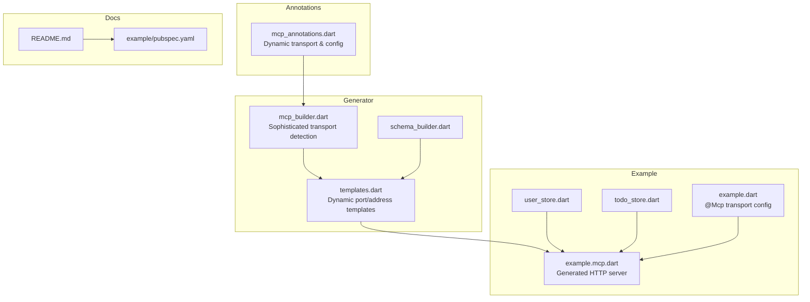

**Diagram sources**
- [packages/easy_mcp_annotations/lib/mcp_annotations.dart:1-141](file://packages/easy_mcp_annotations/lib/mcp_annotations.dart#L1-L141)
- [packages/easy_mcp_generator/lib/builder/mcp_builder.dart:1-738](file://packages/easy_mcp_generator/lib/builder/mcp_builder.dart#L1-L738)
- [packages/easy_mcp_generator/lib/builder/templates.dart:282-630](file://packages/easy_mcp_generator/lib/builder/templates.dart#L282-L630)
- [packages/easy_mcp_generator/lib/builder/schema_builder.dart:1-99](file://packages/easy_mcp_generator/lib/builder/schema_builder.dart#L1-L99)
- [example/bin/example.mcp.dart:1-490](file://example/bin/example.mcp.dart#L1-L490)
- [example/bin/example.dart:6](file://example/bin/example.dart#L6)
- [example/lib/src/user_store.dart:1-144](file://example/lib/src/user_store.dart#L1-L144)
- [example/lib/src/todo_store.dart:1-236](file://example/lib/src/todo_store.dart#L1-L236)
- [README.md:1-120](file://README.md#L1-L120)
- [example/pubspec.yaml:1-22](file://example/pubspec.yaml#L1-L22)

**Section sources**
- [README.md:1-120](file://README.md#L1-L120)
- [pubspec.yaml:1-64](file://pubspec.yaml#L1-L64)

## Core Components
- Annotations define transport mode selection (HTTP vs stdio) and dynamic configuration including port and address settings.
- The generator performs sophisticated transport detection and extracts configuration parameters from annotations.
- The HttpTemplate generates Shelf-based HTTP servers with dynamic port and address binding.
- The example demonstrates HTTP transport with configurable port (8080) and address ('0.0.0.0').

Key responsibilities:
- McpTransport enum selects HTTP transport with dynamic configuration support.
- McpBuilder performs transport detection and extracts port/address from annotations.
- HttpTemplate generates dynamic server code with configurable port and address binding.
- Example server demonstrates HTTP transport with custom port and address configuration.

**Updated** Enhanced transport detection and dynamic configuration capabilities

**Section sources**
- [packages/easy_mcp_annotations/lib/mcp_annotations.dart:9-90](file://packages/easy_mcp_annotations/lib/mcp_annotations.dart#L9-L90)
- [packages/easy_mcp_generator/lib/builder/mcp_builder.dart:559-734](file://packages/easy_mcp_generator/lib/builder/mcp_builder.dart#L559-L734)
- [packages/easy_mcp_generator/lib/builder/templates.dart:303-537](file://packages/easy_mcp_generator/lib/builder/templates.dart#L303-L537)
- [example/bin/example.dart:6](file://example/bin/example.dart#L6)

## Architecture Overview
The HTTP transport architecture connects incoming HTTP requests to the MCP server via a bidirectional stream with dynamic configuration support. The Shelf handler validates the request, forwards the payload to the MCP server through a StreamChannel, and returns the serialized response.

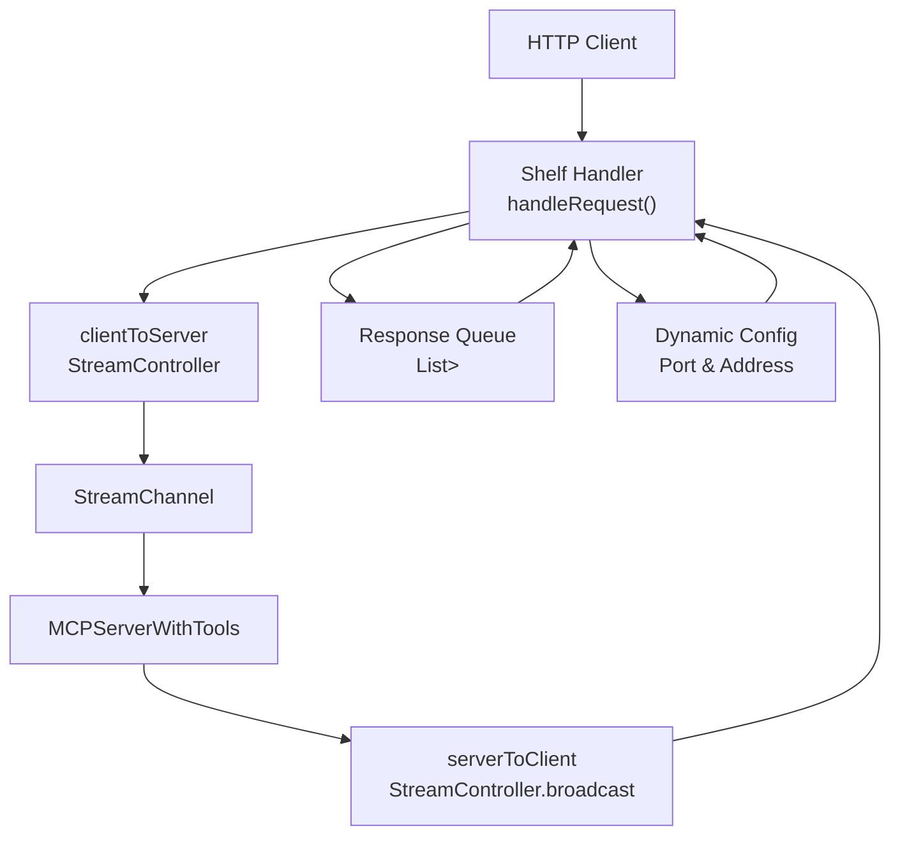

**Diagram sources**
- [packages/easy_mcp_generator/lib/builder/templates.dart:471-501](file://packages/easy_mcp_generator/lib/builder/templates.dart#L471-L501)
- [packages/easy_mcp_generator/lib/builder/mcp_builder.dart:626-734](file://packages/easy_mcp_generator/lib/builder/mcp_builder.dart#L626-L734)
- [example/bin/example.mcp.dart:17-67](file://example/bin/example.mcp.dart#L17-L67)

## Detailed Component Analysis

### Sophisticated Transport Detection and Dynamic Configuration
- The generator performs comprehensive transport detection across top-level functions, classes, and methods.
- Dynamic configuration extraction supports port and address parameters for HTTP transport.
- Transport detection prioritizes explicit annotation values over defaults.
- The system handles both enum-based and index-based transport specification.

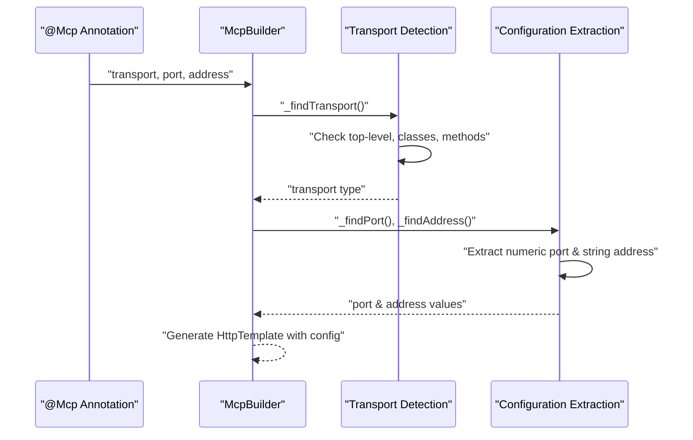

**Diagram sources**
- [packages/easy_mcp_generator/lib/builder/mcp_builder.dart:559-734](file://packages/easy_mcp_generator/lib/builder/mcp_builder.dart#L559-L734)
- [packages/easy_mcp_annotations/lib/mcp_annotations.dart:54-89](file://packages/easy_mcp_annotations/lib/mcp_annotations.dart#L54-L89)

**Section sources**
- [packages/easy_mcp_generator/lib/builder/mcp_builder.dart:559-734](file://packages/easy_mcp_generator/lib/builder/mcp_builder.dart#L559-L734)
- [packages/easy_mcp_annotations/lib/mcp_annotations.dart:54-89](file://packages/easy_mcp_annotations/lib/mcp_annotations.dart#L54-L89)

### Shelf Integration and Request Routing
- The generated server defines a Shelf route handler that accepts only POST requests.
- Non-POST requests return an appropriate HTTP error status.
- On successful POST, the handler reads the request body, enqueues a Completer for response synchronization, and forwards the body to the MCP server via the client-to-server stream.

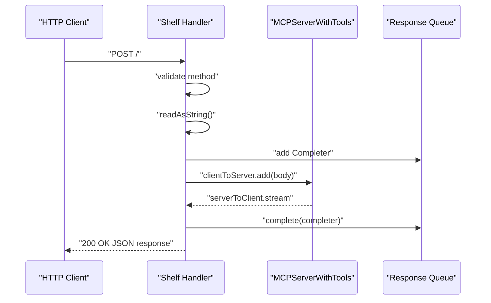

**Diagram sources**
- [packages/easy_mcp_generator/lib/builder/templates.dart:471-501](file://packages/easy_mcp_generator/lib/builder/templates.dart#L471-L501)
- [example/bin/example.mcp.dart:38-53](file://example/bin/example.mcp.dart#L38-L53)

**Section sources**
- [packages/easy_mcp_generator/lib/builder/templates.dart:471-501](file://packages/easy_mcp_generator/lib/builder/templates.dart#L471-L501)
- [example/bin/example.mcp.dart:38-53](file://example/bin/example.mcp.dart#L38-L53)

### Bidirectional Streaming with StreamController and StreamChannel
- Two StreamControllers manage directions:
  - clientToServer: receives HTTP request bodies and forwards to MCP.
  - serverToClient: broadcasts MCP responses back to the HTTP handler.
- StreamChannel connects these streams to the MCP server's expected channel interface.
- The MCP server registers tools and serializes results for transport.

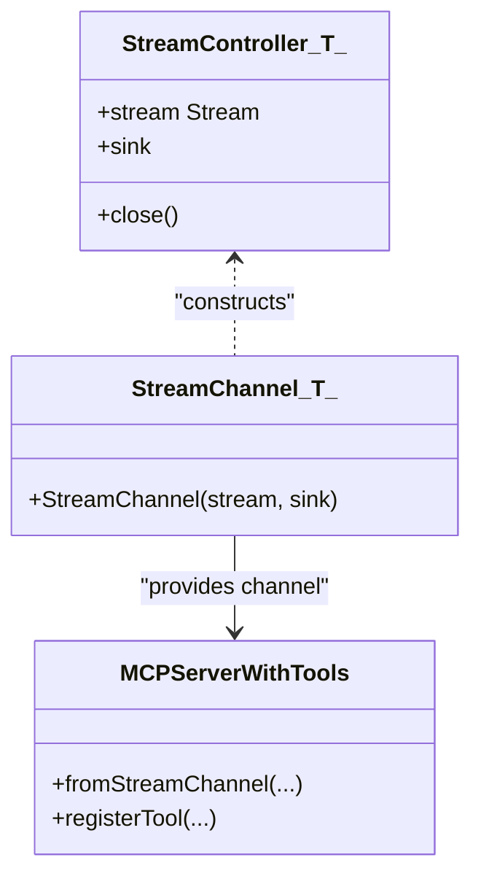

**Diagram sources**
- [packages/easy_mcp_generator/lib/builder/templates.dart:451-461](file://packages/easy_mcp_generator/lib/builder/templates.dart#L451-L461)
- [packages/easy_mcp_generator/lib/builder/templates.dart:503-513](file://packages/easy_mcp_generator/lib/builder/templates.dart#L503-L513)
- [example/bin/example.mcp.dart:18-26](file://example/bin/example.mcp.dart#L18-L26)

**Section sources**
- [packages/easy_mcp_generator/lib/builder/templates.dart:451-461](file://packages/easy_mcp_generator/lib/builder/templates.dart#L451-L461)
- [packages/easy_mcp_generator/lib/builder/templates.dart:503-513](file://packages/easy_mcp_generator/lib/builder/templates.dart#L503-L513)
- [example/bin/example.mcp.dart:18-26](file://example/bin/example.mcp.dart#L18-L26)

### Dynamic Port Configuration and Address Binding
- The generated HTTP server supports dynamic port configuration extracted from @Mcp annotations.
- Address binding supports both loopback interface ('127.0.0.1') and external interfaces ('0.0.0.0').
- The builder extracts port and address values from annotations with fallback to defaults.
- Conditional imports optimize imports based on address type (uses dart:io for loopback, string literals for custom addresses).

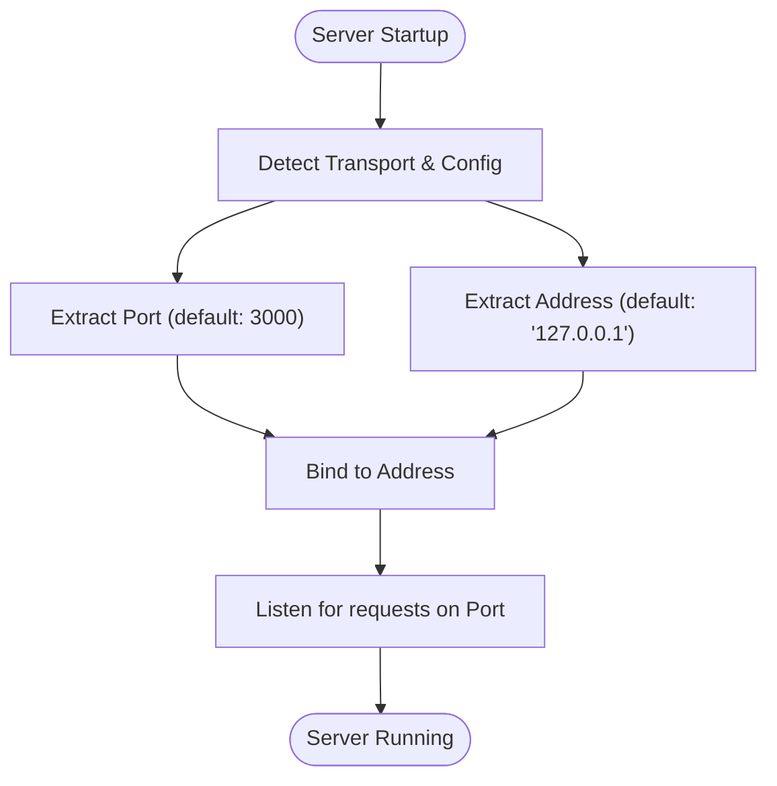

**Diagram sources**
- [packages/easy_mcp_generator/lib/builder/mcp_builder.dart:626-734](file://packages/easy_mcp_generator/lib/builder/mcp_builder.dart#L626-L734)
- [packages/easy_mcp_generator/lib/builder/templates.dart:322-325](file://packages/easy_mcp_generator/lib/builder/templates.dart#L322-L325)
- [example/bin/example.mcp.dart:55-59](file://example/bin/example.mcp.dart#L55-L59)

**Updated** Enhanced with dynamic configuration extraction and conditional imports

**Section sources**
- [packages/easy_mcp_generator/lib/builder/mcp_builder.dart:626-734](file://packages/easy_mcp_generator/lib/builder/mcp_builder.dart#L626-L734)
- [packages/easy_mcp_generator/lib/builder/templates.dart:322-325](file://packages/easy_mcp_generator/lib/builder/templates.dart#L322-L325)
- [example/bin/example.mcp.dart:55-59](file://example/bin/example.mcp.dart#L55-L59)

### Server Lifecycle Management
- The server starts the Shelf HTTP server with dynamic configuration, waits for the MCP server to complete, and closes resources cleanly.
- Streams and controllers are closed after the MCP server finishes.
- Proper cleanup ensures graceful shutdown and resource deallocation.

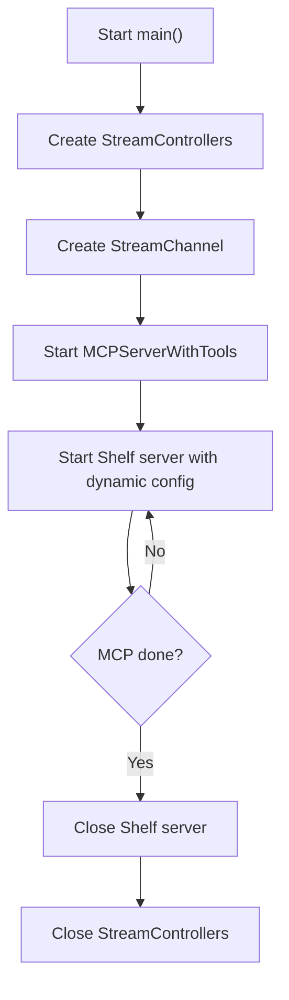

**Diagram sources**
- [packages/easy_mcp_generator/lib/builder/templates.dart:450-501](file://packages/easy_mcp_generator/lib/builder/templates.dart#L450-L501)
- [example/bin/example.mcp.dart:63-67](file://example/bin/example.mcp.dart#L63-L67)

**Section sources**
- [packages/easy_mcp_generator/lib/builder/templates.dart:450-501](file://packages/easy_mcp_generator/lib/builder/templates.dart#L450-L501)
- [example/bin/example.mcp.dart:63-67](file://example/bin/example.mcp.dart#L63-L67)

### Template Generation Process
- The generator extracts tool definitions and metadata from annotated libraries.
- It emits an HTTP server template that includes:
  - Imports for Shelf and StreamChannel with conditional dart:io imports
  - StreamControllers and StreamChannel construction
  - Response buffering via a queue of Completers
  - Tool registration and handlers
  - Server startup with dynamic port and address configuration
  - Server lifecycle cleanup

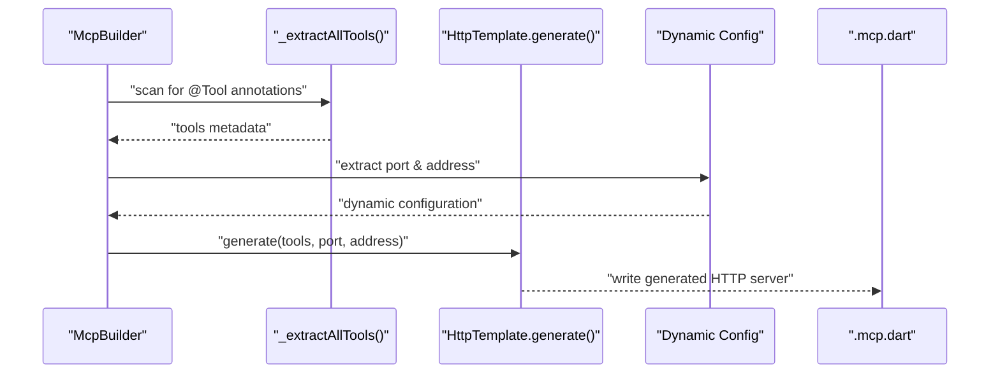

**Diagram sources**
- [packages/easy_mcp_generator/lib/builder/mcp_builder.dart:559-624](file://packages/easy_mcp_generator/lib/builder/mcp_builder.dart#L559-L624)
- [packages/easy_mcp_generator/lib/builder/templates.dart:303-537](file://packages/easy_mcp_generator/lib/builder/templates.dart#L303-L537)

**Section sources**
- [packages/easy_mcp_generator/lib/builder/mcp_builder.dart:559-624](file://packages/easy_mcp_generator/lib/builder/mcp_builder.dart#L559-L624)
- [packages/easy_mcp_generator/lib/builder/templates.dart:303-537](file://packages/easy_mcp_generator/lib/builder/templates.dart#L303-L537)

### Response Buffering Mechanism
- A queue of Completers ensures that responses from the MCP server match the correct request.
- When a response arrives on the server-to-client stream, the head of the queue completes, unblocking the corresponding request handler.

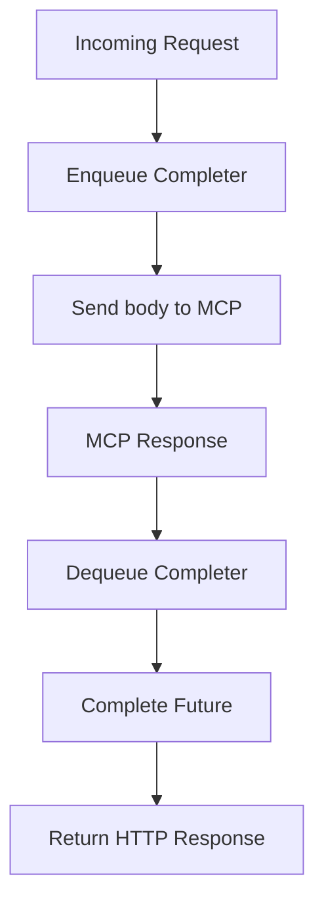

**Diagram sources**
- [packages/easy_mcp_generator/lib/builder/templates.dart:464-469](file://packages/easy_mcp_generator/lib/builder/templates.dart#L464-L469)
- [example/bin/example.mcp.dart:30-36](file://example/bin/example.mcp.dart#L30-L36)

**Section sources**
- [packages/easy_mcp_generator/lib/builder/templates.dart:464-469](file://packages/easy_mcp_generator/lib/builder/templates.dart#L464-L469)
- [example/bin/example.mcp.dart:30-36](file://example/bin/example.mcp.dart#L30-L36)

### Tool Registration and Serialization
- Tools are registered with input schemas derived from parameter introspection.
- Results are serialized to JSON for transport and returned as HTTP responses.

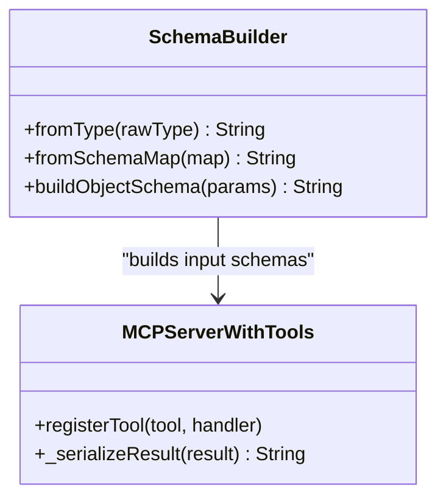

**Diagram sources**
- [packages/easy_mcp_generator/lib/builder/schema_builder.dart:1-99](file://packages/easy_mcp_generator/lib/builder/schema_builder.dart#L1-L99)
- [packages/easy_mcp_generator/lib/builder/templates.dart:503-536](file://packages/easy_mcp_generator/lib/builder/templates.dart#L503-L536)

**Section sources**
- [packages/easy_mcp_generator/lib/builder/schema_builder.dart:1-99](file://packages/easy_mcp_generator/lib/builder/schema_builder.dart#L1-L99)
- [packages/easy_mcp_generator/lib/builder/templates.dart:503-536](file://packages/easy_mcp_generator/lib/builder/templates.dart#L503-L536)

## Dependency Analysis
- The example depends on Shelf and StreamChannel to implement HTTP transport and bidirectional streaming.
- The generator depends on the annotations package and uses dart_mcp for server scaffolding.
- Dynamic configuration requires proper import handling based on address type.

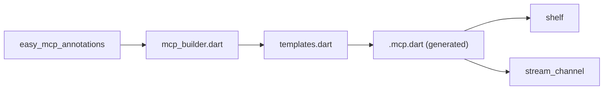

**Diagram sources**
- [packages/easy_mcp_annotations/lib/mcp_annotations.dart:1-141](file://packages/easy_mcp_annotations/lib/mcp_annotations.dart#L1-L141)
- [packages/easy_mcp_generator/lib/builder/mcp_builder.dart:1-738](file://packages/easy_mcp_generator/lib/builder/mcp_builder.dart#L1-L738)
- [packages/easy_mcp_generator/lib/builder/templates.dart:282-630](file://packages/easy_mcp_generator/lib/builder/templates.dart#L282-L630)
- [example/pubspec.yaml:11-22](file://example/pubspec.yaml#L11-L22)

**Section sources**
- [example/pubspec.yaml:11-22](file://example/pubspec.yaml#L11-L22)
- [packages/easy_mcp_generator/lib/builder/mcp_builder.dart:559-624](file://packages/easy_mcp_generator/lib/builder/mcp_builder.dart#L559-L624)

## Performance Considerations
- Request handling is synchronous per request; ensure the MCP server remains responsive.
- Avoid blocking operations inside tool handlers to prevent queue backlog.
- Consider connection pooling and concurrency limits at the HTTP layer if scaling horizontally.
- Monitor queue depth and completion latency to detect backpressure.
- Dynamic configuration adds minimal overhead during server startup.

## Troubleshooting Guide
Common issues and remedies:
- Method not allowed: Ensure clients send POST requests to the HTTP endpoint.
- Port conflicts: Change the port in the @Mcp annotation and rebuild.
- Address binding: Verify the server binds to the correct address; adjust address parameter if exposing externally.
- Resource cleanup: Verify server lifecycle closes streams and the HTTP server gracefully.
- Transport detection: Ensure @Mcp annotation is properly placed on top-level functions, classes, or methods.

**Section sources**
- [packages/easy_mcp_generator/lib/builder/templates.dart:472-474](file://packages/easy_mcp_generator/lib/builder/templates.dart#L472-L474)
- [packages/easy_mcp_generator/lib/builder/mcp_builder.dart:626-734](file://packages/easy_mcp_generator/lib/builder/mcp_builder.dart#L626-L734)
- [packages/easy_mcp_generator/lib/builder/templates.dart:496-501](file://packages/easy_mcp_generator/lib/builder/templates.dart#L496-L501)

## Security Considerations
- CORS: The generated template does not include CORS headers; add appropriate headers if serving from browsers.
- Authentication: No built-in authentication; integrate middleware or reverse proxy authentication as needed.
- HTTPS: The template binds to loopback and does not enable TLS; deploy behind a reverse proxy for TLS termination.
- Network exposure: The example demonstrates binding to '0.0.0.0' for external access; use '127.0.0.1' for local-only access.
- Dynamic configuration: Validate configuration inputs to prevent unexpected address/port combinations.

## Practical Examples
- HTTP server startup with dynamic configuration:
  - Use @Mcp(transport: McpTransport.http, port: 8080, address: '0.0.0.0') to configure server binding.
  - Run the generated server binary to start the Shelf HTTP server with custom port and address.
  - The server prints the effective port after binding.
- Endpoint testing:
  - Send a POST request to the HTTP endpoint with a JSON payload compatible with the MCP server.
  - Expect a JSON response; verify non-POST requests receive an appropriate error status.
- Integration with web clients:
  - Configure the client to target the server's configured address and port.
  - For browser clients, ensure CORS headers are set or serve via a trusted origin.
- Transport detection scenarios:
  - Test different placement of @Mcp annotation (top-level function, class, method).
  - Verify that configuration extraction works regardless of annotation location.

**Section sources**
- [example/bin/example.dart:6](file://example/bin/example.dart#L6)
- [example/bin/example.mcp.dart:55-59](file://example/bin/example.mcp.dart#L55-L59)
- [packages/easy_mcp_generator/lib/builder/templates.dart:471-501](file://packages/easy_mcp_generator/lib/builder/templates.dart#L471-L501)

## Conclusion
The Easy MCP HTTP transport leverages Shelf for request handling, StreamChannel for bidirectional streaming, and a completer-queue mechanism to synchronize responses. The generator automates server creation from annotated tool definitions with sophisticated transport detection and dynamic configuration extraction. The system now supports flexible port and address configuration, enabling deployment in various environments from local development to production deployments. For production, consider CORS, authentication, and HTTPS via a reverse proxy, and monitor performance to maintain responsiveness under load.