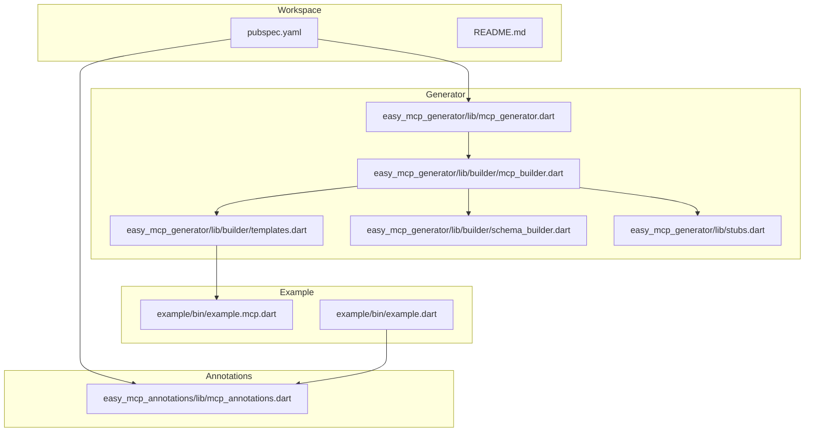
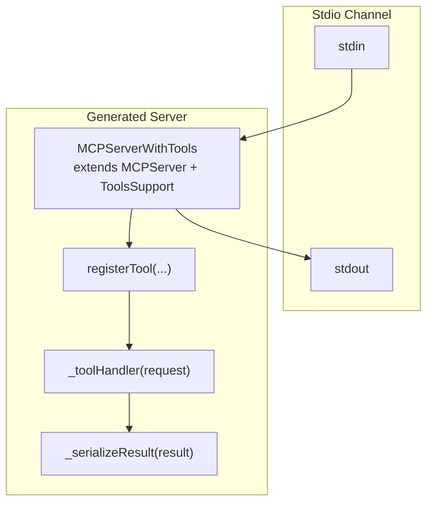
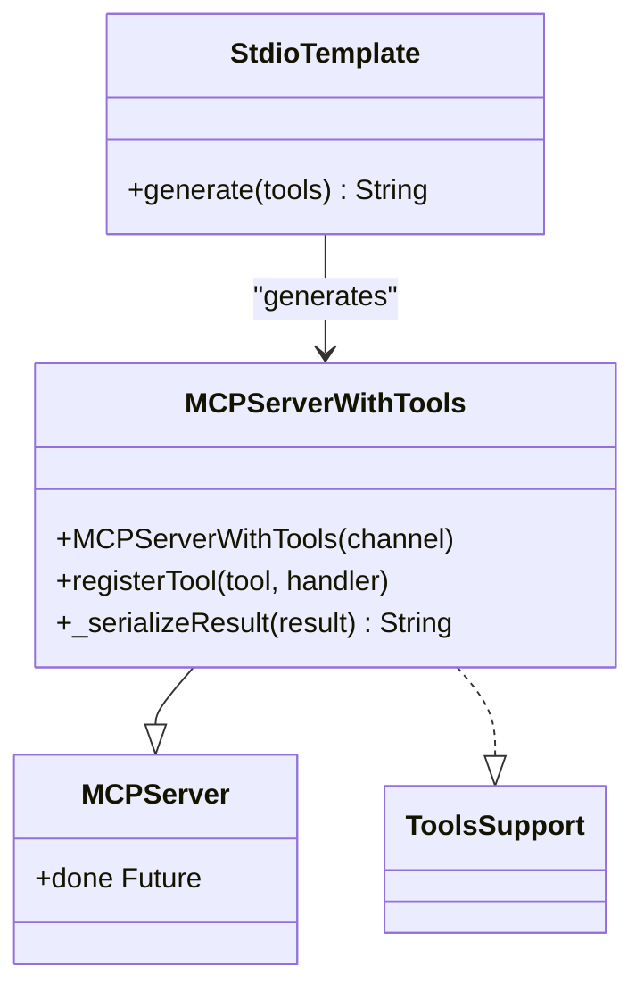
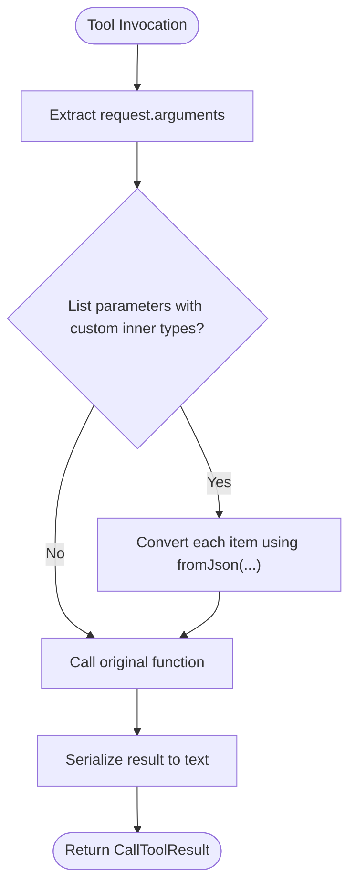
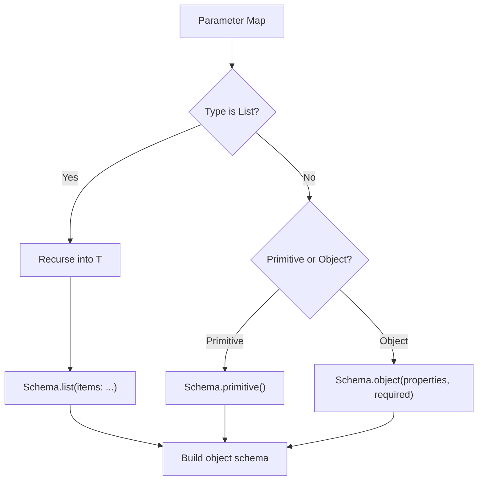
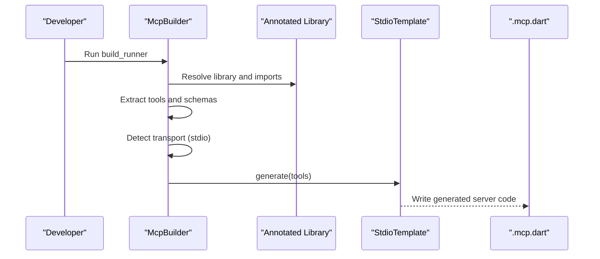
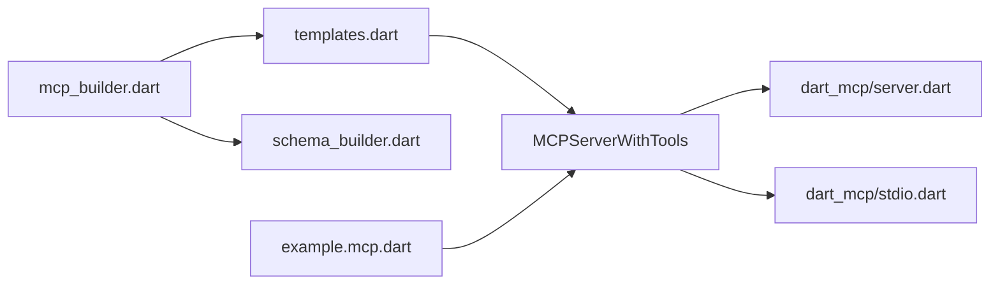

# STDIO Transport

<cite>
**Referenced Files in This Document**
- [README.md](file://README.md)
- [pubspec.yaml](file://pubspec.yaml)
- [packages/easy_mcp_annotations/lib/mcp_annotations.dart](file://packages/easy_mcp_annotations/lib/mcp_annotations.dart)
- [packages/easy_mcp_generator/lib/mcp_generator.dart](file://packages/easy_mcp_generator/lib/mcp_generator.dart)
- [packages/easy_mcp_generator/lib/builder/mcp_builder.dart](file://packages/easy_mcp_generator/lib/builder/mcp_builder.dart)
- [packages/easy_mcp_generator/lib/builder/templates.dart](file://packages/easy_mcp_generator/lib/builder/templates.dart)
- [packages/easy_mcp_generator/lib/builder/schema_builder.dart](file://packages/easy_mcp_generator/lib/builder/schema_builder.dart)
- [packages/easy_mcp_generator/lib/stubs.dart](file://packages/easy_mcp_generator/lib/stubs.dart)
- [example/bin/example.mcp.dart](file://example/bin/example.mcp.dart)
- [example/bin/example.dart](file://example/bin/example.dart)
</cite>

## Table of Contents
1. [Introduction](#introduction)
2. [Project Structure](#project-structure)
3. [Core Components](#core-components)
4. [Architecture Overview](#architecture-overview)
5. [Detailed Component Analysis](#detailed-component-analysis)
6. [Dependency Analysis](#dependency-analysis)
7. [Performance Considerations](#performance-considerations)
8. [Troubleshooting Guide](#troubleshooting-guide)
9. [Security Considerations](#security-considerations)
10. [Practical Examples](#practical-examples)
11. [Conclusion](#conclusion)

## Introduction
This document explains the STDIO transport implementation for Easy MCP’s terminal-based communication system. It covers how the JSON-RPC protocol is implemented for request/response handling, how stdin/stdout channels are managed, and how the generated server architecture composes a server with tool support. It also documents the template generation process, configuration options, error handling, logging strategies, and practical guidance for execution, debugging, performance, and security.

## Project Structure
The repository is a Dart workspace with two primary packages and an example:
- easy_mcp_annotations: Defines annotations for transport selection and tool metadata.
- easy_mcp_generator: A code generator that produces stdio or HTTP server code from annotated functions.
- example: Demonstrates usage and generated server output.

**Diagram sources**
- [pubspec.yaml:1-64](file://pubspec.yaml#L1-L64)
- [README.md:1-120](file://README.md#L1-L120)
- [packages/easy_mcp_annotations/lib/mcp_annotations.dart:1-107](file://packages/easy_mcp_annotations/lib/mcp_annotations.dart#L1-L107)
- [packages/easy_mcp_generator/lib/mcp_generator.dart:1-14](file://packages/easy_mcp_generator/lib/mcp_generator.dart#L1-L14)
- [packages/easy_mcp_generator/lib/builder/mcp_builder.dart:1-567](file://packages/easy_mcp_generator/lib/builder/mcp_builder.dart#L1-L567)
- [packages/easy_mcp_generator/lib/builder/templates.dart:1-578](file://packages/easy_mcp_generator/lib/builder/templates.dart#L1-L578)
- [packages/easy_mcp_generator/lib/builder/schema_builder.dart:1-99](file://packages/easy_mcp_generator/lib/builder/schema_builder.dart#L1-L99)
- [packages/easy_mcp_generator/lib/stubs.dart:1-7](file://packages/easy_mcp_generator/lib/stubs.dart#L1-L7)
- [example/bin/example.mcp.dart:1-490](file://example/bin/example.mcp.dart#L1-L490)
- [example/bin/example.dart:1-67](file://example/bin/example.dart#L1-L67)

**Section sources**
- [pubspec.yaml:1-64](file://pubspec.yaml#L1-L64)
- [README.md:1-120](file://README.md#L1-L120)

## Core Components
- Annotations define transport mode and tool metadata.
- The generator extracts tools from annotated libraries and imports, builds JSON schemas, and emits server code.
- The STDIO template produces a server that binds to stdin/stdout and exposes tools.

Key responsibilities:
- McpTransport enum selects stdio vs http.
- Tool annotation marks callable functions and describes them.
- McpBuilder scans libraries, aggregates tools, infers schemas, and chooses transport.
- StdioTemplate generates a server class that extends the base server with tool support and registers tools with JSON schemas.

**Section sources**
- [packages/easy_mcp_annotations/lib/mcp_annotations.dart:6-107](file://packages/easy_mcp_annotations/lib/mcp_annotations.dart#L6-L107)
- [packages/easy_mcp_generator/lib/builder/mcp_builder.dart:12-567](file://packages/easy_mcp_generator/lib/builder/mcp_builder.dart#L12-L567)
- [packages/easy_mcp_generator/lib/builder/templates.dart:6-175](file://packages/easy_mcp_generator/lib/builder/templates.dart#L6-L175)

## Architecture Overview
The STDIO transport architecture centers on a generated server that:
- Creates a stream channel backed by stdin and stdout.
- Instantiates a server class that mixes in tool support.
- Registers tools with JSON schemas derived from annotated functions.
- Handles tool invocations by extracting parameters, invoking target functions, and serializing results.

**Diagram sources**
- [packages/easy_mcp_generator/lib/builder/templates.dart:133-173](file://packages/easy_mcp_generator/lib/builder/templates.dart#L133-L173)

## Detailed Component Analysis

### STDIO Template Generation
The STDIO template composes:
- Imports for dart_mcp server and stdio channel.
- A main function that constructs the server with stdin/stdout.
- A base class that extends the core server with tool support, sets implementation metadata, and registers tools with inferred schemas.
- Per-tool handlers that extract arguments, convert complex List parameters, call the underlying function, and serialize results.

**Diagram sources**
- [packages/easy_mcp_generator/lib/builder/templates.dart:140-173](file://packages/easy_mcp_generator/lib/builder/templates.dart#L140-L173)

**Section sources**
- [packages/easy_mcp_generator/lib/builder/templates.dart:6-175](file://packages/easy_mcp_generator/lib/builder/templates.dart#L6-L175)

### Tool Registration and Parameter Extraction
- Tool metadata (name, description, parameters) is extracted from annotated functions and classes.
- Parameters are introspected to build JSON schemas and typed extractions.
- For List<T>, if T is a custom type, the template injects conversions using fromJson for each item.
- Generated handlers call the original function (static or instance) and wrap results in a standardized content structure.

**Diagram sources**
- [packages/easy_mcp_generator/lib/builder/templates.dart:45-117](file://packages/easy_mcp_generator/lib/builder/templates.dart#L45-L117)

**Section sources**
- [packages/easy_mcp_generator/lib/builder/templates.dart:45-117](file://packages/easy_mcp_generator/lib/builder/templates.dart#L45-L117)

### JSON Schema Generation
- The schema builder converts Dart types and introspected maps into dart_mcp Schema expressions.
- Object schemas include required fields computed from non-nullable parameters.
- The STDIO template uses these schemas when registering tools.

**Diagram sources**
- [packages/easy_mcp_generator/lib/builder/schema_builder.dart:29-97](file://packages/easy_mcp_generator/lib/builder/schema_builder.dart#L29-L97)

**Section sources**
- [packages/easy_mcp_generator/lib/builder/schema_builder.dart:1-99](file://packages/easy_mcp_generator/lib/builder/schema_builder.dart#L1-L99)

### Transport Selection and Build Pipeline
- The builder reads the @Mcp annotation to select transport (stdio or http).
- It aggregates tools from the annotated library and its package-local imports.
- It optionally writes JSON metadata describing tools and schemas.
- For stdio, it invokes the STDIO template; for http, it uses the HTTP template.

**Diagram sources**
- [packages/easy_mcp_generator/lib/builder/mcp_builder.dart:18-52](file://packages/easy_mcp_generator/lib/builder/mcp_builder.dart#L18-L52)
- [packages/easy_mcp_generator/lib/builder/templates.dart:6-175](file://packages/easy_mcp_generator/lib/builder/templates.dart#L6-L175)

**Section sources**
- [packages/easy_mcp_generator/lib/builder/mcp_builder.dart:12-567](file://packages/easy_mcp_generator/lib/builder/mcp_builder.dart#L12-L567)

## Dependency Analysis
- The generator depends on analyzer and source_gen to inspect Dart code and emit code.
- The generated server depends on dart_mcp for core server and stdio channel abstractions.
- The example demonstrates runtime usage of the generated server.

**Diagram sources**
- [packages/easy_mcp_generator/lib/builder/mcp_builder.dart:1-11](file://packages/easy_mcp_generator/lib/builder/mcp_builder.dart#L1-L11)
- [packages/easy_mcp_generator/lib/builder/templates.dart:127-128](file://packages/easy_mcp_generator/lib/builder/templates.dart#L127-L128)
- [example/bin/example.mcp.dart:8-11](file://example/bin/example.mcp.dart#L8-L11)

**Section sources**
- [packages/easy_mcp_generator/lib/builder/mcp_builder.dart:1-11](file://packages/easy_mcp_generator/lib/builder/mcp_builder.dart#L1-L11)
- [packages/easy_mcp_generator/lib/builder/templates.dart:127-128](file://packages/easy_mcp_generator/lib/builder/templates.dart#L127-L128)
- [example/bin/example.mcp.dart:8-11](file://example/bin/example.mcp.dart#L8-L11)

## Performance Considerations
- Minimize unnecessary conversions: only convert List<T> when T is a custom type requiring fromJson.
- Keep tool argument schemas minimal and precise to reduce parsing overhead.
- Avoid heavy synchronous work in tool handlers; prefer async operations and leverage futures.
- Use efficient serialization; the template already uses JSON encoding for lists and objects.
- Consider batching or caching for frequently accessed resources if applicable.

## Troubleshooting Guide
Common issues and remedies:
- No tools registered: Ensure functions are annotated with @tool and the library is annotated with @mcp.
- Incorrect parameter types: Verify parameter types and optionality; the generator derives schemas from types and nullability.
- Serialization errors: The template catches exceptions and returns error results; review logs and ensure returned objects have proper serialization or toString fallbacks.
- Transport mismatch: Confirm @mcp transport matches the generated server type (stdio vs http).

**Section sources**
- [packages/easy_mcp_generator/lib/builder/templates.dart:101-115](file://packages/easy_mcp_generator/lib/builder/templates.dart#L101-L115)

## Security Considerations
- Input validation: Treat all tool arguments as untrusted; validate and sanitize inputs before processing.
- Least privilege: Run the server with minimal privileges required by the tools.
- Logging: Avoid logging sensitive data; redact PII and secrets in logs.
- Transport isolation: STDIO servers run in-process; ensure stdin/stdout are not mixed with untrusted input streams.
- Error handling: Return generic error messages to clients while logging detailed errors internally.

## Practical Examples
- Running the generated STDIO server:
  - Build the project to generate the server code.
  - Execute the generated .mcp.dart file; it will bind to stdin/stdout and await JSON-RPC requests.
- Debugging:
  - Enable verbose logging in the underlying server library if available.
  - Temporarily add structured logging around tool handlers to trace request lifecycle.
  - Validate schemas and tool registrations by inspecting the generated code.
- Performance tuning:
  - Profile tool execution time and optimize slow operations.
  - Reduce object creation in hot paths; reuse serializers where safe.

**Section sources**
- [README.md:49-53](file://README.md#L49-L53)
- [example/bin/example.mcp.dart:133-138](file://example/bin/example.mcp.dart#L133-L138)

## Conclusion
The STDIO transport implementation in Easy MCP provides a concise, code-generated server that binds to stdin/stdout, registers tools with precise JSON schemas, and handles tool invocation with robust parameter extraction and result serialization. By leveraging the generator pipeline and the provided templates, developers can quickly produce secure, maintainable MCP servers tailored for terminal-based clients.