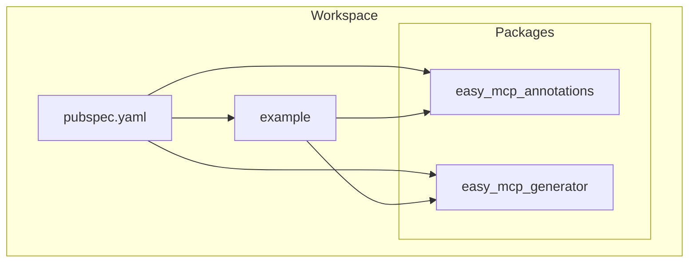
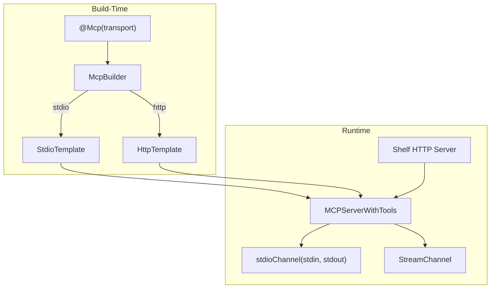
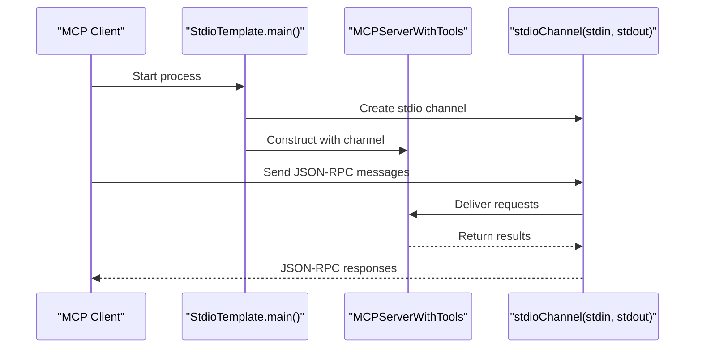
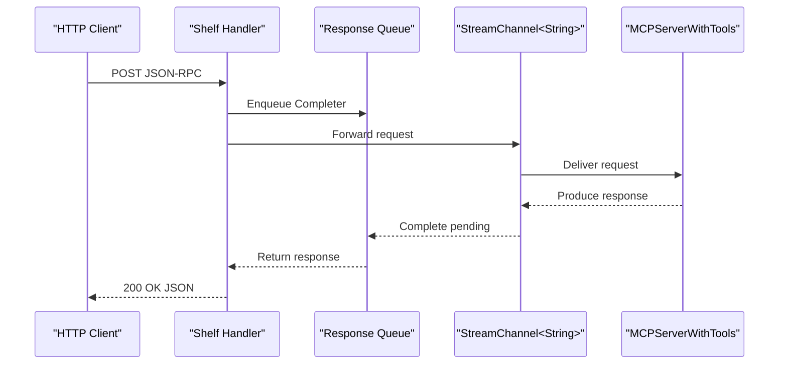
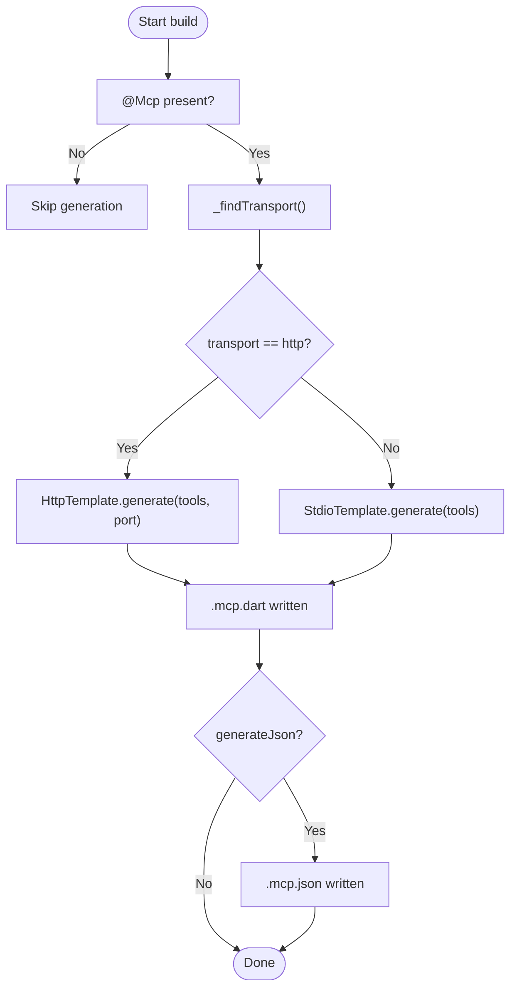
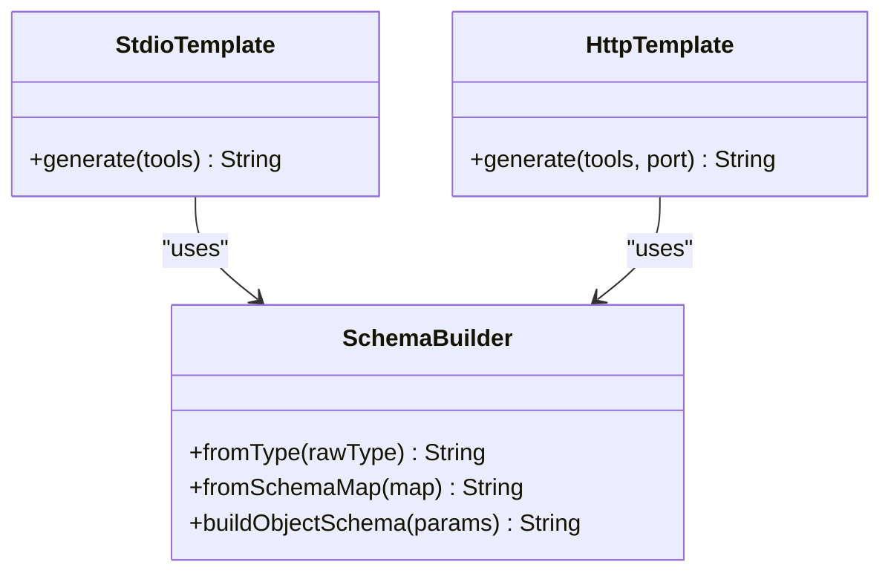
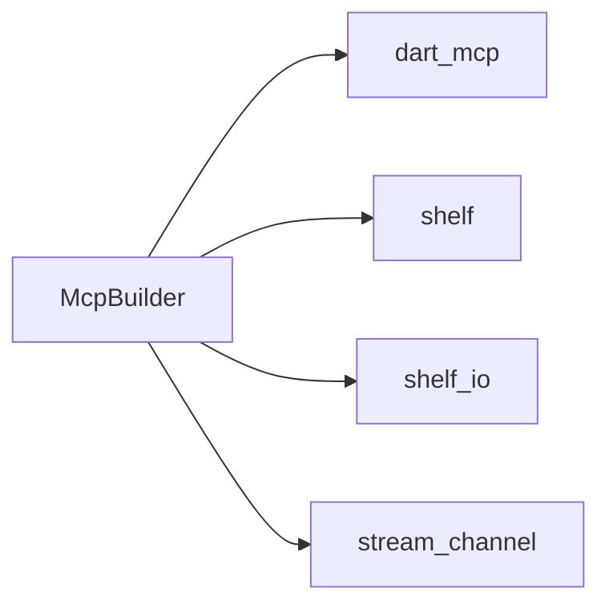

# Transport Implementations

<cite>
**Referenced Files in This Document**
- [README.md](file://README.md)
- [pubspec.yaml](file://pubspec.yaml)
- [packages/easy_mcp_annotations/lib/mcp_annotations.dart](file://packages/easy_mcp_annotations/lib/mcp_annotations.dart)
- [packages/easy_mcp_generator/lib/mcp_generator.dart](file://packages/easy_mcp_generator/lib/mcp_generator.dart)
- [packages/easy_mcp_generator/lib/builder/mcp_builder.dart](file://packages/easy_mcp_generator/lib/builder/mcp_builder.dart)
- [packages/easy_mcp_generator/lib/builder/templates.dart](file://packages/easy_mcp_generator/lib/builder/templates.dart)
- [packages/easy_mcp_generator/lib/builder/schema_builder.dart](file://packages/easy_mcp_generator/lib/builder/schema_builder.dart)
- [example/bin/example.dart](file://example/bin/example.dart)
- [example/bin/example.mcp.dart](file://example/bin/example.mcp.dart)
- [example/lib/src/user_store.dart](file://example/lib/src/user_store.dart)
- [example/lib/src/todo_store.dart](file://example/lib/src/todo_store.dart)
</cite>

## Table of Contents
1. [Introduction](#introduction)
2. [Project Structure](#project-structure)
3. [Core Components](#core-components)
4. [Architecture Overview](#architecture-overview)
5. [Detailed Component Analysis](#detailed-component-analysis)
6. [Dependency Analysis](#dependency-analysis)
7. [Performance Considerations](#performance-considerations)
8. [Troubleshooting Guide](#troubleshooting-guide)
9. [Conclusion](#conclusion)
10. [Appendices](#appendices)

## Introduction
This document explains Easy MCP’s dual transport mode system: stdio (JSON-RPC over stdin/stdout) and HTTP (Shelf-based). It covers how the code generator selects a transport, how each transport is implemented, and how to configure, secure, monitor, and switch transports between development and production. It also documents the template system that generates transport-specific code and outlines how to implement custom transports.

## Project Structure
The repository is a Dart workspace with two core packages and an example:
- easy_mcp_annotations: Defines annotations and enums used to mark code for MCP generation.
- easy_mcp_generator: A build_runner generator that emits transport-specific server code and optional JSON metadata.
- example: Demonstrates usage of both transports and generated server code.

**Section sources**
- [pubspec.yaml:1-64](file://pubspec.yaml#L1-L64)

## Core Components
- McpTransport enum: Selects stdio or http transport.
- @Mcp annotation: Declares the transport for a library and optionally enables JSON metadata generation.
- @Tool annotation: Marks functions as MCP tools with optional description and icons.
- McpBuilder: The build_runner builder that scans libraries, extracts tools, determines transport, and generates server code via templates.
- Templates: Transport-specific generators for stdio and HTTP.

Key behaviors:
- Transport selection is derived from the @Mcp annotation on the library.
- The generator writes a .mcp.dart file containing a ready-to-run server and optionally a .mcp.json metadata file.

**Section sources**
- [packages/easy_mcp_annotations/lib/mcp_annotations.dart:6-30](file://packages/easy_mcp_annotations/lib/mcp_annotations.dart#L6-L30)
- [packages/easy_mcp_generator/lib/mcp_generator.dart:1-14](file://packages/easy_mcp_generator/lib/mcp_generator.dart#L1-L14)
- [packages/easy_mcp_generator/lib/builder/mcp_builder.dart:12-567](file://packages/easy_mcp_generator/lib/builder/mcp_builder.dart#L12-L567)

## Architecture Overview
The generator orchestrates transport selection and code generation. The selected template emits a server that:
- stdio: Uses stdin/stdout channels with a JSON-RPC transport.
- HTTP: Runs a Shelf HTTP server and bridges HTTP requests to the MCP server via a StreamChannel.

**Diagram sources**
- [packages/easy_mcp_generator/lib/builder/mcp_builder.dart:36-42](file://packages/easy_mcp_generator/lib/builder/mcp_builder.dart#L36-L42)
- [packages/easy_mcp_generator/lib/builder/templates.dart:6-175](file://packages/easy_mcp_generator/lib/builder/templates.dart#L6-L175)
- [packages/easy_mcp_generator/lib/builder/templates.dart:269-486](file://packages/easy_mcp_generator/lib/builder/templates.dart#L269-L486)

**Section sources**
- [packages/easy_mcp_generator/lib/builder/mcp_builder.dart:36-52](file://packages/easy_mcp_generator/lib/builder/mcp_builder.dart#L36-L52)
- [packages/easy_mcp_generator/lib/builder/templates.dart:6-175](file://packages/easy_mcp_generator/lib/builder/templates.dart#L6-L175)
- [packages/easy_mcp_generator/lib/builder/templates.dart:269-486](file://packages/easy_mcp_generator/lib/builder/templates.dart#L269-L486)

## Detailed Component Analysis

### Stdio Transport Implementation
The stdio transport runs an MCP server over stdin/stdout using a JSON-RPC channel. The template:
- Imports the stdio channel from dart_mcp.
- Creates a server instance wired to stdin/stdout.
- Registers tools and serializes results to JSON.

**Diagram sources**
- [packages/easy_mcp_generator/lib/builder/templates.dart:123-174](file://packages/easy_mcp_generator/lib/builder/templates.dart#L123-L174)

Key implementation notes:
- The server is constructed with a stdio channel and registers tools with input schemas.
- Results are serialized to JSON for transport.

**Section sources**
- [packages/easy_mcp_generator/lib/builder/templates.dart:6-175](file://packages/easy_mcp_generator/lib/builder/templates.dart#L6-L175)

### HTTP Transport Implementation
The HTTP transport uses Shelf to serve an HTTP endpoint and bridges requests to the MCP server via a StreamChannel. The template:
- Creates StreamControllers for bidirectional communication.
- Wraps them in a StreamChannel compatible with MCPServer.
- Serves HTTP on loopback with a fixed port and forwards POST requests to the MCP server.
- Serializes responses as JSON.

**Diagram sources**
- [packages/easy_mcp_generator/lib/builder/templates.dart:398-486](file://packages/easy_mcp_generator/lib/builder/templates.dart#L398-L486)

Key implementation notes:
- The handler accepts only POST requests and returns JSON.
- The server waits until completion to clean up resources.

**Section sources**
- [packages/easy_mcp_generator/lib/builder/templates.dart:269-486](file://packages/easy_mcp_generator/lib/builder/templates.dart#L269-L486)

### Transport Selection and Generation Flow
The generator determines transport from the @Mcp annotation and emits the appropriate template.

**Diagram sources**
- [packages/easy_mcp_generator/lib/builder/mcp_builder.dart:18-52](file://packages/easy_mcp_generator/lib/builder/mcp_builder.dart#L18-L52)
- [packages/easy_mcp_generator/lib/builder/mcp_builder.dart:516-563](file://packages/easy_mcp_generator/lib/builder/mcp_builder.dart#L516-L563)

**Section sources**
- [packages/easy_mcp_generator/lib/builder/mcp_builder.dart:18-52](file://packages/easy_mcp_generator/lib/builder/mcp_builder.dart#L18-L52)
- [packages/easy_mcp_generator/lib/builder/mcp_builder.dart:516-563](file://packages/easy_mcp_generator/lib/builder/mcp_builder.dart#L516-L563)

### Tool Registration and Schema Generation
Both templates register tools and serialize results. The generator builds JSON Schemas from Dart types and parameters.

**Diagram sources**
- [packages/easy_mcp_generator/lib/builder/schema_builder.dart:1-99](file://packages/easy_mcp_generator/lib/builder/schema_builder.dart#L1-L99)
- [packages/easy_mcp_generator/lib/builder/templates.dart:6-175](file://packages/easy_mcp_generator/lib/builder/templates.dart#L6-L175)
- [packages/easy_mcp_generator/lib/builder/templates.dart:269-486](file://packages/easy_mcp_generator/lib/builder/templates.dart#L269-L486)

**Section sources**
- [packages/easy_mcp_generator/lib/builder/schema_builder.dart:1-99](file://packages/easy_mcp_generator/lib/builder/schema_builder.dart#L1-L99)
- [packages/easy_mcp_generator/lib/builder/templates.dart:6-175](file://packages/easy_mcp_generator/lib/builder/templates.dart#L6-L175)
- [packages/easy_mcp_generator/lib/builder/templates.dart:269-486](file://packages/easy_mcp_generator/lib/builder/templates.dart#L269-L486)

### Example Usage and Generated Artifacts
The example demonstrates:
- Using @Mcp(transport: McpTransport.http) to select HTTP transport.
- Running the generated server and seeding data.
- The generated .mcp.dart file shows the HTTP server wiring and tool registrations.

Practical example references:
- Transport selection: [example/bin/example.dart:6](file://example/bin/example.dart#L6)
- Generated HTTP server: [example/bin/example.mcp.dart:17-68](file://example/bin/example.mcp.dart#L17-L68)
- Tool registrations and handlers: [example/bin/example.mcp.dart:70-490](file://example/bin/example.mcp.dart#L70-L490)
- Tool definitions in stores: [example/lib/src/user_store.dart:55-142](file://example/lib/src/user_store.dart#L55-L142), [example/lib/src/todo_store.dart:69-235](file://example/lib/src/todo_store.dart#L69-L235)

**Section sources**
- [example/bin/example.dart:6](file://example/bin/example.dart#L6)
- [example/bin/example.mcp.dart:17-68](file://example/bin/example.mcp.dart#L17-L68)
- [example/bin/example.mcp.dart:70-490](file://example/bin/example.mcp.dart#L70-L490)
- [example/lib/src/user_store.dart:55-142](file://example/lib/src/user_store.dart#L55-L142)
- [example/lib/src/todo_store.dart:69-235](file://example/lib/src/todo_store.dart#L69-L235)

## Dependency Analysis
The generator depends on:
- dart_mcp for server and stdio channel support.
- shelf and shelf_io for HTTP transport.
- stream_channel for bidirectional bridging in HTTP mode.

**Diagram sources**
- [packages/easy_mcp_generator/lib/builder/templates.dart:8-11](file://packages/easy_mcp_generator/lib/builder/templates.dart#L8-L11)
- [packages/easy_mcp_generator/lib/builder/templates.dart:390-394](file://packages/easy_mcp_generator/lib/builder/templates.dart#L390-L394)

**Section sources**
- [packages/easy_mcp_generator/lib/builder/templates.dart:8-11](file://packages/easy_mcp_generator/lib/builder/templates.dart#L8-L11)
- [packages/easy_mcp_generator/lib/builder/templates.dart:390-394](file://packages/easy_mcp_generator/lib/builder/templates.dart#L390-L394)

## Performance Considerations
- Stdio transport:
  - Lower overhead, minimal latency for local processes.
  - Suitable for tight integration with clients that can spawn processes.
- HTTP transport:
  - Adds network stack overhead but supports external clients and reverse proxies.
  - Loopback binding reduces exposure; consider firewalling and TLS termination at a proxy for production.
- Streaming:
  - The HTTP template uses a StreamChannel and a response queue to synchronize request/response pairs.
  - For high-throughput scenarios, consider connection pooling, keep-alive tuning, and load balancing behind a reverse proxy.

[No sources needed since this section provides general guidance]

## Troubleshooting Guide
Common issues and remedies:
- Transport mismatch:
  - Ensure @Mcp(transport: ...) matches the generated .mcp.dart expectations.
- HTTP server binding:
  - The example binds to loopback; adjust address/port for production deployments.
- JSON serialization errors:
  - Verify tool return types and ensure they can be serialized to JSON.
- Schema mismatches:
  - Confirm parameter types and optionality match the generated input schemas.

**Section sources**
- [packages/easy_mcp_generator/lib/builder/templates.dart:419-434](file://packages/easy_mcp_generator/lib/builder/templates.dart#L419-L434)
- [packages/easy_mcp_generator/lib/builder/templates.dart:465-483](file://packages/easy_mcp_generator/lib/builder/templates.dart#L465-L483)

## Conclusion
Easy MCP’s dual transport system lets you choose between a lightweight stdio mode and a flexible HTTP mode. The generator selects the transport via annotations, emits a ready-to-run server, and ensures consistent tool registration and schema generation. For development, stdio is convenient; for production, prefer HTTP behind a reverse proxy with TLS and robust monitoring.

[No sources needed since this section summarizes without analyzing specific files]

## Appendices

### Transport Comparison and Selection Criteria
- Stdio:
  - Best for: CLI tools, local integrations, minimal overhead.
  - Deployment: Spawn as a child process; manage lifecycle externally.
- HTTP:
  - Best for: Web clients, reverse-proxy environments, observability.
  - Deployment: Bind to loopback or internal interface; terminate TLS at a proxy; scale horizontally behind load balancers.

[No sources needed since this section provides general guidance]

### Transport-Specific Configuration Options
- Stdio:
  - No explicit port or address; relies on stdin/stdout.
- HTTP:
  - Port is embedded in the generated code; adjust during generation or post-generation.
  - Binding address is loopback in the example; modify for broader access.

**Section sources**
- [packages/easy_mcp_generator/lib/builder/templates.dart:436-440](file://packages/easy_mcp_generator/lib/builder/templates.dart#L436-L440)
- [example/bin/example.mcp.dart:55-59](file://example/bin/example.mcp.dart#L55-L59)

### Security Implications
- Stdio:
  - Least exposed; ensure process isolation and least-privilege execution.
- HTTP:
  - Prefer loopback binding in development; bind to internal interfaces in production.
  - Terminate TLS at a reverse proxy; enforce rate limiting and request size limits.
  - Validate and sanitize inputs; avoid exposing administrative endpoints.

[No sources needed since this section provides general guidance]

### Monitoring Approaches
- Stdio:
  - Monitor process health via OS-level metrics; log stderr/stdout streams.
- HTTP:
  - Enable access logs and structured logging.
  - Track request latency, error rates, and throughput.
  - Use health checks and readiness probes behind a load balancer.

[No sources needed since this section provides general guidance]

### Transport Switching Strategy
- Development:
  - Use stdio for fast iteration and local testing.
- Production:
  - Switch to HTTP behind a reverse proxy for scalability and operational control.
  - Keep @Mcp consistent with the chosen transport; regenerate code after changing transport.

**Section sources**
- [packages/easy_mcp_annotations/lib/mcp_annotations.dart:25-30](file://packages/easy_mcp_annotations/lib/mcp_annotations.dart#L25-L30)
- [packages/easy_mcp_generator/lib/builder/mcp_builder.dart:36-42](file://packages/easy_mcp_generator/lib/builder/mcp_builder.dart#L36-L42)

### Template System and Custom Transports
- Template system:
  - StdioTemplate and HttpTemplate generate transport-specific code.
  - Both rely on SchemaBuilder for input schemas and MCPServerWithTools for tool registration.
- Custom transports:
  - Extend the generator by adding a new template class similar to StdioTemplate/HttpTemplate.
  - Implement a new transport enum value and wire it in McpBuilder to select the new template.
  - Ensure the new transport supports the StreamChannel contract used by MCPServer.

**Section sources**
- [packages/easy_mcp_generator/lib/builder/templates.dart:6-175](file://packages/easy_mcp_generator/lib/builder/templates.dart#L6-L175)
- [packages/easy_mcp_generator/lib/builder/templates.dart:269-486](file://packages/easy_mcp_generator/lib/builder/templates.dart#L269-L486)
- [packages/easy_mcp_generator/lib/builder/mcp_builder.dart:36-42](file://packages/easy_mcp_generator/lib/builder/mcp_builder.dart#L36-L42)