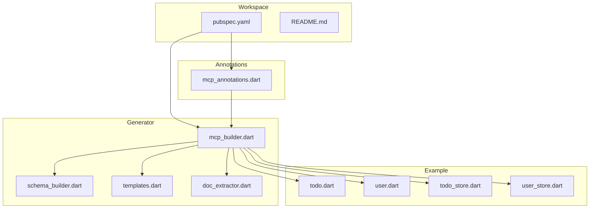
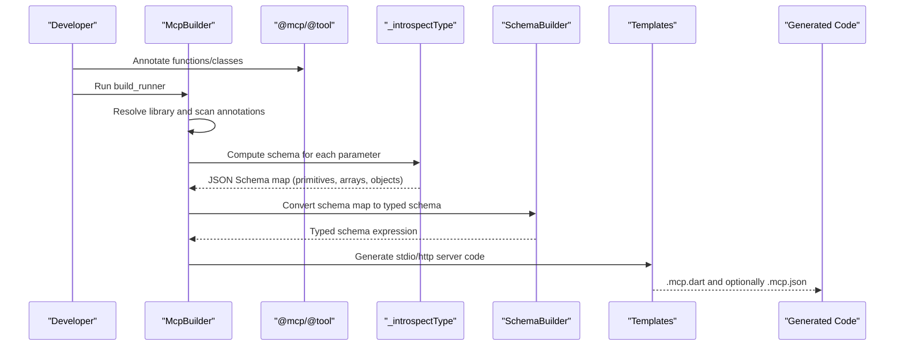
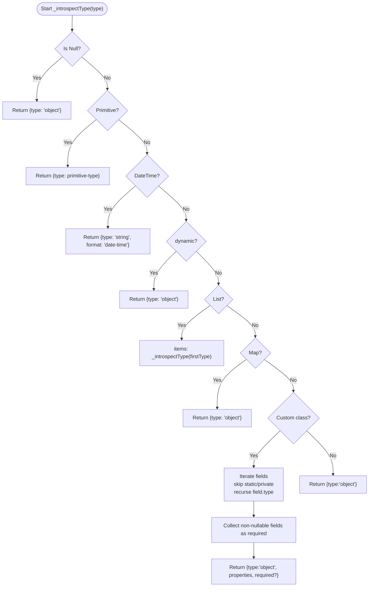
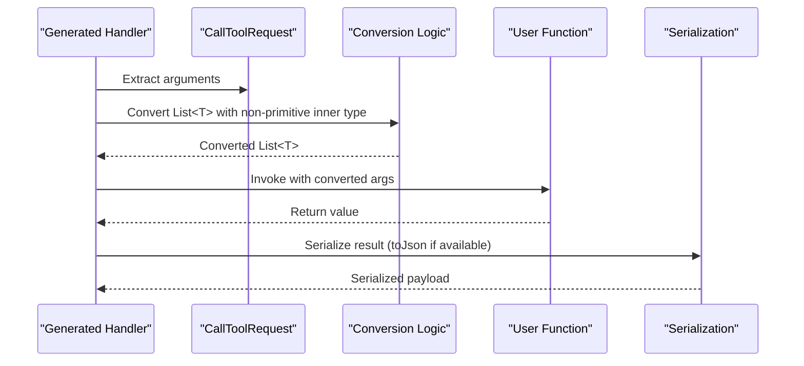
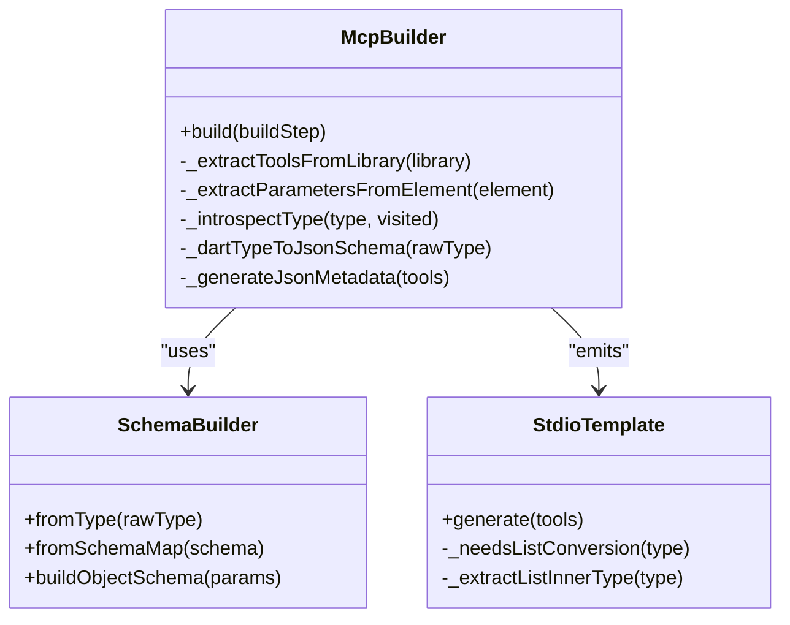
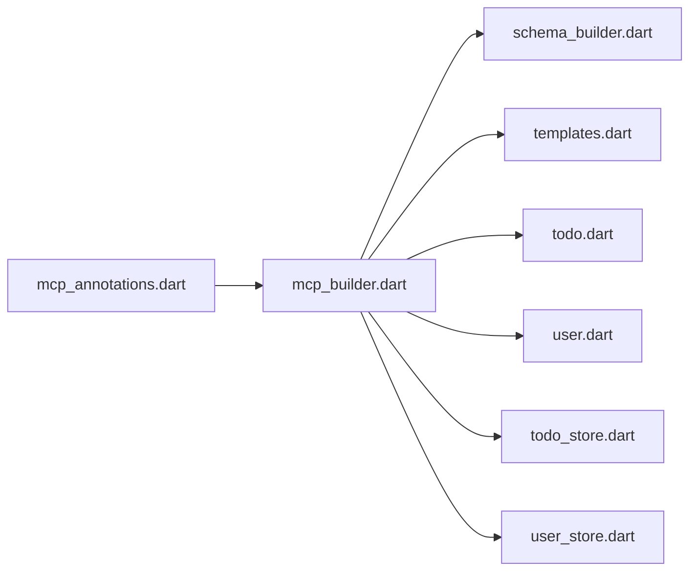

# Complex Type Support

<cite>
**Referenced Files in This Document**
- [README.md](file://README.md)
- [pubspec.yaml](file://pubspec.yaml)
- [mcp_annotations.dart](file://packages/easy_mcp_annotations/lib/mcp_annotations.dart)
- [mcp_builder.dart](file://packages/easy_mcp_generator/lib/builder/mcp_builder.dart)
- [schema_builder.dart](file://packages/easy_mcp_generator/lib/builder/schema_builder.dart)
- [templates.dart](file://packages/easy_mcp_generator/lib/builder/templates.dart)
- [doc_extractor.dart](file://packages/easy_mcp_generator/lib/builder/doc_extractor.dart)
- [todo.dart](file://example/lib/src/todo.dart)
- [user.dart](file://example/lib/src/user.dart)
- [todo_store.dart](file://example/lib/src/todo_store.dart)
- [user_store.dart](file://example/lib/src/user_store.dart)
- [schema_builder_test.dart](file://packages/easy_mcp_generator/test/schema_builder_test.dart)
</cite>

## Table of Contents
1. [Introduction](#introduction)
2. [Project Structure](#project-structure)
3. [Core Components](#core-components)
4. [Architecture Overview](#architecture-overview)
5. [Detailed Component Analysis](#detailed-component-analysis)
6. [Dependency Analysis](#dependency-analysis)
7. [Performance Considerations](#performance-considerations)
8. [Troubleshooting Guide](#troubleshooting-guide)
9. [Conclusion](#conclusion)

## Introduction
This document explains how Easy MCP integrates complex Dart types into the Model Context Protocol (MCP) tooling pipeline. It focuses on:
- Generic type handling for collections like List<T>
- Recursive processing of item types
- Custom class serialization and object schema generation
- Nested object structures and property mapping
- Collection support beyond lists (maps and other iterables)
- Examples such as List<User>, Map<String, Todo>, and nested hierarchies
- Type introspection mechanisms that extract JSON Schema information from Dart types
- The relationship between type information and JSON Schema generation for validation
- Limitations and unsupported type combinations with recommended workarounds
- Integration with the AST analysis phase and its impact on code generation and runtime behavior

## Project Structure
The repository is a Dart workspace with two primary packages and an example application:
- easy_mcp_annotations: Defines annotations like @mcp and @tool
- easy_mcp_generator: Build-runner generator that produces MCP server code and optional JSON metadata
- example: Demonstrates usage with annotated tools and custom classes

**Diagram sources**
- [pubspec.yaml:1-64](file://pubspec.yaml#L1-L64)
- [mcp_annotations.dart:1-107](file://packages/easy_mcp_annotations/lib/mcp_annotations.dart#L1-L107)
- [mcp_builder.dart:1-567](file://packages/easy_mcp_generator/lib/builder/mcp_builder.dart#L1-L567)
- [schema_builder.dart:1-99](file://packages/easy_mcp_generator/lib/builder/schema_builder.dart#L1-L99)
- [templates.dart:1-578](file://packages/easy_mcp_generator/lib/builder/templates.dart#L1-L578)
- [doc_extractor.dart:1-106](file://packages/easy_mcp_generator/lib/builder/doc_extractor.dart#L1-L106)
- [todo.dart:1-46](file://example/lib/src/todo.dart#L1-L46)
- [user.dart:1-42](file://example/lib/src/user.dart#L1-L42)
- [todo_store.dart:1-236](file://example/lib/src/todo_store.dart#L1-L236)
- [user_store.dart:1-144](file://example/lib/src/user_store.dart#L1-L144)

**Section sources**
- [README.md:1-120](file://README.md#L1-L120)
- [pubspec.yaml:1-64](file://pubspec.yaml#L1-L64)

## Core Components
- Type introspection and JSON Schema generation: The builder inspects Dart types and produces JSON Schema maps for parameters and return values. It supports primitives, lists, maps, and custom classes with cycle detection.
- Schema builder: Converts JSON Schema maps into typed schema expressions for code generation.
- Templates: Generate stdio and HTTP server code, including parameter extraction, conversions for complex types, and result serialization.
- Annotations: @mcp and @tool drive the generator and define transport and metadata.

Key responsibilities:
- Extract parameters from annotated functions and compute their schemas
- Detect custom class types and recurse into their fields
- Detect List<T> and map inner types to generate conversions and imports
- Produce both Dart code and optional JSON metadata for MCP tool discovery

**Section sources**
- [mcp_builder.dart:228-411](file://packages/easy_mcp_generator/lib/builder/mcp_builder.dart#L228-L411)
- [schema_builder.dart:1-99](file://packages/easy_mcp_generator/lib/builder/schema_builder.dart#L1-L99)
- [templates.dart:528-577](file://packages/easy_mcp_generator/lib/builder/templates.dart#L528-L577)

## Architecture Overview
The generator performs AST-based analysis of annotated libraries, computes schemas, and emits server code and optional JSON metadata.

**Diagram sources**
- [mcp_builder.dart:18-52](file://packages/easy_mcp_generator/lib/builder/mcp_builder.dart#L18-L52)
- [mcp_builder.dart:307-411](file://packages/easy_mcp_generator/lib/builder/mcp_builder.dart#L307-L411)
- [schema_builder.dart:29-98](file://packages/easy_mcp_generator/lib/builder/schema_builder.dart#L29-L98)
- [templates.dart:6-175](file://packages/easy_mcp_generator/lib/builder/templates.dart#L6-L175)

## Detailed Component Analysis

### Type Introspection and JSON Schema Generation
The introspector traverses Dart types and builds a JSON Schema map:
- Primitives: int, double/num, String, bool
- Nullable types: unwrapped for schema generation
- DateTime: treated as string with date-time format
- List<T>: array with recursive items schema
- Map<K, V>: object (no generic key/value typing in schema)
- Custom classes: object with properties derived from public, non-static, non-private fields; required fields inferred from non-nullable types
- Cycle detection: prevents infinite recursion on self-referential or mutually referencing types

**Diagram sources**
- [mcp_builder.dart:307-411](file://packages/easy_mcp_generator/lib/builder/mcp_builder.dart#L307-L411)

**Section sources**
- [mcp_builder.dart:307-411](file://packages/easy_mcp_generator/lib/builder/mcp_builder.dart#L307-L411)

### Schema Builder: From JSON Schema to Typed Expressions
The schema builder converts JSON Schema maps into typed schema expressions used by the generated code:
- Primitive types map to Schema.string(), Schema.int(), Schema.number(), Schema.bool()
- Arrays map to Schema.list(items: ...)
- Objects map to Schema.object(properties: {...}, required: [...])

It also builds composite object schemas from parameter metadata, including required fields derived from optionality.

**Section sources**
- [schema_builder.dart:29-98](file://packages/easy_mcp_generator/lib/builder/schema_builder.dart#L29-L98)

### Templates: Code Generation for Complex Types
The templates generate server code that:
- Imports custom classes when List<T> has non-primitive inner types
- Extracts parameters from request arguments with proper Dart types
- Converts List<T> parameters with non-primitive inner types using innerType.fromJson(...)
- Serializes results, invoking toJson() when available

**Diagram sources**
- [templates.dart:65-117](file://packages/easy_mcp_generator/lib/builder/templates.dart#L65-L117)
- [templates.dart:328-381](file://packages/easy_mcp_generator/lib/builder/templates.dart#L328-L381)

**Section sources**
- [templates.dart:528-577](file://packages/easy_mcp_generator/lib/builder/templates.dart#L528-L577)
- [templates.dart:65-117](file://packages/easy_mcp_generator/lib/builder/templates.dart#L65-L117)

### Example Classes and Their Role in Complex Types
The example classes demonstrate:
- Custom classes with primitive and collection fields
- toJson()/fromJson() patterns enabling serialization and deserialization
- Nested relationships (e.g., Todo.userIds and User.todoIds)

These classes serve as inner types for List<T> parameters and inform schema generation and runtime conversions.

**Section sources**
- [todo.dart:1-46](file://example/lib/src/todo.dart#L1-L46)
- [user.dart:1-42](file://example/lib/src/user.dart#L1-L42)

### Complex Type Scenarios and Behavior
- List<User>: The introspector recognizes List<T> and recurses into User fields. The template imports User and generates conversion using User.fromJson(...) for each element.
- Map<String, Todo>: Maps are treated as generic objects in the schema. There is no generic key/value typing; the schema reflects an object without strict key constraints.
- Nested object hierarchies: The introspector recurses into custom class fields, collecting properties and required fields. Cycle detection ensures safe traversal.

**Section sources**
- [mcp_builder.dart:342-357](file://packages/easy_mcp_generator/lib/builder/mcp_builder.dart#L342-L357)
- [mcp_builder.dart:360-407](file://packages/easy_mcp_generator/lib/builder/mcp_builder.dart#L360-L407)
- [templates.dart:528-577](file://packages/easy_mcp_generator/lib/builder/templates.dart#L528-L577)

### Integration with AST Analysis Phase
The generator:
- Resolves libraries and scans for @mcp and @tool annotations
- Extracts function/method signatures and computes parameter schemas
- Produces JSON metadata when requested, embedding input schemas for tools
- Emits both Dart code and optional JSON metadata for MCP tool discovery

**Diagram sources**
- [mcp_builder.dart:12-567](file://packages/easy_mcp_generator/lib/builder/mcp_builder.dart#L12-L567)
- [schema_builder.dart:1-99](file://packages/easy_mcp_generator/lib/builder/schema_builder.dart#L1-L99)
- [templates.dart:1-578](file://packages/easy_mcp_generator/lib/builder/templates.dart#L1-L578)

**Section sources**
- [mcp_builder.dart:18-52](file://packages/easy_mcp_generator/lib/builder/mcp_builder.dart#L18-L52)
- [mcp_builder.dart:228-259](file://packages/easy_mcp_generator/lib/builder/mcp_builder.dart#L228-L259)
- [mcp_builder.dart:442-468](file://packages/easy_mcp_generator/lib/builder/mcp_builder.dart#L442-L468)

## Dependency Analysis
- Annotations package defines @mcp and @tool used by the generator
- Generator depends on analyzer APIs for AST traversal and type introspection
- Schema builder and templates consume introspected schemas
- Example classes are consumed by the generator during analysis

**Diagram sources**
- [mcp_annotations.dart:1-107](file://packages/easy_mcp_annotations/lib/mcp_annotations.dart#L1-L107)
- [mcp_builder.dart:1-567](file://packages/easy_mcp_generator/lib/builder/mcp_builder.dart#L1-L567)
- [schema_builder.dart:1-99](file://packages/easy_mcp_generator/lib/builder/schema_builder.dart#L1-L99)
- [templates.dart:1-578](file://packages/easy_mcp_generator/lib/builder/templates.dart#L1-L578)
- [todo.dart:1-46](file://example/lib/src/todo.dart#L1-L46)
- [user.dart:1-42](file://example/lib/src/user.dart#L1-L42)
- [todo_store.dart:1-236](file://example/lib/src/todo_store.dart#L1-L236)
- [user_store.dart:1-144](file://example/lib/src/user_store.dart#L1-L144)

**Section sources**
- [pubspec.yaml:9-11](file://pubspec.yaml#L9-L11)

## Performance Considerations
- AST traversal and type introspection scale with the number of annotated tools and depth of nested types. Keep DTOs reasonably shallow to minimize recursion overhead.
- Schema generation is O(N) in the number of fields per class plus edges across references.
- Serialization uses reflection-like checks (presence of toJson). Prefer lightweight toJson implementations in frequently serialized classes.
- Import collection for List<T> inner types avoids redundant imports but still adds imports for each unique inner custom type.

## Troubleshooting Guide
Common issues and resolutions:
- Unexpected schema for Map<K, V>: Maps are represented as generic objects without key/value typing. If strict key constraints are required, model them as List entries or use separate tools.
- Missing imports for List<T> inner types: Ensure the inner custom class is imported in the annotated library so the generator can collect its URI.
- Non-nullable fields not appearing as required: Verify that fields are not marked nullable and have no default values; the introspector marks non-nullable fields as required.
- Runtime conversion errors for List<T>: Confirm the inner type has a compatible constructor or factory from Map<String, dynamic>.
- JSON metadata missing: Enable the generateJson flag on @mcp and rebuild.

**Section sources**
- [mcp_builder.dart:442-468](file://packages/easy_mcp_generator/lib/builder/mcp_builder.dart#L442-L468)
- [templates.dart:528-577](file://packages/easy_mcp_generator/lib/builder/templates.dart#L528-L577)

## Conclusion
Easy MCP’s type system integration leverages AST-based introspection to derive JSON Schema from Dart types, supporting:
- Generic collections via List<T> with recursive item processing
- Custom classes with property mapping and required-field inference
- Nested object structures with cycle detection
- Practical code generation that imports and converts non-primitive inner types
- Optional JSON metadata for tool discovery

Limitations include generic Map<K, V> representation as generic objects and lack of advanced generic constraints in schema. For complex validation rules, model constraints explicitly in tools or use separate validation steps outside the generator.