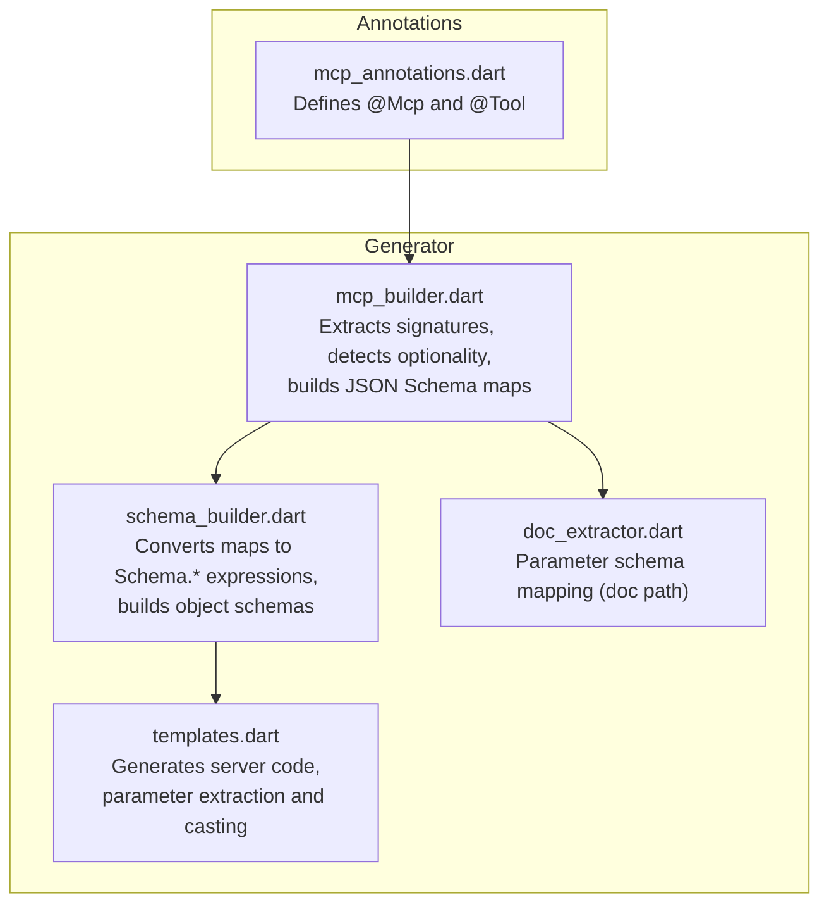
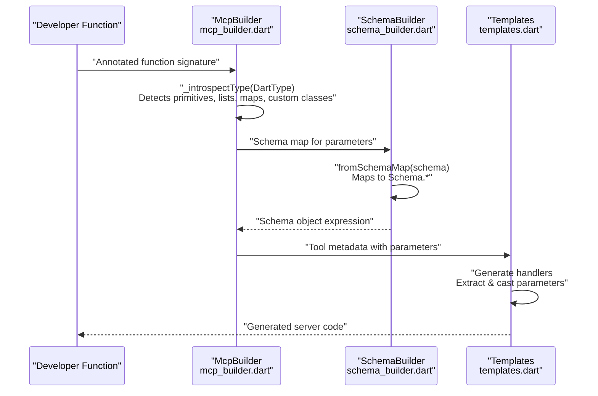
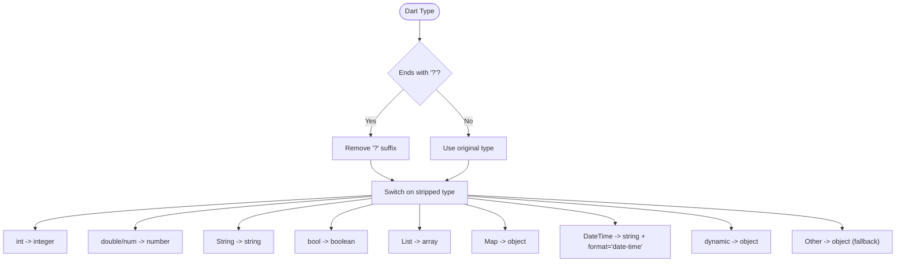
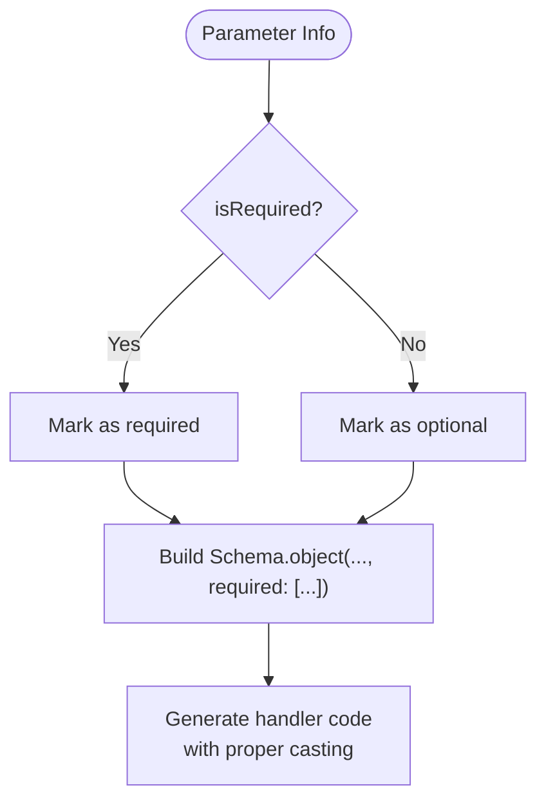
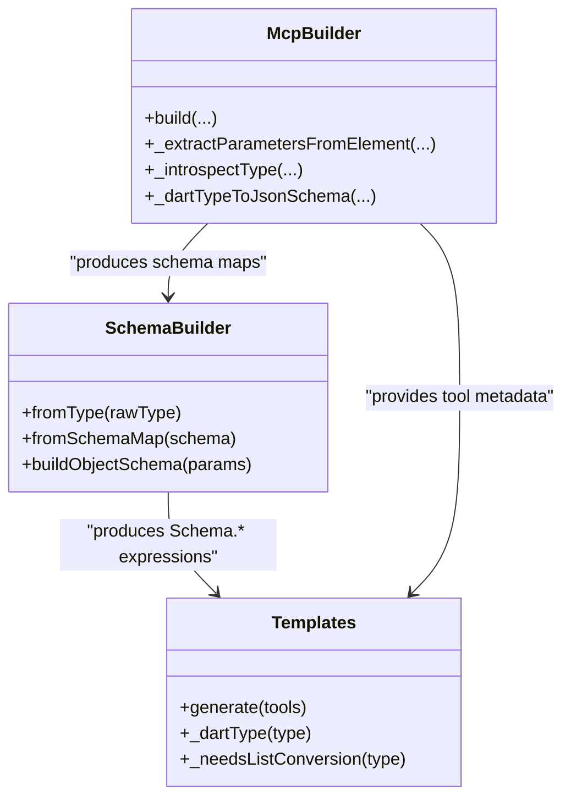
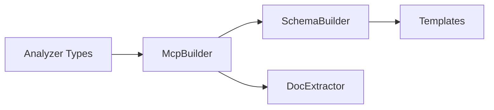

# Primitive Type Handling

<cite>
**Referenced Files in This Document**
- [mcp_annotations.dart](file://packages/easy_mcp_annotations/lib/mcp_annotations.dart)
- [mcp_builder.dart](file://packages/easy_mcp_generator/lib/builder/mcp_builder.dart)
- [schema_builder.dart](file://packages/easy_mcp_generator/lib/builder/schema_builder.dart)
- [templates.dart](file://packages/easy_mcp_generator/lib/builder/templates.dart)
- [doc_extractor.dart](file://packages/easy_mcp_generator/lib/builder/doc_extractor.dart)
- [schema_builder_test.dart](file://packages/easy_mcp_generator/test/schema_builder_test.dart)
</cite>

## Table of Contents
1. [Introduction](#introduction)
2. [Project Structure](#project-structure)
3. [Core Components](#core-components)
4. [Architecture Overview](#architecture-overview)
5. [Detailed Component Analysis](#detailed-component-analysis)
6. [Dependency Analysis](#dependency-analysis)
7. [Performance Considerations](#performance-considerations)
8. [Troubleshooting Guide](#troubleshooting-guide)
9. [Conclusion](#conclusion)

## Introduction
This document explains how Easy MCP maps Dart primitive types to JSON Schema validation rules and integrates them into the broader schema-building pipeline. It covers:
- Automatic mapping from Dart primitives (String, int, double, bool) to JSON Schema types
- Null safety via optional type detection and the '?' suffix handling
- Optional parameter support and how the system distinguishes required vs optional parameters
- Examples of type conversion logic for String? vs String
- Fallback behavior for unsupported primitive types and default schema generation
- Integration with server code generation and runtime validation

## Project Structure
The primitive type handling spans two packages:
- easy_mcp_annotations: Defines annotations used to mark functions as MCP tools
- easy_mcp_generator: Contains the build-time generator that converts annotated functions into MCP servers, including schema generation and code templating

Key files involved in primitive type handling:
- mcp_builder.dart: Extracts function signatures, detects optionality, and builds JSON Schema maps
- schema_builder.dart: Converts schema maps to dart_mcp Schema.* expressions and constructs object schemas
- templates.dart: Generates server code, including parameter extraction and type casting
- doc_extractor.dart: Provides a secondary path for parameter schema mapping (used in documentation extraction)
- schema_builder_test.dart: Validates schema builder behavior for primitives

**Diagram sources**
- [mcp_annotations.dart](file://packages/easy_mcp_annotations/lib/mcp_annotations.dart)
- [mcp_builder.dart](file://packages/easy_mcp_generator/lib/builder/mcp_builder.dart)
- [schema_builder.dart](file://packages/easy_mcp_generator/lib/builder/schema_builder.dart)
- [templates.dart](file://packages/easy_mcp_generator/lib/builder/templates.dart)
- [doc_extractor.dart](file://packages/easy_mcp_generator/lib/builder/doc_extractor.dart)

**Section sources**
- [mcp_annotations.dart](file://packages/easy_mcp_annotations/lib/mcp_annotations.dart)
- [mcp_builder.dart](file://packages/easy_mcp_generator/lib/builder/mcp_builder.dart)
- [schema_builder.dart](file://packages/easy_mcp_generator/lib/builder/schema_builder.dart)
- [templates.dart](file://packages/easy_mcp_generator/lib/builder/templates.dart)
- [doc_extractor.dart](file://packages/easy_mcp_generator/lib/builder/doc_extractor.dart)

## Core Components
This section focuses on how Dart primitives are processed through the pipeline.

- Primitive mapping to JSON Schema:
  - mcp_builder.dart maps Dart primitive types to JSON Schema types during signature introspection
  - schema_builder.dart converts these maps into dart_mcp Schema.* expressions
  - doc_extractor.dart provides an alternate mapping path for documentation extraction

- Optional parameter detection:
  - mcp_builder.dart derives optionality from parameter attributes and records it in the parameter metadata
  - schema_builder.dart uses this flag to populate the required list in object schemas

- Code generation integration:
  - templates.dart generates parameter extraction code and applies Dart type casting based on the detected types and optionality

**Section sources**
- [mcp_builder.dart](file://packages/easy_mcp_generator/lib/builder/mcp_builder.dart)
- [schema_builder.dart](file://packages/easy_mcp_generator/lib/builder/schema_builder.dart)
- [templates.dart](file://packages/easy_mcp_generator/lib/builder/templates.dart)
- [doc_extractor.dart](file://packages/easy_mcp_generator/lib/builder/doc_extractor.dart)

## Architecture Overview
The primitive type handling pipeline:

**Diagram sources**
- [mcp_builder.dart](file://packages/easy_mcp_generator/lib/builder/mcp_builder.dart)
- [schema_builder.dart](file://packages/easy_mcp_generator/lib/builder/schema_builder.dart)
- [templates.dart](file://packages/easy_mcp_generator/lib/builder/templates.dart)

## Detailed Component Analysis

### Primitive Type Mapping
- Dart to JSON Schema mapping:
  - Integers: Dart int maps to JSON Schema integer
  - Doubles and numbers: Dart double and num map to JSON Schema number
  - Strings: Dart String maps to JSON Schema string
  - Booleans: Dart bool maps to JSON Schema boolean
  - Lists and maps: Dart List and Map map to JSON Schema array/object
  - DateTime: Special-cased to JSON Schema string with date-time format
  - Dynamic: Treated as object
  - Unknown/custom: Fallback to object

- Mapping locations:
  - Full introspection mapping in mcp_builder.dart
  - String-based mapping in schema_builder.dart
  - Documentation extraction mapping in doc_extractor.dart

**Diagram sources**
- [mcp_builder.dart](file://packages/easy_mcp_generator/lib/builder/mcp_builder.dart)
- [schema_builder.dart](file://packages/easy_mcp_generator/lib/builder/schema_builder.dart)
- [doc_extractor.dart](file://packages/easy_mcp_generator/lib/builder/doc_extractor.dart)

**Section sources**
- [mcp_builder.dart](file://packages/easy_mcp_generator/lib/builder/mcp_builder.dart)
- [schema_builder.dart](file://packages/easy_mcp_generator/lib/builder/schema_builder.dart)
- [doc_extractor.dart](file://packages/easy_mcp_generator/lib/builder/doc_extractor.dart)

### Null Safety and Optional Types
- Detection:
  - Optionality is derived from parameter attributes in mcp_builder.dart
  - The isOptional flag is recorded per parameter and later used to compute required fields

- Handling in schema generation:
  - schema_builder.dart.buildObjectSchema collects non-optional parameters into the required list
  - The presence of required fields influences the generated Schema.object(...) declaration

- Code generation:
  - templates.dart generates parameter extraction code that conditionally adds '?' to types when parameters are optional
  - This ensures proper Dart type casting in generated handlers

**Diagram sources**
- [mcp_builder.dart](file://packages/easy_mcp_generator/lib/builder/mcp_builder.dart)
- [schema_builder.dart](file://packages/easy_mcp_generator/lib/builder/schema_builder.dart)
- [templates.dart](file://packages/easy_mcp_generator/lib/builder/templates.dart)

**Section sources**
- [mcp_builder.dart](file://packages/easy_mcp_generator/lib/builder/mcp_builder.dart)
- [schema_builder.dart](file://packages/easy_mcp_generator/lib/builder/schema_builder.dart)
- [templates.dart](file://packages/easy_mcp_generator/lib/builder/templates.dart)

### Integer vs Number Distinction
- Behavior:
  - Dart int maps to JSON Schema integer
  - Dart double and num map to JSON Schema number
- Rationale:
  - This preserves precision semantics: integers remain discrete, while floating-point values are represented as numbers

**Section sources**
- [mcp_builder.dart](file://packages/easy_mcp_generator/lib/builder/mcp_builder.dart)
- [schema_builder.dart](file://packages/easy_mcp_generator/lib/builder/schema_builder.dart)

### Boolean Validation Patterns
- Dart bool maps to JSON Schema boolean
- Generated Schema.bool() enforces boolean validation in the server runtime

**Section sources**
- [mcp_builder.dart](file://packages/easy_mcp_generator/lib/builder/mcp_builder.dart)
- [schema_builder.dart](file://packages/easy_mcp_generator/lib/builder/schema_builder.dart)

### Examples: String? vs String
- String? (optional):
  - Mapped to JSON Schema string
  - Not included in required list
  - Generated handler code uses nullable casting
- String (required):
  - Mapped to JSON Schema string
  - Included in required list
  - Generated handler code uses non-null casting

Validation of these behaviors is covered by tests that assert:
- Schema.string() generation for both String and String?
- Required field inclusion for non-optional parameters

**Section sources**
- [schema_builder_test.dart](file://packages/easy_mcp_generator/test/schema_builder_test.dart)
- [schema_builder.dart](file://packages/easy_mcp_generator/lib/builder/schema_builder.dart)
- [templates.dart](file://packages/easy_mcp_generator/lib/builder/templates.dart)

### Fallback Behavior for Unsupported Primitive Types
- Unknown or unsupported primitive-like types fall back to JSON Schema object
- This ensures schema validity even when precise typing cannot be determined

**Section sources**
- [mcp_builder.dart](file://packages/easy_mcp_generator/lib/builder/mcp_builder.dart)
- [doc_extractor.dart](file://packages/easy_mcp_generator/lib/builder/doc_extractor.dart)

### Integration With Broader Schema Building Pipeline
- Signature extraction and introspection:
  - mcp_builder.dart extracts function signatures, detects optionality, and builds JSON Schema maps
- Schema expression generation:
  - schema_builder.dart converts maps to dart_mcp Schema.* expressions and constructs object schemas
- Server code generation:
  - templates.dart generates handlers that extract and cast parameters according to the computed types and optionality
- Runtime validation:
  - The generated Schema.* expressions drive validation in the dart_mcp runtime

**Diagram sources**
- [mcp_builder.dart](file://packages/easy_mcp_generator/lib/builder/mcp_builder.dart)
- [schema_builder.dart](file://packages/easy_mcp_generator/lib/builder/schema_builder.dart)
- [templates.dart](file://packages/easy_mcp_generator/lib/builder/templates.dart)

**Section sources**
- [mcp_builder.dart](file://packages/easy_mcp_generator/lib/builder/mcp_builder.dart)
- [schema_builder.dart](file://packages/easy_mcp_generator/lib/builder/schema_builder.dart)
- [templates.dart](file://packages/easy_mcp_generator/lib/builder/templates.dart)

## Dependency Analysis
- McpBuilder depends on analyzer types to detect primitives, optionality, and custom classes
- SchemaBuilder consumes maps produced by McpBuilder and emits dart_mcp Schema.* expressions
- Templates consume SchemaBuilder outputs and generate server code with parameter extraction and casting
- doc_extractor.dart provides an alternate mapping path for documentation extraction

**Diagram sources**
- [mcp_builder.dart](file://packages/easy_mcp_generator/lib/builder/mcp_builder.dart)
- [schema_builder.dart](file://packages/easy_mcp_generator/lib/builder/schema_builder.dart)
- [templates.dart](file://packages/easy_mcp_generator/lib/builder/templates.dart)
- [doc_extractor.dart](file://packages/easy_mcp_generator/lib/builder/doc_extractor.dart)

**Section sources**
- [mcp_builder.dart](file://packages/easy_mcp_generator/lib/builder/mcp_builder.dart)
- [schema_builder.dart](file://packages/easy_mcp_generator/lib/builder/schema_builder.dart)
- [templates.dart](file://packages/easy_mcp_generator/lib/builder/templates.dart)
- [doc_extractor.dart](file://packages/easy_mcp_generator/lib/builder/doc_extractor.dart)

## Performance Considerations
- AST-based parsing with analyzer ensures accurate type detection and reduces runtime overhead
- Schema generation is deterministic and occurs at build time, minimizing runtime cost
- Optional handling avoids unnecessary allocations for non-optional parameters

## Troubleshooting Guide
- Unexpected optional behavior:
  - Verify parameter optionality derivation in mcp_builder.dart and ensure the isOptional flag is correctly set
- Incorrect schema types:
  - Confirm primitive mapping in mcp_builder.dart and schema_builder.dart aligns with expectations
- Generated handler type errors:
  - Review templates.dart parameter extraction logic and nullable casting for optional parameters

**Section sources**
- [mcp_builder.dart](file://packages/easy_mcp_generator/lib/builder/mcp_builder.dart)
- [schema_builder.dart](file://packages/easy_mcp_generator/lib/builder/schema_builder.dart)
- [templates.dart](file://packages/easy_mcp_generator/lib/builder/templates.dart)

## Conclusion
Easy MCP’s primitive type handling provides robust, build-time mapping from Dart types to JSON Schema validation rules. It supports null safety via optional detection, distinguishes required and optional parameters, and integrates seamlessly with server code generation and runtime validation. The design ensures predictable behavior for common primitives (String, int, double/num, bool) while offering sensible fallbacks for unsupported or unknown types.