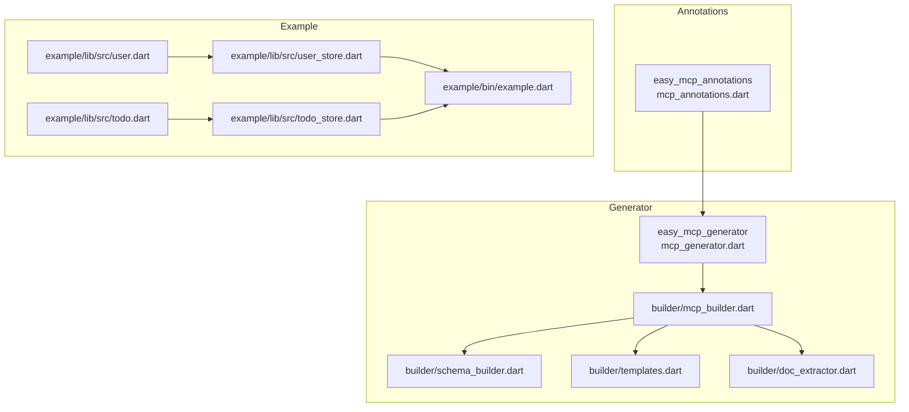
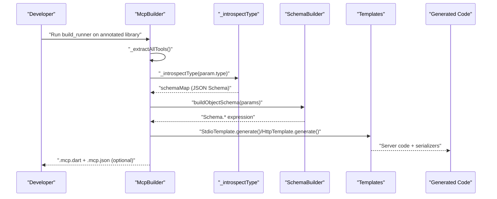
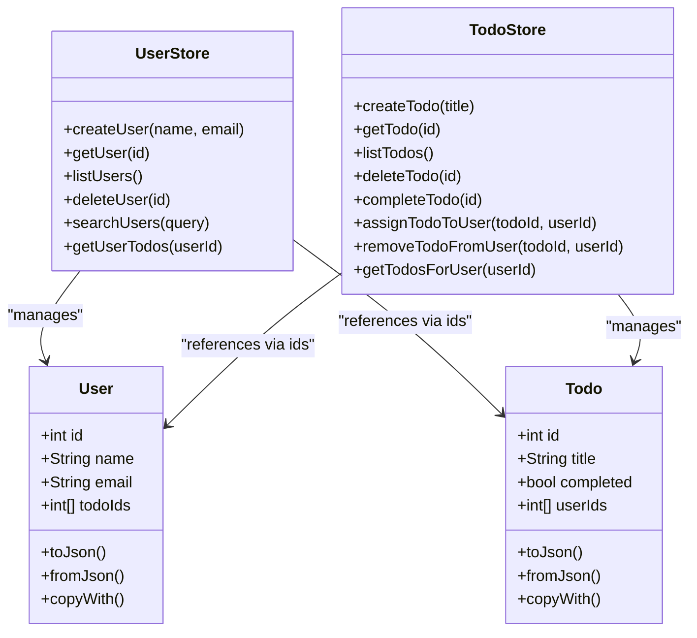
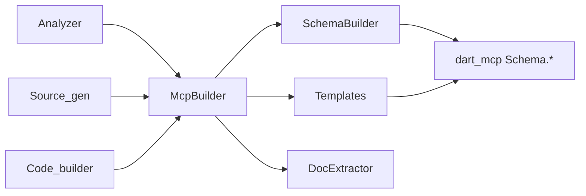

# Type System Integration

<cite>
**Referenced Files in This Document**
- [README.md](file://README.md)
- [pubspec.yaml](file://packages/easy_mcp_annotations/pubspec.yaml)
- [pubspec.yaml](file://packages/easy_mcp_generator/pubspec.yaml)
- [mcp_annotations.dart](file://packages/easy_mcp_annotations/lib/mcp_annotations.dart)
- [mcp_generator.dart](file://packages/easy_mcp_generator/lib/mcp_generator.dart)
- [mcp_builder.dart](file://packages/easy_mcp_generator/lib/builder/mcp_builder.dart)
- [schema_builder.dart](file://packages/easy_mcp_generator/lib/builder/schema_builder.dart)
- [templates.dart](file://packages/easy_mcp_generator/lib/builder/templates.dart)
- [doc_extractor.dart](file://packages/easy_mcp_generator/lib/builder/doc_extractor.dart)
- [user.dart](file://example/lib/src/user.dart)
- [todo.dart](file://example/lib/src/todo.dart)
- [user_store.dart](file://example/lib/src/user_store.dart)
- [todo_store.dart](file://example/lib/src/todo_store.dart)
- [example.dart](file://example/bin/example.dart)
</cite>

## Table of Contents
1. [Introduction](#introduction)
2. [Project Structure](#project-structure)
3. [Core Components](#core-components)
4. [Architecture Overview](#architecture-overview)
5. [Detailed Component Analysis](#detailed-component-analysis)
6. [Dependency Analysis](#dependency-analysis)
7. [Performance Considerations](#performance-considerations)
8. [Troubleshooting Guide](#troubleshooting-guide)
9. [Conclusion](#conclusion)

## Introduction
This document explains Easy MCP’s type system integration, focusing on automatic type mapping and schema generation from Dart types to JSON Schema validation rules. It covers primitive and complex type handling, null safety, optional parameters, custom serialization, circular reference protection, and how type information influences both server code generation and schema metadata. It also documents supported and unsupported scenarios with practical workarounds and outlines integration with the broader code generation pipeline.

## Project Structure
The repository is organized into two primary packages and an example application:
- easy_mcp_annotations: Defines the @mcp and @tool annotations used to mark methods for MCP exposure.
- easy_mcp_generator: Implements the build-time code generator that reads annotated methods, introspects their types, generates server code, and optionally emits JSON metadata for schema validation.
- example: Demonstrates real-world usage with typed models and tools.

**Diagram sources**
- [mcp_annotations.dart:1-49](file://packages/easy_mcp_annotations/lib/mcp_annotations.dart#L1-L49)
- [mcp_generator.dart:1-14](file://packages/easy_mcp_generator/lib/mcp_generator.dart#L1-L14)
- [mcp_builder.dart:1-567](file://packages/easy_mcp_generator/lib/builder/mcp_builder.dart#L1-L567)
- [schema_builder.dart:1-99](file://packages/easy_mcp_generator/lib/builder/schema_builder.dart#L1-L99)
- [templates.dart:1-578](file://packages/easy_mcp_generator/lib/builder/templates.dart#L1-L578)
- [doc_extractor.dart:1-106](file://packages/easy_mcp_generator/lib/builder/doc_extractor.dart#L1-L106)
- [user.dart:1-42](file://example/lib/src/user.dart#L1-L42)
- [todo.dart:1-46](file://example/lib/src/todo.dart#L1-L46)
- [user_store.dart:1-144](file://example/lib/src/user_store.dart#L1-L144)
- [todo_store.dart:1-236](file://example/lib/src/todo_store.dart#L1-L236)
- [example.dart:1-67](file://example/bin/example.dart#L1-L67)

**Section sources**
- [README.md:1-120](file://README.md#L1-L120)
- [pubspec.yaml:1-28](file://packages/easy_mcp_annotations/pubspec.yaml#L1-L28)
- [pubspec.yaml:1-35](file://packages/easy_mcp_generator/pubspec.yaml#L1-L35)

## Core Components
- Annotations: @mcp controls transport mode and optional JSON metadata generation flag; @tool annotates functions and classes as MCP tools with optional descriptions/icons.
- Type Introspection: The generator inspects Dart types to produce JSON Schema maps and simplified JSON Schema strings for runtime validation.
- Schema Builder: Translates introspected maps and raw types into dart_mcp Schema.* expressions for compile-time validation.
- Templates: Generate stdio and HTTP server code, including parameter extraction, conversions for complex collections, and result serialization.
- Doc Extraction: Provides basic doc comment parsing and JSON Schema generation for parameter metadata.

Key responsibilities:
- Primitive type mapping to JSON Schema types (string, integer, number, boolean).
- Null safety handling via optional parameters and nullable type detection.
- Collection types (List<T>, Map<K,V>) with special handling for non-primitive inner types.
- Custom class serialization using toJson()/fromJson patterns and cycle detection during introspection.
- Transport selection (stdio vs HTTP) and server scaffolding generation.

**Section sources**
- [mcp_annotations.dart:6-49](file://packages/easy_mcp_annotations/lib/mcp_annotations.dart#L6-L49)
- [mcp_builder.dart:229-440](file://packages/easy_mcp_generator/lib/builder/mcp_builder.dart#L229-L440)
- [schema_builder.dart:1-99](file://packages/easy_mcp_generator/lib/builder/schema_builder.dart#L1-L99)
- [templates.dart:1-578](file://packages/easy_mcp_generator/lib/builder/templates.dart#L1-L578)
- [doc_extractor.dart:1-106](file://packages/easy_mcp_generator/lib/builder/doc_extractor.dart#L1-L106)

## Architecture Overview
The type system integration spans three stages:
1. Annotation discovery and tool extraction.
2. Type introspection to produce JSON Schema maps and simplified JSON Schema strings.
3. Code generation for server implementations and optional JSON metadata.

**Diagram sources**
- [mcp_builder.dart:18-52](file://packages/easy_mcp_generator/lib/builder/mcp_builder.dart#L18-L52)
- [mcp_builder.dart:307-411](file://packages/easy_mcp_generator/lib/builder/mcp_builder.dart#L307-L411)
- [schema_builder.dart:68-98](file://packages/easy_mcp_generator/lib/builder/schema_builder.dart#L68-L98)
- [templates.dart:6-578](file://packages/easy_mcp_generator/lib/builder/templates.dart#L6-L578)

## Detailed Component Analysis

### Primitive Types and Null Safety
- Supported primitives: String, int, double/num, bool, DateTime (mapped to string with date-time format), dynamic, and generic Map/List.
- Null safety:
  - Optional parameters are detected via analyzer-provided parameter flags and reflected in both JSON Schema and generated code.
  - Nullable Dart types (ending with ?) are handled by stripping the ? for matching and retaining nullability in generated casts.
  - JSON Schema “required” arrays exclude optional parameters.
- JSON Schema mapping:
  - Simplified mapping is produced for quick validation checks.
  - Full introspection yields precise schema maps including nested structures.

Practical implications:
- Optional parameters in generated handlers receive nullable casts and safe defaulting in templates.
- JSON metadata reflects required fields accurately.

**Section sources**
- [mcp_builder.dart:413-440](file://packages/easy_mcp_generator/lib/builder/mcp_builder.dart#L413-L440)
- [mcp_builder.dart:442-468](file://packages/easy_mcp_generator/lib/builder/mcp_builder.dart#L442-L468)
- [templates.dart:54-62](file://packages/easy_mcp_generator/lib/builder/templates.dart#L54-L62)
- [templates.dart:312-325](file://packages/easy_mcp_generator/lib/builder/templates.dart#L312-L325)

### Complex Types: Generic Handling, Nested Objects, Collections
- Generic type handling:
  - List<T>: Mapped to array with items schema derived from T. Non-primitive T triggers conversion logic in templates.
  - Map<K,V>: Mapped to object; introspection does not recurse into value types.
- Custom classes:
  - Introspection traverses public, non-static, non-private fields to build properties and required fields.
  - Required fields are determined by non-nullable types without default values.
  - Cycle detection prevents infinite recursion by returning a generic object when a type is revisited.
- DateTime:
  - Treated as string with date-time format in JSON Schema.

Runtime conversions:
- For List<T> where T is a custom class, templates generate conversions using T.fromJson for each item, ensuring proper deserialization.

**Section sources**
- [mcp_builder.dart:342-411](file://packages/easy_mcp_generator/lib/builder/mcp_builder.dart#L342-L411)
- [mcp_builder.dart:261-283](file://packages/easy_mcp_generator/lib/builder/mcp_builder.dart#L261-L283)
- [templates.dart:328-341](file://packages/easy_mcp_generator/lib/builder/templates.dart#L328-L341)
- [templates.dart:553-568](file://packages/easy_mcp_generator/lib/builder/templates.dart#L553-L568)

### Custom Serialization and Circular Reference Handling
- Serialization:
  - Generated serializers encode results using toJson() when available, falling back to toString() otherwise.
  - Lists are serialized by mapping each element through its toJson() or string representation.
- Deserialization:
  - For List<T> with custom inner types, templates convert each Map<String,dynamic> into T using T.fromJson.
  - Imports for inner types are collected and injected into generated code.
- Circular reference handling:
  - Introspection tracks visited types and returns a generic object when cycles are detected, preventing stack overflow and infinite schemas.

**Section sources**
- [templates.dart:154-173](file://packages/easy_mcp_generator/lib/builder/templates.dart#L154-L173)
- [templates.dart:465-484](file://packages/easy_mcp_generator/lib/builder/templates.dart#L465-L484)
- [mcp_builder.dart:363-366](file://packages/easy_mcp_generator/lib/builder/mcp_builder.dart#L363-L366)

### Type Validation Enforcement and Runtime Behavior
- Compile-time validation:
  - SchemaBuilder converts introspected maps into dart_mcp Schema.* expressions, enabling compile-time validation of inputs.
- Runtime validation:
  - Generated handlers extract arguments with appropriate casts and optional handling.
  - Exceptions are caught and returned as error responses with isError flag set.
- JSON metadata:
  - When enabled via @mcp(generateJson: true), the generator emits a .mcp.json file containing tool input schemas for external consumers.

**Section sources**
- [schema_builder.dart:29-66](file://packages/easy_mcp_generator/lib/builder/schema_builder.dart#L29-L66)
- [templates.dart:101-115](file://packages/easy_mcp_generator/lib/builder/templates.dart#L101-L115)
- [mcp_builder.dart:442-468](file://packages/easy_mcp_generator/lib/builder/mcp_builder.dart#L442-L468)

### Integration with the Broader Code Generation Pipeline
- Annotation scanning:
  - The builder locates @Mcp and @tool annotations across the library and its imports, aggregating tools from package-local imports.
- Tool extraction:
  - Extracts function/class methods annotated with @tool, capturing descriptions, parameter metadata, and async flags.
- Schema generation:
  - Produces both JSON Schema maps for deep validation and simplified JSON Schema strings for quick checks.
- Server generation:
  - Generates stdio and HTTP server scaffolding, including parameter extraction, conversions, and result serialization.
- JSON metadata:
  - Emits .mcp.json with tool definitions and input schemas when requested.

**Section sources**
- [mcp_builder.dart:18-52](file://packages/easy_mcp_generator/lib/builder/mcp_builder.dart#L18-L52)
- [mcp_builder.dart:112-166](file://packages/easy_mcp_generator/lib/builder/mcp_builder.dart#L112-L166)
- [mcp_builder.dart:442-468](file://packages/easy_mcp_generator/lib/builder/mcp_builder.dart#L442-L468)

### Examples of Supported and Unsupported Scenarios

Supported scenarios:
- Primitive parameters (String, int, double, bool) with optional flags.
- Optional parameters with nullable casts in generated handlers.
- List<String>, List<int>, List<double>, List<bool> remain as List with generic items.
- List<T> where T is a custom class: conversion via T.fromJson is generated; imports for T are injected.
- Custom classes with public, non-static, non-private fields; required fields inferred from non-nullable types.
- DateTime mapped to string with date-time format.
- Async tools with Future return types.

Unsupported or limited scenarios:
- Map<K,V> introspection does not recurse into value types; both K and V are treated generically.
- Unions or intersection types are not explicitly handled; they fall back to generic object mapping.
- Cyclic references in deeply nested structures are handled conservatively by returning generic object for repeated types.

Workarounds:
- For Map<K,V> requiring strict validation, define a dedicated custom class with explicit fields and use that class instead of raw Map.
- For unions, introduce a sealed hierarchy or wrapper class and rely on custom serialization.
- For complex nested structures, prefer flattening or introducing intermediate DTOs to avoid deep nesting and potential cycles.

**Section sources**
- [mcp_builder.dart:354-357](file://packages/easy_mcp_generator/lib/builder/mcp_builder.dart#L354-L357)
- [mcp_builder.dart:363-366](file://packages/easy_mcp_generator/lib/builder/mcp_builder.dart#L363-L366)
- [templates.dart:328-341](file://packages/easy_mcp_generator/lib/builder/templates.dart#L328-L341)

### Practical Example: User and Todo Stores
The example demonstrates:
- Custom classes with toJson()/fromJson and copyWith patterns.
- Tools that accept and return complex types, including lists of custom objects.
- Cross-store operations that modify both User and Todo collections, triggering cache invalidation and persistence updates.

**Diagram sources**
- [user.dart:1-42](file://example/lib/src/user.dart#L1-L42)
- [todo.dart:1-46](file://example/lib/src/todo.dart#L1-L46)
- [user_store.dart:55-142](file://example/lib/src/user_store.dart#L55-L142)
- [todo_store.dart:69-235](file://example/lib/src/todo_store.dart#L69-L235)

**Section sources**
- [user.dart:1-42](file://example/lib/src/user.dart#L1-L42)
- [todo.dart:1-46](file://example/lib/src/todo.dart#L1-L46)
- [user_store.dart:55-142](file://example/lib/src/user_store.dart#L55-L142)
- [todo_store.dart:69-235](file://example/lib/src/todo_store.dart#L69-L235)

## Dependency Analysis
The generator depends on:
- Analyzer for AST-based parsing and type introspection.
- Source_gen and code_builder for code generation.
- dart_mcp for server scaffolding and Schema.* expressions.
- Optional shelf for HTTP transport generation.

**Diagram sources**
- [pubspec.yaml:10-19](file://packages/easy_mcp_generator/pubspec.yaml#L10-L19)
- [mcp_builder.dart:1-11](file://packages/easy_mcp_generator/lib/builder/mcp_builder.dart#L1-L11)
- [schema_builder.dart:1-2](file://packages/easy_mcp_generator/lib/builder/schema_builder.dart#L1-L2)
- [templates.dart:1-4](file://packages/easy_mcp_generator/lib/builder/templates.dart#L1-L4)

**Section sources**
- [pubspec.yaml:1-35](file://packages/easy_mcp_generator/pubspec.yaml#L1-L35)

## Performance Considerations
- AST traversal and type introspection scale with the number of annotated tools and parameter depth; keep tool signatures concise.
- JSON encoding/decoding overhead is minimal but can increase with large collections; consider pagination or streaming for very large datasets.
- Template generation injects conversions only when needed (non-primitive List inner types), avoiding unnecessary overhead.

## Troubleshooting Guide
Common issues and resolutions:
- Missing imports for custom List inner types:
  - Ensure the inner type is imported in the generated server; the builder collects and injects imports automatically.
- Unexpected generic object schemas for Map or complex nested structures:
  - Define dedicated DTOs with explicit fields for stricter validation.
- Runtime exceptions during deserialization:
  - Generated handlers catch errors and return them as isError responses; inspect logs for details.
- Optional parameter mismatches:
  - Verify parameter flags and ensure optional parameters are handled with nullable casts in templates.

**Section sources**
- [mcp_builder.dart:261-283](file://packages/easy_mcp_generator/lib/builder/mcp_builder.dart#L261-L283)
- [templates.dart:328-341](file://packages/easy_mcp_generator/lib/builder/templates.dart#L328-L341)
- [templates.dart:101-115](file://packages/easy_mcp_generator/lib/builder/templates.dart#L101-L115)

## Conclusion
Easy MCP’s type system integration provides robust automatic mapping from Dart types to JSON Schema, enabling precise validation and safe runtime handling. It supports primitives, optional parameters, collections, and custom classes with careful serialization and circular reference safeguards. The generator’s pipeline integrates seamlessly with the build system, producing both server scaffolding and optional JSON metadata for tool consumers. By following the recommended patterns and workarounds, developers can achieve strong type safety and predictable behavior across stdio and HTTP transports.