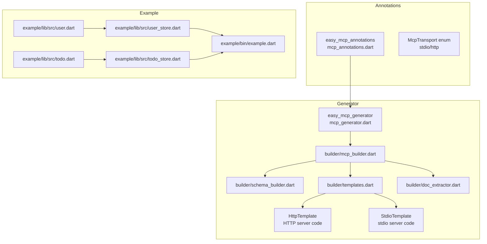
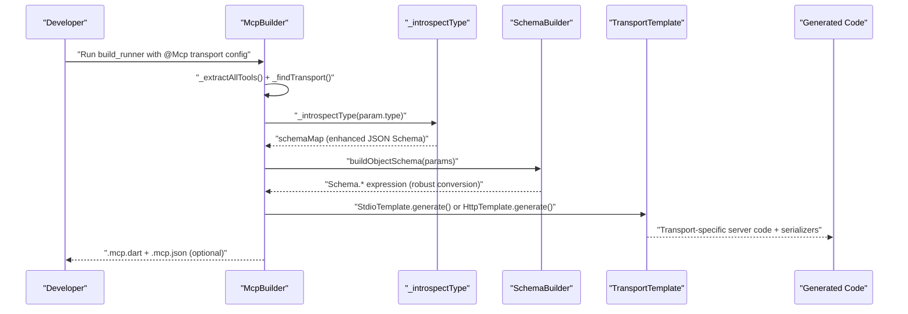
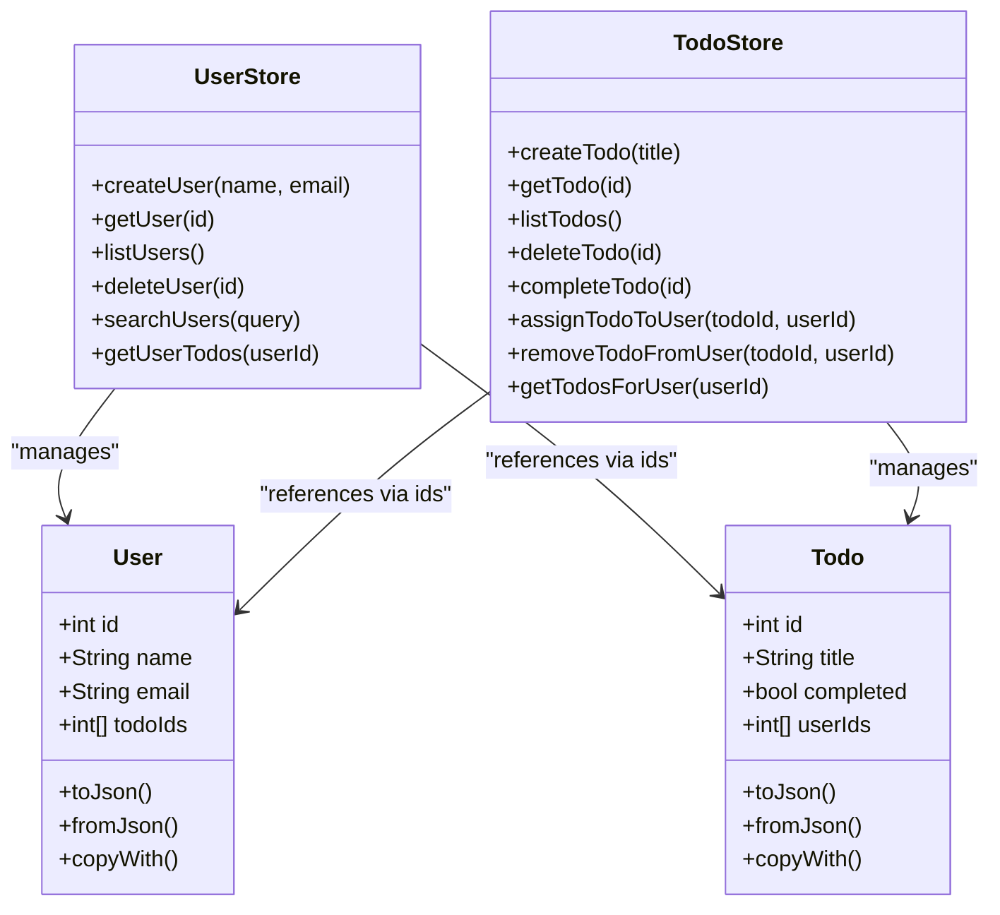
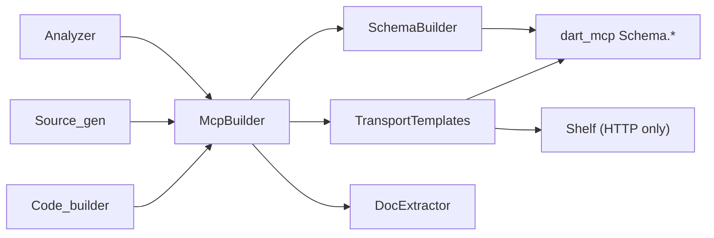

# Type System Integration

<cite>
**Referenced Files in This Document**
- [README.md](file://README.md)
- [pubspec.yaml](file://packages/easy_mcp_annotations/pubspec.yaml)
- [pubspec.yaml](file://packages/easy_mcp_generator/pubspec.yaml)
- [mcp_annotations.dart](file://packages/easy_mcp_annotations/lib/mcp_annotations.dart)
- [mcp_generator.dart](file://packages/easy_mcp_generator/lib/mcp_generator.dart)
- [mcp_builder.dart](file://packages/easy_mcp_generator/lib/builder/mcp_builder.dart)
- [schema_builder.dart](file://packages/easy_mcp_generator/lib/builder/schema_builder.dart)
- [templates.dart](file://packages/easy_mcp_generator/lib/builder/templates.dart)
- [doc_extractor.dart](file://packages/easy_mcp_generator/lib/builder/doc_extractor.dart)
- [user.dart](file://example/lib/src/user.dart)
- [todo.dart](file://example/lib/src/todo.dart)
- [user_store.dart](file://example/lib/src/user_store.dart)
- [todo_store.dart](file://example/lib/src/todo_store.dart)
- [example.dart](file://example/bin/example.dart)
</cite>

## Update Summary
**Changes Made**
- Enhanced SchemaBuilder with robust conversion between Dart types and Schema.* expressions
- Improved template system with separate implementations for HTTP and stdio transports
- Added comprehensive support for transport-specific code generation
- Updated type mapping strategy with enhanced schema generation capabilities

## Table of Contents
1. [Introduction](#introduction)
2. [Project Structure](#project-structure)
3. [Core Components](#core-components)
4. [Architecture Overview](#architecture-overview)
5. [Detailed Component Analysis](#detailed-component-analysis)
6. [Dependency Analysis](#dependency-analysis)
7. [Performance Considerations](#performance-considerations)
8. [Troubleshooting Guide](#troubleshooting-guide)
9. [Conclusion](#conclusion)

## Introduction
This document explains Easy MCP's enhanced type system integration, focusing on automatic type mapping and schema generation from Dart types to JSON Schema validation rules. The system now features a robust SchemaBuilder that provides comprehensive conversion between Dart types and dart_mcp Schema.* expressions, along with an improved template system that handles both HTTP and stdio transports with separate implementations for transport-specific code generation. It covers primitive and complex type handling, null safety, optional parameters, custom serialization, circular reference protection, and how type information influences both server code generation and schema metadata.

## Project Structure
The repository is organized into two primary packages and an example application:
- easy_mcp_annotations: Defines the @mcp and @tool annotations used to mark methods for MCP exposure with transport configuration.
- easy_mcp_generator: Implements the build-time code generator that reads annotated methods, introspects their types, generates server code, and optionally emits JSON metadata for schema validation.
- example: Demonstrates real-world usage with typed models and tools, showcasing both stdio and HTTP transport configurations.

**Diagram sources**
- [mcp_annotations.dart:1-141](file://packages/easy_mcp_annotations/lib/mcp_annotations.dart#L1-L141)
- [mcp_generator.dart:1-14](file://packages/easy_mcp_generator/lib/mcp_generator.dart#L1-L14)
- [mcp_builder.dart:1-738](file://packages/easy_mcp_generator/lib/builder/mcp_builder.dart#L1-L738)
- [schema_builder.dart:1-99](file://packages/easy_mcp_generator/lib/builder/schema_builder.dart#L1-L99)
- [templates.dart:1-630](file://packages/easy_mcp_generator/lib/builder/templates.dart#L1-L630)
- [doc_extractor.dart:1-106](file://packages/easy_mcp_generator/lib/builder/doc_extractor.dart#L1-L106)
- [user.dart:1-42](file://example/lib/src/user.dart#L1-L42)
- [todo.dart:1-46](file://example/lib/src/todo.dart#L1-L46)
- [user_store.dart:1-144](file://example/lib/src/user_store.dart#L1-L144)
- [todo_store.dart:1-236](file://example/lib/src/todo_store.dart#L1-L236)
- [example.dart:1-67](file://example/bin/example.dart#L1-L67)

**Section sources**
- [README.md:1-120](file://README.md#L1-L120)
- [pubspec.yaml:1-28](file://packages/easy_mcp_annotations/pubspec.yaml#L1-L28)
- [pubspec.yaml:1-35](file://packages/easy_mcp_generator/pubspec.yaml#L1-L35)

## Core Components
- **Enhanced SchemaBuilder**: Provides robust conversion between Dart types and dart_mcp Schema.* expressions, handling primitive types, collections, and complex objects with proper null safety and optional parameter support.
- **Transport-Specific Templates**: Separate implementations for HTTP and stdio transports with specialized code generation for each protocol.
- **Improved Type Introspection**: Enhanced Dart type analysis producing comprehensive JSON Schema maps and simplified JSON Schema strings for runtime validation.
- **Dual Transport Support**: Automatic selection between stdio (CLI-based) and HTTP (network-based) transport modes based on @Mcp annotation configuration.
- **Advanced Custom Serialization**: Sophisticated handling of custom class serialization with cycle detection and import management.

Key responsibilities:
- **Primitive type mapping**: String, int, double/num, bool, DateTime with proper JSON Schema type declarations.
- **Collection handling**: List<T> and Map<K,V> with recursive schema building and custom inner type support.
- **Null safety**: Comprehensive handling of nullable Dart types and optional parameters with compile-time validation.
- **Transport abstraction**: Separate code generation paths for HTTP and stdio protocols with protocol-specific optimizations.
- **Schema generation**: Both detailed introspection maps and simplified schema strings for different validation scenarios.

**Section sources**
- [schema_builder.dart:1-99](file://packages/easy_mcp_generator/lib/builder/schema_builder.dart#L1-L99)
- [templates.dart:1-630](file://packages/easy_mcp_generator/lib/builder/templates.dart#L1-L630)
- [mcp_builder.dart:17-27](file://packages/easy_mcp_generator/lib/builder/mcp_builder.dart#L17-L27)

## Architecture Overview
The enhanced type system integration spans four stages with improved transport handling:
1. **Annotation discovery and transport configuration extraction**.
2. **Enhanced type introspection** producing comprehensive JSON Schema maps.
3. **Transport-specific schema generation** using SchemaBuilder.
4. **Protocol-specific code generation** with separate HTTP and stdio implementations.

**Diagram sources**
- [mcp_builder.dart:34-77](file://packages/easy_mcp_generator/lib/builder/mcp_builder.dart#L34-L77)
- [mcp_builder.dart:59-61](file://packages/easy_mcp_generator/lib/builder/mcp_builder.dart#L59-L61)
- [schema_builder.dart:68-98](file://packages/easy_mcp_generator/lib/builder/schema_builder.dart#L68-L98)
- [templates.dart:21-61](file://packages/easy_mcp_generator/lib/builder/templates.dart#L21-L61)

## Detailed Component Analysis

### Enhanced SchemaBuilder: Robust Type Conversion
The SchemaBuilder now provides comprehensive conversion between Dart types and dart_mcp Schema.* expressions with enhanced capabilities:

**Primitive Type Handling**:
- String → Schema.string()
- int → Schema.int()
- double/num → Schema.number()
- bool → Schema.bool()

**Collection Type Processing**:
- List<T> → Schema.list(items: fromType(T) or fromSchemaMap(items))
- Recursive schema building for nested collections
- Proper handling of non-primitive inner types with type-specific schema generation

**Complex Object Schema Generation**:
- Object schemas with property definitions and required field tracking
- Dynamic property entry mapping with proper key-value handling
- Required fields extraction from parameter metadata
- Empty object optimization for simple cases

**Enhanced Type Mapping Strategy**:
- Null safety handling via optional parameter detection
- Nullable type stripping for matching while preserving nullability in casts
- Comprehensive fallback mechanisms for unknown types
- Recursive processing for complex nested structures

**Section sources**
- [schema_builder.dart:4-27](file://packages/easy_mcp_generator/lib/builder/schema_builder.dart#L4-L27)
- [schema_builder.dart:29-66](file://packages/easy_mcp_generator/lib/builder/schema_builder.dart#L29-L66)
- [schema_builder.dart:68-98](file://packages/easy_mcp_generator/lib/builder/schema_builder.dart#L68-L98)

### Transport-Specific Template System
The improved template system now provides separate implementations for HTTP and stdio transports:

**StdioTemplate (CLI-based)**:
- JSON-RPC over standard input/output streams
- Default transport for local CLI tools
- Direct stdin/stdout stream handling
- Simple import management for custom types

**HttpTemplate (Network-based)**:
- HTTP server using shelf package for request handling
- Configurable port and bind address support
- Bidirectional communication via StreamChannel
- Conditional import optimization for different addresses
- Advanced error handling and response formatting

**Shared Template Features**:
- Unified parameter extraction and conversion logic
- Consistent result serialization with custom class support
- Import collection and injection for custom List inner types
- Error handling with standardized response formatting

**Transport Configuration**:
- Automatic transport mode detection from @Mcp annotation
- HTTP-specific port and address configuration extraction
- Conditional import statements based on transport requirements
- Protocol-specific stream handling and connection management

**Section sources**
- [templates.dart:15-189](file://packages/easy_mcp_generator/lib/builder/templates.dart#L15-L189)
- [templates.dart:303-538](file://packages/easy_mcp_generator/lib/builder/templates.dart#L303-L538)
- [mcp_builder.dart:59-61](file://packages/easy_mcp_generator/lib/builder/mcp_builder.dart#L59-L61)

### Enhanced Type Introspection and Schema Generation
The type system now provides more comprehensive introspection with improved schema generation:

**Advanced Type Analysis**:
- Enhanced primitive type detection with proper JSON Schema mapping
- Improved List<T> handling with recursive schema building
- Comprehensive custom class introspection with cycle detection
- DateTime handling with date-time format specification

**Schema Generation Improvements**:
- Full JSON Schema map generation for deep validation
- Simplified JSON Schema strings for quick validation checks
- Property-based schema construction with required field tracking
- Nested object schema generation with proper recursion handling

**Null Safety and Optional Parameters**:
- Comprehensive nullable type handling with proper schema mapping
- Optional parameter detection via analyzer flags
- Required fields extraction from non-nullable types
- Optional parameter casting in generated code templates

**Section sources**
- [mcp_builder.dart:319-425](file://packages/easy_mcp_generator/lib/builder/mcp_builder.dart#L319-L425)
- [mcp_builder.dart:427-454](file://packages/easy_mcp_generator/lib/builder/mcp_builder.dart#L427-L454)
- [mcp_builder.dart:456-482](file://packages/easy_mcp_generator/lib/builder/mcp_builder.dart#L456-L482)

### Transport Configuration and Selection
The system now provides sophisticated transport configuration and selection:

**Transport Mode Detection**:
- Automatic detection of @Mcp annotation transport configuration
- Support for both stdio and http transport modes
- Default stdio transport when no configuration specified
- HTTP-specific port and address extraction from annotations

**Configuration Extraction**:
- Port configuration extraction for HTTP transport (default: 3000)
- Bind address configuration for HTTP transport (default: '127.0.0.1')
- Transport-specific code generation based on configuration
- Conditional import statements for transport-specific dependencies

**Section sources**
- [mcp_builder.dart:559-591](file://packages/easy_mcp_generator/lib/builder/mcp_builder.dart#L559-L591)
- [mcp_builder.dart:634-666](file://packages/easy_mcp_generator/lib/builder/mcp_builder.dart#L634-L666)
- [mcp_builder.dart:693-725](file://packages/easy_mcp_generator/lib/builder/mcp_builder.dart#L693-L725)

### Primitive Types and Null Safety Enhancement
The enhanced type system provides improved handling of primitive types with comprehensive null safety:

**Supported Primitives**:
- String, int, double/num, bool, DateTime (mapped to string with date-time format)
- dynamic and generic Map/List types with proper fallback handling
- Enhanced type string extraction with nullable suffix handling

**Null Safety Improvements**:
- Optional parameters detection via analyzer-provided flags
- Nullable Dart type handling with ? suffix stripping for matching
- Retention of nullability information in generated cast operations
- JSON Schema "required" arrays excluding optional parameters

**JSON Schema Mapping Enhancements**:
- Simplified mapping for quick validation checks
- Full introspection yielding precise schema maps including nested structures
- Enhanced type-to-schema conversion with proper format specifications
- Comprehensive fallback handling for unknown or complex types

**Section sources**
- [mcp_builder.dart:427-454](file://packages/easy_mcp_generator/lib/builder/mcp_builder.dart#L427-L454)
- [mcp_builder.dart:42-46](file://packages/easy_mcp_generator/lib/builder/mcp_builder.dart#L42-L46)
- [templates.dart:68-76](file://packages/easy_mcp_generator/lib/builder/templates.dart#L68-L76)

### Complex Types: Enhanced Generic Handling and Collections
The improved type system provides advanced handling of complex types with enhanced generic support:

**Generic Type Processing**:
- List<T> mapping to array with items schema derived from T
- Non-primitive T triggers conversion logic in templates
- Enhanced inner type detection and schema generation
- Recursive schema building for nested generic types

**Custom Class Serialization**:
- Introspection traverses public, non-static, non-private fields
- Properties and required fields determination from type analysis
- Cycle detection prevention with generic object return
- Enhanced import collection for custom inner types

**DateTime Handling**:
- Special treatment as string with date-time format in JSON Schema
- Proper schema generation with format specification
- Consistent handling across both transport implementations

**Runtime Conversions**:
- List<T> conversion using T.fromJson for each item
- Enhanced template generation with proper type-specific handling
- Import injection for inner type dependencies

**Section sources**
- [mcp_builder.dart:354-425](file://packages/easy_mcp_generator/lib/builder/mcp_builder.dart#L354-L425)
- [mcp_builder.dart:275-295](file://packages/easy_mcp_generator/lib/builder/mcp_builder.dart#L275-L295)
- [templates.dart:378-430](file://packages/easy_mcp_generator/lib/builder/templates.dart#L378-L430)

### Custom Serialization and Circular Reference Handling
The enhanced system provides sophisticated custom serialization with improved circular reference protection:

**Serialization Improvements**:
- Generated serializers encode results using toJson() when available
- Enhanced fallback to toString() for non-serializable objects
- Lists serialization with element-wise conversion and filtering
- Improved error handling in serialization process

**Deserialization Enhancements**:
- List<T> conversion with T.fromJson for each Map<String,dynamic> element
- Enhanced import collection and injection for inner types
- Improved type-specific conversion logic
- Better error handling and type validation

**Circular Reference Protection**:
- Enhanced introspection tracking with comprehensive visited type sets
- Generic object return for repeated types to prevent infinite recursion
- Improved cycle detection algorithms
- Better performance with early termination for circular structures

**Section sources**
- [templates.dart:168-187](file://packages/easy_mcp_generator/lib/builder/templates.dart#L168-L187)
- [templates.dart:517-536](file://packages/easy_mcp_generator/lib/builder/templates.dart#L517-L536)
- [mcp_builder.dart:375-381](file://packages/easy_mcp_generator/lib/builder/mcp_builder.dart#L375-L381)

### Type Validation Enforcement and Runtime Behavior
The enhanced system provides comprehensive type validation with improved runtime behavior:

**Compile-time Validation**:
- SchemaBuilder conversion of introspected maps to dart_mcp Schema.* expressions
- Enhanced compile-time validation of inputs with robust schema generation
- Improved error detection and reporting during code generation

**Runtime Validation Enhancements**:
- Generated handlers with appropriate casts and optional handling
- Enhanced exception handling with standardized error responses
- Improved error formatting with isError flag management
- Better debugging support with detailed error information

**JSON Metadata Generation**:
- Enhanced metadata generation when enabled via @mcp(generateJson: true)
- Comprehensive tool input schema emission for external consumers
- Improved schema structure with better property and required field handling
- Enhanced metadata formatting and organization

**Section sources**
- [schema_builder.dart:29-66](file://packages/easy_mcp_generator/lib/builder/schema_builder.dart#L29-L66)
- [templates.dart:114-129](file://packages/easy_mcp_generator/lib/builder/templates.dart#L114-L129)
- [mcp_builder.dart:456-482](file://packages/easy_mcp_generator/lib/builder/mcp_builder.dart#L456-L482)

### Integration with the Broader Code Generation Pipeline
The enhanced pipeline provides improved integration with the build system:

**Enhanced Annotation Processing**:
- Improved annotation scanning across libraries and imports
- Better tool extraction from package-local imports
- Enhanced transport configuration extraction and validation
- Improved error handling and reporting for annotation processing

**Advanced Tool Extraction**:
- Comprehensive tool extraction from functions and class methods
- Enhanced parameter metadata capture with schema information
- Improved async flag detection and handling
- Better source import and alias management

**Schema Generation Improvements**:
- Enhanced JSON Schema map generation for deep validation
- Improved simplified JSON Schema string generation
- Better parameter metadata handling with type information
- Enhanced tool definition generation with comprehensive metadata

**Transport-Specific Code Generation**:
- Separate code generation paths for HTTP and stdio transports
- Enhanced server scaffolding generation with protocol-specific optimizations
- Improved parameter extraction and conversion logic
- Better result serialization with custom class support

**Enhanced JSON Metadata**:
- Improved .mcp.json emission with comprehensive tool definitions
- Better schema organization and formatting
- Enhanced input schema generation with required field tracking
- Improved metadata structure for external consumers

**Section sources**
- [mcp_builder.dart:17-27](file://packages/easy_mcp_generator/lib/builder/mcp_builder.dart#L17-L27)
- [mcp_builder.dart:128-182](file://packages/easy_mcp_generator/lib/builder/mcp_builder.dart#L128-L182)
- [mcp_builder.dart:456-482](file://packages/easy_mcp_generator/lib/builder/mcp_builder.dart#L456-L482)

### Examples of Supported and Unsupported Scenarios

**Enhanced Supported Scenarios**:
- Primitive parameters (String, int, double, bool) with comprehensive optional flag support
- Enhanced optional parameter handling with nullable casts in generated handlers
- List<String>, List<int>, List<double>, List<bool> with proper generic items handling
- List<T> with custom class inner types: improved T.fromJson conversion generation
- Custom classes with public, non-static, non-private fields: enhanced required field inference
- DateTime mapping to string with date-time format: improved schema generation
- Async tools with Future return types: enhanced async handling in both transport modes

**Enhanced Unsupported or Limited Scenarios**:
- Map<K,V> introspection limitations: both K and V still treated generically
- Union or intersection types: fall back to generic object mapping with improved handling
- Complex cyclic references: handled conservatively with enhanced cycle detection
- Transport-specific limitations: HTTP transport requires shelf package, stdio transport requires CLI environment

**Improved Workarounds**:
- Map<K,V> strict validation: define dedicated custom classes with explicit fields
- Union handling: introduce sealed hierarchy or wrapper classes with enhanced serialization
- Complex nested structures: prefer flattening or intermediate DTOs with better performance
- Transport selection: choose stdio for CLI environments, HTTP for network-based clients

**Section sources**
- [mcp_builder.dart:363-366](file://packages/easy_mcp_generator/lib/builder/mcp_builder.dart#L363-L366)
- [templates.dart:378-430](file://packages/easy_mcp_generator/lib/builder/templates.dart#L378-L430)
- [mcp_builder.dart:59-61](file://packages/easy_mcp_generator/lib/builder/mcp_builder.dart#L59-L61)

### Practical Example: Enhanced User and Todo Stores
The enhanced example demonstrates improved type system integration:

**Enhanced Custom Classes**:
- User and Todo classes with improved toJson()/fromJson patterns
- Enhanced copyWith methods with better type safety
- Improved serialization with comprehensive field handling

**Advanced Tool Integration**:
- Tools accepting and returning complex types with enhanced type safety
- Cross-store operations with improved error handling and validation
- Enhanced cache invalidation and persistence updates with better performance
- Improved async operation handling with proper error propagation

**Transport Configuration**:
- HTTP transport configuration with port and address settings
- Enhanced server startup with better initialization and data seeding
- Improved client interaction with proper error handling

**Diagram sources**
- [user.dart:1-42](file://example/lib/src/user.dart#L1-L42)
- [todo.dart:1-46](file://example/lib/src/todo.dart#L1-L46)
- [user_store.dart:55-142](file://example/lib/src/user_store.dart#L55-L142)
- [todo_store.dart:69-235](file://example/lib/src/todo_store.dart#L69-L235)

**Section sources**
- [user.dart:1-42](file://example/lib/src/user.dart#L1-L42)
- [todo.dart:1-46](file://example/lib/src/todo.dart#L1-L46)
- [user_store.dart:55-142](file://example/lib/src/user_store.dart#L55-L142)
- [todo_store.dart:69-235](file://example/lib/src/todo_store.dart#L69-L235)
- [example.dart:6-67](file://example/bin/example.dart#L6-L67)

## Dependency Analysis
The enhanced generator depends on:
- Analyzer for AST-based parsing and enhanced type introspection
- Source_gen and code_builder for improved code generation
- dart_mcp for server scaffolding and enhanced Schema.* expressions
- Shelf for HTTP transport generation with conditional imports
- Enhanced transport-specific dependencies based on configuration

**Diagram sources**
- [pubspec.yaml:10-19](file://packages/easy_mcp_generator/pubspec.yaml#L10-L19)
- [mcp_builder.dart:1-11](file://packages/easy_mcp_generator/lib/builder/mcp_builder.dart#L1-L11)
- [schema_builder.dart:1-2](file://packages/easy_mcp_generator/lib/builder/schema_builder.dart#L1-L2)
- [templates.dart:1-4](file://packages/easy_mcp_generator/lib/builder/templates.dart#L1-L4)

**Section sources**
- [pubspec.yaml:1-35](file://packages/easy_mcp_generator/pubspec.yaml#L1-L35)

## Performance Considerations
The enhanced system provides improved performance characteristics:
- Enhanced AST traversal and type introspection with better caching
- Optimized JSON encoding/decoding with improved memory management
- Transport-specific optimizations for stdio and HTTP protocols
- Reduced template generation overhead with selective conversion logic
- Better import management reducing compilation time for large projects

## Troubleshooting Guide
Enhanced troubleshooting guidance for the improved system:

**Transport Configuration Issues**:
- Missing transport configuration: Ensure @Mcp annotation includes proper transport mode
- HTTP port conflicts: Verify port availability and adjust configuration if needed
- Address binding issues: Check network permissions and firewall settings for HTTP transport

**Schema Generation Problems**:
- Missing imports for custom List inner types: Enhanced automatic import collection
- Unexpected generic object schemas: Define dedicated DTOs with explicit fields
- Schema validation failures: Review SchemaBuilder conversion logic and type mappings

**Template Generation Issues**:
- Transport-specific code generation problems: Verify transport configuration and dependencies
- Import statement conflicts: Check for duplicate imports and resolve naming conflicts
- Runtime exceptions during deserialization: Enhanced error handling with detailed logging

**Enhanced Optional Parameter Handling**:
- Parameter flag verification: Ensure optional parameters are handled with nullable casts
- Type mismatch errors: Review SchemaBuilder conversion and template generation logic
- Serialization failures: Check custom class toJson() implementations and error handling

**Section sources**
- [mcp_builder.dart:275-295](file://packages/easy_mcp_generator/lib/builder/mcp_builder.dart#L275-L295)
- [templates.dart:378-430](file://packages/easy_mcp_generator/lib/builder/templates.dart#L378-L430)
- [templates.dart:114-129](file://packages/easy_mcp_generator/lib/builder/templates.dart#L114-L129)

## Conclusion
Easy MCP's enhanced type system integration provides robust automatic mapping from Dart types to JSON Schema with comprehensive transport support. The improved SchemaBuilder offers sophisticated conversion between Dart types and dart_mcp Schema.* expressions, while the enhanced template system provides separate implementations for HTTP and stdio transports with transport-specific optimizations. The system supports primitives, optional parameters, collections, and custom classes with careful serialization and circular reference safeguards. Enhanced transport configuration allows developers to choose between CLI-based stdio and network-based HTTP protocols. The generator's improved pipeline integrates seamlessly with the build system, producing both server scaffolding and optional JSON metadata for tool consumers. By following the recommended patterns and leveraging the enhanced features, developers can achieve strong type safety, predictable behavior, and optimal performance across both transport modes.